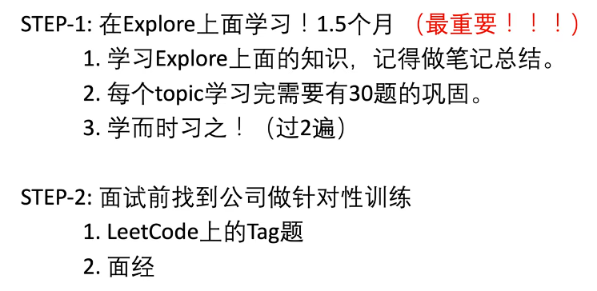

## 0.绪论

> 理想公司=>字节：和优秀的人一起做有挑战的事！

`明确：考的不是智商，是熟练度。`

- 代码 
- **背模型**
- 题目

> 算法知识点-1.干嘛的，什么时候用，原理是什么 2.积累题型。**参考**：[郭大神](https://www.bilibili.com/read/cv9904414)，[Y总](https://space.bilibili.com/7836741)

<!--more-->

#### [我刷题总结的笔记](conclusion/刷题总结.xlsx)

