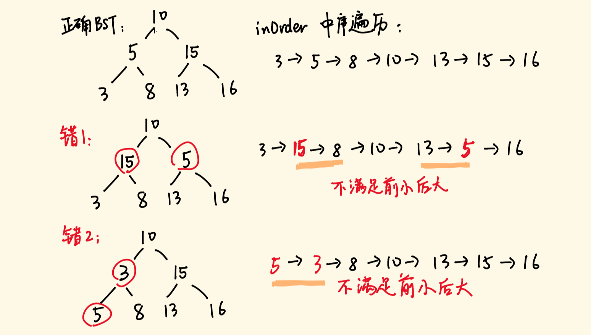
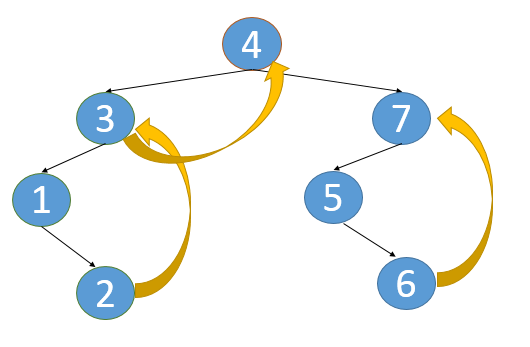
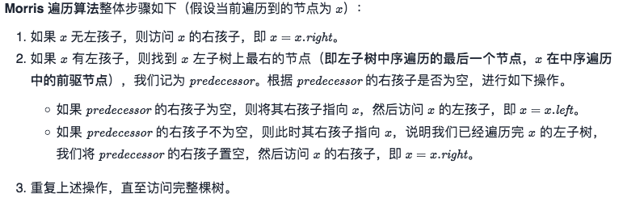
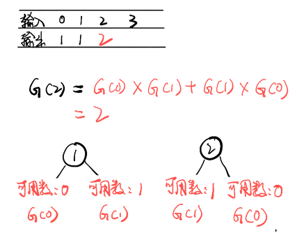
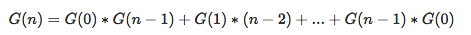
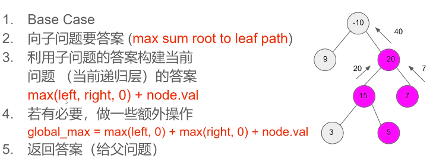
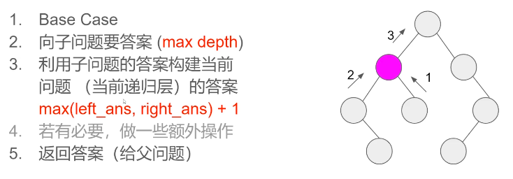
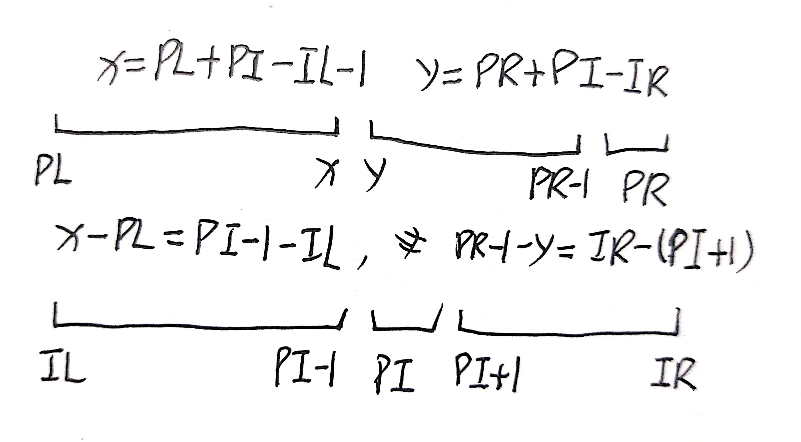
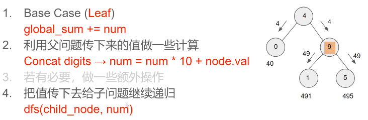
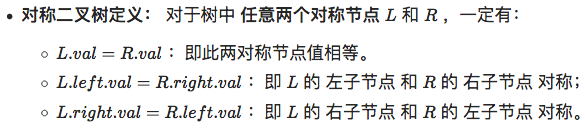

# 1.二叉树

> 二叉树：

<!--more-->

### 遍历系列

#### 二叉树遍历：迭代统一版本

**中序**

```C++
//栈：访问逆序
class Solution {
public:
    vector<int> inorderTraversal(TreeNode* root) {
        vector<int> result;
        stack<TreeNode*> st;
        if (root != NULL) st.push(root);
        while (!st.empty()) {
            TreeNode* node = st.top();
            if (node != NULL) {
                st.pop(); // 将该节点弹出，避免重复操作，下面再将右中左节点添加到栈中
                if (node->right) st.push(node->right);  // 添加右节点（空节点不入栈）

                st.push(node); // 添加根节点
                st.push(NULL); // 根节点访问过，但是还没有处理，加入空节点做为标记。

                if (node->left) st.push(node->left);    // 添加左节点（空节点不入栈）
            } else { // 只有遇到空节点的时候，才将下一个节点放进结果集
                st.pop();           // 将空节点弹出
                node = st.top();    // 重新取出栈中元素
                st.pop();
                result.push_back(node->val); // 加入到结果集
            }
        }
        return result;
    }
};

```

**中序**

```C++
st.pop(); 
if (node->right) st.push(node->right);  
st.push(node); 
st.push(NULL); 
if (node->left) st.push(node->left);   
```

**前序**

```C++
st.pop(); 
if (node->right) st.push(node->right);  
if (node->left) st.push(node->left);   
st.push(node); 
st.push(NULL); 
```

**后序**

```C++
st.pop(); 
st.push(node); 
st.push(NULL); 
if (node->right) st.push(node->left);  
if (node->left) st.push(node->right);   
```

#### [144. 二叉树的前序遍历](https://leetcode-cn.com/problems/binary-tree-preorder-traversal/) ⭐️

```C++
/*前，中，后，主要看根在哪。
根左右
⚠️：当然有些可能是根右左
*/
class Solution {
public:
    void NLR(TreeNode *root, vector<int> &res) {
        if(root == nullptr) return;
        res.push_back(root->val);
        NLR(root->left,res);
        NLR(root->right,res);
    }

    vector<int> preorderTraversal(TreeNode *root) {
        vector<int> res;
        NLR(root,res);
        return res;
    }
};
```

#### [94. 二叉树的中序遍历](https://leetcode-cn.com/problems/binary-tree-inorder-traversal/)

```C++
/*
左根右
*/
class Solution {
public:
    void LNR(TreeNode *root,vector<int> &res){
        if(root == nullptr) return;
        LNR(root->left,res);
        res.push_back(root->val);
        LNR(root->right,res);
    }
    vector<int> inorderTraversal(TreeNode* root) {
        vector<int> res;
        LNR(root,res);
        return res;
    }
};
```

#### [145. 二叉树的后序遍历](https://leetcode-cn.com/problems/binary-tree-postorder-traversal/)

```C++
/*
左右根
*/
class Solution {
public:
    void LRN(TreeNode *root,vector<int> &res){
        if(root == nullptr) return;
        LRN(root->left,res);
        LRN(root->right,res);
        res.push_back(root->val);
    }

    vector<int> postorderTraversal(TreeNode* root) {
        vector<int> res;
        LRN(root,res);
        return res;
    }
};
```

#### [173. 二叉搜索树迭代器](https://leetcode-cn.com/problems/binary-search-tree-iterator/)

```C++
/*
BST用中序遍历
*/
class BSTIterator {
public:
    vector<int> res;
    int index=0;
    void LNR(TreeNode *root,vector<int> &res){
        if(root == nullptr) return;
        LNR(root->left,res);
        res.push_back(root->val);
        LNR(root->right,res);
    }
    BSTIterator(TreeNode* root) {
         LNR(root,res);
    }
    int next() {
        return res[index++];
    }
    bool hasNext() {
        return index >= res.size() ? false:true;
    }
};
```

#### [102. 二叉树的层序遍历](https://leetcode-cn.com/problems/binary-tree-level-order-traversal/) ⭐️

```C++
/*
树的层序遍历--广度优先搜索
思路：
    首先根元素入队
    当队列不为空的时候
        求当前队列的长度 si
        依次从队列中取 si个元素进行拓展，然后进入下一次迭代
它和普通广度优先搜索的区别在于，普通广度优先搜索每次只取一个元素拓展，而这里每次取 si个元素。在上述过程中的第 i 次迭代就得到了二叉树的第 i 层的 si 个元素。
*/
class Solution {
public:
    vector<vector<int>> levelOrder(TreeNode* root) {
        vector<vector<int>> res;        //存储每一层的结点值
        if(root == nullptr) return res;	//注意🈳️树

        queue<TreeNode*> q; //树的队列
        q.push(root);       //根先进入队列
        while(!q.empty()){  //不为空
            int s = q.size();
            res.push_back(vector<int>());   //先放入一个vector<int>
            for(int i=0;i<s;i++){
                auto node=q.front();q.pop();            //取出队头，并删除队头
                res.back().push_back(node->val);        //根结点值存入vector<int>
                if(node->left)  q.push(node->left);     //左结点不空,进入队列
                if(node->right)  q.push(node->right);   //右结点不空,进入队列
            }
        }
        return res;
    }
};
```

#### [543. 二叉树的直径](https://leetcode-cn.com/problems/diameter-of-binary-tree/)

```java
/*
 直径长度任意两个结点路径长度中的最大值
 */
class Solution {
    int ans;
    public int diameterOfBinaryTree(TreeNode root) {
        ans = 0;
        height(root);
        return ans; 
    }
    public int height(TreeNode node) {
        if (node == null) {
            return 0; // 访问到空节点了，返回0
        }
        int L = height(node.left); // 左儿子为根的子树的深度
        int R = height(node.right); // 右儿子为根的子树的深度
        ans = Math.max(ans, L+R); // 计算根节点node的直径即L+R 并更新ans
        return Math.max(L, R) + 1; // 返回该节点为根的子树的深度
    }
}
```


#### [103. 二叉树的锯齿形层序遍历](https://leetcode-cn.com/problems/binary-tree-zigzag-level-order-traversal/)

```C++
/*
思路：根结点的插入顺序不一样。
    如果从左至右，我们每次将被遍历到的元素插入至双端队列的末尾。
    如果从右至左，我们每次将被遍历到的元素插入至双端队列的头部。
*/
class Solution {
public:
    vector<vector<int>> zigzagLevelOrder(TreeNode* root) {
        vector<vector<int>> res;
        if(root == nullptr) return res;

        bool flag = true;   //从左到右
        queue<TreeNode *> q;
        q.push(root);
        while(!q.empty()){
            int s= q.size();
            res.push_back(vector<int>());
            for(int i=0;i<s;i++){
                auto node = q.front();q.pop();
                if(flag) res.back().push_back(node->val);               //插入到最后面
                else res.back().insert(res.back().begin(),node->val);   //插入到最前面
                   
                if(node->left) q.push(node->left);
                if(node->right) q.push(node->right);
            }
            flag=!flag;
        }
        return res;
    }
};
```

#### [107. 二叉树的层序遍历 II](https://leetcode-cn.com/problems/binary-tree-level-order-traversal-ii/)

```C++
/*
题意：返回其节点值自底向上的层序遍历
思路：只需要将每次层序遍历的结点的容器插入到结果最前面就可以了，这样后面遍历的就变成前面的了。
*/
class Solution {
public:
    vector<vector<int>> levelOrderBottom(TreeNode* root) {
       vector<vector<int>> res;
       if(root == nullptr) return res;

       queue<TreeNode *> q;
       q.push(root);
       while(!q.empty()){
           int s = q.size();
           vector<int> t;
           for(int i=0;i<s;i++){
               auto node = q.front();q.pop();
               t.push_back(node->val);
               if(node->left) q.push(node->left);
               if(node->right) q.push(node->right);
           }
           res.insert(res.begin(),t);   //插入到最前面
       }
       return res;
    }
};
```

#### [199. 二叉树的右视图](https://leetcode-cn.com/problems/binary-tree-right-side-view/)

```C++
/*
二叉树的深度遍历和先根遍历基本上是一样的,只是先根遍历有左右之分,而深度遍历没有左右之分

思路1:层序遍历，记录下每层的最后一个元素。
思路2:先序遍历(这里是根右左)，记录下每层的第一个元素。
*/
class Solution {
public:

    vector<int> rightSideView(TreeNode* root) {
        vector<int> res;
        if(root == nullptr) return res;

        queue<TreeNode*> q;
        q.push(root);
        while(!q.empty()){
            int s= q.size();
            for(int i=0;i<s;i++){
                auto node = q.front();q.pop();
                if(i == s - 1) res.push_back(node->val);    //⚠️保存最后一个
                if(node->left) q.push(node->left);
                if(node->right) q.push(node->right);
            }
        }
        return res;
    }
};
```

#### [116. 填充每个节点的下一个右侧节点指针⭐️](https://leetcode-cn.com/problems/populating-next-right-pointers-in-each-node/)


```C++
/*
思路：用层序遍历，这样我们可以在遍历每一层的时候修改这一层节点的 next 指针，这样就可以把每一层都组织成链表。
（初始状态下，所有 next 指针都被设置为 NULL。）
*/
class Solution {
public:
    Node* connect(Node* root) {
        if(root == NULL) return NULL;

        queue<Node*> q;
        q.push(root);
        while(!q.empty()){      //层序遍历
            int s = q.size();
            for(int i=0;i<s;i++){
                auto node = q.front();q.pop();
                if(i < s - 1) node->next = q.front();  //前面的指向后面，front()查询队头元素
                if(node->left) q.push(node->left);
                if(node->right) q.push(node->right);
            }
        }
        return root;
    }
};
```

#### [117. 填充每个节点的下一个右侧节点指针 II](https://leetcode-cn.com/problems/populating-next-right-pointers-in-each-node-ii/) ⭐️


```C++
/*
空间复杂度O(1)
思路：使用已建立的 next 指针，cur 指针利用 next 不停的遍历当前层。
	1）如果 cur 的左右孩子不为 null 就将它接到 tail 后边，然后更新tail。
	2）当 cur 为 null 的时候，再利用 dummy 指针得到下一层的开始节点。
	遍历完每一层。就要将dummy->next赋值给cur
dummy 指针在链表中经常用到，他只是为了处理头结点的情况，它并不属于当前链表。
*/
class Solution {
public:
    Node* connect(Node* root) {
        if(root == NULL) return NULL;
        Node* cur = root;
        while(cur){
            Node* dummy = new Node();
            Node* tail = dummy;  //赋值给tail
            while(cur){
                if(cur->left) {tail->next = cur->left;tail = tail->next;}
                if(cur->right) {tail->next = cur->right;tail= tail->next;}
                cur = cur->next;
            }
            cur = dummy->next; 
        }
        return root;
    }
};
```

#### [剑指 Offer 32 - I. 从上到下打印二叉树](https://leetcode-cn.com/problems/cong-shang-dao-xia-da-yin-er-cha-shu-lcof/)

```
经典中序
```

#### [剑指 Offer 32 - II. 从上到下打印二叉树 II](https://leetcode-cn.com/problems/cong-shang-dao-xia-da-yin-er-cha-shu-ii-lcof/)

```
经典中序
```

#### [剑指 Offer 32 - III. 从上到下打印二叉树 III](https://leetcode-cn.com/problems/cong-shang-dao-xia-da-yin-er-cha-shu-iii-lcof/)

```
同103
```


### BST+中序遍历

#### [98. 验证二叉搜索树](https://leetcode-cn.com/problems/validate-binary-search-tree/) ⭐️

```C++
/*
二叉搜索树
1.左子树上所有结点的值均<它的根结点的值。
2.右子树上所有结点的值均>它的根结点的值。

先序遍历
遍历时，不仅左结点小于根结点，根结点大于右结点。而是要整个左子树<根<右子树。此时需要保存子树的上界和下界。

思路：在递归调用左子树时，我们需要把上界 upper 改为 root.val，即调用 helper(root.left, lower, root.val)，因为左子树里所有节点的值均小于它的根节点的值。
同理递归调用右子树时，我们需要把下界 lower 改为 root.val，即调用 helper(root.right, root.val, upper)。
*/
class Solution {
public:
    bool check(TreeNode* root,long long low,long long high){
        if(root == nullptr) return true;                        //本身空或者遍历完
        if(root->val <= low || root->val >= high) return false; //判断根结点值(是否越界)，再遍历左子树，右子树
        return check(root->left,low,root->val) && check(root->right,root->val,high); 
        
    }
    bool isValidBST(TreeNode* root) {
        return check(root,LONG_MIN,LONG_MAX);//要long long(32,64都是8字节) 
      																			 //或者long(32位 4字节，64位8子节)
    }
};
```

#### [99. 恢复二叉搜索树](https://leetcode-cn.com/problems/recover-binary-search-tree/) ⭐️难







```C++
/*
3种解法：
1.先弄个vector容器。 再摘下“树”上的数据（中序遍历）。 然后vector排序。 再把vector容器里的数据挂在“树上”（中序遍历）。 
时间复杂度：O(N)
空间复杂度：O(N)
2.只用比较前后访问的节点值，prev 保存上一个访问的节点，当前访问的是 root 节点。
每访问一个节点，如果prev.val>=root.val，就找到了一对“错误对”。
检查一下它是第一对错误对，还是第二对错误对。
遍历结束，就确定了待交换的两个错误点，进行交换。
时间复杂度O(N)，N是节点个数
空间复杂度O(H)，递归栈的深度
3. Morris遍历是二叉树遍历算法的超强进阶算法，跟递归、非递归（栈实现）的空间复杂度，Morris遍历可以将非递归遍历中的空间复杂度降为O(1)
Morris遍历利用的是树的叶节点左右孩子为空（树的大量空闲指针），实现空间开销的极限缩减。
*/

//第2种解法
class Solution {
public:
    TreeNode* err1=nullptr;
    TreeNode* err2=nullptr;
    TreeNode* prev=new TreeNode(INT_MIN);	
    void LNR(TreeNode* root){
        if(root == nullptr) return;
        LNR(root->left);
        // 记录第一个错误点
        if(prev->val > root->val && err1 == nullptr) err1 = prev;
        // 第一个错误点已确定,记录第二个错误点
        if(prev->val > root->val && err1 != nullptr) err2 = root;
        prev = root;    //更新prev
        LNR(root->right);
    }
    void recoverTree(TreeNode* root) {
        LNR(root);
        swap(err1->val,err2->val);
    }
};

//第3种解法
class Solution {
public:
    void recoverTree(TreeNode* root) {
        TreeNode *x = nullptr, *y = nullptr, *pred = nullptr, *predecessor = nullptr;

        while (root != nullptr) {
            if (root->left != nullptr) {
                // (1)predecessor 节点就是当前 root 节点向左走一步，然后一直向右走至无法走为止
                predecessor = root->left;
                while (predecessor->right != nullptr && predecessor->right != root) {
                    predecessor = predecessor->right;
                }
                
                // (2)让 predecessor 的右指针指向 root，继续遍历左子树
                if (predecessor->right == nullptr) {
                    predecessor->right = root; 
                    root = root->left;          //访问左孩子
                }
                // (3)说明左子树已经访问完了，我们需要断开链接
                else {
                    //记录错误结点
                    if (pred != nullptr && root->val < pred->val) {
                        x = root;
                        if (y == nullptr) {
                            y = pred;
                        }
                    }

                    pred = root; //更新pred
                    predecessor->right = nullptr; //置为空
                    root = root->right;           //访问右孩子
                }
            }
            // 如果没有左孩子，则直接访问右孩子
            else {
                //记录错误结点
                if (pred != nullptr && root->val < pred->val) {
                    x = root;
                    if (y == nullptr) {
                        y = pred;
                    }
                }

                pred = root;//更新pred
                root = root->right; //直接访问右孩子
            }
        }
        swap(x->val, y->val);
    }
};
```

#### [230. 二叉搜索树中第K小的元素](https://leetcode-cn.com/problems/kth-smallest-element-in-a-bst/)

```C++
/*
 思路：中序遍历完就是一个递增的序列，取出第k个元素就是第k小的元素。
*/
class Solution {
public:
    void LNR(TreeNode *root,vector<int> &res){
        if(root == nullptr) return;
        LNR(root->left,res);
        res.push_back(root->val);
        LNR(root->right,res);
    }
    int kthSmallest(TreeNode* root, int k) {
        vector<int> res;
        LNR(root,res);
        return res[k-1];
    }
};
```

#### [剑指 Offer 54. 二叉搜索树的第k大节点⚠️](https://leetcode-cn.com/problems/er-cha-sou-suo-shu-de-di-kda-jie-dian-lcof/)

```C++
//中序遍历(⚠️这里是右根左，由于是递归)
```


#### [285.二叉搜索树的后续结点⭐️](https://leetcode-cn.com/problems/inorder-successor-in-bst/)

给你一个二叉搜索树和其中的某一个结点，请你找出该结点在树中顺序后继的节点。

结点 p 的后继是值**比 p.val 大**的结点中**键值最小**的结点。

```C++
/*
思路：如果p比当前节点小，说明在左子树，res=root；否则去右子树搜索。
*/
class Solution {
public:
    TreeNode* inorderSuccessor(TreeNode* root, TreeNode* p) {
        TreeNode* res = NULL;
        while (root) {
            if (p->val < root->val) {	
                res = root;					//在左子树的根（同时，键值最小，最左边）⚠️
                root = root->left;
            } else {
                root = root->right;
            }
        }
        return res;
    }
};
```

#### [二叉树的下一个结点⭐️ ](https://www.nowcoder.com/practice/9023a0c988684a53960365b889ceaf5e?tpId=196&tqId=39730&rp=1&ru=/exam/oj&qru=/exam/oj&sourceUrl=%2Fexam%2Foj%3Fpage%3D1%26pageSize%3D50%26search%3D%25E7%25BB%2593%25E7%2582%25B9%26tab%3D%25E7%25AE%2597%25E6%25B3%2595%25E7%25AF%2587%26topicId%3D196&difficulty=undefined&judgeStatus=undefined&tags=&title=%E7%BB%93%E7%82%B9)

```java
public class Solution {
    public TreeLinkNode GetNext(TreeLinkNode pNode) {
        if (pNode.right != null) {
            TreeLinkNode node = pNode.right;    //后继结点：中序遍历的下一个结点
            while (node.left != null)
                node = node.left;
            return node;
        } else {
            while (pNode.next != null) {    //找出其父结点
                TreeLinkNode parent = pNode.next;
                if (parent.left == pNode)    //pNode是parent的左结点
                    return parent;
                pNode = pNode.next;
            }
        }
        return null;
    }
}
```


#### [272.最接近的二叉搜索树值2](https://leetcode-cn.com/problems/closest-binary-search-tree-value-ii/)

```C++
/*

*/
```

#### [剑指 Offer 36. 二叉搜索树与双向链表](https://leetcode-cn.com/problems/er-cha-sou-suo-shu-yu-shuang-xiang-lian-biao-lcof/)

```C++
/*T,S:O(n)
先序遍历：pre暂存前面的结点，head
*/
class Solution {
private:
    Node *pre, *head;   //pre暂存前面的结点
    void dfs(Node* cur) {
        if(cur == nullptr) return;
        dfs(cur->left);
        if(pre != nullptr) pre->right = cur;    //pre->r指向cur
        else head = cur;
        cur->left = pre;                        //cur->l指向pre
        pre = cur;  //更新pre
        dfs(cur->right);
    }
public:
    Node* treeToDoublyList(Node* root) {
        if(root == nullptr) return nullptr;
        dfs(root);
        head->left = pre;   //最后
        pre->right = head;
        return head;
    }
};
```


### 混合

#### [257. 二叉树的所有路径](https://leetcode-cn.com/problems/binary-tree-paths/)

```C++
/*
//T,S:O(n^2) 根左右
思路：先序遍历，发现叶子结点就加入结果集中；没有就继续递归左右子树。
*/

class Solution {
public:
    void getPath(TreeNode* root,string path,vector<string> &res){ //⚠️string类不加&
        if(root == nullptr) return;
        path += to_string(root->val);
        //叶子结点，加入结果
        if(root->left == nullptr && root->right == nullptr){
            res.push_back(path);
        }else{   //不是叶子结点，递归左右子树
            path += "->";
            getPath(root->left,path,res);
            getPath(root->right,path,res);
        }
    }
    vector<string> binaryTreePaths(TreeNode* root) {
        vector<string> res;
        string path;
        getPath(root,path,res);
        return res;       
    }
};
```

#### [270.最接近的二叉搜索树值](https://leetcode-cn.com/problems/closest-binary-search-tree-value/)

```C++
/*

*/
```


#### [255.验证前序遍历序列二叉搜索树](https://leetcode-cn.com/problems/verify-preorder-sequence-in-binary-search-tree/)

```C++

```

#### [114. 二叉树展开为链表](https://leetcode-cn.com/problems/flatten-binary-tree-to-linked-list/)

```C++
/*
思路：先序遍历将二叉树取下来，再遍历一遍变成链表
⚠️：左孩子为空，右孩子赋值当前结点
*/
class Solution {
public:
    void flatten(TreeNode* root) {
        vector<TreeNode*> res;
        NLR(root,res);
        int s =res.size();
        for(int i=1;i<s;i++){
            TreeNode* prev = res[i-1],*cur = res[i];
            prev->left = nullptr;   //前驱结点为空
            prev->right = cur;      //前驱结点的右结点为当前结点
        }
    }
    void NLR(TreeNode* root,vector<TreeNode*> &res){
        if(root == nullptr) return;
        res.push_back(root);
        NLR(root->left,res);
        NLR(root->right,res);
    }
};
```

#### [156.上下翻转二叉树](https://leetcode-cn.com/problems/binary-tree-upside-down/)

```

```

#### [剑指 Offer 37. 序列化二叉树](https://leetcode-cn.com/problems/xu-lie-hua-er-cha-shu-lcof/)

#### [297. 二叉树的序列化与反序列化](https://leetcode-cn.com/problems/serialize-and-deserialize-binary-tree/) ⭐️难

```C++
/*

*/

```

#### [剑指 Offer 33. 二叉搜索树的后序遍历序列](https://leetcode-cn.com/problems/er-cha-sou-suo-shu-de-hou-xu-bian-li-xu-lie-lcof/)

```
//后序遍历，单调栈
//T,S:O(n)
```

### 递归

### 计算个数，通过界定(1,n)求解

#### [95. 不同的二叉搜索树 II](https://leetcode-cn.com/problems/unique-binary-search-trees-ii/)

```C++
/*
题意：给定一个整数 n，生成所有由 1 ... n 为节点所组成的 二叉搜索树 。
思路：
如果我们枚举根节点的值为 i，
那么根据二叉搜索树的性质我们可以知道左子树的节点值的集合为 [1…i−1]，右子树的节点值的集合为 [i+1…n]
再枚举左，右子树，挂到根结点上，将根结点加入到结果集中
*/
class Solution {
public:
    vector<TreeNode*> generateTrees(int st,int ed){
        if(st > ed) return {nullptr};//{nullptr} 长度为1，{}长度为0
        vector<TreeNode*> allTrees;
        for(int i=st;i <= ed; i++){
            //获得所有可行的左子树集合
            vector<TreeNode*> lTrees = generateTrees(st,i-1);
            //获得所有可行的右子树集合
            vector<TreeNode*> rTrees = generateTrees(i+1,ed);
            for(auto& l:lTrees){    //枚举左，右子树，挂到根结点上
                for(auto& r:rTrees){
                    TreeNode* cur = new TreeNode(i);  //根结点
                    allTrees.push_back(cur);
                    cur->left = l;
                    cur->right = r;         
                }
            }
        }
        return allTrees;
    }
    vector<TreeNode*> generateTrees(int n) {
        if(!n) return {};
        return generateTrees(1,n);
    }
};
```

### 先左右后自己

#### [96. 不同的二叉搜索树](https://leetcode-cn.com/problems/unique-binary-search-trees/)





```C++
/*
给定一个整数 n，求以 1 ... n 为节点组成的二叉搜索树有多少种？
卡特兰数G(n)
*/
class Solution {
public:,
    int numTrees(int n) {
        if (n == 0 || n == 1) {
            return 1;
        }
        int res = 0;
        for (int i = 1; i <= n; i++) {
            res += numTrees(i - 1) * numTrees(n - i);
        }
        return res;
    }
};
```

#### [124. 二叉树中的最大路径和](https://leetcode-cn.com/problems/binary-tree-maximum-path-sum/) 🀄️



```C++
/*  从下往上：后序遍历。
题意：给你一个二叉树的根节点 root ，返回其最大路径和
思路：考虑一个二叉树单元：有3种情况：a+b+c,a+b,a+c
    a
   / \
  b   c
递归左右子树，更新3种情况的最大和，返回较大值a+max(b,+c)
*/
class Solution {
public:
    int res = INT_MIN;    
    int maxSum(TreeNode* root){
        if(root == nullptr) return 0;	//base case
        int l = max(maxSum(root->left),0); //子问题:取max，如果结点负数就取0
        int r = max(maxSum(root->right),0);//子问题
        res = max(res,l + r + root->val);	//额外：人字形答案
        return root->val + max(l,r);	//递归
    }
    int maxPathSum(TreeNode* root) {
        maxSum(root);
        return res;
    }
};
```

#### [235. 二叉搜索树的最近公共祖先](https://leetcode-cn.com/problems/lowest-common-ancestor-of-a-binary-search-tree/)

#### [236. 二叉树的最近公共祖先](https://leetcode-cn.com/problems/lowest-common-ancestor-of-a-binary-tree/)

```C++
/*
思路：如果root等于q或者p，或者NULL，直接返回root
递归左子树
递归右子树
左结点，右结点都不为空，返回root（最终答案）
返回 左结点或者右结点，哪个不空返回哪个
*/
class Solution {
public:
    TreeNode* lowestCommonAncestor(TreeNode* root, TreeNode* p, TreeNode* q) {
        if (root == NULL || root == p || root == q) return root;
        TreeNode* l = lowestCommonAncestor(root->left,p,q);
        TreeNode* r = lowestCommonAncestor(root->right,p,q);
        if(l != NULL && r != NULL) return root;	//左右子树不空
        return l!=NULL?l:r;	//哪个不空，返回哪个
    }
};
```

#### [250.统计同值子树](https://leetcode-cn.com/problems/count-univalue-subtrees/)

给定一个二叉树，统计该二叉树数值相同的子树个数。

同值子树是指该子树的所有节点都拥有相同的数值。

示例：

输入: root = [5,1,5,5,5,null,5]

```
          5
         / \
        1   5
       / \   \
      5   5   5
```

输出: 4

```C++

```

#### [333.最大BST子树](https://leetcode-cn.com/problems/largest-bst-subtree/)

给定一个二叉树，找到其中最大的二叉搜索树（BST）子树，并返回该子树的大小。其中，最大指的是子树节点数最多的。

```C++

```

### 先自己后左右

#### [100. 相同的树](https://leetcode-cn.com/problems/same-tree/)

```C++
/*
1.如果两个二叉树都为空，则两个二叉树相同。
2.如果两个二叉树中有且只有一个为空，则两个二叉树一定不相同。

3.如果两个二叉树都不为空，那么首先判断它们的根节点的值是否相同，
4.若不相同则两个二叉树一定不同，若相同，
  再分别判断两个二叉树的左子树是否相同以及右子树是否相同。
  这是一个递归的过程，因此可以使用深度优先搜索，递归地判断两个二叉树是否相同。
*/
class Solution {
public:
    bool isSameTree(TreeNode* p, TreeNode* q) {
        if(p == nullptr && q == nullptr){return true;}      //都为空
        else if( p == nullptr || q == nullptr){return false;}   //1个为空，1个不空
        else if( p->val != q->val){return false;}   //值不相等
        else{return isSameTree(p->left,q->left) && isSameTree(p->right,q->right);} //值相等，递归
    }
};
```

#### [104. 二叉树的最大深度](https://leetcode-cn.com/problems/maximum-depth-of-binary-tree/)

#### [剑指 Offer 55 - I. 二叉树的深度](https://leetcode-cn.com/problems/er-cha-shu-de-shen-du-lcof/) 同上



```C++
/*  从下往上：后序遍历。
思路：如果为空，直接返回0
返回 递归1+max（左子树的深度，右子树的深度）
*/
class Solution {
public:
    int maxDepth(TreeNode* root) {
        if(root == nullptr) return 0;
        return 1+max(maxDepth(root->left),maxDepth(root->right));	//根结点+左右子树的深度
    }
};
```

#### 获取二叉树的结点数

```C++
/*
思路：为空，直接返回0
返回 递归1+左子树+右子树的结点数
*/
int getAllNode(TreeNode* root){
  if(root == NULL) return 0;
	return 1 + getAllNode(root->left)+getAllNode(root->right);
}
```

#### 获取二叉树的叶子结点数

```C++
/*
思路：如果根结点为空，直接返回0
如果左结点和右结点同时为空，直接返回1
返回 递归左子树+右子树的结点数
*/
int leafCount(TreeNode* root){
	if(root == NULL) return 0;
  if(root->left == NULL && root->right == NULL) return 1;
  return leafCount(root->left)+leafCount(root->right);//不包含根结点
}
```

#### 某结点是否在二叉树中

```C++
bool isExist(TreeNode* root,TreeNode* p){
	if(root == NULL) return false;
  if(root->val == p->val) return true;		//根
  if(isExist(root->left,p)) return true;	//左
  else return isExist(root->right,p);			//右
}
```


#### [剑指 Offer 07. 重建二叉树](https://leetcode-cn.com/problems/zhong-jian-er-cha-shu-lcof/)

#### [105. 从前序与中序遍历序列构造二叉树](https://leetcode-cn.com/problems/construct-binary-tree-from-preorder-and-inorder-traversal/) 🀄️


```C++
/*
思路：先序的第一个就是根结点，取出来；
再查找根结点在中序中的位置；
然后递归寻找前序和中序的左区间，右区间。
*/
class Solution {
public:
    unordered_map<int,int> map;
    TreeNode* buildTree(vector<int> &preorder,int preL,int preR,int inL,int inR){
        if(preL > preR || inL > inR) return nullptr;    //超出范围
        int rootVal = preorder[preL];           //先序遍历的第一个是根，取出根结点的值
        int pIndex = map[rootVal];              //查询根在中序序列中的位置
        
        TreeNode* root = new TreeNode(rootVal);  //new根结点
        //前序，中序的左区间 
        root->left = buildTree(preorder,preL+1,pIndex-inL+preL,inL,pIndex-1);
        //前序，中序的右区间
        root->right = buildTree(preorder,pIndex-inL+preL+1,preR,pIndex+1,inR);
        return root;
    }

    TreeNode* buildTree(vector<int>& preorder, vector<int>& inorder) {
        int preLen = preorder.size();   //前序结点数
        int inLen = inorder.size();     //中序结点数
        for(int i=0;i < inLen; i++) map.insert({inorder[i],i});   //哈希先存储中序，查询的时候快
        return buildTree(preorder,0,preLen-1,0,inLen-1);         
    }
};
```

#### [106. 从中序与后序遍历序列构造二叉树](https://leetcode-cn.com/problems/construct-binary-tree-from-inorder-and-postorder-traversal/)



```C++
/*
同105相同的思路
*/
class Solution {
public:
    unordered_map<int,int> map;
    TreeNode* buildTree(vector<int>& postorder,int postL,int postR,int inL,int inR){
        if(postL > postR || inL >inR) return nullptr;  
        int rootVal = postorder[postR];	//取出根结点的值
        int pIndex = map[rootVal];	//查询根在中序序列中的位置
      	TreeNode* root = new TreeNode(rootVal);	//new根结点
				//前序，后序的左区间  以及 //前序，后序的右区间 
        root->left = buildTree(postorder,postL,postL+pIndex-inL-1,inL,pIndex-1);
        root->right = buildTree(postorder,postL+pIndex-inL,postR-1,pIndex+1,inR);
        return root;
    }
    TreeNode* buildTree(vector<int>& inorder, vector<int>& postorder) {
        int inLen = inorder.size();		//后序结点数
        int postLen = postorder.size();		//前序结点数

        for(int i=0;i<inLen;i++) map.insert({inorder[i],i}); //哈希先存储中序，查询的时候快
        return buildTree(postorder,0,postLen-1,0,inLen-1);

    }
};
```

#### [889. 根据前序和后序遍历构造二叉树](https://leetcode-cn.com/problems/construct-binary-tree-from-preorder-and-postorder-traversal/)

#### [108. 将有序数组转换为二叉搜索树](https://leetcode-cn.com/problems/convert-sorted-array-to-binary-search-tree/)

```C++
/*
思路：同109
*/
class Solution {
public:
    TreeNode* buildTree(vector<int>& nums,int l,int r){
        if(l > r) return nullptr;
        int mid = (l+r+1)>>1;
        TreeNode* root = new TreeNode(nums[mid]);
        root->left = buildTree(nums,l,mid-1);
        root->right = buildTree(nums,mid+1,r);
        return root;
    }
    TreeNode* sortedArrayToBST(vector<int>& nums) {
        return buildTree(nums,0,nums.size()-1);
    }
};
```

#### [109. 有序链表转换二叉搜索树](https://leetcode-cn.com/problems/convert-sorted-list-to-binary-search-tree/) 🀄️

```C++
/*
题意：将有序数组转换为二叉搜索树,并且高度平衡
思路：
构造出的二叉搜索树的中序遍历结果就是链表本身，因此我们可以将分治和中序遍历结合起来，减少时间复杂度。
	中位数节点对应的编号为 mid=left+(right-left)/2+1；
	左右子树对应的编号范围分别为 [left,mid−1] 和 [mid+1,right]。

数组下标0,1,2,3,4 区别 
(r+l+1)/2			(1)	2 1 0 4 3	区间右边优先
l+(r-l)/2			(2)	2 0 1 3 4
*/
class Solution {
public:
    int getLength(ListNode* head){
          int len = 0;
        	while(head){head = head->next;len++;}
        	return len;
    }
    TreeNode*  buildTree(ListNode* &head,int l,int r){//⚠️记得head加&
        if(l > r) return nullptr;
        int mid = (r+l+1)>>1;                    //⚠️中间结点为根结点
        TreeNode* root = new TreeNode();        //根结点
        //中序遍历
        root->left = buildTree(head,l,mid-1);   //递归左子树
        root->val = head->val;                  //⚠️中序必须这里赋值给根结点
        head = head->next;                      //⚠️注意更新head
        root->right = buildTree(head,mid+1,r);  //递归右子树
        return root;
    }
    TreeNode* sortedListToBST(ListNode* head) {
        int len = getLength(head);
        return buildTree(head,0,len-1);
    }
};
```

#### [110. 平衡二叉树](https://leetcode-cn.com/problems/balanced-binary-tree/)

#### [剑指 Offer 55 - II. 平衡二叉树](https://leetcode-cn.com/problems/ping-heng-er-cha-shu-lcof/)

```C++
/*
自顶向下：T:O(n^2)
自底向上：T:O（n^2）
思路：后序遍历：先递归地判断其左右子树是否平衡，再判断以当前节点为根的子树是否平衡
*/
class Solution {
public:
    int height(TreeNode* root){
        if(root ==nullptr) return 0;    //符合
        int l = height(root->left);
        int r = height(root->right);
        if(l == -1 || r == -1 || abs(r-l) > 1) return -1; //不符合
        else return max(l,r)+1;
    }
    bool isBalanced(TreeNode* root) {
        return height(root) >= 0;
    }
};
```

#### [111. 二叉树的最小深度](https://leetcode-cn.com/problems/minimum-depth-of-binary-tree/)

```C++
/*
题意：最小深度是从根节点到最近叶子节点的最短路径上的节点数量。
思路：
找出2个原始状态：为空直接返回0；左右结点为空，返回1；
再递归左子树，右子树的最小深度，取较小的+1就是答案
*/
class Solution {
public:
    int minDepth(TreeNode* root) {
        if(root == nullptr) return 0;
        if(root->left == nullptr && root->right == nullptr) return 1;
        int res = INT_MAX;
        if(root->left) res=min(minDepth(root->left),res);
        if(root->right) res=min(minDepth(root->right),res);
        return 1+res;
    }
};
```

#### [669. 修剪二叉搜索树](https://leetcode-cn.com/problems/trim-a-binary-search-tree/)

```

```


#### [112. 路径总和](https://leetcode-cn.com/problems/path-sum/)

```C++
//T:O(H) S:O(N)
class Solution {
public:
    bool hasPathSum(TreeNode* root, int targetSum) {
        if(root == nullptr) return false;
        if(root->left == nullptr && root->right == nullptr) return targetSum == root->val;
        return hasPathSum(root->left, targetSum - root->val) || hasPathSum(root->right,targetSum-root->val);
    }
};
```

#### [113. 路径总和 II](https://leetcode-cn.com/problems/path-sum-ii/)

#### [剑指 Offer 34. 二叉树中和为某一值的路径](https://leetcode-cn.com/problems/er-cha-shu-zhong-he-wei-mou-yi-zhi-de-lu-jing-lcof/)

```C++
//T:O(n^2) S:O(n)
class Solution {
public:
    vector<vector<int>> res;
    void dfs(TreeNode* root, int targetSum,vector<int> path){
        if (root == nullptr) return;
        path.push_back(root->val);
        targetSum -= root->val;
        if (root->left == nullptr && root->right == nullptr && targetSum == 0) {
            res.push_back(path);
        }
        dfs(root->left, targetSum,path);
        dfs(root->right, targetSum,path);
    }
    vector<vector<int>> pathSum(TreeNode* root, int targetSum) {
        dfs(root,targetSum,vector<int>());
        return res;
    }   
};
```

#### [437. 路径总和 III](https://leetcode-cn.com/problems/path-sum-iii/)

```C++
/*
1.递归：T:O(n^2),S:O(n)
2.前缀和：T,S:O(n)
*/
class Solution {
public:
    int res=0;
    void dfs(TreeNode* root, int targetSum){
        if (root == nullptr) return;
        if (targetSum == root->val) res++;
        dfs(root->left, targetSum-root->val);
        dfs(root->right, targetSum-root->val);
    }
    int pathSum(TreeNode* root, int targetSum) {
        if(root == nullptr) return 0;
        dfs(root,targetSum);    //先递归根结点到叶子结点的路径；再递归子树的路径
        pathSum(root->left,targetSum);
        pathSum(root->right,targetSum);
        return res;
    }
};


```

#### [1110. 删点成林](https://leetcode-cn.com/problems/delete-nodes-and-return-forest/)

```C++
/*T：O(n) S:O(H+N)
思路：先序遍历：如果 node 是root 而且没有被删除，则加入答案
*/
class Solution {
public:
    vector<TreeNode*> result;
    set<int> to_delete_set;
    vector<TreeNode*> delNodes(TreeNode* root, vector<int>& to_delete) {
        for (int i : to_delete) //1.存入set
            to_delete_set.insert(i);
        helper(root, result, to_delete_set, true);
        return result;
    }
    TreeNode* helper(TreeNode* node, vector<TreeNode*>& result, set<int>& to_delete_set, bool is_root) {
        if (node == NULL) return NULL;
        bool deleted = to_delete_set.count(node->val);    //2.判断是否删除
        if (is_root && !deleted) result.push_back(node);    //是根结点且不删除
        node->left = helper(node->left, result, to_delete_set, deleted);
        node->right =  helper(node->right, result, to_delete_set, deleted);
        return deleted ? NULL : node;  //3.
    }
};
```


#### [129. 求根到叶子节点数字之和](https://leetcode-cn.com/problems/sum-root-to-leaf-numbers/) 🀄️



```C++
/*从上到下:先序遍历
思路：
*/
class Solution {
public:
    int res=0;
    void get_sum(TreeNode* root,int num){
        if(root == nullptr) return ;//base case 根结点
        num = root->val+num*10;     
        if(root->left == nullptr && root->right == nullptr) res += num; //base case 叶结点
        
        if(root->left) get_sum(root->left,num);     //子问题
        if(root->right) get_sum(root->right,num);   //子问题
    } 
    int sumNumbers(TreeNode* root) {
        get_sum(root,0);
        return res;
    }
};
```

#### [222. 完全二叉树的节点个数](https://leetcode-cn.com/problems/count-complete-tree-nodes/)

```C++
/*T：O(log⁡2n) S:O(1)
思路：二分查找 + 位运算
*/

```

#### [剑指 Offer 27. 二叉树的镜像](https://leetcode-cn.com/problems/er-cha-shu-de-jing-xiang-lcof/)

#### [226. 翻转二叉树](https://leetcode-cn.com/problems/invert-binary-tree/)

> Q： 为何需要暂存 root的左子节点？
> A： 在递归右子节点 “root.left=mirrorTree(root.right);” 执行完毕后， root.left的值已经发生改变，此时递归左子节点 mirrorTree(root.left) 则会出问题。

```C++
//递归 T，S：O(n)
class Solution {
public:
    TreeNode* invertTree(TreeNode* root) {
        if (root == nullptr) {
            return nullptr;
        }
        TreeNode* left = invertTree(root->left);
        TreeNode* right = invertTree(root->right);
        root->left = right;
        root->right = left;
        return root;
    }
};
```

#### [101. 对称二叉树](https://leetcode-cn.com/problems/symmetric-tree/)

#### [剑指 Offer 28. 对称的二叉树](https://leetcode-cn.com/problems/dui-cheng-de-er-cha-shu-lcof/)



```C++
//T,S:O(n)
class Solution {
public:
    bool check(TreeNode *p, TreeNode *q) {
        if (!p && !q) return true;
        if (!p || !q) return false;
        return p->val == q->val && check(p->left, q->right) && check(p->right, q->left);
    }

    bool isSymmetric(TreeNode* root) {
        return check(root, root);
    }
};

```

#### [298.二叉树最长连续序列](https://leetcode-cn.com/problems/binary-tree-longest-consecutive-sequence/)

```C++
//先序遍历：自顶向下：T,S:O(n)
//先递归根结点length =(parent != null && p.val == parent.val + 1)? length + 1 : 1;再递归左右子树
public int longestConsecutive(TreeNode root) {
    return dfs(root, null, 0);
}

private int dfs(TreeNode p, TreeNode parent, int length) {
    if (p == null) return length;
    length = (parent != null && p.val == parent.val + 1) ? length + 1 : 1;
    return Math.max(length, Math.max(dfs(p.left, p, length),
                                     dfs(p.right, p, length)));
}
```

#### [366.寻找二叉树的叶子结点](https://leetcode-cn.com/problems/find-leaves-of-binary-tree/)

```C++
//T,S:O(n)
//思路：后序遍历，深度从底向上算,叶子结点的深度为0
class Solution {
public:
    vector<vector<int>> res;
    int dfs(TreeNode* root) { //depth从0开始
        if (!root) return -1;	//返回-1,从0开始
        int left = dfs(root->left);
        int right = dfs(root->right);
        int depth = max(left, right) + 1;
        if (depth >= res.size()) res.push_back({});
        res[depth].push_back(root->val);
        return depth;
    }
    vector<vector<int>> findLeaves(TreeNode* root) {
        dfs(root);
        return res;
    }
};
```

#### [572. 另一个树的子树](https://leetcode-cn.com/problems/subtree-of-another-tree/)

```C++
//T:O(s*t) S:O(max{s,t})  树的深度s，t
//思路：转化为检查根结点，左右子树是否相同
class Solution {
public:
    bool isSame(TreeNode* root, TreeNode* subRoot){  //是否相同
        if(!root && !subRoot) return true;//⚠️
        if((!root && subRoot) || (root&&!subRoot) || root->val != subRoot->val) return false;
        return isSame(root->left,subRoot->left) && isSame(root->right, subRoot->right);
    }
    bool isSubtree(TreeNode* root, TreeNode* subRoot) {
        if(root == nullptr) return false;//⚠️
        return isSame(root,subRoot) || isSubtree(root->left,subRoot) || isSubtree(root->right,subRoot);
    }   
};
```

#### [404. 左叶子之和](https://leetcode-cn.com/problems/sum-of-left-leaves/)

```C++
/*T,S:O(n)
思路：先序遍历：res+=左子树的左叶子结点的val
*/
class Solution {
public:
    int res=0;
    TreeNode* NLR(TreeNode* root){
        if(root == nullptr) return nullptr;
        TreeNode* l = NLR(root->left);
        TreeNode* r = NLR(root->right);
        if(l && l->left == nullptr && l->right ==nullptr) res+=l->val;
        return root;
    }
    int sumOfLeftLeaves(TreeNode* root) {
        NLR(root);
        return res;
    }
};
```

#### [513. 找树左下角的值](https://leetcode-cn.com/problems/find-bottom-left-tree-value/)

```C++
/*层次遍历：每次保存第一个值 res=cur
*/
class Solution {
public:
    int findBottomLeftValue(TreeNode* root) {
        queue<TreeNode*> q;
        q.push(root);
        int res=0;
        while(!q.empty()){
            int s=q.size();
            for(int i=0;i<s;i++){
                auto node=q.front();q.pop();
                if(i==0) res = node->val;
                if(node->left) q.push(node->left);
                if(node->right) q.push(node->right);
            }
        }
        return res;
    }
};
```

#### [538. 把二叉搜索树转换为累加树](https://leetcode-cn.com/problems/find-bottom-left-tree-value/)

```C++
/*思路：反序中序遍历
*/
class Solution {
public:
    int sum=0;
    void  RNL(TreeNode* root){
        if(root == nullptr) return;
        RNL(root->right);
        sum += root->val;
        root->val = sum;
        RNL(root->left);
    }
    TreeNode* convertBST(TreeNode* root) {
        RNL(root);
        return root;
    }
};
```

#### [530. 二叉搜索树的最小绝对差](https://leetcode-cn.com/problems/minimum-absolute-difference-in-bst/)

```C++
/*T,S:O(n)
思路：中序遍历，pre，res
*/
class Solution {
public:
    void LNR(TreeNode* root,int &res,int &pre){//⚠️引用
        if(root == nullptr) return;
        LNR(root->left,res,pre);
        if(pre == -1){
            pre = root->val;
        }else{
            res = min(res,root->val-pre);
            pre = root->val;
        }
        LNR(root->right,res,pre);
    }
    int getMinimumDifference(TreeNode* root) {
        int res=INT_MAX,pre=-1;
        LNR(root,res,pre);
        return res;
    }
};
```

#### [897. 递增顺序查找树](https://leetcode-cn.com/problems/increasing-order-search-tree/)

```C++
/*中序遍历：dummyNode，中间改变指向
*/
class Solution {
private:
    TreeNode *resNode;
public:
    void inorder(TreeNode *node) {
        if (node == nullptr) return;
        inorder(node->left);
        resNode->right = node;
        node->left = nullptr;
        resNode = node;     //更新
        inorder(node->right);
    }

    TreeNode *increasingBST(TreeNode *root) {
        TreeNode *dummyNode = new TreeNode(-1);
        resNode = dummyNode;    //dummyNode暂存头指针
        inorder(root);
        return dummyNode->right;
    }
};
```

#### [653. 两数之和 IV - 输入 BST](https://leetcode-cn.com/problems/two-sum-iv-input-is-a-bst/)

```C++
/*哈希表 set.count(target-root->val)
T,S:O(n)
*/
class Solution {
public:
    set<int> my_set;
    bool find(TreeNode* root,int k){
        if(root == nullptr) return false;
        if(my_set.count(k-root->val)) return true;
        my_set.insert(root->val);
        return find(root->left,k) || find(root->right,k);
    } 
    bool findTarget(TreeNode* root, int k) {
        return find(root,k);
    }
};
```

#### [450. 删除二叉搜索树中的节点](https://leetcode-cn.com/problems/delete-node-in-a-bst/)


```C++
/*
思路：1.key>root.val，删除右子树2.<删除左子树 3.相等，root为叶子结点，有右结点，只有左结点*/
class Solution {
public:
    int successor(TreeNode* root) { //中序遍历序列的下一个节点。即比当前节点大的最小节点（后续结点）
        root = root->right;
        while (root->left != nullptr) root = root->left;
        return root->val;
    }
    int predecessor(TreeNode* root) {//中序遍历序列的前一个节点。即比当前节点小的最大节点（前续结点）
        root = root->left;
        while (root->right != nullptr) root = root->right;
        return root->val;
    }

    TreeNode* deleteNode(TreeNode* root, int key) {
        if (root == nullptr) return nullptr;
        if (key > root->val) root->right = deleteNode(root->right, key);
        else if (key < root->val) root->left = deleteNode(root->left, key);
        else {
            if (root->left == nullptr && root->right == nullptr) root = nullptr;
            else if (root->right != nullptr) {
                root->val = successor(root);
                root->right = deleteNode(root->right, root->val);
            }
            else {
                root->val = predecessor(root);
                root->left = deleteNode(root->left, root->val);
            }
        }
        return root;
    }
};
```

#### [剑指 Offer 26. 树的子结构](https://leetcode-cn.com/problems/shu-de-zi-jie-gou-lcof/)

```C++
/*转化为
*/
class Solution {
public:
    bool isSame(TreeNode* root, TreeNode* subRoot){  //是否相同
        if(subRoot == NULL) return true;    //⚠️
        if((!root && subRoot) || (root&&!subRoot) || root->val != subRoot->val) return false;
        return isSame(root->left,subRoot->left) && isSame(root->right, subRoot->right);
    }
    bool isSubStructure(TreeNode* root, TreeNode* subRoot) {
        if(root == NULL || subRoot == NULL ) return false;//⚠️
        return isSame(root,subRoot) || isSubStructure(root->left,subRoot) || isSubStructure(root->right,subRoot);
    }
};
```

#### [剑指 Offer 64. 求1+2+…+n](https://leetcode-cn.com/problems/qiu-12n-lcof/)

```C++
/*
1.递归：逻辑&&   T,S:O(n)
2.
*/
class Solution {
public:
    int sumNums(int n) {
        n && (n += sumNums(n-1));//A && B,A为false时，则不执行B
        return n;
    }
};
```

#### [617.合并二叉树](https://leetcode-cn.com/problems/merge-two-binary-trees)

```C++
/*T,S:O(min⁡(m,n))
思路：先序遍历
*/
class Solution {
public:
    TreeNode* mergeTrees(TreeNode* t1, TreeNode* t2) {
        if (t1 == nullptr) return t2;
        if (t2 == nullptr) return t1;
        auto merged = new TreeNode(t1->val + t2->val);
        merged->left = mergeTrees(t1->left, t2->left);
        merged->right = mergeTrees(t1->right, t2->right);
        return merged;
    }
};
```

#### [654.最大二叉树](https://leetcode-cn.com/problems/maximum-binary-tree)

```C++
/*先序遍历：每次取最大值作为根结点
T,S:O(n)
*/
class Solution {
public:
    TreeNode* constructMaximumBinaryTree(vector<int>& nums) {
        if (!nums.size()) return nullptr;
        auto mid = max_element(nums.begin(), nums.end());// 寻找最大值
        vector<int> l(nums.begin(), mid);           // 构建左/右部分数组
        vector<int> r(mid + 1, nums.end());

        TreeNode* root = new TreeNode(*mid);        // 递归的优美
        root -> left = constructMaximumBinaryTree(l);
        root -> right = constructMaximumBinaryTree(r);
        return root;
    }
};
```

#### [655.输出二叉树](https://leetcode-cn.com/problems/print-binary-tree)

```C++
/*T,S:O(h∗2^h)  h树的高度
思路：先序遍历+二分
*/
class Solution {
public:
    vector<vector<string>> res;
    vector<vector<string>> printTree(TreeNode* root) {
        int m = height(root);
        int n = pow(2, m) -1;
        // 二维vector一致填充好
        for (int i=0; i<m; ++i){
            vector<string> temp;
            for (int i=0; i<n; ++i){
                temp.push_back("");
            }
            res.push_back(temp);
        }
        fill(root, 0, 0, n-1);
        return res;
    }

    void fill(TreeNode* root, int depth, int begin, int end){
        if (!root) return;
        int mid = begin + (end-begin)/2;
        res[depth][mid] = to_string(root->val);
        fill(root->left, depth+1, begin, mid-1);
        fill(root->right, depth+1, mid+1, end);
    }

    int height(TreeNode* root){
        if (!root) return 0;
        return max(height(root->left), height(root->right))+1;
    }
};
```


