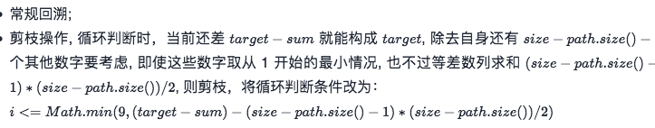
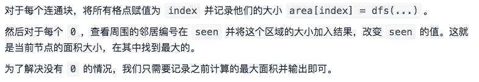
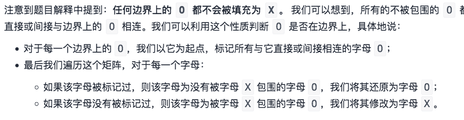
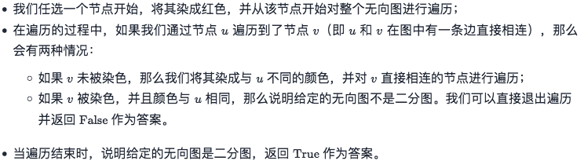
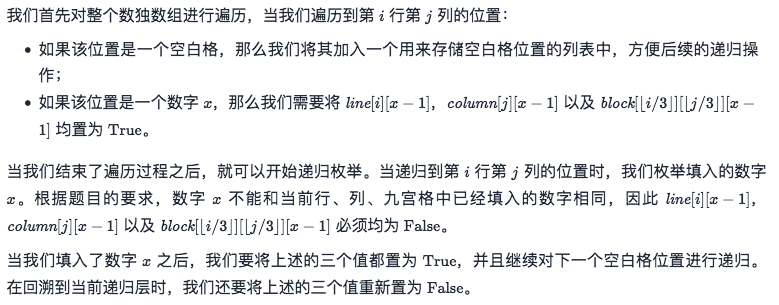
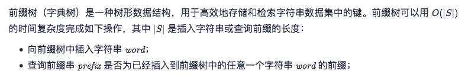
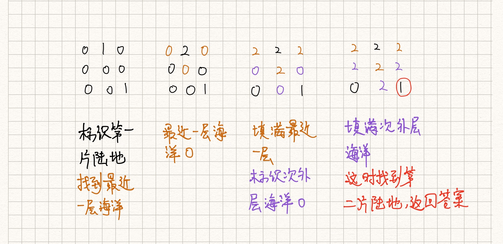

# 2.DFS/BFS+回溯

> 回溯：
>
> DFS：
>
> BFS：

<!--more-->

### 回溯

```C++
模板
res = []
path = []
def backtrack(未探索区域, res, path):
    if 未探索区域满足结束条件:
        res.add(path) # 深度拷贝
        return
    for 选择 in 未探索区域当前可能的选择:
        if 当前选择符合要求:
            path.add(作出选择)
            backtrack(新的未探索区域, res, path)
            path.pop() 撤销选择
```

#### [131. 分割回文串](https://leetcode-cn.com/problems/palindrome-partitioning/) 🀄️

```C++
/*T:O(N∗2^N)  S:O(2^N)
思路：经典回溯
*/
class Solution {
public:
    vector<vector<string>> partition(string s) {
        vector<vector<string>> res;
        backTrack(s,res,{});
        return res;
    }
    void backTrack(string s,vector<vector<string>> &res,vector<string> path){
        if(s.size() == 0){              //空串
            res.push_back(path);        //直接加入结果
            return;
        } 
        for(int i=1;i<=s.size();i++){       //1.遍历所有可能,从1开始
            string pre=s.substr(0,i);       //当前子串  没有取到i
            if(check(pre)){                 //2.满足
                path.push_back(pre);        //3.作出选择 加入
                backTrack(s.substr(i),res,path);    //4.递归 前面的i-1已经匹配，现从i取到结尾
                path.pop_back();        //5.回溯
            }
        }
    }
    bool check(string s){
        int st=0,ed=s.size()-1;
        while(st <= ed){
            if(s[st] != s[ed]) return false;
            st++;ed--;
        }
        return true;
    }
};
```


#### [39. 组合总和](https://leetcode-cn.com/problems/combination-sum/)

```C++
//T:O(S) S可行解的长度  S:O(target)
class Solution {
public:
    vector<vector<int>> res;
    vector<int> output;
    void backTrace(vector<int>& candidates,int x,int len,int target){
        if(target < 0) return;
        if(target == 0) {res.emplace_back(output);return;}
        for(int i=x; i<len;i++){
            output.emplace_back(candidates[i]);             //选择
            backTrace(candidates, i, len, target - candidates[i]);//递归,i⚠️当前数可以重复选择
            output.pop_back();                              //撤销选择
        }
    }
    vector<vector<int>> combinationSum(vector<int>& candidates, int target) {
        int len =candidates.size();
        if(len == 0) return res;
        backTrace(candidates,0,len,target);
        return res;
    }
};
```

#### [40. 组合总和 II](https://leetcode-cn.com/problems/combination-sum-ii/)

```C++
//每个数字在每个组合中只能使用一次。
//T:O(S) S可行解的长度  S:O(target)
class Solution {
public:
    vector<vector<int>> res;
    vector<int> output;
    void dfs(vector<int>& candidates,int x,int len,int target){
        if(target < 0) return;
        if(target == 0) {res.emplace_back(output);return;}
        for(int i=x; i<len;i++){
            if(i>x && candidates[i] == candidates[i-1]) continue;	//剪枝
            output.emplace_back(candidates[i]);             //选择
            dfs(candidates, i+1, len, target - candidates[i]);//递归，i+1
            output.pop_back();                              //撤销选择
        }
    }
    vector<vector<int>> combinationSum2(vector<int>& candidates, int target) {
        int len =candidates.size();
        if(len == 0) return res;
        sort(candidates.begin(),candidates.end());	//为了去重
        dfs(candidates,0,len,target);
        return res;
    }
};
```

#### [216. 组合总和 III](https://leetcode-cn.com/problems/combination-sum-iii/)



```C++
class Solution {
public:
    vector<vector<int>> res;
    vector<int> output;
    void backTrace(int x,int sum,int k,int target){
        if(sum == target && output.size() == k) {
            res.push_back(output);
            return;
        }
        for(int i=x;i<=(9 > (target-sum-(k-output.size()-1)*(k-output.size())/2)?(target-sum-(k-output.size()-1)*(k-output.size())/2):9);i++){ //剪枝
            sum += i;
            output.push_back(i);
            backTrace(i+1,sum,k,target);
            output.pop_back();
            sum -= i;
        }
    }
    vector<vector<int>> combinationSum3(int k, int n) {
        if(k > n) return res;
        backTrace(1,0,k,n);
        return res;
    }
};
```

#### [78. 子集](https://leetcode-cn.com/problems/subsets/)

```C++
//T:O(n*2^n) S:O(n) 
//
class Solution {
public:
    vector<vector<int>> res;
    vector<int> path;
    void backTrace(int x,int len,vector<int>& nums){
        res.push_back(path);
        for(int i=x;i<len;i++){
            path.push_back(nums[i]);
            backTrace(i+1,len,nums);
            path.pop_back();
        }
    }
    vector<vector<int>> subsets(vector<int>& nums) {
        int len =nums.size();
        if(len ==0) return res;
        backTrace(0,len,nums);
        return res;
    }
};
```

#### [90. 子集 II](https://leetcode-cn.com/problems/subsets-ii/)

```C++
//原集合nums包含重复元素
//T:O(n*2^n) S:O(n)
class Solution {
public:
    vector<vector<int>> res;
    void backtrack(vector<int>nums,vector<int>&path,int start)
    {
        res.push_back(path);
        for(int i=start;i<nums.size();i++)
        {
            if(i > start && nums[i] == nums[i-1]) continue;//剪枝，去重⚠️
            path.push_back(nums[i]);//做出选择
            backtrack(nums,path,i+1);//递归进入下一层，注意i+1，标识下一个选择列表的开始位置，最重要的一步
            path.pop_back();//撤销选择
        }
    }

    vector<vector<int>> subsetsWithDup(vector<int>& nums) {
        vector<int> path;
        sort(nums.begin(),nums.end());  //为了去重⚠️
        backtrack(nums,path,0);
        return res;
    }
};
```

#### [77. 组合](https://leetcode-cn.com/problems/combinations/)

```

```


#### [46. 全排列](https://leetcode-cn.com/problems/permutations/)

```C++
//T:O(n*n!) S:O(n)
//nums不重复
class Solution {
public:
    vector<vector<int>> res;
    vector<int> vis;
    void backtrack(vector<int>& nums,int x,int len,vector<int> &perm){
        if(x == len){
            res.emplace_back(perm);
            return;
        }

        for(int i=0;i<len;i++){	//⚠️从0开始固定长度len
            if (vis[i]) {//不重复／没有访问过
                continue;
            }
            vis[i] = 1;
            perm.emplace_back(nums[i]);//作出选择
            backtrack(nums,x+1,len,perm);  //⚠️递归
            vis[i]=0;
            perm.pop_back(); //撤销选择
        }
    }
    vector<vector<int>> permute(vector<int>& nums) {
        vis.resize(nums.size());
        vector<int> perm;
        //sort(nums.begin(), nums.end());
        backtrack(nums,0,nums.size(),perm);
        return res;
    }
};
```

#### [47. 全排列 II](https://leetcode-cn.com/problems/permutations-ii/)

```C++
//T:O(n*n!) S:O(n)
//nums重复数字  
class Solution {
public:
    vector<vector<int>> res;
    vector<int> vis;
    void backtrack(vector<int>& nums,int x,int len,vector<int> &perm){
        if(x == len){
            res.emplace_back(perm);
            return;
        }

        for(int i=0;i<len;i++){
            if (vis[i] || (i > 0 && nums[i] == nums[i - 1] && !vis[i - 1])) {//没有访问过 不重复
                continue;
            }
            vis[i] = 1;
            perm.emplace_back(nums[i]);//作出选择
            backtrack(nums,x+1,len,perm);  //递归
            vis[i]=0;
            perm.pop_back(); //撤销选择
        }
    }
    vector<vector<int>> permuteUnique(vector<int>& nums) {
        vis.resize(nums.size());
        vector<int> perm;
        sort(nums.begin(), nums.end());
        backtrack(nums,0,nums.size(),perm);
        return res;
    }
};
```

#### [剑指 Offer 38. 字符串的排列](https://leetcode-cn.com/problems/zi-fu-chuan-de-pai-lie-lcof/)

```C++
//T:O(n*n!) S:O(n)
//s有重复 同上
class Solution {
public:
    vector<string> res;
    vector<int> vis;
    void backtrack(string &s,int x,int len,string &path){
        if(x == len){
            res.push_back(path);
            return;
        }

        for(int i=0;i<len;i++){
            if (vis[i] || (i > 0 && s[i] == s[i - 1] && !vis[i - 1])) {//不重复／没有访问过
                continue;
            }
            vis[i] = 1;
            path.push_back(s[i]);//作出选择
            backtrack(s,x+1,len,path);  //递归
            vis[i]=0;
            path.pop_back(); //撤销选择
        }
    }
    vector<string> permutation(string s) {
        vis.resize(s.size());
        string path;
        sort(s.begin(), s.end());
        backtrack(s,0,s.size(),path);
        return res;
    }
};
```

#### [784. 字母大小写全排列](https://leetcode-cn.com/problems/letter-case-permutation/)

```C++
//A-Z 65-90 a-z 97-122  0-9 48-57
//搜索 T,S:O(N*2^N)   N字符串长度
class Solution {
public:
    vector<string> res;
    void backTrace(int x,string& s){
        if(x == s.length()){
            res.push_back(s);
            return;
        }
        if(isdigit(s[x])){	//数字直接回溯
            backTrace(x+1,s);
        }else{
            s[x] = tolower(s[x]);	//回溯小写
            backTrace(x+1,s);
            s[x] = toupper(s[x]);//回溯大写
            backTrace(x+1,s);
        }
    }
    vector<string> letterCasePermutation(string s) {
        backTrace(0,s);
        return res;
    }
};
```


#### [剑指 Offer 17. 打印从1到最大的n位数](https://leetcode-cn.com/problems/da-yin-cong-1dao-zui-da-de-nwei-shu-lcof/)

```C++
//递归全排列
//T：O(10^n) S:O(10^n)
class Solution {
    vector<string> res;
    string cur;
    char NUM[10] = {'0', '1', '2', '3', '4', '5', '6', '7', '8', '9'};
    
    // 生成长度为 len 的数字，正在确定第x位（从左往右）
    void backtrack(int x, int len) {
        if(x == len) {
            res.push_back(cur);
            return;
        }
        int start = x==0? 1 : 0; // X=0表示左边第一位数字，不能为0
        for(int i=start; i<10; i++) {
            cur.push_back(NUM[i]); // 确定本位数字
            backtrack(x+1, len); // 确定下一位数字
            cur.pop_back(); // 删除本位数字
        }
    }
public:
    vector<int> printNumbers(int n) {
        for(int i=1; i<=n; i++) // 数字长度：1~n
            backtrack(0, i);

        vector<int> res_int;
        for(int i=0; i<res.size(); i++)
            res_int.push_back(stoi(res[i]));
        return res_int;
    }
};
```

#### [140. 单词拆分 II](https://leetcode-cn.com/problems/word-break-ii/)

```C++
//记忆化搜索
//使用哈希表存储字符串 s 的每个下标和从该下标开始的部分可以组成的句子列表，
//在回溯过程中如果遇到已经访问过的下标，则可以直接从哈希表得到结果，而不需要重复计算。
//T,S:O(n*2^n)
class Solution {
private:
    unordered_map<int, vector<string>> res;
    unordered_set<string> wordSet;  //哈希表，加快

public:
    vector<string> wordBreak(string s, vector<string>& wordDict) {
        wordSet = unordered_set(wordDict.begin(), wordDict.end());
        backtrack(s, 0);
        return res[0];
    }

    void backtrack(const string& s, int x) {
        if (!res.count(x)) {        //没有存过，进入
            if (x == s.size()) {    
                res[x] = {""};      //字符串末尾
                return;
            }
            res[x] = {};
          //由于substr，因此i <= s.size()⚠️
            for (int i = x + 1; i <= s.size(); ++i) {
                string word = s.substr(x, i - x);   //从x开始，截取i-x个
                if (wordSet.count(word)) {  //当前词是否在词典中
                    backtrack(s, i);        //i可重复
                    for (const string& succ: res[i]) {
                        res[x].push_back(succ.empty() ? word : word + " " + succ);
                    }
                }
            }
        }
    }
};
```


#### [267.回文排列  II](https://leetcode-cn.com/problems/palindrome-permutation-ii/)

```

```

#### [401. 二进制手表](https://leetcode-cn.com/problems/binary-watch/)

```C++
class Solution {
public:
    int hours[10] = {1,2,4,8,0,0,0,0,0,0};  //从10个选num个
    int mins[10] = {0,0,0,0,1,2,4,8,16,32};
    vector<string> res;
    void backTrace(int num,int x,int h,int m){
        if(h > 11 | m >59) return;  //不符合
        if(num == 0){   //没有指示灯了
            char tmp[6];    //注意这里要字符数组，不能是 string
            sprintf(tmp,"%d:%02d",h,m);
            res.push_back(tmp);
            return;
        }
        for(int i=x;i<10;i++){
            backTrace(num-1,i+1,h+hours[i],m+mins[i]);
        }

    }
    vector<string> readBinaryWatch(int num) {
        backTrace(num,0,0,0);
        return res;
    }
};
```

#### [17. 电话号码的字母组合](https://leetcode-cn.com/problems/letter-combinations-of-a-phone-number/)

```

```

#### [491. 递增子序列](https://leetcode-cn.com/problems/increasing-subsequences/)

```

```

#### [22. 括号生成](https://leetcode-cn.com/problems/generate-parentheses/)

```

```


### DFS

#### [200. 岛屿数量](https://leetcode-cn.com/problems/number-of-islands/) 🀄️

```C++
/*图DFS
思路：遍历整个地图的1，记得遍历过的1赋值为0，这样就不会重复访问
*/
class Solution {
public:
    int row=0,col=0;
    int dir[4][2]={{0,1},{1,0},{0,-1},{-1,0}};    //4个方向
    int numIslands(vector<vector<char>>& grid) {
        int res = 0;
        row = grid.size();
        col = grid[0].size();
        for(int i=0;i<row;i++)  //遍历所有点
            for(int j=0;j<col;j++)
                if(grid[i][j] == '1'){  //符合条件：dfs
                    res ++;
                    dfs(grid,i,j);
                }
        return res;
    }
    void dfs(vector<vector<char>>& grid,int i,int j){
      if(i < 0 || i >= row|| j<0 ||j >= col || grid[i][j] == '0') return;
        grid[i][j] = '0';       //遍历过了
        for(auto d:dir){				//遍历4个方向
            int x = i + d[0], y = j+ d[1];	
            dfs(grid,x,y);			 //没有越界 dfs
        }
    }
};
```

#### [695. 岛屿的最大面积](https://leetcode-cn.com/problems/max-area-of-island/)

```C++
//T,S:O(ROW*COl)
//
class Solution {
public:
    int dirs[4][2] ={{1,0},{0,1},{0,-1},{-1,0}};
    int dfs(vector<vector<int>>& grid,int i,int j){
        if(i<0 || j<0 || i>=grid.size() || j>=grid[0].size() ||grid[i][j] != 1)//提前返回
            return 0;
        grid[i][j] = 0;
        int res=1;	//当前
        for(auto d:dirs){
            int x=i+d[0],y=j+d[1];
            res += dfs(grid,x,y);
        }
        return res;
    }
    int maxAreaOfIsland(vector<vector<int>>& grid) {
        int res = 0;
        for(int i=0;i<grid.size();i++){
            for(int j=0;j<grid[0].size();j++){
                res = max(res,dfs(grid,i,j)); //取最大的
            }
        }
        return res;
    }
};
```

#### [463. 岛屿的周长](https://leetcode-cn.com/problems/island-perimeter/)

```C++
//DFS. T,S:O(nm)
class Solution {
public:
    int dirs[4][2] ={{0,1},{1,0},{0,-1},{-1,0}};
    int dfs(vector<vector<int>> &grid,int i,int j){
        if(i <0 || i >= grid.size() || j <0 || j>=grid[0].size() || grid[i][j] == 0) return 1;
        if(grid[i][j] == 2) return 0;   //遍历过了
        grid[i][j] = 2;
        int ans = 0;
        for(auto d:dirs){   
            int x=d[0]+i,y=d[1]+j;
            ans += dfs(grid,x,y);   //不用再判断 grid[i][j] == 1
        }
        return ans;
    }

    int islandPerimeter(vector<vector<int>> &grid) {
        int m = grid.size(), n = grid[0].size();
        int res=0;
        for(int i=0;i<m;i++){
            for(int j=0;j<n;j++){
                if(grid[i][j] == 1){
                    res += dfs(grid,i,j);
                  	//res = max(res, dfs(grid,i,j));最大周长
                }
            }
        }
        return res;
    }
};
```

#### [827. 最大人工岛](https://leetcode-cn.com/problems/making-a-large-island/)



```C++
/*直接深搜：T：O(n^4)，超时
对于每个 0，将它变成 1，然后做一次深度优先搜索计算出连通块的大小。答案就是找到的最大连通块。

我们可以通过记录连通块编号来解决这个问题，不同的连通块编号不同。这样，我们就可以累加不同编号的连通块面积和。
T,S：O(n^2)，
*/

```

#### [547. 省份数量](https://leetcode-cn.com/problems/number-of-provinces/)

```C++
//无向图的连通数,T:O(n^2),S:O(n)
class Solution {
public:
    void dfs(vector<vector<int>>& isConnected,vector<int> &visited,int n,int i){
      	visited[i] = true;		//标记当前结点遍历过
        for(int j=0;j<n;j++){   //遍历下一个j
            if(isConnected[i][j] == 1 && !visited[j]){//当前是1，并且没有访问过
                dfs(isConnected,visited,n,j);
            }
        }
    }
    int findCircleNum(vector<vector<int>>& isConnected) {
        int res=0;
        int n = isConnected.size();
        vector<bool> visited(n,false);
        for(int i=0;i<n;i++){   //遍历i
            if(!visited[i]){    //注意没有访问过
              	res++;
                dfs(isConnected,visited,n,i);
            }
        }
        return res;
    }
};
```

#### [841. 钥匙和房间](https://leetcode-cn.com/problems/keys-and-rooms/)

```C++
//T:O(n+m) S:O(n)  n 是房间的数量，m 是所有房间中的钥匙数量的总数。
class Solution {
public:
    int res=0;
    void dfs(vector<bool> &visited,vector<vector<int>>& rooms,int x){
        if(visited[x]) return;
        visited[x] = true;
        res++;
        for(auto &it:rooms[x]){ //遍历当前room[x]的所有钥匙
            dfs(visited,rooms,it);
        }
    }
    bool canVisitAllRooms(vector<vector<int>>& rooms) {
        int n=rooms.size();
        vector<bool> visited(n);
        dfs(visited,rooms,0);
        return res == n;
    }
};
```

#### [剑指 Offer 13. 机器人的运动范围](https://leetcode-cn.com/problems/ji-qi-ren-de-yun-dong-fan-wei-lcof/)

```C++
//T,S:O(mn)
//向下，右遍历：si，sj i，j各自的和。
//si等于9时,递归si+1，此时si=10,和为1，因此si-8=1，和也为1
class Solution {
public:
    int movingCount(int m, int n, int k) {
        vector<vector<bool>> visited(m, vector<bool>(n, 0));
        return dfs(0, 0, 0, 0, visited, m, n, k);
    }
private:
    int dfs(int i, int j, int si, int sj, vector<vector<bool>> &visited, int m, int n, int k) { //剪枝
        if(i >= m || j >= n || k < si + sj || visited[i][j]) return 0;
        visited[i][j] = true;
        return 1 + dfs(i + 1, j, (i + 1) % 10 != 0 ? si + 1 : si - 8, sj, visited, m, n, k) +
                   dfs(i, j + 1, si, (j + 1) % 10 != 0 ? sj + 1 : sj - 8, visited, m, n, k);
    }
};
```

#### [面试题 08.02. 迷路的机器人](https://leetcode.cn/problems/robot-in-a-grid-lcci/)

`java`

```java
class Solution {
    boolean res = false;
    List<List<Integer>> ans = new ArrayList<>();
    void dfs(int[][] grid,int i,int j,int m,int n){
        if(i < 0 || i>=m || j<0 || j>=n || grid[i][j] == 1  || res) return;
        grid[i][j] = 1;
        if(i == m-1 && j == n-1){
            res = true;
            ans.add(Arrays.asList(i, j));
            return;
        }
        ans.add(Arrays.asList(i, j));
        dfs(grid,i,j+1,m,n);
        dfs(grid,i+1,j,m,n);
        if(!res) ans.remove(ans.size()-1);
    }
    public List<List<Integer>> pathWithObstacles(int[][] grid) {
        int m=grid.length,n=grid[0].length;
        dfs(grid,0,0,m,n);
        if(res) return ans;
        else return new ArrayList<>();
    }
}
```

#### [130. 被围绕的区域](https://leetcode-cn.com/problems/surrounded-regions/)



```C++
//T,S:O(m*n)
class Solution {
public:
    int n, m;
	int dirs[4][2] = {{0,1},{1,0},{-1,0},{0,-1}};
    void dfs(vector<vector<char>>& board, int x, int y) {
        if(x < 0 || x >= n || y < 0 || y >= m || board[x][y] != 'O') return;
        board[x][y] = 'A';	//遍历过的赋值
      	for(auto d:dirs){
            int tx=x+d[0],ty=y+d[1];
            dfs(board,tx,ty);
        }
    }

    void solve(vector<vector<char>>& board) {
        n = board.size();
        if (n == 0) {
            return;
        }
        m = board[0].size();
        // 遍历边界
        for (int i = 0; i < n; i++) dfs(board,i,0),dfs(board, i, m - 1);
        for (int i = 1; i < m - 1; i++) dfs(board, 0, i),dfs(board, n - 1, i);
        for (int i = 0; i < n; i++) {
            for (int j = 0; j < m; j++) {
                if (board[i][j] == 'A') { //标志了，恢复了O
                    board[i][j] = 'O';
                } else if (board[i][j] == 'O') {
                    board[i][j] = 'X';
                }
            }
        }
    }
};
```

#### [417. 太平洋大西洋水流问题](https://leetcode-cn.com/problems/pacific-atlantic-water-flow/)

```C++
//逆流而上。T，S：O(m*n)
//对于一个点它能流动两边的大洋，那么反过来，两边大洋的水反着流就能达到这个点。
class Solution {
public:
    vector<vector<int>> P, A, ans;
    int n, m;
    int dirs[4][2]={{1,0},{0,1},{0,-1},{-1,0}};
    vector<vector<int>> pacificAtlantic(vector<vector<int>>& M) {
        n = M.size(), m = M[0].size();
        P = A = vector<vector<int>>(n, vector<int>(m, 0));
        //左右两边加上下两边出发深搜 ⚠️
        for(int i = 0; i < n; ++i) dfs(M, P, i, 0), dfs(M, A, i, m - 1);
        for(int j = 0; j < m; ++j) dfs(M, P, 0, j), dfs(M, A, n - 1, j);             
        return ans;
    }
    void dfs(vector<vector<int>>& M, vector<vector<int>>& visited, int i, int j){        
        if(visited[i][j]) return;
        visited[i][j] = 1;
        if(P[i][j] && A[i][j]) ans.push_back({i,j}); 
        for(auto d:dirs){
            int x = i+d[0],y=j+d[1];
            if(x < 0 || x >= n || y <0 || y>=m || M[x][y] < M[i][j]) continue; 
            dfs(M, visited, x,y);
        }
    }
};

```

#### [332. 重新安排行程](https://leetcode-cn.com/problems/reconstruct-itinerary/)

```C++
/*图DFS
欧拉路径：能否不走重复的路而遍历一个图的所有边。
Hierholzer 算法用于在连通图中寻找欧拉路径，其流程如下：
  从起点出发，进行深度优先搜索。
  每次沿着某条边从某个顶点移动到另外一个顶点的时候，都需要删除这条边。
  如果没有可移动的路径，则将所在节点加入到栈中，并返回。
*/
class Solution {
public:
    unordered_map<string,priority_queue<string,vector<string>,greater<string>>> map;    //哈希表<string,小根堆>
    vector<string> res;     //结果集
    void dfs(string cur){
        while(map.count(cur) && map[cur].size() > 0){    //遍历当前结点的所有下一个结点
            string tmp = map[cur].top();    //取出下一个结点
            map[cur].pop();                 //删除
            dfs(tmp);                       //以下一个结点：dfs
        } 
        res.emplace_back(cur);              //将当前结点加入结果集中
    }
    vector<string> findItinerary(vector<vector<string>>& tickets) {
        for(auto &tk:tickets) map[tk[0]].push(tk[1]); //初始化
        dfs("JFK");
        reverse(res.begin(),res.end());	//由于递归，结果集需要反转
        return res;
    }
};
```

#### [785. 判断二分图](https://leetcode-cn.com/problems/is-graph-bipartite/)



```C++
/*T:O(m+n) S:O(n)
二分图 定义：如果能将一个图的节点集合分割成两个独立的子集 A 和 B ，并使图中的每一条边的两个节点一个来自 A 集合，一个来自 B 集合，就将这个图称为 二分图 。(转化为图着色问题：连接的2点着色不同)
输入：graph = [[1,3],[0,2],[1,3],[0,2]]
输出：true
解释：可以将节点分成两组: {0, 2} 和 {1, 3} 。
*/
class Solution {
private:
    static constexpr int UNCOLORED = 0;
    static constexpr int RED = 1;
    static constexpr int GREEN = 2;
    bool valid;
public:
    void dfs(int node, int c, const vector<vector<int>>& graph,vector<int>& color) {
        color[node] = c;//u
        int next = (c == RED ? GREEN : RED);
        for (int neighbor: graph[node]) {
            if (color[neighbor] == UNCOLORED) {  //未染色
                dfs(neighbor, next, graph,color);
                if (!valid) {   //提前退出
                    return;
                }
            }
            else if (color[neighbor] != next) { //当前节点不是设定好next
                valid = false;
                return;
            }
        }
    }

    bool isBipartite(vector<vector<int>>& graph) {
        int n = graph.size();
        vector<int> color(n,UNCOLORED);
        valid = true;
        for (int i = 0; i < n && valid; ++i) {
            if (color[i] == UNCOLORED) {    //未染色
                dfs(i, RED, graph,color);
            }
        }
        return valid;
    }
};

```

#### [60. 排列序列](https://leetcode-cn.com/problems/permutation-sequence/) 第k个排列

```C++
//T:O(N^2) S:O(N) 
//思路：剪枝（已访问，k>叶子结点数）+DFS
class Solution {
public:
    string res;
    vector<int> f;
    vector<bool> vis;
    void dfs(int n,int k,int x){
        if(x == n) return;
        int cnt = f[n-1-x]; //叶子结点个数
        for(int i=1;i<=n;i++){
            if(vis[i]) continue;    //（1）剪枝
            if(k > cnt) { k -= cnt;continue;}   //（2）剪枝
            res += to_string(i);
            vis[i] = true;
            dfs(n,k,x+1);
            //不回溯，没有回头的过程
            return; //后面的数没有必要遍历去尝试了
        }
    }
    string getPermutation(int n, int k) {
        vis = vector<bool>(n,false);
        f = vector<int>(n+1,1);
        for(int i=1;i<=n;i++) f[i] = f[i-1]*i;
        dfs(n,k,0);
        return res;
    }
};
```

#### [254.因子的组合](https://leetcode-cn.com/problems/factor-combinations/)


```C++
//DFS+剪枝
class Solution {
public:
    vector<vector<int>> dfs(int x,int n){
        if(x == 1) return {};
        vector<vector<int>> res;
        int end = int(sqrt(n));         //(1)剪枝点，遍历终点
        for(int i=x;i<=end;i++){
            if(n%i == 0){           
                res.push_back({i,n/i});
                vector<vector<int>> next = dfs(i,n/i);  //(2)剪枝点,从i，不从1开始，避免重复
                for(auto& sub:next){
                    sub.push_back(i);
                    res.push_back(sub);
                }
            }
        }
        return res;
    }
    vector<vector<int>> getFactors(int n) {
        return dfs(2,n);
};
```


#### [207. 课程表](https://leetcode-cn.com/problems/course-schedule/)

```

```

#### [210. 课程表 II](https://leetcode-cn.com/problems/course-schedule-ii/)

```

```

#### [630. 课程表 III](https://leetcode-cn.com/problems/course-schedule-iii/)

```

```


#### [329. 矩阵中的最长递增路径](https://leetcode-cn.com/problems/longest-increasing-path-in-a-matrix/)

```

```

#### [444. 序列重建](https://leetcode-cn.com/problems/sequence-reconstruction/)

```

```

#### [399. 除法求值](https://leetcode-cn.com/problems/evaluate-division/)

```C++
/*图DFS

*/
```


#### [652. 寻找重复的子树](https://leetcode-cn.com/problems/find-duplicate-subtrees/)

```

```

#### [LCP 07. 传递信息](https://leetcode-cn.com/problems/chuan-di-xin-xi/)

```C++
class Solution {
public:
    int numWays(int n, vector<vector<int>> &relation, int k) {
        vector<vector<int>> edges(n); //列表存储边
        for (auto &edge : relation) {
            int src = edge[0], dst = edge[1];
            edges[src].push_back(dst);
        }
        int ways = 0;
        function<void(int, int)> dfs = [&](int index, int steps) { //匿名函数
            if (steps == k && index == n - 1)) {
                ++ways;
                return;
            }
            for (int to : edges[index]) 
                dfs(to, steps + 1);
        };
        dfs(0, 0);
        return ways;
    }
};
```


#### [733. 图像渲染](https://leetcode-cn.com/problems/flood-fill/)

```C++
class Solution {
public:
    const int dx[4] = {1, 0, 0, -1};
    const int dy[4] = {0, 1, -1, 0};
    void dfs(vector<vector<int>>& image, int x, int y, int color, int newColor) {
        if (x < 0 || x >= image.size() || y < 0 || y >= image[0].size() || image[x][y] != color )return;
        image[x][y] = newColor;
        for (int i = 0; i < 4; i++) {
            int mx = x + dx[i], my = y + dy[i];
            dfs(image, mx, my, color, newColor);
        }
        
    }

    vector<vector<int>> floodFill(vector<vector<int>>& image, int sr, int sc, int newColor) {
        int currColor = image[sr][sc];
        if (currColor != newColor) {
            dfs(image, sr, sc, currColor, newColor);
        }
        return image;
    }
};
```

「力扣」第 684 题：[冗余连接](https://leetcode-cn.com/problems/redundant-connection)（中等）；
「力扣」第 1319 题：[连通网络的操作次数](https://leetcode-cn.com/problems/number-of-operations-to-make-network-connected)（中等）；
「力扣」第 1631 题：[最小体力消耗路径](https://leetcode-cn.com/problems/path-with-minimum-effort)（中等）；
「力扣」第 959 题：[由斜杠划分区域](https://leetcode-cn.com/problems/regions-cut-by-slashes)（中等）；
「力扣」第 1202 题：[交换字符串中的元素](https://leetcode-cn.com/problems/smallest-string-with-swaps)（中等）；
「力扣」第 947 题：[移除最多的同行或同列石头](https://leetcode-cn.com/problems/most-stones-removed-with-same-row-or-column)（中等）；
「力扣」第 721 题：[账户合并](https://leetcode-cn.com/problems/accounts-merge)（中等）；
「力扣」第 803 题：[打砖块](https://leetcode-cn.com/problems/bricks-falling-when-hit)（困难）；
「力扣」第 1579 题：[保证图可完全遍历](https://leetcode-cn.com/problems/remove-max-number-of-edges-to-keep-graph-fully-traversable)（困难）;
「力扣」第 778 题：[水位上升的泳池中游泳](https://leetcode-cn.com/problems/swim-in-rising-water)（困难）。

### DFS+回溯

#### [37. 解数独](https://leetcode-cn.com/problems/sudoku-solver/)



```C++
//数独首先行，列，还有 3*3 的方格内数字是 1~9 不能重复。
class Solution {
private:
    bool line[9][9];
    bool column[9][9];
    bool block[3][3][9];
    bool valid;
    vector<pair<int, int>> spaces;

public:
    void dfs(vector<vector<char>>& board, int pos) {
        if (pos == spaces.size()) { //递归出口 
            valid = true;
            return;
        }

        auto [i, j] = spaces[pos];
        for (int digit = 0; digit < 9 && !valid; ++digit) {
            if (!line[i][digit] && !column[j][digit] && !block[i / 3][j / 3][digit]) {
              	board[i][j] = digit + '0' + 1;  //x+1 转换为int
                line[i][digit] = column[j][digit] = block[i / 3][j / 3][digit] = true; //标志
                dfs(board, pos + 1);	//递归
                line[i][digit] = column[j][digit] = block[i / 3][j / 3][digit] = false; //回溯
            }
        }
    }

    void solveSudoku(vector<vector<char>>& board) {
        memset(line, false, sizeof(line));
        memset(column, false, sizeof(column));
        memset(block, false, sizeof(block));
        valid = false;
				
      //初始化棋盘
        for (int i = 0; i < 9; ++i) {
            for (int j = 0; j < 9; ++j) {
                if (board[i][j] == '.') {
                    spaces.emplace_back(i, j);
                }
                else {
                    int digit = board[i][j] - '0' - 1;  //x-1
                    line[i][digit] = column[j][digit] = block[i / 3][j / 3][digit] = true;
                }
            }
        }

        dfs(board, 0);
    }
};
```


#### [51. N 皇后](https://leetcode-cn.com/problems/n-queens/) 🀄️

```C++
//T:O(n!) S:O(n)
const int N = 10; 
class Solution {
public:
    vector<vector<string>> res;
    vector<string> g;
    bool col[N],gd[N*2],rgd[N*2];//列占用，对角占用 反对角占用 
  //N=10,x+y最大为18
    void dfs(int x,int n){	 //从下标为x行开始搜索
        if(x == n){
           res.push_back(g);	//将每个解放入结果集中
           return;
        }
      // x+y=b 正对角线 -x+y(+n)=b>=0负对角线
        for(int y=0;y<n;y++){ //计算x行的皇后应该放在哪一列
            if(!col[y] && !gd[x+y] && !rgd[y-x+n]){
                g[x][y] = 'Q';
                col[y] = gd[x+y] = rgd[y-x+n] = true;//占用两个对角线
                dfs(x+1,n);
                g[x][y] = '.';	//恢复现场，回溯
                col[y] = gd[x+y] = rgd[y-x+n] = false;
            }
        }
    }
    vector<vector<string>> solveNQueens(int n) {
        for(int i = 0; i < n; i++){	//初始化棋盘
            string tmp = "";
            for(int j = 0; j < n; j++) tmp += ".";
            g.push_back(tmp);
        }
        dfs(0,n);	//从第0行开始
        return res;
    }
};
```

#### [52. N皇后 II](https://leetcode-cn.com/problems/n-queens-ii/)

```C++
//上一题改一改就可以了
//T:O(n!) S:O(n)
class Solution {
public:
    int res;
    bool col[10],gd[10*2],rgd[10*2];//列占用，对角占用 反对角占用   
    void dfs(int x,int n){	 //从下标为x行开始搜索
        if(x == n){
            res++;	//将每个解放入结果集中
            return;
        }
        //b =x+y 反对角线 b=y-x (+n) >=0对角线
        for(int y=0;y<n;y++){ //计算x行的皇后应该放在哪一列
            if(!col[y] && !gd[y-x+n] && !rgd[x+y]){
                col[y] = gd[y-x+n] = rgd[x+y] = true;//占用两个对角线
                dfs(x+1,n);
                col[y] = gd[y-x+n] = rgd[x+y] = false;//恢复现场，回溯
            }
        }
    }
    int totalNQueens(int n) {
        dfs(0,n);	//从第0个位置开始搜索
        return res;
    }
};
```


#### [93. 复原 IP 地址](https://leetcode-cn.com/problems/restore-ip-addresses/)

```C++
//T:O(|s|*3^SEG_COUNT) S:O(SEG_COUNT)  ,每一段的位数不会超过 3
class Solution {
private:
    static constexpr int SEG_COUNT = 4; //ip段数

private:
    vector<string> res;
    vector<int> segs;

public:
    void dfs(const string& s, int segId, int segStart) {
        // 如果找到了 4 段 IP 地址并且遍历完了字符串，那么就是一种答案
        if (segId == SEG_COUNT ) {
            if( segStart == s.size()){ //(1)
                string ipAddr;
                for (int i = 0; i < SEG_COUNT; ++i) {
                ipAddr += to_string(segs[i]);
                    if (i != SEG_COUNT - 1) {   //不是最后一个都加'.'
                        ipAddr += ".";
                    }
                }
                res.push_back(move(ipAddr));    //move()只是转移,提高利用效率
            }
            return; //(2)4 段 IP 地址达到了，但是字符串没有遍历完，直接回溯
        }
  
        // (3)如果还没有找到 4 段 IP 地址就已经遍历完了字符串，那么提前回溯
        if (segStart == s.size()) {
            return;
        }

        // (4)由于不能有前导零，如果当前数字为 0，那么这一段 IP 地址只能为 0
        if (s[segStart] == '0') {
            segs[segId] = 0;
            dfs(s, segId + 1, segStart + 1);
        }

        // 一般情况，枚举每一种可能性并递归
        int addr = 0;
        for (int segEnd = segStart; segEnd < s.size(); ++segEnd) {
            addr = addr * 10 + (s[segEnd] - '0');//转化为int
            if (addr > 0 && addr <= 0xFF) {//在0-255范围内就加入
                segs[segId] = addr;
                dfs(s, segId + 1, segEnd + 1);
            } else {
                break;
            }
        }
    }

    vector<string> restoreIpAddresses(string s) {
        segs.resize(SEG_COUNT);
        dfs(s, 0, 0);
        return res;
    }
};

```

#### [79. 单词搜索](https://leetcode-cn.com/problems/word-search/)

#### [剑指 Offer 12. 矩阵中的路径](https://leetcode-cn.com/problems/ju-zhen-zhong-de-lu-jing-lcof/)

```C++
//T: O(MN⋅3^L),S:O(min(L,MN))
class Solution {
public:
    int dirs[4][2]={{1,0},{0,1},{-1,0},{0,-1}};
    bool dfs(vector<vector<char>>& board,int i,int j,string &word,int k,vector<vector<int>> &visited){
        if(board[i][j] != word[k]) return false;    //不同
        if(k == word.length()-1) return true;  //匹配成功

        bool res = false;
        visited[i][j] = true;               //选择
        for (const auto& dir: dirs) {       //递归搜索
            int x = i + dir[0], y = j + dir[1];
            if (x >= 0 && x < board.size() && y >= 0 && y < board[0].size()) {
                if (!visited[x][y]) {
                    bool flag = dfs(board, x, y, word, k + 1,visited);
                    if(flag){	//有一个符合就返回
                        res = true;
                        break;
                    }
                }
            }
        }
        visited[i][j] = false;              //回溯
        return res;
    }
    bool exist(vector<vector<char>>& board, string word) {
        int n = board.size();
        int m = board[0].size();
        vector<vector<int>> visited(n, vector<int>(m)); //二维
        for(int i=0;i<n;i++){
            for(int j=0;j<m;j++){
                int falg = dfs(board,i,j,word,0,visited);
                if(falg) return true;
            }
        }
        return false;
    }
};
```


#### [212. 单词搜索 II](https://leetcode-cn.com/problems/word-search-ii/)



```C++
//前缀树+DFS+回溯
//用字典树剪枝
//T: O(MN⋅3^L),S:O(k×L)，其中 k 是字典 words列表 的长度，L 是最长单词的长度
struct TrieNode {
    string word;
    unordered_map<char,TrieNode *> children;
    TrieNode() {
        this->word = "";
    }   
};

void insertTrie(TrieNode * root,const string & word) {
    TrieNode * node = root;
    for (auto c : word){
        if (!node->children.count(c)) {	//没有，加入
            node->children[c] = new TrieNode();
        }
        node = node->children[c];//当前指向child
    }
    node->word = word;
}
/*
bool searchPrefix(TrieNode* root,string prefix) {
  TrieNode* node = root;
  for (char ch : prefix) {
    if (!node->children.count(ch)) {
      return false;
    }
    node = node->children[ch];
  }
  return true;
}
*/

class Solution {
public:
    int dirs[4][2] = {{1, 0}, {-1, 0}, {0, 1}, {0, -1}};

    bool dfs(vector<vector<char>>& board, int i, int j, TrieNode * root, set<string> & res) {
        char ch = board[i][j];        
      	//如果当前单词不存在于所有单词的前缀中，则可以立即停止回溯。剪枝
        if (!root->children.count(ch)) {    //字典words中没有该ch前缀
            return false;
        }

        root = root->children[ch];
        if (root->word.size() > 0) {    //加入当前ch
            res.insert(root->word);
        }

        board[i][j] = '#';      //选择(标志)
        for (auto dir:dirs) {   //搜素
            int x = i + dir[0],y = j + dir[1];
            if (x >= 0 && x < board.size() && y >= 0 && y < board[0].size() && board[x][y] != '#') dfs(board, x, y, root,res);
        }
        board[i][j] = ch;   //撤销选择

        return true;      
    }

    vector<string> findWords(vector<vector<char>> & board, vector<string> & words) {
        TrieNode * root = new TrieNode();
        set<string> res;    //去重
        vector<string> ans;

        //构造字典树
        for (auto & word: words){
            insertTrie(root,word);
        }
        for (int i = 0; i < board.size(); ++i) {
            for (int j = 0; j < board[0].size(); ++j) {
                dfs(board, i, j, root, res);
            }
        }        
        for (auto & word: res) {
            ans.emplace_back(word);
        }
        return ans;        
    }
};
```


### BFS

#### [934. 最短的桥](https://leetcode-cn.com/problems/shortest-bridge/) 🀄️



```C++
/*图BFS

*/
```

#### [126. 单词接龙 II](https://leetcode-cn.com/problems/word-ladder-ii/) 🀄️  BFS+图的构建

```C++
/*图BFS

*/
```

#### [127. 单词接龙](https://leetcode-cn.com/problems/word-ladder/)  BFS+图的构建

```

```

#### [286.墙与门](https://leetcode-cn.com/problems/walls-and-gates/) BFS+去重

```

```

#### [301. 删除无效的括号](https://leetcode-cn.com/problems/remove-invalid-parentheses/) 不错

```

```

#### [310. 最小高度树](https://leetcode-cn.com/problems/minimum-height-trees/) 不错

```C++
/*图BFS

*/
```

#### [317.离建筑物最近的距离](https://leetcode-cn.com/problems/shortest-distance-from-all-buildings/) 

```C++
/*图BFS

*/
```

#### [863. 二叉树中所有距离为 K 的结点](https://leetcode-cn.com/problems/all-nodes-distance-k-in-binary-tree/)

```C++
/*图BFS

*/
```

#### [994. 腐烂的橘子](https://leetcode-cn.com/problems/rotting-oranges/)

```C++
/*图BFS

*/

```

#### [1091. 二进制矩阵中的最短路径](https://leetcode-cn.com/problems/shortest-path-in-binary-matrix/)

```C++
/*图BFS

*/

```

#### [133. 克隆图](https://leetcode-cn.com/problems/clone-graph/) BFS+哈希

```C++
/*图DFS

*/
```

#### [261.以图判树](https://leetcode-cn.com/problems/graph-valid-tree/) BFS+并查集

```C++

```

#### [323.无向图中连通分量的数目](https://leetcode-cn.com/problems/number-of-connected-components-in-an-undirected-graph/) BFS+二维数组

```

```


```C++
class Solution {
public:
    
    bool hasPath(vector<vector<int>>& maze, vector<int>& start, vector<int>& destination) {
        int dirs[4][2]={{0,1},{1,0},{-1,0},{0,-1}};
        int n = maze.size();
        int m = maze[0].size();
        queue<vector<int>> q;
        vector<vector<bool>> vis(n,vector<bool>(m,false));
        q.push({start[0],start[1]});
        vis[start[0]][start[1]] = true; 
        while(!q.empty()){
            auto t=q.front();
            q.pop();
            if(t[0] == destination[0] && t[1] == destination[1]) return true;
            for(auto &dir:dirs){
                int x = t[0]+dir[0],y = t[1]+dir[1];      
                while(x >=0 && x < n && y>=0 && y<m && maze[x][y] == 0){ //遍历到墙
                    x+=dir[0];
                    y+=dir[1];
                }
                x -= dir[0], y -= dir[1];   //撞墙了，就退一步
                if(!vis[x][y]){
                    q.push({x,y});
                    vis[x][y] = true;
                }
            }
        }
        return false;
    }
};
```

#### [490. 迷宫🀄️](https://leetcode-cn.com/problems/the-maze/)

```C++
class Solution {
public:
    
    bool hasPath(vector<vector<int>>& maze, vector<int>& start, vector<int>& destination) {
        int dirs[4][2]={{0,1},{1,0},{-1,0},{0,-1}};
        int n = maze.size();
        int m = maze[0].size();
        queue<vector<int>> q;
        vector<vector<bool>> vis(n,vector<bool>(m,false));
        q.push({start[0],start[1]});
        vis[start[0]][start[1]] = true; 
        while(!q.empty()){
            auto t=q.front();
            q.pop();
            if(t[0] == destination[0] && t[1] == destination[1]) return true;
            for(auto &dir:dirs){
                int x = t[0]+dir[0],y = t[1]+dir[1];      
                while(x >=0 && x < n && y>=0 && y<m && maze[x][y] == 0){ //遍历到墙
                    x+=dir[0];
                    y+=dir[1];
                }
                x -= dir[0], y -= dir[1];   //撞墙了，就退一步
                if(!vis[x][y]){
                    q.push({x,y});
                    vis[x][y] = true;
                }
            }
        }
        return false;
    }
};
```

#### [505. 迷宫 II](https://leetcode-cn.com/problems/the-maze-ii/)

```

```

#### [499. 迷宫 III](https://leetcode-cn.com/problems/the-maze-iii/)

```

```


#### [HJ43 迷宫问题🀄️](https://www.nowcoder.com/practice/cf24906056f4488c9ddb132f317e03bc)

```C++
//T:O(m*n) 
#include <iostream>
#include <cstdio>
#include <vector>
#include <queue>
using namespace std;

typedef pair<int, int> PII;  //pair 默认对first升序，当first相同时对second升序；
int n, m;
int dirs[4][2] = {{0,1},{1,0},{-1,0},{0,-1}};
void bfs(vector<vector<PII>> &path,vector<vector<int>>& g)   
{
    queue<PII> q;              //用于遍历
    q.push(make_pair(0,0));
   // d[0][0] = 0;                    //移动次数
    while (!q.empty())        //队列不空
    {
        auto t = q.front();   //出队
        q.pop();
        for(auto &dir:dirs) {
            int x = t.first + dir[0], y = t.second + dir[1];
          //if(x == n-1 && y == m-1 && g[x][y] == 0) cout << "yes"<<endl; //判断是否到达出口  
          if (x >= 0 && x < n &&y >= 0 && y < m && g[x][y] == 0 ){
                //d[x][y] = d[t.first][t.second] + 1;   //之前的距离加上又走的一步
                g[x][y] = 1;
                path[x][y] = t;        //从t点到(x,y)
                q.push(make_pair(x,y));   //入队
            }
        }
    }
    //路径
    vector<PII>  res;          //res用于逆序输出
    int x = n-1,y=m-1;
    res.emplace_back(make_pair(x,y));
    while(x || y){  //同时为0时退出
        auto t = path[x][y];
        x = t.first,y=t.second;
        res.push_back(t);
    }
    for(int i=res.size()-1;i>=0;i--) printf("(%d,%d)\n",res[i].first,res[i].second); //(2)路径逆序输出
    //return d[n - 1][m - 1]; //（1）最少移动的次数
}
int main()
{
    while(cin >> n >> m){
        vector<vector<int>> g(n,vector<int>(m,0));   //g存储的是图  d存储的是移动次数
        //d = vector<vector<int>>(n,vector<int>(m,0));
        vector<vector<PII>> path(n*m,vector<PII>(n*m));   //pre保存点映射点 注意这里需要n*m
        for (int i = 0; i < n; i++){
            for (int j = 0; j < m; j++)
                cin>>g[i][j];    //存入地图
        }
        bfs(path,g);
    }
    return 0;
}
```

#### [1926. 迷宫中离入口最近的出口🀄️](https://leetcode-cn.com/problems/nearest-exit-from-entrance-in-maze/)

```C++
class Solution {
public:
    int nearestExit(vector<vector<char>>& maze, vector<int>& entrance) {
        int dirs[4][2]={{0,1},{1,0},{0,-1},{-1,0}};
        int n = maze.size();
        int m = maze[0].size();
        queue<tuple<int, int, int>> q;           //(x,y,d)   d是相对入口的距离
        q.emplace(entrance[0],entrance[1],0);
        maze[entrance[0]][entrance[1]] = '+';   //遍历过了，防止重复访问
        while(!q.empty()){
            auto [mx,my,d] = q.front();
            q.pop();
            for(auto &dir:dirs){
                int x=mx+dir[0],y=my+dir[1];
                if(x >=0 && x <n && y>=0 && y <m && maze[x][y] == '.'){ //边界时返回答案
                    if(x == 0 || x == n-1 || y== 0 || y == m -1 ) return d+1;
                    maze[x][y] = '+';
                    q.emplace(x,y,d+1);
                }
            }
        }
        return -1;
    }
};
```


#### [PDD4迷宫寻路](https://www.nowcoder.com/practice/e3fc4f8094964a589735d640424b6a47?tpId=182&gioEnter=menu)

```C++
//AC代码:
#include<stdio.h>
#include<queue>
#include<string.h>
#include<vector>
using namespace std;
char G[105][105];
int book[105][105][1200],N,M;
int Next[4][2]={0,1,0,-1,1,0,-1,0};
int bfs(int,int);
struct node{
    int x,y,k,step;
    node(int x,int y,int k,int step):x(x),y(y),k(k),step(step){}
};
int main(){
    int i,j;
    //freopen("input.txt","r",stdin);
    while(scanf("%d%d",&N,&M)!=EOF){
        for(i=0;i<N;i++) scanf("%s",G[i]);
        memset(book,0,sizeof(book));
        int flag=0;
        for(i=0;i<N;i++){
            if(flag==1) break;
            for(j=0;j<M;j++)
                if(G[i][j]=='2'){
                    flag=1;
                    book[i][j][0]=1;
                    printf("%d\n",bfs(i,j));
                    break;
                }
        }
    }
}
int bfs(int startX,int startY){
    queue<node> Q;
    Q.push(node(startX,startY,0,0));
    while(!Q.empty()){
        node head=Q.front();Q.pop();
        if(G[head.x][head.y]=='3') return head.step;
        for(int i=0;i<4;i++){
            int nx=head.x+Next[i][0],ny=head.y+Next[i][1];
            if(nx>=N||nx<0||ny>=M||ny<0||G[nx][ny]=='0') continue;
            int key=head.k;
            if('a'<=G[nx][ny]&&G[nx][ny]<='z') key=key|(1<<(G[nx][ny]-'a'));
            if('A'<=G[nx][ny]&&G[nx][ny]<='Z'&&(key&(1<<(G[nx][ny]-'A')))==0) continue;	//没有该钥匙
            if(!book[nx][ny][key]){
                book[nx][ny][key]=1;
                Q.push(node(nx,ny,key,head.step+1));
            }
        }
    }
    return 0;
}//这题就是普通的bfs多了‘钥匙’这个状态 
 //所以book[x][y][key]的意义就是 横坐标为x,纵坐标为y,钥匙状态为key的点是否访问过 
 //钥匙的状态 就用二进制数表示 最多10 把钥匙 那就是1024
 //比如我现在有第二把钥匙和第四把钥匙  那么我的钥匙状态就是 0101000000 也就是 320
```

#### [机器人走迷宫](https://www.nowcoder.com/discuss/596162?type=all&order=recall&pos=&page=1&ncTraceId=&channel=-1&source_id=search_all_nctrack&gio_id=7CDE02A66517EFFDE8544F0962A4C635-1639577561411)

```

```

#### [走迷宫最小消耗](https://leetcode-cn.com/circle/discuss/cg0ayO/)

```

```

#### [1036. 逃离大迷宫](https://leetcode-cn.com/problems/escape-a-large-maze/)

```

```


