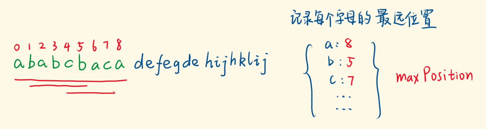

# 2.3 贪心算法

> 贪心算法（又称贪婪算法）是指，在对问题求解时，总是做出在当前看来是最好的选择。也就是说，不从整体最优上加以考虑，他所做出的是在某种意义上的**局部最优解**。 
>
> 分配问题
>
> 区间问题

<!--more-->

## （1）分配问题

#### [409. 最长回文串](https://leetcode-cn.com/problems/longest-palindrome/)

`C++`

```C++
//题意：将字符串构造成最长回文串：例如abb，构造成bab，问最长长度
//思路：字符偶数个则可以构成回文串，最多只有1个字符为奇数个。
//hashmap直接统计字符个数为奇数的字符cnt，s.size()-cnt+1;加1是最多只有一个字符出现了奇数次；cnt为0则表示s.szie()构成最长
//复杂度：T:O(N),S:O(S)  S字符集大小：128
class Solution {
public:
    int longestPalindrome(string s) {
        unordered_map<char,int> map;   //统计对应字符的个数
        int cnt=0;
        int n= s.size();
        for(int i=0;i<n;i++) map[s[i]]++;
        for(auto &it:map) if(it.second % 2 == 1) cnt++;
        return cnt == 0 ? n : n-cnt+1;   //cnt等于0表示，所有字符可以构成
    }
};
```

`Java`

```java
class Solution {
    public int longestPalindrome(String s) {
        HashMap<Character,Integer> map = new HashMap<>();
        int n = s.length();
        for(int i=0;i<n;i++){
            Character ch = s.charAt(i);
            map.put(ch,map.getOrDefault(ch,0)+1);
        }
        int cnt = 0;
        for(Character k:map.keySet()){
            if(map.get(k) %2 == 1) cnt++;
        }
        return cnt == 0?n:n-cnt+1;
    }
}
```

#### [14. 最长公共前缀](https://leetcode-cn.com/problems/longest-common-prefix/)


`C++`

```C++
/*
题意：如上图
思路：横向扫描：对比完返回前缀，再跟下一个word对比
复杂度：T:O(N),S:O(S)
*/
class Solution {
public:
    string getPrefix(string str1,string str2){
        int n1=str1.size(),n2=str2.size();
        int index=0;
        while(index < n1 && index <n2){
            if(str1[index] == str2[index]) index++;
            else break;
        }
        return str1.substr(0,index);
    }
    string longestCommonPrefix(vector<string>& strs) {
        int n=strs.size();
        if(n == 0) return "";
        string prefix = strs[0];
        for(int i=1;i<n;i++){   //横向扫描对比
            prefix = getPrefix(prefix,strs[i]);
            if(0 == prefix.size()) break;
        }
        return prefix;
    }
};
```

`Java`

```java
class Solution {
    String get(String a,String b){
        int m = a.length();
        int n = b.length();
        int i =0;
        StringBuffer res = new StringBuffer();
        while(i < m && i <n){
            if(a.charAt(i) == b.charAt(i)) res.append(a.charAt(i));
            else break;
            i++;
        }
        return res.toString();
    }
    public String longestCommonPrefix(String[] strs) {
        int n = strs.length;
        if(n == 1) return strs[0];
        String pre = strs[0];
        for(int i=1;i<n;i++){
            pre = get(pre,strs[i]);
            if(pre.length() == 0) return "";
        }
        return pre;
    }
}
```

#### [674. 最长连续递增序列](https://leetcode-cn.com/problems/longest-continuous-increasing-subsequence/)

`C++`

```C++
/*
题意：最长且连续递增的子序列：nums[i-1] < nums[i]
思路：遍历数组：i记录结束下标，start记录开始下标；i >0 && nums[i-1] >=  nums[i]，更新开始下标 start=i
复杂度：
*/
class Solution {
public:
    int findLengthOfLCIS(vector<int>& nums) {
        int start=0;
        int n=nums.size();
        int res=0;
        for(int i = 0;i < n;i++){
            if(i>0 && nums[i-1] >= nums[i]){
                start = i;
            }
           
            res = max(res,i-start+1);
        }
        return res;
    }
};
```

`Java`

```Java

```

#### [455. 分发饼干](https://leetcode-cn.com/problems/assign-cookies/) 🀄️

```C++
/*
题意：饼干填充饥饿的孩子，问最多满足的孩子数
思路：先对饼干，饥饿感升序排序，最小的饼干给饥饿最小的孩子，依次类推
复杂度：T,S:（Omlogm+nlogn） 主要排序
*/
class Solution {
public:
    int findContentChildren(vector<int>& g, vector<int>& s) {
        sort(s.begin(),s.end());      //饼干
        sort(g.begin(),g.end());      //饥饿
        int cnt=0;
        int j=0;
        for(int i=0;i<s.size();i++){    //1块饼干只能给一个小孩
            if(j < g.size() && s[i] >= g[j]){
                cnt++;
                j++;
            }
        }
        return cnt;
    }
};
```

#### [135. 分发糖果](https://leetcode-cn.com/problems/candy/) 🀄️

```C++
/*
题意：每个孩子至少分配到 1 个糖果，相邻2个孩子分数高的获得更多糖果。问所需最少糖果数目
思路：先全部赋值为1
从左到右遍历，右边大于左边，则右边= 左边+1
从右到左遍历，左边大于右边，则左边= max(左边,右边+1)
复杂度：T，S:O(N)
考虑：
[1,3,4,5,2]
 1 1 1 1 1
 1 2 3 4 1  右边大时，右边= 左边+1
 1 2 3 4 1  左边大时，左边=max(左边，右边+1)  max(4,1+1)
*/
class Solution {
public:
    int candy(vector<int>& ratings) {
        int n = ratings.size();
        if(n == 0) return 0;
        vector<int> res(n,1);  //全部初始化为1
        for(int i=1;i<n;i++){
            if(ratings[i] > ratings[i-1]){//右边大于左边，右边= 左边+1
                res[i] = res[i-1]+1;
            }
        }
        for(int i=n-1;i>0;i--){
            if(ratings[i] < ratings[i-1]){//左边大于右边，左边= max(左边,右边+1)
                res[i-1] = max(res[i-1],res[i]+1);
            }
        }
        return accumulate(res.begin(),res.end(),0);//求和，0是初始的累加值 
    }
};
```

#### [1282. 用户分组](https://leetcode-cn.com/problems/group-the-people-given-the-group-size-they-belong-to/)

```C++
/*
题意：[3,3,3,3,3,1,3] => [[5],[0,1,2],[3,4,6]] 
第一个元素：3代表下标0所在组大小为3
思路：哈希表<组大小，个数>；然后遍历map，将每个组放进res
复杂度：T,S:O(N)
*/
class Solution {
public:
    vector<vector<int>> groupThePeople(vector<int>& g) {
        vector<vector<int>> res;
        int n = g.size();
        if(n == 0) return res;
        unordered_map<int,vector<int>> map;	//<组大小，个数>
        for(int i=0;i<n;i++){
            map[g[i]].push_back(i);
        }
        
        for(auto &it:map){
            auto tmp = it.second;
            int s = it.first;          //每组大小
            int cnt = tmp.size()/s;    //每组放的个数
            for(int i=0;i<cnt;i++){		 //把每个组放进res
                vector<int> m(tmp.begin()+i*s,tmp.begin()+(i+1)*s);
                res.push_back(m);
            }
        }
        return res;
    }
};
```

#### [1518. 换酒问题](https://leetcode-cn.com/problems/water-bottles/)

```C++
/*
题意：比如e个空瓶换1瓶酒。现有b瓶酒，问最多可以喝多少瓶酒。（喝掉的酒就可以成为空酒瓶）
思路：直接兑换酒，兑换完后更新空酒瓶，重复兑换直到兑换不了
复杂度：T:O(b/e),S:O(1)
*/
class Solution {
public:
    int numWaterBottles(int numBottles, int numExchange) {
        int res=numBottles;
        while(numBottles/numExchange){
            res+=numBottles/numExchange;
            numBottles = numBottles/numExchange+numBottles%numExchange;
        }
        return res;
    }
};
```

#### [860. 柠檬水找零](https://leetcode-cn.com/problems/lemonade-change/)

```C++
/*
题意：一杯柠檬水5美元，向你付 5 美元、10 美元或 20 美元，问能不能正确找零
思路：钱大的先给，留小的好找零钱；用five,ten标志5，10元的数目
复杂度：T:O(n) S:O(1)
*/
class Solution {
public:
    bool lemonadeChange(vector<int>& bills) {
        int five=0,ten=0;
        for(auto &cur:bills) {
            if(cur == 5) five++;  //不需要找
            else if(cur == 10){ //需要找5
                if(five == 0) return false;
                five --;
                ten ++;
            }else{  //需要找15
                if(ten > 0 && five > 0 ){ //钱大的先给，留小的好找零钱
                    ten--;
                    five--;
                }else if(five >= 3){
                    five -= 3;
                }else return false;
            } 
        }
        return true;
    }
};
```

#### [1111. 有效括号的嵌套深度](https://leetcode-cn.com/problems/maximum-nesting-depth-of-two-valid-parentheses-strings/)

```C++
/*
题意：要求划分出使得最大嵌套深度最小的分组
思路：只要在遍历过程中，我们保证栈内一半的括号属于序列 A，一半的括号属于序列 B，那么就能保证拆分后最大的嵌套深度最小，
括号序列   ( ( ) ( ( ) ) ( ) )
下标编号   0 1 2 3 4 5 6 7 8 9
嵌套深度   1 2 2 2 3 3 2 2 2 1 
复杂度：T:O(N),S:O(1)
*/
class Solution {
public:
    vector<int> maxDepthAfterSplit(string seq) {
        int d = 0;
        vector<int> ans;
        for (char& c : seq)
            if (c == '(') {
                ++d;
                ans.push_back(d % 2);
            }
            else {
                ans.push_back(d % 2);
                --d;
            }
        return ans;
    }
};
```

#### [861. 翻转矩阵后的得分](https://leetcode-cn.com/problems/score-after-flipping-matrix/)

```C++
/*
题意：[0,0]  经过行或列的多次翻转[1,1]    b11+b10=5,最大
		 [0,1]  								 [1,0]
思路：假设每一行开头都为1；贡献：n*2^(m-1)
按列遍历：判断该行是否翻转=>1的个数，k=哪个大取哪个： 贡献：k*2^(m-j-1).  
复杂度：
*/
class Solution {
public:
    int matrixScore(vector<vector<int>>& grid) {
    
        int row =grid.size();
        int col = grid[0].size();
        int res = row*pow(2,col-1);//假设每一行开头都为1
        
        for(int j=1;j<col;j++){
            int one=0;
            for(int i=0;i<row;i++){
                if(grid[i][0] == 0) one += (1-grid[i][j]);  //表明该行翻转了
                else one += grid[i][j];
            }
            int k = max(one,row-one); //取大的
            res += k*pow(2,col-j-1);  
        }
        return res;
    }
};
```

#### [605. 种花问题](https://leetcode-cn.com/problems/can-place-flowers/)

```C++
/*
题意：[1,0,0,0,1]：1代表种花，0代表没种，相邻不能同时种花。也就是遇到1,那么下一格子一定是0。给定n花能不能种上，比如n=1，可以种上,n=2不可以。
思路：每次跳两格。如果当前为空地；{下个格子不是1或者当前为最后一个格子，果断填充}。
复杂度：T:O(N),S:O(1)
*/
class Solution {
public:
    bool canPlaceFlowers(vector<int>& f, int n) {
        //每次跳两格
         for (int i = 0; i < f.size(); i += 2) {
             // 如果当前为空地
            if (f[i] == 0) {
                // 如果是最后一格或者下一格为空
                if (i == f.size() - 1 || f[i + 1] == 0) n--;
                else i++; //下一格子⚠️
            }
        }
        return n <= 0;
    }
};
```

#### [665. 非递减数列](https://leetcode-cn.com/problems/non-decreasing-array/)

```C++
/*
题意：最多 改变 1 个元素的情况下，使数组变成一个非递减数列（nums[i] <= nums[i + 1]）
思路：nums[i] > nums[i+1] 同时要求 nums[i+1] < nums[i-1]才更新nums[i+1]=nums[i]
复杂度：T:O(N),S:O(1)
*/
class Solution {
public:
    bool checkPossibility(vector<int> &nums) {
        int n = nums.size(), cnt = 0;
        for (int i = 0; i < n - 1; ++i) {
            int x = nums[i], y = nums[i + 1];
            if (x > y) {
                cnt++;
                if (cnt > 1) return false;
                if (i > 0 && y < nums[i - 1]) { //⚠️ 3 4 2 4
                    nums[i + 1] = x;
                }
            }
        }
        return true;
    }
};
```

#### [剑指 Offer 14- I. 剪绳子](https://leetcode-cn.com/problems/jian-sheng-zi-lcof/)

```java
/*
题意：将长度为n，剪成m段，将每段绳子的长度相乘，问最大乘积
思路：n =3a+b b=0,1,2。推导=>最优：把绳子尽可能切为多个长度为3的片段，次优2，最差1
复杂度：S,T:O(1)
*/
class Solution {
public:
    int cuttingRope(int n) {
        if(n <= 3) return n-1;
        int a = n / 3; //n =3a+b b=0,1,2
        int b = n % 3;
        if(b == 0) return pow(3,a);       //n=6 a=2 b=0 3^2
        if(b == 1) return pow(3,a-1)*4;   //n=7 a=2 b=1 3^1*4
        return pow(3,a)*2;                //n=8 a=2 b=2 3^2*2
    }
};
```

#### [剑指 Offer 14- II. 剪绳子 II](https://leetcode-cn.com/problems/jian-sheng-zi-ii-lcof/)

```java
/*
题意：将长度为n，剪成m段，将每段绳子的长度相乘，结果取模 1e9+7，问最大乘积
思路：n =3a+b  快速幂求余
复杂度：S,T:O(1)
*/
class Solution {
public:
    int cuttingRope(int n) {
        if(n <= 3) return n-1;
        int b = n % 3,p=1000000007; //n =3a+b b=0,1,2
        
        //base,a,p，求 base^a mod p。
        long base=3,rem=1;     //防止溢出
        int a = n/3-1;	//少一个
        while(a>0){     //n=9 rem=9
            if(a%2 == 1) rem=rem*base%p;	//有余数
            base= base*base%p; //注意
            a /= 2;
        }

        if(b == 0) return int(rem*3%p);//rem^(a+1)%p
        if(b == 1) return int(rem*4%p);  //rem^(a)*4%p
        return int(rem*3*2%p);    //rem^(a+1)*2%p          
    }
};
```

## （2）区间问题

#### [435. 无重叠区间](https://leetcode-cn.com/problems/non-overlapping-intervals/) 🀄️

```C++
/*
题意：给定多个区间，计算让这些区间互不重叠所需要移除区间的最少个数。起止相连不算重叠。
思路：优先保留结尾小且不相交的区间，就越能保留更多的区间。
先排序，每次选择结尾最小且和前一个选择的区间不重叠的区间。
⚠️需要根据实际情况判断按区间开头排序还是按区间结尾排序。
复杂度：T:O(nlogn),S:O(1ogn) 栈排序logn
*/
class Solution {
public:
    static bool cmp(vector<int> a, vector<int> b){
        return a[1] < b[1];
    }
    int eraseOverlapIntervals(vector<vector<int>>& gs) {
        if (gs.empty()) return 0;
        sort(gs.begin(), gs.end(),cmp);//区间结尾排序，从小到大排序
        int res = 0, pre = gs[0][1];   //pre前区间结尾
        for (int i = 1; i < gs.size(); i++) {
            if (gs[i][0] < pre) res++;  // 当前区间开始值 < pre前区间结尾  有重叠
            else  pre = gs[i][1];       // >= 无重叠，更新
        }
        return res;
    }
};
```

#### [55. 跳跃游戏](https://leetcode-cn.com/problems/jump-game/)

```C++
/*
题意：[2,3,1,1,4]，值代表能够跳跃的距离，问能不能达到最后一格
思路：每次走最大的距离，如果能超过末尾元素，说明只要调小步伐就一定可以达到最后位置。
复杂度：T:O(N)，S:O(1)
*/
class Solution {
public:
    bool canJump(vector<int>& nums) {
        int n=nums.size();
        int maxPos=0;
        for(int i=0;i<n;i++){
           if(maxPos >= i){
               maxPos = max(maxPos,i+nums[i]);
               if(maxPos >= n-1){
                   return true;
               }
           }
        }
        return false;
    }
};
```

#### [45. 跳跃游戏 II](https://leetcode-cn.com/problems/jump-game-ii/)

```C++
/*
题意：[2,3,1,1,4]，值代表能够跳跃的距离，问达到最后一格的最少跳跃次数？
思路：end=0，每次记录能达到的最远下标maxpose，遍历到end时，end=maxpose,steps++
复杂度：T:O(N)，S:O(1)
*/
class Solution {
public:
    int jump(vector<int>& nums) {
        int maxPos = 0, n = nums.size(), end = 0, step = 0;
        for (int i = 0; i < n - 1; ++i) {   //循环n-1次
            if (maxPos >= i) {
                maxPos = max(maxPos, i + nums[i]);  //跳最远的点
                if (i == end) {     //此时
                    end = maxPos;   //当end >= n-1时，结束
                    ++step;
                }
            }
        }
        return step;
    }
};
```

#### [452. 用最少数量的箭引爆气球](https://leetcode-cn.com/problems/minimum-number-of-arrows-to-burst-balloons/)

```C++
/* 
题意：每个气球=[start,end]，如果箭pos，start=<pos<=end；则可以引爆气球
思路：区间按照结尾升序，循环数组，如果后面一个区间的开始大于前一个区间的结尾 就需要新增一支箭。尽量将箭移到最远的那个
复杂度：T:O(nlogn) S:O(logn)
*/
class Solution {
public:
    static bool cmp(vector<int>& a,vector<int>& b){
        return a[1] < b[1];
    }
    int findMinArrowShots(vector<vector<int>>& points) {
        sort(points.begin(),points.end(),cmp);
        int pos = points[0][1]; //区间结尾
        int res=1;  //⚠️
        for(auto &p:points){
            if(p[0] > pos){ //后面区间的开始>前面区间的结尾
                pos = p[1]; //更新pos
                res++;
            }
        }
        return res;
    }
};
```

#### [763. 划分字母区间](https://leetcode-cn.com/problems/partition-labels/)



```C++
/*
题意：同一字母最多出现在一个片段,"ababcbacadefegdehijhklij"=> "ababcbaca", "defegde", "hijhklij"。
思路：记录每个字母的最远下标end（分割点），到达分割点后更新下一个分割点
复杂度：：T:O(n) S:O(1)  26个小写字母
*/
class Solution {
public:
    vector<int> partitionLabels(string s) {
        int cnt[27];
        for(int i=0;i<s.size();i++){ //统计每个字符出现的最远点
            cnt[s[i]-'a'] = i ;
        }
        vector<int> res;
        int start=0,end=0;
        for(int i=0;i<s.size();i++){
            end = max(end,cnt[s[i]-'a']);   //最远点
            if(i == end){                   //到达分割点,更新
                res.push_back(end-start+1);
                start = end+1;
            }
        }
        return res;
    }
};
```

#### [406. 根据身高重建队列](https://leetcode-cn.com/problems/queue-reconstruction-by-height/)

```C++
/*
题意：整数对 (h, k) 表示，其中 h 是这个人的身高，k 是排在这个人前面且身高大于或等于 h 的人数。
思路：先排序(元素1降序，元素2升序);如果res.size()前面个数>当前的k,将当前插入到k位置；否则直接添加到res
复杂度：T,O(n^2),S:O(logn)

//降序：保证每个元素，在其之前的元素个数，>=他的k  [7,0],[7,1],[6,1]  对于6，2>1
//升序：如果降序[5,3],[5,2]。3先插入，2后插入，此时3之前就有4个了，出错，因为2的插入。
*/
class Solution {
public:
    static bool cmp(vector<int>& a,vector<int>& b){
        if(a[0]!=b[0]) return a[0] > b[0];  //降序
        return a[1] < b[1]; //升序
    }
    vector<vector<int>> reconstructQueue(vector<vector<int>>& people) {
        vector<vector<int>> res;
        sort(people.begin(),people.end(),cmp);
        for(auto &p:people){
            if(res.size() <= p[1]) res.push_back(p);
            else res.insert(res.begin()+p[1],p);
        }
        return res;
    }
};
```

