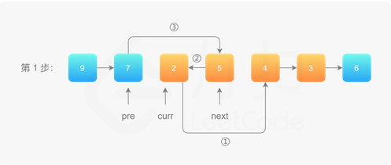
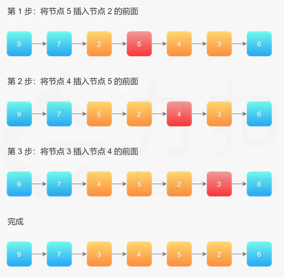
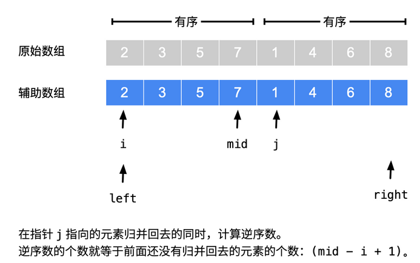
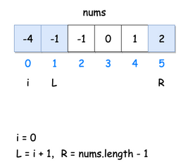
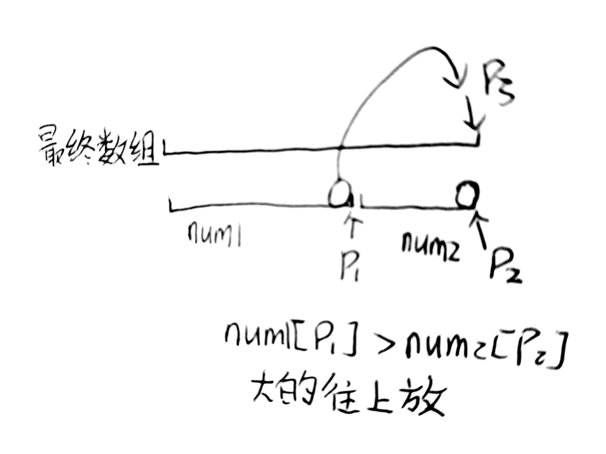

# 2.4 指针类问题

> 1.**双指针/滑动窗口**，用快慢指针，遍历方向相同，且不相交
>
> 2.**搜索**（往往搜索的数组排好序），遍历方向相反

<!--more-->

### 滑动窗口

#### [剑指 Offer 57 - II. 和为s的连续正数序列](https://leetcode-cn.com/problems/he-wei-sde-lian-xu-zheng-shu-xu-lie-lcof/)


```C++
//滑动窗口
//T:O(target)	S:O(1)
class Solution {
public:
    vector<vector<int>> findContinuousSequence(int target) {
        int l=1,r=2;
        vector<vector<int>> res;
        while(l<r){
            vector<int> tmp;
            int sum = (l+r)*(r-l+1)/2;
            if(sum == target){
                for(int i=l;i<=r;i++)
                    tmp.push_back(i);
                res.push_back(tmp);
                l++;    //⚠️
            }else if(sum < target) r++; 
            else l++;
        }
        return res;
    }
};
```

#### [151. 翻转字符串里的单词](https://leetcode-cn.com/problems/reverse-words-in-a-string/)

```C++
//先整个翻转，再每个单词翻转
//T:O(n),S:O(1)
class Solution {
public:
    string reverseWords(string s) {
        reverse(s.begin(),s.end()); 
        int r=0;
        int n = s.size();
        for(int l=0;l<n;l++){
            if(s[l] != ' '){             //当前不是空格
                if(r != 0) s[r++] = ' '; //将前面的空格填上
                int end = l;
                while(s[end] != ' '&& end < n){// 遍历到空格停止
                    s[r++] = s[end++];
                } //此时r为单词末尾 单词长度end-l，起始位置 r-(end-l) 
                reverse(s.begin()+r-(end-l),s.begin()+r); //到r-1
                l = end;  //更新
            }
        }
        s.erase(s.begin()+r,s.end());   //删除末尾空格
        return s;
    }
};
```

#### [3. 无重复字符的最长子串](https://leetcode-cn.com/problems/longest-substring-without-repeating-characters/)

```C++
//滑动窗口
//T:O(n) S:O(m) m字符集大小
  //r指针一直右移，没有就存入，出现过就删除，并将l左移
class Solution {
public:
    int lengthOfLongestSubstring(string s) {
        unordered_set<char> occ;// 哈希集合，记录每个字符是否出现过
        int n = s.size();
        int l=0,r=-1;
        int res=0;
         while (l < n) {
            if (r + 1 < n && !occ.count(s[r + 1])) {    //当前字符没有出现过
                occ.insert(s[r+1]);
                r++;
            }else {         //已经出现了，删除
                occ.erase(s[l]);
                l++;
            }
            res = max(res, r - l+ 1);
        }
        return res;
    }
};
```

#### [395. 至少有 K 个重复字符的最长子串](https://leetcode-cn.com/problems/longest-substring-with-at-least-k-repeating-characters/)

```C++
//枚举最长子串中的字符种类数目(本题最大为26)
//枚举+滑动窗口
class Solution {
public:
    int longestSubstring(string s, int k) {
       int res=0;
       int n=s.size();
       for(int p=1;p<=26;p++){
           vector<int> cnt(26,0);
           int l=0,r=0;
           //total 代表 [left, right] 区间所有的字符种类数量；sum 代表满足「出现次数不少于 k」的字符种类数量
           int total=0,sum=0;
           while(r < n){
               int index = s[r]-'a';
               cnt[index]++;
               if(cnt[index] == 1) total++; //新的字符，直接加1
               if(cnt[index] == k) sum++;   //满足加1
               while(total > p){    //一直左移，缩小窗口为p
                   index = s[l] - 'a';
                   if(cnt[index] == 1) total--;
                   if(cnt[index] == k) sum--;
                   cnt[index]--;
                   l++;
               }  
               if(total == sum) res=max(res,r-l+1);
               r++; //下一个
           }
       }
       return res;
    }
};
```


#### [30. 串联所有单词的子串](https://leetcode-cn.com/problems/substring-with-concatenation-of-all-words/)

```C++
//T:O(m*n)  S:O(m)   s 的长度是 n，words 里有 m 个单词
//map存words（单词，次数） map2临时统计（单词，次数）
class Solution {
public:
    vector<int> findSubstring(string s, vector<string>& words) {
       vector<int> res;
       int wordNum = words.size();
       if(wordNum == 0) return res;
       int len = words[0].size();   //滑动窗口大小
       unordered_map<string,int> map;	
       for(auto &word:words) map[word]++;
        
        for(int i=0;i<s.size()-wordNum*len+1;i++){
            unordered_map<string,int> tmp;
            int num=0;
            while(num < wordNum){   //不同于java的subString
                string word = s.substr(i+num*len,len);  //取出当前word
                if(map.count(word)){
                    tmp[word]++;
                    if(tmp[word] > map[word]) break;
                }else break;
                num++;  //下一个word
            }
            if(num == wordNum){  //判断是不是所有的单词都符合条件
                res.push_back(i);
            }
        }
        return res;
    }
};
```

#### [76. 最小覆盖子串](https://leetcode-cn.com/problems/minimum-window-substring/)🀄️


```C++
/*滑动窗口 遍历方向相同，返回包含t的最小子串
T：O(C*s+t) S:O(C) C字符集大小
思路：r指针不断向右移动，直到包含T字串，此时l指针向右移，尝试找到最短的包含T的子串
 chars 表示T中每个字符的数量，flag 表示每个字符是否在 T 中存在。
*/
class Solution {
public:
    string minWindow(string s, string t) {   
        vector<char> cnt(128,0);        //哈希表 
        vector<bool> flag(128,false);   //是否为T中的字符
        for(int i=0;i<t.size();i++){
            cnt[t[i]]++;
            flag[t[i]] = true;
        }

        int l=0,min_l=0,min_size = s.size()+1;//min_size最短子串长度
        int num=0;  //T中字符串出现的个数
        for(int r=0;r<s.size();r++){
            if(flag[s[r]]){
                if(--cnt[s[r]] >= 0) num++;
                while(num == t.size()){
                    if(r-l+1 < min_size){
                        min_l = l;  //左边起始
                        min_size = r-l+1;
                    }
                    //比如：T:BC，S:ABBACD，l=0,r=4,需要再移动l
                    if(flag[s[l]] && ++cnt[s[l]] > 0) num--;  //是T中字符，且要将这个字符移除窗口
                    l++;    //缩小窗口,l=3,cnt=1，跳出
                }
            }
        }
        return min_size > s.size() ? "": s.substr(min_l,min_size);
    }
};
```

#### [159.至多包含两个不同字符的最长子串](https://leetcode-cn.com/problems/longest-substring-with-at-most-two-distinct-characters/)

```C++

```

#### [209. 长度最小的子数组](https://leetcode-cn.com/problems/minimum-size-subarray-sum/)

```C++
//T:O(n  S:O(1)
class Solution {
public:
    int minSubArrayLen(int s, vector<int>& nums) {
        int n = nums.size();
        if (n == 0) return 0;
        int res = INT_MAX;
        int l = 0, r = 0;
        int sum = 0;
        while (r < n) {
            sum += nums[r];
            while (sum >= s) {  //找到符合的
                res = min(res, r - l + 1);
                
                sum -= nums[l]; //左移，缩小窗口，直到最小
                l++;
            }
            r++;
        }
        return res == INT_MAX ? 0 : res;
    }
};
```

#### [340. 至多包含 K 个不同字符的最长子串](https://leetcode-cn.com/problems/longest-substring-with-at-most-k-distinct-characters/)

```C++

```

#### [567. 字符串的排列](https://leetcode-cn.com/problems/permutation-in-string/)

```C++
//T:O(k+m) S:O(C) C:26个字母
//当两个字符串每个字符的个数均相等时，一个字符串才是另一个字符串的排列。
class Solution {
public:
    bool checkInclusion(string s1, string s2) {
        int n = s1.length(), m = s2.length();
        if (n > m) return false;
        vector<int> cnt1(26), cnt2(26);
        for (int i = 0; i < n; ++i) {
            ++cnt1[s1[i] - 'a'];
            ++cnt2[s2[i] - 'a'];
        }
        if (cnt1 == cnt2) {
            return true;
        }   
        for (int i = n; i < m; ++i) {   //n为窗口大小
            --cnt2[s2[i - n] - 'a'];    //向右滑动,左边界滑出
            ++cnt2[s2[i] - 'a'];        //右边界++
            if (cnt1 == cnt2) {
                return true;
            }
        }
        return false;
    }
};
```

#### [632. 最小区间](https://leetcode-cn.com/problems/smallest-range/)

```C++

```

#### [727. 最小窗口子序列](https://leetcode-cn.com/problems/minimum-window-subsequence/)

```C++

```

### 双指针

#### [143. 重排链表](https://leetcode-cn.com/problems/reorder-list/)

```C++
//【快慢指针（多走一步）寻找链表中点 + 反转链表（右半部分） +合并链表（ 左取1个，右边取1个）】
class Solution {
public:
    ListNode* getMid(ListNode* head){
        ListNode* slow=head,*fast=head;
        while(fast->next && fast->next->next ){     //保证前进的2个都不为空
            slow =slow->next;
            fast =fast->next->next;
        }
        return slow;
    }

    ListNode* reverseList(ListNode* head) {
        ListNode* pre=nullptr;
        ListNode* cur =head;
        while(cur){
            ListNode* tmp=cur->next;        //暂存
            cur->next = pre;        //由于这里next改变了
            pre = cur;
            cur = tmp;          
        }
        return pre;
    }
    void mergeList(ListNode* l1,ListNode* l2){
        while(l1 && l2){
            ListNode*  tmp1 = l1->next;     //暂存
            ListNode*  tmp2 = l2->next;

            l1->next=l2;    //l1指向l2      由于这里next改变了
            l1 = tmp1;     //更新l1
            l2->next=l1;
            l2=tmp2;
        }
    }
    void reorderList(ListNode* head) {
        if(head == nullptr) return;
        ListNode* mid = getMid(head);
        ListNode* l1 = head;
        ListNode* l2 = mid->next;   //l2头结点
        mid->next = nullptr;        //l1尾结点next置为NULL
        l2 = reverseList(l2);
        mergeList(l1,l2);
    }
};
```

#### [19. 删除链表的倒数第 N 个结点](https://leetcode-cn.com/problems/remove-nth-node-from-end-of-list/)

```C++
//快指针先移动n步后，快，慢指针再同步移动
//
class Solution {
public:
    ListNode* removeNthFromEnd(ListNode* head, int n) {
        ListNode* dummy = new ListNode(0);  //必须要这个，否则删除的是头结点会报错
        dummy->next = head;
        ListNode* quick = dummy,*slow=dummy;
        for(int i=1;i<=n+1;i++){   //循环n+1多了个dummy
            quick=quick->next;
        }
        while(quick){
            quick=quick->next;
            slow=slow->next;        
        }   //slow为要删除的结点的前一个结点
        slow->next = slow->next->next;
        return dummy->next;
    }
};
```

#### [141. 环形链表](https://leetcode-cn.com/problems/linked-list-cycle/)

```C++
//快慢指针
class Solution {
public:
    bool hasCycle(ListNode *head) {
        ListNode* slow=head;
        ListNode* fast=head;
        while(slow && fast->next){
            fast = fast->next->next;
            slow = slow->next;
            if(fast == NULL) return false;
            if(slow == fast) return true;
        }   
        return false;
    }
};
```

#### [142. 环形链表 II](https://leetcode-cn.com/problems/linked-list-cycle-ii/)

```C++
//【快慢指针，同步指针】2次相遇：第1次相遇不清楚位置，第二次相遇为入口结点。重合时 fast 比 slow 多走 环的长度整数倍
//第1次相遇：fast：f=2s f=s+nb ==> slow:s = nb		a环前的长度，b环的长度
//第2次相遇：让slow在a步停下来，让slow和fast在a处相遇，
//slow不变，fast=head，同步移动
class Solution {
public:
    ListNode *detectCycle(ListNode *head) {
        ListNode* slow=head,*fast=head;
        while(true){
            if(fast == NULL || fast->next == NULL) return NULL; //⚠️处理特殊情况
            slow = slow->next;
            fast = fast->next->next;
            if(fast == slow) break;
        }
        fast = head;
        while(fast != slow){
            fast=fast->next;
            slow=slow->next;
        }
        return slow;
    }
};
```

#### [206. 反转链表](https://leetcode-cn.com/problems/reverse-linked-list/)

```C++
//cur,pre
class Solution {
public:
    ListNode* reverseList(ListNode* head) {
        ListNode* pre = nullptr;
        ListNode* cur = head;
        while(cur){
            ListNode* next = cur->next;
            cur->next = pre;
            pre = cur;
            cur = next;
        }
        return pre;
    }
};
```

#### [92. 反转链表 II](https://leetcode-cn.com/problems/reverse-linked-list-ii/)






```C++
//三指针
// 1    2    3   4  5 翻转[2,4]
// pre cur next
// 1 3 2 4 5
// 1 4 3 2 5
// 1 5 4 3 2
// 1 4 3 2 5
class Solution {
public:
    ListNode* reverseBetween(ListNode* head, int left, int right) {
        ListNode* dummy=new ListNode(-1);
        dummy->next = head;
        ListNode* pre=dummy;  //待反转区域的第一个节点的前一个结点  
        for(int i=1;i<left;i++){//⚠️
            pre = pre->next;
        }
        ListNode* cur = pre->next;  //待反转区域的第一个节点       
        ListNode* next;   //待反转区域的第一个节点的下一个结点
        for(int i=1;i<=right-left;i++){
            next = cur->next;
            cur->next = next->next;
            next->next = pre->next;
            pre->next = next;
        }
        return dummy->next;
    }
};
```

#### [剑指 Offer 25. 合并两个排序的链表](https://leetcode-cn.com/problems/he-bing-liang-ge-pai-xu-de-lian-biao-lcof/)

```C++
class Solution {
public:
    ListNode* mergeTwoLists(ListNode* l1, ListNode* l2) {
        ListNode* dummy = new ListNode(0);
        ListNode* cur = dummy;//头结点，并临时cur
        while(l1 && l2 ){
            if(l1->val < l2->val){
                cur->next = l1;
                l1 = l1->next;
            }else{
                cur->next = l2;
                l2 = l2->next;
            }
            cur = cur->next;             //更新
        }
        cur->next = l1 != NULL ? l1:l2;  //哪个不为空直接指向它
        return dummy->next;       
    }
};
```

#### [剑指 Offer 51. 数组中的逆序对](https://leetcode-cn.com/problems/shu-zu-zhong-de-ni-xu-dui-lcof/)



```C++
//借助归并排序，分治思想
class Solution {
public:
    vector<int> tmp;//辅助数组
    long long merge_sort(vector<int> &q,int l,int r)
    {
        if(l>=r) return 0;
        int mid=(l+r)/2;//取分治点
        long long ans=merge_sort(q,l,mid)+merge_sort(q,mid+1,r); //递归
        /*这里ans存储了左区间和右区间的逆序对总数*/
        int k=0,i=l,j=mid+1;
        while(i<=mid&&j<=r)//此循环统计不同区间的逆序对
        {
            if(q[i]<=q[j]) {    //小的放入数组
                tmp[k++]=q[i++]; 
            } else
            {   /*由于左区间和右区间已经有序当前左区间元素构成逆序,之后的都会构成逆序对*/
                /*所以ans需要加上区间长度*/
                ans+=mid-i+1;           
                tmp[k++]=q[j++];
            }

        }
        while(i<=mid) tmp[k++]=q[i++];
        while(j<=r) tmp[k++]=q[j++];
        for(int i=l,j=0;i<=r;) q[i++]=tmp[j++];//⚠️需要还原数组  
        return ans;
    }
    int reversePairs(vector<int>& nums) {
        tmp.assign(nums.size(),0);
        return merge_sort(nums,0,nums.size()-1);
    }
};
```


#### [454. 四数相加 II](https://leetcode-cn.com/problems/4sum-ii/)

```

```

#### [剑指 Offer 52. 两个链表的第一个公共节点](https://leetcode-cn.com/problems/liang-ge-lian-biao-de-di-yi-ge-gong-gong-jie-dian-lcof/)

```C++
//双指针+烂漫相遇
class Solution {
public:
    ListNode *getIntersectionNode(ListNode *headA, ListNode *headB) {
        ListNode* pa=headA,*pb=headB;
        while(pa!=pb){
            pa = pa != NULL ? pa->next : headB;
            pb = pb != NULL ? pb->next : headA;
        }
        return pa;
    }
};
```

#### [2. 两数相加](https://leetcode-cn.com/problems/add-two-numbers/)

```C++
//思路：同向遍历链表

class Solution {
public:
    ListNode* addTwoNumbers(ListNode* l1, ListNode* l2) {
        ListNode* dummy = new ListNode(0);  //用来保存开始结点
        ListNode* node = dummy; //node循环遍历结点
        int c=0;    //进位
        while(l1 || l2){
            int a = l1 != nullptr ? l1->val : 0;
            int b = l2 != nullptr ? l2->val : 0;
            int sum = a+b+c;
            
            c = sum/10; 
            int cur = sum%10;   
            node->next = new ListNode(cur); 

            node = node->next;      //移到下一个结点
            if(l1 != nullptr) l1 = l1->next;
            if(l2 != nullptr) l2 = l2->next;
        }
        if(c == 1) node->next = new ListNode(1);//处理最后一个进位
        return dummy->next;
    }
};
```

#### [15. 三数之和](https://leetcode-cn.com/problems/3sum/)



```C++
//排序+三指针
//T:O(n^2)  S:O(N)
class Solution {
public:
    vector<vector<int>> threeSum(vector<int>& nums) {
        vector<vector<int>> res;
        int len = nums.size();
        if(len < 3) return res;
        sort(nums.begin(),nums.end()); // 排序
        for (int a = 0; a < len ; a++) {
            if(nums[a] > 0) break; // 当前数字大于0，提前结束（因为排序了，后面的都>0）
            if(a > 0 && nums[a] == nums[a-1]) continue; // 确保a改变 去重
            int L = a+1;
            int R = len-1;
            while(L < R){
                int sum = nums[a] + nums[L] + nums[R];
                if(sum == 0){
                    res.push_back({nums[a],nums[L],nums[R]});
                    // 还要去重，比如: [-2, -1, -1, -1, 3, 3, 3]
      //i = 0, left = 1, right = 6, [-2, -1, 3] 的答案加入后，需要排除重复的 -1 和 3
                    while (L<R && nums[L] == nums[L+1]) L++; // 确保b改变 去重
                    while (L<R && nums[R] == nums[R-1]) R--; // 确保c改变 去重
                    L++;    //继续遍历
                    R--;
                }
                else if (sum < 0) L++;
                else if (sum > 0) R--;
            }
        }        
        return res;
    }
};
```

#### [18. 四数之和](https://leetcode-cn.com/problems/4sum/)

```C++
class Solution {
public:
    vector<vector<int>> fourSum(vector<int>& nums, int target) {
        vector<vector<int>> res;
        int len = nums.size();
        if(len < 4) return res;
        sort(nums.begin(),nums.end()); // 排序

        for(int a = 0; a <=len-4; a++){
            if(a > 0 && nums[a] == nums[a-1]) continue; // 确保a改变 去重
            for (int b = a+1; b <=len-3 ; b++) {
                if(b > a+1 && nums[b] == nums[b-1]) continue; // 确保b改变 去重
                int L = b+1;
                int R = len-1;
                while(L < R){
                    if(target - (nums[a] + nums[b])  == nums[L] + nums[R]){    //用减法，防止溢出
                        res.push_back({nums[a],nums[b],nums[L],nums[R]});
                        while (L<R && nums[L] == nums[L+1]) L++; // 确保c改变 去重
                        while (L<R && nums[R] == nums[R-1]) R--; // 确保d改变 去重
                        L++;    //继续遍历
                        R--;
                    }
                    else if (target - (nums[a] + nums[b])  > nums[L] + nums[R]) L++;
                    else if (target - (nums[a] + nums[b])  < nums[L] + nums[R]) R--;
                }
            }   
        }     
        return res;
    }
};
```

#### [167. 两数之和 II - 输入有序数组](https://leetcode-cn.com/problems/two-sum-ii-input-array-is-sorted/)

```C++
class Solution {
public:
    vector<int> twoSum(vector<int>& nums, int target) {
        int n = nums.size();
        int l=0,r=n-1;
        while(l<r){
            int sum = nums[l] + nums[r];
            if(sum == target) return {l+1,r+1};
            else if(sum > target) r--;
            else l++;
        }
        return {};
    }
};
```


#### [16. 最接近的三数之和](https://leetcode-cn.com/problems/3sum-closest/)

```C++
//三指针+排序（去重
class Solution {
public:
    int threeSumClosest(vector<int>& nums, int target) {
        sort(nums.begin(),nums.end());
        int n= nums.size();
        int res = 0;
        int pre = INT_MAX;  //上一次最接近多少
        for(int a=0;a<n;a++){
            int b=a+1,c=n-1;
            while(b < c){
                int sum =  nums[a] + nums[b] + nums[c];
                if(abs(target-sum) < pre){  //比上次更佳接近
                    pre = abs(target-sum);  //更新pre   
                    res = sum;              //保存当前sum
                }
                if(sum == target) return sum;
                else if(sum > target) c--;
                else b++;
            }
        }
        return res;
    }
};
```

#### [259.较小的三数之和](https://leetcode-cn.com/problems/3sum-smaller/)

```

```


#### [剑指 Offer 22. 链表中倒数第k个节点](https://leetcode-cn.com/problems/lian-biao-zhong-dao-shu-di-kge-jie-dian-lcof/)

```C++
/* 快慢指针 遍历方向相同
*/
class Solution {
public:
    ListNode* getKthFromEnd(ListNode* head, int k) {
        ListNode* quick=head,*slow=head;
        for(int i=1;i<=k;i++){
            quick =quick->next;
        }
        while(quick){
            quick = quick->next;
            slow = slow->next;
        }
        return slow;
    }
};
```

#### [167. 两数之和 II - 输入有序数组 ](https://leetcode-cn.com/problems/two-sum-ii-input-array-is-sorted/)🀄️

```C++
/* 搜索 遍历方向相反
题意：在一个增序的整数数组里找到两个数，使它们的和为给定值。已知有且只有一对解。
思路：
*/
class Solution {
public:
    vector<int> twoSum(vector<int>& nums, int target) {
        if(nums.size() <= 1) return {-1,-1};
        int l=0,r=nums.size()-1;
        while(l < r){
            int t = nums[l] + nums[r];
            if(target == t) return {l+1,r+1};
            else if(target > t) l++;
            else r--;
        }
        return {-1,-1};
    }
};

```

#### [88. 合并两个有序数组](https://leetcode-cn.com/problems/merge-sorted-array/)🀄️



```C++
/* 逆序双指针
T:O(m+n) S:O(1)
*/
class Solution {
public:
    void merge(vector<int>& nums1, int m, vector<int>& nums2, int n) {
        int p1=m-1,p2=n-1;
        int end = m+n-1;
        while(p1 >= 0 && p2 >=0){
            if(nums1[p1] > nums2[p2]){
                nums1[end--] = nums1[p1--];
            }else{
                nums1[end--] = nums2[p2--];
            }
        }
        while(p1>=0) nums1[end--] = nums1[p1--];
        while(p2>=0) nums1[end--] = nums2[p2--];
        return ;
    }
};

```

#### [面试题 17.11. 单词距离](https://leetcode-cn.com/problems/find-closest-lcci/)🀄️

```C++
/*双指针 同个方向
题解：用两个指针一直记录两个单词出现的下标，在一次遍历数组的循环中，不断记录两个下标，并取他们差值的最小值，返回结果即可。
*/
class Solution {
public:
    int findClosest(vector<string>& words, string word1, string word2) {
        int len = words.size();      //最长距离不可能为len
        int res = len;              
        int index1=-len,index2=len; //⚠️ 2者距离最大
        for(int i=0;i<len;i++){
            if(word1 == words[i]) index1 = i;   //记录下标
            if(word2 == words[i]) index2 = i;   //记录下标
            res = min(res,abs(index2-index1));  //取最小的
        }
        return res;
    }
};

```


#### [剑指 Offer 04. 二维数组中的查找](https://leetcode-cn.com/problems/er-wei-shu-zu-zhong-de-cha-zhao-lcof/)

```java
//关键思想：从二维数组的右上角开始查找。
//t:O(n+m) S:O(1)

class Solution {
public:
    bool findNumberIn2DArray(vector<vector<int>>& M, int target) {
        int n = M.size();
        if(n == 0) return false;
        int m = M[0].size();
        for(int row=0,col=m-1;row < n && col >= 0;){
            cout << row <<" "<<col <<endl;
            if(M[row][col] == target) return true;
            else if(M[row][col] > target) col--;
            else row++;
        }
        return false;
    }
};
```

#### [剑指 Offer 21. 调整数组顺序使奇数位于偶数前面](https://leetcode-cn.com/problems/diao-zheng-shu-zu-shun-xu-shi-qi-shu-wei-yu-ou-shu-qian-mian-lcof/)

```C++
//双指针，搜索  T:O(n) S:O(1)
/*左边搜索偶数，右边搜索奇数；然后交换
*/
class Solution {
public:
    vector<int> exchange(vector<int>& nums) {
        int n =nums.size();
        int l=0,r=n-1;
        while(l<r){
            while(l<r && nums[l] %2 != 0){//搜索偶数    ⚠️记得加 l<r
                l++;
            } 
            while(l<r && nums[r] %2 == 0){ //搜索奇数
                r--;
            }
            swap(nums[l++],nums[r--]);
        }
        return nums;
    }
};
```

#### [633. 平方数之和](https://leetcode-cn.com/problems/sum-of-square-numbers/)

```C++
//T:O(根号c) S:O(1)
class Solution {
    public boolean judgeSquareSum(int c) {
        long left = 0;
        long right = (long) Math.sqrt(c);
        while (left <= right) {
            long sum = left * left + right * right;
            if (sum == c) {
                return true;
            } else if (sum > c) {
                right--;
            } else {
                left++;
            }
        }
        return false;
    }
}
```

#### [125. 验证回文串](https://leetcode-cn.com/problems/valid-palindrome/)

```C++
//T,S:O(|s|)
//【首尾双指针】先isalnum(ch)存下来，再用首尾指针
class Solution {
public:
    bool isPalindrome(string s) {
        string new_s;
        for(auto &ch:s){
            if(isalnum(ch))
                new_s+=tolower(ch);
        }
        int l=0,r=new_s.size()-1;
        while(l<=r){
            if(new_s[l] != new_s[r]) return false;
            l++;
            r--;
        }
        return true;
    }
};
```

#### [680. 验证回文字符串 Ⅱ](https://leetcode-cn.com/problems/valid-palindrome-ii/)

```C++
//T:O(n)  S:O(1)
//【首尾双指针】low==high，ow--.high++；否则判断2个区间[low,high-1]，[low+1,high]
class Solution {
public:
    bool check(string s,int l,int r){
        while(l<r){
            if(s[l] != s[r]) return false;
            l++,r--;
        }
        return true;
    }
    bool validPalindrome(string s) {
        int l =0,r=s.size()-1;
        while(l<r){
            if(s[l] == s[r]){
                l++,r--;
            }else return check(s,l,r-1) || check(s,l+1,r);
        }
        return true;
    }
};
```

#### [524. 通过删除字母匹配到字典里最长单词](https://leetcode-cn.com/problems/longest-word-in-dictionary-through-deleting/)

```C++
//快慢指针
class Solution {
public:
    static bool cmp(const string &a,const string &b){
        if(a.size() != b.size()) return a.size() > b.size();  //按大到小
        return a<b;   //长度相同，比较字典序，从小到大
    } 
    string findLongestWord(string s, vector<string>& D) {
        sort(D.begin(),D.end(),cmp);
        int n = s.size();
        for (auto word:D) {
            int m = word.size();
            int i = 0, j = 0;
            while (i < n && j < m) {
                if (s[i] == word[j]) j++;
                i++;
            }
            if (j == m) return word;
        }
        return "";
    }
};
```

#### [340.至多包含k个不同字符的最长子串](https://leetcode-cn.com/problems/longest-substring-with-at-most-k-distinct-characters/)

```C++

```

#### [剑指 Offer 05. 替换空格](https://leetcode-cn.com/problems/ti-huan-kong-ge-lcof/)

```C++
//逆序双指针：原地修改
class Solution {
public:
    string replaceSpace(string s) {
        int n=s.size();
        int cnt=0;    //空格个数
        for(int i=0;i<n;i++){
            if(s[i] == ' ') cnt++;
        }
        s.resize(n+cnt*2);
        for(int i=n-1,j=s.size()-1;i<j;i--,j--){
            if(s[i] != ' '){
                s[j] = s[i];    //不为空格，直接赋值给s[j]
            }else{
                s[j-2] = '%',s[j-1]='2',s[j]='0';
                j -= 2; //多个2个字符
            }
        }
        return s;
    }
};
```

#### [26. 删除有序数组中的重复项](https://leetcode-cn.com/problems/remove-duplicates-from-sorted-array/)

```C++
//快慢指针
class Solution {
public:
    int removeDuplicates(vector<int>& nums) {
        int n=nums.size();
        if(n <= 1) return n;
        int fast=1,slow=1;  //同起点
        while(fast<n){
            if(nums[fast-1] != nums[fast]) {
                nums[slow++] = nums[fast];
            }
            fast++;
        }
        return slow;
    }
};
```

#### [11. 盛最多水的容器](https://leetcode-cn.com/problems/container-with-most-water/)

```C++
//【逆序双指针】取决于两端小的那个；左边小移动左边，反之右边；尽可能找大的
class Solution {
public:
    int maxArea(vector<int>& height) {
        int l=0,r=height.size()-1;
        int res = 0;
        while(l<r){
            res = max(res,(r-l)*min(height[l],height[r]));
            if(height[l] <= height[r]) l++;
            else r--;
        }
        return res;
    }
};

```

#### [56. 合并区间](https://leetcode-cn.com/problems/merge-intervals/)

```C++
//先排序+区间指针
class Solution {
public:
    vector<vector<int>> merge(vector<vector<int>>& intervals) {
        vector<vector<int>> res;
        sort(intervals.begin(),intervals.end());    //⚠️，先排序
        int st=-2e9,ed=-2e9;
        for(auto &it:intervals){
            if(ed < it[0]){  //上一段的ed < 当前一段的st 没有交集
                if(st != -2e9) res.push_back({st,ed});  //将上一段放入res
                st = it[0],ed=it[1];    //更新上一段
            }else{  //有交集
                ed = max(ed,it[1]);
            }
        }
        if(st != -2e9) res.push_back({st,ed});  //处理最后一个
        return res;
    }
};
```

#### [165. 比较版本号](https://leetcode-cn.com/problems/compare-version-numbers/)

```C++
//同向指针
class Solution {
public:
    int compareVersion(string s1, string s2) {
        int i=0,j=0;
        int l1_size= s1.size(),l2_size=s2.size();
        while (i < l1_size || j < l2_size) {
            int x = 0;
            for (; i < l1_size && s1[i] != '.'; ++i) {
                x = x * 10 + s1[i] - '0'; //⚠️转为int，恰好去除了前导0
            }
            ++i; // 跳过点号
            int y = 0;
            for (; j < l2_size && s2[j] != '.'; ++j) {
                y = y * 10 + s2[j] - '0';
            }
            ++j; // 跳过点号
            if (x != y) {
                return x > y ? 1 : -1;
            }
        }
        return 0;
    }
};
```

