#  6. DP(一)

> 动态规划：
>
> 步骤：
>
> 1.确定dp数组以及下标的含义
> 2.确定转移方程
> 3.dp数组初始化
> 4.确定遍历顺序
> 5.举例推导

<!--more-->

### (1)滚动数组

#### [剑指 Offer 10- I. 斐波那契数列](https://leetcode-cn.com/problems/fei-bo-na-qi-shu-lie-lcof/)

#### [509. 斐波那契数](https://leetcode-cn.com/problems/fibonacci-number/)

```java
//T:O(n) S:O(1)
class Solution {
public:
    int fib(int n) {
        int a=0,b=1,sum=0;
        if(n == 0) return 0;
        if(n == 1) return 1;
        for(int i=2;i<=n;i++){ //sum:f(n) a:f(n-2) b:f(n-1)
            sum = (a+b)%100000007;      //执行n-1次
            a = b;
            b =sum;
        }
        return sum;
    }
};
```

#### [1137. 第 N 个泰波那契数](https://leetcode-cn.com/problems/n-th-tribonacci-number/)

```C++
//T:O(n) S:O(1)
class Solution {
public:
    int tribonacci(int n) {
        int a=0,b=1,c=1,sum=0;
        if(n == 0) return 0;
        if(n == 1 || n == 2) return 1;
        for(int i=2;i<n;i++){
            sum = a+b+c;
            a = b;
            b =c;
            c =sum;
        }
        return sum;
    }
};
```

#### [70. 爬楼梯](https://leetcode-cn.com/problems/climbing-stairs/)

```C++
//T:O(n) S:O(1)
class Solution {
public:
    int climbStairs(int n) {
        long a = 1, b = 1, sum=0; //0阶当作1
        if(n == 1) return 1;
        for (long i = 2; i <=n; ++i) {
            sum = a + b;
            a = b; 
            b = sum; 
        }
        return sum;
    }
};
```

#### [746. 使用最小花费爬楼梯](https://leetcode-cn.com/problems/min-cost-climbing-stairs/)🀄️

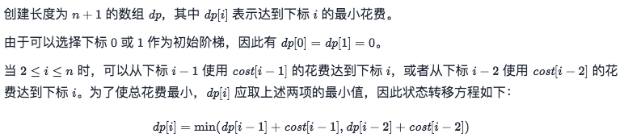

```C++
//T:O(n) S:O(1)
class Solution {
public:
    int minCostClimbingStairs(vector<int>& cost) {
        int n =cost.size();
        int a=0,b=0;    //第0，1阶都可以作为起始
        for(int i=2;i<=n;i++){
            int res = min(a+cost[i-2],b+cost[i-1]);//向上爬一个阶梯或者爬两个阶梯
            a = b;
            b = res;
        }
        return b;
    }
};
```

### (2)打家劫舍系列🀄️

##### [198. 打家劫舍](https://leetcode-cn.com/problems/house-robber/)🀄️

```C++
//T:O(n) S:O(1)
class Solution {
public:
    int rob(vector<int>& nums) {
        int prev=0,cur=0,res=0;  //cur 表示 dp[k-1]，prev 表示 dp[k-2]
        for(auto it:nums){//dp[k] = max(dp[k-1],num[i]+dp[k-2]) 偷前k-1个，或者 偷前k-2个和最后一个
            res = max(cur,prev+it);
            prev = cur;
            cur = res;
        }
        return res;
    }
};
```

##### [213. 打家劫舍 II](https://leetcode-cn.com/problems/house-robber-ii/)🀄️

```C++
//房子围成一圈
//T:O(n) S:O(1)
class Solution {
public:
    int work(vector<int>& nums) {
        int prev=0,cur=0,res=0;  //cur 表示 dp[k-1]，prev 表示 dp[k-2]
        for(auto it:nums){//dp[k] = max(dp[k-1],num[i]+dp[k-2]) 偷前k-1个，或者 偷前k-2个和最后一个
            res = max(cur,prev+it);
            prev = cur;
            cur = res;
        }
        return res;
    }
    int rob(vector<int>& nums) {
        int length = nums.size();
        if (length == 1) {
            return nums[0];
        } else if (length == 2) {
            return max(nums[0], nums[1]);
        }
        vector<int> nums1(nums.begin(),nums.end()-1);
        vector<int> nums2(nums.begin()+1,nums.end());
        return max(work(nums1),work(nums2));//1.抢头，不抢尾 2.不抢头，抢尾
    }
};
```

##### [337. 打家劫舍 III](https://leetcode-cn.com/problems/house-robber-iii/)🀄️

```C++
/*
一棵二叉树
T,S:O(n)
动态规划：
我们使用一个大小为 2 的数组来表示 int[] res = new int[2] 下标0 代表不偷，1 代表偷
任何一个节点能偷到的最大钱的状态可以定义为
    当前节点选择不偷：当前节点能偷到的最大钱数 = 左孩子能偷到的钱 + 右孩子能偷到的钱
    当前节点选择偷：当前节点能偷到的最大钱数 = 左孩子选择自己不偷时能得到的钱 + 右孩子选择不偷时能得到的钱 + 当前节点的钱数
*/
class Solution {
public: 
    vector<int> dp(TreeNode* root){
        vector<int> res={0,0};
        if(root == NULL) return res;   
        vector<int> l=dp(root->left);
        vector<int> r=dp(root->right);
        res[0] = max(l[0],l[1])+max(r[0],r[1]);//当前root不抢，子节点抢
        res[1] = l[0]+r[0]+root->val;//当前root抢，子节点不抢
        return res;
    }
    int rob(TreeNode* root) {
        vector<int> res= dp(root);
        return max(res[0],res[1]);
    }
};
```

##### [740. 删除并获得点数](https://leetcode-cn.com/problems/delete-and-earn/)

```C++
//T,S:O(n)
class Solution {
public:
    int rob(vector<int>& nums) {
        int prev=0,cur=0,res=0;  //cur 表示 dp[k-1]，prev 表示 dp[k-2]
        for(auto it:nums){//dp[k] = max(dp[k-1],num[i]+dp[k-2]) 偷前k-1个，或者 偷前k-2个和最后一个
            res = max(cur,prev+it);
            prev = cur;
            cur = res;
        }
        return res;
    }
    int deleteAndEarn(vector<int>& nums) {
        int maxVal = 0;
        for(auto val:nums) maxVal = max(val,maxVal);
        vector<int> sum(maxVal+1);
        for(auto val:nums) sum[val] += val; //按顺序存,统计所有相同元素之和
        return rob(sum);
        //若选择了x，则可以获取 sum[x] 的点数，且无法再选择 x−1和 x+1，这与打家劫舍一样
    }
};
```


### (3)股票系列

#### [121. 买卖股票的最佳时机](https://leetcode-cn.com/problems/best-time-to-buy-and-sell-stock/)🀄️

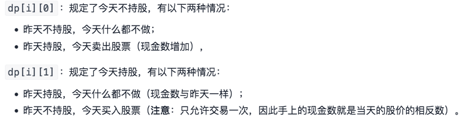


```C++
//T,S:O(n)
class Solution {
public:
    int maxProfit(vector<int>& prices) {
        int n = prices.size();
        int dp[n][2];
        dp[0][0] = 0, dp[0][1] = -prices[0];
        for (int i = 1; i < n; ++i) {
            dp[i][0] = max(dp[i - 1][0], dp[i - 1][1] + prices[i]);//今天不持股：1.今天什么都不做 2.昨天持股卖出，加上今天的价钱
            dp[i][1] = max(dp[i - 1][1],  - prices[i]);//今天持股：1.今天什么都不做 2.今天买入（只允许1次，所以是第一次买入）
        }
        return dp[n - 1][0];
    }
};

```

#### [122. 买卖股票的最佳时机 II](https://leetcode-cn.com/problems/best-time-to-buy-and-sell-stock-ii/)🀄️

```C++
//可以多次交易
//T,S:O(n)
class Solution {
public:
    int maxProfit(vector<int>& prices) {
        int n = prices.size();
        int dp[n][2];
        dp[0][0] = 0, dp[0][1] = -prices[0];
        for (int i = 1; i < n; ++i) {
            dp[i][0] = max(dp[i - 1][0], dp[i - 1][1] + prices[i]);//今天不持股：1.今天什么都不做 2.昨天持股卖出，加上今天的价钱
            dp[i][1] = max(dp[i - 1][1],  dp[i - 1][0] - prices[i]);	//今天持股：1.昨天持股，今天什么都不做 2.昨天没有持股，今天买入
        }
        return dp[n - 1][0];
    }
};
```

#### [123. 买卖股票的最佳时机 III](https://leetcode-cn.com/problems/best-time-to-buy-and-sell-stock-iii/)

```C++

```

#### [188. 买卖股票的最佳时机 IV](https://leetcode-cn.com/problems/best-time-to-buy-and-sell-stock-iv/)

```C++

```

#### [309. 最佳买卖股票时机含冷冻期](https://leetcode-cn.com/problems/best-time-to-buy-and-sell-stock-with-cooldown/)

```

```

#### [714. 买卖股票的最佳时机含手续费](https://leetcode-cn.com/problems/best-time-to-buy-and-sell-stock-with-transaction-fee/)

```C++

```


### (4)最大子数组和系列

#### [53. 最大子序和](https://leetcode-cn.com/problems/maximum-subarray/)🀄️

```C++
//T:O(n) S:O(1)
class Solution {
public:
    int maxSubArray(vector<int>& nums) {
        int prev=0,res=nums[0];
        for(auto it:nums){
            prev = max(prev+it,it); // f(i) = max(f(i-1)+nums[i],nums[i])
            res = max(res,prev);    // max{f(n)}
        }
        return res;
    }
};
```

#### [918. 环形子数组的最大和](https://leetcode-cn.com/problems/maximum-sum-circular-subarray/)

```C++
//T:O(n) S:O(1)
class Solution {
public:
    int maxSubarraySumCircular(vector<int>& nums) {
        //maxSum最大和 minSum最小和
        int maxSum=nums[0],minSum=nums[0],pre1=0,pre2=0,arrSum=0;
        for (auto num : nums) {
            arrSum+=num;
            pre1=num>pre1+num?num:pre1+num;
            maxSum=maxSum>pre1?maxSum:pre1;
          
            pre2=num<pre2+num?num:pre2+num;
            minSum=minSum<pre2?minSum:pre2;
        }
        if (maxSum<0){      //第三种情况，全部负数
            return maxSum;
        }
        //第2种情况，在两端：arrSum-minSum；第一种情况：在中间maxSum,就跟53题一样
        return arrSum-minSum>maxSum?arrSum-minSum:maxSum;
    }
};
```

#### [152. 乘积最大子数组](https://leetcode-cn.com/problems/maximum-product-subarray/)

```C++
//由于第 i 个状态只和第 i−1个状态相关，根据「滚动数组」思想
//T:O(n) S:O(1)
class Solution {
public:
    int maxProduct(vector<int>& nums) {
        int maxF = nums[0], minF = nums[0], res = nums[0];
        for (int i = 1; i < nums.size(); ++i) {
            int mx = maxF, mn = minF;
            maxF = max(mx * nums[i], max(nums[i], mn * nums[i]));//三种情况
            minF = min(mx * nums[i], min(nums[i], mn * nums[i]));
            res = max(maxF, res);
        }
        return res;
    }
};
```

#### [1567. 乘积为正数的最长子数组长度](https://leetcode-cn.com/problems/maximum-length-of-subarray-with-positive-product/)

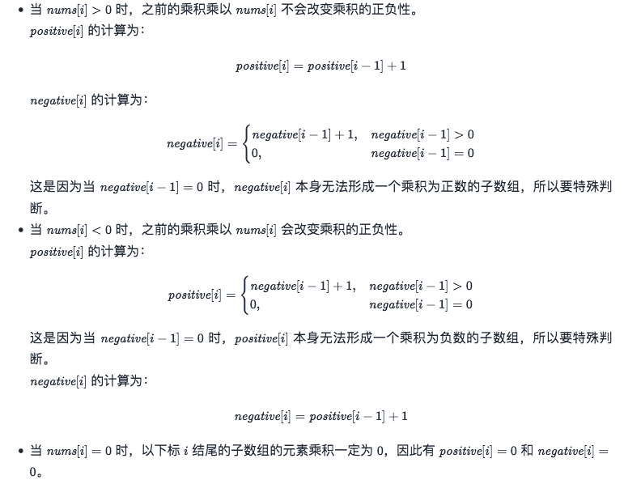

```C++
//T:O(n) S:O(1)
class Solution {
public:
    int getMaxLen(vector<int>& nums) {
        int length = nums.size();
        int positive = (nums[0] > 0);
        int negative = (nums[0] < 0);
        int maxLength = positive;
        for (int i = 1; i < length; ++i) {
            if (nums[i] > 0) {  //不变
                ++positive;
                negative = (negative > 0 ? negative + 1 : 0);
            }
            else if (nums[i] < 0) {  //全部取反
                int newPositive = negative > 0 ? negative + 1 : 0;
                int newNegative = positive + 1;
                tie(positive, negative) = {newPositive, newNegative};
            }
            else {  
                positive = negative = 0;
            }
            maxLength = max(maxLength, positive);  //乘积为正数的最长子数组长度
            //maxLength = max(maxLength, negative);//乘积为负数的最长子数组长度
        }
        return maxLength;
    }
};
```

#### [1014. 最佳观光组合](https://leetcode-cn.com/problems/best-sightseeing-pair/)

```C++
class Solution {
public:
    int maxScoreSightseeingPair(vector<int>& values) {
        int res = 0, mx = values[0] + 0;    //mx = values[i] + i
        for (int j = 1; j < values.size(); ++j) {
            res = max(res, mx + values[j] - j); //values[j] - j是固定不变的
            // 边遍历边维护
            mx = max(mx, values[j] + j);
        }
        return res;
    }
};
```

### (5)单串 LIS 系列🀄️

##### [300. 最长递增子序列](https://leetcode-cn.com/problems/longest-increasing-subsequence/)🀄️

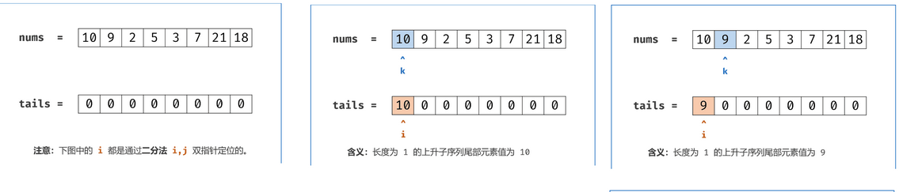

```C++
//T:O(n^2) S:O(n)
class Solution {
public:
    int lengthOfLIS(vector<int>& nums) {
        int n = (int) nums.size();
        if(n == 0)  return 0;
        vector<int> dp(n,1);
        int res = 0;
        for(int i=0;i<n;i++){
            for(int j=0;j<i;j++)
                if(nums[i] > nums[j]) //后面的数 > 前面的数
                    dp[i] = max(dp[i],dp[j]+1);//没有减，所以下标为0
            res = max(res,dp[i]);
        }
        return res;//取里面最大的长度
    }
};

//贪心+二分
//T:O(nlogn) S:O(n)
 //如果我们要使上升子序列尽可能的长，则我们需要让序列上升得尽可能慢，因此我们希望每次在上升子序列最后加上的那个数尽可能的小。
class Solution {
public:
    int lengthOfLIS(vector<int>& nums) {
        int len = 1, n = (int)nums.size();
        if (n == 0) {
            return 0;
        }
        vector<int> d(n + 1, 0);    //d数组单调递增
        d[len] = nums[0];           //d[1] =nums[0]初始化
        for (int i = 1; i < n; ++i) {   
            if (nums[i] > d[len]) { //要大的
                d[++len] = nums[i]; 
            } else {
                int l = 1, r = len, pos = 0; //所有的数不小于nums[i] ，此时要更新 d[1]，所以这里将 pos 设为 0
                while (l <= r) {
                    int mid = (l + r) >> 1;
                    if (d[mid] < nums[i]) { //在d数组中寻找比nums[i]小的
                        pos = mid;
                        l = mid + 1;
                    } else {
                        r = mid - 1;
                    }
                }
                d[pos + 1] = nums[i];
            }
        }
        return len;
    }
};
```

##### [673. 最长递增子序列的个数](https://leetcode-cn.com/problems/number-of-longest-increasing-subsequence/)🀄️

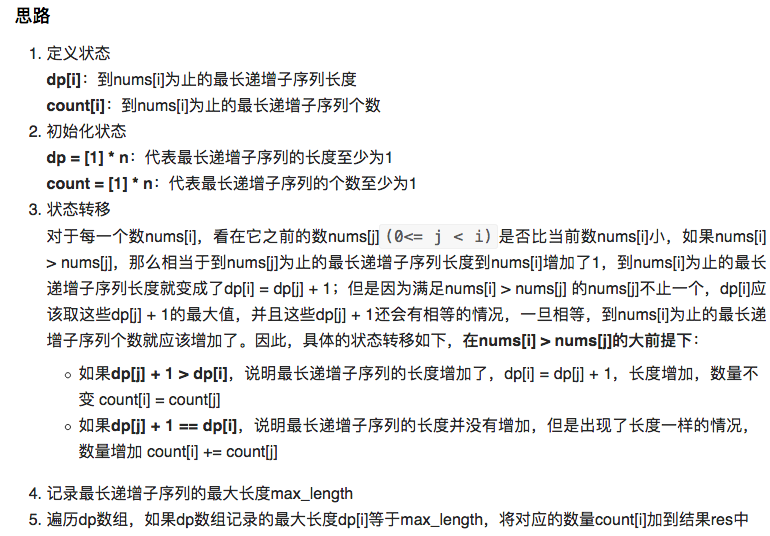

```C++
//T:O(n^2)  S:O(n)
class Solution {
public:
    int findNumberOfLIS(vector<int>& nums) {

        int n = (int)nums.size();
        if (n == 0) return 0;
        vector<int> dp(n, 1);
      	vector<int> cnt(n, 1);
        for (int i = 0; i < n; ++i) {	
            for (int j = 0; j < i; ++j) {
                if (nums[j] < nums[i]) {
                	if(dp[j]+1 > dp[i]){
                      	dp[i] = dp[j] + 1;
                        cnt[i] = cnt[j];
                    }else if(dp[j] + 1 == dp[i])//长度一样的
                    	cnt[i] += cnt[j];
                }
            }
        }
      	int max_length = *max_element(dp.begin(), dp.end());
      	int res = 0;
      	for (int i = 0; i < n; ++i)
            if(dp[i] == max_length)
          	    res +=cnt[i]; 
        return res;	
        
    }
};
//贪心 + 前缀和 + 二分查找   T:O(nlogn) S:O(n)
```

##### [354. 俄罗斯套娃信封问题](https://leetcode-cn.com/problems/russian-doll-es/)🀄️

```C++
class Solution {
public:
    int maxEnvelopes(vector<vector<int>>& es) {
        if (es.empty()) {
            return 0;
        }
        
        int n = es.size();
// 因为我们在找第 i 件物品的前一件物品时，会对前面的 i - 1 件物品都遍历一遍，因此第二维（高度）排序与否都不影响
        sort(es.begin(), es.end(), [](const auto& e1, const auto& e2) {
            return e1[0] < e2[0] || (e1[0] == e2[0] && e1[1] > e2[1]);
        });

        vector<int> dp(n, 1);
        for (int i = 1; i < n; ++i) {
            for (int j = 0; j < i; ++j) {	//找下界
                if (es[j][1] < es[i][1]) {
                    dp[i] = max(dp[i], dp[j] + 1);
                }
            }
        }
        return *max_element(dp.begin(), dp.end());
    }
};
```

```C++
//方法2:二分+动态
class Solution {
public:
    int maxEnvelopes(vector<vector<int>>& es) {
        if (es.empty()) return 0;
        int n = es.size();
        sort(es.begin(), es.end(), [](const auto& e1, const auto& e2) {
            return e1[0] < e2[0] || (e1[0] == e2[0] && e1[1] > e2[1]);
        });

        vector<int> dp = {es[0][1]};
        for (int i = 1; i < n; ++i) {
            if (int num = es[i][1]; num > dp.back()) {
                dp.push_back(num);
            }
            else {
                auto it = lower_bound(dp.begin(), dp.end(), num);
                *it = num;
            }
        }
        return dp.size();
    }
};
```


### (6)贪心数组

##### [55. 跳跃游戏](https://leetcode-cn.com/problems/jump-game/)🀄️

```C++
//T:O(n)  S:O(1)
class Solution {
public:
    bool canJump(vector<int>& nums) {
        int n = nums.size();
        int r = 0;  //实时维护 最远可以到达的位置
        for (int i = 0; i < n; ++i) {   // x+nums[x]≥y, x本身可以到达
            if (i <= r) {
                r = max(r, i + nums[i]);    
                if (r >= n - 1) {
                    return true;
                }
            }
        }
        return false;
    }
};
```

##### [45. 跳跃游戏 II](https://leetcode-cn.com/problems/jump-game-ii/)🀄️

```C++
/*我们维护当前能够到达的最大下标位置，记为边界。我们从左到右遍历数组，到达边界时，更新边界并将跳跃次数增加 1。
在遍历数组时，我们不访问最后一个元素，这是因为在访问最后一个元素之前，我们的边界一定大于等于最后一个位置，否则就无法跳到最后一个位置了。如果访问最后一个元素，在边界正好为最后一个位置的情况下，我们会增加一次「不必要的跳跃次数」，因此我们不必访问最后一个元素。
*/
class Solution {
public:
    int jump(vector<int>& nums) {
        int r = 0, n = nums.size(), end = 0, step = 0;
        for (int i = 0; i < n - 1; ++i) {
            if (i <= r) {
                r = max(r, i + nums[i]);
                if (i == end) { //当前i可以到达r
                    end = r;	//更新边界
                    ++step;//每过一个边界+1
                }
            }
        }
        return step;
    }
};
```

### (7)带维度单串 dp[i] [k]

#### [813. 最大平均值和的分组](https://leetcode-cn.com/problems/largest-sum-of-averages/)

```
//—— k 是个数
```


#### [1478. 安排邮筒](https://leetcode-cn.com/problems/allocate-mailboxes/)

```
//—— k 是个数，前缀和维护状态转移时的查询
```


#### [1230. 抛掷硬币](https://leetcode-cn.com/problems/toss-strange-coins/)

```
//—— k 是个数
```


#### [410. 分割数组的最大值](https://leetcode-cn.com/problems/split-array-largest-sum/)

```C++
//—— k 是份数
```

#### [887. 鸡蛋掉落](https://leetcode-cn.com/problems/super-egg-drop/)

```C++
// —— k 是次数，k 上有二分
```

#### [975. 奇偶跳](https://leetcode-cn.com/problems/odd-even-jump/)

```C++
//—— k 表示当前的奇偶状态
```


#### [403. 青蛙过河](https://leetcode-cn.com/problems/frog-jump/)

```C++
//—— k 表示上一步的跳的步数
```

#### [256. 粉刷房子](https://leetcode-cn.com/problems/paint-house/)

```C++
// —— k 是颜色
```

#### [265. 粉刷房子 II](https://leetcode-cn.com/problems/paint-house-ii/)

```C++
//—— k 是颜色
```

#### [1473. 粉刷房子 III](https://leetcode-cn.com/problems/paint-house-iii/)

```C++
//—— 有两个指标 k 颜色；t 街区数
```

#### [32. 最长有效括号](https://leetcode-cn.com/problems/longest-valid-parentheses/)

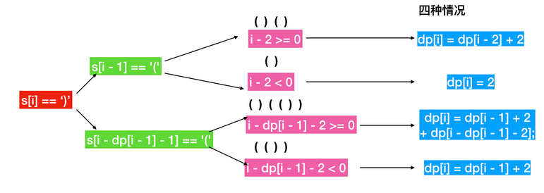

```C++
//T:O(n^2)
/*暴力 O(n^3)
{
	for(n)
		for(n){
			isVaild(n)
		}
}
*/
class Solution {
public:
    int longestValidParentheses(string s) {
        int maxans = 0, n = s.length();
        vector<int> dp(n, 0); //dp[i]表示以i结尾的最长有效括号的长度，分为4种情况
        for (int i = 1; i < n; i++) {
            if (s[i] == ')') {
                if (s[i - 1] == '(') {  //()()相邻匹配，
                    dp[i] = (i >= 2 ? dp[i - 2] : 0) + 2;
                } else if (i - dp[i - 1] > 0 && s[i - dp[i - 1] - 1] == '(') {// ()(()) 2:自身   dp[i - dp[i - 1] - 2]：外部  dp[i-1]：内部
                    dp[i] = dp[i - 1] + ((i - dp[i - 1]) >= 2 ? dp[i - dp[i - 1] - 2] : 0) + 2;
                }
                maxans = max(maxans, dp[i]);
            }
        }
        return maxans;
    }
};
```

#### [516. 最长回文子序列](https://leetcode-cn.com/problems/longest-palindromic-subsequence/)

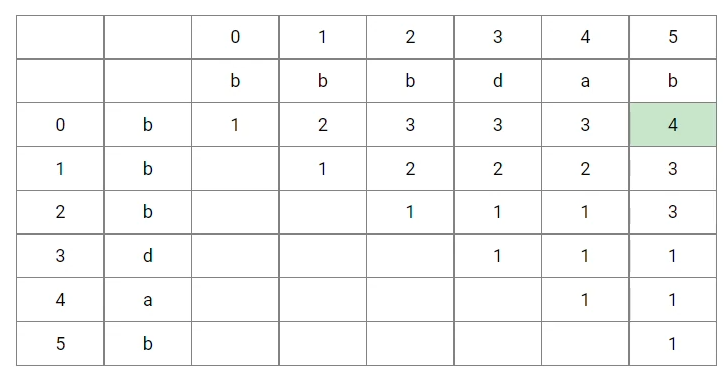

```C++
//T,S:O(n^2)
class Solution {
public:
    int longestPalindromeSubseq(string s) {
        int n = s.size();
        vector<vector<int>> dp(n,vector<int>(n));  
        for (int i = n - 1; i >= 0; i--) {
            dp[i][i] = 1;       //每个字符的最大长度
            for (int j = i + 1; j < n; j++) {
                if (s[i] == s[j]) {
                    dp[i][j] = dp[i + 1][j - 1] + 2;
                } else {
                    dp[i][j] = max(dp[i + 1][j], dp[i][j - 1]);
                }
                cout << dp[i][j] <<" ";
            }
            cout << endl;

        }
        return dp[0][n - 1];
    }
};

class Solution {
    public int longestPalindromeSubseq(String s) {
        int n = s.length();
        int[][] dp = new int [n][n];    //从第0到j的最长回文子序列的长度
        dp[0][0] = 1;
        for(int len=1;len<n;len++){ //从长度1开始
            for(int i=0;i+len<n;i++){
                dp[i][i] = 1;   // 对角线,初始化
                int j=i+len;
                if(s.charAt(i) == s.charAt(j)){
                    //i,i+1...,j-1,j=> [i+1,j-1]+2
                    dp[i][j] = dp[i+1][j-1]+2;  //向子问题（上一个回文子序列）要答案
                }else{  //不等，则取左边或者下边最大的
                    dp[i][j] = Math.max(dp[i][j-1],dp[i+1][j]);
                }
            }
        }
        return dp[0][n-1];  //从0到n-1的最长回文子序列的长度，跟dp的定义相同
    }
}
```

#### [647. 回文子串](https://leetcode-cn.com/problems/palindromic-substrings/)

```

```


### **(8)双串**

#### [1143. 最长公共子序列](https://leetcode-cn.com/problems/longest-common-subsequence/)


```C++
//T,S:O(n)
class Solution {
public:
    int longestCommonSubsequence(string text1, string text2) {
        int m = text1.length(), n = text2.length();
        vector<vector<int>> dp(m + 1, vector<int>(n + 1));
        for (int i = 1; i <= m; i++) {
            char c1 = text1[i - 1];
            for (int j = 1; j <= n; j++) {
                char c2 = text2[j - 1];
                if (c1 == c2) {
                    dp[i][j] = dp[i - 1][j - 1] + 1;
                } else {
                    dp[i][j] = max(dp[i - 1][j], dp[i][j - 1]);
                }
            }
        }
        return dp[m][n];
    }
};
```

#### [712. 两个字符串的最小ASCII删除和](https://leetcode-cn.com/problems/minimum-ascii-delete-sum-for-two-strings/) —— LCS，len 和 ascii 各一个 dp

```

```

最长重复子数组 —— 最长公共子串，注意与最长公共子序列的区别

#### [718. 最长重复子数组](https://leetcode-cn.com/problems/maximum-length-of-repeated-subarray/)

```

```

#### [1923. 最长公共子路径](https://leetcode-cn.com/problems/longest-common-subpath/) 718题的扩展

```

```

### 双串问题：字符串匹配系列

#### [剑指 Offer 19. 正则表达式匹配](https://leetcode-cn.com/problems/zheng-ze-biao-da-shi-pi-pei-lcof/)

#### [10. 正则表达式匹配](https://leetcode-cn.com/problems/regular-expression-matching/)

### 双串问题：其它双串 dp[i] [j] 问题

#### [97. 交错字符串](https://leetcode.cn/problems/interleaving-string/)

- 不同的子序列

### 双串问题：带维度双串 dp[i] [j] [k]

- 扰乱字符串

### **(9)矩阵**

矩阵 dp[i] [j]

- 三角形最小路径和
- 最小路径和
- 地下城游戏
- 下降路径最小和
- 最大正方形
- 下降路径最小和  II

矩阵 dp[i] [j] [k]

最大矩形

- 矩形区域不超过 K 的最大数值和 —— k 为宽度
- 最大子矩阵 —— 思路类似一维的最大子数组和
- 切披萨的方案数 —— 需要二维前缀和判断两个状态之间能否转移

无串线性问题

- 只有两个键的键

#### [279. 完全平方数](https://leetcode.cn/problems/perfect-squares/)

#### [343. 整数拆分](https://leetcode.cn/problems/integer-break/)


### (10)前缀和(区间求和、子矩形求和)

**求区间和**

[303. 区域和检索 - 数组不可变](https://leetcode-cn.com/problems/range-sum-query-immutable/)

**实现前缀和问题**

- 区域和检索 - 数组不可变
- 二维区域和检索 - 矩阵不可变

**数据结构维护前缀和**

[560. 和为 K 的子数组](https://leetcode-cn.com/problems/subarray-sum-equals-k/)

[327. 区间和的个数](https://leetcode-cn.com/problems/count-of-range-sum/)

[437. 路径总和 III](https://leetcode-cn.com/problems/path-sum-iii/)

数据结构维护前缀和问题：HashMap 维护（1）
HashMap 维护（1），键是前缀和（状态）的值，值为第一次出现时的索引。

- 和等于 k 的最长子数组长度
- 连续数组
- 每个元音包含偶数次的最长子字符串 —— 前缀状态为 a,e,i,o,u 的个数的奇偶

HashMap 维护（2），键是前缀和（前缀状态）的值，值为出现次数。

- 和为 K 的子数组
- 统计优美子数组 —— 前缀状态为奇数的个数

HashMap 维护（3），键是前缀和模 K 的余数（可以理解为前缀状态，状态为前缀和模 K）。

- 连续的子数组和 —— 值为第一次出现时的索引
- 和可被 K 整除的子数组 —— 值为出现次

在有些问题中，计算答案时同时需要用到前缀和和后缀和，例如下面这几道题。

- 除自身以外数组的乘积
- 寻找数组的中心索引
- 找两个和为目标值且不重叠的子数组 —— 前缀和后缀和分别推一次，推的时候保存信息（DP），枚举分割点

二维前缀和

- 元素和为目标值的子矩阵数量
- 矩阵区域和
- 最大子矩阵 —— 思路类似一维的最大子数组和
- 矩形区域不超过 K 的最大数值和 —— 在上一题基础上加了一个 K

前缀积

- 乘积最大子数组
- 乘积小于K的子数组
- 最后 K 个数的乘积 —— 若乘法的前缀积会溢出，可以用对数的前缀和防溢出，但是结果转回整数需要用四舍五入而不是下取整

前缀异或

- 子数组异或查询
- 形成两个异或相等数组的三元组数目 —— 哈希表维护前缀异或结果，类似 「560. 和为 K 的子数组」

差分问题

- 区间加法 —— 用差分维护区间加法模板

# 6.DP(二)

## **(1)背包**DP

> 背包问题是一种组合优化的 NP 完全问题：有 *N* 个物品和容量为*V* 的背包，每个物品都有自己的体积 v 和价值 w，求拿哪些物品可以使得背包所装下物品的总价值最大。
> 如果限定每种物品只能选择 0 个或 1 个，则问题称为 <u>0-1 背包问题</u>；
> 如果不限定每种物品的数量，则问题称为无界背包问题或<u>完全背包问题</u>。
> 如果每种物品的数量不一样，则问题称为<u>多重背包问题</u>。
> 如果每组有多种物品，每组只能选择1种，则问题称为<u>分组背包问题</u>。

<!--more-->

**背包问题的分析步骤：**

```
分析是否为背包问题。
1)是背包问题三种问法中的哪一种。
2)0-1 背包问题还是完全背包问题，即求最值。
也就是题目给的 nums 数组中的元素是否可以重复使用。
3)如果是组合问题，即求方案数，是否需要考虑元素之间的顺序。需要考虑顺序有顺序的解法，不需要考虑顺序又有对应的解法，需要注意。
```

[背包问题总结篇](https://programmercarl.com/背包总结篇.html)


### 01背包

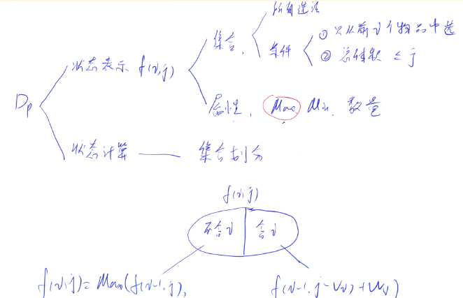

```C++
/*
01背包
版本1
*/
using namespace std;

const int MAXN = 1005;
int v[MAXN];    // 体积
int w[MAXN];    // 价值 
int f[MAXN][MAXN];  // f[i][j], 前i个物品且体积<=j时的最大价值 

int main() 
{
    int n, m;   
    cin >> n >> m;
    for(int i = 1; i <= n; i++) 
        cin >> v[i] >> w[i];

    for(int i = 1; i <= n; i++) 
        for(int j = 1; j <= m; j++)
        {
            //  当前背包容量装不进第i个物品，则价值等于前i-1个物品
            if(j < v[i]) 
                f[i][j] = f[i - 1][j];
             // 能装，需要决策选与不选第 i 个物品
            else    
                f[i][j] = max(f[i - 1][j], f[i - 1][j - v[i]] + w[i]);
        }           

    cout << f[n][m] << endl;

    return 0;
}
```

```C++
/*
01背包
版本2
*/
#include <iostream>

using namespace std;

const int N = 1010;

int n, m;
int v[N], w[N];	// 体积,价值
int f[N];

int main() {
    cin >> n >> m;
    for(int i = 1; i <= n; i++) cin >> v[i] >> w[i];
    for(int i = 1; i <= n; i++) //先遍历物品，再遍历背包
      //如果遍历背包容量放在上一层，那么每个dp[j]就只会放入一个物品
        for(int j = m; j >= v[i]; j--) //倒叙保证物品i只被放入一次，防止dp[i]加上计算过的dp[i-1]
            f[j] = max(f[j], f[j-v[i]]+w[i]);
    cout << f[m] << endl;
    return 0;    
}
/*
为什么一维情况下枚举背包容量需要逆序？
一维情况正序更新状态f[j]需要用到前面计算的状态已经被「污染」，逆序则不会有这样的问题。
*/
```

[01背包问题理论基础二维dp数组](https://programmercarl.com/背包理论基础01背包-1.html)

[01背包问题理论基础一维dp数组（滚动数组）](https://programmercarl.com/背包理论基础01背包-2.html)


#### 规律

```java
//规律
//方案数
dp[i] += dp[i-num]
//True、False问题公式
dp[i] = dp[i] or dp[i-num]
//最大最小问题公式
dp[i] = min(dp[i], dp[i-num]+1)或者dp[i] = max(dp[i], dp[i-num]+1)
    
//遍历方式
0-1背包：物品，背包逆序 
完全背包：物品，背包正序 
组合问题：物品，背包正序  （零钱兑换I，零钱兑换 II）
排列问题：背包，物品正序  （组合总和 Ⅳ，这个其实是排列数）
```


#### [416. 分割等和子集](https://leetcode-cn.com/problems/partition-equal-subset-sum/)🀄️

```C++
//T:O(n^2) S:O(n)
//物品是nums[i]，重量是nums[i]，价值也是nums[i]，背包体积是sum/2，分成2个背包
class Solution {
public:
    bool canPartition(vector<int>& nums) {
        int sum = 0;

        // (1)dp[i]中的i表示背包内总和
        // 题目中说：每个数组中的元素不会超过 100，数组的大小不会超过 200
        // 总和不会大于20000，背包最大只需要其中一半，所以10001大小就可以了
        vector<int> dp(10001, 0);//(3)
        for (int i = 0; i < nums.size(); i++) {
            sum += nums[i];
        }
        if (sum % 2 == 1) return false;
        int target = sum / 2;

        // 开始 01背包
        for(int i = 0; i < nums.size(); i++) {//(4)
            for(int j = target; j >= nums[i]; j--) { 
                dp[j] = max(dp[j], dp[j - nums[i]] + nums[i]);//(2)
            }
        }
        // 集合中的元素正好可以凑成总和target
        return dp[target] == target
    }
};
```

#### [474. 一和零](https://leetcode-cn.com/problems/ones-and-zeroes/)

```C++
//有两个维度的01背包
//(1)dp[i][j]：最多有i个0和j个1的strs的最大子集的大小为dp[i][j]。
class Solution {
public:
    int findMaxForm(vector<string>& strs, int m, int n) {
        vector<vector<int>> dp(m + 1, vector<int> (n + 1, 0)); // (3)默认初始化0
        for (string str : strs) { // (4)遍历物品
            int oneNum = 0, zeroNum = 0;
            for (char c : str) {
                if (c == '0') zeroNum++;
                else oneNum++;
            }
            for (int i = m; i >= zeroNum; i--) { // 遍历背包容量且从后向前遍历！
                for (int j = n; j >= oneNum; j--) {
                    dp[i][j] = max(dp[i][j], dp[i - zeroNum][j - oneNum] + 1);//(2)
                }
            }
        }
        return dp[m][n];
    }
};
```

#### [494. 目标和](https://leetcode-cn.com/problems/target-sum/)

```

```

#### [1049. 最后一块石头的重量 II](https://leetcode-cn.com/problems/last-stone-weight-ii/)

```

```


### 完全背包

```C++
/*
完全背包:朴素做法
*/
#include<iostream>
using namespace std;
const int N = 1010;
int f[N][N];
int v[N],w[N];
int main()
{
    int n,m;
    cin>>n>>m;
    for(int i = 1 ; i <= n ;i ++)
    {
        cin>>v[i]>>w[i];
    }

    for(int i = 1 ; i<=n ;i++){
      for(int j = 0 ; j<=m ;j++)
      {
          for(int k = 0 ; k*v[i]<=j ; k++)	//体积最大j
              f[i][j] = max(f[i][j],f[i-1][j-k*v[i]]+k*w[i]);
      }
    }

    cout<<f[n][m]<<endl;
}
```

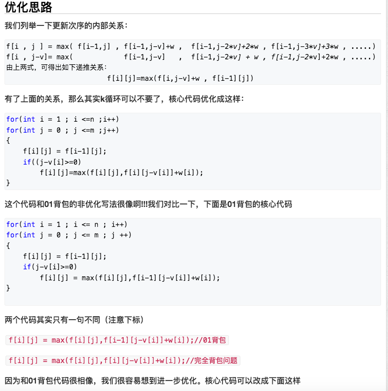

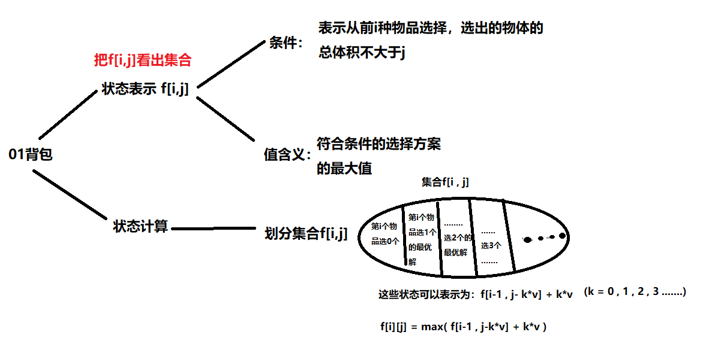

```C++
/*
完全背包:优化
先遍历物品，后遍历背包
*/
#include<iostream>
using namespace std;
const int N = 1010;
int f[N];
int v[N],w[N];
int main()
{
    int n,m;
    cin>>n>>m;
    for(int i = 1 ; i <= n ;i ++)
    {
        cin>>v[i]>>w[i];
    }

    for(int i = 1 ; i<=n ;i++)
      for(int j = v[i] ; j<=m ;j++) //注意了，正向遍历，和01背包不一样
              f[j] = max(f[j],f[j-v[i]]+w[i]);
    cout<<f[m]<<endl;
}
```

#### [322. 零钱兑换](https://leetcode-cn.com/problems/coin-change/)🀄️

```C++
//最值问题 T:O(amount*coins)  S:O(amount)   amount:总金额，coins为硬币数
class Solution {
    public int coinChange(int[] coins, int amount) {
        int Max = amount + 1;
        int[] dp = new int[amount + 1];    //dp[i]代表金额i所需最少的硬币个数
        Arrays.fill(dp, Max);
        dp[0] = 0;      
        for (int coin : coins) {                    //金额0所需要的0个硬币
            for(int i = coin ; i<=amount;i++){ //注意了，正向遍历，和01背包不一样
                if(dp[i-coin] != Max){  //当前金额i必须>=j，才可以兑换
                    dp[i] = Math.min(dp[i],dp[i-coin]+1);
                }    
            }
        }
        return dp[amount] > amount ? -1:dp[amount];
    }
}
```

#### [518. 零钱兑换 II](https://leetcode-cn.com/problems/coin-change-2/)🀄️

```C++
//方案问题 T:O(amount*coins)  S:O(amount)   amount:总金额(背包)，coins为硬币数
//同原始 
class Solution {
public:
    int change(int amount, vector<int>& coins) {
        vector<int> dp(amount + 1);   //dp[i]代表金额i的方案数
        dp[0] = 1;                    //金额0所需要的0个硬币,1个方案
        for (int& coin : coins) {     //⚠️先遍历硬币，这样内循环遍历的金额都是按顺序的，不会重复
            for(int i = coin ; i<=amount;i++){
                dp[i] += dp[i-coin];
            }
        }
        return dp[amount];
    }
};
```

#### [279. 完全平方数](https://leetcode-cn.com/problems/perfect-squares/)


```C++
//最值问题  T:O(n∗sqrt(n))
//(1)dp[i]代表i用最少的平方数的个数
class Solution {
public:
    int numSquares(int n) {
        vector<int> dp(n+1,0); // (3)默认初始化值都为0
        for (int i = 1; i <= n; i++) {
            dp[i] = i;         // 最坏的情况就是每次+1
            for (int j = 1; i - j * j >= 0; j++) {  // (4)顺序遍历
                dp[i] =min(dp[i], dp[i - j * j] + 1); // (2)动态转移方程
            }
        }
        return dp[n];
    }
};
```

#### [139. 单词拆分](https://leetcode-cn.com/problems/word-break/)

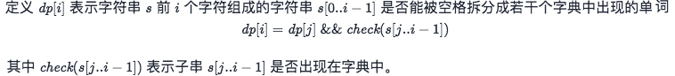

```C++
//T:O(n^2) S:O(n)
//单词就是物品，字符串s就是背包，单词能否组成字符串s，就是问物品能不能把背包装满。
//拆分时可以重复使用字典中的单词，说明就是一个完全背包！
class Solution {
public:
    bool wordBreak(string s, vector<string>& wordDict) {
        unordered_set<string> dict;
        for (auto word: wordDict) { //哈希表
            dict.insert(word);
        }
        // dp[i]表示字符串 s 前 i 个字符组成的字符串 s[0..i−1]是否能被空格拆分成若干个字典中出现的单词
        vector <bool> dp(s.size() + 1);
        dp[0] = true;
        for (int i = 1; i <= s.size(); ++i) {
            for (int j = 0; j < i; ++j) {
                // 前i个字符串[0..j-1] 子串：[j,i]
                if (dp[j] && dict.find(s.substr(j, i - j)) != dict.end()) {
                    dp[i] = true;
                    break;
                }
            }
        }
        return dp[s.size()];
    }
};
```

#### [377. 组合总和 Ⅳ](https://leetcode-cn.com/problems/combination-sum-iv/)

```C++
//方案数问题	T:O(targer*n) S:O(targer)
//（1）用 dp[i]表示选取的元素之和等于 i 的方案数
//nums数组就是物品，target就是背包，数字能否组成targer，就是问物品能不能把背包装满。
class Solution {
public:
    int combinationSum4(vector<int>& nums, int target) {
        vector<int> dp(target + 1);
        dp[0] = 1; //(3)
        for (int i = 1; i <= target; i++) {//(4)
            for (int& num : nums) {
                if (num <= i && dp[i - num] < INT_MAX - dp[i]) {
                    dp[i] += dp[i - num];//(2)
                }
            }
        }
        return dp[target];
    }
};
```

#### 进阶爬楼梯

**改为：一步一个台阶，两个台阶，三个台阶，.......，直到 m个台阶。问有多少种不同的方法可以爬到楼顶呢？**

```C++
class Solution {
public:
    int climbStairs(int n) {
        vector<int> dp(n + 1, 0);
        dp[0] = 1;
        for (int i = 1; i <= n; i++) { // 遍历背包
            for (int j = 1; j <= m; j++) { // 遍历物品
                if (i - j >= 0) dp[i] += dp[i - j];
            }
        }
        return dp[n];
    }
};

```


### 多重背包

[动态规划：关于多重背包，你该了解这些！](https://programmercarl.com/背包问题理论基础多重背包.html)

[4.多重背包问题 I](https://www.acwing.com/problem/content/description/4/)

> 一个基本思路是，将此问题转换为01背包求解！
>
> 比如物品1有3件，每件价值为2，我们不妨创建3个物品1，存在数组v和数组w中
>
> 最终更新一下总物品数n即可，然后套用01背包问题进行求解。

```C++
/*
朴素版
*/
using namespace std;
int a[10005],b[10005];
int main()
{
    int t=0,n,m,dp[10005]={ },w,v,s;
    cin>>n>>m;
    while(n--)
    {
    cin>>v>>w>>s;
    while(s--)
    {a[++t]=v;
    b[t]=w;}//死拆，把多重背包拆成01背包
    }
    for(int i=1;i<=t;i++)
    for(int j=m;j>=a[i];j--)
    dp[j]=max(dp[j-a[i]]+b[i],dp[j]);//直接套01背包的板子
    cout<<dp[m]<<endl;
    return 0;
}

/*
优化版
*/
#include <bits/stdc++.h>
using namespace std;
main()
{
    int dp[1005],n,m,v,w,s;
    cin>>n>>m;
    while(n--)
    {
        cin>>v>>w>>s;
        for(int i=1;i<=s;i++)
        for(int j=m;j>=v;j--)
            dp[j]=max(dp[j],dp[j-v]+w);
    }
    cout<<dp[m];
}
```


[5. 多重背包问题 II](https://www.acwing.com/problem/content/5/)

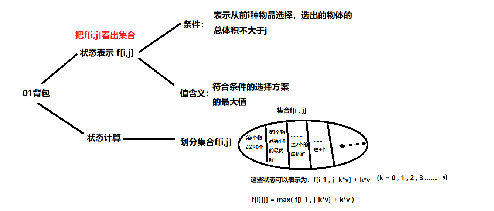

思路和多重背包问题I一样，但这题的数据范围变成1000了，非优化写法时间复杂度O(n^3) 接近 1e9

必超时。

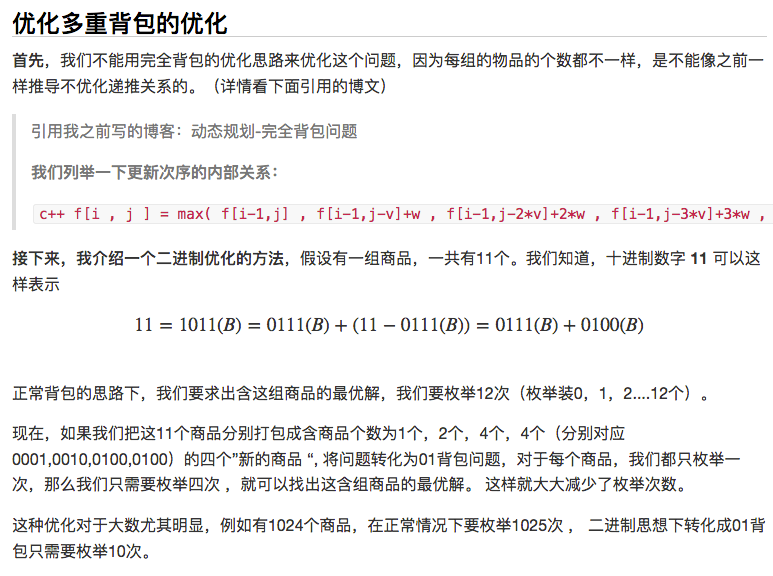

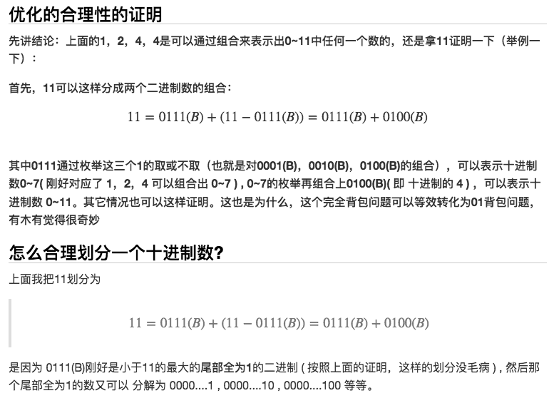

```C++
#include<iostream>
#include<algorithm>
#include<vector>
using namespace std;
const int N = 2010;
int dp[N],n,m;
struct good
{
    int w,v;
};

int main()
{
    cin>>n>>m;
    vector<good> Good;
    good tmp;

    //二进制处理
    for(int i = 1 ; i <= n ; i++ )
    {
        int v,w,s;
        cin>>v>>w>>s;
        //坑,k <= s
        for(int k = 1 ; k <= s ; k*=2 )
        {
            s-=k;
            Good.push_back({k*w,k*v});
        }
        if(s>0) Good.push_back({s*w,s*v});
    }

    //01背包优化+二进制
    for(auto t : Good)
        for(int j = m ; j >= t.v ; j--)
            dp[j] = max(dp[j] , dp[j-t.v]+t.w ); //这里就是dp[j]

    cout<<dp[m]<<endl;
    return 0;

}
```

[6. 多重背包问题 III](https://www.acwing.com/problem/content/6/)

**(单调队列优化) O(NV)**

一共 n 类物品，背包的容量是 m

每类物品的体积为v, 价值为w，个数为s

我们先来回顾一下传统的dp方程

```C++
dp[i][j] 表示将前 i 种物品放入容量为 j 的背包中所得到的最大价值
dp[i][j] = max(不放入物品 i，放入1个物品 i，放入2个物品 i, ... , 放入k个物品 i)
这里 k 要满足：k <= s, j - k*v >= 0

不放物品  i = dp[i-1][j]
放k个物品 i = dp[i-1][j - k*v] + k*w

dp[i][j] = max(dp[i-1][j], dp[i-1][j-v] + w, dp[i-1][j-2*v] + 2*w,..., dp[i-1][j-k*v] + k*w)
```

```C++
实际上我们并不需要二维的dp数组，适当的调整循环条件，我们可以重复利用dp数组来保存上一轮的信息

我们令 dp[j] 表示容量为j的情况下，获得的最大价值
那么，针对每一类物品 i ，我们都更新一下 dp[m] --> dp[0] 的值，最后 dp[m] 就是一个全局最优值

dp[m] = max(dp[m], dp[m-v] + w, dp[m-2*v] + 2*w, dp[m-3*v] + 3*w, ...)
```

```C++
显而易见，m 一定等于 k*v + j，其中  0 <= j < v
所以，我们可以把 dp 数组分成 j 个类，每一类中的值，都是在同类之间转换得到的
也就是说，dp[k*v+j] 只依赖于 { dp[j], dp[v+j], dp[2*v+j], dp[3*v+j], ... , dp[k*v+j] }

因为我们需要的是{ dp[j], dp[v+j], dp[2*v+j], dp[3*v+j], ... , dp[k*v+j] } 中的最大值，
可以通过维护一个单调队列来得到结果。这样的话，问题就变成了 j 个单调队列的问题
```

```C++
所以，我们可以得到
dp[j]    =     dp[j]
dp[j+v]  = max(dp[j] +  w,  dp[j+v])
dp[j+2v] = max(dp[j] + 2w,  dp[j+v] +  w, dp[j+2v])
dp[j+3v] = max(dp[j] + 3w,  dp[j+v] + 2w, dp[j+2v] + w, dp[j+3v])
...
但是，这个队列中前面的数，每次都会增加一个 w ，所以我们需要做一些转换
```

```C++
单调队列问题，最重要的两点
1）维护队列元素的个数，如果不能继续入队，弹出队头元素
2）维护队列的单调性，即：尾值 >= dp[j + k*v] - k*w

本题中，队列中元素的个数应该为 s+1 个，即 0 -- s 个物品 i
```

```C++
#include <iostream>
#include <cstring>

using namespace std;

const int N = 20010;

int dp[N], pre[N], q[N];
int n, m;

int main() {
    cin >> n >> m;
    for (int i = 0; i < n; ++i) {
        memcpy(pre, dp, sizeof(dp));
        int v, w, s;
        cin >> v >> w >> s;
        for (int j = 0; j < v; ++j) {
            int head = 0, tail = -1;
            for (int k = j; k <= m; k += v) {

                if (head <= tail && k - s*v > q[head])
                    ++head;

                while (head <= tail && pre[q[tail]] - (q[tail] - j)/v * w <= pre[k] - (k - j)/v * w)
                    --tail;

                if (head <= tail)
                    dp[k] = max(dp[k], pre[q[head]] + (k - q[head])/v * w);

                q[++tail] = k;
            }
        }
    }
    cout << dp[m] << endl;
    return 0;
}
```

### 分组背包

[9. 分组背包问题](https://www.acwing.com/problem/content/9/)

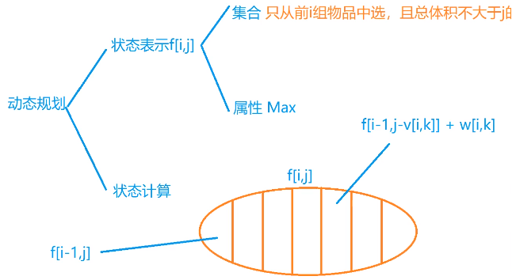

```C++
/*
二维
*/
using namespace std;

const int N=110;
int f[N][N];  //只从前i组物品中选，当前体积小于等于j的最大值
int v[N][N],w[N][N],s[N];   //v为体积，w为价值，s代表第i组物品的个数
int n,m,k;

int main(){
    cin>>n>>m;
    for(int i=1;i<=n;i++){
        cin>>s[i];
        for(int j=0;j<s[i];j++){
            cin>>v[i][j]>>w[i][j];  //读入
        }
    }

    for(int i=1;i<=n;i++){
        for(int j=0;j<=m;j++){
            f[i][j]=f[i-1][j];  //不选
            for(int k=0;k<s[i];k++){ //第i组的第k个物品
                if(j>=v[i][k])     f[i][j]=max(f[i][j],f[i-1][j-v[i][k]]+w[i][k]);  
            }
        }
    }
    cout<<f[n][m]<<endl;
}
```

```C++
/*
一维优化
*/
using namespace std;

const int N=110;
int f[N];
int v[N][N],w[N][N],s[N];
int n,m,k;

int main(){
    cin>>n>>m;
    for(int i=0;i<n;i++){
        cin>>s[i];
        for(int j=0;j<s[i];j++){
            cin>>v[i][j]>>w[i][j];
        }
    }

    for(int i=0;i<n;i++){
        for(int j=m;j>=0;j--){
            for(int k=0;k<s[i];k++){    //for(int k=s[i];k>=1;k--)也可以
                if(j>=v[i][k])     f[j]=max(f[j],f[j-v[i][k]]+w[i][k]);  
            }
        }
    }
    cout<<f[m]<<endl;
}
```


**最值问题**

- 零钱兑换（完全背包）
- 一和零（二维费用背包）
- 最后一块石头的重量 II —— 转换为01背包问题，使得背包剩余容量最小

这道题是要求**恰好取到背包容量**的背包问题。

- 分割等和子集（01 背包 - 要求恰好取到背包容量）


**方案数问题**

这四道题是背包问题求方案数的题目，涉及到 01背包，完全背包的方案数问题。以及考虑顺序和不考虑顺序的情况。

```
组合总和 Ⅳ —— 顺序不同的序列被视作不同的组合
目标和 —— 01背包-求方案数
零钱兑换 II —— 完全背包-求方案数
盈利计划 —— 01背包-求方案数总价值有要求：有下限
```

## (2)状态压缩DP

安卓系统手势解锁
我能赢吗
不同路径 III —— 状态压缩 DP + 记忆化
划分为 k 个相等的子集 —— 状态压缩 DP + 记忆化
访问所有节点的最短路径 —— Floyd + 状态压缩 DP 求最短哈密顿路
最短超级串 —— 状态压缩 DP + DP 过程记录路径
优美的排列
骑士拨号器
参加考试的最大学生数
大礼包
贴纸拼词
按位与为零的三元组

## (3)树形DP

```

```


## (4)区间DP

**回文相关问题**

- 最长回文子串
- 回文子串
- 最长回文子序列
- 段式回文
- 统计不同回文子字符串
- 让字符串成为回文串的最少插入次数 —— 最长回文子序列

**区间动态规划其它问题**

戳气球
移除盒子 —— 戳气球升级版，[i][j] 基础上加了一维 k 状态，k 是 j 右侧与 j 相同的元素个数, 记忆化
多边形三角剖分的最低得分
奇怪的打印机
合并石头的最低成本
预测赢家
编码最短长度的字符串

#### [5. 最长回文子串](https://leetcode.cn/problems/longest-palindromic-substring/)


## (5)计数DP

[62. 不同路径](https://leetcode-cn.com/problems/unique-paths)

[276. 栅栏涂色](https://leetcode-cn.com/problems/paint-fence/)

**计数问题相关练习题**

1. 路径问题
2. 卡特兰数
3. 铺砖问题
4. 斐波那契
5. 隐晦的递推关系

## 矩阵快速幂

[50. Pow(x, n)](https://leetcode-cn.com/problems/powx-n/)

[70. 爬楼梯](https://leetcode-cn.com/problems/climbing-stairs/)

## (6)数位DP

[902. 最大为 N 的数字组合](https://leetcode-cn.com/problems/numbers-at-most-n-given-digit-set/)

以下 9 道题是力扣上数位 DP 相关的题目。

```
满足某些条件的数字个数
    最大为 N 的数字组合
    中心对称数 III
    计算各个位数不同的数字个数
    不含连续 1 的非负整数
    至少有 1 位重复的数字
    易混淆数 II

将 x∈[L,R]x \in [L, R]x∈[L,R] 代到一个函数 f(x) 中, 一个数字 x 的 f(x) 值为一次贡献的量, 求总的贡献
    数字 1 的个数
    范围内的数字计数
    2 出现的次数
```


#### [剑指 Offer 10- II. 青蛙跳台阶问题](https://leetcode-cn.com/problems/qing-wa-tiao-tai-jie-wen-ti-lcof/)🀄️


```java
class Solution {
    public int numWays(int n) {
        int a = 1, b = 1, sum;
        for(int i = 0; i < n; i++){
            sum = (a + b) % 1000000007;
            a = b;
            b = sum;
        }
        return a;	
    }
}
```

#### [剑指 Offer 42. 连续子数组的最大和](https://leetcode-cn.com/problems/lian-xu-zi-shu-zu-de-zui-da-he-lcof/)

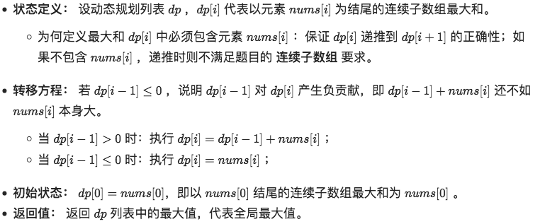

```java
//T:O(n)
class Solution {
    public int maxSubArray(int[] nums) {
        int pre=0,res = nums[0];
        for(int x:nums){
            pre = Math.max(x,pre+x);	//⚠️当前x 或者 x加上之前
            res = Math.max(pre,res);
        }
        return res;
    }
}
```

#### [剑指 Offer 46. 把数字翻译成字符串](https://leetcode-cn.com/problems/ba-shu-zi-fan-yi-cheng-zi-fu-chuan-lcof/) 🀄️


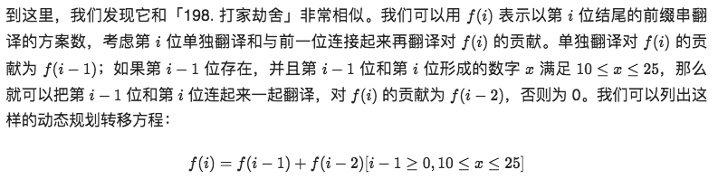

```java
//T：O(n)
//S：用了滚动数组O(1)，但是这里用了一个临时变量把数字转化成了字符串，故渐进空间复杂度也是 O(log⁡n)
class Solution {
    public int translateNum(int num) {
        String str = String.valueOf(num);
        int p=0,q=0,r=1;
        for(int i =0;i<str.length();i++){
            p =q;
            q =r;
            r =0;
            r += q; //f(i-1)贡献
            if(i == 0) continue;
            String pre = str.substring(i-1,i+1);    //取i-1到i的子串
            if(pre.compareTo("25") <= 0 && pre.compareTo("10") >= 0)
                r+=p;   //f(i-2)贡献
        }
        return r;
    }
}
```

#### [剑指 Offer 47. 礼物的最大价值](https://leetcode-cn.com/problems/li-wu-de-zui-da-jie-zhi-lcof/)


```java
//T:O(MN)
//S:O(1) grid作为dp使用
class Solution {
    public int maxValue(int[][] grid) {
        int m=grid.length,n=grid[0].length; //m行，n列
        for(int i=0;i<m;i++){
            for(int j=0;j<n;j++){
                if(i == 0 && j ==0) continue;
                if(i == 0) grid[0][j] += grid[0][j-1];              //从左
                else if(j==0) grid[i][0] += grid[i-1][0];           //从上
                else grid[i][j] += Math.max(grid[i][j-1],grid[i-1][j]);//从上或从左
            }
        }
        return grid[m-1][n-1];
    }
}
```

#### [剑指 Offer 49. 丑数](https://leetcode-cn.com/problems/chou-shu-lcof/)

```java
//设动态规划列表dp ，dp[i]代表第 i+1 个丑数；（下标从0开始的）
//T:O(n)
//S:O(1)
class Solution {
    public int nthUglyNumber(int n) {
        int a=0,b=0,c=0;
        int[] dp = new int[n];
        dp[0] = 1;
        for(int i=1;i<n;i++){
            int n1=dp[a]*2,n2=dp[b]*3,n3=dp[c]*5;
            dp[i] = Math.min(n1,Math.min(n2,n3));
            if(dp[i] == n1) a++;
            if(dp[i] == n2) b++;
            if(dp[i] == n3) c++;
        }
        return dp[n-1];
    }
}
```

#### [264. 丑数 II](https://leetcode.cn/problems/ugly-number-ii/)

#### [313. 超级丑数](https://leetcode.cn/problems/super-ugly-number/)

#### 

#### [剑指 Offer 62. 圆圈中最后剩下的数字](https://leetcode-cn.com/problems/yuan-quan-zhong-zui-hou-sheng-xia-de-shu-zi-lcof/) 约瑟环


```java
//递归 T:O(N) S:O(N)
class Solution {
    public int lastRemaining(int n, int m) {
        return f(n, m);
    }

    public int f(int n, int m) {
        if (n == 1) {		//递归出口
            return 0;
        }
        //从上往下推
        return (m + f(n - 1, m)) % n;		//下一个删除的数   等价关系式
    }
}

//动态 T:O(N) S:O(1)
class Solution {
    public int lastRemaining(int n, int m) {
        int f = 0;		//初始化条件
        for (int i = 2; i != n + 1; ++i) {
            f = (m + f) % i;	//⚠️从下往上推，从2开始
        }
        return f;
    }
}
```

#### [剑指 Offer 63. 股票的最大利润](https://leetcode-cn.com/problems/gu-piao-de-zui-da-li-run-lcof/)

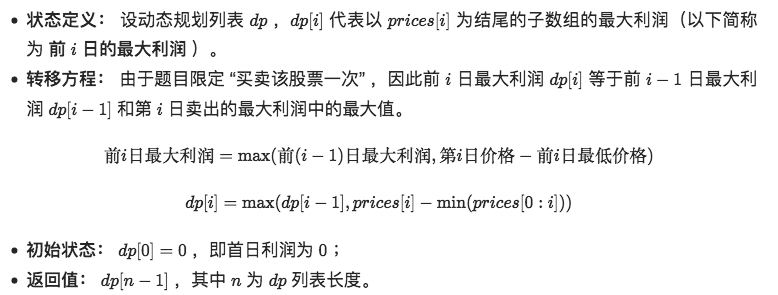

```java
//T:O(n) S:O(1)
class Solution {
    public int maxProfit(int[] prices) {
        int cost = Integer.MAX_VALUE, profit = 0;
        for(int price : prices) {
            cost = Math.min(cost, price);	//min(prices[0:i])
            profit = Math.max(profit, price - cost);
        }
        return profit;
    }
}
```

#### [剑指 Offer 19. 正则表达式匹配](https://leetcode-cn.com/problems/zheng-ze-biao-da-shi-pi-pei-lcof/)  困难

```java
//T,S:O(mn)
class Solution {
    public boolean isMatch(String A, String B) {
        int n = A.length();
        int m = B.length();
        boolean[][] f = new boolean[n + 1][m + 1];

        for (int i = 0; i <= n; i++) {
            for (int j = 0; j <= m; j++) {
                //分成空正则和非空正则两种
                if (j == 0) {
                    f[i][j] = i == 0;
                } else {
                    //非空正则分为两种情况 * 和 非*
                    if (B.charAt(j - 1) != '*') {
                        if (i > 0 && (A.charAt(i - 1) == B.charAt(j - 1) || B.charAt(j - 1) == '.')) {
                            f[i][j] = f[i - 1][j - 1];
                        }
                    } else {
                        //碰到 * 了，分为看和不看两种情况
                        //不看
                        if (j >= 2) {
                            f[i][j] |= f[i][j - 2];
                        }
                        //看
                        if (i >= 1 && j >= 2 && (A.charAt(i - 1) == B.charAt(j - 2) || B.charAt(j - 2) == '.')) {
                            f[i][j] |= f[i - 1][j];
                        }
                    }
                }
            }
        }
        return f[n][m];
    }
}
```

#### [剑指 Offer 60. n个骰子的点数](https://leetcode-cn.com/problems/nge-tou-zi-de-dian-shu-lcof/)

```

```

#### [剑指 Offer 62. 圆圈中最后剩下的数字](https://leetcode-cn.com/problems/yuan-quan-zhong-zui-hou-sheng-xia-de-shu-zi-lcof/)

```

```


#### [剑指 Offer 48. 最长不含重复字符的子字符串](https://leetcode-cn.com/problems/zui-chang-bu-han-zhong-fu-zi-fu-de-zi-zi-fu-chuan-lcof/)


```C++
//动态规划+哈希
//由于返回值是取 dp列表最大值，因此可借助变量 tmp 存储 dp[j]
//T:O(N) S:O(1)

```

