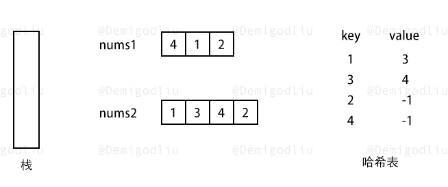
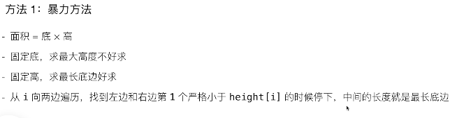

## 7. 数据结构

> 数据结构：
>
> 链表
>
> 栈
>
> 队列
>
> 单调栈
>
> 单调队列
>
> 优先队列/堆
>
> 字符串
>
> 哈希
>
> KMP
>
> 并查集
>
> 字典树
>
> multiSet
>
> 组合数据结构：LRU

<!--more-->

### 单调栈

```C++
常见模型：找出每个数左边离它最近的且比它大/小的数
/*如何确定是使用严格单调栈还是非严格单调栈？只要根据题意确定我们栈中是否可以存放相同元素即可。
参考：https://blog.csdn.net/qq_17550379/article/details/86519771
*/
int tt = 0;
for (int i = 1; i <= n; i ++ )
{
    while (tt && check(stk[tt], i)) tt -- ;	//往左边找 栈顶比当前i比较  top<i,单调递减，top>i单调递增
    stk[ ++ tt] = i;		//将i插入栈中
}
```

------

```C++
/*
830.单调栈
先用暴力破解，再其中挖掘某些特性，每次把没用删除掉，得到单调栈
样例
输入样例：
5
3 4 2 7 5
输出样例：
-1 3 -1 2 2
3左边没有 返回-1	4左边3，返回3
*/
#include<iostream>
using namespace std;
const int N=100010;
int s[N],tt;
int n;
int main(){
   scanf("%d",&n);
   for(int i=0;i<n;i++){
        int x;
        scanf("%d",&x);
        while(tt&&s[tt]>=x)tt--;
        if(tt) printf("%d ",s[tt]);
        else printf("-1 ");
        s[++tt]=x;

    }
    return 0;
}
```

问题1：比当前元素更大的下一个元素 **单调递减栈**

#### [42.接雨水](https://leetcode-cn.com/problems/trapping-rain-water) 🀄️

```C++
class Solution {
public:
    int trap(vector<int>& h) {
        stack<int> stk; //单调递减栈，存储h的下标
        int i=0,res=0;
        while(i<h.size()){  
            while(!stk.empty() && h[i] > h[stk.top()]){ //当前i > 栈顶，才进入
                int top = stk.top(); 
                stk.pop();
                if(stk.empty()) break; //空，栈顶前没有元素了
                int dis = i-stk.top()-1;  // 栈顶前1个 > 栈顶 < 当前i，形成低洼
                int height = min(h[stk.top()],h[i])-h[top];//min(栈顶前1个高度，当前i高度)-栈顶高度
                res += dis*height;
            }
            stk.push(i++);
        }
        return res;
    }
};
```

#### [496.下一个更大元素 I](https://leetcode-cn.com/problems/next-greater-element-i)  🀄️



```C++
//nums1和nums2中所有整数 互不相同
class Solution {
public:
    vector<int> nextGreaterElement(vector<int>& nums1, vector<int>& nums2) {
        stack<int> stk;                 //单调递减栈
        unordered_map<int,int> mymap;
        vector<int> res;
        for(int i=0;i<nums2.size();i++){    //num2处理映射
            while(!stk.empty() && stk.top() < nums2[i]){    //当前i > 栈顶，才进入
                mymap[stk.top()] = nums2[i];    //之前都是递减的，处理映射
                stk.pop();
            }
            stk.push(nums2[i]);   //将i压栈中
        }
        while(!stk.empty()){ //将栈的所有元素弹出
            mymap[stk.top()] = -1;
            stk.pop();
        }
        for(int i=0;i<nums1.size();i++) //加入结果集
            res.push_back(mymap[nums1[i]]);
        return res;
    }
};
```

#### [503.下一个更大元素 II](https://leetcode-cn.com/problems/next-greater-element-ii)

```C++
/*多了个循环查找*/
/*长度变了，stack存储是下标*/
class Solution {
public:
    vector<int> nextGreaterElements(vector<int>& nums) {
        int n = nums.size();
        stack<int> stk; //存储下标
        vector<int> res(n,-1);
        for(int i=0;i<n*2-1;i++){ //遍历大小size+size-1
            while(!stk.empty() && nums[stk.top()] < nums[i%n] ){
                res[stk.top()] = nums[i%n];   //栈顶对应位置，赋值大于栈顶的数
                stk.pop();
            }
            stk.push(i%n);
        }
        return res;
    }
};
```

#### [739.每日温度](https://leetcode-cn.com/problems/daily-temperatures)

```C++
/*
例如，给定一个列表 temperatures = [73, 74, 75, 71, 69, 72, 76, 73]，你的输出应该是 [1, 1, 4, 2, 1, 1, 0, 0]。

栈存储的是下标
当前i的下标 > 栈顶的下标， 距离=当前i的下标 - 出栈的元素的下标
*/
class Solution {
public:
    vector<int> dailyTemperatures(vector<int>& t) {
        stack<int> stk;
        vector<int> res(t.size(),0);	//初始化为0
        for(int i=0;i<t.size();i++){
            while(!stk.empty() && t[i] > t[stk.top()]){
                res[stk.top()] = i-stk.top();	//求距离
                stk.pop();
            }
            stk.push(i);
        }
        return res;
    }
};
```

问题2：比当前元素更大的前一个元素 **单调递减栈**

#### [901.股票价格跨度](https://leetcode-cn.com/problems/online-stock-span)

```C++
class StockSpanner {
public:
    stack<int> stk,weights; //stk存储price，
  //weights它离上一个价格之间（即最近的一个大于它的价格之间）的天数  100 80 60 75 (75：2)
    StockSpanner() {
        
    }
    int next(int price) {
        int w=1;
        while(!stk.empty() && price >= stk.top()){
            stk.pop();
            w += weights.top();
            weights.pop();
        }
        stk.push(price);
        weights.push(w);
        return w;
    }
};
```

问题3：比当前元素更小的下一个元素  **递增单调栈**

#### [84柱状图中最大的矩形](https://leetcode-cn.com/problems/largest-rectangle-in-histogram)   好难🀄️



```C++
/*
超时
*/
class Solution {
public:
    int largestRectangleArea(vector<int>& heights) {
        int n = heights.size();
        int ans = 0;
        // 枚举左边界
        for (int left = 0; left < n; ++left) {
            int minHeight = INT_MAX;
            // 枚举右边界
            for (int right = left; right < n; ++right) {
                // 确定高度
                minHeight = min(minHeight, heights[right]);
                // 计算面积
                ans = max(ans, (right - left + 1) * minHeight);
            }
        }
        return ans;
    }
};
```

```C++
/*
首先我们枚举某一根柱子 i 作为高 h=heights[i]
随后我们需要进行向左右两边扩展，使得扩展到的柱子的高度均不小于 h。 h <=  heights[stk.top()]
*/
class Solution {
public:
    int largestRectangleArea(vector<int>& h) {
        int n = h.size();
        vector<int> l(n), r(n);
        
        stack<int> stk;
        for (int i = 0; i < n; ++i) {
            while (!stk.empty() && h[i] <= h[stk.top()]) {
                stk.pop();
            }
            l[i] = (stk.empty() ? -1 : stk.top());
            stk.push(i);
        }

        stk = stack<int>();
        for (int i = n - 1; i >= 0; --i) {
            while (!stk.empty() && h[i] <= h[stk.top()]) {
                stk.pop();
            }
            r[i] = (stk.empty() ? n : stk.top());
            stk.push(i);
        }
        
        int ans = 0;
        for (int i = 0; i < n; ++i) {
            ans = max(ans, (r[i] - l[i] - 1) * h[i]);
        }
        return ans;
    }
};
```

问题4：比当前元素更小的前一个元素

#### [155. 最小栈](https://leetcode-cn.com/problems/min-stack/)

```

```


### 单调队列

#### [剑指 Offer 59 - I. 滑动窗口的最大值](https://leetcode-cn.com/problems/hua-dong-chuang-kou-de-zui-da-zhi-lcof/)

#### [239. 滑动窗口最大值](https://leetcode-cn.com/problems/sliding-window-maximum/)

```C++
//T:O(n)  S:O(k)
class Solution {
public:
    vector<int> maxSlidingWindow(vector<int>& nums, int k) {
        int n = nums.size();
        deque<int> q;   //队首最大
        for (int i = 0; i < k; ++i) {   //先生成1个k大小的窗口
            while (!q.empty() && nums[i] >= nums[q.back()]) {//严格单调递减
                q.pop_back();
            }
            q.push_back(i);
        }

        vector<int> res = {nums[q.front()]};
        for (int i = k; i < n; ++i) {
            while (!q.empty() && nums[i] >= nums[q.back()]) {
                q.pop_back();
            }
            q.push_back(i);
            while (q.front() <= i - k) {    //维护当前窗口大小为k，将前面的删除掉
                q.pop_front();
            }
            res.push_back(nums[q.front()]);
        }
        return res;
    }
};
```


### 分治法

> 通过把原问题分为子问题，再将子问题进行处理合并，从而实现对原问题的求解。

#### [241. 为运算表达式设计优先级](https://leetcode-cn.com/problems/different-ways-to-add-parentheses/)

#### [932. 漂亮数组](https://leetcode-cn.com/problems/beautiful-array/)

#### [312. 戳气球](https://leetcode-cn.com/problems/burst-balloons/)

### 字符串

#### [剑指 Offer 58 - II. 左旋转字符串](https://leetcode-cn.com/problems/zuo-xuan-zhuan-zi-fu-chuan-lcof/)

```

```

#### [剑指 Offer 67. 把字符串转换成整数](https://leetcode-cn.com/problems/ba-zi-fu-chuan-zhuan-huan-cheng-zheng-shu-lcof/)

```

```

### 栈和队列

#### [剑指 Offer 06. 从尾到头打印链表](https://leetcode-cn.com/problems/cong-wei-dao-tou-da-yin-lian-biao-lcof/)

```

```

#### [剑指 Offer 09. 用两个栈实现队列](https://leetcode-cn.com/problems/yong-liang-ge-zhan-shi-xian-dui-lie-lcof/)

```

```

#### [剑指 Offer 30. 包含min函数的栈](https://leetcode-cn.com/problems/bao-han-minhan-shu-de-zhan-lcof/)

```

```

#### [剑指 Offer 31. 栈的压入、弹出序列](https://leetcode-cn.com/problems/zhan-de-ya-ru-dan-chu-xu-lie-lcof/)

```

```

#### [剑指 Offer 59 - II. 队列的最大值](https://leetcode-cn.com/problems/dui-lie-de-zui-da-zhi-lcof/)

```

```

#### [20. 有效的括号](https://leetcode-cn.com/problems/valid-parentheses/)

```

```

#### [678. 有效的括号字符串](https://leetcode-cn.com/problems/valid-parenthesis-string/)

```

```

#### [71. 简化路径](https://leetcode-cn.com/problems/simplify-path/)

```

```


### 堆&&优先队列

#### [剑指 Offer 41. 数据流中的中位数](https://leetcode-cn.com/problems/shu-ju-liu-zhong-de-zhong-wei-shu-lcof/)

```

```

### 链表

#### [148. 排序链表](https://leetcode-cn.com/problems/sort-list/)

```

```

#### [2. 两数相加](https://leetcode-cn.com/problems/add-two-numbers/)

```

```

#### [445. 两数相加 II](https://leetcode-cn.com/problems/add-two-numbers-ii/)

```

```

#### [160. 相交链表](https://leetcode-cn.com/problems/intersection-of-two-linked-lists/)

```

```


#### [剑指 Offer 18. 删除链表的节点](https://leetcode-cn.com/problems/shan-chu-lian-biao-de-jie-dian-lcof/)

```java
//T:O(N) S:O(1)
//前后指针
class Solution {
    public ListNode deleteNode(ListNode head, int val) {
        if(head.val == val) return head.next;   //删除的是头结点
        ListNode pre = head, cur = head.next;   //2个指针
        while(cur != null && cur.val != val){
            pre = cur;
            cur = cur.next;
        }
        if(cur != null) pre.next = cur.next;    //如果找到了，将当前结点删除
        return head;
    }
}
```

#### [剑指 Offer 22. 链表中倒数第k个节点](https://leetcode-cn.com/problems/lian-biao-zhong-dao-shu-di-kge-jie-dian-lcof/)

```java
//快慢指针
//
class Solution {
    public ListNode getKthFromEnd(ListNode head, int k) {
        ListNode l=head,r=head;
        for(int i=0;i<k;i++){r = r.next;}
        while(r != null){
            r = r.next;
            l = l.next;
        }
        return l;
    }
}
```

#### [剑指 Offer 24. 反转链表](https://leetcode-cn.com/problems/fan-zhuan-lian-biao-lcof/)

```java
//前后指针
//T:O(N) S:O(1) 
class Solution {
public:
    ListNode* reverseList(ListNode* head) {
        ListNode* cur=head;
        ListNode* pre=nullptr;
        while(cur != nullptr){
            ListNode* tmp = cur->next;
            cur->next = pre; //当前指向之前
            pre = cur;      //更新之前
            cur = tmp;      //更新当前结点为下一个结点
        }
        return pre;
    }
};
```

#### [92. 反转链表 II](https://leetcode-cn.com/problems/reverse-linked-list-ii/)

```C++
//双指针+头插法
//T:O(n)  S:O(1)
class Solution {
public:
    ListNode *reverseBetween(ListNode *head, int left, int right) {
        // 设置 dummyNode 是这一类问题的一般做法
        ListNode *dummyNode = new ListNode(-1); //虚假指针，解决头结点的问题
        dummyNode->next = head; //这样头结点就不会改了
        ListNode *pre = dummyNode;
        for (int i = 0; i < left - 1; i++) {    //先移动　left个
            pre = pre->next;
        }
        ListNode *cur = pre->next;
        ListNode *next;
        for (int i = 0; i < right - left; i++) {
            next = cur->next;
            cur->next = next->next;
            next->next = pre->next;
            pre->next = next;
        }
        return dummyNode->next;
    }
};
```


#### [剑指 Offer 25. 合并两个排序的链表](https://leetcode-cn.com/problems/he-bing-liang-ge-pai-xu-de-lian-biao-lcof/)

```java
//归并排序
//T:O(M+N) S:O(1)
class Solution {
    public ListNode mergeTwoLists(ListNode l1, ListNode l2) {
        ListNode head = new ListNode(0), cur = head;//头结点，并临时cur
        while(l1 != null && l2 != null){
            if(l1.val < l2.val){
                cur.next = l1;
                l1 = l1.next;
            }else{
                cur.next = l2;
                l2 = l2.next;
            }
            cur = cur.next;             //更新
        }
        cur.next = l1 != null ? l1:l2;  //哪个不为空直接指向它
        return head.next;       //⚠️头结点没有存数据
    }
}
```

#### [23. 合并K个升序链表](https://leetcode-cn.com/problems/merge-k-sorted-lists/)


```C++
//暴力：for(k){两个两个合并} T:O(k^2n) S:O(1)
//分治法：配对，k/2,k/4,k/8,... T:O(kn×logk) S:O(logk)
```

#### [剑指 Offer 52. 两个链表的第一个公共节点](https://leetcode-cn.com/problems/liang-ge-lian-biao-de-di-yi-ge-gong-gong-jie-dian-lcof/)

```java
//双指针  完美偶遇
// T:O(M+N) S:O(1)
public class Solution {
    public ListNode getIntersectionNode(ListNode headA, ListNode headB) {
        ListNode node1 =headA,node2=headB;
        while(node1 != node2){
            node1 = node1 != null ? node1.next : headB;//循环遍历A，到null时，变为headB
            node2 = node2 != null ? node2.next : headA;
        }
        return node2;//返回node1也可以
    }
}
```

#### [剑指 Offer 35. 复杂链表的复制](https://leetcode-cn.com/problems/fu-za-lian-biao-de-fu-zhi-lcof/)

```java

```


#### [剑指 Offer 20. 表示数值的字符串 ](https://leetcode-cn.com/problems/biao-shi-shu-zhi-de-zi-fu-chuan-lcof/) 中等

```

```

#### [141. 环形链表](https://leetcode-cn.com/problems/linked-list-cycle/)

```

```

#### [142. 环形链表 II](https://leetcode-cn.com/problems/linked-list-cycle-ii/)

```

```

### 字典树

#### [440. 字典序的第K小数字](https://leetcode-cn.com/problems/k-th-smallest-in-lexicographical-order/)

```

```

#### [208. 实现 Trie (前缀树)](https://leetcode-cn.com/problems/implement-trie-prefix-tree/)

```

```

#### [386. 字典序排数](https://leetcode-cn.com/problems/lexicographical-numbers/)

```

```

#### [692. 前K个高频单词](https://leetcode-cn.com/problems/top-k-frequent-words/)

```

```

#### [677. 键值映射](https://leetcode-cn.com/problems/map-sum-pairs/)

```

```

#### [面试题 17.15. 最长单词](https://leetcode-cn.com/problems/longest-word-lcci/)

```

```

#### [792. 匹配子序列的单词数](https://leetcode-cn.com/problems/number-of-matching-subsequences/)

```

```

#### [211. 添加与搜索单词 - 数据结构设计](https://leetcode-cn.com/problems/design-add-and-search-words-data-structure/)

```

```

#### [616. 给字符串添加加粗标签](https://leetcode-cn.com/problems/add-bold-tag-in-string/)

```

```

#### [720. 词典中最长的单词](https://leetcode-cn.com/problems/longest-word-in-dictionary/)

```

```

#### [588. 设计内存文件系统](https://leetcode-cn.com/problems/design-in-memory-file-system/)

```

```

### 哈希

#### [242. 有效的字母异位词](https://leetcode-cn.com/problems/valid-anagram/)

```

```

#### [202. 快乐数](https://leetcode-cn.com/problems/happy-number/)

```

```

#### [383. 赎金信](https://leetcode-cn.com/problems/ransom-note/)

```

```

#### [977. 有序数组的平方](https://leetcode-cn.com/problems/squares-of-a-sorted-array/)

```

```

#### [18. 四数之和](https://leetcode-cn.com/problems/4sum/)

```

```


#### [1. 两数之和](https://leetcode-cn.com/problems/two-sum/)

```C++
//T,S:O(N)
class Solution {
public:
    vector<int> twoSum(vector<int>& nums, int target) {
        unordered_map<int,int> map;
        for(int i=0;i<nums.size();i++){
            auto it = map.find(target-nums[i]);
            if(it != map.end()) return {it->second,i};//找到了，直接返回
            map[nums[i]] = i;//没有找到,插入
        }
        return {};
    }
};
```

#### [剑指 Offer 61. 扑克牌中的顺子](https://leetcode-cn.com/problems/bu-ke-pai-zhong-de-shun-zi-lcof/)

```C++

```

#### [剑指 Offer 03. 数组中重复的数字](https://leetcode-cn.com/problems/shu-zu-zhong-zhong-fu-de-shu-zi-lcof/)

```

```

#### [剑指 Offer 50. 第一个只出现一次的字符](https://leetcode-cn.com/problems/di-yi-ge-zhi-chu-xian-yi-ci-de-zi-fu-lcof/)

```C++
//有序哈希表
//T:O(N) S:O(1)
```

#### [287. 寻找重复数](https://leetcode-cn.com/problems/find-the-duplicate-number/)

```C++
class Solution {
public:
    int findDuplicate(vector<int>& nums) {
        vector<int> res(nums.size(),0);	//初始为0	
        for(auto it:nums){
            res[it]++;
            if(res[it] == 2){
                return it;
            }
        }
        return 0;
    }
};
```

#### [41. 缺失的第一个正数](https://leetcode-cn.com/problems/first-missing-positive/)

```

```


#### [349. 两个数组的交集](https://leetcode-cn.com/problems/intersection-of-two-arrays/)

```C++
class Solution {
public:
    vector<int> intersection(vector<int>& nums1, vector<int>& nums2) {
        vector<int> res;
        unordered_set<int> us{ nums1.begin(), nums1.end() };//去重
        for (auto& it : nums2) {
            if (us.find(it) != us.end()) {
                us.erase(it);
                res.emplace_back(it);
            }
        }
        return res;
    }
};
```

#### [350. 两个数组的交集 II](https://leetcode-cn.com/problems/intersection-of-two-arrays-ii/)


```C++
/*
时间复杂度：O(m+n)
空间复杂度：O(min⁡(m,n))
*/

```


#### [167. 两数之和 II - 输入有序数组](https://leetcode-cn.com/problems/two-sum-ii-input-array-is-sorted/)

```C++
/*二分，数组有序*/
class Solution {
public:
    vector<int> twoSum(vector<int>& numbers, int target) {
        for (int i = 0; i < numbers.size(); ++i) {
            int low = i + 1, high = numbers.size() - 1;	//从1开始
            while (low <= high) {
                int mid = (high - low) / 2 + low;
                if (numbers[mid] == target - numbers[i]) {
                    return {i + 1, mid + 1};	//下标+1 
                } else if (numbers[mid] > target - numbers[i]) {
                    high = mid - 1;
                } else {
                    low = mid + 1;
                }
            }
        }
        return {-1, -1};
    }
};

/*哈希*/
class Solution {
public:
    vector<int> twoSum(vector<int>& nums, int target) {
        unordered_map<int, int> hashtable;
        for (int i = 0; i < nums.size(); ++i) {
            auto it = hashtable.find(target - nums[i]);
            if (it != hashtable.end()) {
                return {it->second, i};
            }
            hashtable[nums[i]] = i;
        }
        return {};
    }
};
```

#### [128. 最长连续序列](https://leetcode-cn.com/problems/longest-consecutive-sequence/)

```

```

#### [594. 最长和谐子序列](https://leetcode-cn.com/problems/longest-harmonious-subsequence/)

```

```

### 扫描线

#### [218. 天际线问题](https://leetcode-cn.com/problems/the-skyline-problem/)

```

```

#### [391. 完美矩形](https://leetcode-cn.com/problems/perfect-rectangle/)

```

```

#### [850. 矩形面积 II](https://leetcode-cn.com/problems/rectangle-area-ii/)

```

```

#### [1851. 包含每个查询的最小区间](https://leetcode-cn.com/problems/minimum-interval-to-include-each-query/)

```

```

### 线段树

#### [315. 计算右侧小于当前元素的个数](https://leetcode-cn.com/problems/count-of-smaller-numbers-after-self/)

```

```

#### [LCP 09. 最小跳跃次数](https://leetcode-cn.com/problems/zui-xiao-tiao-yue-ci-shu/)

```

```

#### [327. 区间和的个数](https://leetcode-cn.com/problems/count-of-range-sum/)

```

```

#### [850. 矩形面积 II](https://leetcode-cn.com/problems/rectangle-area-ii/)

```

```


### 组合数据结构

#### [146. LRU 缓存机制](https://leetcode-cn.com/problems/lru-cache/)


```C++
//map查找O（1）
//双向链表查找，删除O（1）
struct DLinkedNode {
    int key, value;
    DLinkedNode* prev;
    DLinkedNode* next;
    DLinkedNode(): key(0), value(0), prev(nullptr), next(nullptr) {}
    DLinkedNode(int _key, int _value): key(_key), value(_value), prev(nullptr), next(nullptr) {}
};

class LRUCache {
private:
    unordered_map<int, DLinkedNode*> cache;
    DLinkedNode* head;  //LU  最少使用
    DLinkedNode* tail;  //LRU 最近最少使用
    int size;	//1.计数法
    int capacity;

public:
    LRUCache(int _capacity): capacity(_capacity), size(0) {
        // 使用伪头部和伪尾部节点
        head = new DLinkedNode();
        tail = new DLinkedNode();
        head->next = tail;
        tail->prev = head;
    }
    
    int get(int key) {
        if (!cache.count(key)) {    
            return -1;
        }
        // 如果 key 存在，先通过哈希表定位，再移到头部
        DLinkedNode* node = cache[key];
        moveToHead(node);
        return node->value;
    }
    
    void put(int key, int value) {
        if (!cache.count(key)) {
            // 如果 key 不存在，创建一个新的节点
            DLinkedNode* node = new DLinkedNode(key, value);
            // 添加至双向链表的头部
            addToHead(node);
            // 添加进哈希表
            cache[key] = node;
            ++size;
            if (size > capacity) {
                // 如果超出容量，删除双向链表的尾部节点
                DLinkedNode* removed = removeTail();
                // 删除哈希表中对应的项
                cache.erase(removed->key);
                // 防止内存泄漏
                delete removed;
                --size;
            }
        }
        else {
        // 如果 key 存在，先通过哈希表定位，再修改 value，并移到头部
            DLinkedNode* node = cache[key];
            node->value = value;
            moveToHead(node);
        }
    }

    void addToHead(DLinkedNode* node) {
        node->prev = head;
        node->next = head->next;
        head->next->prev = node;
        head->next = node;
    }
    
    void removeNode(DLinkedNode* node) {
        node->prev->next = node->next;
        node->next->prev = node->prev;
    }

    void moveToHead(DLinkedNode* node) {
        removeNode(node);
        addToHead(node);
    }

    DLinkedNode* removeTail() {
        DLinkedNode* node = tail->prev;
        removeNode(node);
        return node;
    }
};
```

#### [432. 全 O(1) 的数据结构](https://leetcode-cn.com/problems/all-oone-data-structure/)

```

```

#### [380. O(1) 时间插入、删除和获取随机元素](https://leetcode-cn.com/problems/insert-delete-getrandom-o1/)

```

```

#### [381. O(1) 时间插入、删除和获取随机元素 - 允许重复](https://leetcode-cn.com/problems/insert-delete-getrandom-o1-duplicates-allowed/)

```

```
