# 8.基础

> 模拟
>
> 位运算
>
> 排序
>
> 前缀和，差分，离散化
>

<!--more-->

### 模拟

#### [400. 第 N 位数字](https://leetcode-cn.com/problems/nth-digit/)

#### [剑指 Offer 44. 数字序列中某一位的数字](https://leetcode-cn.com/problems/shu-zi-xu-lie-zhong-mou-yi-wei-de-shu-zi-lcof/)

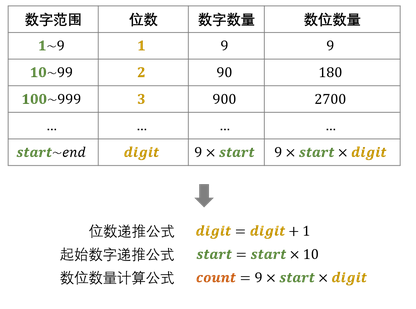

```java
//T:O(logn) S:O(1)
class Solution {
public:
    int findNthDigit(int n) {
        int digit = 1;	//位数digit
        long start = 1;	 //digit位数的最小值 
        long count = 9;		//数位数量count
        while (n > count) { // 1.计算n所在的数位数量count  
            n -= count;
            digit += 1;
            start *= 10;
            count = digit * start * 9;
        }	//（n:11  n=2 count=180 start=10 digit=2 num=10 ）
        long num = start + (n - 1) / digit; // 2.计算n所在的数字num 
        return to_string(num)[(n - 1)%digit]- '0'; // 3.确定 n 是num 中的哪一数位
    }
};
```

#### [剑指 Offer 39. 数组中出现次数超过一半的数字](https://leetcode-cn.com/problems/shu-zu-zhong-chu-xian-ci-shu-chao-guo-yi-ban-de-shu-zi-lcof/)

```C++
//摩尔投票法
//T:O(n) S:O(1)
class Solution {
public:
    int majorityElement(vector<int>& nums) {
        int votes=0,x=0;
        for(auto& num:nums){
            if(votes == 0) x = num;
            votes += num == x?1:-1; //当前num是否等于之前的众数x，是的加1，否则减1
        }
        //验证x是否为众数,本题不需要，因为总是存在众数
        int cnt=0;
        for(auto& num:nums){
            if(x == num) cnt++;
        }
        return cnt > nums.size()/2 ? x : 0;
    }
};
```

#### [54. 螺旋矩阵](https://leetcode-cn.com/problems/spiral-matrix/)

#### [剑指 Offer 29. 顺时针打印矩阵](https://leetcode-cn.com/problems/shun-shi-zhen-da-yin-ju-zhen-lcof/)


```C++
//按层遍历
//T:O(mn) S:O(mn)
class Solution {
public:
    vector<int> spiralOrder(vector<vector<int>>& M) {
        vector<int> res;
        int row=M.size(),col=M[0].size();
        if(row == 0 || col == 0) return res;

        int top=0,bottom=row-1,left=0,right=col-1;
        while(top <= bottom && left <= right){
            for(int i=left;i<=right;i++) res.push_back(M[top][i]); 
            for(int i=top+1;i<=bottom;i++) res.push_back(M[i][right]);
            if(left <right && top <bottom){ //注意
                for(int i=right-1;i>=left;i--) res.push_back(M[bottom][i]);
                for(int i=bottom-1;i>top;i--) res.push_back(M[i][left]);
            }
            left++,right--,top++,bottom--;
        }
        return res;
    }
};
```

#### [59. 螺旋矩阵 II](https://leetcode-cn.com/problems/spiral-matrix-ii/)

```c++
//在1的基础上给矩阵M赋值num
```

#### [剑指 Offer 66. 构建乘积数组](https://leetcode-cn.com/problems/gou-jian-cheng-ji-shu-zu-lcof/)

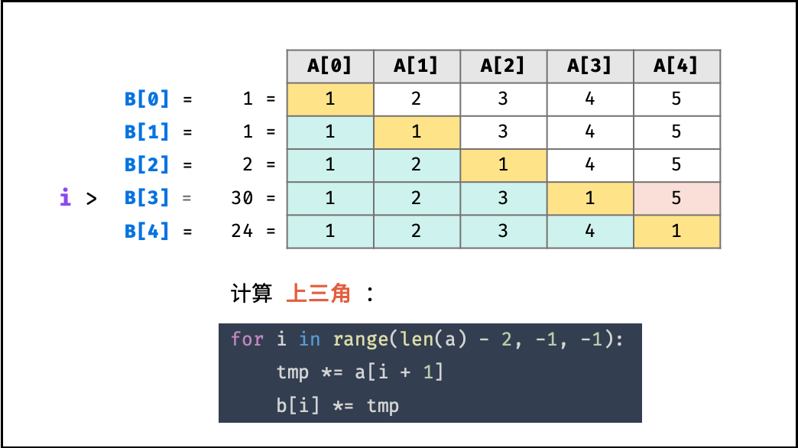

```C++
//表格分区
//T:O(N)	S:O(1)
class Solution {
public:
    vector<int> constructArr(vector<int>& a) {
        int len = a.size();
        if(len == 0) return {};
        vector<int> b(len, 1);
        b[0] = 1;
        int tmp = 1;
        for(int i = 1; i < len; i++) {
            b[i] = b[i - 1] * a[i - 1]; //下三角乘积
        }
        for(int i = len - 2; i >= 0; i--) {
            tmp *= a[i + 1];//上三角乘积
            b[i] *= tmp;    //上x下
        }
        return b;
    }
};

```

#### [剑指 Offer 67. 把字符串转换成整数](https://leetcode-cn.com/problems/ba-zi-fu-chuan-zhuan-huan-cheng-zheng-shu-lcof/)


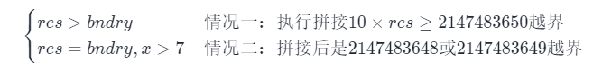

```c++
//思路：处理空格，符号处理，非数字处理，越界处理(2种情况)
class Solution {
public:
    int strToInt(string str) {
        int res = 0, bndry = INT_MAX / 10;
        int i = 0, sign = 1, len = str.size();
        if(len == 0) return 0;
        while(str[i] == ' '){ //1.处理空格
            if(++i == len) return 0;
        }     
        if(str[i] == '-') sign = -1; //2.符号处理
        if(str[i] == '+' || str[i] == '-') i++;  //开始下标
        for(int j = i; j < len; j++) {
            if(str[j] < '0' || str[j] > '9') break;         //3.不是数字直接返回
            if(res > bndry || res == bndry && str[j] > '7') //4.越界处理(2种情况)
                return sign == 1 ? INT_MAX : INT_MIN;
            res = res * 10 + (str[j] - '0');
        }
        return sign * res;
    }
};
```

中文数字转阿拉伯数字

```

```

#### [43. 字符串相乘](https://leetcode-cn.com/problems/multiply-strings/)

```

```

#### [25. K 个一组翻转链表](https://leetcode-cn.com/problems/reverse-nodes-in-k-group/)

```

```

#### [31. 下一个排列](https://leetcode-cn.com/problems/next-permutation/)

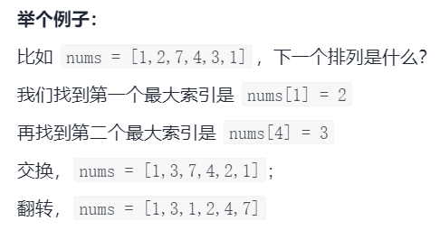

```C++
/*
T:O(n) S:O(1)
我们希望下一个数比当前数大，这样才满足“下一个排列”的定义。因此只需要将前面的「较小数」与后面的「较大数」交换
1.先找出最大的索引 i 满足 nums[i] < nums[i+1]，如果不存在，就翻转整个数组；
2.再找出另一个最大索引 j 满足 nums[j] > nums[i]；
交换 nums[i] 和 nums[j]；
3.最后翻转 nums[i+1:]。
*/


class Solution {
public:
    void nextPermutation(vector<int>& nums) {
        int i = nums.size() - 2;    //倒数第2个
        while (i >= 0 && nums[i] >= nums[i + 1]) {  //从后向前找，大于nums[i],找较小数的下标
            i--;
        }
        if (i >= 0) {   //找到了
            int j = nums.size() - 1;    //最后一个
            while (j >= 0 && nums[i] >= nums[j]) {//从后向前找，大于nums[i]，较大数的下标
                j--;
            }
            swap(nums[i], nums[j]);
        }
        reverse(nums.begin() + i + 1, nums.end());  //翻转后，(i+1,n)升序
    }
};
```

#### [7. 整数反转](https://leetcode-cn.com/problems/reverse-integer/)

```C++
//T:O(log|x|)
class Solution {
public:
    int reverse(int x) {
        int rev = 0;
        while (x) {
            if (rev < INT_MIN / 10 || rev > INT_MAX / 10) {
                return 0;
            }
            int digit = x % 10;
            x /= 10;
            rev = rev * 10 + digit;
        }
        return rev;
    }
};
```

#### [9. 回文数](https://leetcode-cn.com/problems/palindrome-number/)

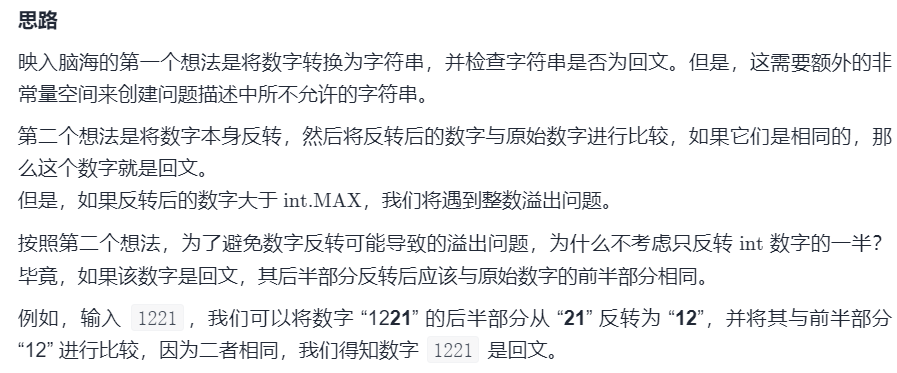

```C++
//反转一半数字
//T：O(logn) S:O(1)
class Solution {
public:
    bool isPalindrome(int x) {
        if (x < 0 || (x % 10 == 0 && x != 0)) { // 例如:-1,10
            return false;
        }

        int rev = 0;
        while (x > rev) {
            rev = rev * 10 + x % 10;
            x /= 10;
        }

        // 当数字长度为奇数时，我们可以通过 rev/10 去除处于中位的数字。
        // 例如，当输入为 12321 时，在 while 循环的末尾我们可以得到 x = rev = 123，
        return x == rev || x == rev / 10;
    }
};
```

#### [剑指 Offer 20. 表示数值的字符串](https://leetcode-cn.com/problems/biao-shi-shu-zhi-de-zi-fu-chuan-lcof/)

```

```

#### [剑指 Offer 43. 1～n 整数中 1 出现的次数](https://leetcode-cn.com/problems/1nzheng-shu-zhong-1chu-xian-de-ci-shu-lcof/)

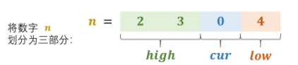

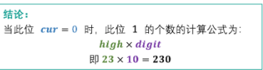

```c++
/*
//T：O(logn) S:O(1)
当 cur = 0 时:此位 1 的出现次数:high×digit
当 cur = 1 时:high×digit+low+1
当 cur > 1 时： (high+1)×digit
*/
class Solution {
public:
    int countDigitOne(int n) {
        long digit = 1, res = 0;//防止溢出
        int high = n / 10, cur = n % 10, low = 0;
        while(high != 0 || cur != 0) {//当 high 和 cur 同时为 0 时，说明已经越过最高位，因此跳出
            if(cur == 0) res += high * digit;
            else if(cur == 1) res += high * digit + low + 1;
            else res += (high + 1) * digit;
            //更新
            low += cur * digit;      //将 cur 加入 low ，组成下轮 low
            cur = high % 10;        
            high /= 10;
            digit *= 10;
        }
        return res;
    }
};
```

#### [365. 水壶问题](https://leetcode-cn.com/problems/water-and-jug-problem/)

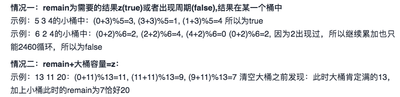

```C++
//T,S:O(xy)
class Solution {
    public boolean canMeasureWater(int x, int y, int z) {
        if(z == 0) return true;
        if(z > (x + y)) return false;
        int min = Math.min(x, y);
        int max = Math.max(x, y);

        boolean[] app = new boolean[max];   //记录是否出现一个周期，是则说明永远达不到目标

        int remain = 0;
        while(!app[remain]){
            app[remain] = true;
            remain = (remain + min) % max;
            if(remain == z || remain + max == z) return true;   //两种情况
        }
        return false;
    }
}
```

#### [134. 加油站](https://leetcode-cn.com/problems/gas-station/)

```

```

#### [剑指 Offer 62. 圆圈中最后剩下的数字](https://leetcode-cn.com/problems/yuan-quan-zhong-zui-hou-sheng-xia-de-shu-zi-lcof/)

**从最后剩下的 3 倒着看，我们可以反向推出这个数字在之前每个轮次的位置。**

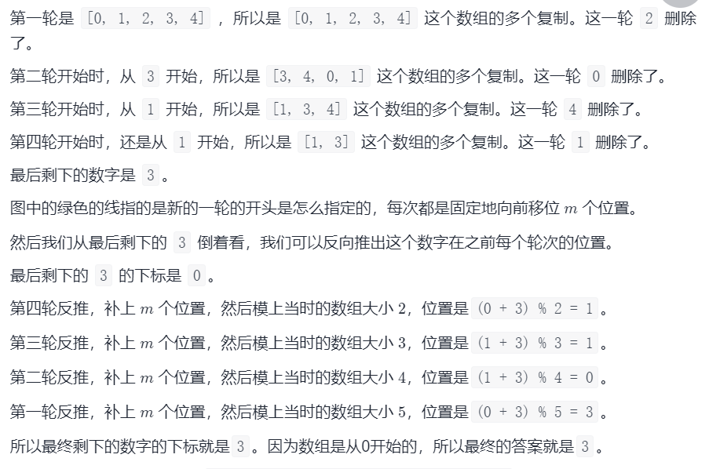

```c++
//约瑟夫环：f(n, m)= [f(n - 1, m)+m]%n
//f(n, m)该函数的返回值为最终留下的元素的下标
class Solution {
public:
    int lastRemaining(int n, int m) {
        int x=0;	//最终留下的元素的下标
        for(int i=2;i<=n;i++) {	//逆序
            x = (x+m)%i;
        }
        return x;
    }
};
```

### 位运算

#### [剑指 Offer 15. 二进制中1的个数](https://leetcode-cn.com/problems/er-jin-zhi-zhong-1de-ge-shu-lcof/)

```java
//时间复杂度 O(M):M二进制1的个数 S：O(1)
public class Solution {
    public int hammingWeight(int n) {
        int res = 0;
        while(n != 0) {
            res++;
            n &= n - 1;
        }
        return res;
    }
}

public class Solution {
    public int hammingWeight(int n) {
        int res = 0;
        while(n != 0) {
            res += n & 1;
            n >>>= 1;
        }
        return res;
    }
}
```

#### [剑指 Offer 16. 数值的整数次方](https://leetcode-cn.com/problems/shu-zhi-de-zheng-shu-ci-fang-lcof/) 快速幂

```java
//T:O(logn) S:O(1)
//二分法
class Solution {
    public double myPow(double x, int n) {
        if(x == 0) return 0;
        long b = n;
        double res = 1.0;	//处理越界
        if(b < 0) {	//处理负数
            x = 1 / x;
            b = -b;
        }
        while(b > 0) {	
            if((b & 1) == 1) res *= x; //n为奇数时
            x *= x;		//x^2
            b >>= 1;	//算术右移
        }
        return res;
    }
}
```

#### [剑指 Offer 56 - I. 数组中数字出现的次数](https://leetcode-cn.com/problems/shu-zu-zhong-shu-zi-chu-xian-de-ci-shu-lcof/)

```java
//分组异或：(2,1,3,2)     其他2次，找2个
//T:O(N) S:O(1)
class Solution {
    public int[] singleNumbers(int[] nums) {
        //全员异或后得到这个只出现一次的数（本题需要找到2个）
        int ret = 0; //结果,0与任何数异或还是自身
        for (int n : nums) {
            ret ^= n;
        }
      //找到第一位不是0的 是1
        int div = 1;
        while ((div & ret) == 0) {
            div <<= 1;
        }
      //分组
        int a = 0, b = 0;
        for (int n : nums) {
            if ((div & n) != 0) {	//判断该位是否为0进行分组 （2，1，2）=>1
                a ^= n;
            } else {	//(3)
                b ^= n;
            }
        }
        return new int[]{a, b};
    }
}
```

#### [剑指 Offer 56 - II. 数组中数字出现的次数 II](https://leetcode-cn.com/problems/shu-zu-zhong-shu-zi-chu-xian-de-ci-shu-ii-lcof/)

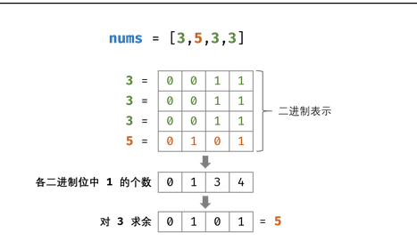

```java
//考虑数字的二进制形式，对于出现三次的数字，各 二进制位 出现的次数都是 333 的倍数。
//因此，统计所有数字的各二进制位中 1 的出现次数，并对3求余，结果则为只出现一次的数字。
//其他3次，找1个   (1,0,1,1)
//有限状态自动机 T:O(n)  S:O(1)  
class Solution {
    public int singleNumber(int[] nums) {
        int ones = 0, twos = 0;	//二进制数的2个状态
        for(int num : nums){
            ones = ones ^ num & ~twos;
            twos = twos ^ num & ~ones;
        }
        return ones;
    }
}

// 异或运算：x ^ 0 = x， x ^ 1 = ~x
// 与运算：x & 0 = 0 ， x & 1 = x

```

#### [剑指 Offer 65. 不用加减乘除做加法](https://leetcode-cn.com/problems/bu-yong-jia-jian-cheng-chu-zuo-jia-fa-lcof/)

```java
//T,S:O(1)
class Solution {
    public int add(int a, int b) {
        while(b != 0) { // 当进位为 0 时跳出
            int c = (a & b) << 1;  // c = 进位
            a ^= b; // a = 非进位和 
            b = c; // b = 进位
         }
        return a;
    }
}
```

#### 高低位交换

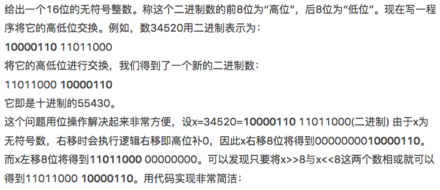

```C++
//高低位交换 by MoreWindows( http://blog.csdn.net/MoreWindows )    
#include <stdio.h>  
template <class T>  
void PrintfBinary(T a)  
{  
   int i;  
   for (i = sizeof(a) * 8 - 1; i >= 0; --i)  
   {  
       if ((a >> i) & 1)  
           putchar('1');  
       else   
           putchar('0');  
       if (i == 8)  
           putchar(' ');  
   }  
   putchar('\n');  
}  
int main()  
{  
   printf("高低位交换 --- by MoreWindows( http://blog.csdn.net/MoreWindows )  ---\n\n");  
 
   printf("交换前:    ");  
   unsigned short a = 3344520;  
   PrintfBinary(a);  
 
   printf("交换后:    ");  
   a = (a >> 8) | (a << 8);  	//核心
   PrintfBinary(a);  
   return 0;  
}  

```


### 排序

#### [剑指 Offer 45. 把数组排成最小的数](https://leetcode-cn.com/problems/ba-shu-zu-pai-cheng-zui-xiao-de-shu-lcof/)

```C++
//快排
//T:O(NlogN) ，最差为 O(N^2) 	S:O(N)
```

#### [剑指 Offer 51. 数组中的逆序对](https://leetcode-cn.com/problems/shu-zu-zhong-de-ni-xu-dui-lcof/)

```
//T:O(nlogn),S:O(n)
//归并排序，加了个计数器
//在第2个数组元素归并上去时，计数，计数后的元素不再计算
```

#### [25. K 个一组翻转链表](https://leetcode-cn.com/problems/reverse-nodes-in-k-group/)

#### [剑指 Offer 40. 最小的k个数](https://leetcode-cn.com/problems/zui-xiao-de-kge-shu-lcof/)

```
//快排  T：O(n) S:O(logn)
```

#### 基数排序

> 一个大小为n的数组，里面的数都属于范围[0, n-1]，有不确定的重复元素，找到至少一个重复元素，要求**O(1)空间**和O(n)时间。

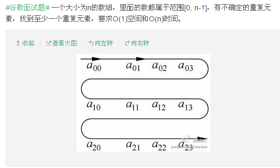

```C++
//GOOGLE面试题  
//一个大小为n的数组，里面的数都属于范围[0, n-1]，有不确定的重复元素，找到至少一个重复元素，要求O(1)空间和O(n)时间。  
#include <stdio.h>    
const int NO_REPEAT_FLAG = -1;  
void Swap(int &x, int &y)  
{  
    int t = x;  
    x = y;  
    y = t;  
}  
//类似于基数排序，找出数组中第一个重复元素。  
int RadixSort(int a[], int n)  
{  
    int i;  
    for (i = 0; i < n; i++)  {  
        while (i != a[i])  {  
            if (a[i] == a[a[i]])  return a[i];  //重复
            Swap(a[i], a[a[i]]);  //不等,交换
        }  
    }  
    return NO_REPEAT_FLAG;  
}  
void PrintfArray(int a[], int n)  
{  
    for (int i = 0; i < n; i++)  
        printf("%d ", a[i]);  
    putchar('\n');  
}  
int main()  
{  
    const int MAXN = 10;  
    int a[MAXN] = {2, 4, 1, 5, 7,  6, 1, 9, 0, 2};  
    //int a[MAXN] = {0, 1, 2, 3, 4, 5, 6, 7, 8, 9};  
  
    printf("数组为: \n");  
    PrintfArray(a, MAXN);  
  
    int nRepeatNumber = RadixSort(a, MAXN);  
    if (nRepeatNumber != NO_REPEAT_FLAG)  
        printf("该数组有重复元素，此元素为%d\n", nRepeatNumber);  
    else  
        printf("该数组没有重复元素\n");  
    return 0;  
}  

```

### 前缀和

#### [560. 和为 K 的子数组](https://leetcode-cn.com/problems/subarray-sum-equals-k/)

```

```

#### [面试题 17.24. 最大子矩阵](https://leetcode-cn.com/problems/max-submatrix-lcci/)

```

```

#### [1838. 最高频元素的频数](https://leetcode-cn.com/problems/frequency-of-the-most-frequent-element/)

```

```

#### [209. 长度最小的子数组](https://leetcode-cn.com/problems/minimum-size-subarray-sum/)

```

```

#### [238. 除自身以外数组的乘积](https://leetcode-cn.com/problems/product-of-array-except-self/)

```

```

#### [1109. 航班预订统计](https://leetcode-cn.com/problems/corporate-flight-bookings/)

```

```

#### [862. 和至少为 K 的最短子数组](https://leetcode-cn.com/problems/shortest-subarray-with-sum-at-least-k/)

```

```

