> 剑指offer，TOP100优先；最后类型题总

# 剑指offer

```java
//读取文本文件的内容
try (Scanner scanner = new Scanner(new File("test.txt"))) {
    while (scanner.hasNext()) {
        System.out.println(scanner.nextLine());
    }
} catch (FileNotFoundException fnfe) {
    fnfe.printStackTrace();
}

Scanner input=newScanner(System.in);
int score=input.nextInt();//读取输入的整数
String name=input.next();//读取输入的字符串

String[] strs = list.toArray(new String[list.size()]);
List<String> list = new ArrayList<>(Arrays.asList(arr)); 

Long.toString(long)
Integer.toString(int)		//int转String
Integer.parseInt(String)
Integer.valueOf(int或者String) //int转换为包装类型Integer,或者将String转换成Integer
   
new String(char[]) 	//char[]转String
str.toCharArray()	//String转char[]
```


## （1）二叉树

#### [剑指 Offer 07. 重建二叉树](https://www.nowcoder.com/practice/8a19cbe657394eeaac2f6ea9b0f6fcf6?tpId=13&tqId=11157&tPage=1&rp=1&ru=/ta/coding-interviews&qru=/ta/coding-interviews/question-ranking&from=cyc_github)

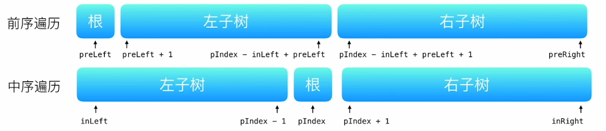

```java
/*T,S:O(n) 中序遍历
思路：先序的第一个就是根结点，取出来；
再查找根结点在中序中的位置（hashmap）；
然后递归前序和中序的左区间，右区间来重建树的左子树和右子树。
*/
public class Solution {
  HashMap<Integer,Integer> map = new HashMap<>();
    TreeNode buildTree(int [] pre,int preL,int preR,int inL,int inR){
        if(preL > preR || inL > inR) return null;
        int rootVal = pre[preL];
        int pIndex = map.get(rootVal);
        TreeNode root = new TreeNode(rootVal);
        root.left = buildTree(pre,preL+1,pIndex-inL+preL,inL,pIndex-1);	//起点preL+1
        root.right = buildTree(pre,pIndex-inL+preL+1,preR,pIndex+1,inR);//
        return root; 
    }
    public TreeNode reConstructBinaryTree(int [] pre,int [] in) {
        int preLen=pre.length,inLen=in.length;
        for(int i=0;i<inLen;i++) map.put(in[i],i); //哈希先存储中序，查询的时候快
        return buildTree(pre,0,preLen-1,0,inLen-1);
    }
};
```

#### [8.二叉树的下一个结点](https://www.nowcoder.com/practice/9023a0c988684a53960365b889ceaf5e?tpId=13&tqId=11210&tPage=1&rp=1&ru=/ta/coding-interviews&qru=/ta/coding-interviews/question-ranking&from=cyc_github)

```java
/*
前驱节点：当前节点左子树的最右节点
后继节点：当前节点右子树的最左节点
（最左节点是中序遍历（左根右）的第一个节点。）
思路：
1）当前节点的右子树不为空，那么该节点的下一个节点是右子树的最左节点
2）否则，向上找第一个左指针指向的树包含该节点的祖先节点。
*/
public class Solution {
    public TreeLinkNode GetNext(TreeLinkNode pNode) {
        if(pNode.right!= null){
            TreeLinkNode right = pNode.right;	//1）右子树
            while(right.left != null)					//最左节点
                right = right.left;
            return right;
        }else{
            while(pNode.next != null){ //2）⚠️找出其父结点
                TreeLinkNode root = pNode.next;//pNode是root的子结点
                if(root.left == pNode)
                    return root;
                pNode  = pNode.next;//继续向上找
            }
        }
        return null;
    }
}
```

#### [剑指 Offer 26. 树的子结构💣](https://www.nowcoder.com/practice/6e196c44c7004d15b1610b9afca8bd88?tpId=13&tqId=11170&tPage=1&rp=1&ru=/ta/coding-interviews&qru=/ta/coding-interviews/question-ranking&from=cyc_github)

```java
//T:O(MN) S:O(M)	M,N 分别为树 A 和 树 B 的节点数量
/*
思路：判断B是不是A的子结构
1）只要有一个为空就不是
2）判断B是否为 A的总结构；递归A的左子树和B；A的右子树和B
3）B为空；A为空或者值不等；递归 A的左子树，B的左子树 && A的右子树，B的右子树
*/
public class Solution {
  public boolean HasSubtree(TreeNode A, TreeNode B) {
       return (A != null && B != null) && (recur(A, B) || HasSubtree(A.left, B) || HasSubtree(A.right, B));	//⚠️树B 是 树 A 左／右子树 的子结构 ||
    }  
   public boolean recur(TreeNode A, TreeNode B) {	//O(N)   以 节点 A 为根节点的子树 包含树 B
        if(B == null) return true;				//1.B为空 能够遍历完
        if(A == null || A.val != B.val) return false;  //2.A为空 或者A！=B
        return recur(A.left, B.left) && recur(A.right, B.right);	//⚠️AB的左右子树相同才是相同  &&
    }  
}
```

#### [剑指 Offer 27. 二叉树的镜像](https://leetcode-cn.com/problems/er-cha-shu-de-jing-xiang-lcof/)

```java
//T,S:O(N)
/*
1）先拿到左右子树
2）再将root的左指针指向右子树，右指针指向左子树
*/
class Solution {
    public TreeNode mirrorTree(TreeNode root) {
        if(root == null) return root;
        TreeNode left = mirrorTree(root.left);
        TreeNode right = mirrorTree(root.right);
        root.left = right;
        root.right = left;
        return root;
    }
}
```

#### [剑指 Offer 28. 对称的二叉树](https://leetcode-cn.com/problems/dui-cheng-de-er-cha-shu-lcof/)


```java
//T,S:O(N)
/*
递归判断左子树是否等于右子树
1）同为空
2）其中一个为空，或者值不同
3）递归左节点的左子树，右节点右子树；
	 递归左节点的右子树，右节点的左子树
*/
public class Solution {
    boolean isSymmetrical(TreeNode root) {
        return root == null ? true : recur(root.left,root.right);
    }
    boolean recur(TreeNode l,TreeNode r){
        if(l == null && r == null) return true;	//先判断都为空
        if(l == null || r == null || r.val != l.val) return false;
        return recur(l.left,r.right) && recur(l.right,r.left);
    }
}
```

#### [剑指 Offer 32 - I. 从上到下打印二叉树](https://www.nowcoder.com/practice/7fe2212963db4790b57431d9ed259701?tpId=13&tqId=11175&tPage=1&rp=1&ru=/ta/coding-interviews&qru=/ta/coding-interviews/question-ranking&from=cyc_github)

```java
//层序遍历
//T：O(N) S:O(N)
/*
思路：
先将根节点放入队列中
while（队列不为空）{
  取出对头，删除对头
  将值放入结果集中
  判断该节点的左节点是否空，不为空，放入队列中；
  判断该节点的右节点是否空，不为空，放入队列中；
}
*/
class Solution {
   public ArrayList<Integer> PrintFromTopToBottom(TreeNode root) {
        if(root == null) return new ArrayList<>();
        ArrayList<Integer> res = new ArrayList<>();
        Queue<TreeNode> queue = new LinkedList<>();
        queue.add(root);
        while(!queue.isEmpty()){
            TreeNode node = queue.poll();
            res.add(node.val);
            if(node.left!=null) queue.add(node.left);
            if(node.right!=null) queue.add(node.right);
        }
        return res;
    }
}
```

#### [剑指 Offer 32 - II. 从上到下打印二叉树 II](https://leetcode-cn.com/problems/cong-shang-dao-xia-da-yin-er-cha-shu-ii-lcof/)

```java
/*
按层放入结果集
*/
public class Solution {
    public ArrayList<ArrayList<Integer>> Print(TreeNode root) {
        if(root == null) return new ArrayList<>();
        ArrayList<ArrayList<Integer>> res = new ArrayList<>();
        Queue<TreeNode> queue = new LinkedList<>();
        queue.add(root);
        while(!queue.isEmpty()){
            ArrayList<Integer> tmp = new ArrayList<>();
            int s = queue.size();
            for(int i =1;i<=s;i++) {
                TreeNode node = queue.poll();
                tmp.add(node.val);
                if(node.left!=null) queue.add(node.left);
                if(node.right!=null) queue.add(node.right);
            }
            res.add(tmp);
        }
        return res;
    }
}
```

#### [剑指 Offer 32 - III. 从上到下打印二叉树 III](https://www.nowcoder.com/practice/91b69814117f4e8097390d107d2efbe0?tpId=13&tqId=11212&tPage=1&rp=1&ru=/ta/coding-interviews&qru=/ta/coding-interviews/question-ranking&from=cyc_github/)

```java
//层序遍历 + 双端队列
/*
奇数层，插入对头（从左到右）
偶数层，放入队尾
*/
public class Solution {
    public ArrayList<ArrayList<Integer> > Print(TreeNode root) {
        if(root == null) return new ArrayList<>();
        ArrayList<ArrayList<Integer>> res = new ArrayList<>();
        Queue<TreeNode> queue = new LinkedList<>();
        queue.add(root);
        while(!queue.isEmpty()){
            ArrayList<Integer> tmp = new ArrayList<>();
            int s = queue.size();
            for(int i = s; i > 0; i--) {
                TreeNode node = queue.poll();
                if(res.size()%2==0) tmp.add(node.val);
                else tmp.add(0,node.val);
                if(node.left!=null) queue.add(node.left);
                if(node.right!=null) queue.add(node.right);
            }
            res.add(tmp);
        }
        return res;
    }
}
```

#### [剑指 Offer 33. 二叉搜索树的后序遍历序列](https://www.nowcoder.com/practice/a861533d45854474ac791d90e447bafd?tpId=13&tqId=11176&tPage=1&rp=1&ru=/ta/coding-interviews&qru=/ta/coding-interviews/question-ranking&from=cyc_github) 💣

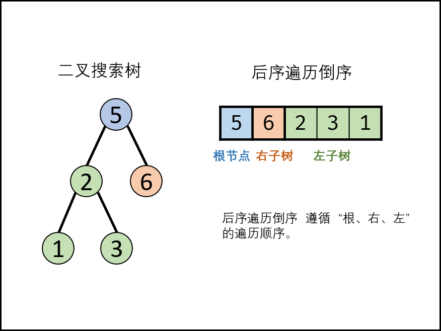

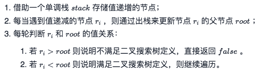

```java
//后序遍历倒序==先序遍历的镜像， 左右根
//T,S:O(n)
/*
单调栈 存储值递增
倒序遍历序列
1）左子树大于root，直接false
2）保证左子树<右子树，更新root
3）将当前数据进栈

pop() == poll
*/
import java.util.*;
public class Solution {
    public boolean VerifySquenceOfBST(int [] postorder) {
        if (postorder == null || postorder.length == 0)
            return false;
        LinkedList<Integer> stack = new LinkedList<>();
        int root = Integer.MAX_VALUE;		//先赋值最大
        for(int i = postorder.length - 1; i >= 0; i--) { //⚠️后序遍历倒序
            if(postorder[i] > root) return false;	//保证左子树<=root
            while(!stack.isEmpty() && stack.peek() > postorder[i]    ) //递增栈
                root = stack.pop();	//更新root
            stack.push(postorder[i]);//单调递增
        }
        return true;
    }
}
```

#### [剑指 Offer 34. 二叉树中和为某一值的路径💣](https://www.nowcoder.com/practice/b736e784e3e34731af99065031301bca?tpId=13&tqId=11177&tPage=1&rp=1&ru=/ta/coding-interviews&qru=/ta/coding-interviews/question-ranking&from=cyc_github)

```java
//减去root.val，递归左右子树
/*T,S:O(N)
思路：

1）根左右遍历；选择当前值，更新目标值
2）路径记录（判断是否符合，符合就加入结果集）
3）递归左右子树
4）撤销选择（回溯）
*/
public class Solution {
    ArrayList<ArrayList<Integer>> res=new ArrayList<>();
    public void dfs(TreeNode root,int sum,ArrayList<Integer> path){
        if(root == null) return;
        path.add(root.val);	//(1)选择
        sum -= root.val;
        if(root.left == null && root.right == null && sum == 0) 
            res.add(new ArrayList<Integer>(path));//深拷贝⚠️不用return
        if(root.left != null) dfs(root.left,path,sum);
        if(root.right != null) dfs(root.right,path,sum);
        path.remove(path.size() - 1);	//(2)回溯
    }
    public ArrayList<ArrayList<Integer>> FindPath(TreeNode root,int sum) {
        dfs(root,sum,new ArrayList<>());
        return res;
    }
}
```

#### [剑指 Offer 36. 二叉搜索树与双向链表](https://leetcode-cn.com/problems/er-cha-sou-suo-shu-yu-shuang-xiang-lian-biao-lcof/)💣

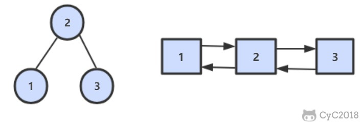

```java
/*
题意：输入一棵二叉搜索树，将该二叉搜索树转换成一个排序的双向链表。要求不能创建任何新的结点，只能调整树中结点指针的指向。
排序的双向链表=>中序遍历：
思路：中序遍历
1）递归左子树
2）cur.left = pre ，也构建 pre.right = cur 
3）更新pre
4）head指向当前节点cur
5）递归右子树
*/
class Solution {
    Node pre, head;
    public Node treeToDoublyList(Node root) {
        if(root == null) return null;
        inOrder(root);
        head.left = pre;
        pre.right = head;
        return head;
    }
    void inOrder(Node cur) {
       if (cur == null) return;
        inOrder(cur.left);
    
        cur.left = pre;
        if (pre != null)
            pre.right = cur;
        pre = cur; 				//更新pre
    
        if (head == null)		//head记录1次
            head = cur;		
    
        inOrder(cur.right);
    }

}
```

#### [剑指 Offer 37. 序列化二叉树](https://www.nowcoder.com/practice/cf7e25aa97c04cc1a68c8f040e71fb84?tpId=13&tqId=11214&tPage=1&rp=1&ru=/ta/coding-interviews&qru=/ta/coding-interviews/question-ranking&from=cyc_github)💣

```java
//
/*序列化：二叉树转换为"{1,2,3,#,#,6,7}"；
思路：先序遍历
反序列化："{1,2,3,#,#,6,7}"转换为二叉树
思路：
1）取出空格的下标
2）取出deserializeStr空格前的字符串（当前节点），没有空格则是最后一个节点
3）更新deserializeStr（空格后的字符串）
4）创建根节点
5）递归创建左右子树
6）返回根节点
*/
private String deserializeStr;

public String Serialize(TreeNode root) {
    if (root == null)
        return "#";
    return root.val + " " + Serialize(root.left) + " " + Serialize(root.right);
}

public TreeNode Deserialize(String str) {
    deserializeStr = str;
    return Deserialize();
}

private TreeNode Deserialize() {
    if (deserializeStr.length() == 0)
        return null;
    int index = deserializeStr.indexOf(" ");
    String node = index == -1 ? deserializeStr : deserializeStr.substring(0, index);//空格前的字符串,不包括index
    deserializeStr = index == -1 ? "" : deserializeStr.substring(index + 1);//空格后的字符串，更新deserializeStr
    if (node.equals("#"))
        return null;
    int val = Integer.parseInt(node); 	//String转int， String转int String.valueOf(num)
    TreeNode t = new TreeNode(val);		//Integer互换int，自动拆/装箱 
    t.left = Deserialize();
    t.right = Deserialize();
    return t;
}
```

#### [剑指 Offer 54. 二叉搜索树的第k大节点](https://www.nowcoder.com/practice/57aa0bab91884a10b5136ca2c087f8ff?tpId=196&tqId=37117&rp=1&ru=/exam/oj&qru=/exam/oj&sourceUrl=%2Fexam%2Foj%3Ftab%3D%25E7%25AE%2597%25E6%25B3%2595%25E7%25AF%2587%26topicId%3D196%26page%3D1%26search%3D%25E7%25AC%25ACk&difficulty=undefined&judgeStatus=undefined&tags=&title=%E7%AC%ACk)

```java
//中序遍历(⚠️这里是右根左，降序取第k大)   
//
public class Solution {
    int res=-1,cnt; 
    public int KthNode (TreeNode root, int k) {
        inOrder(root,k);
        return res;
    }
    void inOrder(TreeNode root, int k){
        if(root == null) return;
        inOrder(root.right,k);
        cnt++;
        if(cnt == k) res=root.val;
        inOrder(root.left,k);
    }
}
```

#### [剑指 Offer 55 - I. 二叉树的深度](https://leetcode-cn.com/problems/er-cha-shu-de-shen-du-lcof/)

```java
//后序
//T：O(N) S:O(N)
public class Solution {
    public int TreeDepth(TreeNode root) {
        if (root == null) return 0;
        return 1+Math.max(TreeDepth(root.left),TreeDepth(root.right));
    }
}
```

#### [剑指 Offer 55 - II. 平衡二叉树](https://leetcode-cn.com/problems/ping-heng-er-cha-shu-lcof/)

```java
//获取左右子树的高度，如果abs(right-left) > 1，则不是平衡树
public class Solution {
    boolean res = true;
    public boolean IsBalanced_Solution(TreeNode root) {
        height(root);
        return res;
    }
    public int height(TreeNode root){
        if(root == null) return 0;
        int left = height(root.left);
        int right = height(root.right);
        if(Math.abs(right-left) > 1) res =false;		//必须在这里判断，每个左右子树都要判断
        return 1+Math.max(left,right);
    }
}
```

#### [剑指 Offer 68 - I. 二叉搜索树的最近公共祖先](https://leetcode-cn.com/problems/er-cha-sou-suo-shu-de-zui-jin-gong-gong-zu-xian-lcof/)

#### [剑指 Offer 68 - II. 二叉树的最近公共祖先](https://leetcode-cn.com/problems/er-cha-shu-de-zui-jin-gong-gong-zu-xian-lcof/)

```java
//T:O(n) S:O(n)
/*
1）root == null，或者q或者p一个等于root，则当前root为最近公共祖先
2）如果 p 和 q 分别在root两个子树l,r中，那么就说明根节点就是最低公共祖先。
3）否则在l或者r
*/
class Solution {
    public TreeNode lowestCommonAncestor(TreeNode root, TreeNode p, TreeNode q) {
        if(root == null || p == root || q== root) return root;
        TreeNode l = lowestCommonAncestor(root.left,p,q);
        TreeNode r = lowestCommonAncestor(root.right,p,q);
        if(l != null && r != null) return root;
        return l!=null?l:r;
    }
}
```

#### [剑指 Offer 20. 表示数值的字符串 ](https://leetcode-cn.com/problems/biao-shi-shu-zhi-de-zi-fu-chuan-lcof/) 中等

```java
/*
[]  ： 字符集合
()  ： 分组
?   ： 重复 0 ~ 1 次
+   ： 重复 1 ~ n 次
*   ： 重复 0 ~ n 次
.   ： 任意字符
\\. ： 转义后的 .
\\d ： 数字

\\d?  0-1个数字
*/
//T:O(N) S:O(1) 
public boolean isNumeric (String str) {
    if (str == null || str.length() == 0)
        return false;
    return new String(str).matches("[+-]?\\d*(\\.\\d+)?([eE][+-]?\\d+)?");
}
```

## （2）回溯&DFS_BFS

//DFS+回溯

#### [剑指 Offer 12. 矩阵中的路径](https://www.nowcoder.com/practice/69fe7a584f0a445da1b6652978de5c38?tpId=13&tqId=11218&tab=answerKey&from=cyc_github)

```java
//判断在一个矩阵中是否存在一条包含某字符串所有字符的路径。
//T:O(M*N*3^K)不包含往上方向 S:O(M*N) K为word的长度
/*
思路：
1）遍历整个矩阵，从0开始递归
2）剪枝（越界，是否访问过，是否相等）
3）标志范访问过
4）遍历4个方向
5）回溯
*/
public class Solution {
    private int rows;
    private int cols;
    private final static int[][] dirs={{0, -1}, {0, 1}, {-1, 0}, {1, 0}};
    private boolean dfs(char[][] matrix,int i,int j,boolean[][] visted, char[] word,int k){
        if(word.length == k) return true;
        if(i >= rows || i <0 || j >= cols || j < 0 || visted[i][j] || matrix[i][j] != word[k]) return false;
 
        visted[i][j] = true;
        for(int[] dir:dirs){
            if(dfs(matrix,dir[0]+i,dir[1]+j,visted,word,k+1)) return true;     
        }
        visted[i][j] = false;
        return false;
    }
    private char[][] buildMatrix(char[] array) {
        char[][] matrix = new char[rows][cols];
        for (int r = 0, idx = 0; r < rows; r++)
            for (int c = 0; c < cols; c++)
                matrix[r][c] = array[idx++];
        return matrix;
    }
    
    public boolean hasPath (String array, int rows, int cols, String str) {
        if(rows == 0 || cols ==0) return false;
        this.rows = rows;
        this.cols = cols;
        char[][] matrix = buildMatrix(array.toCharArray());
        boolean[][] visted = new boolean[rows][cols];
        char[] word = str.toCharArray();
        for(int i=0;i<rows;i++){
            for(int j=0;j<cols;j++){
                if(dfs(matrix,i,j,visted,word,0)) return true;
            }
        }  
        return false;
    }
}
```

#### [剑指 Offer 13. 机器人的运动范围](https://leetcode-cn.com/problems/ji-qi-ren-de-yun-dong-fan-wei-lcof/)

//dfs

```java
//T,S:O(mn)
//例如，当 k 为 18 时，机器人能够进入方格 (35,37)，因为 3+5+3+7=18。但是，它不能进入方格 (35,38)，因为 3+5+3+8=19。请问该机器人能够达到多少个格子？
/*
思路：
1）从0开始递归
2）剪枝（越界，是否访问过，当前和是否大于k）
3）标志访问过
4）递归4个方向，累加4个方向和当前格子
*/
class Solution {
    int[][] dirs ={{0,1},{1,0},{0,-1},{-1,0}};
    int getSum(int x){
        int res = 0;
        while(x!=0){
            res+= x%10;
            x/=10;
        }
        return res;
    }
    int dfs(boolean[][] vis,int i,int j,int m,int n,int k){
        if(getSum(i) + getSum(j) > k || i<0 || i>=m || j<0 || j>=n || vis[i][j]) return 0;
        
        vis[i][j] = true;   //标志访问过
        int res = 1;
        for(int[] dir:dirs){
            int x  = i + dir[0], y = j + dir[1];
            res += dfs(vis,x,y,m,n,k);
        }
        return res;
    }
    public int movingCount(int m, int n, int k) {
        boolean[][] vis = new boolean[m][n];
        return dfs(vis,0,0,m,n,k);
    }
}

```

#### [剑指 Offer 17. 打印从1到最大的n位数](https://leetcode-cn.com/problems/da-yin-cong-1dao-zui-da-de-nwei-shu-lcof/)

//回溯

```java
//递归全排列
//T：O(10^n) S:O(10^n)
/*
思路：
由于 n 可能会非常大，因此不能直接用 int 表示数字，而是用 char 数组进行存储。
1）循环n次
2）当前长度x == len，加入结果集
3）start，最高位不能为0，遍历1-9；其他位遍历0-9
	确定本位数字
	递归下一位数数字
	撤销当前选择
*/
import java.util.*;


public class Solution {
    ArrayList<String> res=new ArrayList<>();
    StringBuffer cur=new StringBuffer();
    char[] num =  {'0', '1', '2', '3', '4', '5', '6', '7', '8', '9'};
    // 生成长度为 len 的数字，正在确定第x位（从左往右）
    void backtrack(int x, int len) {
        if(x == len) {
            res.add(cur.toString());
            return;
        }
        int start = x==0? 1 : 0; // ⚠️X=0表示左边第一位数字，不能为0
        for(int i=start; i<10; i++) {
            cur.append(num[i]); // 确定本位数字
            backtrack(x+1, len); // 确定下一位数字
            cur.deleteCharAt(cur.length()-1); // 删除本位数字
        }
    }
    public int[] printNumbers (int n) {
        for(int i=1; i<=n; i++) // 数字长度：1~n
            backtrack(0, i);
        int[] res_int= new int[res.size()];
        for(int i=0; i<res.size(); i++)
            res_int[i] =  Integer.parseInt(res.get(i));
        return res_int;
        
    }
}
```

#### [剑指 Offer 38. 字符串的排列💣](https://leetcode-cn.com/problems/zi-fu-chuan-de-pai-lie-lcof/)

//回溯

```java
//T:O(N!N) S:O(N^2)
/*
思路：
1）从0开始递归
2）当前x等于字符串长度 加入结果集
循环{
	剪枝：重复继续
	将当前元素放入hashset
	
	选择，交换c[i]，固定x位
	递归x+1
	撤销选择
}

*/
class Solution {
    List<String> res = new ArrayList<>();
    StringBuffer path = new StringBuffer(); 
    boolean[] vis;
    void bacetrace(int x,char[] arr,int len){
        if(x == len){
            res.add(path.toString());
            return;
        }
        for(int i=0;i<len;i++){
            if(vis[i] || (i>0 && arr[i-1] == arr[i] && !vis[i-1])) continue;
            path.append(arr[i]);
            vis[i] = true;
            bacetrace(x+1,arr,len);
            path.deleteCharAt(path.length()-1);
            vis[i] = false;
        }
    }


    public String[] permutation(String s) {
        char[] arr = s.toCharArray();
        vis = new boolean[arr.length];
        Arrays.sort(arr);
        bacetrace(0,arr,arr.length);
        return res.toArray(new String[res.size()]);
    }
}
//String [] 转换成List<String>
List<String> list = Arrays.asList(new String []{"1","2"});
//List<String>转换成 String[]
String [] strs=list.toArray(new String[list.size()]);
```

## （3）贪心

#### [剑指 Offer 14- I. 剪绳子](https://leetcode-cn.com/problems/jian-sheng-zi-lcof/)

```java
/*
题意：将长度为n，剪成m段，将每段绳子的长度相乘，问最大乘积
思路：n =3a+b b=0,1,2。推导=>最优：把绳子尽可能切为多个长度为3的片段，次优2，最差1
复杂度：S,T:O(1)
*/
public class Solution {
    public int cutRope(int n) {
        if(n<=3) return n-1;
        int a=n/3;	//n=3*a+b
        int b=n%3;
        if(b==0) return (int)Math.pow(3,a);    //n=6,a=2 b=0 3^2
        if(b==1) return (int)Math.pow(3,a-1)*4;    //n=7  a=2 b=1 3^1*4
        return (int)Math.pow(3,a)*2;    //n=8 a=2 b=2 3^2*2
    }
}
```

#### [剑指 Offer 14- II. 剪绳子 II](https://leetcode-cn.com/problems/jian-sheng-zi-ii-lcof/) 💣

```java
/*
题意：将长度为n，剪成m段，将每段绳子的长度相乘，结果取模 1e9+7，问最大乘积
思路：n =3a+b  快速幂求余
复杂度：S,T:O(1)
*/
class Solution {
public:
    int cuttingRope(int n) {
        if(n <= 3) return n-1;
        int b = n % 3,p=1000000007; //n =3a+b b=0,1,2
        int a = n/3-1;	//少一个
        //base,a,p，求 base^a mod p。
        long base=3,rem=1;     //防止溢出
        while(a>0){     //n=9 rem=9
            if(a%2 == 1) rem=rem*base%p;	//有余数
            base= base*base%p; //注意
            a /= 2;
        }
				//举例子n=6,7,8
        if(b == 0) return int(rem*3%p);//rem^(a+1)%p   
        if(b == 1) return int(rem*4%p);  //rem^(a)*4%p
        return int(rem*3*2%p);    //rem^(a+1)*2%p          
    }
};
```

## （4）双指针

#### [剑指 Offer 04. 二维数组中的查找](https://www.nowcoder.com/practice/abc3fe2ce8e146608e868a70efebf62e?tpId=13&tqId=11154&tPage=1&rp=1&ru=/ta/coding-interviews&qru=/ta/coding-interviews/question-ranking&from=cyc_github)

```java
//关键思想：从二维数组的右上角开始查找。
//T:O(n+m) S:O(1)
class Solution {
    public boolean findNumberIn2DArray(int[][] M, int target) {
        if(M.length == 0 || M[0].length == 0 || M == null) return false;
        int rows=M.length, cols = M[0].length;
        int r=0,c=cols-1;
        while(r <= rows -1 && c >= 0){
            int num = M[r][c];
            if(num == target) return true;
            else if(num > target) c--;
            else r++;
        }
        return false;
    }
}
```

#### [剑指 Offer 05. 替换空格](https://www.nowcoder.com/practice/0e26e5551f2b489b9f58bc83aa4b6c68?tpId=13&tqId=11155&tab=answerKey&from=cyc_github)

```java
//T:O(n) S:O(n)
/*
数组扩展为原来3倍
遇到空格，替换为%20
没有直接放入
*/
class Solution {
    public String replaceSpace(String s) {  //String是个对象
        int len = s.length();
        char[] arr = new char[3*len]; //1个字符替换为3个字符，长度变为原来3倍
        int size = 0;
        for(int i=0;i<len;i++){
            char ch = s.charAt(i);  
            if(ch == ' '){
                arr[size++] = '%';
                arr[size++] = '2';
                arr[size++] = '0';
            }else{
                arr[size++] = ch;
            }
        }
        String newStr = new String(arr,0,size);
        return newStr;
    }
}
```

#### [剑指 Offer 21. 调整数组顺序使奇数位于偶数前面](https://leetcode-cn.com/problems/diao-zheng-shu-zu-shun-xu-shi-qi-shu-wei-yu-ou-shu-qian-mian-lcof/)

```java
//双指针，搜索  T:O(n) S:O(1)
/*定义头指针 left ，尾指针 right .
left 一直往右移，直到它指向的值为偶数
right 一直往左移， 直到它指向的值为奇数
交换 nums[left] 和 nums[right] .
重复上述操作，直到 left==right
*/
class Solution {
    public int[] exchange(int[] nums) {
        int l=0,r= nums.length-1;
        while(l < r){
            while(l <r && nums[l]%2!=0) l++;    //往右寻找偶数(最左的偶数)
            while(l <r && nums[r]%2==0) r--;    //往左寻找奇数
            int t=nums[l];
            nums[l]=nums[r];
            nums[r]=t;
        }
        return nums;
    }
}
```

#### [剑指 Offer 22. 链表中倒数第k个节点](https://leetcode-cn.com/problems/lian-biao-zhong-dao-shu-di-kge-jie-dian-lcof/)

```java
//快慢指针
//
public ListNode FindKthToTail (ListNode pHead, int k) {
  ListNode l=pHead,r=pHead;
  while(r!=null && k-- > 0) r=r.next;	//顺序不能换
  if(k > 0) return null;//链表长度 < k
  while(r!=null){
    l=l.next;
    r=r.next;
  }
  return l;
}
```

#### [23.链表中环的入口结点](https://www.nowcoder.com/practice/253d2c59ec3e4bc68da16833f79a38e4?tpId=13&tqId=11208&tPage=1&rp=1&ru=/ta/coding-interviews&qru=/ta/coding-interviews/question-ranking&from=cyc_github)

```java
/*
//【快慢指针，同步指针】2次相遇：第1次相遇不清楚位置，第二次相遇为入口结点。重合时 fast 比 slow 多走 环的长度整数倍
//设快慢指针走了f,s步,
//第1次相遇：fast：f=2s(fast 每轮走 2 步) f=s+nb(比slow多走环的长度整数倍) ==> slow:s = nb		a：环外的长度，b：环的长度
//此时：　slow:nb，只要让slow多走a步，就是环的入口。
//而我们只要令fast=head，跟slow同步走，第2次相遇时就是环的入口
//第2次相遇：让slow在a步停下来，让slow和fast在a处相遇，
//slow不变，fast=head，同步移动
*/
public ListNode EntryNodeOfLoop(ListNode pHead) {
        ListNode fast=pHead,slow=pHead;
        while(true){
            if(fast == null || fast.next==null) return null;    //无环⚠️
            slow=slow.next;
            fast=fast.next.next;
            if(slow == fast) break;	//第1次相遇 有环
        }
  		//第2次相遇
        fast = pHead;
        while(slow != fast){
            slow = slow.next;
            fast = fast.next;
        }
        return slow;
    }

```

#### [剑指 Offer 25. 合并两个排序的链表](https://www.nowcoder.com/practice/d8b6b4358f774294a89de2a6ac4d9337?tpId=13&tqId=11169&tPage=1&rp=1&ru=/ta/coding-interviews&qru=/ta/coding-interviews/question-ranking&from=cyc_github)

```java
//归并排序
//T:O(M+N) S:O(1)
class Solution {
    public ListNode mergeTwoLists(ListNode l1, ListNode l2) {
        ListNode dummy = new ListNode(0), cur = dummy;//⚠️头结点，并临时cur
        while(l1 != null && l2 != null){
            if(l1.val < l2.val){
                cur.next = l1;
                l1 = l1.next;
            }else{
                cur.next = l2;
                l2 = l2.next;
            }
            cur = cur.next;             //⚠️更新
        }
        cur.next = l1 != null ? l1:l2;  //哪个不为空直接指向它
        return dummy.next;       //⚠️头结点没有存数据
    }
}
```

#### [剑指 Offer 51. 数组中的逆序对💣💣](https://leetcode-cn.com/problems/shu-zu-zhong-de-ni-xu-dui-lcof/)


```java
//T:O(nlogn),S:O(n)
//归并排序，加了个计数器
//在第2个数组元素归并上去时，计数，计数后的元素不再计算
//（2,3,5,7） | （1,4,6,8） 1比前面的都小，可以快速计算4；下一个是3,4
class Solution {
    int count = 0;//1.计数器
    int[] aux;
    public int reversePairs(int[] nums) {
        aux = new int[nums.length];
        sort(nums, 0, nums.length - 1);
        return count;
    }
    
    public void sort(int[] nums, int lo, int hi){
        if(hi <= lo)    return;
        
        int mid = (lo + hi) / 2;
        sort(nums, lo, mid);
        sort(nums, mid + 1, hi);
        
        merge(nums, lo, mid, hi);
    }

    private void merge(int[] nums, int lo, int mid, int hi) {
        int i = lo, j = mid + 1;
        for(int k = lo; k <= hi; k++)	//[lo,hi]
            aux[k] = nums[k];
        
        int index = lo;
        while(i <= mid || j <= hi){ 
            //哪个小放哪个
            if(i > mid)                 nums[index++] = aux[j++];	//将剩余2情况也考虑进去
            else if(j > hi)             nums[index++] = aux[i++];
            else if(aux[i] <= aux[j])   nums[index++] = aux[i++];
            else {
                nums[index++] = aux[j++];  
                count += mid - i + 1; //2.累计逆序对
                }
        }
    }
}

```

#### [剑指 Offer 57. 和为s的两个数字](https://www.nowcoder.com/practice/390da4f7a00f44bea7c2f3d19491311b?tpId=13&tqId=11195&tPage=1&rp=1&ru=/ta/coding-interviews&qru=/ta/coding-interviews/question-ranking&from=cyc_github)

```java
//双指针：搜索
//T:O(n) S:O(1)
/*
思路：sum = l +r;
sum>target，r--;
else l++;
*/
class Solution {
     //数组是递增排序好的
    public ArrayList<Integer> FindNumbersWithSum(int [] nums,int sum) {
        int l=0,r=nums.length-1;
        while(l<r){	//[l,r]2个数字，不能相等
            int t = nums[l]+nums[r];
            if(t == sum) return new ArrayList<>(Arrays.asList(nums[l],nums[r]));
            else if(t > sum) r--;
            else l++;
        }
        return new ArrayList<>();
    }
}
```

#### [剑指 Offer 57 - II. 和为s的连续正数序列](https://www.nowcoder.com/practice/c451a3fd84b64cb19485dad758a55ebe?tpId=13&tqId=11194&tPage=1&rp=1&ru=/ta/coding-interviews&qru=/ta/coding-interviews/question-ranking&from=cyc_github)

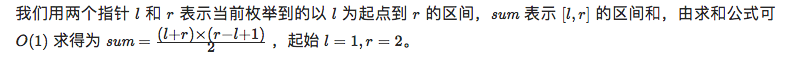

```java
//双指针：滑动窗口
//T:O(target)	S:O(1)
/*
思路：sum = (l+r)*(r-l+1)/2
sum == target，[l,r]
sum > target,l++
sum < target,r++
返回多个区间
*/
import java.util.ArrayList;
public class Solution {
    public ArrayList<ArrayList<Integer> > FindContinuousSequence(int target) {
       ArrayList<ArrayList<Integer> > res = new ArrayList<ArrayList<Integer> >();
       int l=1,r=2;	//⚠️
        while(l<r){//⚠️
            int sum = (l+r)*(r-l+1)/2;  //区间[l,r]的和
            if(sum == target){
                ArrayList<Integer> tmp = new ArrayList<Integer>();
                for(int i=l;i<=r;i++)   tmp.add(i);   //i-l从0开始放
                res.add(tmp);
                l++;                       //开启新的区间
            }else if(sum > target) l++;    //⚠️大了，l右移，减数
            else r++;                      //小了，r右移，加数
        }
        return res;  
    }
}
```

### （5）二分

#### [剑指 Offer 11. 旋转数组的最小数字](https://leetcode-cn.com/problems/xuan-zhuan-shu-zu-de-zui-xiao-shu-zi-lcof/)💣 同154.寻找旋转排序数组中的最小值 II

```java
//二分法：
//与1的区别，数组中可能存在重复的元素。
//T:O(n) S:O(1)
/*
思路：与右端元素比较
大于右端,则r =mid，最小值在左边
小于右端，则l = mid+1，最小值在右边
等于右端r--;
*/
class Solution {
    public int minArray(int[] nums) {
        int l=0,r = nums.length-1;
        while(l<r){
            int mid = l +(r-l)/2;
            if(nums[mid] < nums[r]) r = mid;        //最小值在左边[l,mid)
            else if(nums[mid] > nums[r]) l=mid+1;   //最小值在右边[mid+1,r)
            else r--;                               //⚠️加这里，去除r边界,最小值在[l,r)
        }
        return nums[l];
    }
}
```

#### [剑指 Offer 16. 数值的整数次方](https://www.nowcoder.com/practice/1a834e5e3e1a4b7ba251417554e07c00?tpId=13&tqId=11165&tPage=1&rp=1&ru=/ta/coding-interviews&qru=/ta/coding-interviews/question-ranking&from=cyc_github) 快速幂

```java
//T:O(logn) S:O(1)
//base^a
public class Solution {
    public double Power(double base, int a) {
        if(base == 0) return 0;	//处理0
        if(a < 0){	//注意：处理负数
            base = 1/base;
            a = -a;
        }
        
        double res=1.0;
        while(a!=0){
            if(a%2 == 1) res=res*base;
            base*=base;
            a/=2;
        }
        return res;
  }
}
```


#### [剑指 Offer 53 - I. 在排序数组中查找数字 I](https://leetcode-cn.com/problems/zai-pai-xu-shu-zu-zhong-cha-zhao-shu-zi-lcof/)⭐️

```java
//二分
//时间复杂度 O(logN) ： 二分法为对数级别复杂度。
//空间复杂度 O(1) ： 几个变量使用常数大小的额外空间。
/*
思路：
与target比，
l < = r;
hleper(nums,target)-hleper(nums,target-1);
寻找多个nums[mid] <= target
*/
class Solution {
    public int search(int[] nums, int target) {
        return hleper(nums,target)-hleper(nums,target-1);
    }
    int hleper(int[] nums,int target){  //target的右边界（边界不包括target）
        int l=0,r=nums.length-1;
        while(l<=r){ //⚠️
            int mid = l + (r-l)/2;
            if(nums[mid] <= target) l=mid+1;    //在[mid+1,r]	⚠️
            else r = mid - 1;                   //在[l,mid-1]
        }
        return l;
    }
}
```

#### [剑指 Offer 53 - II. 0～n-1中缺失的数字💣⭐️](https://leetcode-cn.com/problems/que-shi-de-shu-zi-lcof/)

```java
//T:O(logN) S:O(1)
//与中间下标比较
//相等，缺失值表明在右边；不等，表明在左边
class Solution {
    public int missingNumber(int[] nums) {
        int l=0,r=nums.length-1;
        while(l<=r){		//⚠️
            int mid = l + (r-l)/2;
            if(nums[mid] == mid)    l=mid+1;//⚠️相等，在[mid+1,r]
            else r = mid - 1;   //不等，在[l,mid-1]
        }
        return l;
    }
}
```

#### [287. 寻找重复数](https://leetcode.cn/problems/find-the-duplicate-number/)

```java
/*
题意：[1,3,4,2,2]返回2；只有一个整数 出现 两次或多次 ，其余整数均只出现 一次
思路：定义cnt统计数组中<=当前i的个数
利用了「鸽巢原理」：n+1个元素放到n个集合中，其中必定有一个集合里至少有两个元素。
遍历数组，统计<=4的个数，如果个数>4 ，说明重复的元素一定出现在整数区间 [1..4]
*/
class Solution {
    public int findDuplicate(int[] nums) {
        int l = 0,r=nums.length-1;
        while(l<=r){
            int mid = l + ((r-l)>>1);
            int cnt = 0;
            for(int num:nums){
                if(num <= mid) cnt++;
            }
            if(cnt > mid) r = mid-1;  //个数>mid 答案在[l,mid]    「鸽巢原理」
            else l = mid + 1; 
        }
        return l;
    }
}
```


## （6）DP

#### [剑指 Offer 10- I. 斐波那契数列](https://leetcode-cn.com/problems/fei-bo-na-qi-shu-lie-lcof/)

```java
//T:O(n) S:O(1)
class Solution {
    public int fib(int n) {
        int a = 0, b = 1, sum;	//sum:f(n+1)   a:f(n-1) b:f(n)
        for(int i = 0; i < n; i++){
            sum = (a + b) % 1000000007;
            a = b;
            b = sum;
        }
        return a;	//此时，b赋值给了a
    }
}
```

#### [矩阵覆盖](https://www.nowcoder.com/practice/72a5a919508a4251859fb2cfb987a0e6?tpId=13&tqId=11163&tPage=1&rp=1&ru=/ta/coding-interviews&qru=/ta/coding-interviews/question-ranking&from=cyc_github)

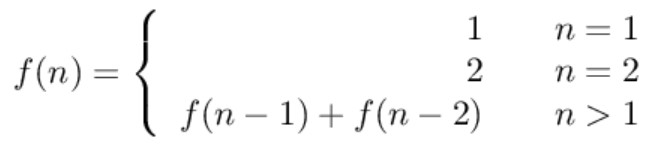

```java
//我们可以用 2*1 的小矩形横着或者竖着去覆盖更大的矩形。请问用 n 个 2*1 的小矩形无重叠地覆盖一个 2*n 的大矩形，总共有多少种方法？
public int rectCover(int n) {
    if (n <= 2)
        return n;
    int a = 1, b = 2;
    int res = 0;
    for (int i = 3; i <= n; i++) {
        result = a + b;
        a = b;
        b = res;
    }
    return res;
}
```


#### [剑指 Offer 10- II. 青蛙跳台阶问题](https://leetcode-cn.com/problems/qing-wa-tiao-tai-jie-wen-ti-lcof/)🀄️

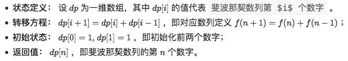

```java
class Solution {
    public int numWays(int n) {
        int a = 1, b = 1, sum;
        for(int i = 0; i < n; i++){
            sum = (a + b) % 1000000007;
            a = b;
            b = sum;
        }
        return a;	
    }
}
```

#### [进阶跳台阶](https://www.nowcoder.com/practice/22243d016f6b47f2a6928b4313c85387?tpId=13&tqId=11162&tPage=1&rp=1&ru=/ta/coding-interviews&qru=/ta/coding-interviews/question-ranking&from=cyc_github)

```java
//1.动态
public class Solution {
    public int jumpFloorII(int target) {
        int[] dp = new int[target];
        Arrays.fill(dp, 1);
        for (int i = 1; i < target; i++)
            for (int j = 0; j < i; j++)
                dp[i] += dp[j];
        return dp[target - 1];
    }
}
//2.数学
f(n-1) = f(n-2) + f(n-3) + ... + f(0)
f(n) = f(n-1) + f(n-2) + ... + f(0)
f(n) = 2*f(n-1)
public int JumpFloorII(int target) {
    return (int) Math.pow(2, target - 1);
}
```

#### [剑指 Offer 19. 正则表达式匹配](https://leetcode-cn.com/problems/zheng-ze-biao-da-shi-pi-pei-lcof/)  💣

```java
//T,S:O(mn)
class Solution {
    public boolean isMatch(String A, String B) {
        int n = A.length();
        int m = B.length();
        boolean[][] f = new boolean[n + 1][m + 1];

        for (int i = 0; i <= n; i++) {
            for (int j = 0; j <= m; j++) {
                //分成空正则和非空正则两种
                if (j == 0) {
                    f[i][j] = i == 0;
                } else {
                    //非空正则分为两种情况 * 和 非*
                    if (B.charAt(j - 1) != '*') {
                        if (i > 0 && (A.charAt(i - 1) == B.charAt(j - 1) || B.charAt(j - 1) == '.')) {
                            f[i][j] = f[i - 1][j - 1];
                        }
                    } else {
                        //碰到 * 了，分为看和不看两种情况
                        //不看
                        if (j >= 2) {
                            f[i][j] |= f[i][j - 2];
                        }
                        //看
                        if (i >= 1 && j >= 2 && (A.charAt(i - 1) == B.charAt(j - 2) || B.charAt(j - 2) == '.')) {
                            f[i][j] |= f[i - 1][j];
                        }
                    }
                }
            }
        }
        return f[n][m];
    }
}
```

#### [剑指 Offer 42. 连续子数组的最大和](https://www.nowcoder.com/practice/459bd355da1549fa8a49e350bf3df484?tpId=13&tqId=11183&tPage=1&rp=1&ru=/ta/coding-interviews&qru=/ta/coding-interviews/question-ranking&from=cyc_github)


```java
//T:O(n)
/*
思路：
pre = max（当前数，上一个数+当前数）
res = max（上一次结果，pre）
*/
class Solution {
    public int maxSubArray(int[] nums) {
        int pre=0,res = nums[0];	//⚠️初始化
        for(int x:nums){
            pre = Math.max(x,pre+x);	//⚠️当前x 或者 x加上之前
            res = Math.max(pre,res);
        }
        return res;
    }
}
```

#### [剑指 Offer 46. 把数字翻译成字符串](https://leetcode-cn.com/problems/ba-shu-zi-fan-yi-cheng-zi-fu-chuan-lcof/) 💣💣

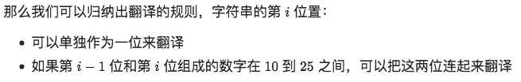


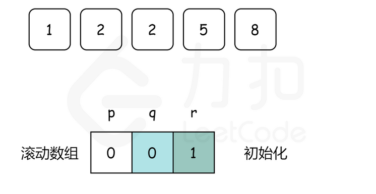

```java
//T：O(n)
//S：用了滚动数组O(1)，但是这里用了一个临时变量把数字转化成了字符串，故渐进空间复杂度也是 O(log⁡n)
/*
题意： 0翻译成 “a” ，1 翻译成 “b”，……，11 翻译成 “l”，……，25 翻译成 “z”，有多少种不同的翻译方法。
思路：
滚动数组：
1）单独一个数字q:f(n-1)
2）2个数字p:f(n-2)  r:f(n) 
*/
class Solution {
    public int translateNum(int num) {
        String str = Integer.toString(num);
        int p=0,q=0,r=1; //p:f(n-2) q:f(n-1) r:f(n) ⚠️
        for(int i =0;i<str.length();i++){
            p =q;
            q =r;
            r =0;	//复原⚠️
            r += q; //f(i-1)贡献		//1个数字
            if(i == 0) continue;	//i=0只有1个数字
            
            String pre = str.substring(i-1,i+1);    //取i-1到i的子串
            if(pre.compareTo("25") <= 0 && pre.compareTo("10") >= 0)	//2个数字
                r+=p;   //f(i-2)贡献
        }
        return r;
    }
}
```

#### [剑指 Offer 47. 礼物的最大价值](https://leetcode-cn.com/problems/li-wu-de-zui-da-jie-zhi-lcof/)

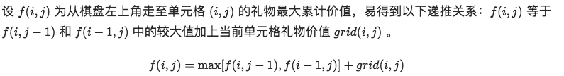

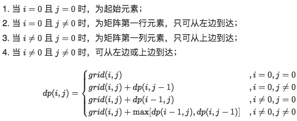

```java
//T:O(MN)
//S:O(1) grid作为dp使用
/*
思路：
1）i，j都为0，直接跳过
2）从边界从左到右，从上到下，直接加；
3）中间元素，max（左边，上边）
*/
class Solution {
    public int maxValue(int[][] grid) {
        int m=grid.length,n=grid[0].length; //m行，n列
        for(int i=0;i<m;i++){
            for(int j=0;j<n;j++){
                if(i == 0 && j ==0) continue;
                if(i == 0) grid[0][j] += grid[0][j-1];              //从左
                else if(j==0) grid[i][0] += grid[i-1][0];           //从上
                else grid[i][j] += Math.max(grid[i][j-1],grid[i-1][j]);//从上或从左
            }
        }
        return grid[m-1][n-1];
    }
}
```

#### [剑指 Offer 48. 最长不含重复字符的子字符串](https://leetcode-cn.com/problems/zui-chang-bu-han-zhong-fu-zi-fu-de-zi-zi-fu-chuan-lcof/)

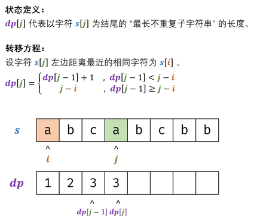

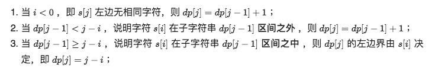

```java
class Solution {
    public int lengthOfLongestSubstring(String s) {
        Map<Character,Integer> dic = new HashMap<>();   //哈希表
        //dp[i]表示以字符s[j]结尾的最长不重复子串
        int res=0,tmp=0;
        for(int j=0;j<s.length();j++){
            int i = dic.getOrDefault(s.charAt(j),-1);   //获取i的索引,-1位默认值
            dic.put(s.charAt(j),j); //更新哈希表
            tmp = tmp < j-i ? tmp+1:j-i;//dp[j-1] < j-i，则最长长度为tmp+1，否则有重复的，j-i
            res = Math.max(res,tmp);    //max(dp[j-1],dp[j])
        }
        return res;
    }
}
```

#### [剑指 Offer 49. 丑数](https://leetcode-cn.com/problems/chou-shu-lcof/)

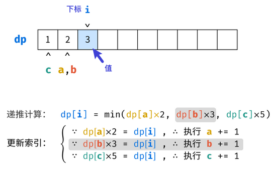

```java
//把只包含因子 2、3 和 5 的数称作丑数（Ugly Number）。例如 6、8 都是丑数，但 14 不是，因为它包含因子 7。习惯上我们把 1 当做是第一个丑数。求按从小到大的顺序的第 N 个丑数。
//设动态规划列表dp ，dp[i]代表第 i+1 个丑数；（下标从0开始的）
//T:O(n) S:O(1)
/*
思路：
1）设置指针 a,b,c指向首个丑数（即 1 ）
2）当前dp[i] 赋值(n1,n2,n3)
3）判断当前dp[i]属于哪个，对应a，b，c加1
*/
public class Solution {
    public int GetUglyNumber_Solution(int n) {
        if(n == 0) return 0;
        int a=0,b=0,c=0;
        int[] dp = new int[n];
        dp[0] = 1;	//首个丑数
        for(int i=1;i<n;i++){
            int n1=dp[a]*2,n2=dp[b]*3,n3=dp[c]*5;
            dp[i] = Math.min(n1,Math.min(n2,n3));	//最小因子
            if(dp[i] == n1) a++;
            if(dp[i] == n2) b++;
            if(dp[i] == n3) c++;
        }
        return dp[n-1];
    }
}
```

#### [剑指 Offer 60. n个骰子的点数](https://leetcode-cn.com/problems/nge-tou-zi-de-dian-shu-lcof/)💣

```java
/*

*/
```

#### [剑指 Offer 63. 股票的最大利润](https://leetcode-cn.com/problems/gu-piao-de-zui-da-li-run-lcof/)


```java
//T:O(n) S:O(1)
/*
思路：
1）所有花费= min(当前价格,历史花费)  低价买入
2）max（当前利润，当前价格-所有花费） 高价卖出
*/
class Solution {
    public int maxProfit(int[] prices) {
        int cost = Integer.MAX_VALUE, profit = 0;//⚠️初始化
        for(int price : prices) {
            cost = Math.min(cost, price);	//min(prices[0:i])
            profit = Math.max(profit, price - cost);
        }
        return profit;
}
```

## （7）数据结构

### 7.1 模拟

#### [剑指 Offer 03. 数组中重复的数字](https://www.nowcoder.com/practice/6fe361ede7e54db1b84adc81d09d8524?tpId=13&tqId=11203&tab=answerKey&from=cyc_github)

```java
//原地交换
//T:O(n) S:O(1)
/*
思路：
1）从0开始遍历到n-1
2）while 发现当前数字不等于当前下标
	再判断当前数字 是否与 以当前数字为下标的数字是否一样，是的话就是重复的数，直接返回；不是就替换。
*/
class Solution {
    public int findRepeatNumber(int[] nums) {
        for (int i = 0; i < nums.length; i++) {
            while (nums[i] != i) {
                if (nums[i] == nums[nums[i]]) {
                    return  nums[i];
                }
                swap(nums, i, nums[i]);
            }
        }
        return -1;
    }
    private void swap(int[] nums, int i, int j) {
        int t = nums[i];
        nums[i] = nums[j];
        nums[j] = t;
    }
}
```

#### [442. 数组中重复的数据](https://leetcode.cn/problems/find-all-duplicates-in-an-array/)

```java
//多个
class Solution {
    public List<Integer> findDuplicates(int[] nums) {
        int n = nums.length;
        for (int i = 0; i < n; ++i) {
            while (nums[i] != nums[nums[i] - 1]) {
                swap(nums, i, nums[i] - 1);
            }
        }
        List<Integer> ans = new ArrayList<Integer>();
        for (int i = 0; i < n; ++i) {
            if (nums[i] - 1 != i) {
                ans.add(nums[i]);
            }
        }
        return ans;
    }

    public void swap(int[] nums, int index1, int index2) {
        int temp = nums[index1];
        nums[index1] = nums[index2];
        nums[index2] = temp;
    }
}
```

#### [剑指 Offer 29. 顺时针打印矩阵](https://www.nowcoder.com/practice/9b4c81a02cd34f76be2659fa0d54342a?tpId=13&tqId=11172&tPage=1&rp=1&ru=/ta/coding-interviews&qru=/ta/coding-interviews/question-ranking&from=cyc_github)

```java
//模拟、
//先设定边界，再遍历边界并判断边界是否超出
//T:O(mn) S:O(mn)
/*
思路：
1）设定边界l=0,r=arr[0].length-1,t=0,b=arr.length-1;
2）遍历边界
*/
class Solution {
    public int[] spiralOrder(int[][] arr) {
      	ArrayList<Integer> res = new ArrayList<>();
        int l=0,r=arr[0].length-1,t=0,b=arr.length-1;
        while(true){
            for(int i=l;i<=r;i++)    res.add(arr[t][i]);   //从左到右
            if(++t > b) break;
            for(int i=t;i<=b;i++)    res.add(arr[i][r]);   //从上到下
            if(--r < l) break;
            for(int i=r;i>=l;i--)    res.add(arr[b][i]);   //从右到左
            if(--b < t) break;
            for(int i=b;i>=t;i--)    res.add(arr[i][l]);   //从下到上
            if(++l > r) break;
        }
        return res;
    }
}
```

#### 改进版：先顺时针再逆时针打印

```java

```


#### [剑指 Offer 45. 把数组排成最小的数](https://leetcode-cn.com/problems/ba-shu-zu-pai-cheng-zui-xiao-de-shu-lcof/)

```java
class node
{
	int x;
	int y;
}
class cmp implements Comparator<node>
{
	public int compare(node a, node b)
	{
		if(a.x - b.x != 0) return a.x - b.x;
		else return a.y - b.y;
	}
}
Arrays.sort(s,0,n,new cmp());  对s数组排序
```


```java
//快排
//T:O(NlogN) ，最差为 O(N^2) 	S:O(N)
/** 
自定义排序
a+b 或者 b+a
*/
class Solution {
    public String minNumber(int[] nums) {
        String[] strs = new String[nums.length];							//存储成字符串数组
        for(int i = 0; i < nums.length; i++)
            strs[i] = String.valueOf(nums[i]);
      
        Arrays.sort(strs, new Comparator<String>(){
            public int compare(String x, String y) {
                return (x + y).compareTo(y + x);	//升序
            }
        });
        //Arrays.sort(strs, (x, y) -> (x + y).compareTo(y + x)); //x+y >y+x，则x>y,x放后面
      //Arrays.sort(Integernum, (a, b)->b - a); 降序
       //quickSort(strs, 0, strs.length - 1);            //排序
      
        StringBuilder res = new StringBuilder();							//结果集
        for(String s : strs)
            res.append(s);
        return res.toString();
    }
  
  
  void quickSort(String[] strs, int l, int r) {
        if(l >= r) return;
    		String tmp = strs[l];
    
        int i = l, j = r;
        while(i < j) {
            //j + l > l + j，说明j>l
            while((strs[j] + strs[l]).compareTo(strs[l] + strs[j]) >= 0 && i < j) j--;
            while((strs[i] + strs[l]).compareTo(strs[l] + strs[i]) <= 0 && i < j) i++;
            tmp = strs[i];
            strs[i] = strs[j];
            strs[j] = tmp;
        }
    
        strs[i] = strs[l];
        strs[l] = tmp;
        quickSort(strs, l, i - 1);
        quickSort(strs, i + 1, r);
    }
}
```

#### [剑指 Offer 58 - I. 翻转单词顺序](https://leetcode-cn.com/problems/fan-zhuan-dan-ci-shun-xu-lcof/)

#### [NC269 翻转单词序列](https://www.nowcoder.com/practice/3194a4f4cf814f63919d0790578d51f3?tpId=196&rp=1&ru=%2Fexam%2Foj&qru=%2Fexam%2Foj&sourceUrl=%2Fexam%2Foj%3Fpage%3D1%26pageSize%3D50%26search%3D%25E7%25BF%25BB%25E8%25BD%25AC%26tab%3D%25E7%25AE%2597%25E6%25B3%2595%25E7%25AF%2587%26topicId%3D196&difficulty=&judgeStatus=&tags=&title=%E7%BF%BB%E8%BD%AC&gioEnter=menu)         💣

```java
//T:O(N) S:O(1)
//双指针
class Solution {
    public String reverseWords(String s) {
        s = s.trim();    //注意：去除首尾空格
        int l=s.length()-1,r=l; //注意：都从末尾开始
        StringBuffer res = new StringBuffer();
        while(l >= 0){
            while(l>=0 && s.charAt(l) != ' ') l--;
            res.append(s.substring(l+1,r+1)+" ");   //l此时为空格 
            while(l >= 0 && s.charAt(l) == ' ') l--; //删除空格
            r = l; //更新r
        }
        return res.toString().trim();   //注意：要加trim()
    }
}


//先翻转每个单词，再翻转整个字符串。
public class Solution {
    public String ReverseSentence(String str) {
        int n = str.length();
        char[] chars = str.toCharArray();
        int start = 0, end = 0;
        while (end <= n) {//⚠️
            if (end == n || chars[end] == ' ') {	//j遇到空格或者结尾
                reverse(chars, start, end- 1);		//翻转[start,end-1]
                start = end + 1;  //更新i
            }
            end++;
        }
        reverse(chars, 0, n - 1);
        return new String(chars);
    }

    private void reverse(char[] c, int i, int j) {
        while (i < j)
            swap(c, i++, j--);
    }

    private void swap(char[] c, int i, int j) {
        char t = c[i];
        c[i] = c[j];
        c[j] = t;
    }
}


```

#### [58.2左旋转字符串](https://www.nowcoder.com/practice/12d959b108cb42b1ab72cef4d36af5ec?tpId=13&tqId=11196&tPage=1&rp=1&ru=/ta/coding-interviews&qru=/ta/coding-interviews/question-ranking&from=cyc_github)

```java
/*先将 "abc" 和 "XYZdef" 分别翻转，得到 "cbafedZYX"，然后再把整个字符串翻转得到 "XYZdefabc"。*/
//去重；先翻转前半部分，再翻转后半部分；最后整体翻转
public String LeftRotateString(String str, int n) {
    if(str.length()==0||n==0) return str;
    int k = n%str.length();//去重
    char[] chars = str.toCharArray();
    reverse(chars, 0, k - 1);
    reverse(chars, k, chars.length - 1);
    reverse(chars, 0, chars.length - 1);
    return new String(chars); //String.valueOf(chars);
}

private void reverse(char[] chars, int i, int j) {
    while (i < j)
        swap(chars, i++, j--);
}

private void swap(char[] chars, int i, int j) {
    char t = chars[i];
    chars[i] = chars[j];
    chars[j] = t;
}
```

#### [剑指 Offer 66. 构建乘积数组](https://leetcode-cn.com/problems/gou-jian-cheng-ji-shu-zu-lcof/)💣

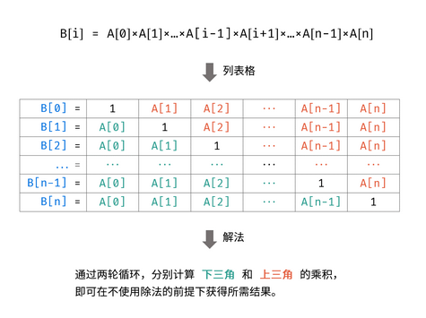

```java
//表格分区
//T:O(N)	S:O(1)
/*
思路：
先计算下三角
计算上三角
*/
class Solution {
    public int[] constructArr(int[] a) {
        if(a.length == 0) return new int[0];
        int[] b=new int[a.length];
        int tmp=1;
        b[0] = 1;   //注意初始化1
        for(int i=1;i<a.length;i++){    //先计算下三角，⚠️从1开始
            tmp *= a[i-1];
          	b[i] = tmp;
        }
        tmp=1;
        for(int i=a.length-2;i>=0;i--){ //先计算上三角 ⚠️从倒数第二行开始
            tmp *= a[i+1];  //⚠️i+1最后一列开始
            b[i] *= tmp;
        }
        return b;
    }
}
```

#### [剑指 Offer 67. 把字符串转换成整数](https://leetcode-cn.com/problems/ba-zi-fu-chuan-zhuan-huan-cheng-zheng-shu-lcof/) 💣

```java
//T:O(N)	S：O(N)
/*
去除空格
符号处理
循环
	非字符处理
	越界处理			2147483647
	结果计算
*/
class Solution {
    public int strToInt(String str) {
        char[] c = str.trim().toCharArray();    //1.去除首尾空格
        if(c.length == 0) return 0;
        int res = 0, bndry = Integer.MAX_VALUE / 10;
        int i = 1, sign = 1;
        if(c[0] == '-') sign = -1; //2.符号处理
        else if(c[0] != '+') i = 0;
        for(int j = i; j < c.length; j++) {
            if(c[j] < '0' || c[j] > '9') break;//3.非字符处理
            if(res > bndry || res == bndry && c[j] > '7') return sign == 1 ? Integer.MAX_VALUE : Integer.MIN_VALUE;  //4.越界处理：最大值与最小值处理
            res = res * 10 + (c[j] - '0');
        }
        return sign * res;
    }
}
```

### 7.2 栈和队列

#### [剑指 Offer 06. 从尾到头打印链表](https://www.nowcoder.com/practice/d0267f7f55b3412ba93bd35cfa8e8035?tpId=13&tqId=11156&tPage=1&rp=1&ru=/ta/coding-interviews&qru=/ta/coding-interviews/question-ranking&from=cyc_github)

```java
//用栈
//T:O(N) S:O(N)
/*1.递归
*/
public ArrayList<Integer> printListFromTailToHead(ListNode listNode) {
    ArrayList<Integer> ret = new ArrayList<>();
    if (listNode != null) {
        ret.addAll(printListFromTailToHead(listNode.next));//⚠️
        ret.add(listNode.val);
    }
    return ret;
}
/*2.栈*/
class Solution {
    public int[] reversePrint(ListNode head) {
        LinkedList<Integer> stk = new LinkedList<>();
       
       int cnt = 0;
        while(head!=null){
            cnt++;
            stk.push(head.val);
            head = head.next;
        }
        //Integer.parseInt(String str)  Integer.toString(int i)
        //Integer转int A.intValue()
        int[] res = new int[cnt];
        for(int i=0;i<cnt;i++){
            res[i] = stk.pop().intValue();
        }
        return res;
    }
}
```

#### [剑指 Offer 09. 用两个栈实现队列](https://www.nowcoder.com/practice/54275ddae22f475981afa2244dd448c6?tpId=13&tqId=11158&tPage=1&rp=1&ru=/ta/coding-interviews&qru=/ta/coding-interviews/question-ranking&from=cyc_github)

```java
//2个栈
//栈1：进  栈2：删除(当第2个栈不为空时直接删除，为空时，将第一个栈的所有元素添加到栈2，再删除)
//T:O(1) S:O(N)
import java.util.Stack;

public class Solution {
    Stack<Integer> stack1 = new Stack<Integer>();
    Stack<Integer> stack2 = new Stack<Integer>();

    public void push(int node) {
        stack1.push(node);
    }

    public int pop() throws Exception {
        if(!stack2.isEmpty()){	//不为空，直接删除
            return stack2.pop();
        }else{					//栈2为空，⚠️将栈1的所有元素添加到栈2，再删除
            while(!stack1.isEmpty()){
                stack2.push(stack1.pop());
            }
            return stack2.isEmpty() ? -1 : stack2.pop();
        }
    }
}
```

#### [剑指 Offer 30. 包含min函数的栈](https://www.nowcoder.com/practice/4c776177d2c04c2494f2555c9fcc1e49?tpId=13&tqId=11173&tPage=1&rp=1&ru=/ta/coding-interviews&qru=/ta/coding-interviews/question-ranking&from=cyc_github)

```java
//辅助栈：存储非严格递减的序列，min就是栈顶
//T:O(1) S:O(N)
public class Solution {
    Stack<Integer> stack1 = new Stack<Integer>();
    Stack<Integer> stack2 = new Stack<Integer>();//最小栈维护最小值  
    
    public void push(int x) {
        stack1.push(x);
        if(stack2.isEmpty() || stack2.peek() >= x) //为空或者栈顶大于等于x，⚠️非严格递减，一定要>=
            stack2.push(x);
    }
    
    public void pop() {	//⚠️ 栈1弹出的是跟栈2栈顶一样，栈2才弹出
        if(stack1.pop().equals(stack2.peek())) stack2.pop();
      //防止栈1弹出的不是最小值
    }
    
    public int top() {
        return stack1.peek();
    }
    
    public int min() {
        return stack2.peek();
    }
}
```

#### [剑指 Offer 31. 栈的压入、弹出序列](https://www.nowcoder.com/practice/d77d11405cc7470d82554cb392585106?tpId=13&tqId=11174&tPage=1&rp=1&ru=/ta/coding-interviews&qru=/ta/coding-interviews/question-ranking&from=cyc_github)

```java
//模拟:T:O(N) S:O(N)
/*
1）不断进栈
2）然后循环判断栈顶是否与与出栈序列相同，是的话，出栈
3）直到栈为空，则是符合的
*/
class Solution {
    public boolean validateStackSequences(int[] pushed, int[] popped) {
        Stack<Integer> stack =new Stack<Integer>();
        int i=0;
        for(int num:pushed){
            stack.push(num);  //进栈
            while(!stack.isEmpty() && stack.peek() == popped[i]){   //循环判断并出栈
                stack.pop();
                i++;
            }
        }
        return stack.isEmpty();
    }
}
```

#### [剑指 Offer 59 - I. 滑动窗口的最大值](https://www.nowcoder.com/practice/1624bc35a45c42c0bc17d17fa0cba788?tpId=13&tqId=11217&tPage=1&rp=1&ru=/ta/coding-interviews&qru=/ta/coding-interviews/question-ranking&from=cyc_github)💣

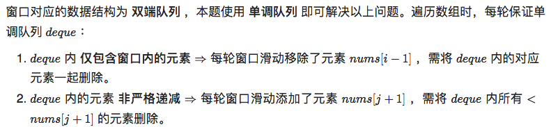

```java
//T:O(N) S:O(k)
/*
思路：
先用堆维护一个窗口（并把第一个堆顶加入结果）
遍历数组（移动窗口）
	将第一个元素移除
	并把最后一个元素添加进去
	把堆顶加入结果
*/
class Solution {
    public int[] maxSlidingWindow(int[] nums, int k) {
         PriorityQueue<Integer> heap = new PriorityQueue<Integer>((a,b)->(b-a));//大顶堆
        int len = nums.length;
        if(k == 0 || len ==0) return new int[0];
        int[] res = new int[len-k+1];
        for(int i=0;i<k;i++){
            heap.add(nums[i]);
        }
        int index = 0;
        res[index++] = heap.peek();
        for(int i=k;i<len;i++){
            heap.remove(nums[i-k]);
            heap.add(nums[i]);
            res[index++] = heap.peek();
        }
        return res;
    }
}


//单调递减队列
class Solution {
    public int[] maxSlidingWindow(int[] nums, int k) {
        Deque<Integer> q = new LinkedList<>();
        int len = nums.length;
        if(k == 0 || len == 0) return new int[0];
        int[] res = new int[len-k+1];
        int index =0;
        for(int i=0;i<len;i++){
            if(i > k-1 && nums[i-k] == q.peekFirst()) q.removeFirst();
            while(!q.isEmpty() && q.peekLast() < nums[i]){  //递减 <
                q.removeLast();
            }
            q.addLast(nums[i]);
            if(i >= k-1) res[index++] = q.peekFirst();
        }
        return res;
    }
}
```

#### [剑指 Offer 59 - II. 队列的最大值](https://leetcode-cn.com/problems/dui-lie-de-zui-da-zhi-lcof/)

```java
/*
思路：
1）A是原始序列；B维护单调递减序列（链头是最大值）
2）插入：一直判断链尾是否 < 当前 x，不是则删除；没有了，则将当前x插入A，B
3）删除：删除A；先判断删除的值是否与B的最大值（链头）相同，是的话，才删除
*/
class MaxQueue {
    Deque<Integer> A,B;

    public MaxQueue() {
        A = new LinkedList<Integer>();
        B = new LinkedList<Integer>();
    }
    
    public int max_value() {
        if (B.isEmpty()) {
            return -1;
        }
        return B.peekFirst();
    }
    
    public void push_back(int x) {
        while (!B.isEmpty() && B.peekLast() < x) {  //将B中所有小于x，全部删除，严格递减
            B.removeLast(); //removeLast()返回空，pollLast()返回boolean，
        }
        B.addLast(x);     //插入到B后面
        A.addLast(x);     //插入到A后面
    }
    
    public int pop_front() {
        if (A.isEmpty()) {
            return -1;
        }
        int ans = A.removeFirst();
        if (ans == B.peekFirst()) {
            B.removeFirst();
        }
        return ans;
    }
}
```

#### [剑指 Offer 41. 数据流中的中位数](https://www.nowcoder.com/practice/9be0172896bd43948f8a32fb954e1be1?tpId=13&tqId=11216&tPage=1&rp=1&ru=/ta/coding-interviews&qru=/ta/coding-interviews/question-ranking&from=cyc_github)

```java
import java.util.PriorityQueue;
//查找 T:O(1) 插入O(logn) ； S：O(n)
//优先队列,堆
//如果从数据流中读出奇数个数值，那么中位数就是所有数值排序之后位于中间的数值。如果从数据流中读出偶数个数值，那么中位数就是所有数值排序之后中间两个数的平均值。
/*
1）2个堆，大顶堆，小顶堆
2）插入元素，当前为偶数个则插入右边（小顶堆，插入前先插入到左边，因为不知道插入的数字是多大）；奇数，插入左边（同理先插入右边）
*/
public class Solution {
   /* 大顶堆，存储左半边元素 */
    private PriorityQueue<Integer> left = new PriorityQueue<>((a, b) -> b - a);
    /* 小顶堆，存储右半边元素，并且右半边元素都大于左半边 */
    private PriorityQueue<Integer> right = new PriorityQueue<>();
    /* 当前数据流读入的元素个数 */
    private int N = 0;

    public void Insert(Integer val) {
        /* 插入要保证两个堆存于平衡状态 */
        if (N % 2 == 0) {
            /* N 为偶数的情况下插入到右半边。
             * 因为右半边元素都要大于左半边，但是新插入的元素不一定比左半边元素来的大，
             * 因此需要先将元素插入左半边，然后利用左半边为大顶堆的特点，取出堆顶元素即为最大元素，此时插入右半边 */
            left.add(val);
            right.add(left.poll());
        } else {
            right.add(val);
            left.add(right.poll());
        }
        N++;
    }

    public Double GetMedian() {
        if (N % 2 == 0)
            return (left.peek() + right.peek()) / 2.0;
        else
            return (double) right.peek();
    }
}
```

#### [41.2字符流中第一个不重复的字符](https://www.nowcoder.com/practice/00de97733b8e4f97a3fb5c680ee10720?tpId=13&tqId=11207&tPage=1&rp=1&ru=/ta/coding-interviews&qru=/ta/coding-interviews/question-ranking&from=cyc_github)

```java
/*使用统计数组来统计每个字符出现的次数，本题涉及到的字符为都为 ASCII 码，因此使用一个大小为 128 的整型数组就能完成次数统计任务。

1）使用队列来存储到达的字符，记录次数
2）移除队列头部那些出现次数不再是一次的元素。
因为队列是先进先出顺序，因此队列头部的元素为第一次只出现一次的字符。*/

import java.util.LinkedList;
import java.util.Queue;
public class Solution {
    private int[] cnts = new int[128];
    private Queue<Character> queue = new LinkedList<>();

    public void Insert(char ch) {
        cnts[ch]++;
        queue.add(ch);
        while (!queue.isEmpty() && cnts[queue.peek()] > 1)
            queue.poll();
    }

    public char FirstAppearingOnce() {
        return queue.isEmpty() ? '#' : queue.peek();
    }
}
```

### 7.3 哈希表

#### [剑指 Offer 50. 第一个只出现一次的字符](https://leetcode-cn.com/problems/di-yi-ge-zhi-chu-xian-yi-ci-de-zi-fu-lcof/) ⚠️

```java
//有序哈希表
//T:O(N) S:O(1)
/*
思路：
1）先存储每个字符的次数
2）再遍历一遍，次数为1的就是
*/
class Solution {
  public int FirstNotRepeatingChar(String str) {
    int[] cnts = new int[128];
    for (int i = 0; i < str.length(); i++)
      cnts[str.charAt(i)]++;
    for (int i = 0; i < str.length(); i++)
      if (cnts[str.charAt(i)] == 1)	//传的是str.charAt(i)
        return i;
    return -1;
  }
}

//最优
public int FirstNotRepeatingChar2(String str) {
    BitSet bs1 = new BitSet(128);
    BitSet bs2 = new BitSet(128);
    for (char c : str.toCharArray()) {
        if (!bs1.get(c) && !bs2.get(c))
            bs1.set(c);     // bs1存在  bs2不存在
        else if (bs1.get(c) && !bs2.get(c))
            bs2.set(c);     // 存在2次
    }
    for (int i = 0; i < str.length(); i++) {
        char c = str.charAt(i);
        if (bs1.get(c) && !bs2.get(c)) 
            return i;
    }
    return -1;
}
```

#### [剑指 Offer 61. 扑克牌中的顺子](https://leetcode-cn.com/problems/bu-ke-pai-zhong-de-shun-zi-lcof/)


```java
//T:O(N)	S:O(N)
/*
思路：
遍历数组
	跳过大小王
	保存最大值，最小值
	重复，直接返回false
	否则存入哈希
最大值-最小值 < 5  5-1<=4
*/
class Solution {
    public boolean isStraight(int[] nums) {
        Set<Integer> repeat = new HashSet<>();
        int max = 0, min = 14;
        for(int num : nums) {
            if(num == 0) continue; // 跳过大小王
            max = Math.max(max, num); // 最大牌
            min = Math.min(min, num); // 最小牌
            if(repeat.contains(num)) return false; // 若有重复，提前返回 false
            repeat.add(num); // 添加此牌至 Set
        }
        return max - min < 5; // 最大牌 - 最小牌 < 5 则可构成顺子
    }
}
```

### 7.4 链表

#### [剑指 Offer 18. 删除链表的节点](https://leetcode-cn.com/problems/shan-chu-lian-biao-de-jie-dian-lcof/)

```java
//T:O(1) 
/*
如果进行 N 次操作，那么大约需要操作节点的次数为 N-1+N=2N-1，其中 N-1 表示 N-1 个不是尾节点的每个节点以 O(1) 的时间复杂度操作节点的总次数，N 表示 1 个尾节点以 O(N) 的时间复杂度操作节点的总次数。(2N-1)/N ~ 2,因此该算法的平均时间复杂度为 O(1)。*/
/*
1）先判断删除的是不是头结点
2）不是的，找到删除的结点
3）找到了，将其删除
*/
class Solution {
    public ListNode deleteNode(ListNode head, int val) {
        if(head.val == val) return head.next;   //删除的是头结点
        ListNode pre = head, cur = head.next;   //2个指针
        while(cur != null && cur.val != val){
            pre = cur;
            cur = cur.next;
        }
        if(cur != null) pre.next = cur.next;    //如果找到了，将当前结点删除
        return head;
    }
}
```

#### [18.2删除链表中重复的结点](https://www.nowcoder.com/practice/fc533c45b73a41b0b44ccba763f866ef?tpId=13&tqId=11209&tPage=1&rp=1&ru=/ta/coding-interviews&qru=/ta/coding-interviews/question-ranking&from=cyc_github)

```java
/*
当前指针和头指针是否相同，是相同删除，直到不同，递归；
*/
public class Solution {
    public ListNode deleteDuplication(ListNode pHead) {
        //空链表
        if(pHead == null) 
            return null;
        ListNode res = new ListNode(0);
        //在链表前加一个表头
        res.next = pHead; 
        ListNode cur = res;
        while(cur.next != null && cur.next.next != null){ 
            //遇到相邻两个节点值相同
            if(cur.next.val == cur.next.next.val){ 
                int temp = cur.next.val;
                //将所有相同的都跳过
                while (cur.next != null && cur.next.val == temp) 
                    cur.next = cur.next.next;
            }
            else 
                cur = cur.next;
        }
        //返回时去掉表头
        return res.next; 
    }
}

```

#### [剑指 Offer 24. 反转链表](https://www.nowcoder.com/practice/75e878df47f24fdc9dc3e400ec6058ca?tpId=13&tqId=11168&tPage=1&rp=1&ru=/ta/coding-interviews&qru=/ta/coding-interviews/question-ranking&from=cyc_github)

```java
//前后指针
//T:O(N) S:O(1) 
class Solution {
    public ListNode ReverseList(ListNode head) {
        ListNode pre = null;
        ListNode cur = head;
        while(cur != null){
            ListNode tmp = cur.next;
            cur.next = pre;
            
            pre = cur;
            cur = tmp;
        }
        return pre;
    }
}
```

#### [剑指 Offer 35. 复杂链表的复制](https://www.nowcoder.com/practice/f836b2c43afc4b35ad6adc41ec941dba?tpId=13&tqId=11178&tPage=1&rp=1&ru=/ta/coding-interviews&qru=/ta/coding-interviews/question-ranking&from=cyc_github)💣💣

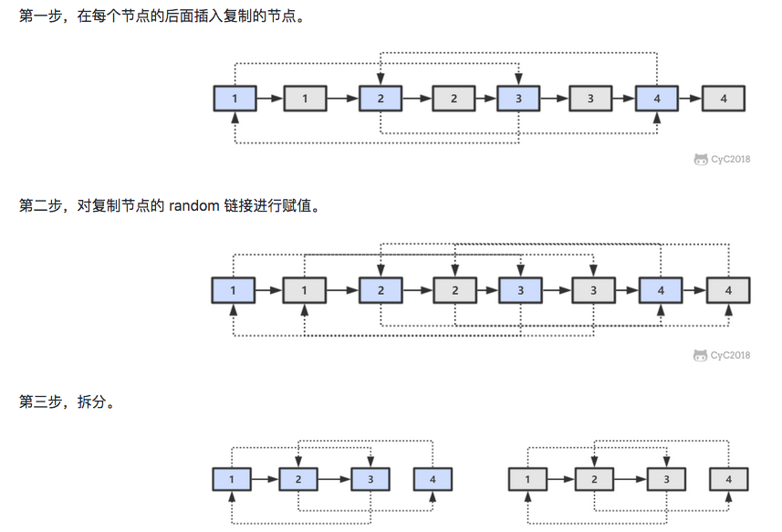

```java
public class Solution {
    public RandomListNode Clone(RandomListNode pHead) {
        if (pHead == null)
            return null;
        // 插入新节点   
        RandomListNode cur = pHead;
        while (cur != null) {
            RandomListNode clone = new RandomListNode(cur.label);
            clone.next = cur.next;
            cur.next = clone;
            cur = clone.next;
        }
        // 建立 random 链接
        cur = pHead;
        while (cur != null) {
            RandomListNode clone = cur.next;	//1->3  clone要跟cur一样要有random 1' -> 3'
            if (cur.random != null)
                clone.random = cur.random.next; //clone->cur
          
            cur = clone.next;	//更新cur
        }
        // （跳1个）拆分  1->1'->2->2'
        cur = pHead;
        RandomListNode pCloneHead = pHead.next;	//⚠️保存
        while (cur.next != null) {
            RandomListNode tmp = cur.next;    //clone 1'
            cur.next = tmp.next;			  //1->2
            cur = tmp;						  //1'
        }
        return pCloneHead;
    }
}
```

#### [剑指 Offer 52. 两个链表的第一个公共节点](https://leetcode-cn.com/problems/liang-ge-lian-biao-de-di-yi-ge-gong-gong-jie-dian-lcof/)

```java
//双指针  完美偶遇
// T:O(M+N) S:O(1)
public class Solution {
  	 public ListNode FindFirstCommonNode(ListNode pHead1, ListNode pHead2) {
        ListNode node1 = pHead1,node2 =pHead2;
        while(node1 != node2){	//重点
            node1 = node1 != null ? node1.next:pHead2;//循环遍历1，到null时，变为head2
            node2 = node2 != null ? node2.next:pHead1;
        }
        return node1;//返回node2也可以
    }
}
```

### 7.5 位运算

#### [剑指 Offer 15. 二进制中1的个数](https://leetcode-cn.com/problems/er-jin-zhi-zhong-1de-ge-shu-lcof/)

```java
//时间复杂度 O(M):M二进制1的个数 S：O(1)
public class Solution {
    public int hammingWeight(int n) {
        int res = 0;
        while(n != 0) {
            res++;
            n &= （n - 1）; //去除最右边的1
        }
        return res;
    }
}
```

#### [剑指 Offer 56 - I. 数组中数字出现的次数](https://leetcode-cn.com/problems/shu-zu-zhong-shu-zi-chu-xian-de-ci-shu-lcof/)💣

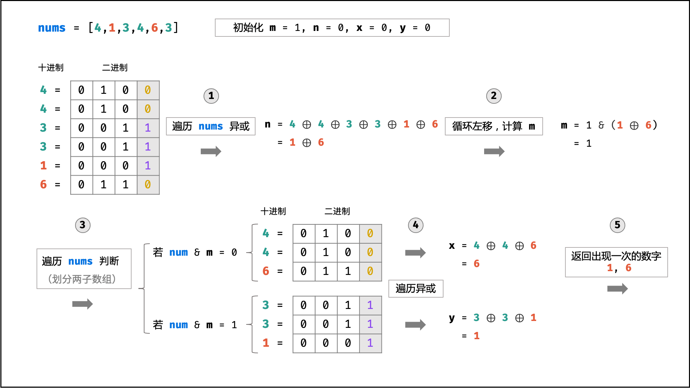

```java
//找数组中出现1次的1个数字，全员异或既可。  任何数字和本身异或为0；0与任何数字异或还是数字自身

//而本题找出现1次的2个数字
//考虑将这个2个数字分组，并且满足分到不同的组，还有其他相同的数字分到相同的组

//T:O(N) S:O(1)
class Solution {
    public int[] singleNumbers(int[] nums) {
        //全员异或后得到这个只出现一次的数（本题需要找到2个）
        int ret = 0; //结果,0与任何数异或还是自身
        for (int n : nums) {
            ret ^= n;
        }	//ret那2个不同数字的异或结果
      
      //找到ret第一位是1的
        //比如ret为4，则第一位不为的是100，即div=4
        int div = 1;
        while ((div & ret) == 0) {
            div <<= 1;
        }
      //分组
        int a = 0, b = 0;
        for (int n : nums) {
            if ((div & n) != 0) {	//判断该位是否为0进行分组 （2，1，2）=>1
                a ^= n;
            } else {	//(3)
                b ^= n;
            }
        }
        return new int[]{a, b};
    }
}
```

#### [剑指 Offer 56 - II. 数组中数字出现的次数 II💣](https://leetcode-cn.com/problems/shu-zu-zhong-shu-zi-chu-xian-de-ci-shu-ii-lcof/)


```java
//其他数字都出现了三次。请找出那个只出现一次的数字
//考虑数字的二进制形式，对于出现三次的数字，各 二进制位 出现的次数都是 3 的倍数。


/*
if two == 0:
  if n == 0:
    one = one
  if n == 1:
    one = ~one
if two == 1:
    one = 0

if two == 0:
    one = one ^ n
if two == 1:
    one = 0
    
one = one ^ n & ~two
*/

class Solution {
    public int singleNumber(int[] nums) {
        int ones = 0, twos = 0;	//2位来表示3个状态
        for(int num : nums){
            ones = ones ^ num & ~twos;
            twos = twos ^ num & ~ones;
        }
        return ones;
    }
}

// 异或运算：x ^ 0 = x， x ^ 1 = ~x
// 与运算：x & 0 = 0 ， x & 1 = x

```


#### [剑指 Offer 64. 求1+2+…+n](https://leetcode-cn.com/problems/qiu-12n-lcof/)

```java
//条件与 && 具有短路原则
public int Sum_Solution(int n) {
    int sum = n;
    boolean b = (n > 0) && ((sum += Sum_Solution(n - 1)) > 0);
    return sum;
}
```

#### [剑指 Offer 65. 不用加减乘除做加法](https://leetcode-cn.com/problems/bu-yong-jia-jian-cheng-chu-zuo-jia-fa-lcof/)

```java
//T,S:O(1)
/*
3+4

011
100

 (a & b) <<  1
^= 111
*/
class Solution {
    public int add(int a, int b) {
        while(b != 0) { // 当进位为 0 时跳出
            int c = (a & b) << 1;  // &取最高位，c = 进位
            a ^= b; // a = 非进位和 
            b = c; // b = 进位
         }
        return a;
    }
}
```

### 7.6 排序

链表快排

#### [剑指 Offer II 077. 链表排序](https://leetcode.cn/problems/7WHec2/)

```java
class Solution {
    ListNode partition(ListNode head,ListNode end){
        ListNode p = head, q = head;    //快指针 指向大的
        int pivot = head.val; 
        while (q != end) {
            if (q.val < pivot) {    //小的话，放前面
                p = p.next;
                int tmp = p.val;
                p.val = q.val;
                q.val = tmp;
            }
            q = q.next;
        }
        //此时p.val >= pivot
        int tmp = p.val;
        p.val = head.val;
        head.val = tmp;
        return p;
    }
    ListNode quickSort(ListNode head,ListNode end){
        if (head == end) return head;
        ListNode mid = partition(head, end);
        head = quickSort(head, mid);
        quickSort(mid.next, end);
        return head;
    }
    public ListNode sortList(ListNode head) {
        if(head == null || head.next == null) return head;
        return quickSort(head,null);
    }
}
```


#### [剑指 Offer 40. 最小的k个数](https://www.nowcoder.com/practice/6a296eb82cf844ca8539b57c23e6e9bf?tpId=13&tqId=11182&tPage=1&rp=1&ru=/ta/coding-interviews&qru=/ta/coding-interviews/question-ranking&from=cyc_github)

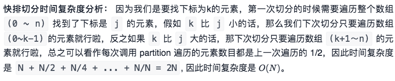

```java
//快排  T：O(n) S:O(1)
//快速排序的 partition() 方法，会返回一个整数 j 使得 a[l..j-1] 小于等于 a[j]，且 a[j+1..h] 大于等于 a[j]，此时 a[j] 就是数组的第 j 大元素。可以利用这个特性找出数组的第 K 个元素，这种找第 K 个元素的算法称为快速选择算法。
import java.util.*;
//快排  T：O(n) S:O(1)
//快速排序的 partition() 方法，会返回一个整数 j 使得 a[l..j-1] 小于等于 a[j]，且 a[j+1..h] 大于等于 a[j]，此时 a[j] 就是数组的第 j 大元素。可以利用这个特性找出数组的第 K 个元素，这种找第 K 个元素的算法称为快速选择算法。
class Solution {
    public ArrayList<Integer> GetLeastNumbers_Solution(int[] arr, int k) {
        if (k == 0 || arr.length == 0) {
            return new ArrayList<Integer>();
        }
        //⚠️ 最后一个参数表示我们要找的是下标为k-1的数
        return quickSearch(arr, 0, arr.length - 1, k - 1);
    }

    private ArrayList<Integer>  quickSearch(int[] nums, int lo, int hi, int k) {
        // 每快排切分1次，找到排序后下标为j的元素，如果j恰好等于k就返回j以及j左边所有的数；
        int j = partition(nums, lo, hi);
        if (j == k) {
            ArrayList<Integer> ret = new ArrayList<>();
            for (int i = 0; i <= k; i++) ret.add(nums[i]);//0到k
            return ret;
        }
        // 否则根据下标j与k的大小关系来决定继续切分左段还是右段。
        return j > k? quickSearch(nums, lo, j - 1, k): quickSearch(nums, j + 1, hi, k);
    }

    // 快排切分，返回下标j，使得比nums[j]小的数都在j的左边，比nums[j]大的数都在j的右边。
    private int partition(int[] nums, int lo, int hi) {
        int v = nums[lo];	//基准
        while (lo < hi) {	//双指针
            while (lo < hi && nums[hi] >= v){hi--;}    //先从右到左搜索比基准小的，不能调换
            swap(nums,lo,hi);
            while (lo < hi && nums[lo] <= v){lo++;}
            swap(nums,lo,hi);
        }
        return lo;
    }
    public void swap(int[] nums, int i, int j){
        int tmp = nums[i];
        nums[i] = nums[j];
        nums[j] = tmp;
    }
}


//大根堆  T:O(nlog⁡k) S:O(k), n为数组的长度，k为大根堆里最多k个数
class Solution {
    public int[] getLeastNumbers(int[] arr, int k) {
        int[] res = new int[k];
        if (k == 0) { // 排除 0 的情况
            return res;
        }
        //大根堆
        PriorityQueue<Integer> queue = new PriorityQueue<Integer>(new Comparator<Integer>() {
            public int compare(Integer num1, Integer num2) {
                return num2 - num1;
            }
        });
        for (int i = 0; i < k; ++i) {   //首先插入k个数
            queue.offer(arr[i]);
        }
        for (int i = k; i < arr.length; ++i) {//维护前k个数
            if (queue.peek() > arr[i]) {    //比堆顶小，插入
                queue.poll();           //堆顶弹出
                queue.offer(arr[i]);    //插入当前数
            }
        }
        for (int i = 0; i < k; ++i) {   //将堆的数据赋值给res
            res[i] = queue.poll();
        }
        return res;
    }
}
```

#### [剑指 Offer 45. 把数组排成最小的数](https://leetcode-cn.com/problems/ba-shu-zu-pai-cheng-zui-xiao-de-shu-lcof/)

```java
//T:O(NlogN),S:O(N)
class Solution {
    public String minNumber(int[] nums) {
        String[] strs = new String[nums.length];
        for(int i = 0; i < nums.length; i++)
            strs[i] = String.valueOf(nums[i]);
        Arrays.sort(strs, (a, b) -> (a + b).compareTo(b + a));//排序
        StringBuilder res = new StringBuilder();
        for(String s : strs)
            res.append(s);
        return res.toString();
    }
}
```

## （8）数学

#### [剑指 Offer 39. 数组中出现次数超过一半的数字](https://leetcode-cn.com/problems/shu-zu-zhong-chu-xian-ci-shu-chao-guo-yi-ban-de-shu-zi-lcof/)💣

```java
//摩尔投票法
//T:O(n) S:O(1)
class Solution {
    public int majorityElement(int[] nums) {
        int vote = 0, x= 0;
        for(int num:nums){
            if(vote == 0) x = num;
            vote += num == x ? 1:-1;
        }

        int cnt = 0;
        for(int num:nums){
            if(num == x){
                cnt ++;
            }
        }
        return cnt > nums.length/2 ? x : -1;
    }
}
```

#### [剑指 Offer 62. 圆圈中最后剩下的数字](https://leetcode-cn.com/problems/yuan-quan-zhong-zui-hou-sheng-xia-de-shu-zi-lcof/) 约瑟环

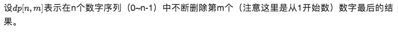

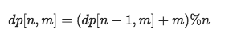

```java
//约瑟夫环，圆圈长度为 n 的解可以看成长度为 n-1 的解再加上报数的长度 m。因为是圆圈，所以最后需要对 n 取余。
public class Solution {
    public int LastRemaining_Solution(int n, int m) {
        if (n == 1)     /* 递归返回条件 */
            return 0;
        return (LastRemaining_Solution(n - 1, m) + m) % n;
    }
}  
```

#### [剑指 Offer 43. 1～n 整数中 1 出现的次数💣](https://leetcode-cn.com/problems/1nzheng-shu-zhong-1chu-xian-de-ci-shu-lcof/)


```java
/*
//T：O(logn) S:O(1)
当 cur = 0 时:此位 1 的出现次数:high×digit   2304 23*10
当 cur = 1 时:high×digit+low+1    2314,high=23,cur=1   23*10+4+1
当 cur > 1 时： (high+1)×digit		2324,  (23+1)*10
*/
class Solution {
public:
    int countDigitOne(int n) {
        long digit = 1, res = 0;//防止溢出
        int high = n / 10, cur = n % 10, low = 0;
        while(high != 0 || cur != 0) {//当 high 和 cur 同时为 0 时，说明已经越过最高位，因此跳出
            if(cur == 0) res += high * digit;
            else if(cur == 1) res += high * digit + low + 1;
            else res += (high + 1) * digit;
            //更新
            low += cur * digit;      //将 cur 加入 low ，组成下轮 low
            cur = high % 10;      //顺序与下面不能互换  
            high /= 10;
            digit *= 10;
        }
        return res;
    }
};
```

#### [剑指 Offer 44. 数字序列中某一位的数字](https://leetcode-cn.com/problems/shu-zi-xu-lie-zhong-mou-yi-wei-de-shu-zi-lcof/)💣


```java
//01234567891011，第0位为0，第11位为0
//T,S:O(logn)
class Solution {
    public int findNthDigit(int n) {   
        int digit = 1;	//位数digit
        long start = 1;		//注意溢出
        long count = 9;		//数位数量count
        while (n > count) { // 1.计算n所在的数位数量count  
            n -= count;
            digit += 1;
            start *= 10;
            count = digit * start * 9;
        }	//（n:11  n=2 count=180 start=10 digit=2 num=10 ）
        long num = start + (n - 1) / digit; // 2.计算n所在的数字num 
        return Long.toString(num).charAt((n - 1) % digit) - '0'; // 3.确定 n 是num 中的哪一数位，
    }
}
```


## [TOT100](https://leetcode-cn.com/problem-list/2cktkvj/)


## [HOP150](https://leetcode-cn.com/problem-list/2ckc81c/)

