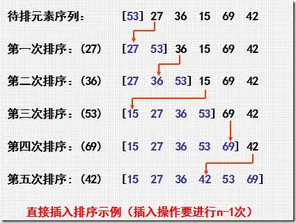
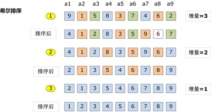
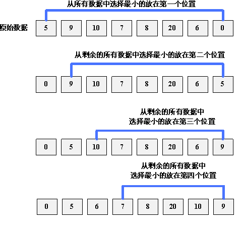
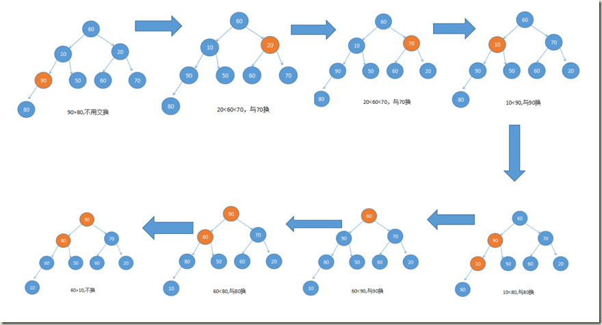
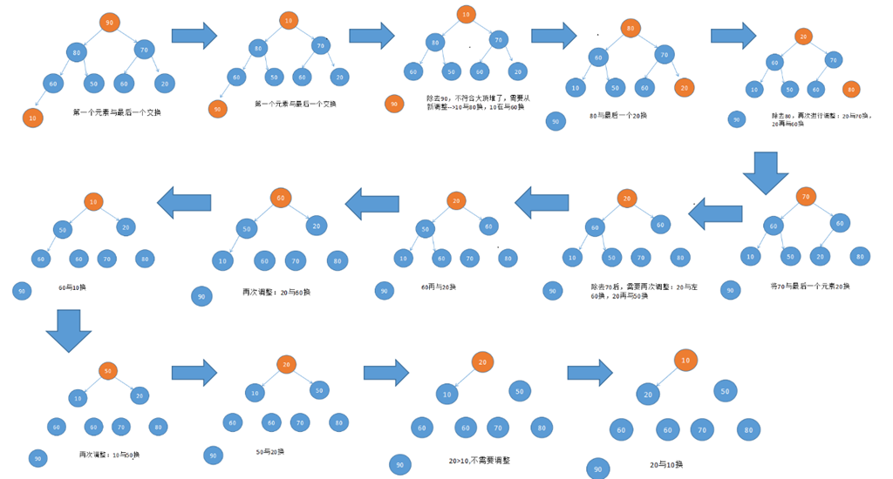
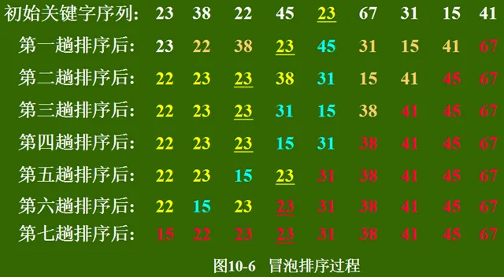
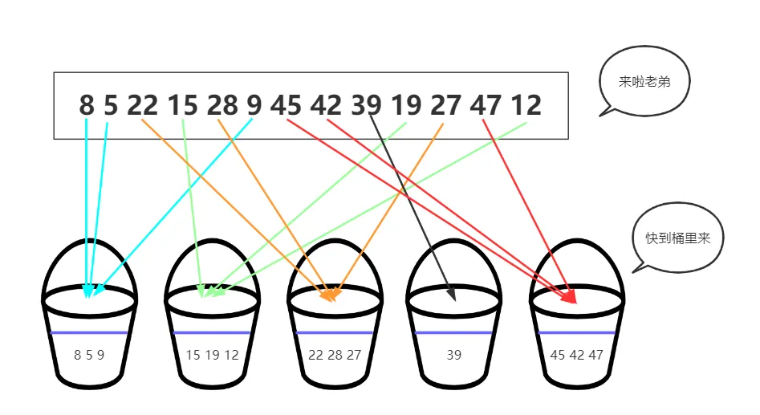
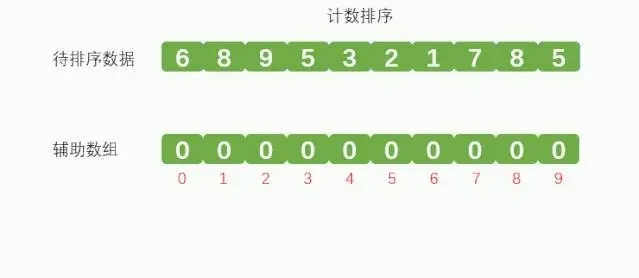
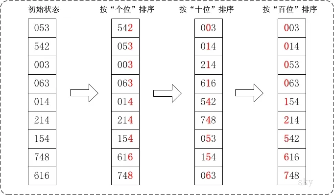
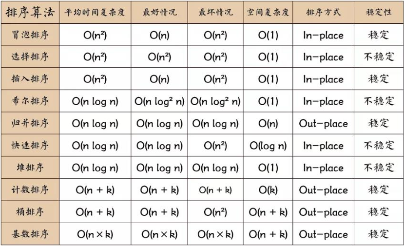

### 线性表


#### 数组VS链表

数组是一段连续的存储空间；链表不要求连续

数组支持随机访问，而链表不支持。

数组的大小固定，而链表则天然支持动态扩容。

需要经常添加和删除数据的话，使用链表比较合适。

### 栈与队列

**栈和队列的区别**

队列：先进先出 
栈：先进后出 

队列和栈的遍历数据速度 
队列：基于地址指针进行遍历，而且可以从头部或者尾部进行遍历，但不能同时遍历，无需开辟空间，因为在遍历的过程中不影响数据结构，所以遍历速度要快 
栈：只能从顶部取数据，也就是说最先进入栈底的，需要遍历整个栈才能取出来，遍历数据时需要微数据开辟临时空间，保持数据在遍历前的一致性

**应用场景**

逆序输出（将一个非负的十进制整数N转换成其他D进制数），括号匹配，迷宫求解，二叉树遍历，表达式求值

回文判断：利用队列和栈的特性，一个是先进先出，一个是先进后出，迷宫问题，广度优先遍历

## 排序

#### （1）插入排序 insertion sort

类似于扑克牌排序



执行流程

1.在执行过程中，插入排序会将序列分为2部分

头部是已经拍好序的，尾部是待排列的

2.从头开始扫描每一个元素

每当扫描到一个元素，就将它插入到头部合适的位置，使得头部的数据依然保持有序。

#### （2）希尔排序



#### （3）选择排序




#### （4）堆排序

初始化堆

> 调整堆，从最低层开始调整，根节点大于左右孩子



堆排序（建堆n，调整堆logn）

> 交换堆顶和堆尾，取出堆尾，重新调堆



#### （5）冒泡排序



比较相邻的元素。如果第一个比第二个大，就交换他们两个。

#### （6）快排

- 先从数量中取出一个数作为基准数（简单起见可以取第一个数）
- 分区过程，将比这个数大的数全放到他的右边，小于或者等于他的数放到左边（分区）
- 再对左右区间重复第一步、第二步，直到各区间只有一个数.（递归）

```
（快排原理是二分法，已经排序好序列复杂度最高，partion函数使用随机定位）
快排的最坏时间复杂度O（N2） 如何避免？（随机寻找pivot）如何随机
（基础库的随机函数，如果rand() 是 (0, 1)区间，修改区间大小和偏移）
```

#### （7）归并排序

设定两个指针，最初位置分别为两个已经排序序列的起始位置；

比较两个指针所指向的元素，选择相对小的元素放入到合并空间，并移动指针到下一位置；

#### （8）桶排序

**(1)订单金额排序**（桶排序）

> 右侧所有桶内数据都比左侧的要大，再对桶内进行排序



有 10 GB的订单数据，我们希望按订单金额（假设金额都是正整数）进行排序，但是内存有限，只有几百 MB ，没办法一次性把所有的数据都加载到内存中，怎么办？

第一个桶 1-1000，第二个 1001-2000 ，以此类推，每一个桶对应一个文件，并且按照金额范围的大小顺序进行编号命名（00,01,02,03…99）

 理想状态下，如果订单在 1 到 10 万元之间均匀分布，那订单会被均匀的划分到 100 个桶里，每个文件存储大小为 100MB 的数据，我们可以把这 100 个文件一次放入到内存中，通过快排来进行排序，等都排好之后，我们只需要按照文件编号，一个一个读取到同一个文件中，那数据就完成排序了。

  不过有个问题，订单数据很难做到均匀分布，如果有的文件超过 100 MB 无法放入内存怎么办？**这种情况我们可以单独对数据较多的桶继续划分**，然后重复依次排序的过程。直到所有文件都能读入内存为止。

#### （9）计数排序

**(2)快速得知高考分数排名**（计数排序）



全国几百万考生，数据量很大，但是高考分数的范围很小，满分 750，最低分 0 分。

> 计数排序：排序的数据范围不大的时候

我们就可以划分成 **751 个桶**，然后把学生们按成绩放入到每个桶里，然后再从桶里一次取出数据，就是排列好的情况了，而且时间复杂度是  **O(n+m)**。

#### （10）基数排序

 **(3)10 万个手机号排序**（基数排序）k为k位



桶排序，计数排序也不能用，因为手机号的范围太大了，有k= 11 位数。

> 针对这种排序,此时用**基数排序**。O(k*n)

先按照最后一位来排序手机号码，然后按照倒数第二位，然后按照导数第三位，以此类推，排序11次

#### 时间复杂度



- 元素的**移动**次数与关键字的初始排列次序**无关**的是：基数排序
- 元素的**比较**次数与初始序列**无关**是：选择排序、折半插入排序
- 算法的**时间复杂度**与初始序列**无关**的是：选择排序、堆排序、归并排序、基数排序
- 算法的**排序趟数**与初始序列**无关**的是：插入排序、选择排序、基数排序

> 移动基数排
>
> 比较选择折
>
> 时选堆归基
>
> 趟插选择基

### 图

#### 邻接表

> （针对稀疏图）

空间：O（n+e）

BFS，DFS遍历：有向图：O（n+e）；无向图遍历所有边：O（n+2e）

#### 邻接矩阵

> （针对稠密图，**简单来说边越多，图就越稠密**）

空间：O(n^2)

BFS，DFS遍历：O(n^2 ）

### 二分查找

#### 平均查找长度

二分查找，平均查找长度

n=12，ASL=（1x1+2x2+4x3+5x4）/12 约等于3.1

结点数x层数；第一层1个结点，1x1；第二层2个结点，2x2，

### 树

#### 应用场景

红黑树：linux中**进程的调度**用的是红黑树，**HashMap**。数据较小，可以完全放到内存中时，红黑树的时间复杂度比B树低。

B树：B树大量应用在数据库和文件系统当中，单个节点的查找速度比B+快

B+树：mysql使用B+树作为索引，存取更多的数据，磁盘IO次数更少

**二叉树（会退化为链表）–>二叉搜索树–>二叉平衡树–>红黑树**

#### AVL:平衡二叉树

> 平衡因子,01,-1，不能大于1

##### 旋转


#### **红黑树**

底层结构是：二叉树

> 增加了着色和相关的性质使得红黑树相对平衡，牺牲部分平衡性（查询性能），换来更高的综合性能，深度最大的节点的深度<= 2 ，保证每次插入最多只需要三次旋转就能达到平衡
>
> 红黑树的查找、删除、添加操作都为log(n)
>
> 实际应用中，若搜索的次数远远大于插入和删除，那么选择AVL；如果搜索，插入删除次数几乎差不多，应该选择RB。

**定义**：红黑树是基于二叉搜索树的，

（1）其根节点和叶子节点为黑色，

（2）每个红色节点的两个子节点一定是黑色，**不能有两个红色节点相连**

（3）任一节点到每个叶子节点的路径都包含数量相同的黑节点（**黑高**）

**变颜色规则**：所有插入的点**默认为红色**

##### ***旋转或变色***

1.当前父亲节点是黑色直接插入

2.当前父亲节点是红色

​	（1）叔叔是红色，父亲节点和叔叔节点变黑，爷爷变红，指正定位到爷爷节点

​	（2）叔叔节点是黑色，

​				A.LL直接将父节点变为黑色，爷爷节点变红，做一次右旋

​				B.LR左旋成LL,再操作LL


#### B**树**

B 树是为了磁盘或其它存储设备而设计的一种多叉平衡查找树。

一棵M阶的B树：

（1）每个节点最多有m棵子树

（2）除根节点外，其余非叶子节点至少有ceil(M/2)棵子树，最多有M-1个关键码

（3）所有叶子节点都在同一层

 *一棵含有N个总关键字数的m阶的B树的最大高度是多少?* log_ceil（m/2）{(N+1)/2} + 1 ，log以（m/2）为低，(N+1)/2的对数再加1

#### B+树

是应文件系统所需而产生的一种B-tree的变形树。

   (1) 有m个子树的中间节点包含有m个元素（B树中是k-1个元素），每个元素不保存数据，只用来索引；

（2）所有的叶子结点中包含了全部关键字的信息，及指向含有这些关键字记录的指针，且叶子结点本身依关键字的大小自小而大的顺序链接。

（3）**所有的非终端结点可以看成是索引部分**，结点中仅含有其子树根结点中最大（或最小）关键字

**为什么说B+树比B树更适合数据库索引？**

1）B+树的磁盘读写代价更低

　　B+树的内部结点并没有指向关键字具体信息的指针。因此其内部结点相对B 树更小。如果把所有同一内部结点的关键字存放在同一盘块中，那么盘块所能容纳的关键字数量也越多。一次性读入内存中的需要查找的关键字也就越多。相对来说IO读写次数也就降低了；

2）B+树查询效率更加稳定

　　由于非终结点并不是最终指向文件内容的结点，而只是叶子结点中关键字的索引。所以任何关键字的查找必须走一条从根结点到叶子结点的路。所有关键字查询的路径长度相同，导致每一个数据的查询效率相当；

3）B+树便于范围查询（最重要的原因，范围查找是数据库的常态）

　　B树在提高了IO性能的同时并没有解决元素遍历的效率低下的问题，正是为了解决这个问题，B+树应用而生。B+树只需要去遍历叶子节点就可以实现整棵树的遍历。而且在数据库中基于范围的查询是非常频繁的，而B树不支持这样的操作或者说效率太低；不懂可以看看这篇解读-》[范围查找](https://zhuanlan.zhihu.com/p/54102723)

#### B*树

​    是B+树的变体，在B+树的非根和非叶子结点再增加指向兄弟的指针；

  B*树定义了非叶子结点关键字个数至少为(2/3)*M，即块的最低使用率为2/3（代替B+树的1/2）；

​    B+树的分裂：当一个结点满时，分配一个新的结点，并将原结点中1/2的数据复制到新结点，最后在父结点中增加新结点的指针；B+树的分裂只影响原结点和父结点，而不会影响兄弟结点，所以它不需要指向兄弟的指针；

​    B*树的分裂：当一个结点满时，如果它的下一个兄弟结点未满，那么将一部分数据移到兄弟结点中，再在原结点插入关键字，最后修改父结点中兄弟结点的关键字（因为兄弟结点的关键字范围改变了）；如果兄弟也满了，则在原结点与兄弟结点之间增加新结点，并各复制1/3的数据到新结点，最后在父结点增加新结点的指针；

​    所以，B*树分配新结点的概率比B+树要低，空间使用率更高；
