可封装性不属于结构化程序设计原则

软件需求规格说明书的作用不包括(D)。

A. 软件验收的依据

B. 用户与开发人员对软件要做什么的共同理解

C. 软件设计的依据

D. 软件可行性研究的依据

## 测试理论基础

### 什么是软件测试？⭐️

答：软件测试是**在规定的条件下对程序进行操作，以发现错误，对软件质量进行评估**。

------

### 软件测试的目的是什么？⭐️

答：软件测试的目的在于（1）**发现软件的缺陷和错误**（2）**保证软件的质量**，**确保能够满足用户以及产品的需求**。

（标重点）**软件测试的目的是为了找bug，并不是验证软件没有bug**。

------

### 白盒测试用例设计常用方法⭐️

答：通过程序源代码进行测试而不使用用户界面。

**静态测试：不用运行程序的测试，如文档测试、代码检查**等

动态测试：需要执行代码，接口测试、覆盖率分析、性能分析、内存分析等。

**逻辑覆盖法**：主要包括**语句覆盖，判断覆盖，条件覆盖，判断/条件覆盖，条件组合覆盖，路径覆盖**等。

六种覆盖标准发现错误的能力由弱到强的变化：

1. **语句覆盖**，每条语句至少执行一次。
2. 判断覆盖，每个判断的每个分支至少执行一次。
3. 条件覆盖，每个判段的每个条件应取到的各种可能的值。
4. 判断/条件覆盖，同时满足判断覆盖条件覆盖。
5. 条件组合覆盖，每个判定中各条件的每一种组合至少出现一次。
6. **路径覆盖**，使程序中每一条可能的路径至少执行一次。

------

### 黑盒测试用例设计常用方法⭐️

答：**等价划分类，边界值分析。错误推测法**、**因果图法、场景法、正交试验设计法**等。


------

### 什么是灰盒测试？

答：灰盒测试，是介于[白盒测试](https://baike.baidu.com/item/白盒测试/934440)与[黑盒测试](https://baike.baidu.com/item/黑盒测试/934030)之间的一种测试，灰盒测试多用于[集成测试](https://baike.baidu.com/item/集成测试/1924552)阶段。目前互联网的测试大多数都是**灰盒测试**。

------

### 列举出你所了解的软件测试方式

答：

按照软件的**生命周期**划分：**单元测试、集成测试、回归测试、系统测试、验收测试**。

按照**测试关注点**划分：**功能测试、性能测试、稳定性测试、易用性测试、安全性测试**。

按照**测试实施者**划分：**开发方测试（α测试）、用户测试（β测试）、第三方测试**。

按照**技术/测试用例设计**划分：**白盒测试、黑盒测试、灰盒测试**。

按照**分析方法**划分：**静态测试、动态测试**。

按照**测试执行方式**划分：**手工测试、自动化测试**。

按照**测试对象**划分：**程序测试、文档测试**。

------

### 什么是单元测试

答：完成最小的软件设计单元（模块）的验证工作，确保模块被正确编码。通常情况下是白盒的，对代码风格和规则、程序设计和结构、业务逻辑等进行静态测试，及早发现和解决不易显现的错误。

------

### 单元测试、集成测试、回归测试、系统测试、验收测试这几步最重要的是哪一步？

答：这些测试步骤分别在软件开发的不同阶段对软件进行测试，我认为**对软件完整功能进行测试的系统测试**很重要，因为此时单元测试和集成测试已完成，**系统测试能够对软件所有功能进行功能测试，能够覆盖系统所有联合的部件，是针对整个产品系统进行的测试**，能够验证系统是否满足需求规格的定义，因此，我认为系统测试很重要。

------

### 集成测试和系统测试的区别，以及应用场景分别是什么？⭐️

答：

区别：

- 执行顺序：**先执行集成测试**，待集成测试问题修复后，再做系统测试。
- 用例粒度：**集成测试比系统测试用例更详细**，集成测试对于接口部分也要重点写，而系统测试的用例更接近用户接受的测试用例。

应用场景：

* 集成测试：一般包含接口测试，对程序的提测部分进行测试。测试方法一般选用**黑盒测试和白盒测试相结合**。
* 系统测试：针对整个产品的全面测试，既包含各模块的验证性测试和功能性测试，又包含对整个产品的健壮性、安全性、可维护性及各种性能参数的测试。测试方法一般采用**黑盒测试**法。

------

### 测试开发需要哪些知识？具备哪些能力？

答：

需要的知识：

**软件测试基础理论知识**，如黑盒测试、白盒测试等；

**编程语言基础**，如C/C++、java、python等；

**自动化测试工具**，如Selenium、Appium（手机）等；

**计算机基础知识**，如数据库、Linux、计算机网络等；

**测试卡框架**，如JUnit、Pytest、Unittest等。

具备的能力：

业务分析能力、缺陷洞察能力、团队协作能力、专业技术能力、逻辑思考能力、问题解决能力、沟通表达能力和宏观把控能力。

------

### 请说一下手动测试与自动化测试的优缺点

答：

手工测试缺点：

1. 重复的手工回归测试，代价昂贵、容易出错。
2. 依赖于软件测试人员的能力。

手工测试的优点：

1. 测试人员具有经验和对错误的猜测能力。
2. 测试人员具有审美能力和心理体验。
3. 测试人员具有是非判断和逻辑推理能力。

自动化测试的缺点：

1. 不能取代手工测试。
2. 无法运用在测试复杂的场景
3. 手工测试比自动化测试发现的缺陷更多。
4. 对测试质量的依赖性极大。
5. 自动化测试不能提高有效性。
6. 比手动测试脆弱，需要维护成本。
7. 工具本身并无想象力。

自动化测试的优点：

1. 对程序的回归测试更方便。
2. 可以运行更多更繁琐的测试。
3. 可以执行一些手工测试困难或不可能进行的测试。
4. 更好地利用资源。
5. 测试具有一致性和可重复性。
6. 测试的复用性。
7. 增加软件的信任度。

------

### 自动化测试的运用场景举例

答：

1. 线上巡检（UI+接口）
2. 简单场景监控
3. 稳定性测试（monkey+遍历测试）

------

### 软件测试的核心竞争力是什么？

答：**早发现问题**和**发现别人无法发现的问题**。

------

### 测试和开发要怎么结合才能使软件的质量得到更好的保障

答：测试和开发可以按照V模型或W模型的方式进行结合。但应该按照W模型的方式进行结合比较合理。

V模型：


测试过程加在开发过程的后半段，比较被动。

W模型：


测试提前，甚至和开发是同步进行，测试不仅是程序，还包括需求和设计。W模型有利于尽早地全面的发现问题，降低软件开发的成本，风险前置。

------

### 怎么实施自动化测试

答：

1. 首先判断项目适不适合进行自动化测试。
2. 对项目做需求分析。
3. 制定测试计划和测试方案。
4. 搭建自动化测试框架。
5. 设计或编写测试用例。
6. 执行自动化测试。
7. 评估。

------

### 测试的相关流程 ⭐️

答：

按W模型：

需求测试 -> 概要设计测试 -> 详细设计测试 -> **单元测试（白） -> 集成测试（黑白=灰盒） -> 系统测试（黑）** -> 验收测试（α测试（开发者指导用户测试）和β 测试（用户在不同环境下自己测试记录））

我工作中实际测试流程：

需求评审 -> 技术评审 -> case评审 -> 开发自测以及冒烟测试（完成一个新版本的开发后,对该版本最基本的功能进行测试）-> 集成测试  -> 回归测试 （有没有问题的功能都要测试）-> 系统测试 -> 验收测试

------

### 测试项目具体工作是什么 ⭐️

答：

1. 搭建测试环境
2. 撰写测试用例
3. 执行测试用例
4. 写测试计划、测试报告
5. 测试并提交BUG
6. 跟踪BUG修改情况
7. 自动化测试
8. 性能测试、压力测试、安全测试等其他测试

### 测试报告⭐️

一、概述：一般会在概述中添加项目背景、需求描述等信息；

二、测试过程：测试过程主要包含评审记录、测试范围、测试用例；

三、功能实现清单：一一罗列出是否已按本次测试计划实现功能；

四、测试统计：包括资源统计、执行情况、问题统计、问题列表、遗留问题；

五、测试总结：主要总结本次测试测了哪些内容、用例覆盖程度、bug解决程度等，以及最终是否决定通过本次测试；

六、测试风险：测试风险没有放在测试总结里，而是单独划分为一个模块，可见其重要性。测试风险一定要填写，这会涉及到责任追究。

------

### BUG分级

答：两个维度去划分

1. 按BUG严重程度划分等级：
   - blocker：**系统无法执行**，崩溃，或严重资源不足，应用模块无法启动或异常退出，无法测试，系统不稳定。常见的：严重花屏、内存泄漏、用户数据丢失或破坏、系统崩溃/死机/冻结、模块无法启动或异常退出、严重的数值计算错误、功能设计与需求严重不符、服务器500等。
   - critical：影响系统功能或操作，**主要功能存在严重缺陷，但不会影响到系统的稳定性**。常见的有：功能未实现，功能错误、系统刷新错误、数据通讯错误、轻微的数值计算错误、影响功能及洁面的错别字或拼写错误。
   - major：界面、性能缺陷、兼容性。常见的有：操作界面错误、边界条件错误、提示信息错误，长时间操作无法提示、系统未优化、兼容性问题。
   - minor/trivial：易用性及建议性的问题。
2. 按BUG处理优先级划分：
   - immediate：马上解决
   - urgent：急需解决
   - high：高度重视，有时间马上解决
   - low：在系统发布前解决或确认可以不用解决

------

### APP性能指标有哪些？

答：内存、CPU、流量、电量、启动速度、滑动速度、界面切换速度、与服务器交互的网络速度。

------

### APP测试工具有哪些？⭐️

接口测试：**postman**，apifox

接口性能测试：**jmeter**

抓包工具：chales、**fiddler**

UI自动化：**Selenium**，uiautomator2、appium、atx

稳定性测试：**monkey**、maxim、uicrawler、appcrawler

兼容性测试：wetest、testin

内存、cpu、电量 性能测试：GT、soloPi

弱网测试：chales

------

### 什么是α测试和β 测试？

答：

α测试：在受控的环境下进行，由用户在开发着的场所进行，**开发者指导用户测试**，开发者负责记录发现的错误和使用中遇到的问题。

β 测试：在开发者不可控的环境下进行，由软件最终用户在一个或多个客户场所下进行，**用户记录测试中遇到**的问题，并定期上报给开发者。

------

### 谈谈对敏捷的理解⭐️

答：

​        提到敏捷，不得不联想到瀑布开发，**瀑布开发按项目为核心**，一般都会有一个相对较长的项目周期，一开始把项目设计得大而全，完成项目并交付后，工作重心就会转移到另一个项目去。而**敏捷开发是以需求为核心**，一开始不会把产品设计得大而全，而是通过快速迭代的方式，不断采集需求，**不断更新迭代**。敏捷开发的开发周期更短，能够快速试错，快速迭代，敏捷开发比瀑布开发更顺应目前的软件开发趋势。

​        敏捷开发也对应着有敏捷测试，测试环节贯穿整个迭代周期，从需求评审到发布上线，都离不开测试快速跟进。测试左移：需求评审、用例设计、自测工具、静态代码扫描等；测试中：业务测试，接口测试，性能测试等；测试右移：稳定性测试，回归测试，灰度测试等

------

### 什么是压力测试？压力测试需要考虑哪些因素？

答：

​        压力测试是在高负载情况下，对系统稳定性进行测试。在高负载的情况下，系统出现异常的概率要比正常负载时要高。高负载包含长时间运行、大数据、高并发等情况。

​        在做压力测试时，一般要考虑**环境因素、性能指标、运行时间**等要素。

压测环境最好和生产环境一致，假如要在生产环境进行压测，需要在凌晨等在线用户量极少的情况下进行。在生产环境测试时要做好数据隔离，生产环境需提供虚拟数据，采用虚拟账号，避免对真实线上用户造成影响。

​         性能指标包括，**内存、CPU、TPS、QPS、网络流量、错误统计**等，这些指标需要监控。

 压测一般需要运行长时间，最好能够通过长时间的压测，绘制出曲线图，这样更容易观察到性能瓶颈。

## 测试用例设计

### 测试用例的格式

普遍是 Excel 或 Xmind。

Excel 优势是**比较细化**，可以突出更多的测试要素，适用于**等价划分类等黑盒测试**设计思路，也适用于输入输出的场景；缺点是结构化**不直观**，不好体现功能需求，**用例数过于臃肿**。

Xmind 优势是大部分只需要**列出测试点**，更加注重探索性测试，能够更好的去描述功能需求，结构化展示比较直观，比较契合产品PRD；缺点是**不太适用于输入输出**的场景，测试细节不好表达。

------

### 测试用例优先级

- 高（优先执行）：产品基本的**功能验证**，即关键路径的测试用例，包括最常执行的功能、基本流程的输入（正向流程+正向数据）。
- 中（次级执行）：包括**界面数据**有效性校验、默认值、边界值。
- 低（最后执行）：建议执行的测试用例，包括**不常执行的功能、异常流程的输入**以及异常数据的输入。

------

### 测试用例要素⭐️

1. 用例标识（id）
2. 用例名称
3. 重要性
4. 前置条件
5. 操作步骤
6. 预期结果
7. 作者（选填）


------

### 六位密码测试用例

有效：

- 输入正确的值  登录

无效

- 密码为空       登录
- 非法字符：特殊符号、英文字母、汉字及非法字符等一些非正确值 登录
- 输入方法例如：不足六位；超出六位最大输入值    登录/取消
- 连续错误输入三次以上（查看连续错误输入后的提示信息及结果）
- 其他（是否支持剪贴板操作，例如：复制/剪切/粘贴）
- 是否区分大小写

### 测试方案设计应从哪些方面去考虑？⭐️

无非是从以下方面去考虑，其中，功能测试我认为是最重要的一个环节。

- **功能测试（最重要）**

- 接口测试（）

- 性能测试（压力、负载）

  - **稳定性测试**（Monkey、遍历测试等；资源消耗：CPU，内存，磁盘，TPS，QPS，网络，数据库IO，进程状态）

    > 通过给系统加载⼀定的业务压⼒（如CPU资源在70%~90%的使⽤率）的情况下，运⾏⼀段时间，检查系统是否稳定因为运⾏时间较长，通常可以测试出系统是否有内存泄漏等问题。

  - 压力测试（）

  - 负载测试（）

- 兼容性测试（安卓、IOS系统版本以及APP新老版本）

- 安全测试（账户授权测试，SQL注入检测，XSS攻击，文件上传漏洞）

- 异常测试（异常流程输入，断网/弱网）
- UI测试（界面按钮是否失效等）


- 文档测试
- 易用性测试
- 可用性测试
- 配置测试

------

## 测试用例面试题


#### 有效ip地址

code

```java
public class IpTest{
    
    public static boolean isIpLegal(String str){
        //检查ip是否为空
        if(str == null){
            return false;
        }
        //检查ip长度，最短为:x.x.x.x(7位)，最长为xxx.xxx.xxx.xxx(15位)
        if(str.length()<7 || str.length()>15 ){
            return false;
        }
        //对输入字符串的首末字符判断，如果是"."则是非法IP
        if(str.charAt(0) == '.' || str.charAt(str.length()-1) == '.'){
            return false;
        }
        //按"."分割字符串，并判断分割出来的个数，如果不是4个，则是非法IP
        String[] arr = str.split("\\.");
        if(arr.length != 4){
            return false;
        }
        //对分割出来的每个字符串进行单独判断
        for(int i=0; i<arr.length; i++){
            //如果每个字符串不是一位字符，且以'0'开头，则是非法IP，如：01.002.03.004
            if(arr[i].length()>1 && arr[i].charAt(0) == '0'){
                return false;
            }
        }
        //对每个字符串中的每个字符进行逐一判断，如果不是数字0-9，则是非法IP
        for(int j=0; j<arr[i].length(); j++){
            if(arr[i].charAt(j) < '0' || arr[i].charAt(j) > '9'){
                return false;
            }
        }
        //对拆分的每一个字符串进行转换成数字，并判断是否在0~255之间
        for(int i=0; i<arr.length; i++){
            int temp = Integer.parseInt(arr[i]);
            if(i==0){
                if(temp < 1 || temp > 255){
                    return false;
                }
            }else{
                if(temp < 0 || temp > 255){
                return false;
                }
            }
        }
        return true;
    } 
    
    public static void main(String[] args){
      //输入一个字符串
      Scanner scanner = new Scanner(System.in);
      String ipStr = scanner.next();
      boolean isIpLegal = isIpLegal(isStr);
      if(isIpLegal){
          System.out.println(ipStr + "合法");
      }else{
          System.out.println(ipStr + "非法");
      }
   }
}
```

有效可用的ip地址

| A类                 | 1.0.0.0 - 126.255.255.254         |
| ------------------- | --------------------------------- |
| **A私有**           | **10.0.0.0 - 10.255.255.254**     |
| **B类**             | **128.0.0.0 - 191.255.255.254**   |
| **B私有**           | **172.16.0.0 - 172.31.255.254**   |
| **C类**             | **192.0.0.0 - 223.255.255.254**   |
| **C私有**           | **192.168.0.0 - 192.168.255.254** |
| **Windows自动分配** | **169.254.0.0 - 169.254.255.254** |

有效但不可用的IP地址

| D类      | 244.0.0.0 - 239.255.255.254     |
| -------- | ------------------------------- |
| **E类**  | **240.0.0.0 - 255.255.255.254** |
| **全网** | **0.x.x.x, x.x.x.0**            |
| **广播** | **x.x.x.255**                   |
| **回环** | **127.0.0.0 - 127.255.255.254** |

测试用例：等价划分类

| 输入            | 结果                            |
| --------------- | ------------------------------- |
| 64.11.22.33     | 有效可用                        |
| 10.12.13.14     | 有效可用，不能直接访问公网      |
| 151.123.234.56  | 有效可用                        |
| 172.20.123.56   | 有效可用，不能直接访问公网      |
| 192.127.35.65   | 有效可用                        |
| 192.168.128.128 | 有效可用，不能直接访问公网      |
| 169.254.15.200  | 有效可用，不能直接访问公网      |
| 224.1.2.3       | 有效不可用，超过有效范围（D类） |
| 250.11.22.33    | 有效不可用，超过有效范围（E类） |
| 0.200.3.4       | 有效不可用，全网地址            |
| 64.11.22.0      | 有效不可用，全网地址            |
| 10.12.13.255    | 有效不可用，广播地址            |
| 127.50.60.70    | 有效不可用，回环地址            |

#### 登陆测试

1. 功能测试
   - 正常流程（正确账号密码，点击提交，验证能否正确登陆）
   - 异常流程（错误的账号密码，点击提交，验证登陆失败，并提示相应错误信息）
   - 登陆成功后能否正确跳转
   - 用户名和密码，太短或太长的处理（边界值法）
   - 用户名和密码，有特殊字符（比如空格）及其他非英文的情况
   - 记住用户名，记住密码
   - 登陆失败后，不记录密码
   - 用户名和密码前后有空格的处理
   - 密码是否是密文显示，使用“*”号或圆点等符号代替
   - 验证码的辨认难度，考虑颜色（色盲使用者），刷新或换一个按钮是否好用
   - 输入密码时，大写键盘开启时是否有提示信息
   - 什么都不输入，点击提交按钮，检查提示信息
   - 登陆token测试
2. 性能测试
   - 打开登陆页面，需要的时间是否在需求要求的时间内
   - 输入正确的账号密码，点击登陆，是否在需求时间内跳转成功
   - 模拟大量用户同时登陆，检查一定压力下能否正常跳转
3. 安全性测试
   - 用户名或密码是否是通过加密方式，发送给后端服务器
   - 用户名和密码应该在前端和后端做双重验证
   - 防止CSRF攻击，是否存在token
   - 用户名和密码的输入框，应该屏蔽SQL注入攻击
   - 用户名和密码的输入框，应该禁止输入脚本（防止xss攻击）
   - 防止暴力破解，检测是否有错误登陆的次数限制
   - 是否支持多用户在同一机器上登陆
   - 同一用户能否在多台机器上登陆
4. 兼容性测试
   - 不同浏览器下能否显示正常，且功能正常（IE,6,7,8,9,10,11,Firefox,Chrome,Safari）等
   - 同种浏览器下不同版本能否显示正常且功能正常
   - 不同的操作系统是否能正常工作（Windows, Mac）
   - 移动设备上是否正常工作（iOS，Android）
5. 界面测试
   - 布局是否合理，按钮和表单是否整齐
   - 按钮和表单高度和长度是否符合要求
   - 界面风格是否符合UI设计稿
   - 文字有无错别字
6. 可用性测试
   - 是否可以用全键盘操作，是否有快捷键
   - 输入用户名，密码后按回车，是否可以登陆
   - 输入框是否可以Tab切换
7. 本地化测试
   - 不同语言环境下，页面的显示是否正确

#### 电梯测试

1. 功能：上升、下降、停止、开门、关门、梯内电话、灯光、指示灯，监控等； 
2. 性能：速度、反应时间、关门时间等；
3. 压力：超载、尖锐物碰撞电梯壁等； 
4. 安全：停电、报警装置、轿箱停靠位置、有人扒门时的情况等； 
5. 可用性：按键高度、操作是否方便、舒适程度，是否是就近原则停靠等； 
6. UI：美观程度、光滑程度、形状、质感等； 
7. 稳定性：长时间运行情况等；  
8. 兼容性：不同电压是否可工作、不同类型电话是否可安装等。
9. 异常场景： 突然停电时的情况、障碍物阻挡、
10. 交互测试： 多次点击同一楼层号码、与其他电梯之间是否协作良好、同时按关门和开门按钮、电梯运行期间上人下人再按新的楼层等
11. 优化点：比如电梯按钮的设计是否符合一般人的习惯，按钮颜色关门后是否清晰可见数字等等

#### 客服系统

1. 功能测试

   - 用户端
     - 登陆状态下正常发送消息
     - 未登录状态下发送消息，会提示去登陆
     - 输入框发消息测试（过长、过短、表情、图片、视频、语音、英文、数字、url、卡片、红包、位置等）
     - 接收消息测试
     - 消息顺序（不乱序/不重复/不错误/不丢失）
     - 历史消息
     - 未读消息提醒（小红点显隐、未读消息数）
     - 用户头像点击
     - 自动回复选项点击
     - 长按消息（复制/转发/删除/撤回/引用）
     - 一键跳转到最新消息
     - push消息查看
   - 客服端
     - 正常回复消息
     - 输入框发消息测试（过长、过短、表情、图片、视频、语音、英文、数字、url、卡片、红包、位置等）
     - 接收消息测试
     - 消息顺序（不乱序/不重复/不错误/不丢失）（可以写脚本发送数字报数，测试消息顺序）
     - 历史消息
     - 未读消息提醒（小红点显隐、未读消息数）
     - 自动回复设置
     - 用户头像点击，用户信息采集
     - 长按消息（复制/转发/删除/撤回/引用）
     - 一键跳转到最新消息
     - 消息群发（有可能也没有此功能）
     - 发送push消息
2. 性能测试

   - 模拟多用户同时向单用户发消息
   - 模拟单用户同时向多用户发消息
   - 1s内发送多条消息
   - 同一聊天室内，1s内接收多条消息，端上应有消息延迟展示策略
3. 接口测试

   - 发送消息接口（msg_type、msg_content、埋点测试、extra_content）

   - RPC接口调用
   - 消息队列（排序/队列长度/数据格式）
4. 异常测试

   - 断网/弱网情况下发送消息
   - 输入框输入sql、脚本等
   - 是否有黄反策略或对涉及国家安全、法律禁止的内容是否进行过滤和控制
5. 兼容性测试
   - 跨平台跨系统登陆接收消息并展示
   - 多端登陆同一个账号，接收别人发来的消息（若支持多端登陆）
   - 多端登陆同一个账号，一端发送消息，自己的消息在别的端的展示情况（若支持多端登陆）

#### 列表页（贝壳找房）

1. 功能测试

   - 列表排序
   - 列表翻页
   - 列表筛选

   - 列表少结果、无结果、多结果的页面展示
   - 检索系统、推荐系统、商业化（广告）测试
   - 回到顶端浮标
   - 列表卡片跳转
   - 列表卡片UI展示（价格、标题、描述、标签等）
   - 上滑加载更多
   - 下拉刷新列表
   - 其他（浮标按钮等）

2. 性能测试

   - 压力测试
   - 负载测试
   - 大数据量返回的表现（一般后端会做翻页）
   - 页面响应时间测试

3. 兼容性

   - 浏览器兼容性
   - PC端操作系统兼容性（Mac、Windows）
   - 移动端操作系统兼容性（iOS、Andorid）
   - 弱网/无网显示

4. 埋点测试

   - 曝光埋点
   - 点击埋点
   - pv/uv统计

#### 长视频APP（优酷）

1. 功能测试：
   - 视频能够正常播放
   - 会员特权（购买、有效期、行使特权）
   - 播放组件（点播播放器、直播播放器、缓存视频播放器）
     - 视频清晰度转换（手动、自动）
     - 全屏/缩放；横屏/竖屏；锁屏
     - 播放/暂停/下一集
     - 进度条（快进、快退、锚点播放）
     - 亮度
     - 声音
     - 弹幕
     - 缓存
     - 投屏
     - 选集
     - 倍速播放
     - 断点续播
     - 视频水印
     - 返回键
     - 分享/收藏（看单）
     - 投屏
     - 睡眠模式
   - 商业化（广告）
     - 片前广告/片中广告/片尾广告
     - 暂停广告弹窗
     - VIP跳过广告
     - 广告倒计时自动关闭
2. 性能测试：
   - 清晰度测试（4K、蓝光、超清、高清、标清、畅请），测试固定码率播放以及切换码率播放
   - 负载测试（最大同时拉流数）
   - 网络测试（wifi、5G/4G/3G、弱网、断网）
   - 首屏加载时间
   - 长时间运行
     - 耗电量
     - 内存是否有泄漏
     - CPU状况
     - 是否有丢帧
3. 安全测试：
   - 视频流地址加密
   - 视频水印
   - 会员接口不对外暴露
   - 防止去广告脚本攻击
   - 缓存视频加密
4. 异常测试：
   - 弱网/断网等异常测试
   - 码率切换测试
   - 频繁切换前后台
5. 兼容性测试
   - 移动端兼容性（Android、iOS）
   - PC端兼容性（Mac/Windows）
   - 浏览器兼容性（IE/Chrome/Firefox/Safari）
   - TV端（电视盒子、投影仪等）

#### 短视频APP（抖音）⭐️

1. 功能测试：
   - 刷抖音
     - feed流交互
     - 视频清晰度
     - 点赞（点赞数）、双击点赞
     - 视频暂停/播放测试
     - 评论（评论数/查看评论/发表评论）
     - 分享转发
     - 同款音乐
     - 用户个人主页
     - 搜索测试（热搜/话题功能）
     - 视频信息（标题/描述/音乐/标签）
   - 拍抖音
     - 调起摄像头
     - 视频拍摄/本地视频
     - 视频剪辑功能测试
     - 选择音乐功能测试
     - 道具/表情/滤镜
     - 发布短视频测试
   - 商业化
     - 广告植入（跳过广告）
     - 抖音商城
2. 性能测试：
   - 视频质量（码流/帧率/不卡顿）
   - 网络测试（wifi、5G/4G/3G、弱网、断网）
   - 服务器负载测试
   - 服务器压力测试
   - 长时间运行
     - 耗电量
     - 内存是否泄漏
     - CPU状况
3. 安全测试：
   - 视频链接加密
   - 视频防止去水印
   - 视频反爬
4. 异常测试：
   - 弱网/断网等异常测试
   - 码率切换测试
   - 破坏性点击（疯狂点击点赞/取消点赞按钮）
   - 切换前后台
5. 兼容性测试
   - 移动端系统兼容性（Android、iOS）
   - 应用权限测试
6. 安装/卸载测试

#### 抖音发布短视频⭐️

**（1）功能**
1，打开录制视频正常录制
2，录制时间准确
3，人像声音录制成功
4，滤镜能准确识别到人脸
5，可以重新拍摄，重新拍摄是否提醒保存
6，可否添加音乐或文字
7，拍摄前是否提示获得权限请求
8，能否退出正在拍摄的视频
9，视频拍摄完是否可以退出
10，保存视频后可以发布
11，保存视频后可以删除
12，拍摄时间过短是否可以发布
13，发布时设置观看权限是否成功
14，延时拍摄是否正常使用
15，各界面功能图标可正常使用
16，手机突然关机
17，来电，短信，微信
18，断网
19，手机低电量
20，最大能允许的拍摄时长
21，服务器异常

**（2）性能**
1，视频发布耗时长度
2，弱网环境下是否可以发布视频
3，不同网速下的发布耗时，3G，4G，WiFi
4，手机内存过满是否使其拍摄卡顿

**（3）安全**
1，获取拍摄权限时提醒用户
2，用户设置观看者权限正常
3，用户禁止他人下载视频功能正常
4，未登入不允许发布
**（4）兼容**
1，拍摄视频兼容刘海屏
2，可成功申请各型号手机的摄像头
3，兼容iOS和android,不会拍摄时闪退
4，手机型号过旧，是否兼容
5，不同版本
**（5）界面**
1，视频拍摄界面功能齐全，一目了然便于操作
2，界面布局清晰
3，图标风格一致
4，无错别字

#### 搜索框（贝壳找房）

1. 功能测试

   - 输入关键字，查看返回结果是否准确
     - 查询有结果（多）的展示
     - 查询无结果的展示
     - 查询少结果的展示

   - 输入框测试：输入特殊内容，过长/过短的关键词，关键词输入
     - 正常：楼盘、地区、街道、公司、城市、地铁沿线、商圈等关键词。
     - 异常：空格及其他特殊字符、代码等
   - 热门关键词搜索测试（需要结合CMS后台测试）
   - sug动态搜索测试
   - 商业化（广告）相关测试
   - 搜素出来的楼盘结果列表：排序、翻页、是否列表去重
   - 搜索历史功能测试
   - 检索系统和推荐系统的测试
   - 结果跳转（跳转到详情页、跳转到列表页）

2. 性能测试

   - sug耗时
   - 点击搜索结果，渲染结果列表耗时
   - 压力测试，不同用户数压力下的表现
   - 负载测试，看极限能承受多大的用户量同时正常使用
   - 大数据量返回的表现（一般后端会做翻页）

3. 易用性

   - 功能是否易用，输入法调起是否正常，按钮可点击区域是否满足易用性

   - 针对不同，是否有友好的提醒
   - 搜索结果的楼盘卡片是否显示合理（价格、标题、描述等）
   - 搜索结果是否准确，排序是否合理
   - 控件设计是否符合APP整体设计风格（比如APP主题色是绿色，输入框控件UI风格是红色的，就会觉得有点。。）

4. 兼容性

   - 浏览器兼容性
   - PC端操作系统兼容性（Mac、Windows）
   - 移动端操作系统兼容性（iOS、Andorid）
   - 杀毒软件、防火墙、不同输入法等工具共同使用，是否适配

5. 安全性

   - 表单不允许被SQL注入（录入一些数据库查询的保留字符，如单引号，%等）
   - 是否有反爬策略
   - 是否有黄反策略或对涉及国家安全、法律禁止的内容是否进行过滤和控制

#### 微信发送语音的测试用例⭐️

　　**（1）功能测试**

　　1、不说话的时候发送语音, 是否会有相关的信息提示。

　　2、说话分贝很轻很轻, 是否可以录入语言。

　　3、普通的语音信息是否可以正常发送。

　　4、语音录制的时候是否有时间限制(最短限制 / 最长限制)。

　　5、录制时间不足最短时长限制会发送失败。

　　6、超出了最长时间限制时, 语音自动保存并发送。

　　7、语音识别。

　　  **·**是否可以录入中文, 英文, 日语…

　　  是否可以录入小动物的声音: 狗叫, 猫叫, 羊叫…

　　  是否可以录入其他声音: 汽笛, 施工声…

　　8、是否可以取消语音发送。

　　9、是否可以将语音转换成文字。

　　10、语音发送后。

　　  对方是否可以立即收到

　　  语音信息上是否会显示所发语音的时长, 以及语音标志

　　  在多长时间内可以撤回

　　  超出了撤回时长, 不可以再撤回

　　11、如果语音发送失败, 是否会有相应的提示。

　　12、如果语音未发出去, 是否会有相应的提示。

　　13、语音显示长度应该和说话时长成正比, 说话时长越长, 语音信息显示的长度越长。

　　14、如果一次发送了多条语音, 是否会因为网络不稳定原因而打乱顺序。

　　15、对方收到的语音和你发送的语音内容, 音量大小是否一致。

　　**（2）性能测试**

　　1、语音录制结束到发送语音成功的响应时间是多少。

　　2、发送语音后, 对方是否可以立马收到语音消息提示。

　　3、不停地发送语音, 发送的时间是否会有迟缓。

　　4、将语音转换成文字全部显示出来的响应时间。

　　5、发送一条语音的耗电量。

　　6、打开语音发送界面对于手机或者电脑资源的占用情况。

​	**（3）安全测试和网络测试**

　　1、如果发送的语音中有敏感信息, 语音是否可以成功发送。

　　2、如果撤回, 对方是否还可以看见被撤回的语音消息。

　　3、如果发语音时, 发生了中断, 有电话和短信接进来, 关机, 重启, 语音是否还可以正常发送。

　　4、弱网情况下(2G, 3G, wifi), 是否可以正常的发送语音。

　　5、不同网络运营商下是否可以正常发送。

　　  中国移动

　　  中国电信

　　  中国联通

　　6、网络间发生切换, 语音是否可以正常发送。

　　  网络从断开到连接

　　  3G 切换到 4G / 5G /wifi

　　**（4）兼容性测试**

　　1、不同手机系统下是否可以发送语音:

　　  安卓手机

　　  苹果**](javascript:;)手机

　　2、不同手机型号和不同的微信版本是否都可以发送语音。

　　3、PC 端是否可以发语音:

　　  Windows电脑

　　  MAC 电脑

　　4、手机端发送的语音, 电脑端是否可以同步接收, 反之电脑端发送的语音, 手机端是否可以同步接收。

　　**（5）易用性测试**

　　1、点击一条语音信息后, 是否可以自动播放所有未读取的语音信息。

　　2、是否可以根据手机和耳部的距离自动转换模式(扬声器模式 / 听筒模式)。

　**（6）界面测试**

　　1、界面设计, 排版是否合理。

　　2、界面上是否有错别字。

　　3、语音图标是否正常显示。

　　4、语音图标的显示位置是否设计合理, 是否符合人的使用习惯。

　　5、语音图标是否可以正常点击。

　　6、语音按钮是上是否会有文字说明。

　　7、录制语音时, 声音采集器会随着分贝的大小而变化。

　　8、在点击取消发送按钮时, 按钮变成红色。

　　9、语音是否已读。

　　  如果语音未读, 则会在语音前显示红点

　　  如果语音已读, 则没有红点显示

　　10、语音消息上显示语音时长。

　　11、播放的时候, 语音图标会闪烁表示正在播放中。

　　12、如果语音未发送出去，语音信息前显示红色的感叹号。

#### 吃鸡游戏压力测试

1. 游戏服务器硬件
   - 硬盘IO
   - 内存
   - CPU
2. 网络压力
   - 长连接
     - 最大连接数
     - 流量（内网、外网、进、出）
   - 长连接短周期
     - 每秒建立连接数
     - 实际处理能力
   - 数据库
     - 每秒事物数
     - 每秒锁等待数
     - 平均延时
     - CPU占用
3. 多线程的最优线程数
   - 数据库执行的多线程
   - 多连接处理

#### 自动化测试用例脚本应该怎么写？

（以下用伪代码来写）

```python
import uiautomator2 as u2

# 开始测试需要做的事
def setUP():
    '''
    （1）创建设备连接对象
    （2）关闭所有应用
    （3）[下载安装包apk]
    （4）[自动安装测试包apk]
    （5）打开测试包
    :return:
    '''
    # 调用 判断是否需要下载apk 的函数，这里不去细究如何实现，大概就是判断已安装的包的md5和需要下载的包是否相等，不相等就下载apk，该函数返回值是bool值
    is_need_download = check_download()
    download_url = 'http://xxx/xxx/xxxx.apk'
    pkg_name = 'com.xxx.xxx'
    # 连接设备
    d = u2.connect()
    # 关闭所有应用
    d.app_stop_all()
    # 假如需要下载的话，就下载app
    if is_need_download:
        # 调用apk下载器，返回下载好的安装包的路径
        apk_path = do_download(download_url);
        # 安装apk
        d.app_install()
    d.app_start(pkg_name)

# 结束测试需要做的事
def tearDown():
    '''
    （1）关闭app
    （2）[卸载app]
    （3）生成测试报告    
    :return:
    '''
    # 包名应该放在全局配置中，此处为了方便大家理解上下文，抽离出来了
    pkg_name = 'com.xxx.xxx'
    # check_uninstall函数会去读取全局配置，判断是否需要做卸载app测试，返回值是bool值
    is_need_uninstall = check_uninstall()
    # 关闭测试app
    d.app_stop()
    if is_need_uninstall:
        d.uninstall(pkg_name)
    # 生成测试报告
    make_report()
    
def test_swipe_high_1()
    '''
    :title: 滑动测试
    :desc: 第1条用例--滑动测试
    :priority: high
    '''
    d.swipe()

def test_click_mid_2()
    '''
    :title: 点击测试
    :desc: 第2条用例--点击测试
    :priority: mid
    '''
    d(id='wwwwaaaddd').click()

def test_input_low_3()
    '''
    :title: 输入表单验证
    :desc: 第3条用例--输入表单验证
    :priority: mid
    '''
    # 聚焦表单
    d(id='wwwwaaaddd').click()
    # 填写表单
    d(id='wwwwaaaddd').send_keys("asdasdasdasd")
    # 提交表单
    d(text='提交').click()
    
# 代码执行顺序
setUp() #1
test_swipe_high_1() #2
test_click_mid_2() #3
test_input_low_3() #4
tearDown() #5
```

## 游戏测试和传统软件测试的区别

*传统软件指代：app、web、pc、小程序等*

（1）功能

在用户打开电脑时会提示用户开机速度击败了百分之多少的其它用户，本次是 20% 下次是 70%，大部分用户是不太在意的，只要电脑能正常打开并正常使用就可以；而游戏则不然，如果一个英雄角色的战斗力本次是 2000，下次登陆变成 1999，仅仅是 1 的差距，用户可能就会愤怒的打客服电话投诉了，甚至直接卸载软件，并给差评。
游戏测试精度要更准确一点。

（2）性能

不仅是大量用户同时使用，还是单个用户的使用，游戏卡顿都会让用户产生厌恶感。

（3）安全

对于游戏而言，需要关注的一个重要的安全指标就是“外挂”

（4）兼容性

越多用户都能玩我们的游戏，那么用户的设备则差异性就越大，尤其是移动设备

（5）网络

因为游戏的实时交互性比较高，游戏过程中突然断网或者弱网是难以忍受的

（6）UI

对于游戏，界面带来的视觉愉悦感和趣味性是至关重要的

（7）易用性

游戏操作要求流程流畅

#### APIFOX

API 文档（swagger）、API 调试（post man）、API Mock、API 自动化测试（Jmeter）

#### JUnit单元测试

- 根据测试用例定义一个测试类
- 定义测试方法
- 给方法加上注解@Test

#### Selenium 自动化测试

Selenium(səˈliːniəm)测试直接运行在浏览器中，框架底层使用**JavaScript**模拟真实用户对浏览器进行操作。测试脚本执行时，浏览器自动按照脚本代码做出点击，输入，打开，验证等操作，就像真实用户所做的一样，从终端用户的角度测试应用程序，**支持多种语言**。

#### Jmeter接口测试⭐️

下载：https://jmeter.apache.org/download_jmeter.cgi

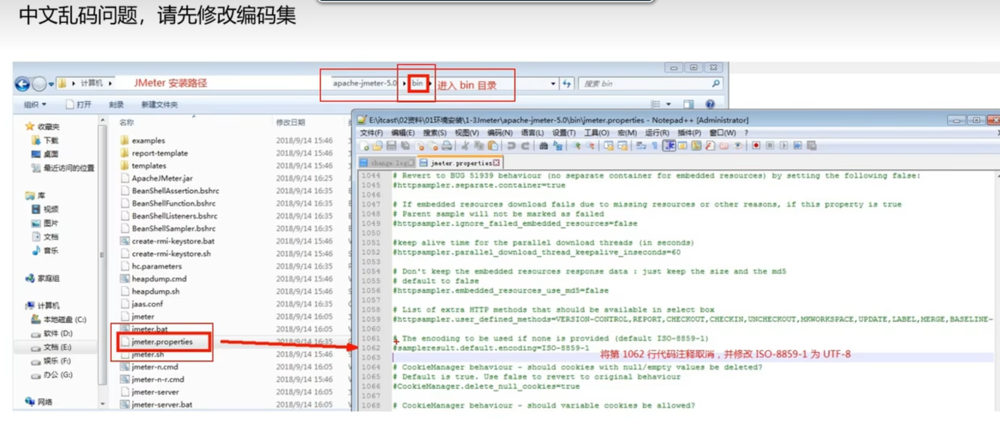

RESTful

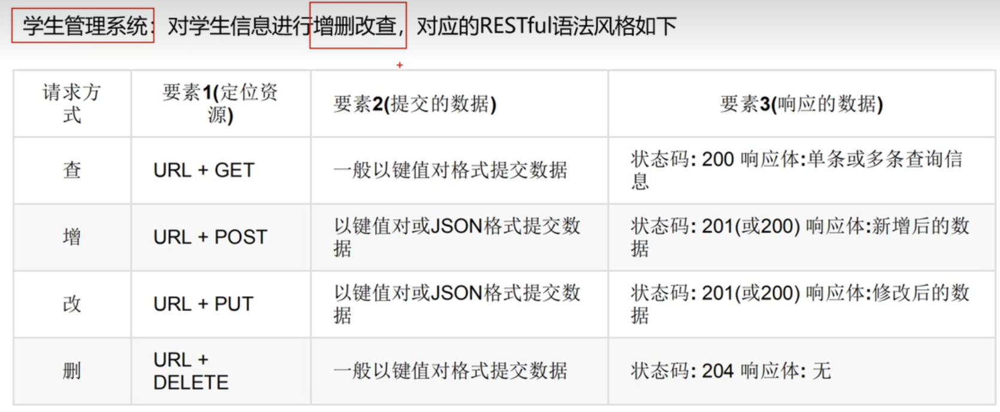

#### 线程组

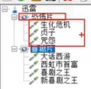

##### 并发或顺序

并发执行（默认）

顺序执行：勾选独立执行线程组

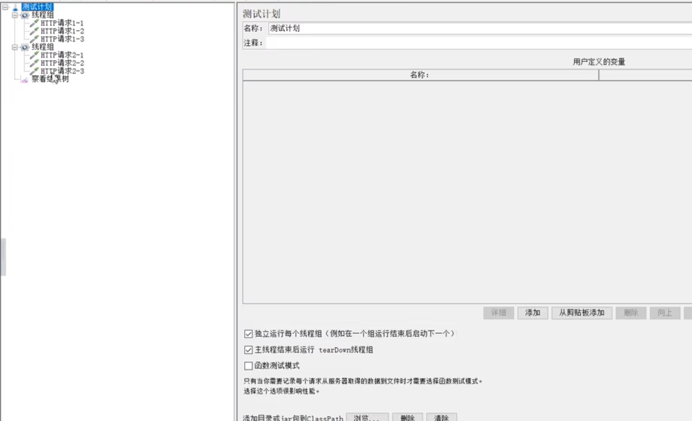

setup线程组：最优先执行的线程

tearDown线程组：最后执行线程组

##### 重要参数

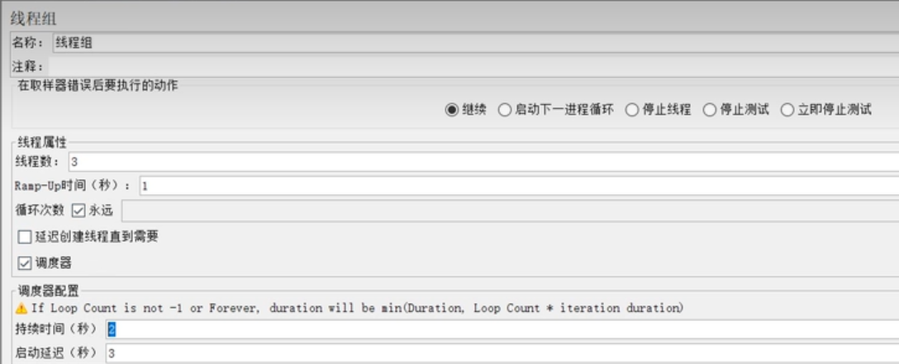

线程数，循环数，调度器：持续时间，启动延时，ramp-up（在设置的时间结束的时候,启动多少个线程数）

##### http默认配置

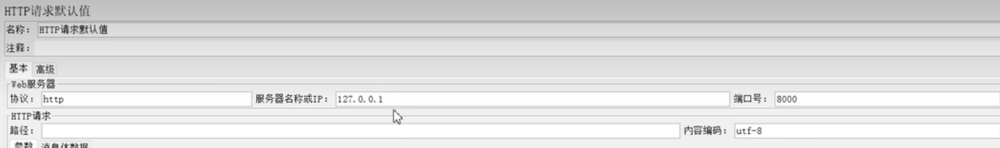

##### http消息头

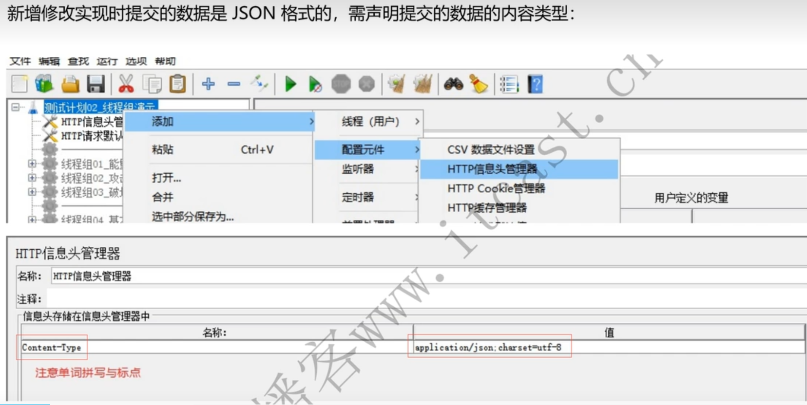

##### csv批量添加

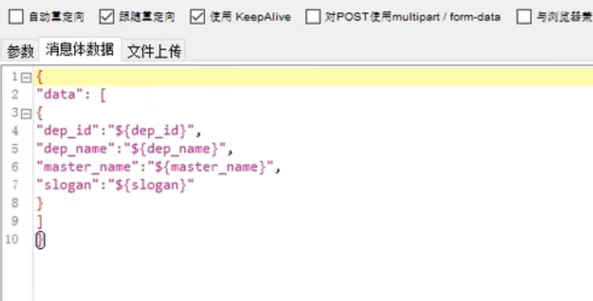

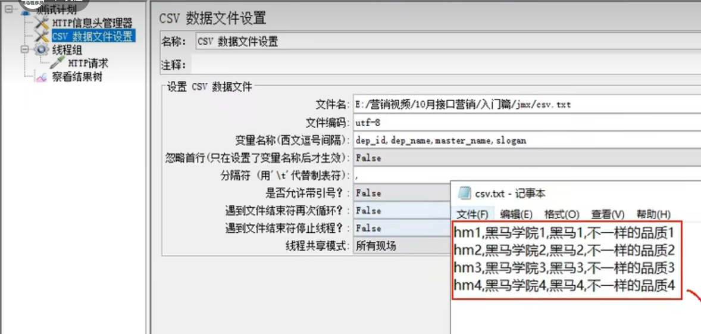

##### 响应断言

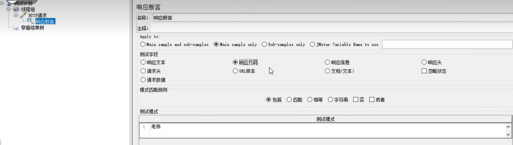

#### 自动化测试

##### 测试数据准备⭐️

1）有效，无效等价类配合边界值；

> 有效能够输入，左边界，中间，右边界
>
> 无效：21位

2）特殊情况；

> 非数字：中文，空格等

3）组合情况

> 一整条数据（4个字段）比如：3个字段填，最后一个字段不填，可以插入 成功

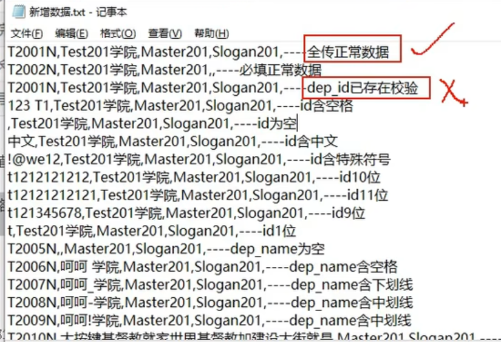

##### csv配置

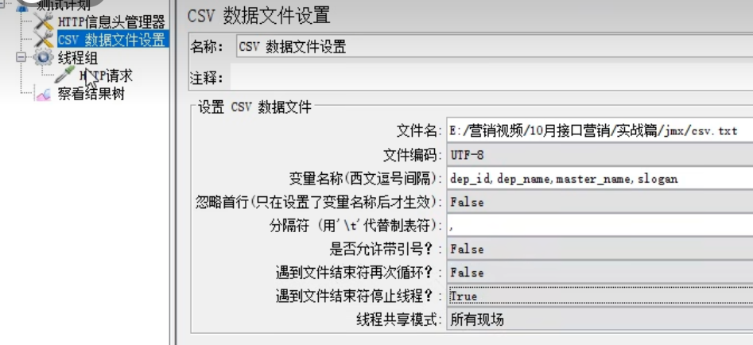

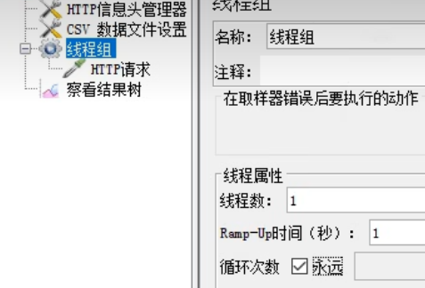

**最基本的增改查删（先增后删，自动化脚本就不会产生垃圾数据）**

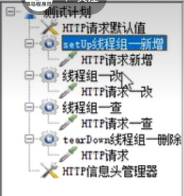

改的id，从新增的id用正则表达式提取id

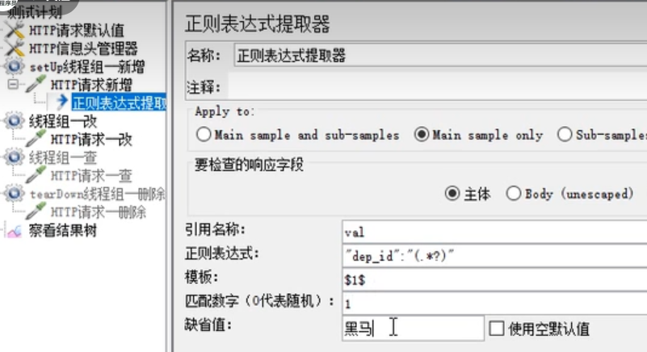

保存到全局变量

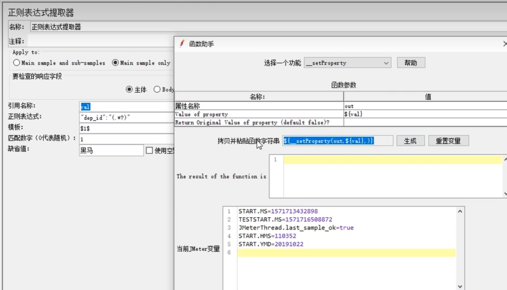

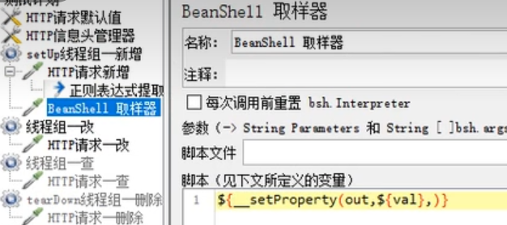

拿到全局变量out

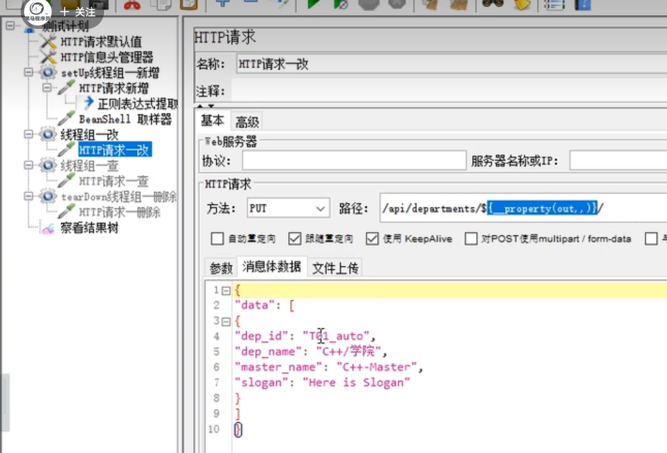

测试完，写测试报告；

结果汇总，提交Bug 


#### 性能测试

##### 上传图片测试

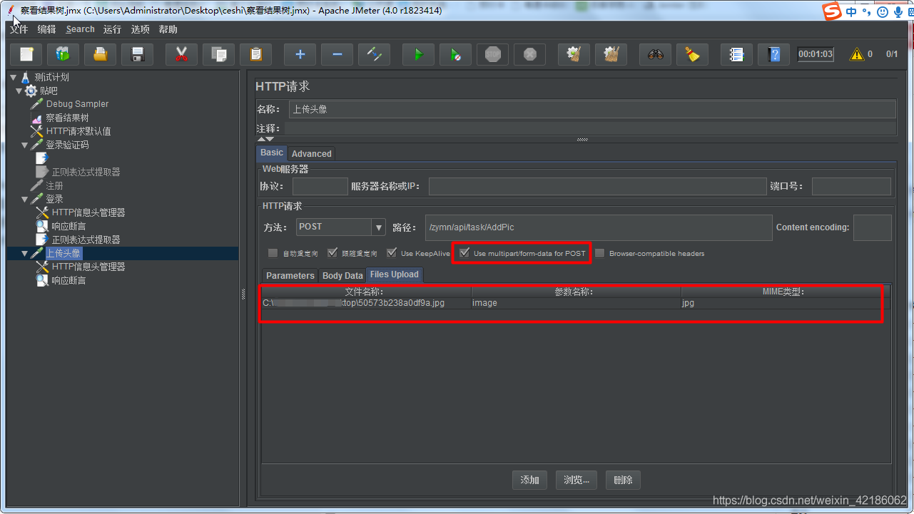

##### 弱压力


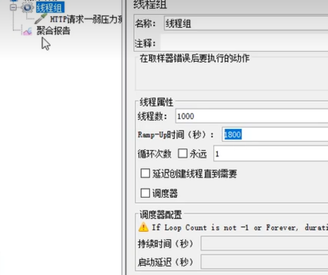

##### 高并发


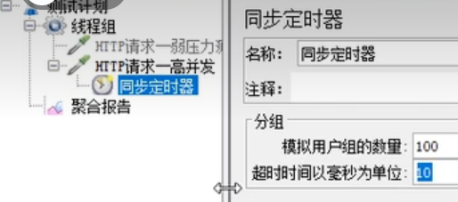

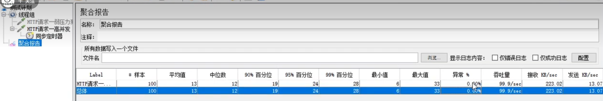

##### 高频率


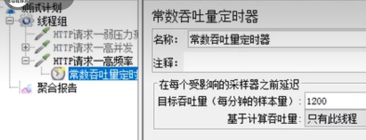

> 20QPS，每分钟 =20x60=1200

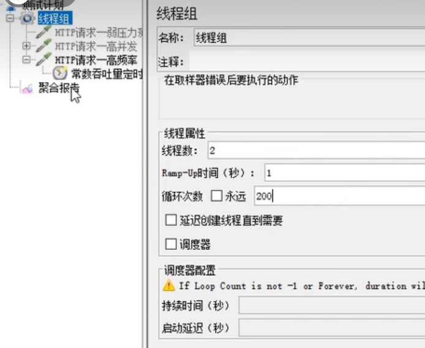

> 20QPS，20x10s=200次


#### Appium（手机端）

*跨平台的测试自动化工具*

1）C/S架构：Appium 的核心是一个 web 服务器

2）Session：自动化始终围绕一个session进行

3）Desired capabilities 是一些键值对的集合 (比如，一个 map 或者 hash），客户端将这些键值对发给服务端，告诉服务端我们想要怎么测试。

4）支持多种语言
