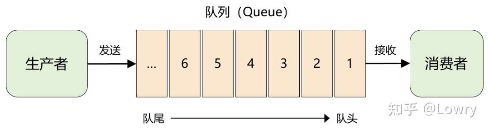
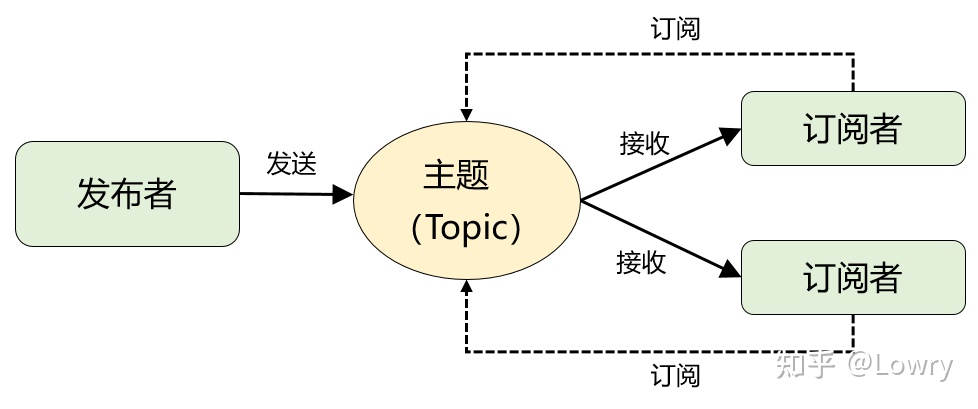
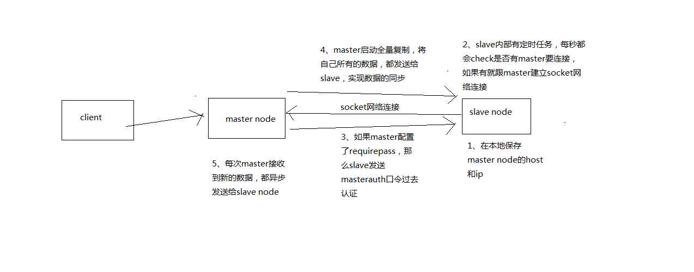
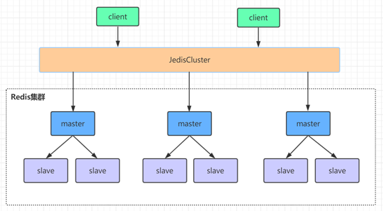

# 1、分布式系统

分布式存储系统，hadoop hdfs，分布式计算系统，hadoop mapreduce，spark，分布式流式计算系统，storm。

分布式业务系统，把原来用java开发的一个大块系统，给拆分成多个子系统，多个子系统之间互相调用，形成一个大系统的整体。假设原来你做了一个OA系统，里面包含了权限模块、员工模块、请假模块、财务模块，一个工程，里面包含了一堆模块，模块与模块之间会互相去调用，1台机器部署。

现在如果你把他这个系统给拆开，权限系统，员工系统，请假系统，财务系统，4个系统，4个工程，分别在4台机器上部署

一个请求过来，完成这个请求，这个员工系统，调用权限系统，调用请假系统，调用财务系统，4个系统分别完成了一部分的事情，最后4个系统都干完了以后，才认为是这个请求已经完成了。

## **1.1 为什么要进行系统拆分？**

（1）为什么要进行系统拆分？

1）要是不拆分，一个大系统几十万行代码，20个人维护一份代码，简直是悲剧啊。代码经常改着改着就冲突了，各种代码冲突和合并要处理，非常耗费时间；经常我改动了我的代码，你调用了我，导致你的代码也得重新测试，麻烦的要死；然后每次发布都是几十万行代码的系统一起发布；而且如果我现在打算把技术升级到最新的spring版本，还不行，因为这可能导致你的代码报错，我不敢随意乱改技术。

2）拆分了以后，整个世界清爽了，几十万行代码的系统，拆分成20个服务；平均每个服务就1~2万行代码，每个服务部署到单独的机器上。20个工程，20个git代码仓库里，20个码农，每个人维护自己的那个服务就可以了，是自己独立的代码，跟别人没关系。再也没有代码冲突了，爽。每次就测试我自己的代码就可以了，爽。每次就发布我自己的一个小服务就可以了，爽。技术上想怎么升级就怎么升级，保持接口不变就可以了，爽。

（本质：低耦合高内聚）但是同时，也要提醒的一点是，系统拆分成分布式系统之后，大量的分布式系统面临的问题

（2）如何进行系统拆分？

（拆很多次）系统拆分分布式系统，拆成多个服务，拆成微服务的架构，拆很多轮的。上来一个架构师第一轮就给拆好了，第一轮；团队继续扩大，拆好的某个服务，刚开始是1个人维护1万行代码，后来业务系统越来越复杂，这个服务是10万行代码，5个人；第二轮，1个服务 -> 5个服务，每个服务2万行代码，每人负责一个服务。<=3个人维护这个服务。后面如果系统更复杂了，可以继续分拆。

我个人建议，一个服务的代码不要太多，1万行左右，两三万撑死了吧。

（3）拆分后不用dubbo可以吗？

当然可以了，大不了最次，就是各个系统之间，直接基于spring mvc，就纯http接口互相通信呗，还能咋样。但是这个肯定是有问题的，因为http接口通信维护起来成本很高，你要考虑**超时重试、负载均衡**等等各种乱七八糟的问题，比如说你的**订单系统调用商品系统，商品系统部署了5台机器，你怎么把请求均匀地甩给那5台机器**？这不就是负载均衡？
所以dubbo说白了，是一种rpc框架，就是本地进行接口调用，但是dubbo会代理这个调用请求，跟远程机器网络通信，给你处理掉负载均衡了、服务实例上下线自动感知了、超时重试了。

（4）dubbo和thrift有什么区别呢？

1、性能方面：Socket>Thrift>Dubbo
 2、易用性方面：Dubbo是一个**完整的服务治理框架，**本身通过Zookeeper提供负载均衡，通过Netty进行基础通讯，易用、管理配置都方便
 3、开发效率：Dubbo > Thrift > Socket

## **1.2 分布式服务框架**

dubbo


# 2、高并发架构

## 2.1如何设计一个高并发系统？

- （1）系统拆分，将一个系统拆分为多个子系统，用**dubbo**来搞。然后每个系统连一个数据库，这样本来就一个库，现在多个数据库，不也可以抗高并发么。

- （2）缓存(redis，本地缓存)，必须得用缓存。大部分的高并发场景，都是**读多写少**，那你完全可以在数据库和缓存里都写一份，然后读的时候大量走缓存不就得了。毕竟人家redis轻轻松松单机几万的并发啊。没问题的。所以你可以考虑考虑你的项目里，那些承载主要请求的读场景，怎么用缓存来抗高并发。

- （3）MQ，必须得用MQ。可能你还是会出现高并发写的场景，比如说一个业务操作里要**频繁增删改**增删改，疯了。那高并发绝对搞挂你的系统，你要是用redis来承载写那肯定不行，人家是缓存，数据随时就被LRU了，数据格式还无比简单，没有事务支持。所以该用mysql还得用mysql啊。那你咋办？用MQ吧，大量的写请求灌入MQ里，排队慢慢玩儿，后边系统消费后慢慢写，控制在mysql承载范围之内。所以你得考虑考虑你的项目里，那些承载复杂写业务逻辑的场景里，如何用MQ来异步写，提升并发性。MQ单机抗几万并发也是ok的，这个之前还特意说过。

- （4）分库分表，可能到了最后数据库层面还是免不了抗高并发的要求，好吧，那么就将一个数据库拆分为多个库，多个库来抗更高的并发；然后将一个表拆分为多个表，每个表的数据量保持少一点，提高sql跑的性能。

- （5）读写分离，这个就是说大部分时候数据库可能也是**读多写少**，没必要所有请求都集中在一个库上吧，可以搞个主从架构，主库写入，从库读取，搞一个读写分离。读流量太多的时候，还可以加更多的从库。

- （6）Elasticsearch，可以考虑用es。es是分布式的，可以随便扩容，分布式天然就可以支撑高并发，因为动不动就可以扩容加机器来抗更高的并发。那么一些比较简单的**查询、统计类**的操作，可以考虑用es来承载，还有一些**全文搜索类**的操作，也可以考虑用es来承载。


> 说句实话，真正厉害的不是在于弄明白一些技术，或者大概知道一个高并发系统应该长什么样？实际上在真正的复杂的业务系统里，做高并发要远远比我这个图复杂几十倍到上百倍。你需要考虑，哪些需要分库分表，哪些不需要分库分表，单库单表跟分库分表如何join，哪些数据要放到缓存里去啊，放哪些数据再可以抗掉高并发的请求，你需要完成对一个复杂业务系统的分析之后，然后逐步逐步的加入高并发的系统架构的改造

##  2.2消息队列

https://mp.weixin.qq.com/s/1Dwu2Z8Lv88e_Mp1ne7XLg

### 2.2.1 为什么要用消息队列？（优点）

（面试官问你这个问题，期望的一个回答是说，你们公司有个什么业务场景，这个业务场景有个什么技术挑战，如果不用MQ可能会很麻烦，但是你现在用了MQ之后带给了你很多的好处）

举个例子：下单系统


其实场景有很多，但是比较核心的有3个：解耦、异步、削峰

1）异步

> 因为 MQ 的引入，扣积分，扣优惠券，发短信这些步骤全部变成了异步执行，能减少订单支付的整体耗时，提升订单系统的吞吐量。

传统模式：

- 一些非必要的业务逻辑以同步的方式运行，太耗费时间。

中间件模式：

- 将消息写入消息队列，非必要的业务逻辑以异步的方式运行，加快响应速度

**异步，那为什么不用多线程？**

因为用线程去做，你是不是要写代码？扣积分，扣优惠券，发短信，扣库存。。。等等这么多业务要调用这么多的接口，如果MQ就可以达到解耦的目的。

2）解耦：

> 引入 MQ 后，订单支付现在只需要关注它最重要的流程：更新订单状态即可。其他不重要的事情全部交给 MQ 来通知。这便是 MQ 解决的最核心的问题：系统解耦。

传统模式：

- 画图，系统间耦合性太强，A系统发送个数据到BC两个系统，接口调用发送，如果还有D系统接入，系统A还需要修改代码，或者B系统不需要了，也要修改代码，过于麻烦！

中间件模式：

- 将消息写入消息队列，需要消息的系统自己从消息队列中订阅，从而系统A不需要做任何修改。

> 面试技巧：你需要去考虑一下你负责的系统中是否有类似的场景，就是一个系统或者一个模块，调用了多个系统或者模块，互相之间的调用很复杂，维护起来很麻烦。但是其实这个调用是不需要直接同步调用接口的，如果用MQ给他异步化解耦

3）削峰

传统模式：

- 并发量大的时候（5000QPS），所有的请求直接怼到数据库，造成数据库连接异常（数据库直接打死）

中间件模式：

- 系统A慢慢的按照数据库能处理的并发量（2000QPS），从消息队列中慢慢拉取消息。在生产中，这个短暂的高峰期积压是允许的。

4）我们还可以利用队列本身的顺序性，来满**足消息必须按顺序投递**的场景；利用队列 + 定时任务来实现消息的**延时消费** **，日志处理**，**消息通讯（聊天室）**……

**缺点：**

**系统可用性降低**:你想啊，本来其他系统只要运行好好的，那你的系统就是正常的。现在你非要加个消息队列进去，那**消息队列挂了**，你的系统不是呵呵了。因此，系统可用性降低

**系统复杂性增加**:要多考虑很多方面的问题，比如**一致性问题（如何保证消息不被重复消费，如何保证消息丢失，消息的顺序性**。因此，需要考虑的东西更多，系统复杂性增大。

### 2.2.2 kafka、activemq、rabbitmq、rocketmq都有什么区别？（**技术选型**）


一般的业务系统要引入MQ，最早大家都用ActiveMQ，但是现在确实大家用的不多了，没经过大规模吞吐量场景的验证，社区也不是很活跃，所以大家还是算了吧，我个人不推荐用这个了；

后来大家开始用RabbitMQ，但是确实erlang语言阻止了大量的java工程师去深入研究和掌控他，对公司而言，几乎处于不可控的状态，但是确实人是开源的，比较稳定的支持，活跃度也高；

不过现在确实越来越多的公司，会去用RocketMQ，确实很不错，但是我提醒一下自己想好社区万一突然黄掉的风险，对自己公司技术实力有绝对自信的，我推荐用RocketMQ，否则回去老老实实用RabbitMQ吧，人是活跃开源社区，绝对不会黄

 所以中小型公司，技术实力较为一般，技术挑战不是特别高，用RabbitMQ是不错的选择；大型公司，基础架构研发实力较强，用RocketMQ是很好的选择

如果是**大数据领域的实时计算、日志采集**等场景，用Kafka是业内标准的，绝对没问题，社区活跃度很高，绝对不会黄，何况几乎是全世界这个领域的事实性规范

### 2.2.3 如何保证高可用

（1）rabbitMQ

rabbitmq有三种模式：单机模式，普通集群模式，镜像集群模式
 1）单机模式
 就是demo级别的，一般就是你本地启动了玩玩儿的，没人生产用单机模式。
 2）普通集群模式


3）镜像集群模式
 

（2）kafkaMQ


Kafka是一种纯分布式的中间件。

**一个topic分为多个partion，有多台机器分摊**。Topic在逻辑上可以被认为是一个queue队列，每条消息都必须指定它的topic，为 了使得Kafka的吞吐率可以水平扩展，物理上把topic分成一个或多个partition。

某一台机器宕机了，数据会丢失topic的1/3，那怎么保证高可用？

kafka 0.8以后，提供了HA机制，就是replica副本机制。每个partition的数据都会同步到其他机器上，形成自己的多个replica副本。然后所有replica会选举一个leader出来，那么生产和消费都跟这个leader打交道，然后其他replica就是follower。写的时候，leader会负责把数据同步到所有follower上去，读的时候就直接读leader上数据即可。**只能读写leader**？很简单，要是你可以随意读写每个follower，那么就要care数据一致性的问题，系统复杂度太高，很容易出问题。kafka会均匀的将一个partition的所有replica分布在不同的机器上，这样才可以提高容错性。

写数据的时候，生产者就写leader，然后leader将数据落地写本地磁盘，接着其他follower自己主动从leader来pull数据。一旦所有follower同步好数据了，就会发送ack给leader，leader收到所有follower的ack之后，就会返回写成功的消息给生产者。（当然，这只是其中一种模式，还可以适当调整这个行为）

消费的时候，只会从leader去读，但是只有一个消息已经被所有follower都同步成功返回ack的时候，这个消息才会被消费者读到。

### 2.2.4 重复消费

（1）如何保证消息不被重复消费啊（如何保证消息消费时的幂等性）？

MQ都可能存在消息重复消费


怎么保证幂等性？

> 幂等性，我通俗点说，就一个数据，或者一个请求，给你重复来多次，你得确保对应的数据是不会改变的，不能出错。


（1）比如你拿个数据要**写库，你先根据主键**查一下，如果这数据都有了，你就别插入了，update一下好吧

（2）比如你是**写redis**，那没问题了，反正每次都是set，天然幂等性

 （3）比如你不是上面两个场景，那做的稍微复杂一点，你需要让生产者发送每条数据的时候，里面加一个全局唯一的id，类似订单id之类的东西，然后你这里消费到了之后，先根据这个id去**比如redis或者内存Map里查一下**，之前消费过吗？如果没有消费过，你就处理，然后这个id写redis。如果消费过了，那你就别处理了，保证别重复处理相同的消息即可。

（4）有比如基于**数据库的唯一键**来保证重复数据不会重复插入多条，我们之前线上系统就有这个问题，就是拿到数据的时候，每次重启可能会有重复，因为**kafka消费者还没来得及提交offset**，重复数据拿到了以后我们插入的时候，因为**有唯一键约束了，所以重复数据只会插入报错，不会导致数据库中出现脏数据**

### 2.2.5 消息丢失

（1）rabbitmq


1）生产者弄丢了数据

生产者将数据发送到rabbitmq的时候，可能数据就在半路给搞丢了，**因为网络啥的问题，都有可能**。

- 此时可以选择用rabbitmq提供的**事务功能（同步阻塞）**，就是生产者发送数据之前开启rabbitmq事务（channel.txSelect），然后发送消息，如果消息没有成功被rabbitmq接收到，那么生产者会收到异常报错，此时就可以回滚事务（channel.txRollback），然后重试发送消息；如果收到了消息，那么可以提交事务（channel.txCommit）。但是问题是，rabbitmq事务机制一搞，基本上**吞吐量会下来，因为太耗性能**。

- 所以一般来说，如果你要确保说写rabbitmq的消息别丢，可以**开启confirm模式（异步，推荐）**，在生产者那里设置开启confirm模式之后，你每次写的消息都会分配一个唯一的id，
  然后如果写入了rabbitmq中，rabbitmq会给你回传一个ack消息，告诉你说这个消息ok了。
  如果rabbitmq没能处理这个消息，会回调你一个nack接口，告诉你这个消息接收失败，你可以重试。而且你可以结合这个机制自己在内存里维护每个消息id的状态，如果超过一定时间还没接收到这个消息的回调，那么你可以重发。

2）rabbitmq弄丢了数据

就是rabbitmq自己弄丢了数据，这个你**必须开启rabbitmq的持久化**，就是消息写入之后会持久化到磁盘，哪怕是rabbitmq自己挂了，会自动读取之前存储的数据进行恢复，一般数据不会丢。除非极其罕见的是，rabbitmq**还没持久化，自己就挂了**，可能导致少量数据会丢失的，但是这个概率较小。

设置持久化有两个步骤，**第一个是创建queue的时候将其设置为持久化的**，这样就可以保证rabbitmq**持久化queue的元数据，但是不会持久化queue里的数据**；第二个是发送消息的时候**将消息的deliveryMode设置为2**，就是**将消息设置为持久化**的，此时rabbitmq就会将消息持久化到磁盘上去。必须要同时设置这两个持久化才行，rabbitmq哪怕是挂了，再次重启，也会从磁盘上重启恢复queue，恢复这个queue里的数据。

而且持久化可以跟生产者那边的confirm机制配合起来，**只有消息被持久化到磁盘之后，才会通知生产者ack了**，所以哪怕是在持久化到磁盘之前，rabbitmq挂了，数据丢了，生产者收不到ack，你也是可以自己重发的。

哪怕是你给rabbitmq开启了持久化机制，也有一种可能，就是这个消息写到了rabbitmq中，但是还没来得及持久化到磁盘上，结果不巧，此时rabbitmq挂了，就会导致内存里的一点点数据会丢失。

3）消费端弄丢了数据

刚消费到，还没处理，结果进程挂了，比如重启了，那么就尴尬了，rabbitmq认为你都消费了，这数据就丢了。

这个时候得用rabbitmq提供的ack机制，简单来说，就是你**关闭rabbitmq自动ack**，可以通过一个api来调用就行，然后**将消息消费并处理完再ack**。这样的话，如果你还没处理完，不就没有ack？那rabbitmq就认为你还没处理完，这个时候rabbitmq会把这个消费分配给别的consumer去处理，消息是不会丢的。

（2）kafka


1）消费端弄丢了数据

跟rabbitmq一样的

2）kafka弄丢了数据

这块比较常见的一个场景，就是kafka某个broker宕机，然后重新选举partiton的leader时。大家想想，要是此时其他的follower刚好还有些数据没有同步，结果此时leader挂了，然后选举某个follower成leader之后，他不就少了一些数据？这就丢了一些数据啊。

生产环境也遇到过，我们也是，之前kafka的leader机器宕机了，将follower切换为leader之后，就会发现说这个数据就丢了

所以此时一般是要求起码设置如下4个参数：

给这个**topic**设置replication.factor参数：这个值必须**大于1**，要求每个partition必须有至少2个副本

在kafka服务端设置min.insync.replicas参数：这个值必须**大于1**，这个是要求**一个leader**至少感知到有至少**一个follower**还跟自己保持联系，没掉队，这样才能确保leader挂了还有一个follower吧

在producer端设置acks=all：这个要求每条数据，必须是**写入所有leader并同步到所有follwer，才能认为是写成功了**

在producer端设置retries=MAX（很大很大很大的一个值，无限次重试的意思）：这个是要求一旦写入失败，就无**限重试**，卡在这里了

我们生产环境就是按照上述要求配置的，这样配置之后，至少在kafka broker端就可以保证在leader所在broker发生故障，进行leader切换时，数据不会丢失

3）生产者会不会弄丢数据

如果按照上述的思路**设置了ack=all**，一定不会丢，要求是，你的leader接收到消息，所有的follower都同步到了消息之后，才认为本次写成功了。如果没满足这个条件，生产者会自动不断的重试，重试无限次。

### 2.2.6 怎么保证消息的顺序性

先看看顺序会错乱的俩场景

（1）rabbitmq：一个queue，多个consumer，这不明显乱了


（2）kafka：一个topic，一个partition，一个consumer，内部多线程，这不也明显乱了


那如何保证消息的顺序性呢？简单简单

（1）rabbitmq：**拆分多个queue，每个queue一个consumer**，就是多一些queue而已，确实是麻烦点；或者就一个queue但是对应一个consumer，然后这个consumer内部用内存队列做排队，然后分发给底层不同的worker来处理


（2）kafka：一个topic，一个partition，一个consumer，内部单线程消费，写N个内存queue，然后**N个线程分别消费同一个内存queue**即可


### 2.2.7 消息满了，怎么办？

（1）有几百万消息**持续积压几小时**，说说怎么解决？


一般这个时候，只能操作临时紧急扩容了，具体操作步骤和思路如下：

1）先**修复consumer的问题**，确保其恢复消费速度，然后将现有cnosumer都停掉

2）新建一个topic，**partition**是原来的10倍，临时建立好原先10倍或者20倍的**queue**数量

3）然后写一个临时的分发数据的consumer程序，这个程序部署上去消费积压的数据，消费之后**不做耗时的处理**，**直接均匀轮询写入**临时建立好的10倍数量的queue

4）接着临时**征用10倍的机器来部署consumer**，每一批consumer消费一个**临时queue**的数据，这种做法相当于是临时将queue资源和consumer资源扩大10倍，以正常的10倍速度来消费数据

5）等快速消费完积压数据之后，**得恢复原先部署架构**，重新用原先的consumer机器来消费消息

（2）如何解决消息队列的**延时以及过期失效**问题？

假设你用的是rabbitmq，rabbitmq是可以**设置过期时间（线上是不会设置）**的，就是TTL，如果消息在queue中积压超过一定的时间就会被rabbitmq给清理掉，这个数据就没了。那这就是第二个坑了。这就不是说数据会大量积压在mq里，而是大量的数据会直接搞丢。

这个情况下，就不是说要增加consumer消费积压的消息，因为实际上没啥积压，而是**丢了大量的消息**。我们可以采取一个方案，就**是批量重导**，这个我们之前线上也有类似的场景干过。就是大量积压的时候，我们当时就直接丢弃数据了，然后等过了高峰期以后，比如大家一起喝咖啡熬夜到晚上12点以后，用户都睡觉了。

这个时候我们就开始写程序，**将丢失的那批数据，写个临时程序，一点一点的查出来**，然后重新灌入mq里面去，把白天丢的数据给他补回来。也只能是这样了。

假设1万个订单积压在mq里面，没有处理，其中1000个订单都丢了，你只能手动写程序把那1000个订单给查出来，手动发到mq里去再补一次。

（3）如果走的方式是消息积压在mq里，那么如果你很长时间都没处理掉，此时**导致mq都快写满了**，咋办？这个还有别的办法吗？

没有，谁让你第一个方案执行的太慢了，你临时写程序，接入数据来消费，消费一个丢弃一个，都不要了，快速消费掉所有的消息。然后走第二个方案，到了晚上再补数据吧。

### 2.2.8 如何设计消息中间件

**1.原始模型的进化**

**1）队列模型**

「一发一存一消费」



它允许多个生产者往同一个队列发送消息。但是，如果有多个消费者，实际上是竞争的关系，也就是一条消息只能被其中一个消费者接收到，读完即被删除。

**2）发布-订阅模型**

如果需要将一份消息数据分发给多个消费者，并且每个消费者都要求收到全量的消息。很显然，队列模型无法满足这个需求。

一个可行的方案是：为每个消费者创建一个单独的队列，让生产者发送多份。这种做法比较笨，而且同一份数据会被复制多份，也很浪费空间。

为了解决这个问题，就演化出了另外一种消息模型：发布-订阅模型。



仔细对比下它和 “队列模式” 的异同：生产者就是发布者，队列就是主题，消费者就是订阅者，无本质区别。**唯一的不同点在于：一份消息数据是否可以被多次消费。**

**3）小结**

上面两种模型说白了就是：单播和广播的区别

这也解释了为什么现代主流的 RocketMQ、Kafka 都是直接基于发布-订阅模型实现的？此外，RabbitMQ 中之所以有一个 Exchange 模块？其实也是为了解决消息的投递问题，可以变相实现发布-订阅模型。

**2.如何设计**

（1）首先这个mq得支持**可伸缩性**吧，就是需要的时候快速扩容，就可以增加吞吐量和容量，那怎么搞？设计个分布式的系统呗，参照一下kafka的设计理念，broker -> topic -> partition，每个partition放一个机器，就存一部分数据。如果现在资源不够了，简单啊，给topic增加partition，然后做数据迁移，增加机器，不就可以存放更多数据，提供更高的吞吐量了？

（2）其次你得考虑一下这个**mq的数据要不要落地磁盘吧**？那肯定要了，落磁盘，才能保证别进程挂了数据就丢了。那落磁盘的时候怎么落啊？**顺序写，这样就没有磁盘随机读写的寻址开销**，磁盘顺序读写的性能是很高的，这就是kafka的思路。

（3）其次你考虑一下你的mq的**可用性**啊？这个事儿，具体参考我们之前可用性那个环节讲解的kafka的高可用保障机制。**多副本** -> leader & follower -> broker挂了重新选举leader即可对外服务。

（4）能不能支持**数据0丢失**啊？可以的，参考我们之前说的那个kafka数据零丢失方案。

### 2.2.9 深挖

能挑着你熟悉的一个mq一直问到源码级别非常底层。我还可能会结合项目来仔细问，我可能会先让你给我详细说说你的业务细节，然后将你的业务跟这些mq的问题场景结合起来，看看你每个细节是怎么处理的。

如果你碰到人家在7个问题之外还死扣着你问的，那你最好是认一下怂，就说你确实没研究那么深过。

> 最后说一个技巧，要是确实碰一个面试官连这7个问题都没问满，只要他提到mq，你自己就和盘托出一整套的东西，你就说，mq你们之前遇到过什么问题，巴拉巴拉，你们的方案是什么，自己突出自己会的东西

## **2.3** **搜索引擎**


### 2.3.4 （数十亿级别）数据量很大，如何提高查询/搜索性能

第一次搜索的时候，是5~10秒，后面再搜索反而就快了，可能就几百毫秒。

**（1）os cache**

es的搜索引擎严重依赖于底层的filesystem cache，你如果**给filesystem cache更多的内存**，尽量让内存可以容纳所有的index segment file索引数据文件，那么你搜索的时候就基本都是走内存的，性能会非常高。

> 之前很多的测试和压测，如果走磁盘一般肯定上秒，搜索性能绝对是秒级别的，1秒，5秒，10秒。但是如果是走filesystem cache，是走纯内存的，基本上就是毫秒级的

案例：

写入es的数据小于等于，或者是略微大于es的filesystem cache的内存容量

ES+HBase：从es中**根据name和age(几个关键字段)去搜索**，拿到的结果可能就20个doc id，然后根据doc id到hbase,mysql里去查询每个doc id对应的完整的数据，给查出来，再返回给前端。（类似垂直拆分）

**（2）数据预热**

es集群中每个机器写入的数据量还是超过了filesystem cache一倍。

> 比如说你写入一台机器60g数据，结果filesystem cache就30g，还是有30g数据留在了磁盘上。

方法：对热数据（微博大V，秒杀商品），每隔一段时间提前访问一下，让数据进入os cache里面去。

**（3）冷热分离**

将大量的访问很少，频率很低的数据，单独写一个索引，然后将访问很频繁的热数据单独写一个索引。（类似水平拆分）

> 确保热数据在被预热之后，尽量都让他们留在filesystem os cache里，别让冷数据给冲刷掉。
>
> 热数据可能就占总数据量的10%，几乎全都保留在filesystem cache

**（4）document模型设计**

订单表：id order_code total_price

订单条目表：id order_id goods_id purchase_count price

select * from order join order_item on order.id=order_item.order_id where order.id=1

> es里面的复杂的关联查询，复杂的查询语法，尽量别用，一旦用了性能一般都不太好

写入es的时候，搞成两个索引，order索引，orderItem索引

写入es的java系统里，就完成关联，将关联好的数据直接写入es中，搜索的时候，就不需要利用es的搜索语法去完成join来搜索了

**（5）分页性能优化**

**3种查询方式**

1）From + Size 

假如你每页是10条数据，你现在要查询第100页。

分布式的，你要查第100页的10条数据，你是不可能说从5个shard，每个shard就查2条数据，最后到协调节点合并成10条数据？

> 实际上是会把每个shard上存储的前1000条数据都查到一个协调节点上，如果你有个5个shard，那么就有5000条数据，接着协调节点对这5000条数据进行一些合并、处理，再获取到最终第100页的10条数据。

翻页的时候，翻的越深，每个shard返回的数据就越多，而且协调节点处理的时间越长。非常坑爹。所以用es做分页的时候，你会发现越翻到后面，就越是慢。

用es作分页，前几页就几十毫秒，翻到10页之后，几十页的时候，基本上就要5~10秒才能查出来一页数据了.

场景：10000以内，随机跳转不同分页

2）scroll API ：遍历全景数据。类似于app里的推荐商品不断下拉出来一页一页的。（ES不推荐）

类似于微博中，下拉刷微博，刷出来一页一页的，你可以用scroll api。

scroll会一次性给你**生成所有数据的一个快照**，然后每次翻页就是通过游标移动，获取下一页下一页这样子，性能会比上面说的那种分页性能也高很多很多。无论翻多少页，性能基本上都是毫秒级的。

场景：需要遍历全量数据 。

缺点：如果遍历过程中插入新的数据，是查询不到的。 并且保留上下文需要足够的堆内存空间。

3）PIT + search_after（推荐）

PIT：保障搜索过程中保留特定事件点的索引状态，能有效保障数据的一致性。

search_after 参数使用上一页中的一组排序值来检索下一页的数据。

场景：**仅支持向后翻页**的场景及超过Top 10000 数据需要分页场景

- **业务层面优化**

1）增加默认的筛选条件

2）小范围跳页

3）滚动条增量显示

### 2.3.5 ES生产集群的部署架构

部署架构

每个索引的数据量大概有多少？

每个索引大概有多少个分片？

（1）es生产集群部署了5台机器，每台机器是6核64G的，集群总内存是320G

（2）es集群的日增量数据大概是2000万条，每天日增量数据大概是500MB，每月增量数据大概是6亿，15G。目前系统已经运行了几个月，现在es集群里数据总量大概是100G左右。

（3）目前线上有5个索引（这个结合你们自己业务来，看看自己有哪些数据可以放es的），每个索引的数据量大概是20G，所以这个数据量之内，我们每个索引分配的是8个shard，比默认的5个shard多了3个shard。

### 2.3.6 继续深挖

其实如果我是面试官的话，我如果感觉你都把刚才那些问题都答出来了，我可能会继续刨根问底，深挖，问你，直到把你给问倒

消息队列，kafka，复制的底层原理，leader选举的算法，增加partition以后的rebalance算法，扣很多很多的细节，如何优化kafka写入的吞吐量

其实这块如果挖深了可以问的极其深，如果是我来深挖，可能会挖到es底层的相关度评分算法（TF/IDF算法）、deep paging、上千万数据批处理、跨机房多集群同步、搜索效果优化，等等吧，很多的实际生产问题。

## **2.4 缓存**

### 2.4.1 缓存作用，存在问题

（1）为什么用缓存？

> 高性能和高并发

**高性能**：mysql查出来一个结果，耗时600ms；写入缓存，通过一个key查出来一个value，2ms。

**高并发**：mysql单机支撑到2000qps。缓存功能简单，就是key-value式操作，单机支撑的并发量轻松一秒几万十几万。

具体场景：


（2）用了缓存之后会有啥不良的后果？

1）缓存雪崩

2）缓存穿透／击穿

3）缓存与数据库双写不一致

4）缓存并发竞争

### 2.4.3 redis和memcached有啥区别

1）Redis支持服务器端的数据操作：Redis相比Memcached来说，拥有更多的数据结构和并支持更丰富的数据操作，通常在Memcached里，你需要将数据拿到客户端来进行类似的修改再set回去。这大大增加了网络IO的次数和数据体积。在Redis中，这些复杂的操作通常和一般的GET/SET一样高效。所以，如果需要缓存能够支持更复杂的结构和操作，那么Redis会是不错的选择。

2）内存使用效率对比：使用简单的key-value存储的话，Memcached的内存利用率更高，而如果Redis采用hash结构来做key-value存储，由于其组合式的压缩，其内存利用率会高于Memcached。

3）性能对比：由于Redis只使用单核，而Memcached可以使用多核，所以平均每一个核上Redis在存储小数据时比Memcached性能更高。而在100k以上的数据中，Memcached性能要高于Redis，虽然Redis最近也在存储大数据的性能上进行优化，但是比起Memcached，还是稍有逊色。

4）集群模式：memcached没有原生的集群模式，需要依靠客户端来实现往集群中分片写入数据；但是redis目前是原生支持cluster模式的，redis官方就是支持redis cluster集群模式的，比memcached来说要更好

### 2.4.2 redis单线程模型（反而效率高？）


> 1）redis基于reactor模式开发了网络事件处理器，这个处理器叫做文件事件处理器，file event handler。这个文件事件处理器，是单线程的，redis才叫做单线程的模型，采用IO多路复用机制同时监听多个socket，根据socket上的事件来选择对应的事件处理器来处理这个事件。
>
> 2）文件事件处理器的结构包含4个部分：多个socket，IO多路复用程序，文件事件分派器，事件处理器（命令请求处理器、命令回复处理器、连接应答处理器，等等）
>
> 3）事件处理器
>
> 如果是客户端要连接redis，那么会为socket关联连接应答处理器
>
> 如果是客户端要写数据到redis，那么会为socket关联命令请求处理器
>
> 如果是客户端要从redis读数据，那么会为socket关联命令回复处理器
>
> 4）客户端与redis通信的一次流程
>
> 在redis启动初始化的时候，redis会将连接应答处理器跟AE_READABLE事件关联起来，接着如果一个客户端跟redis发起连接，此时会产生一个AE_READABLE事件，然后由连接应答处理器来处理跟客户端建立连接，创建客户端对应的socket，同时将这个socket的AE_READABLE事件跟命令请求处理器关联起来。
>
> 当客户端向redis发起请求的时候（不管是读请求还是写请求，都一样），首先就会在socket产生一个AE_READABLE事件，然后由对应的命令请求处理器来处理。这个命令请求处理器就会从socket中读取请求相关数据，然后进行执行和处理。
>
> 接着redis这边准备好了给客户端的响应数据之后，就会将socket的AE_WRITABLE事件跟命令回复处理器关联起来，当客户端这边准备好读取响应数据时，就会在socket上产生一个AE_WRITABLE事件，会由对应的命令回复处理器来处理，就是将准备好的响应数据写入socket，供客户端来读取。
>
> 命令回复处理器写完之后，就会删除这个socket的AE_WRITABLE事件和命令回复处理器的关联关系。

1）纯内存操作

2）核心是基于非阻塞的IO多路复用机制

3）单线程反而避免了多线程的频繁上下文切换问题（百度）

### 2.4.3redis的数据类型，适用场景


### 2.4.4 过期策略，LRU


### 2.4.5 怎么保证高性能和高并发（精华）

#### 高并发

> 首先，你的底层的缓存中间件，缓存系统，必须能够支撑的起我们说的那种高并发，其次，再经过良好的整体的缓存架构的设计（多级缓存架构、热点缓存）
> 单机redis不能支撑高并发
>
> redis主从架构 -> 读写分离架构 -> 可支持水平扩展的读高并发架构

##### redis replication的核心机制

（1）redis采用**异步方式复制数据到slave节点**，不过redis 2.8开始，slave node会周期性地主动确认自己每次复制的数据量
（2）一个master node是可以配置多个slave node的
（3）slave node也可以连接其他的slave node
（4）slave node做复制的时候，是不会block master node的正常工作的
（5）slave node在做复制的时候，也不会block对自己的查询操作，它会**用旧的数据集来提供服务**; 但是复制完成的时候，需要删除旧数据集，加载新数据集，这个时候就会暂停对外服务了
（6）slave node主要用来进行**水平扩容，做读写分离**，扩容的slave node可以提高读的吞吐量

##### master持久化对于主从架构的安全保障的意义

第一个，如果采用了主从架构，那么建议必须开启master node的持久化！

master宕机，重启，是没有本地数据可以恢复的，然后就会直接认为自己IDE数据是空的，master就会将空的数据集同步到slave上去，所有slave的数据全部清空。

第二个，master的各种备份方案，要不要做，万一说本地的所有文件丢失了; 从备份中挑选一份rdb去恢复master; 这样才能确保master启动的时候，是有数据的

即使采用了后续讲解的高可用机制，slave node可以自动接管master node，但是也可能sentinal还没有检测到master failure，master node宕机之后很快就自动重启了，还是可能导致上面的所有slave node数据清空故障

##### 主从复制



（1）启动一个slave node的时候，仅仅保存master node的信息，包括master node的host和ip，但是复制流程没开始，master host和ip是从哪儿来的，redis.conf里面的slaveof配置的

（2）slave node会发送PSYNC命令，先与master建立socket连接

> 口令认证，如果master设置了requirepass，那么salve node必须发送masterauth的口令过去进行认证

（3）建立连接后，如果slave node第一次连接master node，那么会触发一次full resynchronization；如果slave node是重新连接master node，那么master node仅仅会复制给slave部分缺少的数据; 

> 全量复制：开始full resynchronization的时候，master会启动一个后台线程（bgsave），开始生成一份RDB快照文件，同时还会将从客户端收到的所有写命令先缓存在内存中。RDB文件生成完毕之后，master会将这个RDB发送给slave，slave（会清空旧数据），将rdb先写入本地磁盘，然后再从本地磁盘加载到内存中，同时会基于旧的数据对外提供服务。(master如果发现有多个slave node都来重新连接，仅仅会启动一个rdb save操作，用一份数据服务所有slave node。)，如果从节点还开启了 AOF，则还会进行 AOF 重写。整个过程是比较耗时的，需要尽可能避免全量复制。
> 增量复制：master node会在内存中常见一个**backlog**，master和slave都会保存一个**replica offset**，offset就是保存在backlog中的，slave每秒会上报自己offset给master。如果master和slave网络连接断掉了，slave会让master从上次的replica offset开始继续复制；但是如果没有找到对应的offset，那么就会执行一次全量复制
>
> PS：
>
> 1）rdb复制超时时间：repl-timeout 60，可以设置大一些
> 2）client-output-buffer-limit slave 256MB 64MB 60；如果在复制期间，内存缓冲区持续消耗超过64MB，或者一次性超过256MB，那么停止复制，复制失败。由于可能master写并发太高了
>
> 3）master run id在执行info server可以看到
>
> 由于master可能重启或者数据出现了变化，比如：从冷备RDB取20小时之前的一份备份恢复到master，此时master数据完全改变了，run id也变了。
> 那么slave node应该根据不同的run id区分，如果run id不同就做全量复制；否则就是增量
> PS：如果需要重启redis又不更改run id，可以使用redis-cli debug reload命令

（4）异步复制

master每次接收到写命令之后，先在内部写入数据，然后异步发送给slave node

##### 无磁盘化复制

master在内存中直接创建rdb，然后发送给slave，**不会在自己本地落地磁盘**了

repl-diskless-sync no
repl-diskless-sync-delay，等待一定时长再开始复制，因为要等更多slave重新连接过来

##### 过期key处理

**slave不会主动del过期key**，只会等待master过期key。如果master过期了一个key，或者通过LRU淘汰了一个key，那么会模拟一条del命令发送给slave。

### 高可用

> 在99.99%的时间内，系统可以对外提供服务就是高可用

redis：master宕机，不可用；master宕机，（哨兵）自动检测并在slave node中选举出master来实现高可用

背景：Redis 的主从复制模式，一旦主节点出现故障无法提供服务，需要人工介入手工将从节点调整为主节点，同时应用端还需要修改新的主节点地址，这种故障转移的方式对于很多应用场景是不能容忍的，于是，Redis2.8之后 提供了 Sentinel(哨兵) 架构来解决这个问题。

#### 哨兵


> 集群个数为什么是奇数？
> 3个，1个主2个从；允许1个宕机，剩余2个超过半数可以；
> 4个，1个主3个从；允许1个宕机，剩余2个超过半数可以；宕机2个，不可以
> 都是允许1个宕机，为了省资源，用3个就够了

哨兵一般是以集群的方式部署，至少需要 3 个哨兵节点，它的作用是实现主从节点故障转移。它会监测主节点是否存活，如果发现主节点挂了，（超过半数的哨兵）它就会选举一个从节点切换为主节点，并且把新主节点的相关信息通知给从节点和客户端。

功能：

- 集群监控：负责监控 redis master 和 slave 进程是否正常工作。
- 消息通知：如果某个 redis 实例有故障，那么哨兵负责发送消息作为报警通知给管理员。
- 故障转移：如果 master node 挂掉了，会自动转移到 slave node 上。
- 配置中心：如果故障转移发生了，通知 client 客户端新的 master 地址。

> 哨兵节点通过 Redis 的发布者/订阅者机制，哨兵之间可以相互感知，相互连接，然后组成哨兵集群，同时哨兵又通过 INFO 命令，在主节点里获得了所有从节点连接信息，于是就能和从节点建立连接，并进行监控了。

注意

- 哨兵至少需要 3 个实例，来保证自己的健壮性。
- 哨兵 + redis 主从的部署架构，是**不保证数据零丢失**的，只能保证 redis 集群的高可用性。
- 对于哨兵 + redis 主从这种复杂的部署架构，尽量在测试环境和生产环境，都进行充足的测试和演练。


**sdown和odown两种失败状态**

sdown是主观宕机，就一个哨兵如果自己觉得一个master宕机了，那么就是主观宕机

odown是客观宕机，如果quorum数量的哨兵都觉得一个master宕机了，那么就是客观宕机

sdown达成的条件很简单，如果一个哨兵ping一个master，超过了is-master-down-after-milliseconds指定的毫秒数之后，就主观认为master宕机

sdown到odown转换的条件很简单，如果一个哨兵在指定时间内，收到了quorum指定数量的其他哨兵也认为那个master是sdown了，那么就认为是odown了，客观认为master宕机

**哨兵集群的自动发现机制**

哨兵互相之间的发现，是通过redis的pub/sub系统实现的，每隔两秒钟，每个哨兵都会往自己监控的某个master+slaves对应的__sentinel__:hello channel里发送一个消息，内容是自己的host、ip和runid还有对这个master的监控配置，每个哨兵也会去监听自己监控的每个master+slaves对应的__sentinel__:hello channel，然后去感知到同样在监听这个master+slaves的其他哨兵的存在；每个哨兵还会跟其他哨兵交换对master的监控配置，互相进行监控配置的同步

**slave配置的自动纠正**

哨兵会负责自动纠正slave的一些配置，比如slave如果要成为潜在的master候选人，哨兵会确保slave在复制现有master的数据; 如果slave连接到了一个错误的master上，比如故障转移之后，那么哨兵会确保它们连接到正确的master上

**slave->master选举算法**

果一个master被认为odown了，而且majority哨兵都允许了主备切换，那么某个哨兵就会执行主备切换操作，此时首先要选举一个slave会考虑slave的一些信息

（1）跟master断开连接的时长
（2）slave优先级
（3）复制offset
（4）run id

如果一个slave跟master断开连接已经超过了down-after-milliseconds的10倍，外加master宕机的时长，那么slave就被认为不适合选举为master

(down-after-milliseconds * 10) + milliseconds_since_master_is_in_SDOWN_state

接下来会对slave进行排序

（1）按照slave优先级进行排序，slave-priority越低，优先级就越高
（2）如果slave-priority相同，那么看replica offset，哪个slave复制了越多的数据，offset越靠后，优先级就越高
（3）如果上面两个条件都相同，那么选择一个run id比较小的那个slave

**quorum和majority**

每次一个哨兵要做主备切换，首先需要quorum数量的哨兵认为odown，然后选举出一个哨兵来做切换，这个哨兵还得得到majority哨兵的授权，才能正式执行切换。

如果quorum < majority，比如5个哨兵，quorum设置为2，majority就是3，那么就3个哨兵授权就可以执行切换；但是如果quorum >= majority，那么必须quorum数量的哨兵都授权，比如5个哨兵，quorum是5，那么必须5个哨兵都同意授权，才能执行切换**（谁多听谁的）**

**configuration epoch**

哨兵会对一套redis master+slave进行监控，有相应的监控的配置

执行切换的那个哨兵，会从要切换到的新master（salve->master）那里得到一个configuration epoch，这就是一个version号，每次切换的version号都必须是唯一的

如果第一个选举出的哨兵切换失败了，那么其他哨兵，会等待failover-timeout时间，然后接替继续执行切换，此时会重新获取一个新的configuration epoch，作为新的version号

**configuraiton传播**

哨兵完成切换之后，会在自己本地更新生成最新的master配置，然后同步给其他的哨兵，就是通过之前说的pub/sub消息机制

这里之前的version号就很重要了，因为各种消息都是通过一个channel去发布和监听的，所以一个哨兵完成一次新的切换之后，新的master配置是跟着新的version号的；其他的哨兵发现版本号比自己的新就更新自己的master配置的

#### 两种数据丢失的情况以及解决

主备切换的过程，可能会导致数据丢失

##### （1）异步复制导致的数据丢失

因为master -> slave的复制是异步的，所以可能有部分数据还没复制到slave，master就宕机了，此时这些部分数据就丢失了

> 解决：
>
> 方法1：
>
> min-slaves-to-write 1
> min-slaves-max-lag 10
>
> 要求至少有1个slave，数据复制和同步的延迟不能超过10秒；如果说一旦所有的slave，数据复制和同步的延迟都超过了10秒钟，那么这个时候，master就不会再接收任何请求了。这样可以把master宕机时由于部分数据未同步到slave导致的数据丢失降低在可控范围内
>
> 方法2：客户端
>
> 1）在客户端做降级，写到本地磁盘；在对外接收请求做限流，减慢请求涌入的速度
>
> 2）或者将数据临时写入kafka消息队列，每隔10min去队列里取一次，尝试发回master

##### （2）脑裂导致的数据丢失

脑裂，也就是说，某个master所在机器突然脱离了正常的网络，跟其他slave机器不能连接，但是实际上master还运行着
此时哨兵可能就会认为master宕机了，然后开启选举，将其他slave切换成了master
这个时候，集群里就会有两个master，也就是所谓的脑裂
此时虽然某个slave被切换成了master，但是可能client还没来得及切换到新的master，还继续写向旧master的数据可能也丢失了
因此旧master再次恢复的时候，会被作为一个slave挂到新的master上去，自己的数据会清空，重新从新的master复制数据

> 解决：
>
> 这样脑裂后的旧master就不会接受client的新数据，也就避免了数据丢失，上面的方法1就确保了，如果跟任何一个slave丢了连接，在10秒后发现没有slave给自己ack，那么就拒绝新的写请求
> **因此在脑裂场景下，最多就丢失10秒的数据**

### 2.4.7 redis cluster集群模式的原理

我们只要基于redis cluster去搭建redis集群即可，不需要手工去搭建replication主从复制+主从架构+读写分离+哨兵集群（高可用）

> 如果你的数据量很少，主要是承载高并发高性能的场景，比如你的缓存一般就几个G，单机足够了
>
> replication，一个mater，多个slave，要几个slave跟你的要求的读吞吐量有关系，然后自己搭建一个sentinal集群，去保证redis主从架构的高可用性，就可以了

##### redis集群



Redis Cluster是一种服务端Sharding技术

(1）自动将数据进行分片，每个master上放一部分数据
（2）提供内置的高可用支持，部分master不可用时，还是可以继续工作的

在redis cluster架构下，每个redis要放开两个端口号，比如一个是6379（TCP协议），另外一个就是加10000的端口号，比如16379

16379端口号是用来进行**节点间通信的**，也就是cluster bus的东西，集群总线。cluster bus的通信，用来进行故障检测，故障转移授权，配置更新。cluster bus用了另外一种二进制的协议，主要用于节点间进行高效的数据交换，占用更少的网络带宽和处理时间。

##### 数据分布算法

> 将数据分布到这些集群的master节点上

**hash算法**

最简单的数据分布算法，对进来的key进行hash，然后对节点数据进行取模，就知道分布到哪个节点上了；
缺点就是: 如果一个节点宕机，所有缓存的位置都要发生改变，当服务器数量发生改变时,所有缓存在一定时间内是失效的，会引起缓存的雪崩,可能会引起整体系统压力过大而崩溃（大量缓存同一时间失效）

**一致性hash算法**

使用传统hash，当缓存**服务器数量发生变化**时，几乎所有缓存的位置都会发生改变。一致性hash算法实际上就是引入了一个圆环的概念, 让每个数据的hash分布到整个圆环,然后顺时针去找离他最近的节点存储，hash算法的取模法是对服务器的数量进行取模，而一致性哈希算法是对2^32取模。

好处：服务器的数量如果发生改变，并不是所有缓存都会失效，而是只有部分缓存会失效。

数据倾斜

一致性 Hash 算法在服务节点太少时，容易因为节点分部不均匀而造成数据倾斜（被缓存的对象大部分集中缓存在某一台服务器上）问题。解决：一方面**限制节点存放的数量**；另外**引入了虚拟节点的机制**，也就是每个机器节点会进行多次哈希，最终每个机器节点在哈希环上会有多个虚拟节点存在，使用这种方式来大大削弱甚至**避免数据倾斜问题**。通常将虚拟节点数设置为 32 （每个节点都有）甚至更大，因此即使很少的服务节点也能做到相对均匀的数据分布。这也是 Dubbo 负载均衡中有一种一致性哈希负载均衡的实现思想。

一致性：所有的流量过来是一样的。如果我这一次打到了一台机器上，下一次还可以打到同一台机器上。 一致性哈希也经常用于分布式实现中。  

**hash slot算法**

- hash slot是使用了 **crc16校验 **算法，2^16-1= 65535=8kB
- 是直接对**16384 **=2kB进行取模；而不是对机器数（2^32）进行取模；

**优点**

- 无中心架构，支持动态扩容，对业务透明
- 具备Sentinel的监控和自动Failover(故障转移)能力
- 客户端不需要连接集群所有节点，连接集群中任何一个可用节点即可
- 高性能，客户端直连redis服务，免去了proxy代理的损耗

**缺点**

- 运维也很复杂，数据迁移需要人工干预
- 只能使用0号数据库
- 不支持批量操作(pipeline管道操作)

**基于客户端**

即客户端自己计算数据的key应该在哪个机器上存储和查找。

优点：此方法的好处是降低了服务器集群的复杂度，客户端实现数据分片时，服务器是独立的，服务器之前没有任何关联。

缺点：客户端sharding不支持动态增删节点。服务端Redis实例群拓扑结构有变化时，每个客户端都需要更新调整。连接不能共享，当应用规模增大时，资源浪费制约优化

**为什么哈希槽的大小是固定的16384？**

- 节点间的**通信性能方面**。16384=2k（65535=8k，redis集群每个节点之间是需要进行一个通信的，发送的心跳包不能过大）
- redis的集群**主节点数量基本不可能超过1000个**。 集群节点越多，心跳包的消息体内携带的数据越多。如果节点过1000个，也会导致网络拥堵。因此redis作者，不建议redis cluster节点数量超过1000个。 那么，对于节点数在1000以内的redis cluster集群，16384个槽位够用了。没有必要拓展到65536个。
- 槽位越小，节点少的情况下，**压缩率高**。Redis主节点的配置信息中，它所负责的哈希槽是通过一张bitmap的形式来保存的，在传输过程中，会对bitmap进行压缩。

##### 基本原理

基础通信

（1）redis cluster节点间采取gossip协议进行通信

跟集中式不同，不是将集群元数据（节点信息，故障，等等）集中存储在某个节点上，而是互相之间不断通信，保持整个集群所有节点的数据是完整的

维护集群的元数据用得，集中式，一种叫做gossip

集中式：好处在于，元数据的更新和读取，**时效性非常好**，一旦元数据出现了变更，立即就更新到集中式的存储中，其他节点读取的时候立即就可以感知到; 不好在于，所有的元数据的跟新压力全部集中在一个地方，可能会**导致元数据的存储有压力**

gossip：好处在于，元数据的更新比较分散，不是集中在一个地方，更新请求会陆陆续续，打到所有节点上去更新，**有一定的延时，降低了压力**; 缺点，元数据更新有延时，可能导致集群的一些操作会有一些滞后

我们刚才做reshard，去做另外一个操作，会发现说，configuration error，达成一致

（2）gossip协议

gossip协议包含多种消息，包括ping，meet，fail，pong等等

meet: 某个节点发送meet给新加入的节点，让新节点加入集群中，然后新节点就会开始与其他节点进行通信

ping: 每个节点都会频繁给其他节点发送ping，其中包含**自己的状态还有自己维护的集群元数据**，互相通过ping交换并更新自己的元数据

> ping很频繁，而且要携带一些元数据，所以可能会加重网络负担
>
> 每个节点每秒会执行10次ping，每次会选择5个最久没有通信的其他节点,，当然如果发现某个节点通信延时达到了cluster_node_timeout / 2，那么立即发送ping，避免数据交换延时过长

fail: 某个节点判断另一个节点fail之后，就发送fail给其他节点，通知其他节点，指定的节点宕机了

pong: 返回ping和meet，包含自己的状态和其他信息，也可以用于信息广播和更新


### 2.4.12 深挖

如果我往深了问，可以问的很细，结合项目扣的很细，比如你们公司线上系统高峰QPS 3000？那请求主要访问哪些接口？redis抗了多少请求？mysql抗了多少请求？你到底是怎么实现高并发的？咱们聊聊redis的内核吧，看看你对底层了解的多么？如果要缓存几百GB的数据会有什么坑该这么弄？如果缓存出现热点现象该这么处理？某个value特别大把网卡给打死了怎么办？等等等等，可以深挖的东西其实有很多。。。。

> 我们线上的缓存，做了啥啥机制，防止雪崩、防止穿透、保证双写时的数据一致性、保证并发竞争时的数据一致性，我们线上咋部署的，啥架构

## **2.5 分库分表**

步骤：

> 根据容量（当前容量和增长量）评估分库或分表个数 -> 选key（均匀）-> 分表规则（hash或range等）-> 执行（一般双写）-> 扩容问题（尽量减少数据的移动）。
>
> https://zhuanlan.zhihu.com/p/137368446

### 2.5.1为什么要分库分表

> 数据库瓶颈。

**1、IO瓶颈**

第一种：磁盘**读IO瓶颈（2000QPS左右，正常1000QPS），热点数据太多，数据库缓存放不下**，每次查询时会产生大量的IO，降低查询速度 -> **分库（垂直：按业务分；水平：按数据均分（没有明显业务的数据））和垂直分表（热点字段作为主表，其他字段作为扩展表）**。

`分析：分库：io和cpu的压力自然可以成倍缓解。垂直分表：将热点数据放在一起作为主表，非热点数据放在一起作为扩展表。这样更多的热点数据就能被缓存下来，进而减少了随机读IO`

第二种：网络**IO瓶颈**，请求的数据太多，网络带宽不够 -> **分库**。

 **2、CPU瓶颈**

第一种：**SQL问题**，如SQL中包含join，group by，order by，非索引字段条件查询等，增加CPU运算的操作 -> SQL优化，**建立合适的索引**，在业务Service层进行业务计算。

第二种：**单表数据量太大**（不超过200万以内），查询时扫描的行太多，SQL效率低，CPU率先出现瓶颈 -> **水平分表**。

`分析：水平分表：表的数据量少了，单次SQL执行效率高，自然减轻了CPU的负担。`

### 2.5.2分库分表中间件

比较常见的包括：TDDL、atlas、cobar、sharding-jdbc、mycat

**TDDL**：淘宝团队开发的，**属于client层方案**（与应用层强耦合）。不支持join、多表查询等语法，就是基本的crud语法是ok，但是支持读写分离。目前使用的也不多，因为还依赖淘宝的diamond配置管理系统。（❌）

**atlas**：360开源的，属于proxy层方案，以前是有一些公司在用的，但是确实有一个很大的问题就是社区最新的维护都在5年前了。所以，现在用的公司基本也很少了。（❌）

**cobar**：阿里b2b团队开发和开源的，属于proxy层方案。早些年还可以用，但是最近几年都没更新了，基本没啥人用，差不多算是被抛弃的状态吧。而且不支持读写分离、存储过程、跨库join和分页等操作。(❌)

**sharding-jdbc**：当当开源的，**属于client层方案**。确实之前用的还比较多一些，因为SQL语法支持也比较多，没有太多限制，而且目前推出到了2.0版本，支持分库分表、读写分离、分布式id生成、柔性事务（最大努力送达型事务、TCC事务）。而且确实之前使用的公司会比较多一些（这个在官网有登记使用的公司，可以看到从2017年一直到现在，是不少公司在用的），目前社区也还一直在开发和维护，还算是比较活跃，个人认为算是一个现在也可以选择的方案。(✅)

> sharding-jdbc这种client层方案的优点在于**不用部署，运维成本低**，不需要代理层的二次转发请求，**性能很高**，但是如果遇到升级啥的需要各个系统都重新升级版本再发布，各个系统都需要耦合sharding-jdbc的依赖；**不支持跨语言，性能高，支持跨数据库**
>
> 建议中小型公司选用sharding-jdbc，client层方案轻便，而且维护成本低，不需要额外增派人手，而且中小型公司系统复杂度会低一些，项目也没那么多

**mycat**：基于cobar改造的，属于proxy层方案，支持的功能非常完善，而且目前应该是非常火的而且不断流行的数据库中间件，社区很活跃，也有一些公司开始在用了。但是确实相比于sharding jdbc来说，年轻一些，经历的锤炼少一些。(✅)

> mycat这种proxy层方案的缺点在于**需要部署，自己及运维一套中间件，运维成本高**，但是好处在于**对于各个项目是透明的**，如果遇到升级之类的都是自己中间件那里搞就行了。**分片逻辑规则通过mycat代理，网络，跨平台，跨语言，不支持跨数据库**
>
> 中大型公司最好还是选用mycat这类proxy层方案，因为可能大公司系统和项目非常多，团队很大，人员充足，那么最好是专门弄个人来研究和维护mycat，然后大量项目直接透明使用即可。

**ShardingSphere**是一套开源的**分布式数据库中间件解决方案**组成的生态圈，它由**Sharding-JDBC、Sharding-Proxy和Sharding-Sidecar**（计划中）这3款相互独立的产品组成。

### 2.5.3垂直拆分或水平拆分

（1）垂直分库：依据表，库结构不一样，数据不一样。

场景：系统绝对并发量上来了，并且可以抽象出单独的业务模块。

解决：将订单库**按业务分**为订单库、订单流程库、订单商品库、订单支付库。

（2）水平分库：依据字段，库结构一样，数据不一样。

场景：系统绝对并发量上来了，分表难以根本上解决问题

解决：库多了，io和cpu的压力自然可以成倍缓解。

（3）垂直分表：依据字段，表结构不一样，数据不一样。

场景：系统绝对并发量并没有上来，表的记录并不多，但是字段多，**热点数据和非热点数据一起**。以至于数据库缓存的数据行减少，查询时会去读磁盘数据产生大量的随机读IO，产生**IO瓶颈**。

解决：一个有很多字段的表给拆分成多个表，热点字段作为主表，其他字段作为扩展表。这样更多的热点数据就能被缓存下来，进而减少了随机读IO

（4）水平分表：依据字段，表结构一样，数据不一样。

场景：只是**单表的数据量太多**，影响了SQL效率，**CPU瓶颈。**

解决：一个表的数据均匀放更多的库里，然后用多个库来抗更高的并发。

**两种分库分表的方式**

**范围分片**：每个库一段连续的数据，比如按时间范围来。好处在于说，后面**扩容容易**，因为你只要预备好，给每个月都准备一个库就可以了，到了一个新的月份的时候，自然而然，就会写新的库了；缺点，**容易产生热点数据**。实际生产用range，要看场景，你的用户不是仅仅访问最新的数据，而是均匀的访问现在的数据以及历史的数据

**hash分片**，好处在于说，可以**平均分配**没给库的数据量和请求压力；坏处在于说**扩容起来比较麻烦**，会有一个数据迁移的这么一个过程。

**查表分片**：根据一张路由表决定ShardingKey路由到哪一张表。好处：**发现有的分片已经成为热点**则修改路由策略。缺点：多一次查询路由表操作**增加耗时**；存在**单点问题**（在整个网络中，只要有一处出了毛病，整个网络就都瘫痪了）。

### 2.5.4单表数据量大一定要分库分表吗？

> 删、换、分、拆、异、热。

- 删

消费者会经常查询一年之前的订单记录吗？答案是一般不会，或者说这种查询需求量很小。

> (1) 迁移一年前数据**至历史归档表**(2) 根据主键分批删除主表数据

- 换

海量流水记录不适合存储在MySQL数据库，存到**Kafka**（分布式的流数据存储系统），第一个优点是Kafka社区活跃功能强大，第二个优点是Kafka具有消息队列本身的优点例如解耦、异步和削峰。

**还可以加redis缓存，但是存在缓存穿透和击穿问题**。
缓存穿透是指数据库根本不存在A数据，所以根本没有数据可以写入缓存，导致缓存层失去意义，大量请求会频繁访问数据库。

缓存击穿是指请求在查询数据库前，首先查缓存看看是否存在，这是没有问题的。但是并发量太大，导致第一个请求还没有来得及将数据写入缓存，后续大量请求已经开始访问缓存，这是数据在缓存中还是不存在的，所以瞬时大量请求会打到数据库。

- 分

如果读多写少，用ShardingSphere 实现**读写分离**

- 拆

如果删除了历史数据并采用了其它存储介质，也用了读写分离，但是单表压力还是太大怎么办？这时我们只能拆分数据表，即把**单库单表数据迁移到多库多表**。

> 垂直拆分就是按照业务拆分，我们将电商数据库拆分成三个库：订单库、商品库、支付库，订单表在订单库，商品表在商品库，支付表在支付库。

随着业务增长，每个单库单表的数据量也越来越大，逐渐到达瓶颈。

> 这时我们就要对数据表进行水平拆分，所谓水平拆分就是根据某种规则将**单库单表数据**分散到多库多表，从而减小单库单表的压力。
>
> 水平拆分策略有很多方案，最重要的一点是选好ShardingKey

- 异

现在数据已经使用哈希分片方法完成了水平拆分，我们选择的**ShardingKey是orderId**。这时客户端需要查询orderId=111的数据，查询语句很简单如下：

SELECT * FROM order WHERE orderId = 111

这个语句没有问题，因为查询条件包含orderId，可以路由到具体的数据表。

现在如果业务想要查询用户维度的数据，希望查询userId=222的数据，现在问题来了：以下这个语句可以查出数据吗？

SELECT * FROM order WHERE userId = 222

答案是可以，但是需要扫描所有库的所有表，因为无法根据userId路由到具体某一张表，这样时间成本会非常高，这种场景怎么办呢？

这就要用到**数据异构的思想。数据异构核心是用空间换时间**，简单一句话就是一份数据按照不同业务需求**保存多份**，这样做是因为存储硬件成本不是很高，而互联网场景对响应速度要求很高。

对于上述需要使用userId进行查询的场景，我们完全可以新建库和表，数量和结构与订单库表完全一致，唯一不同点是**ShardingKey改用userId**，这样就可以使用userId查询了（不能用join）。

现在又引出一个新问题，业务不可能每次都将数据写入多个数据源，这样会带来性能问题和数据一致行为。**怎么解决老库和新库数据同步问题？**我们可以使用**阿里开源的canal组件**解决这个问题。

- 热

社交业务有一张用户关系表，主要记录谁关注了谁。其中有一个明星粉丝特别多，如果以userId作为分片，那么其所在分片数据量就会特别大。不仅分片数据量特别大，而且可以预见这个分片访问频率也会非常高。此时数据量大并且访问频繁，很有可能造成系统压力。

**热点概念**

> 访问行为称为热点行为，将访问对应的数据称为热点数据

在电商双11活动中百分之八十的访问量会集中在百分之二十的商品上。用户刷新、添加购物车、下单被称为热点行为，相应商品数据就被称为热点数据。

在微博场景中大V发布一条消息会获得大量访问。用户对这条消息的浏览、点赞、转发、评论被称为热点行为，这条消息数据被称为热点数据。

在秒杀场景中参与秒杀的商品会获得极大的瞬时访问量。用户对这个商品的频繁刷新、点击、下单被称为热点行为，参与秒杀的商品数据被称为热点数据。

- **1）发现热点数据**

**静态发现：**（提前预处理）

在开始秒杀活动之前，参与商家一定知道哪些商品参与秒杀，那么他们可以提前将这些商品报备告知平台。

在微博场景中，具有影响力的大V一般都很知名，网站运营同学可以提前知道。技术同学还可以通过分析历史数据找出TOP N数据。

**动态发现：**（无法提前处理）

有些商品可能并没有上报为热点商品，但是在实际销售中却非常抢手。

在微博场景中，有些话题热度突然升温。这些数据成为事实上的热点数据。对于这些无法提前预判的数据，需要动态进行判断。

> 首先异步收集访问日志，再统计单位时间内访问频次，当超过一定阈值时可以判断为热点数据。

**热点的特性**：海量的统计基数；统计热点的单位时间阈值；分布式统计qps信息

（1）LRU concurrent map link，保证我们在单位时间内，仅保存有限数量访问量较高的key

（2）用动态滑动窗口平滑的统计qps（结合LRU）。

> 限流系统把采样窗口长度设为2秒，这个采样窗口又被分割为20个格子。通过用一定的算法来统计这20个格子的平均滑动窗口累积平均值来进行决策。
>
> 8719这个端口是被限流系统占用了的。通过这个端口，我们可以用获取到簇点的qps

（3）用一个队列来放任务，多个线程来执行任务，一个线程来merge取回的结果。

> 通过使用这个方法，一个比较大的集群，例如buy等，2秒可以返回统计结果。

`总结：存放一个这样的结构，大概大小是8k。它的默认参数是每个簇点的存放2s的滑动窗口，20个格子，每个格子最多可以保存200个参数，那么在最坏的情况下，这个结构的大小将会是8k+4000个参数大小。`

- **2）处理热点问题**

**热点行为**：可以采取高频检测方式，如果发现频率过高则**进行限制**。或者采用**内存队列**实现的生产者与消费者这种异步化方式，消费者根据能力处理请求。

**热点数据**

（1）本地缓存

（2）在MySQL之前设置缓存层，我们可以去把它写在一个内存的临时表（redis）里面。他因为我们知道 innodb 他会维护一个buffer pool。然后如果我们直接把大量的数据全部都打进去的话，可能会造成 flush 的一个操作，就是把脏页刷回 mysql ，这会造成我们线上的一个业务的阻塞。
(3) 异构数据至其它适合检索的数据源例如ES
(4) 选择合适ShardingKey进行分库分表
(5) 尽量不在MySQL进行耗时操作（例如聚合join）

### 2.5.5从未分库分表动态切换到分库分表上？

`（1）停机迁移方案（Low）`

挂个公告，说0点到早上6点进行运维。停机，没有流量写入了，此时老的单库单表数据库静止了。然后你之前得写好一个导数据的一次性工具，此时直接跑起来，然后将单库单表的数读出来，写到分库分表里面去。

导数完了之后，修改系统的数据库连接配置，分库分表的最新代码连到新的分库分表，重新部署完事。

`（2）双写迁移方案（水平扩容表）`


### 2.5.6设计动态扩容缩容的分库分表方案？

```
（1）选择一个数据库中间件，调研、学习、测试
（2）设计你的分库分表的一个方案，你要分成多少个库，每个库分成多少个表，3个库每个库4个表
（3）基于选择好的数据库中间件，以及在测试环境建立好的分库分表的环境，然后测试一下能否正常进行分库分表的读写
（4）完成单库单表到分库分表的迁移，双写方案
（5）线上系统开始基于分库分表对外提供服务
（6）扩容了，扩容成6个库，每个库需要12个表，你怎么来增加更多库和表呢？
```

`（1）停机扩容`

用导数的工具，是把现有库表的数据抽出来慢慢倒入到新的库和表里去（此时数据量非常大，要导好久），导完数据还要搞后续的修改配置，重启系统，测试验证。

`（2）优化方案`

有多少张表，最多扩容到多少个数据库服务器。推荐： **库数量变，但是库表的数量不变**，是最简单的实现方式。

> 推荐32 * 32来分库分表，即分为32个库，每个库里一个表分为32张表。一共就是**1024张表**。
> 根据某个id先根据32取模路由到库，再根据32取模路由到库里的表。
> orderId 模 32 = 库
> orderId / 32 模 32 = 表
> 缩容／扩容：修改一下路由规则就可以了。

刚开始的时候，这个库可能就是**逻辑库**，建在一个数据库上的，就是一个mysql服务器可能建了n个库，比如16个库。后面如果要拆分，就是不断在库和mysql服务器之间做迁移（交给dba）就可以了。然后**系统配合改一下配置**即可。


1、设定好几台数据库服务器，每台服务器上几个库，每个库多少个表，推荐是32库 * 32表，对于大部分公司来说，可能几年都够了

2、路由的规则，orderId 模 32 = 库，orderId / 32 模 32 = 表

3、扩容的时候，申请增加更多的数据库服务器，装好mysql，倍数扩容，4台服务器，扩到8台服务器，16台服务器

4、由dba负责将原先数据库服务器的库，迁移到新的数据库服务器上去，很多工具，**库迁移**，比较便捷

5、我们这边就是**修改一下配置，调整迁移的库所在数据库服务器的地址**

6、重新发布系统，上线。

### 2.5.7分库分表带来的问题

**1.全局主键避重问题**（分布式id）

（1）数据库自增id

要是高并发的话，就会有瓶颈的。

适合的场景：数据量太大但并发最多就几百，单独的一个库和表生成自增主键

（2）uuid

uuid太长了，作为主键性能太差了，不适合用于主键。

适合的场景：如果你是要随机生成个什么文件名了，编号之类的

（3）获取系统当前时间

一秒并发几千，会有重复的情况。

适合的场景：一般如果用这个方案，是将当前时间跟很多其他的业务字段（订单编号，时间戳 + 用户id + 业务含义编码）拼接起来，作为一个id。

**（4）snowflake算法**

64位：1bit为0，41bit作为时间戳，10bit作为机器的ID（5个bit是机房，5个bit的机器ID），12bit作为毫秒内的流水号（意味着每个节点在每毫秒可以产生 4096 个 ID ）

**2.跨节点关联查询 join 问题**（分布式查询）

数据可能分布在不同的节点上，考虑到性能，尽量避免使用join查询。

解决方法：

1）全局表

全局表，也可看做是"数据字典表"。可以将这类表**在每个数据库中都保存一份**

2）字段冗余

**利用空间换时间**，例如：订单表保存userId时候，也将userName冗余保存一份( 不用再去查user表)

但这种方法适用场景也有限，比较适用于依赖字段比较少的情况。而冗余字段的数据一致性也较难保证，就像上面订单表的例子，买家修改了userName后，是否需要在历史订单中同步更新呢？

3）数据组装

**分两次查询**

第一次查询结果集中关联数据id，根据id发起第二次请求关联数据。

4）ER分片

**子表的记录与所关联的父表记录存放在同一个数据分片上**

> 订单详情表的orderId关联订单表的id主键

**分表后非sharding_key的查询怎么处理？**

1. 可以**做一个mapping表**，比如这时候商家要查询订单列表怎么办呢？不带user_id查询的话你总不能扫全表吧？所以我们可以做一个映射关系表，保存商家和用户的关系，查询的时候先**通过商家查询到用户列表，再通过user_id去查**询。 

2. **宽表**，对数据实时性要求不是很高的场景，比如查询订单列表，可以把订单表同步到离线（实时） 数仓，再基于数仓去做成一张宽表，再基于其他如es提供查询服务。 

3. 数据量不是很大的话，比如后台的一些查询之类的，也可以**通过多线程扫表**，然后**再聚合**结果的方式来做。或者异步的形式也是可以的。 

**3.跨节点排序、分页、函数问题**（分布式查询）

跨节点多库进行查询时，会出现limit分页、order by排序等问题。

排序：先在不同的分片节点中将数据进行排序并返回，然后将不同分片返回的结果集进行汇总和再次排序，最终返回给用户。

分页：需要将所有节点的前N页数据都排序好做合并，最后再进行整体的排序，这样的操作时很耗费CPU和内存资源的，所以页数越大，系统的性能也会越差。

Max、Min、Sum、Count之类的函数进行计算的时候，也需要先在每个分片上执行相应的函数，然后将各个分片的结果集进行汇总和再次计算，最终将结果返回。

**4.事务一致性问题**（分布式事务）

1）分布式事务

解决：当更新内容同时分布在不同库中**，跨分片事务也是分布式事务**，没有简单的方案，一般可使用**"XA协议"和"两阶段提交协议"**处理。

缺点：分布式事务能最大限度保证了数据库操作的原子性。协调多个节点，延长了事务的执行时间，导致事务在访问共享资源时发生死锁的概率增高。

2）最终一致性

解决：往往不苛求系统的实时一致性，只要在**允许的时间段内达到最终一致性**即可，可采用**事务补偿**的方式（事后检查补救的措施）。实现方法有：对数据进行对账检查，基于日志进行对比，定期同标准数据来源进行同步等等。

**5.数据迁移、扩容问题**

如果采用数值**范围分片**，只需要添加节点就可以进行扩容了，不需要对分片数据迁移。

如果采用的是**哈希分片**，则考虑后期的扩容问题就相对比较麻烦，需要进行分片数据迁移。

## **2.6 读写分离**

> 场景：读多写少

### 2.6.1实现mysql的读写分离？

基于主从复制架构，一个主库（写），挂多个从库（读）。主库会自动把数据给同步到从库。

### 2.6.2主从复制原理


> 1）主库IO线程写binlog日志（增删改操作）。
> 2）从库有一个IO线程，将主库的binlog日志拷贝到自己本地，写入一个relay日志中。
> 3）接着从库中有一个SQL线程会从relay读取binlog，然后读取relay log的文件内容对数据更新进行重放，最终保证主从数据库的一致性
>
> 注：主从节点使用 bin log 文件 + position 偏移量来定位主从同步的位置，从节点会保存其已接收到的偏移量，如果从节点发生宕机重启，则会自动从 position 的位置发起同步。 

问题1:数据丢失

如果主库突然宕机，然后恰好数据还没同步到从库

问题2:主从同步延时

从库同步主库数据的过程是**串行化**的。在高并发场景下，从库的数据一定会比主库慢一些，是有延时的。

问题3:全同步复制 

主库写入binlog后强制同步日志到从库，所有的从库都执行完成后才返回给客户端，但是很显然这个方 

式的话性能会受到严重影响。 

### 2.6.3半同步复制，解决主库数据丢失问题

半同步（semi-sync）复制。主库写入binlog日志之后，就会将**强制立即将数据同步到从库**，从库将日志写入自己本地的relay log之后，接着会**返回一个ack**给主库，**主库接收到**至少一个从库的ack之后才会认为写操作完成了。

### 2.6.4并行复制，解决主从同步延时问题（精华）

（*MySQL* 5.7版本开始支持）并行复制，指的是**从库开启多个线程**，并行读取relay log中不同库的日志，然后并行重放不同库的日志，这是库级别的并行。

### 2.6.5 写之后立即读（没有读到）

1）**直连主库**，对于那种写了之后立马就要保证可以查到的场景，采用**强制读主库**的方式。

2）**分库**。主从延时忽略不计。

3）**打开mysql支持的并行复制**，某个库的写入并发就是特别高，此时并行复制还是没意义。

4）**重写代码**。插入数据之后，直接就更新，不要查询。

# **3、高可用架构**

## **3.1** **如何设计一个高可用系统？**

限流：高并发的流量涌入进来，比如说突然间一秒钟100万QPS，废掉了，10万QPS进入系统，其他90万QPS被拒绝了

熔断：系统后端的一些依赖，出了一些故障，比如说mysql挂掉了，每次请求都是报错的，熔断了，后续的请求过来直接不接收了，拒绝访问，10分钟之后再尝试去看看mysql恢复没有

降级：mysql挂了，系统发现了，自动降级，从内存里存的少量数据中，去提取一些数据出来

运维监控：监控+报警+优化，各种异常的情况，有问题就及时报警，优化一些系统的配置和参数，或者代码

## **3.2 限流**


## **3.3 熔断**


## **3.4 降级**


