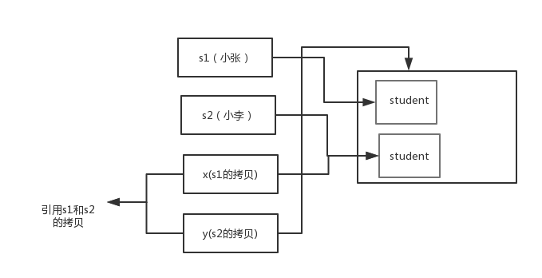

## （1）基础

### 面向过程VS面向对象⭐️

对比面向过程，是两种不同的处理问题的角度 

面向过程更注重事情的每一个步骤及顺序，面向对象更注重事情有哪些参与者（对象）、及各自需要做 什么 

比如：洗衣机洗衣服 

面向过程会将任务拆解成一系列的步骤（函数），1、打开洗衣机----->2、放衣服----->3、放洗衣粉----- 4、清洗----->5、烘干 

面向对象会拆出人和洗衣机两个对象： 

人：打开洗衣机 放衣服 放洗衣粉 

洗衣机：清洗 烘干 

> 从以上例子能看出，面向过程比较直接高效，而面向对象更易于复用、扩展和维护

### [面向对象三大特征](https://snailclimb.gitee.io/javaguide/#/docs/java/basis/Java基础知识?id=面向对象三大特征)

#### [封装](https://snailclimb.gitee.io/javaguide/#/docs/java/basis/Java基础知识?id=封装)

封装是指**把一个对象的状态信息（也就是属性）隐藏在对象内部**。

例子：相当于我们使用电脑浏览网页，而不用关心电脑是怎么实现这个功能的。

**好处：**

**隐藏实现细节**。**减少耦合**。

1）**javabean**的**name属性私有**，不能由外部直接赋值 ，仅提供get，set对外访问。

```
private String name; 
public void setName(String name){ 
	this.name = "tuling_"+name; 
}
```

2）**orm（ 对象关系映射）框架** 

操作数据库，我们不需要关心链接是如何建立的、sql是如何执行的，只需要引入mybatis，调方法即可

#### [继承](https://snailclimb.gitee.io/javaguide/#/docs/java/basis/Java基础知识?id=继承)

继承是**使用已存在的类的定义作为基础建立新类的技术，并且新类能扩展新的能力**

> 动物（父类）：猫，狗

**好处：**

通过使用继承，可以**快速地创建新类**，可以**提高代码的重用，程序的可维护性**

**特点：**

- 子类拥有父类对象所有的属性和方法（包括私有属性和私有方法），但是父类中的私有属性和方法子类是无法访问，只是拥有。
- 子类可以用自己的方式实现父类的方法。（重写）
- 子类可以拥有自己属性和方法，即子类可以对父类进行扩展。（扩展）

#### [多态](https://snailclimb.gitee.io/javaguide/#/docs/java/basis/Java基础知识?id=多态) ⭐️

**多态：同一个行为具有多个不同表现形式的能力**

例子，打印行为：有打印彩色，打印黑白

**静态的多态性：编译时，重载（不能称为多态）；动态多态性：运行时，继承**

**多态存在的三个必要条件**

- 继承
- 重写
- **父类引用指向子类对象**：Parent p = new Child();

**优点：**

1. 可替换性（打印机：打印彩色，也可以打印黑白）

2. 可扩充性（加新的子类不影响已存在类的多态性、继承性）

3. 接口性（由子类来实现接口）

**多态的特点:**

- 引用类型变量发出的方法调用的到底是哪个类中的方法，必须在程序**运行期间才能确定**；
- 如果子类重写了父类的方法，**真正执行的是子类覆盖的方法**；如果子类没有覆盖父类的方法，执行的是父类的方法
- 多态**不能调用“只在子类存在但在父类不存在”**的方法；

```Java
class A {  
         String show(D obj) {  
            return ("A and D");  
        }  
      
         String show(A obj) {  
            return ("A and A");  
        }   
      
    }  
      
     class B extends A{  
         String show(B obj){  
            return ("B and B");  
        }  
          
         String show(A obj){  
            return ("B and A");  
        }   
    }  
      
     class C extends B{  
      
    }  
      
     class D extends B{  
      
    } 
      
     public class Test {  

         public static void main(String[] args) {  
            A a1 = new A();  
            A a2 = new B();  	//只有这个多态
            B b = new B();  
            C c = new C();  
            D d = new D();  
              
            System.out.println("1--" + a1.show(b));  
            System.out.println("2--" + a1.show(c));  
            System.out.println("3--" + a1.show(d));  
            System.out.println("4--" + a2.show(b));  //4--B and A .优先级为：this.show(O)、super.show(O)、this.show((super)O)、super.show((super)O)
//a2是A类引用指向子类B的对象，实参b的类型是B，会先在A类查找show(B obj)方法，没找到，继续往Object类查找该方法，很显然也没有，那么继续第3步，将实参类型B转换成其父类类型A，然后在A类查找show(A obj)，找到了，检查子类B是否有重写，发现有重写，那么输出“B and A ”；
 
            System.out.println("5--" + a2.show(c));  //同上
            System.out.println("6--" + a2.show(d));  //A and D .查找B中没有show(D d)方法，再查A中，有，执行。
            System.out.println("7--" + b.show(b));  
            System.out.println("8--" + b.show(c));  //B and B .
            System.out.println("9--" + b.show(d));        
        }  
    }
/*
1--A and A
2--A and A
3--A and D

4--B and A
5--B and A
6--A and D

7--B and B
8--B and B
9--A and D
*/
```

### python C++ Java有什么区别⭐️

1.c++、java和python都是面向对象的强类型的编程语言，但是c++和java都是静态语言，而python是**动态语言**

> 静态：它的数据类型是在编译期间检查的；动态：运行时检查

2.垃圾回收机制：c++需要程序员收到回收，而java和python都有自己的垃圾回收机制GC。具体两者又有不同，python的垃圾收集机制主要是用的是引用计数方式，Java还有可达性分析算法。

> C++11智能指针：引用计数法

3.Java，python有**反射机制**，允许程序在运行时进行自我检查，同时也允许对其内部的成员进行操作。C++没有提供这样的特性。

4.C++ ,python支持**多重继承**，Java 的类是**单继承**的；虽然 Java 的类**不可以多继承**，但是接口可以多继承。(类继承推荐使用单继承，这样可以保证编程思路更清晰。)

（1.如果子类继承的多个父类里面有相同的方法或者属性，子类将不知道具体继承哪一个，会产生歧义。

2.如果多个父类中的方法同名，子类中没有覆盖，同样会产生上面的错误。

总结：子类只能有一个亲身父亲，但是一个父类可以有多个孩子。

1.接口里定义的都是静态常量，方法都是抽象方法，没有逻辑实现，具体的方法必须由实现接口的类覆盖实现，只会调用实现类（子类覆盖的方法）的方法，不会产生歧义。

2.接口中的变量都是静态成员常量（public static final），会在编译期就感知到错误。

总结：接口可以继承**多个父接口的相同的方法，不同的属性**，不能继承多个父接口中相同的属性。）

5.C ++,python同时支持**方法重载和操作符重载**，但是 Java 只支持**方法重载**（操作符重载增加了复杂性，这与 Java 最初的设计思想不符）。

6.python参数传递是引用传递，Java只有值传递，C++都有

> 按值传递不会改变实际参数的数值;
>
> 按引用传递可以改变实际参数的内容,但不能改变实际参数的参考地址

7.c++中用**const来声明常量**，java中使用**final**来声明，python中**没有常量**。

> 因为python没有变量
>
> C++，java的变量是面向内存的，声明一个变量需要表明空间大小。
>
> name =3 
>
> 创建名称：name是一个名称，类似指针
> 创建object：3是一个object
> 关联：name关联一个object

### [为什么说 Java 语言“编译与解释并存”？](https://snailclimb.gitee.io/javaguide/#/docs/java/basis/Java基础知识?id=为什么说-java-语言编译与解释并存？)⭐️

高级编程语言按照程序的执行方式分为编译型和解释型两种。

**编译型语言**：通过编译器将**全部代码编译**成机器指令码，然后再让计算机运行。（下次不需要重新编译）

**解释型语言**：通过解释器**一行一行的将代码翻译**成机器指令码，然后再让计算机运行。（每执行一次都要翻译一次）

**Java半编译语言**：是将源文件（.java文件）先**编译**成**字节码文件**（.class文件），然后再在Java虚拟机（JVM）中**解释**执行。

> 我们需要格外注意的是 .class->机器码 这一步。在这一步 JVM 类加载器首先加载字节码文件，然后**通过解释器逐行解释执行，这种方式的执行速度会相对比较慢**。而且，有些方法和代码块是经常需要被调用的(也就是所谓的**热点代码**)，所以后面**引进了JIT 编译器（能够捕获程序中的热点代码）**。当 JIT 编译器**完成第一次编译后，其会将字节码对应的机器码保存下来**，下次可以直接使用。
>
> 在 Java 中，JVM 可以理解的代码就叫做`字节码`（即扩展名为 `.class` 的文件），它不面向任何特定的处理器，**只面向虚拟机**。Java 语言通过字节码的方式，在一定程度上**解决了**传统解释型语言**执行效率低的问题**，同时又保留了解释型语言**可移植**的特点。

### **什么是字节码?采用字节码的好处是什么?⭐️**

> 在 Java 中，JVM 可以理解的代码就叫做`字节码`（即扩展名为 `.class` 的文件），它不面向任何特定的处理器，**只面向虚拟机**。
> Java 语言通过字节码的方式，在一定程度上**解决了**传统解释型语言**执行效率低的问题**，同时又保留了解释型语言**可移植**的特点。所以   Java   程序运行时比较高效，而且，由于字节码并不专对一种特定的机器，因此，   Java程序无须重新编译便可在多种不同的计算机上运行。  

### [JDK vs JRE vs JVM⭐️](https://snailclimb.gitee.io/javaguide/#/docs/java/basis/Java基础知识?id=jvm-vs-jdk-vs-jre)


**JDK** 是 Java Development Kit 缩写，它是**功能齐全的 Java SDK**。它**拥有 JRE 所拥有的一切**，还有**编译器（javac）**和工具（如 javadoc 和 jdb）。**它能够创建和编译程序**。

**JRE** 是 **Java 运行时环境**。，包括 Java 虚拟机**（JVM），Java 类库**，java 命令和其他的一些基础构件。它是**运行已编译** **Java 程序，**但是，**它不能用于创建新程序**。

应用程序服务器会将 JSP 转换为  Java servlet，并且需要使用 JDK 来编译 servlet。

**JVM**

Java 虚拟机（JVM）是**运行 Java 字节码的虚拟机**。**不同系统的JVM是不同的**（Windows，Linux，macOS），**目的是使用相同的字节码，它们都会给出相同的结果。实现源代码的可移植性。**

## [基本语法](https://snailclimb.gitee.io/javaguide/#/docs/java/basis/Java基础知识?id=基本语法)

### 可选参数和固定参数

> jdk1.5以后支持可选参数,…；固定参数：就是普通的参数

可选参数：个数从0到无穷；只能有一个；放在参数列表最后；可选参数可以组成方法重载，但可选参数的调用优先级最低。（函数重载的调用优先级：一摸一样的 > 基本类型转换的 > 自动拆箱／装箱 > 继承优先父类方法 > 可选参数的方法）

### 访问修饰符


继承，子类修饰符<=父类

实现接口，实现类的修饰符>=接口

### [字符型常量和字符串常量的区别?](https://snailclimb.gitee.io/javaguide/#/docs/java/basis/Java基础知识?id=字符型常量和字符串常量的区别)

**形式** : 字符常量是单引号引起的一个字符：**'0'**，字符串常量是双引号引起的 0 个或若干个字符：**"0"**

**含义** : 字符常量相当于**一个整型值**( ASCII 值),可以参加表达式运算; 字符串常量代表**一个地址值**(该字符串在内存中存放位置)

**占内存大小** ： 字符常量**只占 2 个字节**; 字符串常量占**若干个字节** 


### [注释](https://snailclimb.gitee.io/javaguide/#/docs/java/basis/Java基础知识?id=注释)

Java 中的注释有三种：

1. 单行注释
2. 多行注释
3. 文档注释。

> **代码的注释不是越详细越好。实际上好的代码本身就是注释，我们要尽量规范和美化自己的代码来减少不必要的注释。**

### [标识符和关键字的区别是什么？](https://snailclimb.gitee.io/javaguide/#/docs/java/basis/Java基础知识?id=标识符和关键字的区别是什么？)

在我们编写程序的时候，需要大量地为程序、类、变量、方法等取名字，于是就有了标识符，简单来说，标识符就是一个名字。但是有一些标识符，Java 语言已经赋予了其特殊的含义，只能用于特定的地方，这种**特殊的标识符就是关键字**。

### [Java 中有哪些常见的关键字？](https://snailclimb.gitee.io/javaguide/#/docs/java/basis/Java基础知识?id=java-中有哪些常见的关键字？)

**final**：用来说明最终属性，表明一个类不能派生出子类，或者成员方法不能被覆盖，或者成员域的值不能被改变，用来定义常量

**instanceof**：用来确定对象所属的类

> 判断一个引用类型的变量所指向的对象是否是一个类（或接口、抽象类、父类）的实例。即它左边的对象是否是它右边的类的实例该运算符返回boolean类型的数据

**interface**：接口

**implements**：指定的接口中所声明的所有方法的实现

**native**：指示该方法是用Java以外的语言实现的

**strictfp**：用来声明FP_strict（单精度或双精度浮点数）表达式遵循IEEE 754算术规范

**super**：表明当前对象的父类型的引用或者父类型的构造方法

**synchronized**：表明一段代码需要同步执行

**throw**：抛出一个异常

**throws**：声明在当前定义的成员方法中所有需要抛出的异常

**transient**：声明不用序列化的成员域

**volatile**：表明两个或者多个变量必须同步地发生变化；可以被多个线程异步修改的成员变量

**abstract**

> abstract关键字可以修饰类或方法。
>
> abstract类可以扩展（增加子类），但不能直接实例化。
>
> abstract方法不在声明它的类中实现，但必须在某个子类中重写。

### [Java 泛型了解么？什么是类型擦除？介绍一下常用的通配符？](https://snailclimb.gitee.io/javaguide/#/docs/java/basis/Java基础知识?id=java-泛型了解么？什么是类型擦除？介绍一下常用的通配符？)⭐️

**Java 泛型**（generics）是 JDK 5 中引入的一个新特性, 泛型提供了**编译时类型安全检测机制**，该机制允许程序员在编译时检测到非法的类型。**泛型的本质是参数化类型**。

Java 的泛型是**伪泛型**，这是因为 Java **在编译期间**，所有的**泛型信息都会被擦掉**，这也就是通常所说**类型擦除** 。

```java
public class ErasedTypeEquivalence {
    public static void main(String[] args) {
        Class c1 = new ArrayList<String>().getClass();
        Class c2 = new ArrayList<Integer>().getClass();
        System.out.println(c1 == c2);
    }
}
//执行结果为
//true
```

> 尽管ArrayList<String>和ArrayList<Integer>看上去是不同的类型，但是上面的程序会认为它们是相同的类型。ArrayList<String>和ArrayList<Integer>在运行时事实上是相同的类型。这两种类型都**被擦除成它们的“原生”类型，即ArrayList。**
>
> 问题：怎么知道对象属于哪个类型
>
> **instanceof**

**真的完全擦除了吗**

> 并不完全正确，**Singature属性**会为它记录泛型签名信息。Signature属性就是为了弥补擦除法的缺陷而增设的，**Java可以通过反射获得泛型类**型，这部分信息基本能够满足我们日常开发中的大多数场景。

**泛型一般有三种使用方式:泛型类、泛型接口、泛型方法**

>**常用的通配符为： T，E，K，V，？**
>
>- T (type) 表示具体的一个 java 类型
>- E (element) 代表 Element
>- K V (key value) 分别代表 java 键值中的 Key Value
>- ？ 表示不确定的 java 类型

**解决擦除的问题**

- **引入类型标签，使用动态的isInstance()代替instanceof**
- **用工厂方法或模版方法创建类型实例**

**使用场景**

在Java里面可以**通过反射获取泛型信息**的场景有三个，分别是：

(1)**成员变量**的泛型

(2)**方法参数**的泛型

(3)**方法返回值**的泛型

> 注意，通过**对象本身也是没法获取的**。
>
> 不能通过发射获取泛型类型信息的场景有二个，分别是：
>
> (1)**类或接口**声明的泛型信息
>
> (2)**局部变量**的泛型信息

### 反射⭐️

Java反射机制的核心是在程序运行时动态加载类并获取类的详细信息,从而操作类或对象的属性和方法。
本质是JVM得到class对象之后,再通过class对象进行反编译,从而获取对象的各种信息。

#### 反射机制优缺点 ⭐️

**优点** ： 可以让咱们的**代码更加灵活**、**为各种框架提供开箱即用**的功能提供了便利

**缺点** ：让我们在运行时有了分析操作类的能力，这同样也增加了**安全问题**。比如可以**无视泛型参数的安全检查**（泛型参数的安全检查发生在编译时）。另外，反射的**性能也要稍差点**，不过，对于框架来说实际是影响不大的。

**为什么比较慢？**

反射它其实是一个**解释过程**，在运行时，需要告诉JVM想要什么；（所有被调用/创建的东西都必须**被发现**；**参数**需要通过装箱/拆箱、打包到数组中**进行修饰**；**编译器不能做任何优化**。）

#### **使用反射的一般步骤⭐️**

获取Class对象，然后调用对象的属性及方法。

```
获取Class对象有三种方式：
第一种是对象调用getClass方法。									person.getClass()		
第二种方式：知道类名，直接用类名.class方式获取。此种方式性能最优。Person.class
第三种方式：知道类的全限定名，使用Class对象的静态方法forName方法获取 class.forName(类的全限定名)
```

#### 反射的应用场景 ⭐️

例子：https://blog.csdn.net/qq_33613491/article/details/106711513

1）**动态代理**的实现也依赖反射。

比如下面是通过 JDK 或者cglib实现动态代理的示例代码，其中就使用了**反射类** `Method` 来调用指定的方法。

```java
public class DebugInvocationHandler implements InvocationHandler {
    /**
     * 代理类中的真实对象
     */
    private final Object target;

    public DebugInvocationHandler(Object target) {
        this.target = target;
    }

    public Object invoke(Object proxy, Method method, Object[] args) throws InvocationTargetException, IllegalAccessException {
        System.out.println("before method " + method.getName());
        Object result = method.invoke(target, args);	//调用指定方法
        System.out.println("after method " + method.getName());
        return result;
    }
}
```

2）另外，像 Java 中的一大利器 **注解** 的实现也用到了反射。

为什么你使用 Spring 的时候 ，一个`@Component`注解就声明了一个类为 Spring Bean 呢？为什么你通过一个 `@Value`注解就读取到配置文件中的值呢？究竟是怎么起作用的呢？

这些都是因为你可以基于**反射分析类**，然后获取到类/属性/方法/方法的参数上的注解，你获取到注解之后，就可以做进一步的处理。

### [==和 equals 的区别](https://snailclimb.gitee.io/javaguide/#/docs/java/basis/Java基础知识?id=和-equals-的区别)⭐️

**==**对于基本数据类型来说，比较的是值。对于引用数据类型来说，比较的是对象的内存地址。因为 Java 只有值传递，所以，对于 == 来说，不管是比较基本数据类型，还是引用数据类型的变量，**其本质比较的都是值**，只是引用类型变量存的值是**对象的地址**。

**equals()** 作用不能用于判断基本数据类型的变量，**只能用来判断两个对象是否相等**。`equals()`方法存在于`Object`类中，而`Object`类是所有类的直接或间接父类。

> String类重写Object类的equals方法判断两个字符串的内容是否相等

`equals()` 方法存在两种使用情况：

- **类没有覆盖 equals()方法** ：通过`equals()`比较该类的两个对象时，**等价于通过“==”比较这两个对象**，使用的默认是 `Object`类`equals()`方法。
- **类覆盖了 equals()方法** ：一般我们都覆盖 `equals()`方法来**比较两个对象中的属性是否相等**；若它们的属性相等，则返回 true(即，认为这两个对象相等)。

```java
public class test1 {
    public static void main(String[] args) {
        String a = new String("ab"); // a 为一个引用
        String b = new String("ab"); // b为另一个引用,对象的内容一样
        String aa = "ab"; // 放在常量池中
        String bb = "ab"; // 从常量池中查找
        if (aa == bb) // true
            System.out.println("aa==bb");
        if (a == b) // false，非同一对象
            System.out.println("a==b");
        if (a.equals(b)) // String类覆盖了 equals()方法  true
            System.out.println("true");
        if (42 == 42.0) { // true
            System.out.println("true");
        }
    }
}
```

`String`类`equals()`方法：

```java
public boolean equals(Object anObject) {
    if (this == anObject) {
        return true;
    }
    if (anObject instanceof String) {
        String anotherString = (String)anObject;
        int n = value.length;
        if (n == anotherString.value.length) {	//先比较长度
            char v1[] = value;
            char v2[] = anotherString.value;
            int i = 0;
            while (n-- != 0) {					//从头开始遍历，比较
                if (v1[i] != v2[i])
                    return false;
                i++;
            }
            return true;
        }
    }
    return false;
}
```

#### 注意点

**Object的equals方法容易抛空指针异常**，应使用常量或确定有值的对象来调用 equals。 不过更推荐使用 `java.util.Objects#equals`(**JDK7 引入的工具类**)。

```java
String str = null;
str.equals("SnailClimb")；	//空指针异常

"SnailClimb".equals(str);// false
```

#### 计算

```java
byte a = 1;
byte b = 2;
a = a +b;
//低于int自动转化为int
//上面是编译错误

byte a = 1;
byte b = 2;
a += b;
//会强转为左边类型
```


### [hashCode()与 equals()](https://snailclimb.gitee.io/javaguide/#/docs/java/basis/Java基础知识?id=hashcode与-equals) ⭐️

面试官可能会问你：“你重写过 `hashcode` 和 `equals`么，为什么重写 `equals` 时必须重写 `hashCode` 方法？”

**1)hashCode()介绍:**

`hashCode()` 的作用是**获取哈希码**，也称为散列码；散列表存储的是键值对(key-value)

```java
hashCode：是一个native方法，返回的是对象的内存地址.能根据“键”快速的检索出对应的“值”
```

**2)为什么要有 hashCode？⭐️**

我们以**“`HashSet` 如何检查重复”为例子**来说明为什么要有 hashCode。

当你把对象加入 `HashSet` 时，`HashSet` 会先计算对象的 hashcode 值来判断对象加入的位置，同时也会与其他已经加入的对象的 hashcode 值作比较，如果没有相等的 hashcode，`HashSet` 会假设对象没有重复出现。但是**如果发现有相同 hashcode 值的对象，这时会调用 `equals()` 方法来检查 hashcode 相等的对象是否真的相同（比较属性值）**。如果两者相同，`HashSet` 就不会让其加入操作成功。如果不同的话，就**会重新散列到其他位置**。这样我们就**大大减少了 equals 的次数**。

**3)为什么重写 equals 时必须重写 hashCode 方法？**⭐️

> hashCode()`的默认行为是对堆上的对象产生独特值。`如果没有重写 `hashCode()`，则该 class 的两个对象无论如何都不会相等（即使这两个对象指向相同的数据）

> 我们希望只要id是一样的，就认定为是一个对象，集合中同一个对象只存一个

**4)为什么两个对象有相同的 hashcode 值，它们也不一定是相等的？⭐️**

因为 **`hashCode()` 会产生哈希冲突，产生相同的hashcode值**。

```java
import java.util.HashSet;
import java.util.Objects;

public class Product {
    private Integer id;
    private String name;

    public Product(Integer id, String name) {
        this.id = id;
        this.name = name;
    }

    public Integer getId() {
        return id;
    }

    public void setId(Integer id) {
        this.id = id;
    }

    public String getName() {
        return name;
    }

    public void setName(String name) {
        this.name = name;
    }

    // 重写equals
    @Override
    public boolean equals(Object o) {
        if (this == o) {
            return true;
        }
        if (o == null || getClass() != o.getClass()) {
            return false;
        }
        Product product = (Product) o;
        return Objects.equals(id, product.id);
    }

    
    public static void main(String[] args) {
        Product product1 = new Product(1, "包子");
        Product product2 = new Product(1, "馒头");

        HashSet<Product> products = new HashSet<Product>();
        products.add(product1);
        products.add(product2);
        // 使用equals判断是否相等
        System.out.println(product1.equals(product2));
        // 查看HashSet中元素个数
        System.out.println(products.size());

    }
}

【测试结果】
true // 可以看到判断是相等的
2 	 // 但是还是存到了HashSet中，不重写hashcode，会将同个对象判定为2个对象⚠️

//重写hashCode,再次测试
@Override
public int hashCode() {
    return Objects.hash(id);
}
【测试结果】
true // 可以看到判断是相等的
1 // 并且第二个值并没有存到HashSet中
```


### [Java 中的几种基本数据类型是什么？对应的包装类型是什么？各自占用多少字节呢？](https://snailclimb.gitee.io/javaguide/#/docs/java/basis/Java基础知识?id=java-中的几种基本数据类型是什么？对应的包装类型是什么？各自占用多少字节呢？)


**注意：**

1. Java 里使用 `long` 类型的数据一定要在数值后面加上 **L**，否则将作为整型解析。
2. `char a = 'h'`char :单引号，`String a = "hello"` :双引号。

**（2）包装类型 VS 基本类型**⭐️

1）包装类型不赋值就是 `Null` ，而**基本类型有默认**值且不是 `Null`。

2）基本数据类型直接存放在 Java 虚拟机**栈**中的局部变量表中，而包装类型属于对象类型，我们知道对象实例都存在于**堆**中。

### [自动装箱与拆箱](https://snailclimb.gitee.io/javaguide/#/docs/java/basis/Java基础知识?id=自动装箱与拆箱)⭐️

- **装箱**：将基本类型**用它们对应的引用类型**包装起来；
- **拆箱**：将包装类型转换为基本数据类型；

> 1）包装类型可以为 null，而基本类型不可以
>
> 2）包装类型可用于泛型，而基本类型不可以
>
> 3）基本类型在栈中直接存储的具体数值，而包装类型则存储的是堆中的引用
>
> 当需要进行自动装箱时，如果**数字在 -128 至 127 之间时，会直接使用缓存中的对象**，而不是重新创建一个对象

```java
    Integer i = 10 等价于 Integer i = Integer.valueOf(10)					//装箱
    int n = i 等价于 int n = i.intValue();									//拆箱
```

### int和Integer有什么区别？为什么要有包装类？⭐️

- 数据类型不同：int 是基础数据类型，而 Integer 是包装数据类型；
- 默认值不同：int 的默认值是 0，而 Integer 的默认值是 null；
- 内存中存储的方式不同：int 在**栈中直接存储的具体数值**，而 Integer 存储的是**堆中的引用**，当 new 一个 Integer 时实际上是生成一个指针指向此对象；
- 实例化方式不同：Integer 必须实例化才可以使用，而 int 不需要；
- 变量的比较方式不同：int 可以使用 == 来对比两个变量是否相等，而 Integer 一定要使用 equals 来比较两个变量是否相等。

⭐️Java 中每个基本数据类型都对应了一个包装类，而 int 对应的包装类就是 Integer，包装类的存在解决了基本数据类型无法做到的事情：**泛型类型参数（T，E，K，V，？）、序列化、类型转换、高频区间数据缓存（-128，127）**等问题。

### [8 种基本类型的包装类和常量池](https://snailclimb.gitee.io/javaguide/#/docs/java/basis/Java基础知识?id=_8-种基本类型的包装类和常量池) ⭐️

Java 基本类型的包装类的大部分都实现了**常量池技术**。

`Byte`,`Short`,`Integer`,`Long` 这 4 种包装类默认创建了数值 **[-128，127]** 的相应类型的缓存数据，

`Character` 创建了数值在[0,127]范围的缓存数据，

`Boolean` 直接返回 `True` Or `False`。

⚠️：如果超出对应范围仍然会去创建新的对象。

> 两种浮点数类型的包装类 `Float`,`Double` 并没有实现常量池技术。

⚠️：**所有整型包装类对象之间值的比较，全部使用 equals 方法比较**。

```java
Integer i1 = 40;										//常量池中的对象
Integer i2 = new Integer(40);	
System.out.println(i1==i2);					//比较地址，false
System.out.println(i1.equals(i2));	//true，比较属性值
```

**荐使用*valueOf* *方法，少使用* *parseLong* *方法***

valueOf 方法会从缓存中去 拿值，如果命中缓存，会减少资源的开销，parseLong 方法就没有这个机制。

### [在一个静态方法内调用一个非静态成员为什么是非法的?](https://snailclimb.gitee.io/javaguide/#/docs/java/basis/Java基础知识?id=在一个静态方法内调用一个非静态成员为什么是非法的)

**静态方法是属于类**的，在**类加载的时候就会分配内存**，可以通过类名直接访问。
而**非静态成员属于实例对象**，只有**在对象实例化之后才存在**，然后通过类的实例对象去访问。
**在类的非静态成员不存在的时候静态成员就已经存在**了，此时调用在内存中还不存在的非静态成员，属于非法操作。

### [静态方法和实例方法有何不同？](https://snailclimb.gitee.io/javaguide/#/docs/java/basis/Java基础知识?id=静态方法和实例方法有何不同？)

1.在外部**调用静态方法**时，可以使用**"类名.方法名**"的方式，也可以使用"**对象名.方法名**"的方式。实例方法只能用"**对象名.方法名**"的方式。

2.静态方法在**访问本类的成员**时，**只允许访问静态成员**（即静态成员变量和静态方法）；实例方法则无此限制。

### [为什么 Java 中只有值传递？](https://snailclimb.gitee.io/javaguide/#/docs/java/basis/Java基础知识?id=为什么-java-中只有值传递？)⭐️

**按值调用(call by value)** 表示方法接收的是**参数的值**(**不能修改值对应的变量**)，**按引用调用（call by reference)** 表示方法接收的是**实参的实际地址**（可以修改值对应的变量）。

实参：方法被调用时传入的实际值。

形参：在定义方法时括号内定义的参数列表即为形参

**Java 程序设计语言总是采用按值调用。**

> ```java
> （1）不能修改一个基本数据类型的参数
> C++里面的swap(int a, int b)，Java不行
> ```

> ```java
> （2）改变一个对象参数的状态
> swap（arr）
> swap(int[] array)		对象引用作为参数就可以,arr array 指向同一个数组对象
> 方法得到的是对象引用的拷贝array
> ```

> ```java
> （3）不能交换2个对象（只交换了拷贝的2个对象）
> Student s1 = new Student("小张");
> Student s2 = new Student("小李");
> Test.swap(s1, s2);
> ```

交换之前：


交换之后：



方法并没有改变存储在变量 s1 和 s2 中的对象引用。swap 方法的参数 x 和 y 被初始化为两个对象引用的拷贝，**这个方法交换的是这两个拷贝**

> 封装类可以解决这个问题

```java
// A Wrapper over class that is used for swapping
class CarWrapper
{
   Car c;

   // Constructor
   CarWrapper(Car c)   {this.c = c;}
}

// A Class that use Car and swaps objects of Car
// using CarWrapper
class Main
{
    // This method swaps car objects in wrappers
    // cw1 and cw2
    public static void swap(CarWrapper cw1, 
                            CarWrapper cw2)
    {
        Car temp = cw1.c;
        cw1.c = cw2.c;
        cw2.c = temp;
    }

    // Driver method
    public static void main(String[] args)
    {
        Car c1 = new Car(101, 1);
        Car c2 = new Car(202, 2);
        CarWrapper cw1 = new CarWrapper(c1);
        CarWrapper cw2 = new CarWrapper(c2);
        swap(cw1, cw2);
        cw1.c.print();
        cw2.c.print();
    }
}
```

### this 与super⭐️

this 和 super 都是 Java 中的关键字，都起指代作用。

它们有四点不同：**指代对象、查找访问、本类属性赋值和 synchronized 的使用不同**。
super 指代的是父类，是用来访问父类的；而 this 指代的是当前类。

super 只能查找父类，而 this 会先从本类中找，如果找不到则会去父类中找。

this 可以用来为本类的实例属性赋值，而 super 则不能实现此功能。

因为 this 表示当前对象，所以this 可用于 synchronized(this){....} 加锁，而 super 则不能实现此功能。

### [重载和重写的区别⭐️](https://snailclimb.gitee.io/javaguide/#/docs/java/basis/Java基础知识?id=重载和重写的区别)

重载就是**同一个类**中的**多个同名方法**能够根据**输入数据的不同**，做出不同的处理

重写就是当**子类继承自父类的相同方法**，**输入数据一样**，但要做出有别于父类的处理


> 方法名称+参数类型+参数个数=**方法签名**，JVM通过这个签名来调用哪个重载方法。
>
> **重载为什么不加返回类型？**加了之后，调用重载函数（不会写返回类型），JVM就不能判断调用哪个重载函数

> **不能重写的情况？**
>
> 1. 如果父类方法访问修饰符为 `private/final/static` **则子类就不能重写该方法**，但是被 static 修饰的方法能够被再次声明。
> 2. **构造方法无法被重写**

### [深拷贝 vs 浅拷贝](https://snailclimb.gitee.io/javaguide/#/docs/java/basis/Java基础知识?id=深拷贝-vs-浅拷贝)

```
浅拷贝：一个指针指向已存在的内存地址
深拷贝：申请了一个新的内存，指针再指向
```

### [成员变量与局部变量的区别有哪些？](https://snailclimb.gitee.io/javaguide/#/docs/java/basis/Java基础知识?id=成员变量与局部变量的区别有哪些？)⭐️

1. 从**语法**形式上看，**成员变量是属于类**的，而局部变量是在代码块或方法中定义的变量或是方法的参数；成员变量可以被 `public`,`private`,`static` 等修饰符所修饰，而局部变量不能被访问控制修饰符及 `static` 所修饰；但是，**成员变量和局部变量都能被 `final` 所修饰**。
2. 从变量在**内存中的存储方式**来看,如果成员变量是使用 `static` 修饰的，那么这个成员变量是**属于类**的，如果没有使用 `static` 修饰，这个成员变量是属于实例的。而**对象存在于堆内存**，局部变量则存在于**栈内存**。
3. 从变量在**内存中的生存时间**上看，静态变量的生命周期取决于类的生命周期；非静态成员变量是对象的一部分，它**随着对象**的创建而存在，而局部变量**随着方法**的调用结束而自动消失。
4. 从变量**是否有默认值**来看，成员变量如果没有被赋初，则会自动以类型的默认值而赋值（一种情况例外:被 `final` 修饰的成员变量也必须显式地赋值），而**局部变量则不会自动赋值**。

> 一个局部变量，如果不赋值，那么这个变量也不会进入到内存中，可以认为不存在。

类的生命周期


### 内存分区

```
栈区：存放函数的局部变量，返回值以及形参
堆区：调用malloc函数主动申请，如果不调用free函数就不会自动释放
全局／静态区／数据段：存放静态变量和全局变量的地方
常量区：存放常量的地方
代码区：存放代码的地方
```

### [创建一个对象用什么运算符?对象实体与对象引用有何不同?](https://snailclimb.gitee.io/javaguide/#/docs/java/basis/Java基础知识?id=创建一个对象用什么运算符对象实体与对象引用有何不同)

new 运算符，new 创建对象实例（**对象实例在堆内存**中），对象引用：指向对象实例（**对象引用存放在栈**内存中）。

一个对象引用可以指向 0 个或 1 个对象（一根绳子可以不系气球，也可以系一个气球）;一个对象可以有 n 个引用指向它（可以用 n 条绳子系住一个气球）。	

### [对象的相等与指向他们的引用相等,两者有什么不同?](https://snailclimb.gitee.io/javaguide/#/docs/java/basis/Java基础知识?id=对象的相等与指向他们的引用相等两者有什么不同)

对象的相等，比的是内存中存放的内容是否相等。而引用相等，比较的是他们指向的内存地址是否相等。

### [一个类的构造方法的作用是什么? 若一个类没有声明构造方法，该程序能正确执行吗? 为什么?](https://snailclimb.gitee.io/javaguide/#/docs/java/basis/Java基础知识?id=一个类的构造方法的作用是什么-若一个类没有声明构造方法，该程序能正确执行吗-为什么)

构造方法主要作用是**完成对类对象的初始化工作**。

如果一个类没有声明构造方法，也可以执行！因为一个类即使没有声明构造方法也会**有默认的不带参数的构造方法**。如果我们**自己添加了**类的构造方法（无论是否有参），Java就不**会再添加默认的无参数的构造方法**了。

### [构造方法有哪些特点？是否可被 override?](https://snailclimb.gitee.io/javaguide/#/docs/java/basis/Java基础知识?id=构造方法有哪些特点？是否可被-override)

**特点：**

1. **名字与类名相同**。
2. **没有返回值，但不能用 void 声明构造函数**。
3. 生成类的对象时**自动执行**，无需调用。

**构造方法不能被 override（重写）,但是可以 overload（重载）**,所以你可以看到一个类中有多个构造函数的情况。

> 构造方法不可以被重写,因为重写发生在父类和子类之间,要求方法名称相同,而构造方法的名称是和类名相同的,而子类类名不会和父类类名相同,所以不可以被重写。

### final、finally、finalize有什么区别？⭐️

#### final

##### **修饰对象**

java中的关键字

- 修饰类：表示类不可被继承 （不可修饰抽象类）
- 修饰方法：表示方法**不可重写，但是可以重载** 
- **修饰变量**：表示变量一旦被赋值就不可以更改它的值。  
- 修饰参数：此参数在整个方法不允许被修改

##### 赋值时机

（1）**类(静态)变量**VS成员变量 

如果final修饰的是**类变量**，**只能在静态初始化块**中指定初始值或者构造函数里面指定初始值，等号赋值。(final static修饰：则有2种：等号赋值，静态初始化块赋值)

如果final修饰的是成员变量，可以在非静态初始化块、构造器中执行初始值。

（2）修饰局部变量 

系统不会为局部变量进行初始化，**局部变量必须由程序员显示初始化**。不规定赋值时机，只需要在使用前赋值就可以。

（3）修饰基本类型数据和引用类型数据 

- 如果是基本数据类型的变量，则其数值一旦在初始化之后便不能更改； 
- 如果是引用类型的变量，则在对其初始化之后便**不能再让其指向另一个对象**。**但是引用的值是可变的**。 

##### 注意点

用final修饰不一定具有不变性。

- 修饰基本类型，具有不变性

- 修改对象，里面的属性也都被final修饰不一定具有不变性

  

  

- 在方法里面新建的局部变量，是线程安全的，栈封闭，每个线程都有独自的栈

**面试**


#### finally

是一种一定被执行的机制。无论是否捕获或处理异常，`finally` 块里的语句都会被执行。比如：try  finally或者try catch finally来进行**关闭JDBC连接，保证释放锁**等动作。

**在以下 3 种特殊情况下，finally 块不会被执行：**

1. 在 `try` 或 `finally`块中用了 `System.exit(int)`退出程序。但是，如果 `System.exit(int)` 在异常语句之后，`finally` 还是会被执行
2. 程序所在的线程死亡。
3. 关闭 CPU。

#### finalize

**Object类的基础方法**，设计目的是**保证在被垃圾收集前完成特定资源的回收**，JDK9之后弃用了。

> *finalize*()*并不是必须要执行的*,它只能执行一次或者0次

- finalize不一定被执行，不稳定

> 当对象变成(GC Roots)**不可达时**，GC会判断该对象是否覆盖了finalize方法，**若未覆盖，则直接将其回收**。否则，若对象未执行过finalize方法，将其**放入F-Queue队列**，由一**低优先级线程**执行该队列中对象的finalize方法。执行finalize方法完毕后，GC会**再次判断该对象是否可达**，若不可达，则进行回收，否则，对象“复活” 。

- 阻碍JVM垃圾回收，性能差。GC本就因为内存不足引起，finalize调用又很慢，不能及时释放内存，对象释放不及时就会逐渐移入老年代，老年代垃圾积累过多就会容易Full GC，Full GC释放速度如果仍跟不上创建新对象的速度，就会OOM。

```java
class Test {
    public void play() {
        System.out.print("play-");
    }

    @Override
    protected void finalize() throws Throwable {
        System.out.print("claen-");
    }
}

class Main {
    public static void main(String[] args) {
        Test t = new Test();
        t.play();
        System.gc();
        Test a = new Test();
        a.play();
    }
}
/*
输出：play-play-
*/
class Main {
    public static void main(String[] args) throws Exception {
        Test t = new Test();
        t.play();
        t = null;
        System.gc();
        Thread.sleep(1000);
        Test a = new Test();
        a.play();
    }
}
/*
play-claen-play-
*/
```


### Static⭐️

#### *修饰的对象*

static 只能修饰**类变量、代码块和方法**。补充：还有 class。

> 修饰类变量、代码块和方法都与类无关
>
> - 我们**不需要初始化类**就可直接使用静态变量；
> - 静态变量**只会初始化一次**，初始化完成之后，不管我再 new 多少个类出来，静态变量都不会再初始化了。

**(1)当static** **修饰类变量时**，如果该变量是 public 的话，表示该变量任何类都可以直接访问，而且 无需初始化类，直接使用 **类名.static** **变量** 这种形式访问即可。

需要注意**线程安全**的问题了，因为当多个线程同时对共享变量进行读 写时，很有可能会出现并发问题。

两个解决办法：

- 把线程不安全的 ArrayList 换成线程安全的 CopyOnWriteArrayList；
- 每次访问时，手动加锁。

(2)**当** **static** **修饰方法时**，代表**该方法和当前类是无关的**，任意类都可以直接访问（如果权限是 public 的话）。 

有一点需要注意的是，该方法内部只能调用同样被 static 修饰的方法，不能调用普通方法，我们 常用的 **util 类里面的各种方法，我们比较喜欢用 static 修饰方法**，好处就是调用特别方便。

> **static 方法内部的变量在执行时是没有线程安全问题的**。方法执行时，**数据运行在栈里面**，栈的 数据每个线程都是隔离开的，所以不会有线程安全的问题，所以 util 类的各个 static 方法，我们是可以放心使用的。

(3)**当** **static** **修饰方法块时**，我们叫做静态块，静态块常常用于**在类启动之前，初始化一些值**，比如： 

```java
public static List<String> list = new ArrayList(); 

static { 
	list.add("1"); 
} 
```

> 需要注意的是， **static 的变量需要写在静态块的前面**，不然编译也会报错。

(4)static关键字还可以修饰类，**普通类是不允许声明为静态的，只有内部类才可以**。

被static修饰的内部类可以**直接作为一个普通类来使用，而不需实例一个外部类**。

#### *初始化时机*

\1. 父类的静态变量和静态块比子类优先初始化； 

\2. 静态变量和静态块**比类构造器优先初始化**。 

3. 被 static 修饰的**方法**，在类初始化的时候并不会初始化，**只有当自己被调用时，才会被执行。**

### volatile⭐️

  **概念**：volatile 的意思是可见的，常用来修饰某个共享变量，意思是当共享变量的值被修改后，会及时通知到其它线程上，其它线程就能知道当前共享变量的值已经被修改了。 

**前提：**在**多核 CPU** 下，为了提高效率，**线程在拿值时，是 直接和 CPU 缓存打交道的**，而不是内存。主要是因为 CPU 缓存执行速度更快，比如线程要拿值 时，会直接从 CPU 缓存中拿， CPU 缓存中没有，就会从内存中拿，所以**线程读的操作永远都是拿CPU 缓存的值**。
这时候会产生一个问题，**CPU 缓存中的值和内存中的值可能并不是时刻都同步**，导致线程计算的值可能不是最新的，共享变量的值有可能已经被其它线程所修改了，但**此时修改是机器内存的值**， **CPU 缓存的值还是旧的**，导致计算会出现问题。

**原理**：这时候有个机制，就是**内存会主动通知 CPU 缓存**。当前共享变量的值已经失效了，你需要重新来拉取一份，**CPU 缓存就会重新从内存中拿取一份最新的值**。

volatile 关键字就会触发这种机制，加了 volatile 关键字的变量，就会被识别成共享变量，内存 中值被修改后，会通知到各个 CPU 缓存，使 CPU 缓存中的值也对应被修改，从而**保证线程从 CPU 缓存中拿取出来的值是最新的**。

###  **transient**

transient 关键字我们常用来修饰类变量，意思是当前变量是无需进行序列化的。在序列化时， 就会忽略该变量。

### default 

default 关键字一般会用在接口的方法上，意思是**对于该接口，子类是无需强制实现的**，但接口自己 必须有默认实现。

###  *工作中有没有遇到特别好用的工具类，如何写好一个工具类*⭐️

答：有的，像 Arrays 的排序、二分查找、Collections 的不可变、线程安全集合类、Objects 的判空，相等判断等等工具类，好的工具类肯定很好用，比如说**使用 static final 关键字对方法进行修饰， 工具类构造器必须是私有**等等手段来写好工具类。

> Arrays 主要对数组提供了一些高效的操作，比如说排序、查找、填充、拷贝、相等判断等等。
>
> Collections 是为了方便使用集合而产生的工具类，求集合中最大、小值，
>
> 线程安全集合synchronized；不可变集合unmodifiable （Map）
>
> Objects 提供了equals 和 deepEquals 两个方法来进行相等判断，前者是判断基本类型和自定义类的，后者是用来判断数组的
>
> Objects 提供了各种关于空的一些判断，isNull 和 nonNull 对于对象是否为空返回 Boolean 值， requireNonNull 方法更加严格，如果一旦为空，会直接抛出异常

### **为什么局部内部类和匿名内部类只能访问局部final变量？**⭐️

首先需要知道的一点是: **内部类和外部类是处于同一个级别的**，内部类不会因为定义在方法中就会随着方法的执行完毕就被销毁。 

这里就会产生问题：当外部类的方法结束时，局部变量就会被销毁了，但是内部类对象可能还存在(只有 没有人再引用它时，才会死亡)。这里就出现了一个矛盾：内部类对象访问了一个不存在的变量。为了解 决这个问题，就将局部变量复制了一份作为内部类的成员变量，这样当局部变量死亡后，内部类仍可以访问它，实际访问的是局部变量的"copy"。这样就好像延长了局部变量的生命周期。

**将局部变量复制为内部类的成员变量时，必须保证这两个变量是一样的，也就是如果我们在内部类中修 改了成员变量，方法中的局部变量也得跟着改变，怎么解决问题呢？** 

**就将局部变量设置为final，对它初始化后，我就不让你再去修改这个变量**，就保证了内部类的成员变量 和方法的局部变量的一致性。这实际上也是一种妥协。使得局部变量与内部类内建立的拷贝保持一致。

### [String StringBuffer 和 StringBuilder 的区别是什么? String 为什么是不可变的?⭐️](https://snailclimb.gitee.io/javaguide/#/docs/java/basis/Java基础知识?id=string-stringbuffer-和-stringbuilder-的区别是什么-string-为什么是不可变的)


> String v= new("ab");	//new创建String，放在堆；"ab"String对象，放在常量池；创建2个对象


> String a = "ab";
>
> String v= new("ab");//该行创建一个对象，因为"ab"已经存在


**（1）可不可变**

`String` 类被 final 修饰；并且String中使用 **final** 关键字修饰字符数组来保存字符串，`private final char value[]`，所以**String 对象是不可变的**。

String每次操作都会返回一个新的String

> str =  str.replace("l","dd");//正确
>
> str.replace("l","dd");//错误

> 在 **Java 9** 之后，String 、`StringBuilder` 与 `StringBuffer` 的实现改用 byte 数组存储字符串 `private final byte[] value`

而 `StringBuilder` 与 `StringBuffer` 都继承自 `AbstractStringBuilder` 类，在 `AbstractStringBuilder` 中也是使用**字符数组保存字符串**`char[]value` 但是没有用 `final` 关键字修饰，所以**这两种对象都是可变的**。

**（2）线程安全性**

`String` 中的对象是不可变的，也就可以理解为**常量**，线程安全。

`StringBuffer` 对方法加了同步锁或者对调用的方法加了**同步锁**，所以是**线程安全**的。

`StringBuilder` 并没有对方法进行加同步锁，所以是非线程安全的。

> `AbstractStringBuilder` 是 `StringBuilder` 与 `StringBuffer` 的公共父类，定义了一些字符串的基本操作，如 `expandCapacity`、`append`、`insert`、`indexOf` 等公共方法。

**（3）性能**

每次对 `String` 类型进行改变的时候，都会**生成一个新的** `String` 对象，然后将指针指向新的 `String` 对象。

`StringBuffer` 每次都会对 `StringBuffer` **对象本身进行操作**，而不是生成新的对象。

相同情况下使用 `StringBuilder` 相比使用 `StringBuffer` 仅能获得 **10%~15% 左右的性能提升**，但却要冒多线程不安全的风险。

**对于三者使用的总结：**

1. 操作**少量的数据**: 适用 `String`
2. **单线程**操作字符串缓冲区下操作大量数据: 适用 `StringBuilder`
3. **多线程**操作字符串缓冲区下操作大量数据: 适用 `StringBuffer`

### 抽象类VS接口⭐️

（1）区别：

- 抽象类的设计目的，是**代码复用**（当不同的类具有某些相同的行为(记为行为集合A)，且其中一部分行为的实现方式一致时。）；接口的设计目的，是**对类的行为进行约束**（对行为的抽象，它只约束了行为的有无，不对如何实现行为进行限制。）。
- 抽象类可以存在普通**成员函数**，而接口中只能存在**public abstract** 方法。 
- 抽象类中的**成员变量**可以是各种类型的，而接口中的成员变量只能是**public static final**类型的。 
- 抽象类只能继承一个（extend），**接口可以实现多个（implement）**。

（2）场景：

```Java
/*
eat和sleep都是狗本身所应该具有的一种行为,而钻火圈这种行为则是后天训练出来的,只能算是对狗类的一种附加或者延伸, 两者不应该在同一个范畴内
*/
//定义接口，含有钻火圈方法
  public interface DrillFireCircle() {
      public abstract void drillFireCircle();
  }
  ​
  //定义抽象类狗类:包括eat() 、sleep() 方法
  public abstract class Dog {
      public abstract void eat();
      public abstract void sleep();
  }
   
  //一个SpecialDog即可继承Dog类并且实现DrillFireCircle()接口
  class SpecialDog extends Dog implements drillFireCircle {
      public void eat() {
        //....
      }
      public void sleep() {
        //....
      }
      public void drillFireCircle() {
        //....
      }
  }
```

（3）总结：

> 继承是一个 "是不是"的关系，而 接口 实现则是 "有没有"的关系。

### Java中的异常体系⭐️

Java中的所有异常都来自顶级父类**Throwable**。Throwable下有两个子类Exception和Error。

- Error是程序无法处理的错误，一旦出现这个错误，则程序将被迫停止运行。比如：OOM，

- Exception：不会导致程序停止。

1）**非受检查异常**：RunTimeException**运行时**异常（比如：空指针，数组越界）

2）受检查异常：CheckedException发生在**编译**过程（如：IOException、SQLException等以及用户自定义的Exception异常。对于这种异常，JAVA编译器强制要求我们**必需处理**，否则程序就不能编译通过，它有两种处理方法，通过 try catch 捕获或者通过 throw 把异常抛出去。）。


### [try-catch-finally](https://snailclimb.gitee.io/javaguide/#/docs/java/basis/Java基础知识?id=try-catch-finally)

- **try块：** 用于捕获异常。其后可接零个或多个 `catch` 块，如果没有 `catch` 块，则必须跟一个 `finally` 块。

- **catch块：** 用于处理 try 捕获到的异常。

- **finally 块：** 无论是否捕获或处理异常，`finally` 块里的语句都会被执行。当在 `try` 块或 `catch` 块中遇到 `return` 语句时，`finally` 语句块将在方法返回之前被执行。并且 **finally 语句的返回值将会覆盖原始的返回值。**

- ```java
  public class Test {
      public static int f(int value) {
          try {
              return value * value;
          } finally {
              if (value == 2) {
                  return 0;
              }
          }
          //System.out.printf("11"); 前面没有return，继续执行该语句
      }
  }
  //如果调用 f(2)，返回值将是 0，因为 finally 语句的返回值覆盖了 try 语句块的返回值。
  ```

**在以下 3 种特殊情况下，finally 块不会被执行：**

1. 在 `try` 或 `finally`块中用了 `System.exit(int)`退出程序。但是，如果 `System.exit(int)` 在异常语句之后，`finally` 还是会被执行
2. 程序所在的线程死亡。
3. 关闭 CPU。

### 使用 `try-with-resources` 来代替`try-catch-finally`

1. **适用范围（资源的定义）：** 任何实现 `java.lang.AutoCloseable`或者 `java.io.Closeable` 的对象
2. **关闭资源和 finally 块的执行顺序：** 在 `try-with-resources` 语句中，任何 catch 或 finally 块在声明的资源关闭后运行

> 面对必须要关闭的资源，我们总是应该优先使用 `try-with-resources` 而不是`try-finally`。随之产生的代码更简短，更清晰，产生的异常对我们也更有用。

```java
        //读取文本文件的内容
        Scanner scanner = null;
        try {
            scanner = new Scanner(new File("D://read.txt"));
            while (scanner.hasNext()) {
                System.out.println(scanner.nextLine());
            }
        } catch (FileNotFoundException e) {
            e.printStackTrace();
        } finally {
            if (scanner != null) {
                scanner.close();
            }
        }
```

使用 Java 7 之后的 `try-with-resources` 语句改造上面的代码:

```java
try (Scanner scanner = new Scanner(new File("test.txt"))) {
    while (scanner.hasNext()) {
        System.out.println(scanner.nextLine());
    }
} catch (FileNotFoundException fnfe) {
    fnfe.printStackTrace();
}
```

当然多个资源需要关闭的时候，使用 `try-with-resources` 实现起来也非常简单，如果你还是用`try-catch-finally`可能会带来很多问题。

通过使用分号分隔，可以在`try-with-resources`块中声明多个资源。

```java
try(;){
}
catch(){

}
```

### 元素排序Comparable和Comparator有什么区别？⭐️

- （1）Comparable有比较的能力，Comparator比较器，都是顶级接口

- （2）实现Comparable接口，并重写compareTo方法，支持Collections.sort和Arrays.sort。compareTo方法**接收要对比的对象**，将当前对象和要对比对象进行比较，返回int值，对比对象-当前对象，降序，（默认升序）

Comparator的排序方法是compare


​	Comparator匿名类


- （3）**使用场景不同**，**使用Comparable必须修改原有类**，在排序的那个类实现Comparable接口，并重写compareTo方法。**Comparator可以实现原有类的解耦**，可以把它看成是一个对外提供排序的接口。

### [Object 类的常见方法总结](https://snailclimb.gitee.io/javaguide/#/docs/java/basis/Java基础知识?id=object-类的常见方法总结)

Object 类是一个特殊的类，是所有类的父类。它主要提供了以下 11 个方法：

```java
public final native Class<?> getClass()//native方法，用于返回当前运行时对象的Class对象，使用了final关键字修饰，故不允许子类重写。

public native int hashCode() //native方法，用于返回对象的哈希码，主要使用在哈希表中，比如JDK中的HashMap。
public boolean equals(Object obj)//用于比较2个对象的内存地址是否相等，String类对该方法进行了重写用户比较字符串的值是否相等。

protected native Object clone() throws CloneNotSupportedException//naitive方法，用于创建并返回当前对象的一份拷贝。一般情况下，对于任何对象 x，表达式 x.clone() != x 为true，x.clone().getClass() == x.getClass() 为true。Object本身没有实现Cloneable接口，所以子类不重写clone方法并且进行调用的话会发生CloneNotSupportedException异常。

public String toString()//返回类的名字@实例的哈希码的16进制的字符串。建议Object所有的子类都重写这个方法。

public final native void notify()//native方法，并且不能重写。唤醒一个在此对象监视器上等待的线程(监视器相当于就是锁的概念)。如果有多个线程在等待只会任意唤醒一个。

public final native void notifyAll()//native方法，并且不能重写。跟notify一样，唯一的区别就是会唤醒在此对象监视器上等待的所有线程，而不是一个线程。

public final native void wait(long timeout) throws InterruptedException//native方法，并且不能重写。暂停线程的执行。注意：sleep方法没有释放锁，而wait方法释放了锁 。timeout是等待时间。

public final void wait(long timeout, int nanos) throws InterruptedException//多了nanos参数，这个参数表示额外时间（以毫微秒为单位，范围是 0-999999）。 所以超时的时间还需要加上nanos毫秒。

public final void wait() throws InterruptedException//跟之前的2个wait方法一样，只不过该方法一直等待，没有超时时间这个概念

protected void finalize() throws Throwable { }//实例被垃圾回收器回收的时候触发的操作
```

## [I/O 流](https://snailclimb.gitee.io/javaguide/#/docs/java/basis/Java基础知识?id=io-流)

### [什么是序列化?什么是反序列化?](https://snailclimb.gitee.io/javaguide/#/docs/java/basis/Java基础知识?id=什么是序列化什么是反序列化) ⭐️

**场景：**如果我们需要**持久化 Java 对象**比如将 **Java 对象保存在文件**中，或者在**网络传输 Java 对象**，这些场景都需要用到序列化。

- **序列化**： 将数据结构或对象**转换成二进制字节流**的过程
- **反序列化**：将在序列化过程中所生成的二进制字节流转换成数据结构或者对象的过程

综上：**序列化的主要目的是通过网络传输对象或者说是将对象存储到文件系统、数据库、内存中。**

### [Java 序列化中如果有些字段不想进行序列化，怎么办？](https://snailclimb.gitee.io/javaguide/#/docs/java/basis/Java基础知识?id=java-序列化中如果有些字段不想进行序列化，怎么办？)

对于不想进行序列化的变量，使用`transient`关键字修饰。`

`transient` **只能修饰变量**，不能修饰类和方法。

### [获取用键盘输入常用的两种方法](https://snailclimb.gitee.io/javaguide/#/docs/java/basis/Java基础知识?id=获取用键盘输入常用的两种方法)

方法 1：通过 `Scanner`

```java
Scanner input = new Scanner(System.in);
String s  = input.nextLine();
input.close();
```

方法 2：通过 `BufferedReader`

```java
//BufferedReader input = new BufferedReader(new FileReader(new File(filePath)));
BufferedReader input = new BufferedReader(new InputStreamReader(System.in));
String s = input.readLine();
```

### [Java 中 IO 流分为几种?](https://snailclimb.gitee.io/javaguide/#/docs/java/basis/Java基础知识?id=java-中-io-流分为几种) ⭐️

- 按照**流的流向分**，可以分为输入流和输出流；
- 按照**操作单元**划分，可以划分为字节流和字符流；
- 按照**流的角色**划分为节点流和处理流。

> 节点流：以从或向一个特定的地方（节点）读写数据，如：FileReader，FileInputStream
>
> 处理流，如：BufferedReader

Java I0 流的 40 多个类都是从如下 4 个抽象类基类中派生出来的。

- InputStream/Reader: 所有的输入流的基类，前者是字节输入流，后者是字符输入流。
- OutputStream/Writer: 所有输出流的基类，前者是字节输出流，后者是字符输出流。

### [既然有了字节流,为什么还要有字符流?](https://snailclimb.gitee.io/javaguide/#/docs/java/basis/Java基础知识?id=既然有了字节流为什么还要有字符流) ⭐️

回答：**字符流是由 Java 虚拟机将字节流转换得到的，问题就出在这个过程还算是非常耗时**，并且，如果我们不知道编码类型就**很容易出现乱码**问题。所以， **I/O 流就干脆提供了一个直接操作字符的接口**，方便我们平时对**字符进行流操作**。如果**音频文件、图片**等媒体文件用字节流比较好，**如果涉及到字符**的话使用字符流比较好。

### BigDecimal⭐️

**1.2.1. BigDecimal 类的用处**⭐️

**浮点数之间的等值判断，基本数据类型不能用==来比较，包装数据类型不能用 equals 来判断（由于equals会比较值）。** 

```java
float a = 1.0f - 0.9f;
float b = 0.9f - 0.8f;
System.out.println(a);// 0.100000024
System.out.println(b);// 0.099999964
System.out.println(a == b);// false
```

改为

```java
BigDecimal a = new BigDecimal("1.0");
BigDecimal b = new BigDecimal("0.9");
BigDecimal c = new BigDecimal("0.8");

BigDecimal x = a.subtract(b); //1-b
BigDecimal y = b.subtract(c); 

System.out.println(x); /* 0.1 */
System.out.println(y); /* 0.1 */
System.out.println(Objects.equals(x, y)); /* true */
```

**1.2.2. BigDecimal 的大小比较**

`a.compareTo(b)` : 返回 -1 表示 `a` 小于 `b`，0 表示 `a` 等于 `b` ， 1表示 `a` 大于 `b`。

 **1.2.3. BigDecimal 保留几位小数**

通过 `setScale`方法设置保留几位小数以及保留规则

**1.2.4. BigDecimal 的使用注意事项**

注意：我们在使用BigDecimal时，为了**防止精度丢失**，推荐使用它的 **BigDecimal(String)** 构造方法来创建对象。

> BigDecimal 的实现利用到了 BigInteger, 所不同的是 BigDecimal 加入了小数位的概念

### 枚举⭐️

1)以这种方式定义的常量**使代码更具可读性**，允许进行编译时检查，预先记录可接受值的列表，并避免由于**传入无效值**而引起的意外行为。例子有限个状态：订单的状态：待付款，待发货

```
package shuang.kou.enumdemo.enumtest;

public enum PizzaStatus {
    ORDERED,
    READY, 
    DELIVERED; 
}
```

**2)使用 == 比较枚举类型**

```java
Pizza.PizzaStatus pizza = null;
System.out.println(pizza.equals(Pizza.PizzaStatus.DELIVERED));//空指针异常
System.out.println(pizza == Pizza.PizzaStatus.DELIVERED);//正常运行
```

对于编译时安全性，我们看另一个示例，两个不同枚举类型进行比较：

```java
if (Pizza.PizzaStatus.DELIVERED.equals(TestColor.GREEN)); // 编译正常
if (Pizza.PizzaStatus.DELIVERED == TestColor.GREEN);      // 编译失败，类型不匹配
```

**3)在 switch 语句中使用枚举类型**

**4)枚举类型的属性,方法和构造函数**

```java
 private PizzaStatus status;
    public enum PizzaStatus {
        ORDERED (5){
            @Override
            public boolean isOrdered() {
                return true;
            }
        },
        READY (2){
            @Override
            public boolean isReady() {
                return true;
            }
        },
        DELIVERED (0){
            @Override
            public boolean isDelivered() {
                return true;
            }
        };
 
        private int timeToDelivery;
 
        public boolean isOrdered() {return false;}
 
        public boolean isReady() {return false;}
 
        public boolean isDelivered(){return false;}
 
        public int getTimeToDelivery() {
            return timeToDelivery;
        }
 
        PizzaStatus (int timeToDelivery) {
            this.timeToDelivery = timeToDelivery;
        }
    }
```

 **5）EnumSet，EnumMap**

- `EnumSet` 是一种专门为枚举类型所设计的 `Set` 类型。

EnumSet在内部**以位向量的形式存储**，这种存储形式**非常紧凑、高效**，

在很多场景中的枚举常量集合操作（如：**取子集、增加、删除**、`containsAll`和`removeAll`批操作）使用`EnumSet`非常合适；如果需要迭代所有可能的常量则使用`Enum.values()`。

- `EnumMap`是一个专门化的映射实现，用于**将枚举常量用作键**。

> EnumMap：一个存储Enum类型的key值，一个存储value值

**6）枚举实现单例模式，策略模式**

- 单例模式

> 使用枚举来实现单实例控制会更加简洁，而且**无偿地提供了序列化机制，并由JVM**从根本上提供保障，绝对防止多次实例化，是更简洁、高效、安全的实现单例的方式。
>
> 因为JVM保证枚举类的构造函数只会被调用一次。enum的构造方法天生就是private的，每个枚举实例都是static final类型的

下面的代码段显示了如何使用枚举实现单例模式：

```java
public enum PizzaDeliverySystemConfiguration {
    INSTANCE;
    PizzaDeliverySystemConfiguration() {
        // Initialization configuration which involves
        // overriding defaults like delivery strategy
    }
 
    private PizzaDeliveryStrategy deliveryStrategy = PizzaDeliveryStrategy.NORMAL;
 
    public static PizzaDeliverySystemConfiguration getInstance() {
        return INSTANCE;
    }
 
    public PizzaDeliveryStrategy getDeliveryStrategy() {
        return deliveryStrategy;
    }
}
```

如何使用呢？请看下面的代码：

```java
PizzaDeliveryStrategy deliveryStrategy = PizzaDeliverySystemConfiguration.getInstance().getDeliveryStrategy();
```

- 策略模式

策略模式由**不同类实现同一个接口**来实现的。这也就意味着添加新策略意味着**添加新的实现类**。

使用枚举，可以轻松完成此任务，添加新的实现意味着只定义具有某个实现的另一个实例。

```java
public enum PizzaDeliveryStrategy {
    EXPRESS {
        @Override
        public void deliver(Pizza pz) {
            System.out.println("Pizza will be delivered in express mode");
        }
    },
    NORMAL {
        @Override
        public void deliver(Pizza pz) {
            System.out.println("Pizza will be delivered in normal mode");
        }
    };
 
    public abstract void deliver(Pizza pz);
}
```

给 `Pizza `增加下面的方法：

```java
public void deliver() {
    if (isDeliverable()) {
        PizzaDeliverySystemConfiguration.getInstance().getDeliveryStrategy()
          .deliver(this);
        this.setStatus(PizzaStatus.DELIVERED);
    }
}
```

如何使用呢？请看下面的代码：

```java
@Test
public void givenPizaOrder_whenDelivered_thenPizzaGetsDeliveredAndStatusChanges() {
    Pizza pz = new Pizza();
    pz.setStatus(Pizza.PizzaStatus.READY);
    pz.deliver();
    assertTrue(pz.getStatus() == Pizza.PizzaStatus.DELIVERED);
}
```

**有关枚举类型的JSON序列化/反序列化**

（包括自定义）的更多信息，请参阅[Jackson-将枚举序列化为JSON对象。](https://www.baeldung.com/jackson-serialize-enums)

我们在上面讲到了，我们可以通过在枚举类型中定义属性,方法和构造函数让它变得更加强大。

下面我通过一个实际的例子展示一下，当我们调用短信验证码的时候可能有几种不同的用途，我们在下面这样定义：

```java
public enum PinType {

    REGISTER(100000, "注册使用"),
    FORGET_PASSWORD(100001, "忘记密码使用"),
    UPDATE_PHONE_NUMBER(100002, "更新手机号码使用");

    private final int code;
    private final String message;

    PinType(int code, String message) {
        this.code = code;
        this.message = message;
    }

    public int getCode() {
        return code;
    }

    public String getMessage() {
        return message;
    }

    @Override
    public String toString() {
        return "PinType{" +
                "code=" + code +
                ", message='" + message + '\'' +
                '}';
    }
}
```

实际使用：

```java
System.out.println(PinType.FORGET_PASSWORD.getCode());
System.out.println(PinType.FORGET_PASSWORD.getMessage());
System.out.println(PinType.FORGET_PASSWORD.toString());
```

Output:

```java
100001
忘记密码使用
PinType{code=100001, message='忘记密码使用'}
```

这样的话，在实际使用起来就会非常灵活方便！


## JDK1.8新特性

### stream


### lambda


#### JDK8函数接口

- Supplier
- Comsumer
- Predicate
- Function