## 	 JVM体系结构⭐️

有2个作用：第一个，运行并管理 Java 源码文件所生成的 class 文件。
第二个，在不同的操作系统上安装不同的 jvm 从而去实现跨平台的一个保障。

> JVM => 操作系统 =>硬件

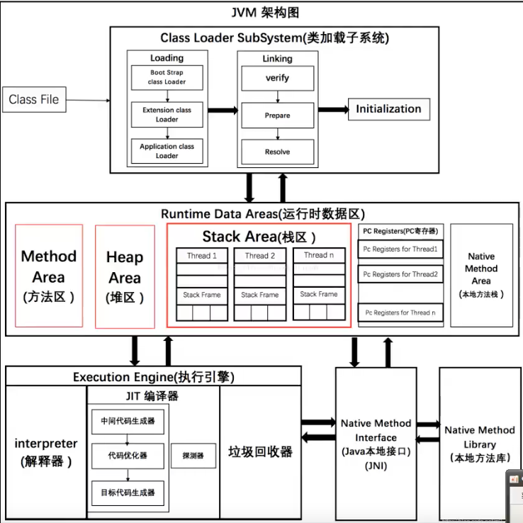

**（1）第一个部分**， class files 在 Java 中 class 文件是由源码文件构成的。

**（2）类加载子系统**： class 文件加载到内存中需要接触 Java 中的类加载机制分为装载，链接和初始化，它主要就是对类进行查找、验证以及分配对相关内存空间和赋值。

> 加载将类的.class文件中的二进制数据读入内存，放在运行时区域的方法区内
> 验证阶段作用是保证Class文件的字节流包含的信息符合JVM规范
> 准备阶段为变量分配内存并设置类变量的初始化
> 解析过程是将常量池内的符号引用替换成直接引用
> 初始化，则是为标记为常量值的字段赋值的过程

**类装载的时机**

- new一个对象时
- 使用反射创建它的实例时
- 子类被加载时，如果父类还没有加载，就先加载父类
- JVM启动时，执行主类会先被加载

**（3）运行时数据区**

它解决的问题是 class 文件进入到内存之后该如何进行存储不同的数据以及数据该如何进行流转？

1.方法区（线程共享）：每次方法调用都会创建一个**「栈帧」**。元空间和永久代是方法区的实现

- 线程共享区域，因此这是**线程不安全**的区域。
- 栈帧：存储**虚拟机加载的类相关信息、常量、静态变量**、**即时编译器编译后的代码**等数据。
- 当方法区无法满足内存分配需求时，将抛出OutOfMemoryError异常。

2.堆区（线程共享，JVM调优）：

- 线程共享区域，因此是**线程不安全**的。

- 存储的是我们**new来的对象**，不存放基本类型和对象引用。
- 能够发生OutOfMemoryError。

其实，Java堆区还可以划分为**新生代和老年代**，新生代又可以进一步划分为Eden区、Survivor 1区、Survivor 2区。

3.虚拟机栈区：

- **线程私有**，它的生命周期与线程相同
- 每个方法被执行的时候都会同时创建一个**栈帧**（Stack Frame）用于存储**局部变量表、操作栈、动态链接、方法出口等信息**（存放基本数据类型（boolean、byte、char、short、int、float、long、double）以及**对象的引用**）
- 如果线程请求的栈深度**大于**虚拟机所允许的深度，将抛出**StackOverflowError异常**；如果虚拟机栈可以动态扩，当扩展时**无法申请到足够的内存时**会抛出**OutOfMemoryError异常**。

4.本地方法栈：

与虚拟机栈类似。其区别不过是虚拟机栈为虚拟机执行Java方法（也就是字节码）服务，而本地方法栈则是为虚拟机使用到的**Native方法**服务。

5.程序计数器：

**记录当前线程所执行的位置**。 这样，当**线程重新获得CPU的执行权**的时候，就直接从记录的位置开始执行，分支、循环、跳转、异常处理也都依赖这个程序计数器来完成。

（4）执行引擎：

**JIT编译器**：JIT优化能够将热点代码缓存下来，下次就可以继续调用，提高效率；

**垃圾回收器**就是对运行的数据池中的数据进行**管理和回收**。回收机制可以基于不同的垃圾收集器，比如说 serial， parallel，**CMS，G1**，ZGC 等等，可以针对不同业务场景去选择不同的收集器，只需要通过 jvm 参数设置即可。并且它们核心的算法有三个，第一个是复制，第二个是标记清除，第三个是标记整理。

（5）JNI：

> Java早期，C，C++主流，想要立足，必须调用C，C++的程序
> 它在内存中专门开启开辟一块**标记区域：本地方法栈**，登记native方法
> 在最终执行的时候，通过**JNI加载本地方法库**的方法。

（6）本地方法库

通过官网给出的 hotspot 架构图，我们就能够知道 jvm 的底层是如何运行的？当然在实际的操作过程中，我们可以去借助一些 jvm 参数和一些常见的 JDK 常见命令。我们就可以去优雅地分析 JVM 出现的常见问题，并对其进行优雅的调优。

## JMM( Java内存模型)⭐️

使用高速缓存解决了 CPU 和主存速率不匹配的问题，但同时又引入另外一个新问题：缓存一致性问题。

进一步提升 CPU 的执行效率呢？答案是：处理器优化。


1.**概念**

Java内存模型

Java内存模型的三大特性：原子性、可见性、有序性

2.**干嘛**

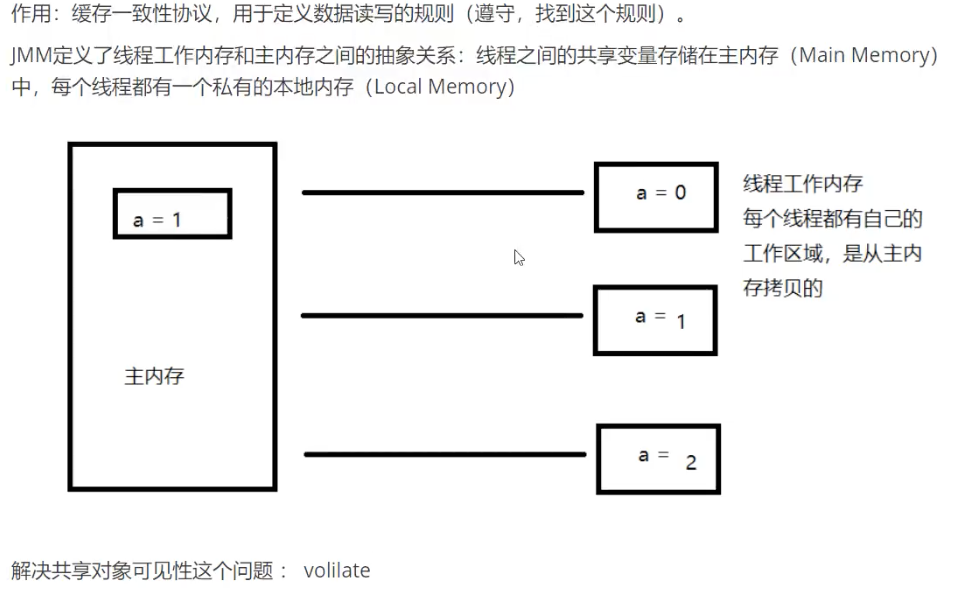

3.**怎么用**

规则

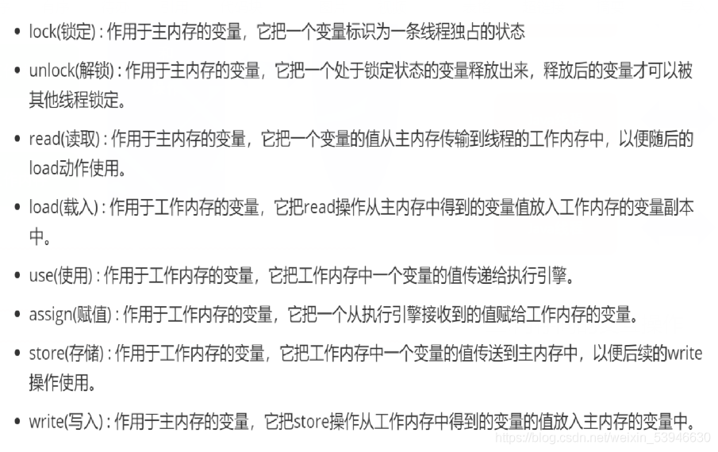

### happensbefore八大原则

【原则一】程序次序规则

【原则二】volatile变量规则

【原则三】传递规则

【原则四】锁定规则

线程启动规则

线程终结规则

线程中断规则

对象终结原则

## 类的加载

### 类加载过程⭐️

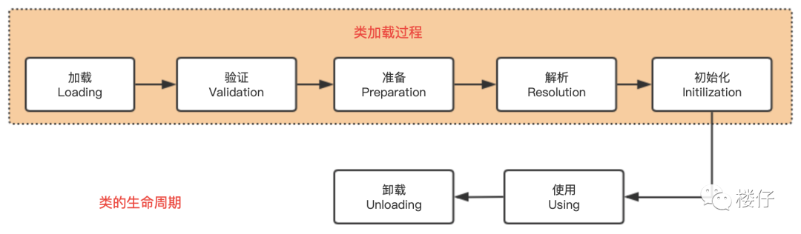

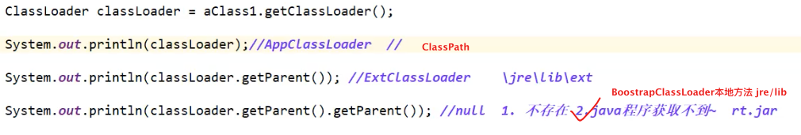

> 类是模板，实例是具体的。
> 实例的地址在栈区（值引用），具体数据在堆区。
>
> 加载将类的.class文件中的二进制数据读入内存，放在运行时区域的方法区内
> 验证阶段作用是保证Class文件的字节流包含的信息符合JVM规范
> 准备阶段为变量分配内存并设置类变量的初始化
> 解析过程是将常量池内的符号引用替换成直接引用
> 初始化，则是为标记为常量值的字段赋值的过程

### Java类加载器⭐️

JDK自带有三个类加载器：bootstrap ClassLoader、ExtClassLoader、AppClassLoader。 

BootStrapClassLoader是ExtClassLoader的父类加载器，默认负责加载**%JAVA_HOME%lib**下的jar包和class文件。 

ExtClassLoader是AppClassLoader的父类加载器，负责加载**%JAVA_HOME%/lib/ext**文件夹下的jar包和 class类。 

AppClassLoader是**自定义类加载器的父类**，负责加载**classpath**下的类文件。是**系统类加载器**，还是**线程上下文加载器** 

继承ClassLoader实现**自定义类加载器**

### **双亲委派机制** ⭐️

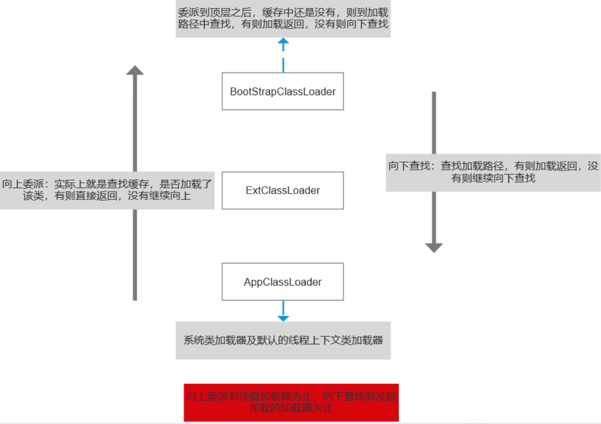   

双亲委派模型的好处： 

- 主要是为了**安全性**，避免用户自己编写的类动态替换 Java的一些核心类，比如 String。 （自定义Java开头的类不会加载）
- 同时也**避免了类的重复加载**，因为 JVM中区分不同类，不仅仅是根据类名，**相同的 class文件被不同的 ClassLoader加载就是不同的两个类** 

> 要是向下查找到AppCLassLoader还是没有，会报没有找到类

##### 能不能自己写个类，也叫java.lang.String？ 

**可以，但是即使你写了这个类，也没有用。**这个问题涉及到加载器的委托机制，在类加载器的结构图（在下面）中，BootStrap是顶层父类，ExtClassLoader是BootStrap类的子类，ExtClassLoader又是AppClassLoader的父类这里以java.lang.String为例，当我是使用到这个类时，Java虚拟机会将java.lang.String类的字节码加载到内存中。

**为什么只加载系统通过的java.lang.String类而不加载用户自定义的java.lang.String类呢？**

因加载某个类时，优先使用父类加载器加载需要使用的类。如果我们自定义了java.lang.String这个类，加载该自定义的String类，该自定义String类使用的加载器是AppClassLoader，根据优先使用父类加载器原理，AppClassLoader加载器的父类为ExtClassLoader，所以这时加载String使用的类加器是ExtClassLoader，
但是类加载器ExtClassLoader在jre/lib/ext目录下没有找到String.class类。然后使用ExtClassLoader父类的加载器BootStrap，父类加载器BootStrap在JRE/lib目录的rt.jar找到了String.class，将其加载到内存中。这就是类加载器的委托机制。

## 垃圾回收


### JVM堆内存

#### 堆内存结构⭐️

一个JVM只有一个堆内存

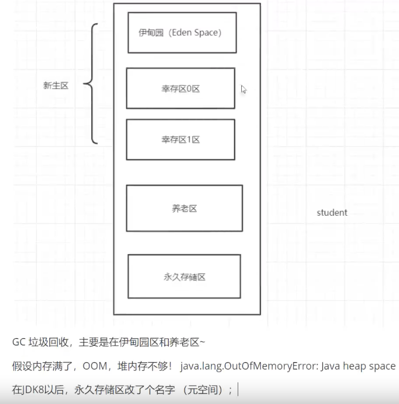

> 幸存0区，幸存1区会动态交换
>
> **堆内存占比**：年轻代占堆内存1/3，老年代占堆内存2/3。Eden区占年轻代8/10，Survivor区占年轻代2/10（其中From 和To 各站1/10)
>
> 年轻代：
>
> 1、新生成的对象
>
> 老年代：
>
> 1、长期存活的对象。
>
> 2、Survivor区**放不下**的对象。
>
> 3、新生成的**大对象**（[字符串](https://so.csdn.net/so/search?q=字符串&spm=1001.2101.3001.7020)与数组），即超过了设定的值的对象，直接在老年代中分配。

**永久区**（不存在垃圾回收）

> 方法区和永久代的关系很像Java中接口和类的关系

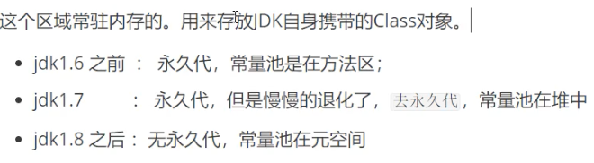

> 永久代是在JVM分配的内存中，本身是设置好的固定大小上限，无法改变，所以溢出的可能性比较大。Java8开始把这一部分（永久区）移到了本机内存，也就是元空间的大小只受本机内存的限制，虽然元空间仍旧可能溢出，但是比原来出现的几率会更小。
>
> 逻辑上存在，物理上不存在（JVM内存 = 新生代+老年代，不包括元空间）

#### GC类型⭐️

- Minor GC/Young GC：针对**新生代**的垃圾收集；
- Major GC/Old GC：针对**老年代**的垃圾收集。
- Full GC：针对整个**Java堆以及方法区**的垃圾收集。

#### Minor GC⭐️

通常情况下，初次被创建的对象存放在新生代的Eden区，当第一次触发Minor GC(**当Eden区满了**)，Eden区存活的对象被转移到Survivor区的某一块区域。以后再次触发Minor GC的时候，**Eden区的对象连同一块Survivor区**的对象一起，被转移到了另一块Survivor区。可以看到，**这两块Survivor区我们每一次只使用其中的一块**，这样也仅仅是浪费了一块Survivor区。

- 死亡
- 进入幸存区
- 达到15次GC后，进入养老区

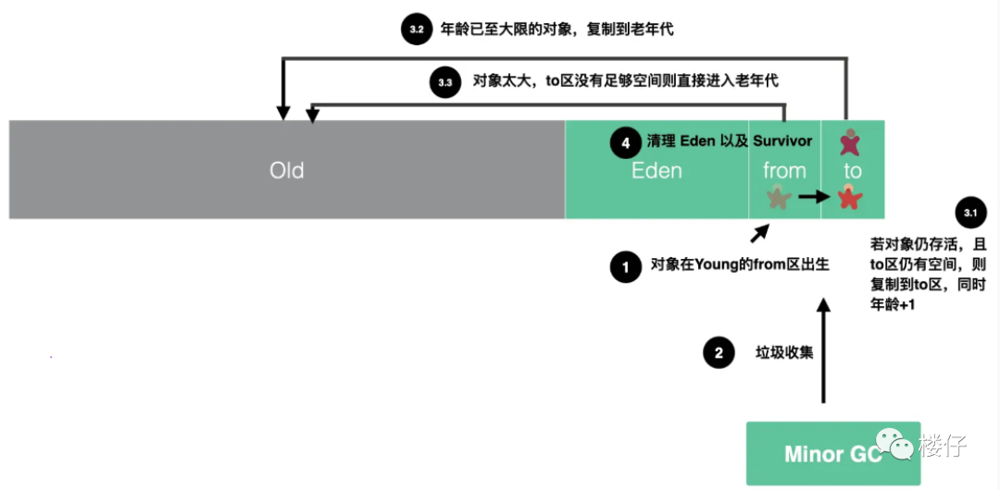


####  Major GC  ⭐️

1. 对于一个大对象，我们会首先在Eden 尝试创建，如果**创建不了**，就会触发Minor GC 
2. 随后继续尝试在Eden区存放，发现仍**然放不下**
3. 尝试直接进入老年代，老年代也**放不下**
4. 触发 **Major GC** 清理老年代的空间
5. 放的下 成功
6. 放不下 OOM

#### Full GC⭐️

老年代是存储长期存活的对象的，**养老区占满**时就会触发我们最常听说的Full GC，期间**会停止所有线程，直到GC的完成**。所以对于响应要求高的应用应该尽量去减少发生Full GC从而避免响应超时的问题。

#### 内存抖动

内存抖动：指在短时间内有大量的对象被创建或者被回收的现象。

内存抖动产生**原因**:主要是频繁(很重要)在循环里创建对象(导致大量对象在短时间内被创建；

频繁内存抖动会导致垃圾回收频繁运行,造成系统卡顿。

#### 卡表

**什么是card table**【卡表】：空间换时间（类似bitmap），能够**避免扫描老年代的所有对象**进而顺利进行Minor GC （案例：老年代对象持有年轻代对象引用）

堆内存」的每一小块区域形成「卡页」，卡表实际上就是卡页的集合。当判断一个卡页中有存在对象的跨代引用时，将这个页标记为「脏页」，那知道了「卡表」之后，就很好办了。每次Minor GC 的时候只需要去「卡表」找到「脏页」，找到后加入至GC Root，而不用去遍历整个「老年代」的对象了。

#### 为什么分代

“*分代的唯一的理由就是优化GC性能。*如果没有分代,那么所有的对象都放在一起,GC的时候需要找到哪些对象没用,这样**需要对整个堆区进行扫描**。而大部分对象都死得早，只有少部分对象会存活很长时间，把新创建的对象放到某一个地方,当GC的时候先把这块死得早的对象的区域进行回收,就能够腾出很大的空间出来。

### GC如何判断对象可以被回收⭐️

（1）引用计数法：每个对象有一个引用计数属性，新增一个引用时计数加1，引用释放时计数减1，计数为0时可以回收， 

（2）可达性分析法：从 GC Roots 开始向下搜索，搜索所走过的路径称为引用链。当一个对象到 GC Roots 没有任何引用链相连时，则证明此对象是不可用的，那么虚拟机就判断是可回收对象。 

 GC Roots => A => B，A，B不能回收

> 引用计数法，可能会出现A 引用了 B，B 又引用了 A，这时候就算他们都不再使用了，但因为相互引用 ，计数器=1 永远无法被回收。

**GC Roots的对象**有： 

- **方法区中类静态属性**引用的对象 ，**常量**引用的对象 

- **虚拟机栈**(栈帧中的本地变量表）中引用的对象 ,add(){new user}
- **本地方法栈中**JNI(即一般说的Native方法)引用的对象

可达性算法中的不可达对象并不是立即死亡的，对象拥有一次自我拯救的机会

> 当对象变成(GC Roots)**不可达时**，GC会判断该对象是否覆盖了finalize方法，**若未覆盖，则直接将其回收**。否则，若对象未执行过finalize方法，将其**放入F-Queue队列**，由一**低优先级线程**执行该队列中对象的finalize方法。执行finalize方法完毕后，GC会**再次判断该对象是否可达**，若不可达，则进行回收，否则，对象“复活” 。

每个对象只能触发一次finalize()方法 ，由于finalize()方法**运行代价高昂，不确定性大，无法保证各个对象的调用顺序**，不推荐大家使用，建议遗忘它。jdk1.9已经遗弃

### 垃圾回收算法⭐️

#### 复制算法

> 优点：没有内存碎片。优化了标记/清除算法的效率低、内存碎片多，假设对象100%存活（极端）
>
> 缺点：**浪费了一半的内存空间**，代价太高
>
> 场景：对象存活度较低；新生区～

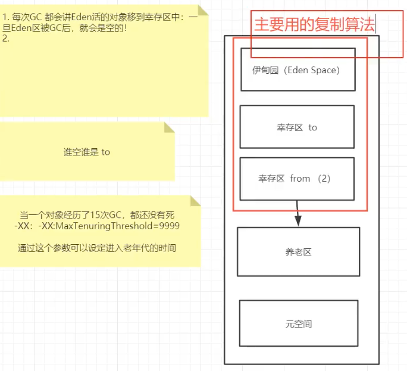

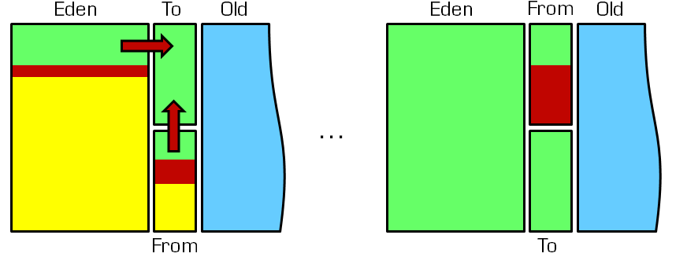

> 具体是GC多少次进入老年代，可以通过JVM参数“-XX:MaxTenuringThreshold”来设置，默认是15岁

#### 标记清除

> 优点：不需要额外空间
>
> 缺点：2次扫描，浪费时间；**会产生内存碎片**

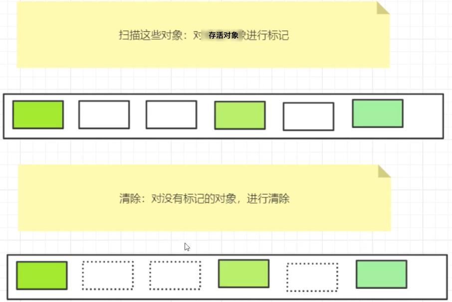

#### 标记（清除）整理

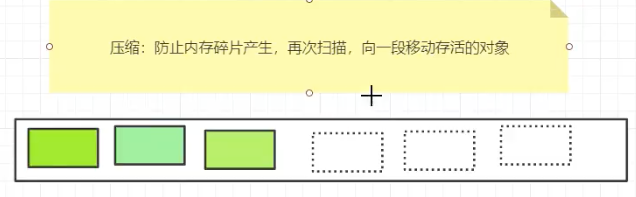

#### 总结

速度：复制算法>标记清除>标记整理

内存整齐度：复制算法=标记整理>标记清除

内存利用率：标记整理 = 标记清除 > 复制算法

> 没有最好的算法，只有最合适的算法

**GC：分代收集算法**

新生代：复制算法

老年代：标记整理（**标记清除几次，再一次整理**）

### 7种垃圾收集器⭐️

#### （1）Serial收集器

Serial收集器是最基础、历史最悠久的收集器，是一个单线程工作的收集器，使用 Serial收集器，无论是进行 Minor gc 还是 Full GC ，清理堆空间时，所有的应用线程都会被暂停。

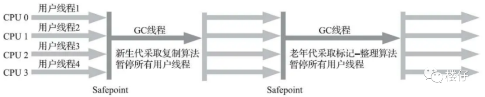

#### （2）ParNew收集器

ParNew  收集器实质上是 Serial 收集器的多线程并行版本，除了同时使用多条线程进行垃圾收集之外，其余的行为包括 Serial  收集器可用的所有控制参数、收集算法、Stop The World、对象分配规则、回收策略等都与 Serial 收集器完全一致。

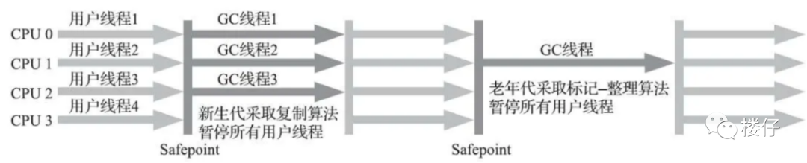

#### （3）Parallel Scavenge收集器

Parallel Scavenge收集器也是一款新生代收集器，基于标记——复制算法实现，能够并行收集的多线程收集器和 ParNew 非常相似。

Parallel  Scavenge  收集器的目标则是达到一个可控制的吞吐量（Throughput）。所谓吞吐量就是处理器用于运行用户代码的时间与处理器总消耗时间的比值。如果虚拟机完成某个任务，用户代码加上垃圾收集总共耗费了100分钟，其中垃圾收集花掉1分钟，那吞吐量就是99%。

> Parallel Scavenge 收集器提供了两个参数用于精确控制吞吐量，分别是控制最大垃圾收集停顿时间的 -XX：MaxGCPauseMillis 参数和直接设置吞吐量大小的**-XX：GCTimeRatio** 参数。

#### （4）Serial Old收集器

Serial Old是Serial收集器的老年代版本，它同样是一个单线程收集器，使用标记-整理算法。


#### （5）Parallel Old收集器

Parallel Old是Parallel Scavenge收集器的老年代版本，支持多线程并发收集，基于标记-整理算法实现。

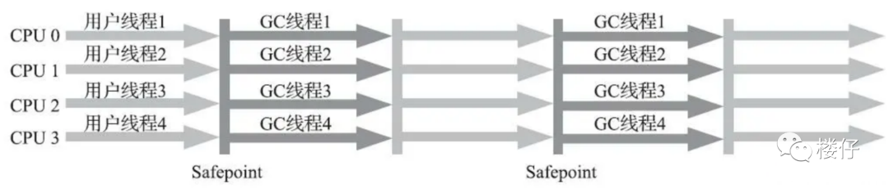

#### （6）CMS收集器

CMS 收集器设计的初衷是为了消除 Parallel 收集器和 Serial 收集器 Full gc 周期中的长时间停顿。CMS收集器在 Minor gc 时会暂停所有的应用线程，并以多线程的方式进行垃圾回收。

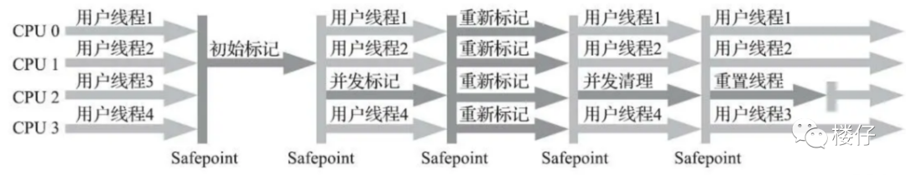

#### （7）Garbage First收集器（G1）

在G1收集器出现之前的所有其他收集器，包括CMS在内，垃圾收集的目标范围要么为整个新生代（MinorGC），要么就是整个老年代（Major GC），再要么就是整个Java堆（Full GC）。而G1垃圾收集器使用Mixed GC模式可以面向堆内存任何部分来组成回收集（Collection Set，一般简称为Cset）进行回收，衡量标准不再是它属于哪个年代，而是哪块内存中存放的垃圾数最多，回收收益最大。


#### 垃圾收集器对比

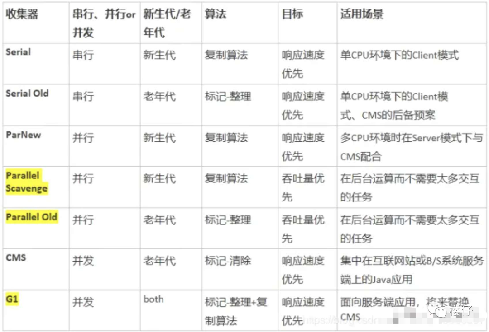

#### 总结⭐️

- **新生代用“复制算法”，老年代基本用“标记-整理”算法**，有的也用“标记-清除”算法（新生代因为有surive区域，所以肯定使用的“复制算法”，老年代不可能划分成2个区域，所以肯定不会使用“复制算法”）；
- **单线程**垃圾回收器：Serial、Serial Old；
- **多线程**垃圾回收器：ParNew、Parallel Old、Pararrel Scavenge和G1；
- 适用**新生代**的垃圾回收器：Serial、ParNew、Pararrel Scavenge和G1；
- 适用**老年代**的垃圾回收器：Serial Old、Parallel Old和G1。

#### G1与CMS的区别⭐️


## JDK监控和故障处理工具

#### Jconsole

从java5开始，在JDK中自带的java监控和管理控制台，**用于对JVM中内存，线程和类等的监控**。

概览：包括堆内存使用情况、线程、类、CPU使用情况四项信息的曲线图。

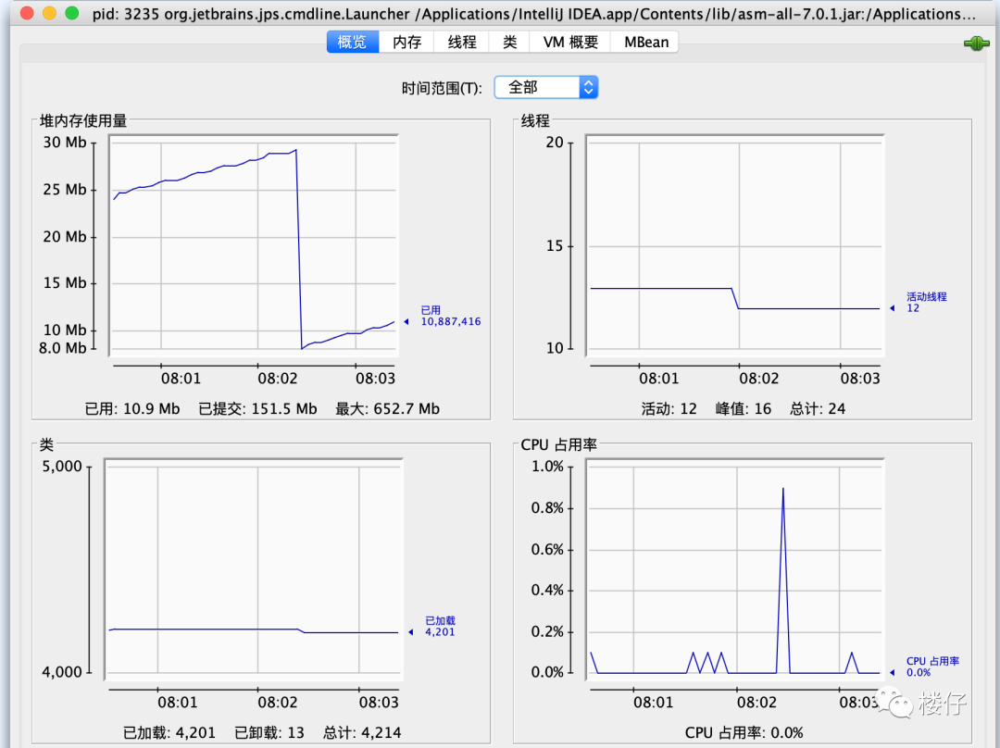

线程：相当于可视化的jstack命令，同时也可以点击“检测死锁”来检查线程之间是否有死锁的情况。

> jstack用于生成java虚拟机当前时刻的线程快照。**线程快照是当前java虚拟机内每一条线程正在执行的方法堆栈的集合**，生成线程快照的主要目的是**定位线程出现长时间停顿的原因**，如线程间死锁、死循环、请求外部资源导致的长时间等待等。线程出现停顿的时候通过jstack来查看各个线程的调用堆栈，就可以知道没有响应的线程到底在后台做什么事情，或者等待什么资源。	

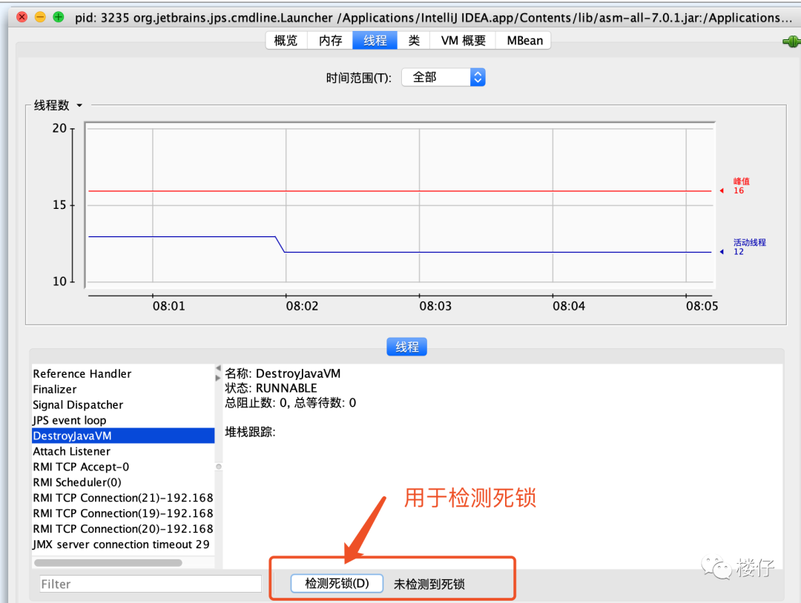

#### OOM异常怎么解决（Jprofiler）⭐️

> JVM堆内存。默认情况：分配内存是电脑内存的1/4，初始内存是1/64

1.手动扩大堆内存，查看结果

> -Xms1024m  初始内存是1/64
>
> -Xmx1024m 分配最大内存默认是电脑内存的1/4
>
> -XX:+PrintGCDetails
>
> -XX:+PrintGCOnOutOfMemoryError

如果调大之后还是OOM

2.分析heapDump文件，看下那个地方出现问题

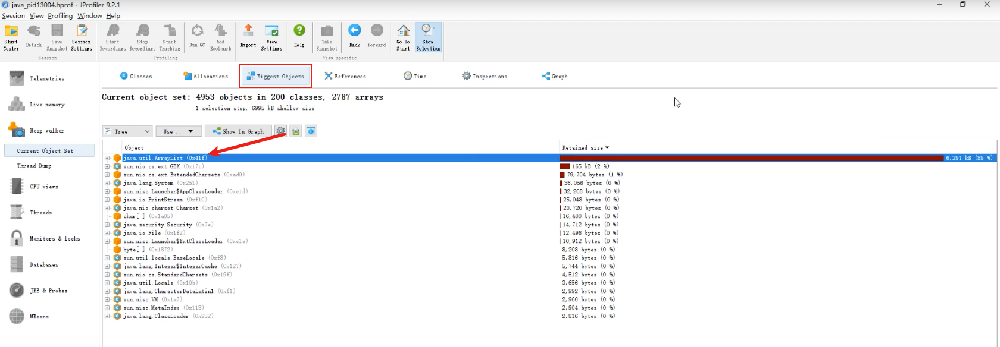

1）查看最大对象

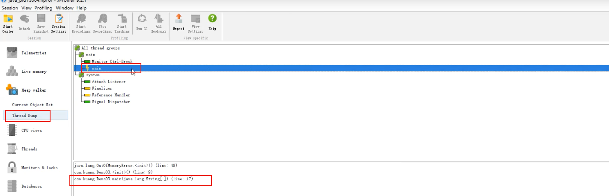

2）查看ThreadDump，查看哪一行代码有问题。

## JVM调优

#### 选择合适的垃圾回收器⭐️

- CPU**单核**，那么毫无疑问**Serial 垃圾收集器**是你唯一的选择。
- CPU多核，关注吞吐量 ，那么选择**PS+PO组合**。
- CPU多核，关注用**户停顿时间**，JDK版本1.6或者1.7，那么选择**CMS**。
- CPU多核，关注用户停顿时间，JDK1.8及以上，JVM可用内存6G以上，那么选择**G1**。

参数配置：

```java
 //设置Serial垃圾收集器（新生代）
 开启：-XX:+UseSerialGC
 
 //设置PS+PO,新生代使用功能Parallel Scavenge 老年代将会使用Parallel Old收集器
 开启 -XX:+UseParallelOldGC
 
 //CMS垃圾收集器（老年代）
 开启 -XX:+UseConcMarkSweepGC
 
 //设置G1垃圾收集器
 开启 -XX:+UseG1GC
```

#### 调整内存大小⭐️

```java
 //设置堆初始值
 指令1：-Xms2g
 
 //设置堆区最大值
 指令1：-Xmx2g
 
 //新生代内存配置
 指令1：-Xmn512m
```

设定新生代大小。 **新生代不宜太小，否则会有大量对象涌入老年代**

```java
-XX:NewSize：新生代大小
-XX:NewRatio 新生代和老生代占比 默认1:2
-XX:SurvivorRatio：伊甸园空间和幸存者空间的占比：默认6:1
```

#### STW

所有GC都有可能

STW是[JVM](https://so.csdn.net/so/search?q=JVM&spm=1001.2101.3001.7020)在后台自动发起和自动完成的。在用户不可见的情况下，把用户正常的工作线程全部停掉。开发中采用System.gc（）；会导致Stop一the一world的发生。

G1也会，只能缩短STW的时间

#### JVM内存屏障

- Store：将处理器缓存的数据刷新到内存中。
- Load：将内存存储的数据拷贝到处理器的缓存中。

LoadLoad屏障：对于这样的语句Load1; LoadLoad; Load2，在Load2及后续读取操作要读取的数据被访问前，保证Load1要读取的数据被读取完毕。

StoreStore屏障：对于这样的语句Store1; StoreStore; Store2，在Store2及后续写入操作执行前，保证Store1的写入操作对其它处理器可见。

LoadStore屏障：对于这样的语句Load1; LoadStore; Store2，在Store2及后续写入操作被刷出前，保证Load1要读取的数据被读取完毕。

StoreLoad屏障：对于这样的语句Store1; StoreLoad; Load2，在Load2及后续所有读取操作执行前，保证Store1的写入对所有处理器可见。它的开销是四种屏障中最大的。在大多数处理器的实现中，这个屏障是个万能屏障，兼具其它三种内存屏障的功能

## JVM调试实战

### 网站流量浏览量暴增后，网站反应页面响很慢

1、问题推测：在测试环境测速度比较快，但是一到生产就变慢，所以推测可能是因为垃圾收集导致的业务线程停顿。

2、定位：为了确认推测的正确性，在线上通过jstat -gc 指令 看到JVM进行GC 次数频率非常高，GC所占用的时间非常长，所以基本推断就是因为GC频率非常高，所以导致业务线程经常停顿，从而造成网页反应很慢。

3、解决方案：因为网页访问量很高，所以对象创建速度非常快，导致堆内存容易填满从而频繁GC，所以这里问题在于新生代内存太小，所以这里可以增加JVM内存就行了，所以初步从原来的2G内存增加到16G内存。

4、第二个问题：增加内存后的确平常的请求比较快了，但是又出现了另外一个问题，就是不定期的会间断性的卡顿，而且单次卡顿的时间要比之前要长很多。

5、问题推测：练习到是之前的优化加大了内存，所以推测可能是因为内存加大了，从而导致单次GC的时间变长从而导致间接性的卡顿。

6、定位：还是通过jstat -gc 指令 查看到 的确FGC次数并不是很高，但是花费在FGC上的时间是非常高的,根据GC日志 查看到单次FGC的时间有达到几十秒的。

7、解决方案： 因为JVM默认使用的是PS+PO的组合，PS+PO垃圾标记和收集阶段都是STW，所以内存加大了之后，需要进行垃圾回收的时间就变长了，所以这里要想避免单次GC时间过长，所以需要更换并发类的收集器，因为当前的JDK版本为1.7，所以最后选择CMS垃圾收集器，根据之前垃圾收集情况设置了一个预期的停顿的时间，上线后网站再也没有了卡顿问题。

### 后台导出数据引发的OOM

**问题描述：**公司的后台系统，偶发性的引发OOM异常，堆内存溢出。

1、因为是偶发性的，所以第一次简单的认为就是堆内存不足导致，所以单方面的加大了堆内存从4G调整到8G。

2、但是问题依然没有解决，只能从堆内存信息下手，通过开启了-XX:+HeapDumpOnOutOfMemoryError参数 获得堆内存的dump文件。

3、VisualVM  对   堆dump文件进行分析，通过VisualVM查看到占用内存最大的对象是String对象，本来想跟踪着String对象找到其引用的地方，但dump文件太大，跟踪进去的时候总是卡死，而String对象占用比较多也比较正常，最开始也没有认定就是这里的问题，于是就从线程信息里面找突破点。

4、通过线程进行分析，先找到了几个正在运行的业务线程，然后逐一跟进业务线程看了下代码，发现有个引起我注意的方法，导出订单信息。

5、因为订单信息导出这个方法可能会有几万的数据量，首先要从数据库里面查询出来订单信息，然后把订单信息生成excel，这个过程会产生大量的String对象。

6、为了验证自己的猜想，于是准备登录后台去测试下，结果在测试的过程中发现到处订单的按钮前端居然没有做点击后按钮置灰交互事件，结果按钮可以一直点，因为导出订单数据本来就非常慢，使用的人员可能发现点击后很久后页面都没反应，结果就一直点，结果就大量的请求进入到后台，堆内存产生了大量的订单对象和EXCEL对象，而且方法执行非常慢，导致这一段时间内这些对象都无法被回收，所以最终导致内存溢出。

7、知道了问题就容易解决了，最终没有调整任何JVM参数，只是在前端的导出订单按钮上加上了置灰状态，等后端响应之后按钮才可以进行点击，然后减少了查询订单信息的非必要字段来减少生成对象的体积，然后问题就解决了。