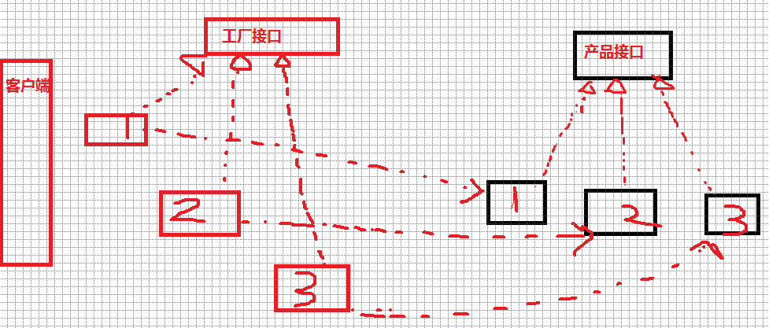

## 设计模式

可参考：

概念？

> 代表了最佳的实践。它是众多软件开发人员经过相当长的一段时间的试验总结出来的。是一套被反复使用的、多数人知晓的、经过分类编目的、代码设计经验的总结。

为什么需要？

> 为了重用代码、让代码更容易被他人理解、保证代码可靠性。

### 六大设计原则

- 单一原则：一个类或者一个方法只负责一项职责。
- 里氏替换原则：子类可以扩展父类的功能，但不能改变原有父类的功能。
- 依赖倒置原则：面向接口编程（变量或者传参数，尽量使用抽象类，或者接口)
- 接口隔离原则：建立单一接口（复杂的接口，根据业务拆分成多个简单接口）
- 迪米特原则：最少知道原则，尽量降低类与类之间的耦合，一个对象应该对其他对象有最少的了解。
- 开闭原则：对扩展开放，对修改闭合

### 1.单例模式⭐️

> 控制资源的使用，某个类只能有一个实例，提供一个全局的访问点。
>
> 优点：控制资源的使用，节省内存，加快对象访问速度
>
> 缺点：单例类的职责过重，在一定程度上违背了“单一职责原则”。 

手写双重检验单例模式 懒汉式，DCL


### （1）饿汉式（推荐）

```java
public class Singleton{
    private static Singleton singleton = new Singleton(); //私有化实例
    private Singleton(){}	//私有化构造方法
    public static Singleton getSingleton(){
        return singleton;
    }
}
//缺点：由于instance的初始化是在类加载时进行的，类加载是由ClassLoader来实现的，如果初始化太早，就会造成资源浪费。
//当然，如果所需的单例占用的资源很少，这种实现也可以的
```

### （2）懒汉式

```java
//懒汉式(线程不安全)
public class Singleton{
    private static Singleton singleton = null;
    private Singleton(){}
    public static Singleton getSingleton(){
        if(singleton == null){
          //缺点：如果有两个线程同时运行到 if (singleton == null)，都判断为null
            singleton = new Singleton();
        }
        return singleton;
    }
}
```

```java
//给类对象加锁
public class Singleton{
    private volatile static Singleton singleton;	//对其他线程可见volatile
    private Singleton(){}
    public static Singleton getSingleton(){
      synchronized (Singleton.class) {//类对象加锁
        if(singleton == null){
          singleton = new Singleton();
        }
      }
        return singleton;
    }
}
```

```java
//双重校验单例模式(DCL)：
public class Singleton{
    private volatile static Singleton singleton;	//注意
    private Singleton(){}
    public static Singleton getSingleton(){
        if(singleton == null){	//双重校验
            synchronized (Singleton.class) {
                if(singleton == null){	//双重校验
                    singleton = new Singleton();
                }
            }
        }
        return singleton;
    }
}
```

> 如果有两个线程同时运行到 if (singleton == null)，都判断为null，最终两个线程就各自会创建一个实例出来。
>
> 所以需要加上synchronized关键字之后，getInstance方法就会锁上了。但是，这种写法虽然避免了可能会出现的多个实例问题，但是会强制除T1之外的所有线程等待，影响程序效率，于是有了双重校验的单例模式。
>
> 第一个 if(instance==null)，其实是为了解决代码二中的效率问题，只有instance为null的时候才进入synchronized的代码段大大减少了几率。
>
> 第二个if(instance==null)，则是为了防止可能出现多个实例的情况。
>
> 缺点：    第一次加载时反应不快，由于java内存模型一些原因偶尔失败 

### （3）静态内部类

```java
public class Singleton {
  private static class SingletonHolder {	//内部类SingletonHolder
    private static final Singleton INSTANCE = new Singleton();//饿汉式
  }	//注意static final 
  private Singleton (){}
  public static final Singleton getInstance() {	//外部类调用时才加载，懒汉式
  	return SingletonHolder.INSTANCE;
  }
}
```

> 对于内部类SingletonHolder，它是一个饿汉式的单例实现。在SingletonHolder初始化的时候会由ClassLoader来保证同步，使INSTANCE是一个真单例。
>
> 同时，由于SingletonHolder是一个内部类，只在外部类的Singleton的getInstance()中被使用，所以它被加载的时机也就是在getInstance()方法第一次被调用的时候。
>
> 它利用了ClassLoader来保证了同步，同时又能让开发者控制类加载的时机。从内部看是一个饿汉式的单例，但是从外部调用看来，又的确是懒汉式的实现。
>
> 缺点：    第一次加载时反应不够快 

### （4）枚举

```java
public enum SingleInstance {
	INSTANCE;
  public void fun1() {
  // do something
  }
}

// 使用SingleInstance.INSTANCE.fun1();
```

>  **自动序列化机制**，保证了线程的绝对安全。
>
> **简单、高效、安全**。虽然这中方法还没有广泛采用，但是单元素的枚举类型已经成为实现Singleton的最佳方法。
>
> **序列化**是将一个对象转化为一个二进制表示的字节数组，通过保存或则转移这些二进制数组达到持久化的目的。

#### **使用场景**

- 线程池：httpsession，数据库，redis，MQ连接池
- Spring 的 ApplicationContext 创建的 **Bean** 实例都是单例对象，还有 **ServletContext**

> ⚠️Spring框架对单例的支持是采用**单例注册表的方式**进行实现的
>
> 饿汉和懒汉都有一个缺点，**单例不能被继承**。而*单例注册表*的构造函数是protected，可继承

- 网站的计数器
- 任务管理器
- 回收站

**Spring 实现单例的方式：**

- xml : `<bean id="userService" class="top.snailclimb.UserService" scope="singleton"/>`
- 注解：`@Scope(value = "singleton")`

### 2.简单工厂模式⭐️

> 一个工厂类根据**传入的参数决定**创建出那一种产品类的实例。（用来生产同一等级结构中的任意产品）
>
> 终极目的：**解耦：把对象的创建和使用的过程分开，并且大大简化了实例化时的初始化设置**
>
> 缺点：工厂类太简单——无法满足开闭原则，对多个产品的扩展不利
>
> 一个工厂生产多个产品（塑料桌子，木质桌子等等）

#### 场景

Spring 中的 **BeanFactory** 使用简单工厂模式，根据传入一个唯一的标识来获得 Bean 对象。


栗子

```java
public class Client {
    public static void main(String[] args) {
    }

    //抽象产品
    public interface Product {
        void show();
    }

    //具体产品：ProductA
    static class ConcreteProduct1 implements Product {
        public void show() {
            System.out.println("具体产品1显示...");
        }
    }

    //具体产品：ProductB
    static class ConcreteProduct2 implements Product {
        public void show() {
            System.out.println("具体产品2显示...");
        }
    }

    final class Const {
        static final int PRODUCT_A = 0;
        static final int PRODUCT_B = 1;
        static final int PRODUCT_C = 2;
    }

    static class SimpleFactory {
        public static Product makeProduct(int kind) {
            switch (kind) {
                case Const.PRODUCT_A:
                    return new ConcreteProduct1();
                case Const.PRODUCT_B:
                    return new ConcreteProduct2();
            }
            return null;
        }
    }
}
```

### 3.工厂方法模式⭐️

> 工厂方法模式，有了进步，把工厂类进行改进，提升为一个抽象类（接口），把对具体产品的实现交给对应的具体的子类去做，**解耦**多个产品之间的业务逻辑。（用来生产同一等级结构中的固定产品）
>
> 对应工厂生产对应产品。（工厂抽象）
>
> 例子：塑料桌子工厂，木质桌子工厂
>

#### 场景

MyBatis中使用的比较多，**事务模块和数据源模块**都使用了工厂方法模式。

Spring 的 **FactoryBean** 接口的 `getObject` 方法也是工厂方法



```java
package FactoryMethod;

public class AbstractFactoryTest {
    public static void main(String[] args) {
        try {
            AbstractFactory af = new ConcreteProduct1();
            Product a = af.newProduct();
            a.show();
        } catch (Exception e) {
            System.out.println(e.getMessage());
        }
    }
}

//抽象产品：提供了产品的接口
interface Product {
    public void show();
}

//具体产品1：实现抽象产品中的抽象方法
class ConcreteProduct1 implements Product {
    public void show() {
        System.out.println("具体产品1显示...");
    }
}

//具体产品2：实现抽象产品中的抽象方法
class ConcreteProduct2 implements Product {
    public void show() {
        System.out.println("具体产品2显示...");
    }
}

//抽象工厂：提供了厂品的生成方法
interface AbstractFactory {
    public Product newProduct();
}

//具体工厂1：实现了厂品的生成方法
class ConcreteFactory1 implements AbstractFactory {
    public Product newProduct() {
        System.out.println("具体工厂1生成-->具体产品1...");
        return new ConcreteProduct1();
    }
}

//具体工厂2：实现了厂品的生成方法
class ConcreteFactory2 implements AbstractFactory {
    public Product newProduct() {
        System.out.println("具体工厂2生成-->具体产品2...");
        return new ConcreteProduct2();
    }
}
```

### 4.抽象工厂模式

> 前面都是针对一个产品族的设计，如果有多个产品族的话，就可以使用抽象工厂模式。（用来生产不同产品族的全部产品）**目标是一套产品：塑料桌子和木质椅子**，塑料桌子和塑料椅子等等。
>
> 对应工厂生产对应产品。此时（产品再抽象）
>
> 抽象工厂，具体工厂；抽象产品，具体产品


#### 场景

java.sql.**Connection** 接口就是一个抽象工厂，其中包括很多抽象产品如 **Statement**、Blob、Savepoint 等

**区别**


> 简单工厂 ： 用来生产同一等级结构中的任意产品。（对于增加新的产品，无能为力）
>
>  工厂方法 ：用来生产同一等级结构中的固定产品。（支持增加任意产品）   
>  抽象工厂 ：用来生产不同产品族的全部产品。（对于增加新的产品，无能为力；支持增加产品族）    

**共同目的**

> 解耦

### 5.代理模式⭐️


> 概念：为其他对象提供一个代理以便控制这个对象的访问。
>
> 作用：中介隔离作用。开闭原则，增加功能
>
> 假如说我现在想买一辆二手车，虽然我可以自己去找车源，做质量检测等一系列的车辆过户流程，但是这确实太浪费我得时间和精力了。我只是想买一辆车而已为什么我还要额外做这么多事呢？于是我就通过中介公司来买车，他们来给我找车源，帮我办理车辆过户流程，我只是负责选择自己喜欢的车，然后付钱就可以了。
>
> **对象：抽象角色，代理角色和真实角色**。
>
> 优点：能将代理对象与真实被调用的目标对象**分离**，**可以对目标对象的功能增强**。
>
> 缺点：**1）代码冗余。2）不易维护**。一旦接口增加方法，目标对象与代理对象都要进行修改

#### 静态代理VS动态代理

所谓静态代理中的“静”字，无非就是**代理类的创建时机不同**罢了。
**（1）灵活性** ：动态代理更加灵活，**不需要必须实现接口，可以直接代理实现类**，并且可以不需要针对每个目标类都创建一个代理类。另外，静态代理中，接口一旦新增加方法，目标对象和代理对象都要进行修改，这是非常麻烦的！

**（2）JVM 层面** ：静态代理在**编译时**就将接口、实现类、代理类这些都变成了一个个实际的 class 文件。而动态代理是在**运行时**动态生成类字节码，并加载到 JVM 中的。

#### 静态代理

静态代理实现步骤:

1. 定义一个接口及其实现类；
2. 创建一个代理类同样实现这个接口
3. **将目标对象注入进代理类，然后在代理类的对应方法调用目标类中的对应方法**。这样的话，我们就可以通过代理类屏蔽对目标对象的访问，并且可以在目标方法执行前后做一些自己想做的事情。

##### **栗子**

**1.定义发送短信的接口**

```java
public interface SmsService {
    String send(String message);
}
```

**2.实现发送短信的接口**

```java
public class SmsServiceImpl implements SmsService {
    public String send(String message) {
        System.out.println("send message:" + message);
        return message;
    }
}
```

**3.创建代理类并同样实现发送短信的接口**

```java
public class SmsProxy implements SmsService {

    private final SmsService smsService;

    public SmsProxy(SmsService smsService) {
        this.smsService = smsService;
    }

    @Override
    public String send(String message) {
        //调用方法之前，我们可以添加自己的操作
        System.out.println("before method send()");
        smsService.send(message);
        //调用方法之后，我们同样可以添加自己的操作
        System.out.println("after method send()");
        return null;
    }
}
```

**4.实际使用**

```java
public class Main {
    public static void main(String[] args) {
        SmsService smsService = new SmsServiceImpl();
        SmsProxy smsProxy = new SmsProxy(smsService);
        smsProxy.send("java");
    }
}
```

运行上述代码之后，控制台打印出：

```bash
before method send()
send message:java
after method send()
```

可以输出结果看出，我们已经增加了 `SmsServiceImpl``send()`

#### JDK动态代理

> jdk动态代理模式是利用java中的**反射技术，在运行时动态创建代理类**。
>
> 基于动态jdk涉及到**两个核心的类Proxy类和一个 InvocationHandler接口。**
>
> **通过Proxy 类的 newProxyInstance() 创建的代理对象在调用方法的时候，实际会调用到实现InvocationHandler 接口的类的method.invoke()方法。** 你可以在 `invoke()` 方法中自定义处理逻辑，比如在方法执行前后做什么事情。
>
> **自定义 `InvocationHandler ` 并重写 `invoke` 方法**

`Proxy` 类中使用频率最高的方法是：`newProxyInstance()` ，这个方法主要用来生成一个代理对象。

```java
    public static Object newProxyInstance(ClassLoader loader,
                                          Class<?>[] interfaces,
                                          InvocationHandler h)
        throws IllegalArgumentException
    {
        ......
    }
```

这个方法一共有 3 个参数：

1. **loader** :类加载器，用于加载代理对象。
2. **interfaces** : 被代理类实现的一些接口；
3. **h** : 实现了 `InvocationHandler` 接口的对象；

要实现动态代理的话，还必须需要实现`InvocationHandler` 来自定义处理逻辑。 当我们的动态代理对象调用一个方法时，这个方法的调用就会被转发到实现`InvocationHandler` 接口类的 `invoke` 方法来调用。

```java
public interface InvocationHandler {

    /**
     * 当你使用代理对象调用方法的时候实际会调用到这个方法
     */
    public Object invoke(Object proxy, Method method, Object[] args)
        throws Throwable;
}
```

`invoke()` 方法有下面三个参数：

1. **proxy** :动态生成的代理类
2. **method** : 与代理类对象调用的方法相对应
3. **args** : 当前 method 方法的参数

##### **栗子**

**1.定义发送短信的接口**

```java
public interface SmsService {
    String send(String message);
}
```

**2.实现发送短信的接口**

```java
public class SmsServiceImpl implements SmsService {
    public String send(String message) {
        System.out.println("send message:" + message);
        return message;
    }
}
```

**3.定义一个 JDK 动态代理类**

```java
import java.lang.reflect.InvocationHandler;
import java.lang.reflect.InvocationTargetException;
import java.lang.reflect.Method;

/**
 * @author shuang.kou
 * @createTime 2020年05月11日 11:23:00
 */
public class DebugInvocationHandler implements InvocationHandler {
    /**
     * 代理类中的真实对象
     */
    private final Object target;

    public DebugInvocationHandler(Object target) {
        this.target = target;
    }


    public Object invoke(Object proxy, Method method, Object[] args) throws InvocationTargetException, IllegalAccessException {
        //调用方法之前，我们可以添加自己的操作
        System.out.println("before method " + method.getName());
        Object result = method.invoke(target, args);
        //调用方法之后，我们同样可以添加自己的操作
        System.out.println("after method " + method.getName());
        return result;
    }
}
```

`invoke()` 方法: 当我们的动态代理对象调用原生方法的时候，最终实际上调用到的是 `invoke()` 方法，然后 `invoke()` 方法代替我们去调用了被代理对象的原生方法。

**4.获取代理对象的工厂类**

```java
public class JdkProxyFactory {
    public static Object getProxy(Object target) {
        return Proxy.newProxyInstance(
                target.getClass().getClassLoader(), // 目标类的类加载
                target.getClass().getInterfaces(),  // 代理需要实现的接口，可指定多个
                new DebugInvocationHandler(target)   // 代理对象InvocationHandler
        );
    }
}
```

`getProxy()` ：主要通过`Proxy.newProxyInstance（）`方法获取某个类的代理对象

**5.实际使用**

```java
SmsService smsService = (SmsService) JdkProxyFactory.getProxy(new SmsServiceImpl());
smsService.send("java");
```

运行上述代码之后，控制台打印出：

```
before method send
send message:java
after method send
```

**过程**

1.定义一个接口及其实现类；

2.自定义代理类 `InvocationHandler` 并重写`invoke`方法，在 `invoke` 方法中我们会调用原生方法（被代理类的方法）并自定义一些处理逻辑；

3.通过 `Proxy.newProxyInstance(ClassLoader loader,Class<?>[] interfaces,InvocationHandler h)` 方法创建代理对象；

#### cglib动态代理

> **JDK 动态代理有一个最致命的问题是其只能代理实现了接口的类。** **因为Java是单继承的,而代理类又必须继承自Proxy类,所以通过jdk代理的类必须实现接口.**
>
> [CGLIB](https://github.com/cglib/cglib)(*Code Generation Library*)是一个基于[ASM](http://www.baeldung.com/java-asm)的字节码生成库，**CGLIB 通过继承方式实现代理**。很多知名的开源框架都使用到了[CGLIB](https://github.com/cglib/cglib)， 例如 Spring 中的 AOP 模块中：如果目标**对象实现了接口，则默认采用 JDK 动态代理**，否则采用 CGLIB 动态代理。
>
> **在 CGLIB 动态代理机制中  Enhancer 类和MethodInterceptor 接口是核心。**

你需要**自定义 `MethodInterceptor` 并重写 `intercept` 方法**，`intercept` 用于拦截增强被代理类的方法。

你可以通过 `Enhancer`类来动态获取被代理类，当代理类调用方法的时候，实际调用的是 `MethodInterceptor` 中的 `intercept` 方法。

```java
public interface MethodInterceptor
extends Callback{
    // 拦截被代理类中的方法
    public Object intercept(Object obj, java.lang.reflect.Method method, Object[] args,
                               MethodProxy proxy) throws Throwable;
}
```

1. **obj** :被代理的对象（需要增强的对象）
2. **method** :被拦截的方法（需要增强的方法）
3. **args** :方法入参
4. **proxy** :用于调用原始方法

##### **栗子**

不同于 JDK 动态代理不需要额外的依赖。[CGLIB](https://github.com/cglib/cglib)(*Code Generation Library*) 实际是属于一个开源项目，如果你要使用它的话，需要手动添加相关依赖。

```xml
<dependency>
  <groupId>cglib</groupId>
  <artifactId>cglib</artifactId>
  <version>3.3.0</version>
</dependency>
```

**1.实现一个使用阿里云发送短信的类**

```java
package github.javaguide.dynamicProxy.cglibDynamicProxy;

public class AliSmsService {
    public String send(String message) {
        System.out.println("send message:" + message);
        return message;
    }
}
```

**2.自定义 MethodInterceptor（方法拦截器）**

```java
import net.sf.cglib.proxy.MethodInterceptor;
import net.sf.cglib.proxy.MethodProxy;

import java.lang.reflect.Method;

/**
 * 自定义MethodInterceptor
 */
public class DebugMethodInterceptor implements MethodInterceptor {


    /**
     * @param o           代理对象（增强的对象）
     * @param method      被拦截的方法（需要增强的方法）
     * @param args        方法入参
     * @param methodProxy 用于调用原始方法
     */
    @Override
    public Object intercept(Object o, Method method, Object[] args, MethodProxy methodProxy) throws Throwable {
        //调用方法之前，我们可以添加自己的操作
        System.out.println("before method " + method.getName());
        Object object = methodProxy.invokeSuper(o, args);
        //调用方法之后，我们同样可以添加自己的操作
        System.out.println("after method " + method.getName());
        return object;
    }

}
```

**3.获取代理类**

```java
import net.sf.cglib.proxy.Enhancer;

public class CglibProxyFactory {

    public static Object getProxy(Class<?> clazz) {
        // 创建动态代理增强类
        Enhancer enhancer = new Enhancer();
        // 设置类加载器
        enhancer.setClassLoader(clazz.getClassLoader());
        // 设置被代理类
        enhancer.setSuperclass(clazz);
        // 设置方法拦截器
        enhancer.setCallback(new DebugMethodInterceptor());
        // 创建代理类
        return enhancer.create();
    }
}
```

**4.实际使用**

```java
AliSmsService aliSmsService = (AliSmsService) CglibProxyFactory.getProxy(AliSmsService.class);
aliSmsService.send("java");
```

运行上述代码之后，控制台打印出：

```bash
before method send
send message:java
after method send
```

**过程**

1. 定义一个类；
2. 自定义 `MethodInterceptor` 并重写 `intercept` 方法，`intercept` 用于拦截增强被代理类的方法，和 JDK 动态代理中的 `invoke` 方法类似；
3. 通过 `Enhancer` 类的 `create()`创建代理类；

#### **jdk  VS  cglib**

（1）**JDK 动态代理只能代理实现了接口的类或者直接代理接口，而 CGLIB 可以代理未实现任何接口的类。**

（2）CGLIB 由于是通过“子类化”(继承)的方式， 所以不能代理声明为 final 类型的类和方法

（3）在JDK1.5之后，逐步对JDK动态代理进行了优化。在调用次数较少的情况下，JDK动态代理效率高于CGLib动态代理；当进行大量调用时，JDK1.6和JDK1.7比CGLib动态代理效率低一点，而JDK1.8代理效率高于CGLib动态代理

> cglib3.1 JDK8 在运行次数较少（1,000,000）的情况下，jdk动态代理比 cglib 快了差不多30%；而当调用次数增加之后(50,000,000)， 动态代理比 cglib 快了接近1倍。

#### **使用场景**

1）保护代理

 在客户端请求接口时我们可能需要**在调用之前对权限进行验证**（**防火墙**）

2）日志记录代理

需要**记录用户的一些操作日志信**息或者通过记录接口调用前后时间，统计执行时长

> **Spring AOP 就是基于动态代理的**，如果要代理的对象，实现了某个接口，那么Spring AOP会使用**JDK Proxy**，去创建代理对象，而对于没有实现接口的对象，就无法使用 JDK Proxy 去进行代理了，这时候Spring AOP会使用 **Cglib** 生成一个被代理对象的子类来作为代理
>
> 1.为什么jdk动态代理被代理的类为什么要实现接口？
>
>  **因为Java是单继承的,而代理类又必须继承自Proxy类,所以通过jdk代理的类必须实现接口.**

3）重量级操作--虚拟代理

 比如创建开销大，一些占用系统资源较多或者加载时间较长的对象（ IO对象，图片文件）

4）远程代理

RPC，Dubbo

5）缓存代理

为某一个操作的结果**提供临时的缓存存储空间**，以便在**后续使用中能够共享这些结果**，从而可以**避免某些方法的重复执行**，优化系统性能。


### 6.适配器模式


>  概念：**将一个类的方法接口转换成客户希望的另外一个接口**。
>
>  作用：为了兼容性，客户端通过适配器可以透明地调用目标接口。复用了现存的类，程序员不需要修改原有代码而重用现有的适配者类。例子：**讲中文的人同讲英文的人对话时需要一个翻译；用直流电的笔记本电脑接交流电源时需要一个电源适配器**，用计算机访问照相机的 SD 内存卡时需要一个读卡器等。
>
>  对象：目标接口，Adapter:适配器，Adaptee：被适配的类。
>
>  实现：通过**关联或者继承**间接访问原类
>
>  装饰模式：需要**修改扩展接口**功能
>
>  适配器模式：原有接口很好，只是客户端不兼容，做了转换而已

#### 栗子


#### 场景

（1）java.io 包中，**InputStream** 字节输入流通过适配器 InputStreamReader 转换为 Reader 字符输入流。

（2） Spring **AOP 的增强或通知(Advice)**使用到了适配器模式，与之相关的接口是`AdvisorAdapter ` 。Advice 常用的类型有：`BeforeAdvice`（目标方法调用前,前置通知）、`AfterAdvice`（目标方法调用后,后置通知）、`AfterReturningAdvice`(目标方法执行结束后，return之前)等等。每个类型Advice（通知）都有对应的拦截器:`MethodBeforeAdviceInterceptor`、`AfterReturningAdviceAdapter`、`AfterReturningAdviceInterceptor`。Spring预定义的通知要通过对应的适配器，适配成 `MethodInterceptor`接口(方法拦截器)类型的对象（如：`MethodBeforeAdviceInterceptor` 负责适配 `MethodBeforeAdvice`）。

（3）Spring MVC 中的 **HandlerAdapter**，由于 handler 有很多种形式，包括 **Controller**、**HttpRequestHandler、Servlet** 等，但调用方式又是确定的，因此需要适配器来进行处理，根据适配规则调用 handle 方法。
（4）Arrays.asList 方法，将数组转换为对应的集合（注意不能使用修改集合的方法，因为返回的 ArrayList 是 Arrays 的一个内部类）。

### 7.装饰者模式⭐️

> 概念：**动态的给对象添加新的功能**。
>
> 例子：豆浆：加入黑糖，五谷，鸡蛋…糖豆浆，五谷豆浆...通过继承会造成类爆炸
>
> 对象：被装饰者，被装饰者接口，装饰抽象类，装饰实现类


#### **栗子**

```java
//被装饰者的对象接口
public interface Drink {
    public float cost();
    public String desc();
}


//具体的被装饰者
public class Dounai implements Drink{
    @Override
    public float cost() {
        return 3f;
    }
    @Override
    public String  desc() {
        return "纯豆奶";

    }
}

//装饰者的基类
public abstract class Decroator implements Drink  {
    private Drink drink; //要装饰的对象

    public Decroator(Drink drink) {
        this.drink = drink;
    }

    @Override
    public float cost() {
        return drink.cost();
    }

    @Override
    public String desc() {
      return  drink.desc();
    }
}


//具体的装饰者
public class Blackdou extends Decroator {
    public Blackdou(Drink drink) {
        super(drink);
    }

    @Override
    public float cost() {
        return super.cost()+2f;
    }

    @Override
    public String desc() {
        return super.desc()+"+黑豆";
    }
}


//具体的装饰者类
public class SugarDecroator extends Decroator {
    public SugarDecroator(Drink drink) {
        super(drink);
    }
    @Override
    public float cost() {
        return super.cost()+1f;
    }
    @Override
    public String desc() {
        return super.desc()+"+糖";
    }
}

public class Test {
    public static void main(String[] args) {

        Drink drink = new Dounai();
        Blackdou blacktang = new Blackdou(drink);
        SugarDecroator  sugar = new SugarDecroator(blacktang);

        System.out.println("这杯豆浆价格为："+sugar.cost());
        System.out.println("描述为："+sugar.desc());
    }
}

```

#### 场景

（1）java.io 包中，**InputStream** 字节输入流通过装饰器 **BufferedInputStream** 增强为**缓冲字节输入流**。

（2）装饰者模式对**HttpServletRequest**进行增强。（**增强了request**的编码问题以及过滤XSS）

（3）**Spring 中配置 DataSource** 的时候，DataSource 可能是不同的数据库和数据源。我们能否根据客户的需求在少修改原有类的代码下动态切换不同的数据源？Spring 中用到的**包装器模式在类名上**含有 `Wrapper`或者 `Decorator`。

### 8.观察者模式

> 作用：在被观察者和观察者之间建立一个抽象的耦合，被观察者角色所知道的只是一个具体观察者列表，一对多。它只知道它们都有一个共同的接口
>
> 对象：抽象主题，具体主题，抽象观察者，具体观察者


#### **栗子**

```java
package net.biancheng.c.observer;

import java.util.*;

public class ObserverPattern {
    public static void main(String[] args) {
        Subject subject = new ConcreteSubject();
        Observer obs1 = new ConcreteObserver1();
        Observer obs2 = new ConcreteObserver2();
        subject.add(obs1);
        subject.add(obs2);
        subject.notifyObserver();
    }
}

//抽象目标
abstract class Subject {
    protected List<Observer> observers = new ArrayList<Observer>();

    //增加观察者方法
    public void add(Observer observer) {
        observers.add(observer);
    }

    //删除观察者方法
    public void remove(Observer observer) {
        observers.remove(observer);
    }

    public abstract void notifyObserver(); //通知观察者方法
}

//具体目标
class ConcreteSubject extends Subject {
    public void notifyObserver() {
        System.out.println("具体目标发生改变...");
        System.out.println("--------------");

        for (Object obs : observers) {
            ((Observer) obs).response();
        }

    }
}

//抽象观察者
interface Observer {
    void response(); //反应
}

//具体观察者1
class ConcreteObserver1 implements Observer {
    public void response() {
        System.out.println("具体观察者1作出反应！");
    }
}

//具体观察者1
class ConcreteObserver2 implements Observer {
    public void response() {
        System.out.println("具体观察者2作出反应！");
    }
}
```

程序运行结果如下： 

```
具体目标发生改变...
--------------
具体观察者1作出反应！
具体观察者2作出反应！
```

#### 场景

事件监听者角色：**ServletContextListener** 能够监听 ServletContext 对象的生命周期，实际上就是监听 Web 应用。当 Servlet 容器启动 Web 应用时，调用 `contextInitialized` 方法，终止时调用 `contextDestroyed` 方法。（还有ApplicationListener）

**当系统一方行为依赖另一方行为的变动时**，可使用观察者模式松耦合联动双方。例如：**下订单完后，发送短信，送优惠券**....

### 9.模板方法模式

> 作用：用模板方法**将相同处理逻辑的代码放到抽象父类**中,可以提高代码的复用性
>
> 对象：抽象类（具体方法，抽象方法1，抽象方法2），实现类


#### **栗子**

```java
public class TemplateMethodPattern {
    public static void main(String[] args) {
        AbstractClass tm = new ConcreteClass();
        tm.TemplateMethod();
    }
}

//抽象类
abstract class AbstractClass {
    //模板方法
    public void TemplateMethod() {
        SpecificMethod();
        abstractMethod1();
        abstractMethod2();
    }

    //具体方法
    public void SpecificMethod() {
        System.out.println("抽象类中的具体方法被调用...");
    }

    //抽象方法1
    public abstract void abstractMethod1();

    //抽象方法2
    public abstract void abstractMethod2();
}

//具体子类
class ConcreteClass extends AbstractClass {
    public void abstractMethod1() {
        System.out.println("抽象方法1的实现被调用...");
    }

    public void abstractMethod2() {
        System.out.println("抽象方法2的实现被调用...");
    }
}
```

 程序的运行结果如下： 

```
抽象类中的具体方法被调用...
抽象方法1的实现被调用...
抽象方法2的实现被调用...
```

#### 场景

Spring 中 `jdbcTemplate`、`hibernateTemplate` 等以 Template 结尾的对数据库操作的类，它们就使用到了模板模式。一般情况下，我们都是使用继承的方式来实现模板模式，但是 Spring 并没有使用这种方式，而是**使用Callback 模式与模板方法模式配合，既达到了代码复用的效果，同时增加了灵活性。**

当多个子类存在公共的行为时，可以将其提取出来并集中到一个公共父类中以避免代码重复。

### 10.建造者模式

> 作用：封装一个**复杂对象的构建过程**，并可以按步骤构造。
>
> 对象：产品角色，抽象建造者，具体建造者，指挥者
>
> 建造者模式更加**注重方法的调用顺序**，工厂模式**注重创建对象**。


#### **栗子**

 (1) 产品角色：包含多个组成部件的复杂对象。 

```java
class Product {
    private String partA;
    private String partB;
    private String partC;

    public void setPartA(String partA) {
        this.partA = partA;
    }

    public void setPartB(String partB) {
        this.partB = partB;
    }

    public void setPartC(String partC) {
        this.partC = partC;
    }

    public void show() {
        //显示产品的特性
    }
}
```

(2) 抽象建造者：包含创建产品各个子部件的抽象方法。 

```java
abstract class Builder {
    //创建产品对象
    protected Product product = new Product();

    public abstract void buildPartA();

    public abstract void buildPartB();

    public abstract void buildPartC();

    //返回产品对象
    public Product getResult() {
        return product;
    }
}


```

 (3) 具体建造者：实现了抽象建造者接口。 

```java
public class ConcreteBuilder extends Builder {
    public void buildPartA() {
        product.setPartA("建造 PartA");
    }

    public void buildPartB() {
        product.setPartB("建造 PartB");
    }

    public void buildPartC() {
        product.setPartC("建造 PartC");
    }
}
```

(4) 指挥者：调用建造者中的方法完成复杂对象的创建。 

```java
class Director {
    private Builder builder;

    public Director(Builder builder) {
        this.builder = builder;
    }

    //产品构建与组装方法
    public Product construct() {
        builder.buildPartA();
        builder.buildPartB();
        builder.buildPartC();
        return builder.getResult();
    }
}
```

(5) 客户类。 

```java
public class Client {
    public static void main(String[] args) {
        Builder builder = new ConcreteBuilder();
        Director director = new Director(builder);
        Product product = director.construct();
        product.show();
    }
}
```

#### 场景

 **相同的方法，不同的执行顺序，产生不同的结果**。

 多个部件或零件，都可以装配到一个对象中，但是产生的结果又不相同。