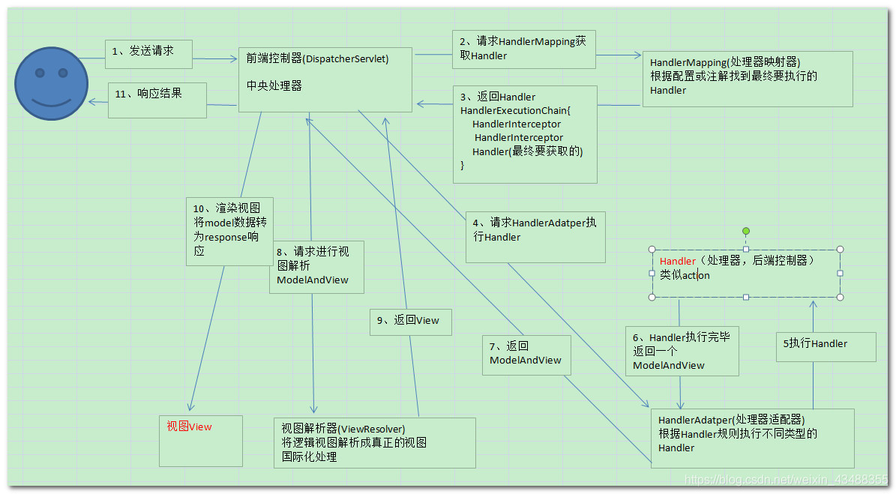

## SSH和SSM区别

ssh通常使用 Struts2为控制器(controller) ，spring 为事务层(service)， hibernate 负责持久层（dao）
ssm通常使用 springMVC为控制器(controller) ，spring 为事务层(service)， 

- ### （1）MyBatis 负责持久层（dao)Struts2和SpringMVC

相同：
spring依赖注入（DI）来管理各层的组件，都是使用AOP切面编程来管理事务，日志，权限等。
不同：
1.Struts2 和 SpringMVC **控制视图和模型的交互机制不同**

> springmvc通过参数解析器是将request对象内容进行解析成方法形参，将响应数据和页面封装成ModelAndView对象，最后又将模型数据通过request对象传输到页面
> struts2采用值栈存储请求和响应的数据，通过OGNL存取数据

2.Strtus2是**Action类级别**，SpringMVC是**方法级别**，更容易实现RESTful风格。

> springmvc是基于方法开发，传递参数是通过方法形参，可以设计为单例
> struts2是基于类开发，传递参数是通过类的属性，只能设计为多例

```
<3>springmvc的入口是一个servlet，即前端控制器，例如：*.action
struts2入口是一个filter过虑器，即前端过滤器，例如：/*
```

- ### （2）Hibernate 和 MyBatis对比

> 映射关系 Javabean<=>DB
> MyBatis仅操作JavaBean，面向表结构设计，SQL框架；Hibernate操作对象去操作数据库，ORM框架

相同：
1.Hibernate与MyBatis都是可以通过**SessionFactoryBuider**由XML配置文件生成SessionFactory，然后由**SessionFactory**生成**Session**，最后由Session来**开启事务和SQL语句**。其中SessionFactoryBuider,SessionFactory,Session 的生命周期都差不多
2.Hibernate和MyBatis都**支持JDBC和JTA事务处理**

不同：

- （1）开发速度： 

MyBatis**容易掌握**,而Hibernate门槛较高。比起两者的开发速度，不仅仅要考虑到两者的**特性及性能**，更要根据**项目需求**去考虑究竟哪一个更适合 项目开发，比如：一个项目中用到的复杂查询基本没有，就是**简单的增删改查**，这样选择**hibernate**效率就很快了，因为基本的sql语句已经被封装好了，**根本不需要你去写sql语句**，这就节省了大量的时间，但是对于一个大型项目，**复杂语句较多**，这样再去选择hibernate就不是一个太好的选择，选择 **mybatis**就会加快许多，而且语句的管理也比较方便。 

- （2）开发工作量： 

Hibernate和MyBatis都有相应的代码生成工具。可以生成简单基本的DAO层方法。
Hibernate**有良好的映射机制**，开发者无需关心SQL的生成与结果映射，可以更专注于业务流程，几乎不用编写SQL语句。针对高级查询， Mybatis**需要手动编写SQL语句**，以及**维护ResultMap**。

- （3）sql优化： 

Hibernate **封装性好**屏蔽了数据库差异，自动生成SQL语句。应对数据库变化能力较弱，**SQL语句优化困难**。

- （4）对象管理： 

**Hibernate 是完整的对象/关系映射解决方案**，它提供了对象状态管理（state management）的功能，使开发者不再需要理会底层数据库系统的细节。

- （5）移植性：

Hibernate数据库**移植性很好**。MyBatis的数据库移植性不好，不同的数据库需要写不同的SQL。

- （6）缓存机制： 

Hibernate**有更好的二级缓存机制**。因为Hibernate对查询对象有着良好的管理机制，用户无需关心SQL。所以**在使用二级缓存时如果出现脏数据，系统会报出错误并提示**。 而MyBatis在这一方面，使用二级缓存时需要特别小心。如果不能完全确定数据更新操作的波及范围， 避免Cache的盲目使用。否则，脏数据的出现会给系统的正常运行带来很大的隐患。

总结：SSM和SSH不同主要在MVC实现方式，以及ORM持久化方面不同（Hiibernate与Mybatis）

SSM越来越**轻量级配置**，将**注解开发**发挥到极致，且**ORM实现**更加灵活，**SQL优化**更简便；SSH较注重**配置开发**；其中的Hiibernate对JDBC的完整封装更面向对象，**对增删改查的数据维护更自动化**，但**SQL优化方面较弱**，且入门门槛稍高。

## spring

### 如何实现一个IOC容器

1、配置文件配置包扫描路径 

2、递归包扫描获取.class文件 

3、反射、确定需要交给IOC管理的类 

4、对需要注入的类进行依赖注入 

- 配置文件中指定需要扫描的包路径 

- 定义一些注解，分别表示访问控制层、业务服务层、数据持久层、依赖注入注解、获取配置文件注解 

- 从配置文件中获取需要扫描的包路径，获取到当前路径下的文件信息及文件夹信息，我们将当前路 径下所有以.class结尾的文件添加到一个Set集合中进行存储。遍历这个set集合，获取在类上有指定注解的类，并将其交给IOC容器，定义一个安全的Map用来存储这些对象 

- 遍历这个IOC容器，获取到每一个类的实例，判断里面是否有依赖其他类的实例，然后进行递归注入

### spring是什么？ 

轻量级的开源的J2EE框架。它是一个**容器框架**，用来装javabean（java对象），**中间层框架**（万能胶）可以起一个连接作用，比如说把**Struts和hibernate**粘合在一起运用，可以让我们的企业开发更快、更简洁 

Spring是一个**轻量级**的**控制反转（IoC)和面向切面（AOP）**的**容器 框架** 

- 从大小与开销两方面而言Spring都是**轻量级**的。 

- 通过控制反转(IoC)的技术达到**解耦**的目的 

- 提供了面向切面编程的丰富支持，允许通过分离应用的**业务逻辑与系统级服务进行内聚性**的开发 

- 包含并**管理应用对象(Bean)**的配置和生命周期，这个意义上是一个容器。 

- 将**简单的组件配置**组合成为复杂的应用，这个意义上是一个框架。 

### 谈谈你对AOP的理解⭐️

系统是由许多不同的组件所组成的，每一个组件各负责一块特定功能。除了实现自身核心功能之外，这些组件还经常承担着额外的职责。例如**日志、事务管理和安全**这样的核心服务经常融入到自身具有核心业务逻辑的组件中去。这些系统服务经常被称为**横切关注点**，因为它们会跨越系统的多个组件。 

当我们需要**为分散的对象引入公共行为**的时候，OOP则显得无能为力。也就是说，**OOP允许你定义从上到下的关系，但并不适合定义从左到右的关系**。例如日志功能。 

日志代码往往水平地散布在所有对象层次中，而与它所散布到的对象的核心功能毫无关系。 在OOP设计中，它导致了大量代码的重复，而不利于各个模块的重用。 

AOP：将程序中的交叉业务逻辑（比如安全，日志，事务等），封**装成一个切面，然后注入到目标对象（具体业务逻辑）**中去。AOP可以对某个对象或某些对象的功能**进行增强**，比如对象中的方法进行增强，可以在执行某个方法之前额外的做一些事情，在某个方法执行之后额外的做一些事情 。

### 谈谈你对IOC的理解⭐️

容器概念、控制反转、依赖注入

**ioc容器**：实际上就是个map（key，value），里面存的是各种对象（在xml里配置的bean节点、 @repository、@service、@controller、@component），在项目启动的时候会读取配置文件里面的 bean节点，**根据全限定类名使用反射**创建对象放到map里、**扫描到打上上述注解**的类还是通过反射创建对象放到map里。 

这个时候map里就有各种对象了，接下来我们在代码里需要用到里面的对象时，再**通过DI注入**（autowired、resource等注解，xml里bean节点内的ref属性，项目启动的时候会读取xml节点ref属性 。根据id注入，也会扫描这些注解，根据类型或id注入；id就是对象名）。 

**控制反转：** 

没有引入IOC容器之前，对象A依赖于对象B，那么对象A在初始化或者运行到某一点的时候，**自己必须主动去创建对象B**或者使用已经创建的对象B。无论是创建还是使用对象B，控制权都在自己手上。 

引入IOC容器之后，对象A与对象B之间失去了直接联系，当对象A运行到需要对象B的时候，**IOC容器会主动创建一个对象B注入到对象A需要的地方**。 

通过前后的对比，不难看出来：对象A获得依赖对象B的过程,由主动行为变为了被动行为，控制权颠倒过来了，**这就是“控制反转”这个名称的由来**。 

全部对象的控制权全部上缴给“第三方”IOC容器，所以，IOC容器成了整个系统的关键核心，它起到了一种**类似“粘合剂”的作用**，把系统中的所有对象粘合在一起发挥作用，如果没有这个“粘合剂”，对象与对象之间会彼此失去联系，这就是有人把IOC容器比喻成“粘合剂”的由来。 

**依赖注入：** 

“获得依赖对象的过程被反转了”。控制被反转之后，获得依赖对象的过程**由自身管理变为了由IOC容器主动注入**。**依赖注入是实现IOC的方法**：就是由IOC容器在运行期间，动态地将某种依赖关系注入到对象之中。 

### BeanFactory和ApplicationContext有什么区别？

**ApplicationContext是BeanFactory的子接口** 

ApplicationContext提供了更完整的功能： 

①继承MessageSource，因此支持国际化。 

②统一的资源文件访问方式。 

③提供在监听器中注册bean的事件。 

④同时加载多个配置文件。 

⑤载入多个（有继承关系）上下文 ，使得每一个上下文都专注于一个特定的层次，比如应用的web层。 

- BeanFactroy采用的是**延迟加载形式来注入Bean**的，即只有在使用到某个Bean时(调用getBean())，才对该Bean进行加载实例化。这样，我们就不能发现一些存在的Spring的配置问题。如果Bean的某一个属性没有注入，BeanFacotry加载后，直至第一次使用调用getBean方法才会抛出异常。ApplicationContext，**它是在容器启动时，一次性创建了所有的Bean**。这样，在容器启动时，我们就可以发现Spring中存在的配置错误，这样有**利于检查所依赖属性是否注入**。 ApplicationContext启动后预载入所有的单实例Bean，通过预载入单实例bean ,确保当你需要的时候，你就不用等待，因为它们已经创建好了。 

- 相对于基本的BeanFactory，ApplicationContext 唯一的不足是**占用内存空间**。当应用程序配置Bean较多时，**程序启动较慢，但运行快**。 

- BeanFactory通常**以编程的方式**被创建，ApplicationContext还能**以声明**的方式创建，如**使用ContextLoader**。 

- BeanFactory和ApplicationContext都支持**BeanPostProcessor、BeanFactoryPostProcessor的使用**，但两者之间的区别是：BeanFactory需要**手动注册**，而ApplicationContext则是**自动注册**。 

### 描述一下Spring Bean的生命周期？⭐️

1、（扫描路径，找到类）**解析类**得到BeanDefinition 

2、如果有多个构造方法，则要**推断构造方法** 

3、确定好构造方法后，进行**实例化**得到一个Bean对象 

4、对对象中的加了@Autowired注解的属性**进行属性填充** 

5、**回调Aware方法**，比如BeanNameAware，BeanFactoryAware

6、调用**BeanPostProcessor的初始化前**的方法 

7、调用**初始化**方法 

8、调用**BeanPostProcessor的初始化后**的方法，在这里会进行**AOP** 

9、**如果**当前创建的**bean是单例**的则会把bean放入**单例池** 

10、使用bean （运行期）

11、Spring容器关闭时调用DisposableBean中destory()方法 

### **解释下Spring支持的几种bean的作用域。** 

- singleton：默认，**每个容器中只有一个bean的实例**，**单例模式**由**BeanFactory**自身来维护。该对象的生命周期是与Spring IOC容器一致的（但在第一次被注入时才会创建）。 
- prototype：**为每一个bean（getBean()）请求提供一个实例**。在每次注入时都会创建一个新的对象 ，容器中有多个实例
- request：bean被定义为在**每个HTTP请求中创建一个单例对象**，也就是说在单个请求中都会复用这一个单例对象。 
- session：与request范围类似，确保**每个session中有一个bean**的实例，在session过期后，bean会随之失效。 
- application：bean被定义为在**ServletContext**的生命周期中**复用一个单例对象**。 
- websocket：bean被定义为在websocket的生命周期中复用一个单例对象。

global-session：全局作用域，global-session和Portlet应用相关。当你的应用部署在Portlet容器中工作时，它包含很多portlet。如果你想要声明让所有的portlet共用全局的存储变量的话，那么这全局变量需要存储在global-session中。全局作用域与Servlet中的session作用域效果相同。 

### **Spring框架中的单例Bean是线程安全的么？**

不是。Spring中的Bean默认是单例模式的，框架并没有对bean进行多线程的封装处理。 

- **有状态就是有数据存储功能** ，**如果Bean是有状态的**， 那就需要开发人员自己来进行线程安全的保证，最简单的办法就是改变bean的作用域 **把 "singleton"改为’‘protopyte’** 这样每次请求Bean就相当于是 new Bean() 这样就可以保证线程的安全了。 

> Dao会操作数据库Connection，Connection是带有状态的，比如说数据库事务，Spring的事务管理器使用**Threadlocal为不同线程维护了独立的connection副本**，保证线程之间不会互相影响（Spring 是如何保证事务获取同一个Connection的） 

- **无状态**就是不会保存数据 controller、service和dao层本身**并不是线程安全的**，如果只是调用里面的方法，而且多线程调用一个实例的方法，会在内存中复制变量，这是**自己的线程的工作内存，是安全的**。 

> **不要在bean中声明任何有状态的实例变量或类变量**，如果必须如此，那么就使用**ThreadLocal把变量变为线程私有的**，如果bean的实例变量或类变量需要在**多个线程之间共享**，那么就只能使用**synchronized、lock、CAS**等这些实现线程同步的方法了。

### **Spring** **框架中都用到了哪些设计模式？** 

简单工厂：由一个工厂类**根据传入的参数**，动态决定应该创建哪一个产品类。

> Spring中的**BeanFactory**就是简单工厂模式的体现，根据传入一个唯一的标识来获得Bean对象**getBean()**，但是否是在传入参数后创建还是传入参数前创建这个要根据具体情况来定。 

工厂方法： 

> 实现了FactoryBean接口的bean是一类叫做**factory的bean**。其特点是，spring会在使用getBean()调用获得该bean时，会自动调用该bean的getObject()方法，所以返回的不是factory这个bean，而是这个**bean.getOjbect()方法的返回值**。

单例模式：保证一个类仅有一个实例，并提供一个**访问它的全局访问点** 

> spring对单例的实现： spring中的单例模式完成了后半句话，即**提供了全局的访问点BeanFactory**。但没有从构造器级别去控制单例，这是因为spring管理的是任意的java对象。 

适配器模式： 

> Spring定义了一个适配接口**HandlerAdapter**，使得**每一种Controller有一种对应的适配器实现类**，让适配器代替controller执行相应的方法。这样在扩展Controller时，只需要增加一个适配器类就完成了SpringMVC的扩展了。 

装饰器模式：动态地**给一个对象添加一些额外的职责**。就增加功能来说，Decorator模式相比生成子类更为灵活。 

> Spring中用到的包装器模式在类名上有两种表现：一种是类名中含有**Wrapper**，另一种是类名中含有**Decorator**。 

动态代理： 

> 切面在应用运行的时刻被织入。一般情况下，在织入切面时，**AOP容器会为目标对象动态的创建一个代理对象**。SpringAOP就是以这种方式织入切面的。 **织入：把切面应用到目标对象并创建新的代理对象的过程**。 

观察者模式： 

> spring的**事件驱动模型**使用的是观察者模式 ，Spring中Observer模式常用的地方是监听器listener的实现。 

策略模式： 

> Spring框架的**资源访问Resource接口**。该接口提供了更强的资源访问能力，Spring 框架本身大量使用了Resource 接口来访问底层资源。 

模板方法：父类定义了骨架（调用哪些方法及顺序），某些特定方法由子类实现。 

> 最大的好处：代码复用，减少重复代码。除了子类要实现的特定方法，其他方法及方法调用顺序都在父类中预先写好了。 
>
> refresh方法

### **Spring事务的实现方式和原理以及隔离级别？**

在使用Spring框架时，可以有两种使用事务的方式，一种是**编程式**的，一种是**申明式**的，**@Transactional注解**就是申明式的。 

首先，**事务这个概念是数据库层面的**，Spring只是基于数据库中的事务进行了扩展，以及提供了一些能让程序员更加方便操作事务的方式。 

比如我们可以通过在某个方法上增加@Transactional注解，就可以开启事务，这个方法中所有的sql都会在一个事务中执行，统一成功或失败。 

在一个方法上加了@Transactional注解后，Spring**会基于这个类生成一个代理对象**，会将这个代理对象作为**bean**，当在使用这个代理对象的方法时，如果这个方法上存在@Transactional注解，那么代理逻辑会先把事务的**自动提交设置为false**，然后再去执行原本的**业务逻辑方法**，如果执行业务逻辑方法没有出现异常，那么代理逻辑中就会将事务进行提交，如果执行业务逻辑方法**出现了异常**，那么则会将事务进行**回滚**。 

当然，针对哪些异常回滚事务是可以配置的，可以利用@Transactional注解中的**rollbackFor属性**进行配置，默认情况下会对RuntimeException和Error进行回滚。 

**spring事务隔离级别就是数据库的隔离级别**：**外加一个默认级别** 

- read uncommitted（未提交读） 

- read committed（提交读、不可重复读）orcal默认 

- repeatable read（可重复读） mysql，spring默认

- serializable（可串行化） 效率最低，级别最高

数据库的配置隔离级别是Read Commited，而Spring配置的隔离级别是Repeatable Read，请问这时隔离级别是以哪一个为准？ 

以Spring配置的为准，如果spring设置的隔离级别数据库不支持，效果取决于数据库 

### **spring事务传播机制**

多个事务方法相互调用时,事务如何在这些方法间传播 ？

> 方法A是一个事务的方法，方法**A执行过程中调用了方法B**，那么方法B有无事务以及方法B对事务的要求不同都会对方法A的事务具体执行造成影响，同时方法A的事务对方法B的事务执行也有影响，这种影响具体是什么就由两个方法**所定义的事务传播类型所决定**。

REQUIRED(Spring默认的事务传播类型)：如果当前(A)没有事务，则自己**新建**一个事务；如果当前存在事务，则**加入**这个事务。（一起成功一起失败）

SUPPORTS：如果当前**没有**事务，就以**非事务方法**执行；当前存在事务，则**加入**当前事务

MANDATORY：如果当前事务不存在，则**抛出异常**；当前存在事务，则**加入**当前事务

NEVER：如果当前事务不存在，**不使用事务**；如果当前事务存在，则**抛出异常** 

REQUIRES_NEW：如果当前事务不存在，**新建**一个新事务，如果存在当前事务，则**挂起**该事务。 （A，B各自只处理自己的事务）

NOT_SUPPORTED：如果当前事务不存在，以**非事务**方式执行,如果当前存在事务，则**挂起**当前事务 


NESTED：如果当前事务不存在，**新建**一个事务；如果当前事务存在，则在**嵌套事务**中执行。

和REQUIRES_NEW的区别 

> **NESTED**则是**当前存在事务**时（我们把当前事务称之为父事务）会开启一个**嵌套事务**（称之为一个子事务）。 在NESTED情况下**父事务回滚时， 子事务也会回滚**。
>
> REQUIRES_NEW是**新建一个事务并且新开启的这个事务与原有事务无关**。在REQUIRES_NEW情况下，**原有事务回滚，不会影响新开启的事务**。 

和REQUIRED的区别 

> 在**NESTED**情况下，被调用方发生异常时，调用方**可以catch其异常，这样只有子事务回滚，父事务不受影响**。
>
> **REQUIRED**情况下，调用方存在事务时，则被调用方和调用方使用同一事务，那么被调用方出现异常时，**由于共用一个事务**，所以**无论调用方是否catch其异常，事务都会回**滚。

### **spring事务什么时候会失效?** 

**spring事务的原理是AOP**，进行了切面增强，那么失效的根本原因是这个AOP不起作用（getBean获取代理类）了！常见情况有如下几种 

1、发生**自调用**，类里面使用this调用本类的方法（this通常省略），此时这个this对象**不是代理类**，而是UserService对象本身！ 默认**只有在外部调用事务**才会生效

解决方法很简单，让那个this变成**UserService的代理类**即可！ 

2、方法**不是public**的 

@Transactional 只能用于 public 的方法上，否则事务不会失效

> 如果要用在非 public 方法上，可以开启 AspectJ 代理模式。 

3、数据库引擎本身**不支持事务**(例如：Myisam)

4、 **数据源没有配置事务管理器**

5、**没有被spring管理** (类没有放在Spring容器)

6、异常被吃掉**(Catch)，事务不会回滚**(或者**抛出的异常没有被定义**，默认为**RuntimeException**)

```Java
// @Service
public class OrderServiceImpl implements OrderService {

    @Transactional
    public void updateOrder(Order order) {
        try {
            // update order
        } catch {
					//1.没有抛出异常
          //2.throw new Exception("更新错误");也是错的，默认为RuntimeException
        }
    }

}
```

### **什么是bean的自动装配，有哪些方式？** 

开启自动装配，只需要在xml配置文件中**定义“autowire”属性**。 

```
<bean id="cutomer" class="com.xxx.xxx.Customer" autowire="" /> 
```

autowire属性有五种装配的方式： 

- no – 缺省情况下，自动配置是通过**“ref”属性**手动设定 。 

```java
手动装配：以value或ref的方式明确指定属性值都是手动装配。 
需要通过‘ref’属性来连接bean。
```

- byName-根据bean的**属性名称**进行自动装配。 

```Java
Cutomer的属性名称是person，Spring会将bean id为person的bean通过setter方法进行自动装配。
<bean id="cutomer" class="com.xxx.xxx.Cutomer" autowire="byName"/> 
<bean id="person" class="com.xxx.xxx.Person"/> 
```

- byType-根据bean的**类型**进行自动装配。 

```Java
Cutomer的属性person的类型为Person，Spirng会将Person类型通过setter方法进行自动装配。 
<bean id="cutomer" class="com.xxx.xxx.Cutomer" autowire="byType"/> 
<bean id="person" class="com.xxx.xxx.Person"/> 
```

- constructor-**类似byType**，不过是**应用于构造器的参数**。如果一个bean**与构造器参数的类型形同**，则进行自动装配，否则导致异常。 

```Java
Cutomer构造函数的参数person的类型为Person，Spirng会将Person类型通过构造方法进行自动装配。
<bean id="cutomer" class="com.xxx.xxx.Cutomer" autowire="construtor"/> 
<bean id="person" class="com.xxx.xxx.Person"/> 
```

- autodetect-如果有**默认的构造器**，则通过constructor方式进行自动装配，**否则使用byType方式**进行自动装配。 

```
如果有默认的构造器，则通过constructor方式进行自动装配，否则使用byType方式进行自动装配。 
```

通过注解 @Autowired自动装配bean，可以在字段、setter方法、构造函数上使用。 

## **springmvc、springBoot**

### springboot 约定优于配置这个问题?

首先，约定优于配置是一种软件设计的范式，它的核心思想是减少软件开发人员对于配置项的维护，从而让开发人员更加具交在业务逻辑上。
第二个，spring boot 就是约定优于配置这一理念下的产物，它类似于 spring 框架下的一个脚手架，通过 spring boot 我们可以快速开发基于 spring 生态下的应用程序。
第三个，基于传统的 spring 框架开发 web 应用的时候，我们需要做很多和业务无关，并且只需要做一次的配置项，比如第一个，管理Jar包的依赖。第二个，web.xml 的维护。第三个， spring MVC 中的一个叫 dispatch servlet.xml 配置项的一个维护。第四个，应用需要自己手动去部署到 web 容器。第五个，第三方组件集成到 spring IoC 容器中的时候，我们需要做配置项的维护。而在 spring boot 中，我们不再需要去做这些繁琐的配置，因为 spring boot 已经帮我们自动完成了。而完成这样一个动作的前提就是基于约定优于配置这样一个思想。
最后，spring bbot约定优于配置的体现有很多，比如第一个， springboot starter 启动依赖，它能够帮助我们管理所有的Jar包版本。第二个，如果当前的应用依赖了 web 这样一个Jar包，那么 spring bot 会自动内置Tomcat容器来去运行 web 应用，我们不再需要去单独进行应用部署。
第三， springboot 的自动装配机制的实现中，通过扫描约定路径下的 spring. factory 文件去进行识别配置类，从而去实现Bean的自动装载。
第四， springboot 默认会加载 resource 目录下的 application.property 文件。总的来说，约定优于配置是一个比较常见的软件设计思想，它的核心本质都是为了去更加高效以及更加便捷地去实现软件系统的开发和维护。以上就是我对于这个问题的理解。

### **Spring Boot、Spring MVC** **和** **Spring** **有什么区别**

Spring是一个**轻量级**的**控制反转（IoC)和面向切面（AOP）**的**容器 框架** 。spring是**一个IOC容器，用来管理Bean，使用依赖注入实现控制反转**，可以很方便的**整合各种框架**，提供**AOP机制**弥补OOP的代码重复问题、更方便将不同类不同方法中的共同处理抽取成切面、自动注入给方法执行，比如日志、异常等 

springmvc是**spring对web框架的一个解决方案或设计理念**，提供了一个总的前端控制器Servlet，用来接收请求，然后定义了一套路由策略（url到handle的映射）及适配执行handle，将handle结果使用视图解析技术生成视图展现给前端 

springboot是spring提供的一个快速开发工具包，其实就是Spring，它做了一些对Spring Bean的默认配置。让程序员能更方便、更快速的开发spring+springmvc 应用，**简化了配置**（约定了默认配置）**，整合了一系列的解决方案**（starter机制）、redis、 mongodb、es，核心理念：开箱即用，快速启动

### **SpringMVC** **工作流程** ⭐️

1）用户发送请求至**前端控制器 DispatcherServlet**。 

2）DispatcherServlet 收到请求**调用 HandlerMapping 处理器映射器**。

> 维护<url，handler>的映射

3）处理器映射器找到**具体的处理器**(可以根据 **xml 配置、注解**进行查找)，**生成处理器Handler及处理器拦截器** (如果有则生成)一并**返回给 DispatcherServlet**。 

4）DispatcherServlet **调用 HandlerAdapter 处理器适配器执行Handler**。 

> 适配器模式：HandlerAdapter会根据handler规则执行不同类型的handler

5）HandlerAdapter **经过适配执行具体的handler**(Controller，也叫**后端控制器**) 

6） handler执行完成**返回 ModelAndView**。 

7）HandlerAdapter 将 handler 执行结果 **ModelAndView 返回给 DispatcherServlet**。

8） DispatcherServlet 将 ModelAndView 传给 **ViewReslover 视图解析器**。 

9）ViewReslover **解析后返回具体 View**。 

10）DispatcherServlet 根据 View **进行视图渲染**（即将模型数据填充至视图中）。 

11）DispatcherServlet **响应用户**。



### **Spring MVC的主要组件？** 

**Handler**：也就是处理器。它直接应对着MVC中的C也就是**Controller**层，它的具体表现形式有很多，**可以是类，也可以是方法**。在Controller层中**@RequestMapping标注**的所有方法都可以看成是一个Handler，只要可以实际处理请求就可以是Handler 

1、HandlerMapping 🀄️接口

initHandlerMappings(context)，处理器映射器，**根据用户请求的资源uri来查找Handler的**。在SpringMVC中会有很多请求，每个请求都需要一个Handler处理，具体接收到一个请求之后使用哪个Handler进行，这就是HandlerMapping需要做的事。 

> URL：Bean id；Key,value；注解

2、HandlerAdapter 🀄️接口

initHandlerAdapters(context)，适配器。因为**SpringMVC中的Handler可以是任意的形式，只要能处理请求就ok（@ReqeustMapping,Conroller接口,HttpRequestHandler,HttpServlet）**，但是**Servlet需要的处理方法的结构却是固定的**，都是以request和response为参数的方法。如何让固定的Servlet处理方法调用灵活的Handler来进行处理呢？这就是HandlerAdapter要做的事情。 

Handler是用来干活的工具；HandlerMapping用于根据需要干的活找到相应的工具；HandlerAdapter是使用工具干活的人。

3、HandlerExceptionResolver 

initHandlerExceptionResolvers(context)， 其它组件都是用来干活的。在干活的过程中难免会出现问题，出问题后怎么办呢？这就需要有一个专门的角色对异常情况进行处理，在SpringMVC中就是HandlerExceptionResolver。具体来说，此组件的作用是**根据异常设置ModelAndView，之后再交给render方法进行渲染**。 

4、ViewResolver 

initViewResolvers(context)，ViewResolver用来将String类型的视图名和Locale解析为View类型的视图。View是用来渲染页面的，也就是将程序返回的参数填入模板里，生成html（也可能是其它类型）文件。这里就有两个关键问题：使用哪个模板？用什么技术（规则）填入参数？这其实是ViewResolver主要要做的工作，**ViewResolver需要找到渲染所用的模板和所用的技术**（也就是视图的类型）**进行渲染**，具体的渲染过程则交由不同的视图自己完成。 

5、RequestToViewNameTranslator 

initRequestToViewNameTranslator(context)，ViewResolver是根据ViewName查找View，但有的 Handler处理完后并没有设置View也没有设置ViewName，这时就需要从request获取ViewName了，如何从request中获取ViewName就是RequestToViewNameTranslator要做的事情了。 

RequestToViewNameTranslator在Spring MVC容器里只可以配置一个，所以所有request到 ViewName的转换规则都要在一个Translator里面全部实现。 

6、LocaleResolver 

initLocaleResolver(context)， 解析视图需要两个参数：一是视图名，另一个是Locale。视图名是处理器返回的，Locale是从哪里来的？这就是LocaleResolver要做的事情。LocaleResolver用于从request解析出Locale，Locale就是zh-cn之类，表示一个区域，有了这个就可以对不同区域的用户显示不同的结果。SpringMVC主要有两个地方用到了Locale：一是ViewResolver视图解析的时候；二是用到**国际化资源或者主题的**时候。 

7、ThemeResolver 

initThemeResolver(context)，用于解析主题。SpringMVC中一个主题对应一个properties文件，里面存放着跟当前主题相关的所有资源、如图片、css样式等。SpringMVC的主题也支持国际化，**同一个主题不同区域也可以显示不同的风格**。SpringMVC中跟主题相关的类有 ThemeResolver、ThemeSource 和Theme。主题是通过一系列资源来具体体现的，要得到一个主题的资源，首先要得到资源的名称，这 是ThemeResolver的工作。然后通过主题名称找到对应的主题（可以理解为一个配置）文件，这是 ThemeSource的工作。最后从主题中获取资源就可以了。 

8、MultipartResolver 

initMultipartResolver(context)，**用于处理上传请求**。处理方法是将普通的request包装成 MultipartHttpServletRequest，后者可以直接调用getFile方法获取File，如果上传多个文件，还可以调用getFileMap得到FileName->File结构的Map。此组件中一共有三个方法，作用分别是判断是不是上传请求，将request包装成MultipartHttpServletRequest、处理完后清理上传过程中产生的临时资源。 

9、FlashMapManager 

initFlashMapManager(context)，用来**管理FlashMap**的，FlashMap主要用在**redirect中传递参数**。 

### Spring Boot启动过程

### **Spring Boot** **自动配置原理？**

@Import + @Configuration + Spring spi(服务提供者接口)

- 自动配置类由各个starter提供，使用@Configuration + @Bean定义配置类，放到META INF/spring.factories下 
- 使用Spring spi扫描META-INF/spring.factories下的配置类 
- 使用@Import导入自动配置类 


>  @SpringBootConfiguration：标记当前类为配置类
>  @EnableAutoConfiguration：开启自动配置
>  @ComponentScan：扫描**主类**所在的同级包以及下级包里的Bean
>  **关键是@EnableAutoConfiguration**
>
>  **AutoConfigurationImportSelector**中的方法**getCandidateConfigurations**，得到待配置的class的类名集合,这个集合就是所有需要进行自动配置的类，而是是否配置的关键在于META-INF/spring.factories文件中是否存在该配置信息。


### **如何理解** **Spring Boot** **中的** **Starter** 

使用spring + springmvc使用，如果需要引入mybatis等框架，需要到xml中定义mybatis需要的bean ，而starter可以避免繁琐的配置

starter就是定义一个starter的jar包，**写一个@Configuration配置类**、将这些bean定义在里面，然后在 starter包的META-INF/spring.factories中写入该配置类，springboot会按照约定来加载该配置类

开发人员只需要在maven中引入starter依赖，进行相应的属性配置（使用默认配置（该配都帮忙配了）时，不需要配置），就可以直接进行代码开发，使用对应的功能了，比如mybatis-spring-boot--starter，springboot-starter-redis 

### **什么是嵌入式服务器？为什么要使用嵌入式服务器?**

节省了下载安装tomcat，应用也不需要再打war包，然后放到webapp目录下再运行。

只需要一个安装了 Java 的虚拟机，就可以直接在上面部署应用程序了 

springboot已经**内嵌了tomcat.jar**，运行main方法时会去启动tomcat，并利用tomcat的**spi机制**加载springmvc

### JPA？


## **Mybatis**

### **mybatis的优缺点** 

优点： 

1、**基于 SQL 语句编程，相当灵活**，不会对应用程序或者数据库的现有设计造成任何影响，**SQL 写在XML里，解除 sql 与程序代码的耦合**，便于统一管理；提供 XML标签， 支持编写动态 SQL 语句， 并可重用。 

 2、**与 JDBC 相比，减少了 50%以上的代码量**，消除了 JDBC 大量冗余的代码，不需要手动开关连接； 

 3、**很好的与各种数据库兼容**（ 因为 MyBatis 使用 JDBC 来连接数据库，所以只要JDBC 支持的数据库MyBatis 都支持）。 

 4、能够**与 Spring 很好的集成**； 

 5、提供**映射标签**， 支持对象与数据库的 ORM 字段关系映射； 提供对象关系映射标签， 支持对象关系组件维护。 

缺点： 

 1、**SQL 语句的编写工作量较大**， 尤其当字段多、关联表多时， 对开发人员编写SQL 语句的功底有一定要求。 

 2、**SQL 语句依赖于数据库， 导致数据库移植性差**， 不能随意更换数据库。 

### **#{}和${}的区别是什么？**

（1） #{}是预编译处理、是**占位符**， ${}是字符串替换、是**拼接符**。

（2）Mybatis 在处理#{}时，会将 sql 中的#{}替换为**?号**，调用**PreparedStatement**来赋值； 
Mybatis 在处理${}， 将其替换成**变量的值**，调用 **Statement**来赋值；

（3）#{} 的变量替换是在DBMS 中、变量替换后，#{} 对应的变量自动加上**单引号**

${}的变量替换是在 DBMS 外，变量替换后，对应的变量不会加上单引号 
**使用#{}可以有效的防止 SQL 注入**， 提高系统安全性。 

### **简述** **Mybatis** **的插件（拦截器）运行原理，如何编写一个（分页）插件。**

答： Mybatis 只支持针对 **ParameterHandler(参数类型转换)、ResultSetHandler(对应JDBC)、StatementHandler(对应JDBC)、Executor（执行器，生成SQL语句，查询缓存）** 这4 种接口的插件， Mybatis **使用 JDK 的动态代理**， 为需要拦截的接口生成代理对象以**实现接口方法拦截功能**， 每当执行这 4 种接口对象的方法时，就会进入拦截方法，具体就是 **InvocationHandler 的** **invoke() 方法**， 拦截那些你指定需要拦截的方法。 

**编写插件：** **实现 Mybatis 的 Interceptor 接口并复写 intercept()方法**，然后在给插件**编写注解**， **指定要拦截哪一个接口的哪些方法**即可， 在**配置文件中配置**编写的插件。 

```Java
//intercept方法里面有一个参数invocation（通过invocation可以获取拦截方法的数据）
//StatementHandler接口，query就是拦截的方法
@Intercepts({@Signature(type = StatementHandler.class, method = "query", args = {Statement.class, ResultHandler.class}), 
	@Signature(type = StatementHandler.class, method = "update", args = {Statement.class}), 
  @Signature(type = StatementHandler.class, method = "batch", args = { Statement.class })}) 
@Component 

//前面写一些代码
invocation.proceed()执行具体的业务逻辑 
//后面写一些代码
```

