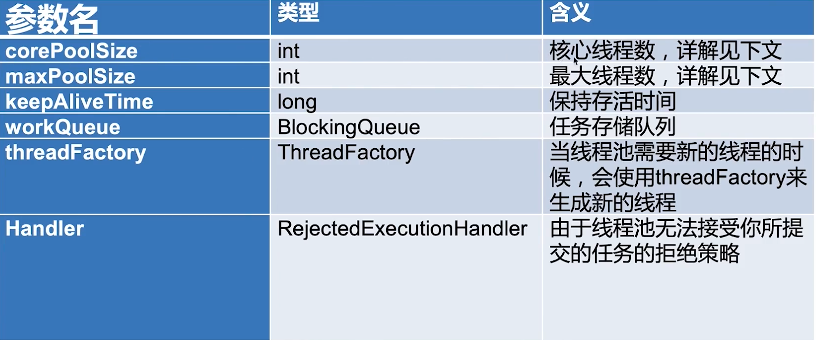
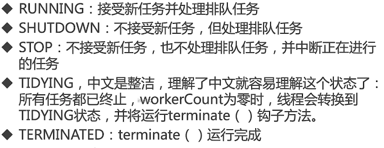

### **对线程安全的理解**

当多个线程访问一个对象时，如果不用进行额外的同步控制或其他的协调操作，调用这个对象的行为都可以获得正确的结果(预期结果或单线程的结果)，我们就说这个对象是线程安全的。

线程安全其实本质上是**内存安全**，JVM中的堆是共享内存，**可以被所有线程访问** ，这就会有线程并发安全的问题

> **堆**是进程和线程共有的空间，分全局堆和局部堆。全局堆就是所有没有分配给用户的空间，局部堆就是用户分配的空间。堆在操作系统对**进程初始化**的时候分配，运行过程中也可以向系统要额外的堆，但是用完了要还给操作系统，要不然就是内存泄漏。 
>
> > 在Java中，堆是Java虚拟机所管理的内存中**最大的一块**，是**所有线程共享**的一块内存区域，在虚拟机**启动时创建**。堆所存在的内存区域的唯一目的就是存放对象实例，几乎所有的对象实例以及数组都在这里分配内存。 
>
> **栈**是每个线程**独有的**，保存其**运行状态和局部自动变量的**。栈在线程开始的时候初始化，每个线程的栈互相独立，因此，栈是线程安全的。操作系统在切换线程的时候**会自动切换栈**。栈空间不需要在高级语言里面显式的分配和释放。

#### **解决方法**

- 加锁排队执行，比如：使用sychronized加锁，使用ReentrantLock加锁

> sychronized是JVM层的自动加锁和释放锁的同步锁
>
> ReentrantLock需要程序员自己加锁和释放锁

- 使用线程安全类，比如AutomicInteger

> 将++ —变为一个原子操作

- 使用线程本地变量ThreadLocal

> 每一个线程都有自己的一个私有变量，不同线程操作的是不同变量，也就不会产生线程安全问题。

### **对守护线程的理解** 

用户线程：默认情况我们创建的线程或线程池都是用户线程

守护线程：**为所有非守护线程提供服务的线程**；任何一个守护线程都是**整个JVM中所有非守护线程的保姆**； 

通过Thraed.isDaemon()查看是否为守护线程。

守护线程类似于整个进程的一个默默无闻的小喽喽；它的生死无关重要，它却依赖整个进程而运行；哪天其他线程结束了，没有要执行的了，程序就结束了，理都没理守护线程，就把它中断了；  由于**守护线程的终止是自身无法控制的**，因此千万不要把IO、File等重要操作逻辑分配给它；因为它不靠谱，**随时可能退出（**守护线程**不能用于去访问固有资源**，比如读写操作或者计算逻辑。因为它会在任何时候甚至在一个操作的中间发生中断。）

**守护线程的作用是什么？** 

举例， **GC垃圾回收线程**：就是一个经典的守护线程，当我们的程序中不再有任何运行的Thread,程序就不会再产生垃圾，垃圾回收器也就无事可做，所以当垃圾回收线程是JVM上仅剩的线程时，垃圾回收线程会自动离开。它始终在低级别的状态中运行，用于**实时监控和管理系统中的可回收资源**。 

**应用场景：**来为其它线程提供服务支持的情况（说心跳检测，事件监听，GC垃圾回收线程等）。

**PS：**（1）**thread.setDaemon(true)必须在thread.start()之前设置**，否则会跑出一个 

IllegalThreadStateException异常。你不能把正在运行的常规线程设置为守护线程。 

（2）在Daemon线程中产生的新线程也是Daemon的。 

（3）Java自带的多线程框架，比如ExecutorService，会将守护线程转换为用户线程，所以**如果要使用后台线程就不能用Java的线程池**。

### **并发、并行、串行的区别** 

- 串行在时间上不可能发生重叠，前一个任务没搞定，下一个任务就只能等着 
- 并行在时间上是重叠的，两个任务在**同一时刻互不干扰**的同时执行。 
- 并发允许两个任务彼此干扰。同一时刻、只有一个任务运行，交替执行

### **并发的三大特性**

**（1）　原子性**

- 原子性是指在一个操作中**cpu不可以在中途暂停然后再调度**，即**不被中断操作**，要不全部执行完成，要不都不执行。就好比转账，从账户A向账户B转1000元，那么必然包括2个操作：从账户A减去1000元， 往账户B加上1000元。2个操作必须全部完成。 

- 举个例子：

```Java
private long count = 0; 
public void calc() {
count++; 
} 
```

- 1：将 count 从**主存读到线程中的工作内存的副本**中 
- 2：+1的运算 
- 3：将结果写入工作内存 
- 4：将工作内存的值刷回主存(什么时候刷入由操作系统决定，不确定的) 

那程序中原子性指的是最小的操作单元，比如自**增操作，它本身其实并不是原子性操作，分了3步的， 包括读取变量的原始值、进行加1操作、写入工作内存**。前3步是原子性不能够保证线程安全，由于第4步。（即使第4步是原子性的，也不能保证线程安全）

**关键字：**synchronized ，（CAS）

**（2）可见性**  

- **当多个线程访问同一个变量时，一个线程修改了这个变量的值，其他线程能够立即看得到修改的值**。 

- 例子：若两个线程在不同的cpu，那么线程1改变了i的值还没刷新到主存，线程2又使用了i，那么这个i值肯定还是之前的，线程1对变量的修改，其他线程没看到这就是可见性问题。（第3，4步是原子操作，但还不是线程安全）

```Java
 //线程1 
 boolean stop = false; 
 while(!stop){ 
 doSomething(); 
 }
 //线程2 
 stop = true;
```

如果线程2改变了stop的值，线程1一定会停止吗？不一定。当线程2更改了stop变量的值之后，但是**还没来得及写入主存当中，线程2转去做其他事情了**，那么线程1由于不知道线程2对stop变量的更改，因此还会一直循环下去。 

**关键字：**volatile、synchronized、final 

> 原子性CAS与可见性volatile保证线程安全

**（3）有序性** 

- 虚拟机在进行代码编译时，**单线程下，对于那些改变顺序之后不会对最终结果造成影响的代码**，虚拟机不一定会按照我们写的代码的顺序来执行，有可能将他们**重排序**。实际上，对于有些代码进行重排序之后，虽然对变量的值没有造成影响，但有**可能会出现线程安全问题**。 
- 例子

```java
int a = 0;
bool flag = false; 
public void write() 
{ 
  a = 2; //1 
  flag = true; //2
}
public void multiply() { 
  if (flag) {//3 
  	int ret = a * a;//4 
  } 
} 
```

> write方法里的1和2做了重排序，线程1先对flag赋值为true，随后执行到线程2，ret直接计算出结果，再到线程1，这时候a才赋值为2,很明显迟了一步 

**关键字：**volatile、synchronized (禁止指令重排序)

> synchronized关键字同时满足以上三种特性，但是**volatile关键字不满足原子性**。 
>
> 在某些情况下，volatile的同步机制的性能确实要优于锁(使用synchronized关键字或 java.util.concurrent包里面的锁)，因为volatile的总开销要比锁低。 我们判断使用volatile还是加锁的唯一依据就是volatile的语义能否满足使用的场景(原子性)

## (一) 三大类

1.并发安全

底层角度：

- 互斥同步

- 非互斥同步

- 结合互斥同步和非互斥同步（效率和安全的平衡）

- 无同步方案

使用者角度：

- 避免共享变量
- 共享变量，但加锁或final
- 使用成熟工具类

2.线程管理（提高效率）

线程池相关类

能获取子线程的运行结果的相关类

3.线程协作

AQS

## (二) 线程池

### 1.作用

`池理解为计划经济。资源有限，池就是要管理好资源。`

**为什么用线程池**

> 1、降低资源消耗；提高线程利用率，降低创建和销毁线程的消耗。 
>
> 2、提高响应速度；任务来了，直接有线程可用可执行，而不是先创建线程，再执行。 
>
> 3、提高线程的可管理性；线程是稀缺资源，使用线程池可以统一分配调优监控。 

### 2.处理流程，创建，停止，复用，判断是否完成

#### **2.1构造函数的6大核心参数**



**添加线程规则**

> 源码在:ThreadPoolExecutor中的execute函数

#### **2.2线程池处理流程⭐️**

线程池初始时为空，任务来了再创建的。

```
（1）线程数 < corePoolSize，即使其他工作线程空闲，也会创建一个新线程来运行新任务。
（2）线程数>=corePoolSize，<maxPoolSize，将任务放入workQueue中（希望保持较少的线程数）
（3）工作队列已满，线程数<maxPoolSize，则创建1个新线程
（4）队列已满，线程数>=maxPoolSize，拒绝该任务。
```


**KeepAliveTime**

线程数 > corePoolSize，多余的线程空闲时间超过KeepAliveTime就会被回收。

```
keepAliveTime设置成负数或者是0，表示无限阻塞？

答：这种是不对的，如果 keepAliveTime 设置成负数，在线程池初始化时，就会直接报 IllegalArgumentException 的异常，而设置成 0，队列如果是 LinkedBlockingQueue 的话，执行workQueue.poll (keepAliveTime, TimeUnit.NANOSECONDS) 方法时，如果队列中没有任务，会直接返回 null，导致线程立马返回，不会无限阻塞。 

如果想无限阻塞的话，可以把 keepAliveTime 设置的很大，把 TimeUnit 也设置的很大，接近于无限阻塞。

对于线程空闲回收的理解？
空闲线程回收的时机：如果线程超过 keepAliveTime 时间后，还从阻塞队列中拿不到任务
（这种情况我们称为线程空闲），当前线程就会被回收，如果 allowCoreThreadTimeOut 设置成true，core thread 也会被回收，直到还剩下一个线程为止，如果 allowCoreThreadTimeOut 设置成 false，只会回收非 core thread 的线程。
线程在任务执行完成之后，之所有没有消亡，是因为阻塞的从队列中拿任务，在 keepAliveTime 时间后都没有拿到任务的话，就会打断阻塞，线程直接返回，线程的生命周期就结束了，JVM 会回收掉该线程对象


说一说线程执行任务之后，都在干啥？
答：线程执行任务完成之后，有两种结果： 
\1. 线程会阻塞从队列中拿任务，没有任务的话无限阻塞； 
\2. 线程会阻塞从队列中拿任务，没有任务的话阻塞一段时间后，线程返回，被 JVM 回收。
```

**ThreadFactory**

使用默认就可以了

**workQueue**⭐️

1）直接交接：SychronousQueue（队列大小为0，不能存任务，此时应使用大的maxPoolSize，因为没有队列作为缓冲）

2）无界队列：LinkedBlockingQueue（**如果处理跟不上任务提交速度，任务越来越多，会造成oom异常**）

3）有界队列：ArrayBlockingQueue，用得少

4）优先级队列：PriorityBlockingQueue ，用得少

**拒绝策略**

**（1）拒绝时机**

1.线程池（Executor）关闭时

2.workQueue，maxPoolSize都饱和了

**（2）4种拒绝策略**⭐️

- ThreadPoolExecutor.AbortPolicy:**丢弃任务并抛出**RejectedExecutionException异常。 
- ThreadPoolExecutor.DiscardPolicy：**丢弃任务，但是不抛出异常**。 
- ThreadPoolExecutor.DiscardOldestPolicy：**丢弃队列最前面的任务**，然后**重新提交**被拒绝的任务 
- ThreadPoolExecutor.CallerRunsPolicy：由调用线程（提交任务的线程）处理该任务，（**自己提交自己处理**）

**（3）线程池中的线程创建，拒绝请求可以自定义实现么？如何自定义？** 

答：可以自定义的，线程创建默认使用的是 DefaultThreadFactory，自定义话的只需要**实现 ThreadFactory 接口**即可；拒绝请求也是可以自定义的，实现**RejectedExecutionHandler 接口**即 可；在 **ThreadPoolExecutor** 初始化时，将两个自定义类作为构造器的入参传递给 ThreadPoolExecutor 即可。

#### **2.3常见线程池以及创建**⭐️

- **Executors**自动创建线程池，会有OOM异常的风险，

- 使用**ThreadPoolExecutor**手**动的方式创建线程池（推荐）**，因为这种方式可以通过参数来**控制最大线程数和拒绝策略**，让线程池的执行更加透明和可控，并且可以规避资源耗尽的风险。

**自动创建**

1）newFixedThreadPool：固定线程数，采用**LinkedBlockingQueue**，KeepAliveTime=0

> 队列占用内存太多，会出现OOM

2）newSingleThreadExecutor：单线程，采用**LinkedBlockingQueue**，KeepAliveTime=0

> 队列占用内存太多，会出现OOM

3）newCachedThreadPool：**SychronousQueue**，KeepAliveTime=60，corePoolSize=0,**maxPoolSize无限**
无界线程池，**具有自动回收多余线程**的功能

> 创建非常多的线程，会出现OOM

4）newScheduledThreadPool：周期性执行，DelayedWorkQueue，KeepAliveTime=60，maxPoolSize无限

> Scheduled方法，只执行一次定时任务，（传入任务，多久后执行，单位）
>
> ScheduledAtFixedRate，执行多次定时任务（传入任务，多久后开始执行定时任务，执行时间间隔，单位）每间隔一段时间执行定时任务
>
> ScheduledWithFixedDelay，执行多次定时任务（传入任务，多久后开始执行，执行时间间隔，单位），不同之处：等任务执行完成后，间隔一段时间再执行

5）newSingleScheduledThreadPool

6）workStealingPool（JDK1.8）少用

> 多个子任务：每个任务都有自己的队列，其他线程可以帮助完成，抢占式的。
> 任务：不加锁，执行顺序不能保证
>
> 应用场景：递归

#### **Executor工具框架**


> 1. 定义任务类：Runnable、Callable、FutureTask。Runnable 是定义无返回值的任务， Callable 是定义有返回值的任务，FutureTask 是对 Runnable 和 Callable 两种任务的统一， 并增加了对任务的管理功能； 
>
> 2. 执行任务类：Executor、ExecutorService、ThreadPoolExecutor。Executor 定义最基本的运行接口，ExecutorService 是对其功能的补充，ThreadPoolExecutor 提供**真正可运行的线程 池类**，三个类定义了任务的运行机制。

#### 两个提交任务

execute() VS submit()

- execute()方法只能接收Runnable类型的参数，而**submit()方法可以接收Callable、Runnable**两种类型的参数。
- execute()提交任务后会没有返回值，而submit()有
- execute()任务的执行结果和可能的异常调用者并不关心；submit()方便Exception处理

#### **Future**

> 作用：通过 Future 去控制子线程执行的计算过程,最后获取到计算结果

get()：线程池不会直接抛出异常，只有future.get()才会抛出（只抛ExecutionException）

> 任务5种状态：
>
> 任务正常完成
>
> 任务尚未完成：get将阻塞并直到任务完成
>
> 任务执行过程中抛出ExecutionException
>
> 任务取消CallcellationException
>
> 任务超时TimeoutExceptionget

get(long,Timeunit)

Cancel()：true：中断当前任务

isDone()：任务是否完成（不管是否抛异常）

isCancelled()

**Future创建方式**

- FutureTask创建Future对象

创建callable的task，将task传入futureTask，提交到线程池，通过futureTask.get()

- 线程池的submit返回Future对象

submit()方法自身并不会传递结果，而是返回一个Future异步执行实例（一开始为空），**处理过程的结果被包装到Future实例**中，调用者可以通过Future.get()方法获取异步执行的结果。实际上是 FutureTask.get ，其方法底层是从 **FutureTask  的 outcome 属性**拿值的

**注意**

for循环get()，会出现部分线程执行慢的情况，可以调用get(long,timeout)，超时丢弃任务

使用*CompleteFuture*，某个子任务执行完，可以立即得到结果

#### **2.4线程数量的选择**

（1）定性

- 根据业务进行考虑，初始化线程池时，我们需要考虑所有业务涉及的线程池，如果目前所有 的业务同时都有**很大流量**，那么在对于当前业务设置线程池时，我们尽量把**线程大小、队列 大小都设置小**，如果所有业务基本上都不会同时有流量，那么就可以稍微设置大一点；

- 根据业务的实时性要求，如果**实时性要求高**的话，我们把**队列设置小**一点，**coreSize ==  maxSize**，并且设置 **maxSize 大一点**，如果实时性要求低的话，就可以把队列设置大一点。

（2）粗略定量

CPU密集型（加密，计算）：最佳线程数为**CPU核心的1-2倍**

耗时IO型（读写数据库，文件等）：最佳线程数为**CPU核心很多倍**

> 《Java并发编程实战》的作者 Brain Goetz ：线程数=CPU核心数*(1+平均等待时间/平均工作时间)；
>
> 等待（读取数据库）越长，线程数越多；

（3）更加精准

根据具体业务，去进行程序的压测


#### **线程池状态**



wokerCount 任务队列里面的工作线程数

**有2种转换**

- shutdown

从running，shutdown，tidying，terminated

- shutdownNow

从running，stop，tidying，terminated

#### **2.5停止线程池**

1.shutdown

关闭初始化。**等线程池里面的任务全部完成再关闭**，新的任务来会拒绝

2.isShutdown

是否进入关闭状态（不是真正停止）

3.isTerminated

真正停止

4.awaitTermination

测试一段时间内，线程池是否真正停止

5.shutdownNow

中断线程，同时将任务列表返回

#### 2.6**线程池中阻塞队列的作用？为什么是先添加列队而不是先创建最大线程？**⭐️

（1）一方面：阻塞队列通过阻塞可以**保留住当前想要继续入队**的任务。 另一方面：阻塞队列可以保证任务队列中没有任务时**阻塞获取任务的线程**，使得线程进入**wait状态，释放cpu资源**。**阻塞队列自带阻塞和唤醒的功能**，不需要额外处理，无任务执行时,**线程池利用阻塞队列的take方法挂起**，从而维持核心线程的存活、不至于一直占用cpu资源。

（2）在创建**新线程的时候，是要获取全局锁**的，这个时候其它的就得阻塞，影响了整体效率。 
就好比一个企业里面有10个（core）正式工的名额，最多招10个正式工，要是任务超过正式工人数（**task > core**）的情况下，工厂领导（线程池）不是首先扩招工人，还是这10人，但是任务可以**稍微积压一下**，即先放到队列去（代价低）。10个正式工慢慢干，迟早会干完的，要是任务还在继续增加，超过正式工的**加班忍耐极限了（队列满了）**，就得招外包帮忙了（**非核心线程**）要是正式工加上外包还是不能完成任务，那新来的任务就会被领导拒绝了（线程池的拒绝策略）。

#### 2.7**线程池实现任务复用的原理**⭐️

在线程池中，**同一个线程可以从阻塞队列中不断获取新任务来执行**。其核心原理在于线程池对 Thread 进行了封装，并不是每次执行任务都会调用Thread.start()来创建新线程，而是**让每个线程去执行一个“循环任务”**,在这个“循环任务”中不停的**检查是否有任务需要被执行**,如果有则直接执行,也就是调用**任务中的run 方法**,将 run 方法当成一个普通的方法执行,通过这种方式将只使用固定的线程就将所有任务的 run 方法串联起来。

#### 2.8如何判断线程池已经执行完所有任务了？

- 使用isTerminated方法

> 需要通过线程池的完成状态来实现，不然线程池会一直处于RUNNING状态，**需要调用shutdown**关闭线程池，一般情况下不推荐使用

- 使用getCompleteTaskCount

> 通过判断计划执行总任务的数量和已经完成的任务数量是否相等，若相等则已经全部执行完成，但因为任务和线程状态可能在计算过程中会动态变化，所以得到的是一个大致的值，**可能不准确**

- 使用CountDownlatch

> 相当于一个线程安全的**单次计数器**，使用比较简单，且无需关闭线程池，是**比较常用的判断方法**
>
> 声明一个包含5个任务的计数器；每个任务执行完成后计数器-1；CountDownlatch为0时，表示任务都执行完成

- 使用CyclicBarrier

> 相当于一个线程安全的**重复计数器**，**使用比较复杂，使用较少**，


### 3.钩子方法，线程池任务执行之前和之后，加料

在线程池任务执行之前实现 beforeExecute 方法，执行之后实现 afterExecute 方法。

钩子函数作用：

> 解耦，利用钩子拦截，再做其他事情。而不是将全部事情写在一个任务里。

> 场景：线程暂停；恢复；在每个任务执行前后想做日志，统计

### **4.不同场景，如何使用线程池**⭐️

#### **1 coreSize == maxSize，无界队列（常用）**

`ThreadPoolExecutor executor = new ThreadPoolExecutor(10, 10, 600000L, TimeUnit.DAYS, new LinkedBlockingQueue());`

让线程一下子增加到 maxSize，并且不要回收线程，防止线程回收，避免不断增加回收的损耗，一般来说业务流量都有波峰低谷，在流量低谷时，线程不会被回收；流 量波峰时，maxSize 的线程可以应对波峰，不需要慢慢初始化到 maxSize 的过程。

前提：

（1）allowCoreThreadTimeOut 我们采取默认 false，而不会主动设置成 true， allowCoreThreadTimeOut 是 false 的话，当线程空闲时，就不会回收核心线程

（2）keepAliveTime 和 TimeUnit 我们都会设置很大，这样线程空闲的时间就很长，线程就不会轻易的被回收。
场景：我们**现在机器的资源都是很充足的**，我们不用去担心线程空闲会浪费机器的资源，所以这种写法 目前是很常见的。

#### **2.maxSize** **无界** **+ SynchronousQueue**

SynchronousQueue其内部有**堆栈和队列两种形式，默认是堆栈的形式**，其内部是没有存储的容器的，放元素和拿元素是一一对应的，比如我使用 **put 方法放元素， 如果此时没有对应的 take 操作的话，put 操作就会阻塞**，需要有线程过来执行 take 操作后，put 操作才会返回。基于此特点，如果要使用 SynchronousQueue 的话，我们需要尽量**将 maxSize 设置大一点，防止请求被拒绝**。  

优点：当任务被消费时，才会返回，这样请求就能够**知道当前请求是已经在被消费了**。如果是其他的队列的话，我们只知道任务已经被提交成功了，但无法知道当前任务是在被消费中，还是正在队列中堆积。 

缺点： 

\1. 比较消耗资源，大量请求到来时，我们**会新建大量的线程**来处理请求； 

\2. 如果请求的量难以预估的话，**maxSize 的大小也很难设置**。

#### **3 maxSize** **有界** **+ Queue** **无界**

比如我们设置 maxSize 为 20，Queue 选择默认构造器的 LinkedBlockingQueue，

优点： 

\1. 电脑 **cpu 固定的情况**下，每秒能同时工作的线程数是有限的，此时开很多的线程其实也是浪费，还不如把这些请求放到队列中去等待，这样可以**减少线程之间的 CPU 的竞争**； 

\2. LinkedBlockingQueue 默认构造器构造出来的链表的最大容量是 Integer 的最大值，**非常适合流量忽高忽低**的场景：当流量高峰时，大量的请求被阻塞在队列中，让有限的线程可以**慢慢消费**。 

缺点：流量高峰时，大量的请求被阻塞在队列中，对于请求的**实时性难以保证**，所以当对请求的实时性要求较高的场景，不能使用该组合。

#### **4 maxSize** **有界** **+ Queue** **有界**

这种组合是对 3 缺点的补充，我们把队列从无界修改成有界，只要排队的任务在要求的时间内， 能够完成任务即可。 这种组合需要我们把线程和队列的大小进行配合计算，保证大多数请求都可以在要求的时间内， 有响应返回。

> #### **keepAliveTime** **设置无穷大**
>
> 有些场景下我们不想让空闲的线程被回收，于是就把 keepAliveTime 设置成 0，实际上这种设置 是错误的，当我们把 keepAliveTime 设置成 0 时，线程使用 poll 方法在队列上进行超时阻塞时， 会立马返回 null，也就是空闲线程会立马被回收。
>
> 所以如果我们想要空闲的线程不被回收，我们可以设置 keepAliveTime 为无穷大值，并且设置 TimeUnit 为时间的大单位，比如我们设置 keepAliveTime 为 365，TimeUnit 为 TimeUnit.DAYS，意思是线程空闲 1 年内都不会被回收。
>
> 在实际的工作中，机器的内存一般都够大，我们**合理设置 maxSize 后，即使线程空闲，我们也不希望线程被回收**，我们常常也会设置 keepAliveTime 为无穷大。

### 7.注意点

避免任务堆积

避免线程数过多

排查线程泄漏（线程没有回收）

## (三) ThreadLocal

### 1.介绍，作用

*ThreadLocal*的作用是提供线程内的局部变量，**同一个 ThreadLocal 所包含的对象，在不同的 Thread 中有不同的副本**，因此该变量对其他线程而言是隔离的。

**作用**

- 线程安全（每一个线程独享一个对象）
- 不需要加锁，执行效率高

### 2.场景⭐️

**独享的对象**

1.每个线程**需要一个独享的对象**（通常为**工具类（线程不安全）**：SimpleDateFormat，Random）

业务：1000个线程打印SimpleDateFormat时间字符串，每次执行任务都创建SimpleDateFormat（1000次），开销大；其实创建1个就可以了，但是1个SimpleDateFormat的话就存在并发不安全的问题。

解决方法1:加锁，但是任务都得一个个等待，但存在性能问题

解决方法2:线程池10个线程使用10个SimpleDateFormat 

```Java
//需要重写initialValue
class ThreadSafeFormatter {
    public static ThreadLocal<SimpleDateFormat> dateFormatThreadLocal = new ThreadLocal<SimpleDateFormat>() {
        @Override
        protected SimpleDateFormat initialValue() {
            return new SimpleDateFormat("yyyy-MM-dd HH:mm:ss");
        }
    };

    public static ThreadLocal<SimpleDateFormat> dateFormatThreadLocal2 = ThreadLocal.withInitial(() -> new SimpleDateFormat("yyyy-MM-dd HH:mm:ss"));
}
```

**保存全局变量**（任何方法可以轻松获取对象）

2.每个线程内需要**保存全局变量**（在拦截器中获取用户信息，Session会话管理），可以让不同方法直接使用，**避免参数传递**的麻烦

业务：把user对象层层传递，导致代码冗余且不易维护；采用UserMap，并发不安全。

解决方法1**:加锁，或者用ConcurrentHashMap**；但存在性能问题

解决方法2:

用ThreadLocal保存一些业务内容（用户权限信息，用户名，UserID等）

这些信息在同一个线程内是一样的，不同线程使用的业务内容是不同的

在线程生命周期内，**使用这个静态的ThreadLocal实例的get()方法获取自己set过的那个对象**，避免了将这个对象作为参数传递。

```Java
//合适时机，初始化值
package threadlocal;
public class ThreadLocalNormalUsage06 {
    public static void main(String[] args) {
        new Service1().process("");
    }
}
class Service1 {
    public void process(String name) {
        User user = new User("超哥");
        UserContextHolder.holder.set(user);
        new Service2().process();
    }
}
class Service2 {
    public void process() {
        User user = UserContextHolder.holder.get();
        //ThreadSafeFormatter.dateFormatThreadLocal.get();
        System.out.println("Service2拿到用户名：" + user.name);
        new Service3().process();
    }
}
class Service3 {
    public void process() {
        User user = UserContextHolder.holder.get();
        System.out.println("Service3拿到用户名：" + user.name);
        UserContextHolder.holder.remove();
    }
}
class UserContextHolder {
    public static ThreadLocal<User> holder = new ThreadLocal<>();
}
class User {
    String name;
    public User(String name) {
        this.name = name;
    }
}
```

3.数据库连接

**连接池是缓存并托管数据库连接，主要是为了提高性能**。

> 连接池是缓存并托管数据库连接，引入了数据库连接池，提前创建好了n条连接放入池，为了**避免单一数据库连接的创建和关闭耗费时间**和性能，这样可以提高性能。
>
> 连接池里面有一定数量的连接资源，比如最大20个连接。
> 如果**直接连接数据库是没有使用数据库连接池**，特点是：要传入url、用户名和密码等信息）
>
> 使用数据库连接池，通常都是得到一个所谓的javax.sql.DataSource[接口]的实例对象，它里面包含了Connection，并且数据库连接池工具类（比如C3P0、JNDI、DBCP等），肯定是重新定义了getConnection、closeConnection等方法，所以你**每次得到的Connection，几乎都不是新建立的连接**（而是已经建立好并放到缓存里面的连接），你**调用closeConnection方法，也不是真正的关闭连接**（一般都是起到一个标识作用，标识当前连接已经使用完毕，归还给连接池，让这个连接处于待分配状态）

而**ThreadLocal缓存连接**，是为了把同一个数据库连接“分享”给同一个线程的不同调用方法。

> 如果一个请求中涉及多个 DAO 操作，而如果这些DAO中的Connection都是独立的话，就没有办法完成一个事务。但是如果DAO 中的 Connection 是从 ThreadLocal 中获得的（意味着都是同一个对象）， 那么这些 DAO 就会被纳入到同一个 Connection 之下。

**数据库连接池不用ThreadLocal行不行？**⭐️

不行。**不同时间的多个线程**要从数据库连接池拿连接，那这个时候就可**能拿到的是同一个连接**了，也就是说在**多个线程在同一个事务之内**，线程a执行了插入还没来得及提交，线程b此时来了个更新，在线程a还未操作完之前，线程b更新完了后，直接把连接给close了，线程a插了一半发现插不了了。

为了确保不同时间多个线程可能拿到的是同一个连接，那么此时threadlocal闪亮登场，就算我拿的是“同一个连接”，在引入了threadlocal后，每个线程之间都会**创建独立的连接副本**，这样就互相不干扰了。

2）每一个HTTP（共享HTTPSession）请求对应一个线程

### 3.ThreadLocal原理⭐️

**每一个 Thread 对象均含有一个 ThreadLocalMap 类型的成员变量 threadLocals ，它存储本线程中所 有ThreadLocal对象及其对应的值** 

**ThreadLocalMap** 由一个个 Entry 对象构成。一个 Entry 由 ThreadLocal 对象和 Object 构成，并且Entry 继承自 WeakReference<ThreadLocal<?>> 。由此可见， **Entry 的key是ThreadLocal对象，并且是一个弱引用。当没指向key的强引用后，该key就会被垃圾收集器回收。**

**原理图**⭐️


```Java
1个Thread利用TreadLoaclMap保存多个ThreadLocal。
例如：1个线程可能有多个threadLocal
User user = UserContextHolder.holder.get();
ThreadSafeFormatter.dateFormatThreadLocal.get();
```

**initialValue()**⭐️

**initialValue()是延时加载的，调用get()时才调用initialValue()**

```
1）之前没有用set()，则会调用initialValue()，⚠️没有重写则返回null
2）之前用了set()，则不会再调用initialValue()
如果remove()，则调用get()，会再调用initialValue()
```

**get() 获取threadlocal对应的value⭐️**

```
（1）先获取当前Thread的引用t
（2）在通过t先获取当前的ThreadLocalMap map
（3）判断是否为空
  不为空：map.getEntry(this) //⚠️this为当前ThreadLocal
  为空：调用initialValue()
```

**set()**

```
（1）先获取当前Thread的引用t
（2）在通过t先获取当前的ThreadLocalMap map
（3）判断是否为空
	不为空：直接map.set(this,value)//⚠️this为当前ThreadLocal
	为空：createMap（t，value）
		//⚠️map的key和value都保存在Thread中，而不ThreadLocal
```

**remove()**

```
（1）先获取当前Thread的引用t
（2）在通过t先获取当前的ThreadLocalMap map
（3）判断是否为空
	不为空：直接m.remove(this)
```

**threadLocalMap类 就是 Thread.threadLocals**

> key：ThreadLoacl，value：值
>
> **采用线性探测法**

哈希冲突：HashMap，拉链法；JDK1.8拉链法+超过一定量变成红黑树

### 4.注意点 使用坑⭐️

**（1）内存泄漏**

`某个对象不再有用，但占用的内存不能被回收`

**1）要么ThreadLocal，要么value泄漏**

```
ThreadLocal采用弱引用（可以被GC回收）；   
value = v; 强引用（赋值操作，GC不能回收）
```

**场景：线程池，key对应的value不能被GC回收**

JDK：set，get等方法扫描到key为null的Entry，并把对应的value设置为null，这样value就可以被回收了。

但是一个ThreadLocal不再使用，也不会再使用set，get；

> 强引用：Java虚拟机（JVM）必定不会回收这个对象，即使在内存不足的情况下，JVM宁愿抛出OutOfMemory 错误也不会回收这种对象。
>
> 我们在使用完对象后如果想让 JVM 回收对象需要将对象弱化，具体操作是将其引用置为null

**2）解决**

- 因此在**使用完ThreadLocal要手动调用remove()或使用拦截器调用remove()**，阿里规约

- 将ThreadLocal变量定义成private static，这样就一直**存在ThreadLocal的强引用**，也就能保证任何时候都能通过ThreadLocal的弱引用访问到Entry的value值，进而清除掉 。

**（2）空指针异常**

```Java
public long get() {	
        return longThreadLocal.get();	//返回的是Long,而函数返回long
}
System.out.println(threadLocalNPE.get());
//由于拆箱/装箱问题, 包装类转化为基本类型出错

public Long get() {		//返回Long则不会抛空指针异常了
        return longThreadLocal.get();	//返回的是Long,而函数返回long
}
```

**（3）共享对象**

**如果set的对象是static对象**，则此时会有线程安全问题（多个线程同时操作临界资源）

> 如果不使用ThreadLocal就可以解决，那不要使用

**（4）优先使用框架**

**1）在Spring中，使用RequestContextHolder**，那就不用自己维护ThreadLocal，**因为可能会忘记调用remove()**等，造成内存泄漏

```
DateTimeContextHolder
RequestContextHolder
```

**（5）创建子线程时，子线程是得不到父线程的 ThreadLocal**

可以使用 InheritableThreadLocal 来代替 ThreadLocal

我们使用InheritableThreadLocal可以保证在子线程中拿到父线程设置的ThreadLocal的值，它在创建子线程时**通过复制父线程的ThreadLocal的值**来保证ThreadLocal的值的传递。但是**在线程池这种线程复用**的场景下，**不会每次都创建线程**，这就导致了ThreadLocal的值传递不起作用。

阿里开发出来的**TransmittableThreadLocal**来让线程池提交任务时进行ThreadLocal的值传递。

**（6）如果是拿数据的 springBean 是丢给线程池执行的，我们能够成功的从 ThreadLocal 中拿到数据 么？**

不管是主线程还是子线程和 ThreadLocal 进行交互时，HashMap 都是同一个，也就是说 **ThreadLocal 中保存的 HashMap 是共享的，这就导致了线程安全的问题**。

**进行 HashMap 的拷 贝**，这样子线程的 HashMap 和 main 线程的 HashMap 就不同了，可以解决上面的问题。 我们提交任务时， 使用的是 Runnable，要实现 HashMap 的拷贝的话，我们需要**把 Runnable 进 行一层包装**。

### 5. ThreadLocal与Synchronized的区别

1、Synchronized用于线程间的**数据共享**，而ThreadLocal则用于线程间的**数据隔离**。

2、Synchronized是利用**锁的机制**，使变量或代码块在某一时该只能被一个线程访问。而ThreadLocal为每一个线程都提供了**变量的副本**，使得每个线程在某一时间访问到的并不是同一个对象

## （四）锁

### 1. Lock接口

**（1）简介**

锁是一种工具，用于**控制共享资源的访问**

synchronized，Lock都能够达到线程安全，Lock不是来代替synchronized，而是当synchronized不满足要求时，Lock来提供高级功能。

> lock实现类：ReentrantLock ，ReentrantReadWriteLock

**（2）有synchronized，还需要Lock？⭐️**

synchronized不够用

1）效率低：锁释放情况少，不能设定超时；只有在代码执行完毕或者异常才释放

2）不够灵活：自动释放锁，加锁和释放锁的时机单一，不可被中断

3）无法知道是否成功获取锁

**区别：**

synchronized是关键字；Lock是一个接口

synchronized能锁住类、方法和代码块；而Lock是块范围内的

synchronized不能知道线程有没有拿到锁，而Lock可以

synchronized会自动释放锁，而Lock必须手动释放锁

synchronized会一直等待锁，不会响应中断； Lock可以。

*synchronized*只支持*非公平锁*，*lock*支持*非公平锁*和公平锁

**（3）方法介绍**

**lock()**：获取锁（在异常时不会自动释放锁，要手动在try，finally里释放）

> 缺点：不能够被中断，一旦陷入**死锁**，就会陷入永久等待

**tryLock()**（立即返回，不会等待）

> 尝试获取锁，获取成功返回true，失败返回false

**tryLock(long Tim,TimeUnit time)**   （超时就放弃，**可以被中断**）

**（4）可见性保证⭐️**

线程与线程之间不能够看见对方的动态，线程1修改A=1，线程2可能看到的A还是0

**happens-before**

Lock与synchronized有同样的内存语义。也就是说线程加锁后可以**看到前一个线程解锁前发生的所有操作**


### 2.锁的分类


#### （1）乐观锁(非互斥同步锁)和悲观锁（互斥同步锁）

**由来**：互斥同步（悲观）锁存在很多缺点

> 阻塞和唤醒带来性能劣势（用户态，核心态切换，上下文切换）
>
> 永久阻塞：持锁的线程遇到死锁，等锁释放的线程也进入永久等待
> 优先级反转：优先级低的线程执行的慢或者不释放锁，则优先级高的得不到锁

（1）悲观锁：synchronized和Lock相关类

> 例子：select for update悲观锁（查询条件用了索引/主键，行锁；否则用表锁）
>
> 添加lock_version变成乐观锁
> Update set num=2,version=version+1 where version=1 and id =5;

（2）乐观锁：比较乐观不加锁。更新数据时，同时查看更新期间是否有其他线程在修改数据，如果没有，直接就给；如果有则不能更新数据，而是选择放弃，报错，重试等策略。

> 乐观锁的实现一般利用CAS算法实现
> **例子：原子类，并发容器，Git等**
>
> Git就是乐观锁的典型例子，git会检查远端仓库版本是不是领先于本地版本，是的话，证明已经被修改过了，提交就失败；否则就可以提交。

（3）开销对比

悲观锁：一劳永逸，适用于**持锁时间比较长**，可以避免大量的无用自旋等消耗。

> 1.临界区有**IO**操作；2.临界区**代码复杂**或循环量大；3.临界区**竞争非常激烈**

乐观锁：消耗越来越多，适用于**读多写少**的场景

#### （2）可重入锁和非可重入锁（ReentrantLock为例）⭐️

可重入锁： synchronized（隐式）与Lock（显式），ReentrantLock（默认非公平，效率更高）

**作用**

> 1.避免死锁：手里拿着锁A，进入方法1，执行完后，还要执行方法2（同样需要锁A），如果不可重入锁，那么此时获取不到锁A，导致死锁
>
> 2.提升封装性（不用一次次的加锁解锁）

**可重入锁原理**

> 可重入锁**利用state变量**，表示上锁的次数。
>
> 上锁时，先判断是非为0，是的话，尝试用CAS的方式去获取；
> 不是0 的话，先判断是不是自己持有，是的，state加1；不是，放入等待队列，**park**挂起当前线程。
>
> 释放锁时，state-1，判断释放锁的是否是当前线程，如果不是报错；是的话继续判断是非为0，是的unpark释放，同时处理park的线程会被唤醒继续执行。

**非可重入锁原理**

```
上锁时，为0时，尝试获取锁（state最大为1）
释放时，不是当前线程抛异常；是的话直接设置为0
```


**场景**

1.预定座位

2.打印字符串（顺序完整性）

**ReentrantLock其他方法**

isHeldByCurrentThread：锁释放是否被当前线程持有

getQueueLength：返回正在等待这把锁的队列长度

#### （3）公平锁和非公平锁

*synchronized*只支持*非公平锁*，*lock*支持*非公平锁*和公平锁

**1.介绍**

公平锁：按顺序执行（吞吐量更小）（多个判断条件，判断当前结点是否为第一个结点，是的去获取锁，否则返回false）

非公平锁：合适时机插队，避免唤醒带来的空档期，提高效率

（有可能线程饥饿，每次执行，都有其他线程抢走锁，导致长时间无法执行）

> A,B,C；A释放锁时，唤醒B，C在唤醒B的期间，拿到锁，并很快执行完再释放，此时B再拿到锁

**2.例子**

线程1-3：需要打印字符串1，打印字符串2（2个任务）

> 公平锁：线程1-3打印字符串1，线程1-3打印字符串2
>
> 非公平锁：线程1打印字符串1，2；线程2打印字符串1，2；线程3打印字符串1，2；
>
> tryLock()：**非公平锁，不管前面是否有线程在等待队列**

#### （4）共享锁和排他锁（ReentrantReadWriteLock读写锁）⭐️

**1.作用**

多读操作是没有线程安全问题的，所以**为了提高效率，允许多个线程读取共享资源**；但是,如果有一个线程想去写共享资源来就不应该有其他线程对该资源进行读或写;

**2.规则**

**要么多读，要么一写**（不能读写同时进行）

读写锁是一把锁：有读锁定和写锁定

**3.实现**

**（1）重入性**

**可重入性说的是线程可以对共享资源重复加锁**，对应的，释放时也可以重复释放，对于 ReentrantLock 来说，在获得锁的时候，state 会加 1，重复获得锁时，不断的对 state 进行递增 即可，比如目前 state 是 4，表示线程已经对共享资源加锁了 4 次，线程每次释放共享资源的锁 时，state 就会递减 1，直到递减到 0 时，才算真正释放掉共享资源。

**（2）插队**

**1）公平：**

读写都不允许插队

**2）非公平：**

**读锁：仅在等待队列的头结点不是获取写锁时可以插队；写锁可以插队**

场景：线程1，2在读；线程3要写，拿不到锁，进入等待队列；线程5要来读

策略1:允许5插队

> 读效率高
>
> 写容易造成饥饿

策略2:读锁不允许插队，5在排在3后面 （ReentrantReadWriteLock的策略）

> 避免写饥饿

**（3）不允许升级；允许降级**

> **写降级为读**：在不释放写锁的情况下，获取读锁，成功降级后释放写锁；提高读效率

> **读不可升级为写**：读升级到写是不行的，会带来阻塞。（所有的读锁都释放了，才可以升级，因为**有读就不能写**）

#### （5）自旋锁和阻塞锁

**自旋锁**：当前线程获取不到锁时，不必阻塞，可以先自旋（等待一会），**避免线程切换的开销**

场景：**同步资源锁定时间很短**，为了切换线程，线程挂起和恢复现场花费的时间可能导致比用户执行代码的时间还要长。

```
优点：避免线程切换的开销
缺点：如果占用时长，会浪费资源，开销是线性增长的
```


**阻塞锁：获取不到锁就阻塞**

#### （6）可中断锁

> *中断*是指计算机运行过程中，出现某些意外情况需处理机干预时，机器能自动停止正在运行的程序并转入处理新情况的程序，处理完毕后又返回原被暂停的程序继续运行。

**（1）介绍**

场景：A、B两线程去竞争锁，A得到了锁，B等待，但是A有很多事情要处理，B可能就会等不及了，**中断自己**，不再等待这个锁了，转而处理其他事情。

```
synchronized：不可中断锁
Lock：可中断锁（因为tryLock和lockInterruptibly都能响应中断）
```

**interrupt()并不会使线程停止运行**

**（2）中断**

中断（Interrupt）一个线程意味着在该线程**完成任务之前停止其正在进行的一切**，有效地中止其当前的操作。

中断线程最好的，最受推荐的方式是，**使用共享变量发出信号**，告诉线程必须停止正在运行的任务。线程必须周期性的核查这一变量（尤其在冗余操作期间），然后**有秩序地中止任务**。

### 3.锁优化⭐️

**（1）JVM自身优化**

1）自旋锁和自适应

> 不是盲目自旋，在自旋次数太多，直接变成阻塞锁；自旋次数可以动态调整

2）锁消除

方法内部的局部对象，不需要加锁

3）锁粗化

代码同步块越小越好，如果对同一个锁反复请求与释放，会消耗掉一定的系统资源。

**锁粗化把多次锁的请求合并成一个请求**

```
public void doSomethingMethod(){
    synchronized(lock){
        //do some thing
    }
    //这是还有一些代码，做其它不需要同步的工作，但能很快执行完毕
    synchronized(lock){
        //do other thing
    }
}
```

```
public void doSomethingMethod(){
    //进行锁粗化：整合成一次锁请求、同步、释放
    synchronized(lock){
        //do some thing
        //做其它不需要同步但能很快执行完的工作
        //do other thing
    }
}
```

4）锁升级

锁膨胀是指 synchronized **从无锁升级到偏向锁，再到轻量级锁，最后到重量级锁的过程**，它叫做锁膨胀也叫做锁升级。

  JDK 1.6 之前，synchronized 是重量级锁，也就是说 synchronized  在释放和获取锁时都会从用户态转换成内核态，而**转换的效率是比较低的**。但有了锁膨胀机制之后，synchronized  的状态就多了无锁、偏向锁以及轻量级锁了，这时候在进行并发操作时，大部分的场景都不需要用户态到内核态的转换了，这样就大幅的提升了  synchronized 的性能，我们可以根据并发程度的激烈设计锁的不同状态。


 **具体锁升级过程**

对象刚创建出来的时候是无锁的状态；当一个线程去竞争这个对象锁的时候，状态变为偏向锁；如果该线程没有获取到这个锁，就升级成一个轻量级的一个 CAS 的锁，就是一个乐观锁。乐观锁的他是一个比较交换的过程CAS。然后如果这个 CAS 没有设置成功的话，他会进行一个自旋，然后自旋到一定的次数之后才会升级成一个 synchronized的一个重量级的锁，这样话就保证了它的一个性能的问题。

**（2）自己写代码时的优化**

1）缩小同步代码块

2）尽量不要锁住方法

3）减少请求锁的次数

4）避免人为制造“热点”：用cnt保存大小，不要每次都遍历全部

5）锁中尽量不包含锁

### synchronized的用法

synchronized能锁住普通方法、静态方法和代码块，最常用的代码块。

**修饰代码块需要指定加锁对象**，这个对象通常使用this或者xx.class来表示；使用this表示使用当前对象加锁，而使用class时，表示使用某个类来加锁，它是全局生效的（可以理解为只有一把锁）。

普通方法是针对**对象级别**的，不同的对象对应不同的锁；

静态方法加锁是**全局的**，针对的是所有调用者。

### synchonized 底层实现⭐️

synchonized 是通过JVM内置的Monitor监视器实现的，而监视器又是依赖于操作系统互斥锁Mutex实现的。
JVM监视器的执行流程。

- 线程先通过自旋CAS的方法尝试获取锁
- 如果获取失败就进入EntrySet集合；获取成功就拥有该锁，对应计数器+1
- 锁**使用完成后就会通知EntrySet集合的线程**，让他们去尝试获取锁
- 当调用**wait**时，线程释放锁并进入waitSet集合，等其他线程调用notify或者notifyall再尝试获取锁


### lock 和 synchonized 的一个区别⭐️

第一个，从功能角度来看，lock和 synchonized 都是 Java 中去用来解决**线程安全问题的一个工具**。
第二个，从特性来看，

- lock 是 guc 包里面提供的一个**接口**，而这个接口它有很多的实现类，其中就包括 ReentrantLock的实现synchonized 是 Java 中的同步**关键字**。

- 其次 synchonized 可以通过**两种方式去控制锁的粒度**。一种是把 synchonized 关键字修饰在方法层面，另一种是修饰在代码块上。并且我们可以**通过 synchonized 加锁对象的生命周期来控制锁的作用范围**。比如锁对象是静态对象或者是类对象，那么这个锁就是属于全局锁。如果锁对象是普通实例对象，那么这个锁的范围取决于这个实例的生命周期。
  lock 中**锁的粒度**是通过它里面提供的 lock 方法和 unlock 方法来决定的。像这样包裹在两个方法之间的代码是能够保证现在安全的。而**锁的作用域**取决于 lock 实例的生命周期。

- 然后 lock 比 synchonized 的**灵活性更高**。lock 可以自主地去决定什么时候加锁，什么时候释放锁，只需要调用 lock 和 unlock 这两个方法就可以了。
- 同时 lock 还提供了**非阻塞竞争锁**的方法，叫 try lock 这个方法可以通过返回 true or false 来告诉当**前线程是否已经有其他线程正在使用锁**。而 synchonized 由于是关键字，所以它无法去实现非阻塞竞争锁的方法。
- lock是可**中断锁**；synchonized 不可中断锁

- lock需要**手动释放**， synchonized 锁的释放是被动的，就是当 synchonized 同步代码块执行结束以后或者代码出现异常的时候才会被释放。

- 最后 lock **提供了公平锁和非公平锁的机制**。公平锁是指线程竞争锁资源的时候，如果已经有其他线程正在排队或者等待锁释放。那么当前竞争锁的线程是无法去插队的，而非公平锁不管是否有线程在排队等待锁，它都会去尝试去竞争一次锁。 synchonized 只提供了一种非公平锁的实现。

第三个，从性能方面来看，synconnetnet和 lock 在性能方面相差不大，在实现上会有一定的区别。 synchonized 引入了偏向锁、轻量级锁、重量级锁以及**锁升级的机制**来去实现锁的优化，而 lock 中则用到了**自旋锁的方式**去实现性能优化。

### synchronized VS ReentrantLock⭐️

**synchronized 是可重入的排它锁**，和 ReentrantLock 锁功能相似，任何使用 synchronized 的地方， 几乎都可以使用 ReentrantLock 来代替，**两者最大的相似点就是：可重入 + 排它锁**，两者的区别 

主要有这些： 

\1. ReentrantLock 的功能更加丰富，比如提供了 **Condition，可以打断**的加锁 API、能满足锁 +  队列的复杂场景等等； 

\2. ReentrantLock 有**公平锁和非公平锁**之分，而 synchronized 都是非公平锁； 

\3. 两者的使用姿势也不同，ReentrantLock 需要**申明，有加锁和释放锁的 API**，而 

synchronized 会**自动对代码块进行加锁释放锁**的操作，synchronized 使用起来更加方便。 

## （五）原子类

### 1.什么是原子类，有什么用？

一个原子操作是**不可中断的**，一旦开始，就运行到结束，不会有上下文切换，为了保证线程安全
**比起锁**

- 粒度更细：缩小到变量级别

- 效率更高：除了高度竞争的情况

### 2.六类原子类


### 3.Atomic*基本类型原子类，已AutomicInteger为例⭐️

- **AtomicInteger作为原子计数器**


- **比较和交换操作**

`compareAndSet`：比较和交换操作将内存位置的内容与给定值进行比较，并且只有它们相同时，才将该内存位置的内容修改为给定的新值。这是作为单个原子操作完成的。

```java
import java.util.concurrent.atomic.AtomicInteger;
 
public class Main
{
    public static void main(String[] args)
    {
        AtomicInteger atomicInteger = new AtomicInteger(100);
         
        boolean isSuccess = atomicInteger.compareAndSet(100,110);   //current value 100
  
        System.out.println(isSuccess);      //true
         
        isSuccess = atomicInteger.compareAndSet(100,120);       //current value 110
         
        System.out.println(isSuccess);      //false
         
    }
}
```

### 4.Atomic*Array

类似AtomicInteger

### 5.Atomic*Reference⭐️

类似AtomicInteger

- 自旋锁

`compareAndSet`

> ***Atomic* *原子操作类可以保证线程安全，如果操作的对象是自定义的类的话，要如何做呢？***
>
> Java 为这种情况提供了一个 API：AtomicReference，AtomicReference 类可操作的对象是个 泛型，所以支持自定义类。

### 6.普通类型升级为原子类：用AtomicIntegerFieldUpdater

> 利用反射原理

### 7.Adder⭐️

> java8引入，竞争激烈时，LongAdder比AtomicLong效率高，本质上是空间换时间

**每一次加法，都flush，refresh**导致浪费资源。而LongAdder把不同线程对应到不同的cell上进行修改，降低冲突的概率，是**多段锁**的思想。


内部引入了**base变量和cell数组**


在求sum的过程中，cell可能变化，导致结果不是精准的

### 8.Accumulator

**更加通用的Adder**

## （六）CAS

### 介绍

CAS算法的全称是：compareAndSwap的意思，是能保证当操作的线程安全的算法。CAS算法将**预期值和更新值**传入方法中进行比较，如果内存值和预期值不同，那么此次操作失败，继续循环获取新的内存值，预期值，更新值，直到这次操作成功，我们称这种操作为线程的自旋，最后返回现在的内存值，其中的算法我们称为CAS算法。

### UnSafe类

CAS的核心类。由于Java方法无法直接访问底层系统，需要通过本地(native)方法来访问。而Unsafe相当于一个后门，基于该类可以直接操作特定内存的数据。Unsafe类存在于sun.misc包中，其内部方法操作可以像C的指针一样直接操作内存。

### 以AutomicInteger为例

`public native long objectFieldOffset(Field var1):`  valueOffset：返回指定的变量value在所属类中的**内存偏移地址**，并且private volatile int value；**保证value的可见性** ，`getIntVolatile`获得期望值。


`public final native boolean compareAndSwapInt(Object o, long offset, int expected, int x)`：这个即CAS操作，比较对象o中偏移量为offset的变量的值是否与expected相等，相等则用x更新，然后返回true，否则返回false。

查看UnSafe类对应的Cpp代码：核心函数cmpxchg

### ABA问题⭐️


一个线程把数据A变成了B，然后又重新变成了A，此时另一个线程读取该数据的时候，发现A没有变化，就误认为是原来的那个A，但是**此时A的一些属性或状态已经发生过变化**。

要解决ABA问题，可以增加一个版本号，当内存位置V的值每次被修改后，版本号都加1。
 （1）使用AtomicStampedReference对象，**版本戳为Int**。

（2）AtomicMarkableReference：带版本戳的原子引用类型，**版本戳为boolean类型**。

## （七）线程协作，控制并发流程

### 1.控制并发流程工具类


### 2.Semaphore信号量⭐️

#### 方法

new Semaphore(证书数量，fair)

acquire：

acquireUninterruptibly：不响应中断

tryacquire：查看有没有许可证，没有立即返回False，不必阻塞；有的话就获取。

tryacquire（timeout），等待timeout，没有就放弃

release

#### 注意

- 一次可以获取多个许可证。释放和获取必须一致，比如每次获取2个，释放1个，许可证数量不够，导致程序卡死

- 一般设置公平

- 可以跨线程，线程池，比如A获取，B释放
- 可以实现“条件等待”，相当于轻量级的CountDownLatch。线程1等待线程2完成，线程1acquire，线程2release后，线程1就可以执行了。

### 3.CountDownLatch倒计时门闩⭐️

#### 方法


#### 场景

- 1等多：1个线程等待其他线程都执行完毕才执行自己的任务。

> 比如一组线程有 5 个，只需要在初始化 CountDownLatch 时，给同步器的 state 赋值为 5，主线程执行 CountDownLatch.await ，子线程 都执行 CountDownLatch.countDown 即可。
>
> 当执行CountDownLatch.countDown，子线程开始全部执行

- 多等1：多个线程等待某一个线程的信号，再同时执行。
- 多等多也可以

#### 注意

- 一次性

### 4.CyclicBarrier循环栅栏

#### 原理

**count计数器  parties线程数**（当有parties个线程到达barrier,就会更新换代）

**每次线程await一次，count减1，变为0，达到等待线程数量要求，condition将条件队列中的线程全部唤醒**。

#### 与CountDownLatch区别


#### 如何重置

```java
public void reset() {
    final ReentrantLock lock = this.lock;
    lock.lock();
    try {
        breakBarrier();   // break the current generation
        nextGeneration(); // start a new generation
    } finally {
        lock.unlock();
    }
}
```

如果初始化时，指定了线程 parties = 4，前面有 3 个线程调用了 await 等待，在第 4 个线程调用 await 之前，我们调用 reset 方法，那么会发生什么？
首先，打破栅栏，那意味着所有等待的线程（3个等待的线程）会唤醒，await 方法会通过抛出 BrokenBarrierException 异常返回；然后开启新的一代，重置了 count 和 generation，相当于一切归零了。

### 5.Condition接口（条件对象）

#### 方法


#### 生产者和消费者

```java
package flowcontrol.condition;

import java.util.PriorityQueue;
import java.util.concurrent.locks.Condition;
import java.util.concurrent.locks.Lock;
import java.util.concurrent.locks.ReentrantLock;

/**
 * 描述：     演示用Condition实现生产者消费者模式
 */
public class ConditionDemo2 {

    private int queueSize = 10;
    private PriorityQueue<Integer> queue = new PriorityQueue<Integer>(queueSize);
    private Lock lock = new ReentrantLock();	
    private Condition notFull = lock.newCondition();	//没放满
    private Condition notEmpty = lock.newCondition();	//没取空

    public static void main(String[] args) {
        ConditionDemo2 conditionDemo2 = new ConditionDemo2();
        Producer producer = conditionDemo2.new Producer();
        Consumer consumer = conditionDemo2.new Consumer();
        producer.start();
        consumer.start();
    }

    class Consumer extends Thread {

        @Override
        public void run() {
            consume();
        }

        private void consume() {
            while (true) {
                lock.lock();
                try {
                    while (queue.size() == 0) {
                        System.out.println("队列空，等待数据");
                        try {
                            notEmpty.await();	//消费者等待
                        } catch (InterruptedException e) {
                            e.printStackTrace();
                        }
                    }
                    queue.poll();
                    notFull.signalAll(); //通知生产者
                    System.out.println("从队列里取走了一个数据，队列剩余" + queue.size() + "个元素");
                } finally {
                    lock.unlock();
                }
            }
        }
    }

    class Producer extends Thread {

        @Override
        public void run() {
            produce();
        }

        private void produce() {
            while (true) {
                lock.lock();
                try {
                    while (queue.size() == queueSize) {
                        System.out.println("队列满，等待有空余");
                        try {
                            notFull.await();	//生产者等待
                        } catch (InterruptedException e) {
                            e.printStackTrace();
                        }
                    }
                    queue.offer(1);
                    notEmpty.signalAll();	//通知消费者
                    System.out.println("向队列插入了一个元素，队列剩余空间" + (queueSize - queue.size()));
                } finally {
                    lock.unlock();
                }
            }
        }
    }

}

```

#### 注意点


## （八）AQS

#### aqs的理解⭐️

aqs 是 Abstract Queued Synchronizer，是可以给我们实现锁的一个「框架」。AQS 中队列只有两个：同步队列（**先进先出队列存储的载体叫做Node节点，该节点标识着当前的状态值、是独占还是共享模式以及它的前驱和后继节点等等信息**） + 条件队列以及state状态变量，底层数据结构两者都是链表。aqs 它是 juc 包中的多个组件的底层实现。比如说像 lock 各种锁、countDownLatch 、semaphore各种线程协作工具类都是用到了 aqs 。简单理解，AQS定义了模板，具体实现由各个子类完成。

从本质上来说，aqs提供了两种锁的机制，分别是**排他锁和共享锁**。所谓排他锁，就是存在多个线程去竞争同一共享资源的时候，同一个时刻只允许一个线程去访问这样一个共享资源。比如 lock 中的 reentrantLock，它的一个实现就是用到了 aqs 中的一个排他锁的功能。共享锁也称为读锁，就是在同一个时刻允许多个线程同时获得这样一个锁的资源，比如reentrantreadwirteLock , countDownLatch以及 semaphore 都用到了 aqs 中的共享锁的功能。

那么 aqs 作为互斥锁来说，它的整个设计体系中需要解决三个核心的问题。

​	第一个，**互斥变量的设计**，以及如何保证多线程同时更新互斥变量的时候线程的一个安全性。
​	第二个，未竞争到锁资源的线程的**等待**，以及竞争到锁的资源释放锁之后的**唤醒**。
​	第三个，锁竞争的**公平性和非公平性**。

 aqs 采用了一个 int 类型的互斥变量(共享资源) **state** 用来记录锁竞争的一个状态。 0 表示当前没有任何线程竞争到锁资源而大于等于 1 表示已经有线程正在持有锁资源。一个线程来获得锁资源的时候，首先会判断 state 是否等于0，如果是则把这个 state 更新成1，表示占用到锁。而这个过程中如果多个线程同时去做这样一个操作，就会导致线程安全性问题。因此 aqs 采用了 **cas 机制**去保证 state 互斥变量更新的一个原子性。

未获得到锁的线程通过 **unsafe 类中的 park 方法**去进行阻塞，把阻塞的线程按照先进先出的原则去加入到一个双向链表的一个结构中。当获得锁资源的线程在释放锁之后，会从这样一个双向列表的**头部去唤醒下一个等待**的线程，再去竞争锁。

最后关于锁竞争的公平性和非公平性的问题，aqs的处理方法是在竞争锁资源的时候，公平锁需要**去判断双向链表中是否有阻塞的线程**，如果有则需要去排队等待。而非公平锁的处理方式是**不管双向链表中是否存在**,等待竞争锁的线程，它都会直**接去尝试更改互斥变量state去竞争锁**，假设在一个临界点获得锁的线程释放锁，此时 state 等于0，并且FIFO队列中有等待的线程。而当前的这个线程去抢占锁的时候，正好可以把 state 修改成1，那么这个时候就表示它可以拿到锁，而这个过程是非公平的。 

总结：AQS底层使用了一个volatile的int类型的成员变量来**表示同步状态**，通过CAS，自旋以及LockSupport.park()维护state变量的状态，使并发达到同步的控制效果；将每条要抢占资源的线程封装成一个Node结点来实现**锁的分配**。通过内置的FIFO队列来完成资源获取的**排队与唤醒工作**。


#### AQS原理

- **state**

**private volatile int state**，不同协作工具类对应不同含义；semaphore：剩余的许可证数量，CountDownLatch：还要倒数的数量，cycilcBarrier：线程数量reentrantlock：可重入计数

> **reentrantlock**
>
> - 初始为0，compareAndSetState(0,1)成功则把当前线程设置为独占线程,成功则获得锁，不成功则继续。
> - 会再次看一下state是否为0，是的话compareAndSetState(1)将state设为1并把当前线程设置为独占线程，否则看一下当前独占线程是否是当前线程是的话state+1，返回true结束，当前线程拿到资源，否则返回false
>
> **semaphore**
>
> - 允许线程执行的证书，许可证。主要用于控制当前活动线程数目
>
> **cycilcBarrier**
>
> - count为计数器，初始化为线程数。每次线程await一次，count减1，变为0，达到等待线程数量要求，condition将条件队列中的线程全部唤醒。
>
> **CountDownLatch**
>
> - 比如一组线程有 5 个，只需要在初始化 CountDownLatch 时，给同步器的 state 赋值为 5，主线程执行 CountDownLatch.await ，子线程 都执行 CountDownLatch.countDown 即可。

- 控制线程抢锁和配合的**FIFO双向队列（**先进先出队列存储的载体叫做Node节点，该节点标识着当前的状态值、是独占还是共享模式以及它的前驱和后继节点等等信息）
- 期望协作工具类去实现的**获取/释放等重要方法**

#### 自定义锁

我们可以选择 ReentrantLock 来描述一下实现思路： 

1. 写一个类，想好协作的逻辑，实现获取/释放锁方法

2. 内部写一个**Sync类继承 AQS**，并实现 AQS 的 tryAcquire 和 tryRelease 两个方法，在 tryAcquire 方 法里面实现控制**能否获取锁**，比如当同步器状态 state 是 0 时，即可获得锁，在 tryRelease  方法里面控制**能否释放锁**，比如将同步器状态递减到 0 时，即可释放锁；
3. 对外提供 lock、release 两个方法，lock 表示获得锁的方法，底层调用 AQS 的 tryAcquire 方法， release 表示释放锁的方法，底层调用 AQS 的 tryRelease 方法。

#### 作用

semaphore，countdownlatch，reentrantlock，reentrantreadwirtelock，线程池ThreadpoolExecutor有些功能是类似的（**同步状态的原子性管理；线程的阻塞与解除阻塞；队列的管理**），抽取出来形成一个工具类AQS，这样使用起来就方便了。（Doug lea大神）


#### 方法

- getState()：获取锁的标志state值
- setState()：设置锁的标志state值
- 节点状态

**先进先出队列存储的载体叫做Node节点，该节点标识着当前的状态值、是独占还是共享模式以及它的前驱和后继节点等等信息**

AQS中，有一个**核心状态是waitStatus**，这个代表节点的状态，决定了当前节点的后续操作，比如是否等待唤醒，是否要唤醒后继节点。

```java
// 默认为0，等待状态
// 中断或超时，取消请求
static final int CANCELLED =  1;
// 在同步队列中，后继节点等待当前节点唤醒。后继结点入队时，会将前继结点的状态更新为SIGNAL。
static final int SIGNAL    = -1;
// 在条件队列中，等待唤醒
static final int CONDITION = -2;
// 传播：应将releaseShared传播到其他节点
static final int PROPAGATE = -3;
```

```java
//目的是为了去获取锁
public final void acquire(int arg) {
    //如果成功获得到锁，则没有必要进入到队列排队
    if (!tryAcquire(arg) &&
        //前面方法失败，这个时候就需要把当前线程挂起，放入到阻塞队列中
        acquireQueued(addWaiter(Node.EXCLUSIVE), arg))
        selfInterrupt();
}

```

> tryAcquire(int)：独占方式获取锁。尝试获取资源，成功则返回true，失败则返回false。
>
> （1）调用**子类tryAcquire**尝试获取锁，获取成功，直接返回
>
> （2）否则，将当前线程封装成节点加入FIFO队列末尾
>
> addWaiter是进入队列的操作，其主要流程是新建节点然后将新节点CAS排到队列尾部，
>
> 而acquireQueued的职责是线程进入队列之后的操作，继续获取锁？还是阻塞？还是唤醒其他结点？
>  // 1：通过不断的自旋尝试使自己前一个节点的状态变成 signal，然后阻塞自己。
> // 2：获得锁的线程执行完成之后，释放锁时，会把阻塞的 node 唤醒,node 唤醒之后再次自旋，尝试获得锁
> // 返回 false 表示获得锁成功，返回 true 表示失败
> 此方法的核心：shouldParkAfterFailedAcquire，这个方法的主要目的就是把前一个节点的状态置为 SIGNAL，只要前一个节点的状态是 SIGNAL，当前节点就可以阻塞了（parkAndCheckInterrupt 就是使节点阻塞的方法）


```java
aqs 加锁过程，以reentranlock，非公平锁为例
候选者：1):CAS尝试获取锁，获取成功则可以执行同步代码
候选者：2):CAS获取失败，则调用AQS的acquire方法
候选者：3):acquire首先会调用子类的tryAcquire方法（又回到了ReentrantLock中）
候选者：4):tryAcquire方法实际上会判断当前的state是否等于0，等于0说明没有线程持有锁，则又尝试CAS直接获取锁
候选者：5):如果CAS获取成功，则可以执行同步代码
候选者：6):如果CAS获取失败，那判断当前线程是否就持有锁，如果是持有的锁，那更新state的值，获取得到锁（这里其实就是处理可重入的逻辑）
候选者：7):CAS失败&&非重入的情况，则回到tryAcquire方法执行「入队列」的操作
候选者：8):将节点入队列之后，会判断「前驱节点」是不是头节点，如果是头结点又会用CAS尝试获取锁
候选者：9):如果是「前驱节点」是头节点并获取得到锁，则把当前节点设置为头结点，并且将前驱节点置空（实际上就是原有的头节点已经释放锁了）
候选者：10):没获取得到锁，则判断前驱节点的状态是否为SIGNAL，如果不是，则找到合法的前驱节点，并使用CAS将状态设置为SIGNAL
阻塞判断shouldParkAfterFailedAcquire，什么情况下应该阻塞线程？什么情况下应该再给一次抢锁的机会？3种情况：
     判断node的前驱节点waitStatus=SIGNAL（这里和CLH锁自旋检测前驱状态一样），node的线程就放心阻塞。
     node前驱节点被取消了，waitStatus=1，再自旋一次
     node的前驱节点waitStatus=0或者waitStatus=PROPAGATE，此时将node前驱节点waitStatus CAS设置为SIGNAL，然后再给一次自旋的机会。
   （为什么要设置前驱节点为SIGNAL状态，有啥用？其实就是表示后继节点需要被唤醒）
候选者：11):最后调用park将当前线程挂起


解锁  
候选者：1):外界调用unlock方法时，实际上会调用AQS的release方法，而release方法会调用子类tryRelease方法（又回到了ReentrantLock中）
候选者：2):tryRelease会把state一直减（锁重入可使state>1），直至到0，当前线程说明已经把锁释放了
候选者：3):随后从队尾往前找节点状态 < 0，并离头节点最近的节点进行唤醒，被唤醒的线程则尝试使用CAS获取锁，假设获取锁得到则把头节点给干掉，把自己设置为头节点（共享模式：还会去唤醒后继结点，“共享精神”）
    
    
AQS就是负责线程进入同步队列以后的逻辑，如何如何阻塞？如何唤醒？
获取node节点的前驱节点，判断其是否是head,是则继续抢锁（可能刚入队列就排在head后面，也有可能自旋后，有其他节点获取锁出队列，而使得node排在head后面），抢锁成功则出队换头。
     
阻塞判断shouldParkAfterFailedAcquire，什么情况下应该阻塞线程？什么情况下应该再给一次抢锁的机会？3种情况：
     判断node的前驱节点waitStatus=SIGNAL（这里和CLH锁自旋检测前驱状态一样），node的线程就放心阻塞。
     node前驱节点被取消了，waitStatus=1，再自旋一次
     node的前驱节点waitStatus=0或者waitStatus=PROPAGATE，此时将node前驱节点waitStatus CAS设置为SIGNAL，然后再给一次自旋的机会。
     
shouldParkAfterFailedAcquire判断应该阻塞线程，则调用parkAndCheckInterrupt，其内部调用LockSupport.park(this)阻塞当前线程。LockSupport对UNSAFE中的park、unpark进行了封装，其能精准阻塞一个线程其能精准阻塞一个线程，也能精准唤醒一个线程（不同于wait和notify）
```

- tryRelease(int)：独占方式释放锁。尝试释放资源，成功则返回true，失败则返回false。

> 调用**子类tryRelease**尝试释放锁，没有释放成功直接返回false；
>
> 释放成功，doReleaseShared唤醒后续节点，如果节点为null，则反向遍历有效节点。（通过unparkSuccessor方法唤醒等待队列中的下一个线程，unparkSuccessor方法里面LockSupport.unpark）

**ReentrantLock示例**

**tryAcquire逻辑**

[](https://s2.51cto.com/oss/202105/11/418bbeedb23a9aed06785e03b6f33e8d.jpg)

**tryRelease逻辑** 

[](https://s3.51cto.com/oss/202105/11/4a3216755ef548f35b559eb15ee19ee5.jpg)


- tryAcquireShared

```java
    public final void acquireShared(int arg) {
        if (tryAcquireShared(arg) < 0)
            doAcquireShared(arg);
    }

```

> 与排斥锁的tryAcquire方法不同，**tryAcquireShared的返回值是整型，而不是布尔型，返回值可以对应3种情形。**
>
> 1. 负数： 失败，doAcquireShared进入等待队列，等待获取资源。
> 2. 0：成功，但是其他线程无法再成功
> 3. **正数：成功，且其他线程也可能成功**
>
> 由于共享锁允许多个线程同时获取成功，因此可以用 返回值代表还能有几个线程可以继续获取资源，但并不是强制性的。
>
> 线程获 得排它锁的时候，仅仅把自己设置为同步队列的头节点即可，但如果是共享锁的话，还会去唤醒 自己的后续节点，一起来获得该锁，通过**doReleaseShared也就是唤醒队列的等待节**点，这"共享精神"值得钦佩哦。

- tryReleaseShared

> 首先去尝试释放资源**tryReleaseShared**(arg)，如果释放成功了，就代表有资源空闲出来，那么就用**doReleaseShared**()去唤醒后续结点（尽可能唤醒队列中所有的节点，而被唤醒的线程又会帮助去唤醒其他线程，包括新加入的节点，直到队列中只有head）。
>
> 在自旋的阶段，每一次循环的过程都是首先**获得头结点**，如果头结点不为空且不为尾结点(阻塞队列里面只有一个结点)，那么先获得该节点的状态。
> 	如果是SIGNAL的状态，则代表它需要有后继结点去唤醒，首先将其的状态变为0，因为是要释放资源了，它也不需要做什么了，所以转变为初始状态，然后去唤醒后继结点unparkSuccessor(h)，
> 	如果结点状态一开始就是0，那么就给他转换成PROPAGATE状态，保证在后续获取资源的时候，还能够向后面传播
> 	如果自旋过程中，头结点改变了，那么就退出循环过程。（只要在某个循环的过程中有线程刚获取了锁且设置了新head，就会再次循环。目的当然是为了再次执行`unparkSuccessor(h)`，即唤醒队列中第一个等待的线程。）

- 公平与非公平

非公平锁（NonfairSync  ）是每次tryAcquire时如果当前资源处于0，没有被占有的状态，每个线程都有机会去获取锁，而公平锁（FairSync ）在tryAcquire中哪怕资源没被占有，也只有队首的元素有资格去获取锁。


- singal与singalAll

singal：唤醒条件队列中的节点，实际上就是把条件队列中的头节点转移到 同步队列中，并把其前置节点状态置为 SIGNAL。

singalAll：其本质就是 for 循环调用 transferForSignal 方法

***描述下线程入、出同步队列的时机和过程？*** 

答：(排它锁为例)从 AQS 整体架构图中，可以看出同步队列入队和出队都是有两个箭头指向，所以入队和出队的时机各有两个。 

同步队列入队时机： 

\1. 多个线程请求锁，**获取不到锁**的线程需要到同步队列中排队阻塞； 

\2. **条件队列中的节点被唤醒**，会从条件队列中转移到同步队列中来。 

同步队列出队时机：

1. **锁释放**时，头节点出队； 

2. **获得锁的线程，进入条件队列时，会释放锁**，同步队列头节点开始竞争锁。

***条件队列中的元素入队和出队的时机和过程？*** 

答：入队时机：执行 **await** 方法时，当前线程会释放锁，并进入到条件队列。 

**出队**时机：执行 signal、signalAll 方法时，**节点会从条件队列中转移到同步队列**中。

***为什么* *AQS* *有了同步队列之后，还需要条件队列？*** 

答：的确，一般情况下，我们只需要有同步队列就好了，但在上锁后，需要操作队列的场景下， 一个同步队列就搞不定了，**需要条件队列进行功能补充**，比如当**队列满**时，执行 **put** 操作的线程 会进入条件队列等待，当**队列空**时，执行 **take 操作**的线程也会进入条件队列中等待，从一定程 度上来看，条件队列是对同步队列的场景功能补充。

***描述一下条件队列中的节点转移到同步队列中去的时机和过程？***

答：时机：当有线程执行 signal、signalAll 方法时，从条件队列的头节点开始，转移到同步队列 中去。 

过程主要是以下几步： 

1. 找到**条件队列的头节点**，头节点 next 属性**置为 null**，从条件队列中移除了；

2. 头节点追加到**同步队列的队尾**； 

3. 头节点状态（waitStatus）从 CONDITION 修改成 **0（初始化状态**）； 

4. 将节点的**前一个节点状态置为 SIGNAL**。

## （十）并发场景题

#### 共享资源初始化

在分布式的系统中，我们喜欢把一些死的配置资源在项目启动的时候加锁到 JVM 内存里面去， 这样请求在拿这些共享配置资源时，就可直接从内存里面拿，不必每次都从数据库中拿，减少了 时间开销。

共享资源初始化的步骤一般为：项目启动 -> 触发初始化动作 ->单线程从数据库中捞取数据 -> 组 装成我们需要的数据结构 -> 放到 JVM 内存中。

在项目启动时，为了防止共享资源被多次加载，我们往往会加上排它锁，让一个线程加载共享资 源完成之后，另外一个线程才能继续加载，此时的排它锁我们可以选择 synchronized 或者 ReentrantLock。

有的同学可能会问，不是可以直接使用了 ConcurrentHashMap 么，为什么还需要加锁呢？的确 ConcurrentHashMap 是线程安全的，但它只能够保证 Map 内部数据操作时的线程安全，是无法 保证多线程情况下，**查询数据库并组装数据的整个动作只执行一次的**，我们加 synchronized 锁 住的是整个操作，保证整个操作只执行一次。

```java
// 共享资源
private static final Map<String, String> SHARED_MAP = Maps.newConcurrentMap();
// 有无初始化完成的标志位
private static boolean loaded = false;
/**
* 初始化共享资源
*/
@PostConstruct	//作用是在Spring 容器初始化时，再执行该注解打上的方法
public void init(){
  if(loaded){
  	return;
  }
  synchronized (this){
    // 再次 check
    if(loaded){
    	return;
    }
    log.info("SynchronizedDemo init begin");
    // 从数据库中捞取数据，组装成 SHARED_MAP 的数据格式
    loaded = true;
    log.info("SynchronizedDemo init end");
  } 
}
```

#### 批量退款

场景：

1：小明在淘宝上买了一个商品，觉得不好，把这个商品退掉(商品还没有发货，只退钱)，我们 叫做单商品退款，单商品退款在后台系统中运行时，整体耗时 30 毫秒。 

2：双 11，小明在淘宝上买了 40 个商品，生成了同一个订单（实际可能会生成多个订单，为了 方便描述，我们说成一个），第二天小明发现其中 30 个商品是自己冲动消费的，需要把 30 个 商品一起退掉。

前提：

此时后台只有单商品退款的功能，没有批量商品退款的功能。

解决：

- for 循环调用 30 次单商品退款的接口，
- 把任务都提交到线程池里面去

向线程池提交了 30 个 任务后，主线程如何等待 30 个任务都执行完成呢？如何拿到执行结果？

- 加CountDownLatch ，让主线程去等待子任务全部执行完 成之后才继续执行。

> 用 Runnable 作为线程任务就不 行了，因为 Runnable 是没有返回值的，我们需要选择 Callable 作为任务。