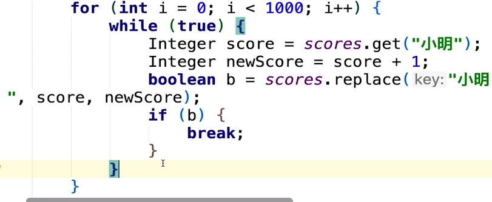

### 输入输出

读取控制台

```java
//方法1
Scanner input = new Scanner(System.in);
String s  = input.nextLine();
input.close();
//方法 2：通过 BufferedReader
BufferedReader input = new BufferedReader(new InputStreamReader(System.in));
String s = input.readLine();
```

读取文本内容

```java
//读取文本文件的内容
try (Scanner scanner = new Scanner(new File("test.txt"))) {
    while (scanner.hasNext()) {
        System.out.println(scanner.nextLine());
    }
} catch (FileNotFoundException fnfe) {
    fnfe.printStackTrace();
}
```

### 枚举

```java
Vector<String> dayNames = new Vector<String>();
      dayNames.add("Sunday");
      dayNames.add("Monday");
      dayNames.add("Tuesday");
      dayNames.add("Wednesday");
      dayNames.add("Thursday");
      dayNames.add("Friday");
      dayNames.add("Saturday");

      days = dayNames.elements();
      while (days.hasMoreElements()){
         System.out.println(days.nextElement()); 
      }
```

### 栈

> 栈是Vector的一个子类
>
> Stack<Integer> st = new Stack<Integer>();

| 序号 | 方法描述                                                     |
| ---- | ------------------------------------------------------------ |
| 1    | boolean empty()   				测试堆栈是否为空。         |
| 2    | Object peek( )  				查看堆栈顶部的对象，但不从堆栈中移除它。 |
| 3    | Object pop( )  				移除堆栈顶部的对象，并作为此函数的值返回该对象。 |
| 4    | Object push(Object element)  				把项压入堆栈顶部。 |
| 5    | int search(Object element)  				返回对象在堆栈中的位置，以 1 为基数。 |


### 队列

> LinkedList类实现了Queue接口
>
>  Queue<String> queue = new LinkedList<String>();

add        增加一个元素          如果队列已满，则抛出一个IIIegaISlabEepeplian异
put         添加一个元素                      如果队列满，则阻塞
offer       添加一个元素并**返回true**       **如果队列已满，则返回false**

remove()   移除并返回队列头部的元素    如果队列为空，则抛出一个NoSuchElementException异常
take        移除并返回队列头部的元素     如果队列为空，则阻塞
poll         移除并返问队列头部的元素    如果队列为空，则返回null

element  返回队列头部的元素             如果队列为空，则抛出一个NoSuchElementException异常
peek       返回队列头部的元素             如果队列为空，则返回null

 drainTo(list)   一次性取出队列所有元素

```
入队，队列默认添加到队列末尾。出队，默认队头
入队，队尾指针移动；出队，队头指针移动
removeFirst
pollFirst
* 将指定元素添加到此列表的结尾：add(E e); || offer(E e);
* 获取并移除此列表的头：poll(); || remove();
addFirst
offerFirst
```


##### 优先队列

```java
//默认为小顶堆，升序
PriorityQueue<Integer> minHeap = new PriorityQueue<>(k, (a,b)->a-b);
 
PriorityQueue<Integer> minHeap = new PriorityQueue<>(k, new Comparator<Integer>() {
           @Override
           public int compare(Integer a, Integer b) {
               return a - b;
           }
 });
 
//大顶堆
PriorityQueue<Integer> maxHeap = new PriorityQueue<>(k, (a,b)->b-a);
 
PriorityQueue<Integer> maxHeap = new PriorityQueue<>(k, new Comparator<Integer>() {
           @Override
           public int compare(Integer a, Integer b) {
               return b - a;
           }
 });

peek() element()
poll(); 
remove(num) ，
pq.clear(),
pq.offer(i);
pq.add(i);
```

**说说你对队列的理解**

\1. 首先队列本身也是个容器，**底层也会有不同的数据结构**，比如 LinkedBlockingQueue 是底层是链表结构，所以可以维持先入先出的顺序，比如 DelayQueue 底层可以是队列或堆栈，所 以可以保证先入先出，或者先入后出的顺序等等，底层的数据结构不同，也造成了操作实现 不同； 

\2. 部分队列（比如 LinkedBlockingQueue ）**提供了暂时存储**的功能，我们可以往队列里面放数据，同时也可以从队列里面拿数据，两者可以同时进行； 

\3. 队列把生产数据的一方和消费数据的一方进行解耦，生产者只管生产，消费者只管消费，两 者之间没有必然联系，**队列就像生产者和消费者之间的数据通道**一样，如 LinkedBlockingQueue； 

\4. 队列还可以对消费者和生产者进行管理，比如队列满了，有生产者还在不停投递数据时，队列可以使生产者阻塞住，让其不再能投递，比如队列空时，有消费者过来拿数据时，队列可以让消费者 hodler 住，等有数据时，唤醒消费者，让消费者拿数据返回，如 ArrayBlockingQueue；

### ArrayList

| 方法                                                         |                             描述                             |
| ------------------------------------------------------------ | :----------------------------------------------------------: |
| [add()](https://www.runoob.com/java/java-arraylist-add.html) |                    `list.add("Google");`                     |
| [addAll()](https://www.runoob.com/java/java-arraylist-addall.html) |               `numbers.addAll(primeNumbers);`                |
| [clear()](https://www.runoob.com/java/java-arraylist-clear.html) | `循环获取集合中的各个元素，然后将其设为null，并将集合长度设为0；` |
| [clone()](https://www.runoob.com/java/java-arraylist-clone.html) | `ArrayList<String> cloneSites = (ArrayList<String>)sites.clone();将返回的值转变成一个 String 类型的动态数组` |
| [contains()](https://www.runoob.com/java/java-arraylist-contains.html) |                   判断元素是否在 arraylist                   |
| [get()](https://www.runoob.com/java/java-arraylist-get.html) |              通过索引值获取 arraylist 中的元素               |
| [indexOf()](https://www.runoob.com/java/java-arraylist-indexof.html) |                返回 arraylist 中元素的索引值                 |
| [removeAll()](https://www.runoob.com/java/java-arraylist-removeall.html) | 相当于与调用的容器对象作交集，然后去除交集，也就是作**差运算**，所有要去除多个相同元素可使用removeAll |
| [remove()](https://www.runoob.com/java/java-arraylist-remove.html) |         **只能移除一个元素**，多个重复的无法全部移除         |
| [size()](https://www.runoob.com/java/java-arraylist-size.html) |                  返回 arraylist 里元素数量                   |
| [isEmpty()](https://www.runoob.com/java/java-arraylist-isempty.html) |                   判断 arraylist 是否为空                    |
| [subList()](https://www.runoob.com/java/java-arraylist-sublist.html) |             `list.subList(1,3)截取list区间[1,3)`             |
| [set()](https://www.runoob.com/java/java-arraylist-set.html) |               替换 arraylist 中指定索引的元素                |
| [sort()](https://www.runoob.com/java/java-arraylist-sort.html) | `sites.sort(Comparator.naturalOrder());升序；sites.sort(Comparator.reverseOrder());降序` |
| [toArray()](https://www.runoob.com/java/java-arraylist-toarray.html) |                   将 arraylist 转换为数组                    |
| [toString()](https://www.runoob.com/java/java-arraylist-tostring.html) |                  将 arraylist 转换为字符串                   |
| [ensureCapacity](https://www.runoob.com/java/java-arraylist-surecapacity.html)() |                 设置指定容量大小的 arraylist                 |
| [lastIndexOf()](https://www.runoob.com/java/java-arraylist-lastindexof.html) |        返回指定元素在 arraylist 中最后一次出现的位置         |
| [retainAll()](https://www.runoob.com/java/java-arraylist-retainall.html) |        保留 arraylist 中在指定集合中也存在的那些元素         |
| [containsAll()](https://www.runoob.com/java/java-arraylist-containsall.html) | `检查动态数组1是否包含动态数组2 ;  boolean result1 = sites.containsAll(sites2);` |
| [trimToSize()](https://www.runoob.com/java/java-arraylist-trimtosize.html) |         将 arraylist 中的容量调整为数组中的元素个数          |
| [removeRange()](https://www.runoob.com/java/java-arraylist-removerange.html) |           删除 arraylist 中指定索引之间存在的元素            |
| [replaceAll()](https://www.runoob.com/java/java-arraylist-replaceall.html) |              `numbers.replaceAll(e -> e * 2);`               |
| [removeIf()](https://www.runoob.com/java/java-arraylist-removeif.html) | `删除名称中带有 Tao 的元素            sites.removeIf(e -> e.contains("Tao"));` |
| [forEach()](https://www.runoob.com/java/java-arraylist-foreach.html) | `numbers.forEach((e) -> {<e = e * 10;            System.out.print(e + " ");        });` |

### hashSet

> HashSet 基于 HashMap 来实现的

| `boolean`     | `add(E e)`           | 如果指定的元素尚不存在，则将其添加到此集合中。             |
| ------------- | -------------------- | :--------------------------------------------------------- |
| `void`        | `clear()`            | 从该集中删除所有元素。                                     |
| `Object`      | `clone()`            | 返回此  `HashSet`实例的浅表副本：未克隆元素本身。          |
| `boolean`     | `contains(Object o)` | 如果此set包含指定的元素，则返回                 `true` 。  |
| `boolean`     | `isEmpty()`          | 如果此集合不包含任何元素，则返回                 `true` 。 |
| `Iterator<E>` | `iterator()`         | 返回此set中元素的迭代器。                                  |
| `boolean`     | `remove(Object o)`   | 如果存在，则从该集合中移除指定的元素。                     |
| `int`         | `size()`             | 返回此集合中的元素数（基数）。                             |

遍历

```java
// 方法一：
		Iterator<String> iterator = set.iterator();
		System.out.println("--------迭代器遍历HashSet----------");
		while(iterator.hasNext()){
			System.out.print(iterator.next()+",");
		}

		// 方法二：
		System.out.println("--------加强for循环遍历---------");
		for (String item : set) {
			System.out.print(item+",");
		}
```

### HashMap

> HashMap<String, Integer> prices = **new** HashMap<>();

| 方法                                                         | 描述                                                         |
| ------------------------------------------------------------ | ------------------------------------------------------------ |
| [clear()](https://www.runoob.com/java/java-hashmap-clear.html) | 删除 hashMap 中的所有键/值对                                 |
| [clone()](https://www.runoob.com/java/java-hashmap-clone.html) | 复制一份 hashMap                                             |
| [isEmpty()](https://www.runoob.com/java/java-hashmap-isempty.html) | 判断 hashMap 是否为空                                        |
| [size()](https://www.runoob.com/java/java-hashmap-size.html) | 计算 hashMap 中键/值对的数量                                 |
| [put()](https://www.runoob.com/java/java-hashmap-put.html)   | 将键/值对添加到 hashMap 中                                   |
| [putAll()](https://www.runoob.com/java/java-hashmap-putall.html) | 将所有键/值对添加到 hashMap 中                               |
| [putIfAbsent()](https://www.runoob.com/java/java-hashmap-putifabsent.html) | **key不存在，插入key,value,返回null；存在，直接返回value。`sites.putIfAbsent(2, "Wiki");`** |
| [remove()](https://www.runoob.com/java/java-hashmap-remove.html) | 删除 hashMap 中指定键 key 的映射关系                         |
| [containsKey()](https://www.runoob.com/java/java-hashmap-containskey.html) | 检查 hashMap 中是否存在指定的 key 对应的映射关系。           |
| [containsValue()](https://www.runoob.com/java/java-hashmap-containsvalue.html) | 检查 hashMap 中是否存在指定的 value 对应的映射关系。         |
| [replace()](https://www.runoob.com/java/java-hashmap-replace.html) | 替换 hashMap 中是指定的 key 对应的 value。                   |
| [replaceAll()](https://www.runoob.com/java/java-hashmap-replaceall.html) | 将 hashMap 中的所有映射关系替换成给定的函数所执行的结果。    |
| [get()](https://www.runoob.com/java/java-hashmap-get.html)   | 获取指定 key 对应对 value                                    |
| [getOrDefault()](https://www.runoob.com/java/java-hashmap-getordefault.html) | **获取指定 key 对应对 value，如果找不到 key ，则返回设置的默认值** |
| [forEach()](https://www.runoob.com/java/java-hashmap-foreach.html) | 对 hashMap 中的每个映射执行指定的操作。                      |
| [entrySet()](https://www.runoob.com/java/java-hashmap-entryset.html) | 返回 hashMap 中所有映射项的集合集合视图。                    |
| [keySet](https://www.runoob.com/java/java-hashmap-keyset.html)() | 返回 hashMap 中所有 key 组成的集合视图。                     |
| [values()](https://www.runoob.com/java/java-hashmap-values.html) | 返回 hashMap 中存在的所有 value 值。                         |
| [merge()](https://www.runoob.com/java/java-hashmap-merge.html) | 添加键值对到 hashMap 中                                      |
| [compute()](https://www.runoob.com/java/java-hashmap-compute.html) | `key不存在，返回null；存在，返回修改的值`                    |
| [computeIfAbsent()](https://www.runoob.com/java/java-hashmap-computeifabsent.html) | **key不存在，修改value，返回value；存在，直接value**。`int shirtPrice = prices.computeIfAbsent("Shirt", key -> 280);` |
| [computeIfPresent()](https://www.runoob.com/java/java-hashmap-computeifpresent.html) | `key不存在，返回null；存在，返回修改的值`                    |


## （2）集合框架

### ArrayList和LinkedList

#### ArrayList和LinkedList区别 ⭐️

ArrayList：基于**动态数组，连续内存存储，适合下标访问（随机访问）**，扩容机制：因为数组长度固定，**超出长度存数据时需要新建数组**，然后将老数组的数据拷贝到新数组，如果不是尾部插入数据还会涉及到元素的移动（往后复制一份，插入新元素），**使用尾插法并指定初始容量可以极大提升性能**、甚至超过linkedList（需要创建大量的node对象） 

LinkedList：基于双向链表，可以存储在**分散的内存**中，适合**做数据插入及删除操作，不适合查询**：需要逐 一遍历遍历LinkedList必须使用iterator，不能使用for循环，因为每次for循环体内通过get(i)取得某一元素时都需要对list重新进行遍历，性能消耗极大。 

另外不要试图使用**indexOf**等返回元素索引，并利用其进行遍历，使用indexOf对list进行了遍历，**当结果为空时会遍历整个列表**。

#### ArrayList

- 允许 put null 值，会自动扩容；

  > 新增元素：1）是否需要扩容，如果需要执行扩容操作，2）直接赋值
  > 新增时，并没有对值进行严格的校验，所以 ArrayList 是允许 null 值的。
  >
  > 
  >
  > 三种初始化办法：无参数直接初始化、指定大小初始化、指定初始数据初始化，ArrayList 无参构造器初始化时，默认大小是空数组，并不是大家常说的 10，10 是在第一次 add 的时候扩容的数组值。
  >
  > （1）扩容是会先新建一个符合我们预期容量的新数组，然后把老数组的数 据拷贝过去；扩容的规则并不是翻倍，是原来容量大小 + 容量大小的一半，直白来说，**扩容后的大小是原 来容量的 1.5 倍**；
  > 被加入一个值后，如果我使用 addAll 方法，一下子加入 15 个值，如果扩容后的值 *<* *我们的期望值，我们的期望值就等于本次扩容的大小*16。
  >
  > （2）扩容后数组的大小下界不能小于 0，上界 不能大于 Integer.MAX_VALUE，超过这个值，JVM 就不会给数组分配内存空间了。 

- size、isEmpty、get、set、add 等方法时间复杂度都是 O (1)； 

- 只有当 ArrayList 作为共享变量时，才会有线程安全问题，当 ArrayList 是方 

  法内的局部变量时，是没有线程安全的问题的。多线程情况下，推荐使用线程安全类：Collections#synchronizedList，但是性能大大降低，

-  fail-fast

##### 1.1删除

有一个 ArrayList，数据是 2、3、3、3、4，中间有三个 3，现在我通过 for (int i=0;i<list.size  ();i++) 的方式，想把值是 3 的元素删除，请问可以删除干净么？最终删除的结果是什么，为什么？

最终删除的结果是 2、3、4。每次删除一个元素后，该元素后面的元素就会往前移动，而此时循环的 i  在不断地增长，最终会使每次删除 3 的后一个 3 被遗漏，导致删除不掉。

> **使用迭代器的remove（）而不是集合类的remove**
>
> 因为Iterator独立的线程中工作的,拥有mutex锁。 Iterator.remove () 方法在执行的过程中，会把最新的 modCount 赋值给 
>
> expectedModCount，这样在下次循环过程中，modCount 和 expectedModCount 两者就会相等。

##### 2.**遍历方式**

```java
//第一种方法： for-each遍历 list
        for(String str : list){          //同for(int i = 0;i<list.size();i++)
            System.out.println(str);
        }
        
        //第二种方法： 把链表变为数组相关的内容进行遍历
        String[] strArray = new String[list.size()];
        list.toArray(strArray);
        for(String str: strArray){
            System.ot.println(strArray[i]);
        }
        
        //第三种方法： 使用迭代器
        //第三种方法不用担心在遍历过程中超过集合的长度
        Iterator<String> ite = list.iterator();
        while(ite.hasNext()){
            System.out.println(ite.next());
        }
```

#### 如何实现 List 集合去重？

- 自定义方法去重（通过循环判断当前元素是否存在多个，如果存在删除重复项）
- 使用set集合去重，使用hashset之后元素的先后顺序发生变化，使用**LinkedHashSet**进行去重
- 使用Stream流去重功能，list.stream().distinct().collect(Collectors.tolist())

#### List和Set区别

- List：**有序**，按对象进入的顺序保存对象，**可重复，允许多个Null元素对象**，可以**使用Iterator**取出所有元素，在逐一遍历，还可以**使用get(int index)**获取指定下标的元素 
- Set：**无序，不可重复，最多允许有一个Null元素对象**，取元素时**只能用Iterator**接口取得所有元素，在逐一遍历各个元素

### CopyOnWriteArrayList⭐️

#### 场景

> 读多写少的场景


背景：如果要把 ArrayList 作为共享变量的话，是线程不安全的，推荐我们自己加锁或者使用 Collections.synchronizedList 方法，jdk提供了另外 一种线程安全的 List，叫做 CopyOnWriteArrayList。

#### 原理

从整体架构上来说，CopyOnWriteArrayList 数据结构和 ArrayList 是一致的，底层是个数组，只 不过 CopyOnWriteArrayList 在对数组进行操作的时候，基本会分四步走：

> 1. 加锁； 2. 从原数组中拷贝出新数组； 3. 在新数组上进行写操作，并把新数组赋值给数组容器； 4. 解锁。
>
>    除了加锁之外，CopyOnWriteArrayList 的底层**数组还被 volatile 关键**字修饰，意思是一旦数组被修改，其它线程立马能够感知到

\1. **加锁**：保证同一时刻数组只能被一个线程操作； 

\2. **数组拷贝**：保证数组的内存地址被修改，修改后触发 volatile 的可见性，其它线程可以立马 

知道数组已经被修改； 

总结：CopyOnWriteArrayList 通过锁 + 数组拷贝 + volatile 之间的相互配合，实现了 List 的线程安全。

**都已经加锁了，为什么需要拷贝数组**，而不是在原来数组上面进行操作呢，原因 

主要为：

> 1）对数组进行**加锁后**，能够保证同一时刻，只有一个线程能对数组进行 add，在单核 CPU 下的多线程环境下肯定没有问题（因为不同线程共享缓存），但我们现在的机器都是多核 CPU，如果我们不通过复制拷贝新建数组，修改原数组容器的内存地址的话，是无法触发 volatile 可见性效果的，那么其他 CPU 下的线程就无法感知数组原来已经被修改了，就会引发多核 CPU 下的线程安全问题。。 
>
> 2）假设我们不复制拷贝，而是在原来数组上直接修改值，数组的内存地址就不会变，而数组被 volatile 修饰时，必须当数组的内存地址变更时，才能及时的通知到其他线程。如果内存地址不变， 仅仅是数组元素值发生变化时，是无法把数组元素值发生变动的事实，通知到其它线程的。	

#### 缺点


#### 方法

**插入**：当插入的位置正好处于末尾时，只需要拷贝一次，当插入的位置处于中间时， 此时我们会把原数组一分为二，进行两次拷贝操作。

> ArrayList 只需拷贝一次，假设插入的位置是 2，只需要把位置 2 （包含 2）后面的数据都往后移动一位即可，所以拷贝一次。
>
> CopyOnWriteArrayList 拷贝两次，因为 CopyOnWriteArrayList **多了把老数组的数据拷贝到新数 组**上这一步，可能有的同学会想到这种方式：先把老数组拷贝到新数组，再把 2 后面的数据往后 移动一位，这的确是一种拷贝的方式（差不多2倍数据量），但 CopyOnWriteArrayList 底层实现更加灵活，而是：把 老数组 0 到 2 的数据拷贝到新数组上，预留出**新数组 2** 的位置(要插入的元素)，再把老数组 3～ 最后的数据拷贝 到新数组上，这种拷贝方式可以减少我们拷贝的数据，虽然是两次拷贝，但拷贝的数据却仍然是 老数组的大小，设计的非常巧妙。

**批量删除**：先对数组中的值进行循环判断，把我们不需要删除的数据放到新数组中，最后新数组中的数据就是我们不需 要删除的数据。而不是直接对数组中的元素进行挨个删除。因为单个删除的话，在每次删除的时候都会进行一次数组拷贝(删除最后一个元素时不会拷贝)，很消耗性能，也耗时，会导致加锁时间太长，并发大的情况下，会造成大量请求在等待锁，这也会占用一定的内存。
查找：indexOf 方法的主要用处是查找元素在数组中的下标位置，如果元素存在就返回元素的下标位置， 元素不存在的话返回 -1，不但支持 null 值的搜索，还支持正向和反向的查找。
迭代：在其迭代过程中，即使数组的原值被改变， 也不会抛出 ConcurrentModificationException 异常，其根源在于数组的每次变动，都会生成新的 数组，不会影响老数组，所以迭代也可以正常进行。

### HashSet，HashMap

#### HashSet如何保证元素不重复的？

HashSet 添加元素的执行流程是：

- 当把对象加入 HashSet 时，HashSet 会先计算对象的 hashcode 值来判断对象加入的位置，同时也会与其他加入的对象的 hashcode 值作比较
- 如果没有相符的 hashcode，HashSet 会假设对象没有重复出现，会将对象插入到相应的位置中。
- 但是如果发现有相同 hashcode 值的对象，这时会调用对象的 equals() 方法来检查对象是否真的相同，如果相同，则 HashSet 就不会让重复的对象加入到 HashSet 中，这样就保证了元素的不重复。

> HashSet 是无序的，不能保证插入和迭代的顺序一致。
>
> LinkedHashSet就可以保证

#### HashSet与HashMap

(1)HashSet实现了Set接口, 仅存储对象; HashMap实现了 Map接口, 存储的是键值对.

(2)HashSet底层其实是用HashMap实现存储的, HashSet封装了一系列HashMap的方法. 依靠HashMap来存储元素值,(利用hashMap的key键进行存储), 而value值默认为Object对象. 所以HashSet也不允许出现重复值, 判断标准和HashMap判断标准相同, 两个元素的hashCode相等并且通过equals()方法返回true.

#### HashMap**、**TreeMap**、**LinkedHashMap三者有啥相同点，有啥不同点？

**相同点**： 

1. 三者在特定的情况下，都会使用红黑树； 

2. 底层的 hash 算法相同； 

3. 在迭代的过程中，如果 Map 的数据结构被改动，都会报**ConcurrentModificationException**  的错误。 

**不同点**： 

1. HashMap **数据结构**以**数组（链表+红黑树）**为主，查询非常快，TreeMap 数据结构以**数组+红黑树**为主，利用了红 黑树左小右大的特点，可以实现 key 的排序，LinkedHashMap 在 HashMap 的基础上增加了 链表的结构，实现了插入顺序访问和最少访问删除两种策略; 

2. 由于三种 Map 底层数据结构的差别，导致了三者的使用场景的不同，TreeMap 适合需要**根 据 key 进行排序**的场景，LinkedHashMap 适合按照**插入顺序访问，或需要删除最少访问**元 素的场景，剩余场景我们使用 HashMap 即可，我们工作中大部分场景基本都在使用 HashMap； 

3. 由于三种 map 的底层数据结构的不同，导致上层包装的 api 略有差别。

#### HashMap有几种遍历方法？推荐使用哪种？

- EntrySet遍历


- KeySet遍历（遍历2遍，性能不如entrySet）


- 使用EntrySet或者KeySet的迭代器遍历（需要动态删除元素）

- > 如果不使用迭代器遍历。那么在遍历过程中删除元素，就会抛出ConcurrentModificationException并发修改异常，由于fail-fast 机制。fail-fast机制：集合类的迭代器，每次调用next()方法，在实际访问元素前，都会调用checkForComodification方法。因此，使用集合类的 remove 方法，会报错。
  >
  > java.util**包下面的所有的集合类都是**fail-fast机制。而**java.util.concurrent**包下面的所有的类都是**fail-safe**的。原因是采用安全失败机制的集合容器，在遍历的时候不是直接在集合内容上进行访问，而是先复制原有集合的内容，而在拷贝的集合上去进行遍历。常用的有concurrent hashmap 和 copyonwriteArrayList 等等

- Stream遍历（简洁）


先得到map集合的entrySet，再执行forEach循环，还支持多线程遍历（高效）


#### HashMap（线程不安全）⭐️

**HashMap和HashTable有什么区别？**

1.区别 ： 

（1）HashMap方法没有synchronized修饰，线程非安全，HashTable线程安全； 

（2）HashMap**允许key和value为nul**l，而HashTable不允许 

（3）HashMap二次hash后再数组的长度直接进行取模；`Hashtable`计算`hash`是直接使用`key`的`hashcode`对`table`数组的长度直接进行取模。

2.其底层实现是什么？

hashmap 是以键值对的形式进行存储。在 jdk 1.7 到 jdk 1.8 之间hashmap 的实现略有区别。
其中两个比较重要的区别，一个是hashmap 也意在 jdk 1.7 的时候，hash map 采用的**数据结构**是数组加链表，但是到了 jdk 1.8 之后改成了数加链表加红黑树，为了提高它的查询效率，因为我们链表的查询时间的复杂度是 o(n) ， 但是我们的红黑树是 O(logN)，还有一点就是希在 jdk 1.7 之前，当我们遇到**哈希碰撞**，需要在链表上添加数据的时候，采用的是头插法。但是到了 gtk 1.8 之后改用了尾插法。因为头插法在**多线程的情况下会导致一些问题**，比如说它会形成循环链表，耗尽我们 CPU 的性能。为了解决这个问题，在 jdk 1.8 之后改用了尾插法，数据插入是顺序的，不会出现循环链表的情况。

**线程不安全问题**

> （1）jdk1.7 循环链表：多个线程同时对HashMap进行put操作使HashMap 扩容的时候
>
> （2）多线程的 put 可能导致元素的丢失。多线程同时执行 put 操作，如果计算出来的索引位置是相同的，那会造成前一个 key 被后一个 key 覆盖，从而导致元素的丢失。此问题在 JDK 1.7 和 JDK 1.8 中都存在。


接下来我就 jdk 1.8 一些基本原理。首先我们在创建hashmap 的时候，阿里格约里边要求我们需要传入一个初始化容量。在我们将来可能要插入多少数据的前提下，我们最好传入一个初始化容量，而且这个初始化容量最好是一个 2 的次幂。我接下来会和您接着去聊**为什么是 2 的次幂**。

首先当我们去往hashmap put 值的时候，当 put 第一个值的时候，我们的刚才所说的不管是数组加链表还是数组加链表，加红黑数，当中的数组，会被初始化。**大于等于这个初始化容量的最近的一个二次幂**这么一个值给我们进行初始化数组，然后初始化之后，它会使用它的 key的 哈希值与上它的容量（ 2 的次幂减1），算出它的下标，因为容量都是 2 的次幂，二次幂减 1 之后，它所有的低位都是1，高位都是0。和哈希进行与运算之后，他一定能算出一个值在咱们的容量范围之内的这么一个下标。因为与运算在计算机里边效率非常的高所以它采取的是与运算，而不是取余运算取余运算的效率非常的慢。

当然在咱们往里边添加数据的时候，会产生两个问题，一个问题就是**扩容**的问题。一个问题就是**树化**的问题。

关于扩容的问题，在Hashmap 里边有一个成员变量是他叫扩容加载因子。当我们hashmap 的size ，就是你插入的节点的数量大于等于咱们的容量乘以扩容加载因子也就是咱们的 16 乘以0.75，也就是当 size 大于等于 12 的时候，它就会进行一次扩容，大小变为原来的2倍。当然当我们的链表上悬挂的数据节点足够多的时候，它还会进行树化。当然扩容和树化都是一个很耗性能的操作。树化的前提就是我们的链表长度必须**大于等于8**，当然这还不够，在我们hash map 的源码里面还有一个成员变量，它默认是64。如果数组的容量达不到**64**，它会优先选择扩容，而不是对咱们的链表进行树化。所以树化它是有两个先决条件的，一个就是它的第一个数组的容量要大于等于64。第二个就是链表的长度要大于等于8。

阿里规约里面要求我们传入初始化容量，其实根本的目的就是在于少扩容。少扩容我阿里规约的这个初始化容量的计算方式=数据的数量除以扩容因子，然后减 1 。

**插入**

首先会调用key1所在类的hashCode()方法计算key1的哈希值，然后通过扰动算法(h^(h>>16))得到新的哈希值，哈希值与（数组大小-1），计算出在Entry数组中的存放位置。
如果此位置上没有存放数据，则添加成功。
如果此位置上有数据，则比较key1和已经存放的数据的哈希值
  如果key1的哈希值和已经存放的数据的哈希值都不相同，则（key1-value1）添加成功。
  如果key1的哈希值和已经存放的某一个数据（key2-value2）的哈希值相同，则调用key1所在类的equals(key2)方法
    如果equals返回false，则（key1-value1）添加成功。
    如果equals返回true,则使用value1替换value2。
如果链表中插入节点的时候，链表长度大于等于8，数组达到64，则需要把链表转换为红黑树。（红黑树长度小于等于6转换为链表，为什么6？中间有个差值7可以防止链表和树之间频繁的转换。）

最后所有元素处理完成后，判断是否超过阈值；threshold，超过则扩容。扩容成功后，对元素的下标进行重新计算。

**查找**

1. 使用扰动函数，获取新的哈希值，计算数组下标，获取节点
2. 当前节点和key匹配，直接返回
3. 否则，当前节点是否为树的节点，查找红黑树
4. 否则，遍历链表查找

**（1）你对红黑树了解多少？为什么不用二叉树/平衡树呢？**

红黑树本质上是一种二叉查找树，为了保持平衡，通过染色或旋转。它又在二叉查找树的基础上增加了一些规则：

1. 每个节点要么是红色，要么是黑色；
2. 根节点永远是黑色的；
3. 所有的叶子节点都是黑色的（注意这里说叶子节点其实是图中的 NULL 节点）；
4. 每个红色节点的两个子节点一定都是黑色；
5. 从任一节点到其子树中每个叶子节点的路径都包含**相同数量的黑色节点**；

> 之所以不用二叉树：

红黑树是一种平衡的二叉树，插入、删除、查找的最坏时间复杂度都为 O(logn)，避免了二叉树最坏情况下的O(n)时间复杂度，退化为顺序查找。

> 之所以不用平衡二叉树：

平衡二叉树是比红黑树更严格的平衡树，为了保持保持平衡，需要旋转的次数更多，也就是说平衡二叉树保持平衡的效率更低，所以**平衡二叉树插入和删除的效率比红黑树要低**。

**（2）红黑树怎么保持平衡的知道吗？**

红黑树有两种方式保持平衡：旋转和染色。

- 旋转：旋转分为两种，左旋和右旋

- 染色

**（2）为什么不用 key % 数组大小，而是需要用 key 的 hash 值 % 数组大小。**

答：如果 key 是数字，直接用 key % 数组大小是完全没有问题的，但我们的 key 还有可能是字符串，是复杂对象，这时候用 字符串或复杂对象 % 数组大小是不行的，所以需要先计算出 key 的 hash 值。

**（3）hash算法，扰动函数**

首先计算出 key 的 hashcode， 因为 key 是 Object，所以会根据 key 的不同类型进行 hashcode 的计算，接着计算 h ^ (h >>> 16) ， 就能达到 h 的高 16 位和低 16 位都能参与计算，**减少了碰撞的可能性**。

hash 值算出来之后，要计算当前 key 在数组中的索引下标位置时，可以采用取模的 方式，就是索引下标位置 = hash 值 % 数组大小，这样做的好处，就是可以保证计算出来的索引 下标值可以均匀的分布在数组的各个索引位置上，但取模操作对于处理器的计算是比较慢的，因此使用hashcode &(n-1)，n为数组大小，2的次幂。
因为只有大小是 2 的幂次方时，才能使 hash 值 % n(数组大小) == (n-1) & hash 公式成立

**（4）为解决*hash* *冲突，大概有哪些办法。***

答：1：好的 hash 算法，细问的话复述一下上题的 hash 算法; 

2：自动扩容，当数组大小快满的时候，采取自动扩容，可以减少 hash 冲突; 

3：hash 冲突发生时，采用链表来解决; 

4：hash 冲突严重时，链表会自动转化成红黑树，提高遍历速度。

- 线行探查法

- 平方探查法

- 再哈希法

***（5）为什么链表个数大于等于* *8* *时，链表要转化成红黑树了？***

答：当链表个数太多了，遍历可能比较耗时O(N)，转化成红黑树O(logN)，可以使遍历的时间复杂度降低，但 转化成红黑树，**有空间和转化耗时的成本**，我们通过泊松分布公式计算，正常情况下，**链表个数 出现 8 的概念不到千万分之一**，所以说正常情况下，链表都不会转化成红黑树，这样设计的目的， 是为了防止非正常情况下，比如 hash 算法出了问题时，导致链表个数轻易大于等于 8 时，仍然能够快速遍历。

**（6）扩容在什么时候呢？为什么扩容因子是0.75？**

为了减少哈希冲突发生的概率，当当前HashMap的元素个数达到一个临界值的时候，就会触发扩容，把所有元素rehash之后再放在扩容后的容器中，这是一个相当耗时的操作。

这个临界值threshold就是由加载因子和当前容器的容量大小来确定的。

临界值= 默认容量* 默认扩容因子=16*0.75=12

> 那么为什么选择了0.75作为HashMap的默认加载因子呢？

简单来说，这是对空间成本和时间成本平衡的考虑。

HashMap的散列构造方式是Hash取余，负载因子决定元素个数达到多少时候扩容。

假如我们设的**比较大**，元素比较多，空位比较少的时候才扩容，那么发生哈希冲突的概率就增加了，**查找的时间成本**就增加了。

我们设的**比较小的话**，元素比较少，空位比较多的时候就扩容了，发生哈希碰撞的概率就降低了，查找时间成本降低，但是就需要更多的空间去存储元素，**空间成本**就增加了。

**（7）HashMap *在* *put* *时，如果数组中已经有了这个* *key，我不想把* *value* *覆盖怎么办？取值时，如* 果得到的 *value* *是空时，想返回默认值怎么办？***

如果数组有了 key，但不想覆盖 value ，可以选择 **putIfAbsent** 方法，这个方法有个内置变量 **onlyIfAbsent**，内置是 true ，就不会覆盖，我们平时使用的 put 方法，内置 onlyIfAbsent 为 false， 是允许覆盖的。

取值时，如果为空，想返回默认值，可以使用 **getOrDefault** 方法，方法第一参数为 key，第二个 参数为你想返回的默认值，如 map.getOrDefault(“2”,“0”)，当 map 中没有 key 为 2 的值时，会默 认返回 0，而不是空。

**HashMap 中的 key若 Object类型， 则需实现哪些方法？**

重写hashcode和equals
**为什么 HashMap 中 String、Integer 这样的包装类适合作为 key 键**


#### 扩容时如否get或put

不能，如果外部方法在调用HashMap时没有任何同步或加锁，那么HashMap在扩容时，很可能查询到的是空数据null。

不能，put可能丢失数据，极端情况hashmap会被清空；1.7还可能会死循环，1.8已解决。

#### 1.7，1.8扩容区别

- 转移数组方式不同，1.7中是头插法，1.8中是尾插法

- 位置的计算方式不同，1.8中容量扩充为原来的2倍，扩容后的位置要么等于原位置，要么等于原位置+旧容量。1.7中是全部按照原来方法计算，全部重新计算一次hashcode
- 元素插入时机不同，1.7先扩容后插入；1.8 先插入后扩容

### ConcurrentHashMap

#### 与hashmap的区别

相同点：

1）都是数组 + 链表 +红黑树的数据结构，所以基本操作的思想相同； 

2）都实现了 Map 接口，继承了 AbstractMap 抽象类，所以两者的方法大多都是相似的，可以互相切换。 

不同点：

1）ConcurrentHashMap 是线程安全的，在多线程环境下，**无需加锁**，可直接使用； 

2） 数据结构上，ConcurrentHashMap 多了转移节点，主要用于保证**扩容时的线程安全**。（当我们**发现当前节点的 hash 值是 -1**，表示是转移节点，即表示 Map 正在进行扩容。）

3）hashmap允许插入null；ConcurrentHashMap**不允许插入null**

#### 如何保证线程安全

- 储存 Map 数据的数组被 **volatile 关键**字修饰，一旦被修改，立马就能通知其他线程，因为是数组，所以需要改变其内存值，才能真正的发挥出 volatile 的可见特性； 

- put 时，如果计算出来的数组下标索引没有值的话，采用**自旋 + CAS 算法**，来保证 一定可以新增成功，又不会覆盖其他线程 put 进去的值； 

- 如果 put 的节点正好在扩容，会一起协助扩容，**等待扩容完成之后**，再进行 put ，保证了在扩容时，老数组的值不会发生变化； 

- 对数组的槽点进行操作时，会先**锁住槽点**，保证只有当前线程才能对槽点上的链表或红黑树进行操作； 

- 红黑树旋转时，会**锁住根节点**，保证旋转时的线程安全。

#### 扩容区别


#### CAS在ConcurrentHashMap的应用

CAS 其实是一种乐观锁，一般有三个值，分别为：**赋值对象，期望值，新值**，在执行的时候， 会先判断内存中的值是否和期望值相等，相等的话把新值赋值给对象，否则赋值失败，整个过程都 是原子性操作，没有线程安全问题。  

ConcurrentHashMap 的 put 方法中，有**使用到 CAS ，是结合无限 for 循环**一起使用的，步骤如下： 

\1. 计算出数组索引下标，拿出下标对应的原值； 

\2. CAS 覆盖当前下标的值，赋值时，如果发现内存值和 1 拿出来的原值相等，执行赋值，退出 循环，否则不赋值，转到 3； 

\3. 进行下一次 for 循环，重复执行 1，2，直到成功为止。 

#### ConcurrentHashMap原理，jdk7和jdk8版本的区别⭐️

为什么不用Hashmap，hashtable？

> 发度更高
>
> hashtable 它是直接对里面的方法进行了一个 synchronized 加了一个对象锁
>
> 而ConcurrentHashMap，它使用了 CAS 加 synchronized，锁住的是链表的head节点，锁的粒度更小， 然后再加上 jdk.16 以后对 synchronized 进行了一个优化，**锁升级**的过程，所以它的效率是更高的，它支持的并发度是更高的。

（1）jdk7：

数据结构：**ReentrantLock+Segment+HashEntry**，一个Segment中包含一个HashEntry数组，每个HashEntry又是一个**链表结构** 

锁：Segment分段锁(锁的粒度小)，**Segment继承了ReentrantLock**，锁定操作的Segment，其他的Segment不受影响，并发度为segment个数，可以通过构造函数指定；**数组扩容不会影响其他的segment** 

插入：

- 第一次计算key的hash，找到Segment元素的位置；

- 判断当前Segment元素是否初始化，若没有初始化，则通过**CAS进行初始化**；

- 第二次计算key的hash，找到HashEntry数组的位置

- 由于Segment继承了ReentrantLock锁，所以TryLock() 尝试获取锁，如果锁过去成功，将数据插入到HashEntry位置；

  > 如果遇到Hash冲突，则插入到链表的末端；

- 如果锁被其他线程获取，那么就会以**自旋的方式重新获取锁**，超过指定的次数之后还获取不到的话，就会挂起，等待唤醒；

元素查询：二次hash，第一次Hash定位到Segment，第二次Hash定位到元素所在的链表的头部（数组下标）

get方法**无需加锁，(val) volatile保证** 

- 第一次计算key的hash，找到Segment元素的位置；
- 第二次计算key的hash，找到HashEntry数组的位置；
- 遍历链表，匹配就返回，否则返回null；

扩容：先扩容后插入（**可能这次插入无hash冲突**，而急于扩容，会造成一次无效扩容）， 每个Segment内部会进⾏扩容，和HashMap的扩容逻辑类似 

元素转移：无论是JDK7还是JDK8，HashMap的扩容都是每次扩容为原来的两倍，即会产生一个新的数组newtable，我们需要把原来数组中的元素全部放到新的数组，只不过元素求桶的位置的方法不太一样。

1）求key的hashcode
 2）将hashcode的高16位和低16位进行异或操作。
3）(n - 1) & hash == hash%n，n为新数组的长度

resize（）：HashMap步骤一样，只不过是搬到单线程中执行，避免了HashMap在1.7中扩容时死循环的问题，保证线程安全。

size（）：计算两次，如果不变则返回计算结果，若不一致，则锁住所有的Segment求和。

（2）jdk8： 

数据结构：**synchronized+CAS+Node+红黑树**，Node的**val和next都用volatile修饰，保证可见性** 

锁：**synchronized锁链表的head节点**，不影响其他元素的读写，**锁粒度更细，效率更高；扩容时，阻塞所有的读写 操作、并发扩容 **

**插入**

- 如果没有初始化就先调用initTable（）方法通过volatile+CAS来进行初始化；

- 首先判断key为不为null，为空则抛出空指针异常。不为空，再根据key计算对应下标，如果**没有hash冲突就直接CAS插入**；

  > 如果在进行扩容，则当前线程协助一起扩容，扩容后再插入

- 如果存在hash冲突，就加锁**synchronized**来保证线程安全，这里有两种情况，一种是链表形式，就直接遍历到尾端插入，一种是红黑树就按照红黑树结构插入（最后一个如果该链表的数量大于阈值8，并且数组长度为64，就要先转换成黑红树的结构，再插入）

- 如果添加成功就调用addCount（）方法统计size，并且检查是否需要扩容；扩容成功后，对元素的下标进行重新计算。

get方法**无需加锁，(val) volatile保证** 

- 计算hash值，定位到数组下标位置，如果是首节点符合就返回；
- 如果遇到扩容的时候，会调用标志正在扩容节点ForwardingNode的find方法，查找该节点，匹配就返回；
- 以上都不符合的话，就往下遍历节点，匹配就返回，否则最后就返回null；

扩容：先插入后扩容

元素转移：由于数组的容量**是以2的幂次方扩容**的，只需要将原hash和原数组长度进行与，判断最高位是1还是0就好了。如果是0，那么就代表当前元素的桶位置不变。如果结果为1，那么桶的位置就是原位置+原数组长度（oldCap），因此，在扩容时，**不需要重新计算元素的hash**了。


resize（）：支持并发扩容，HashMap扩容在1.8中由头插改为尾插（为了避免死循环问题），ConcurrentHashmap也是，迁移也是从尾部开始，扩容前在链表的头部放置一个hash值为-1的节点，这样别的线程访问时就能判断是否该桶已经被其他线程处理过了。

size（）： 是通过对 baseCount 和 counterCell 进行 **CAS 计算**，最终通过 baseCount 和 遍历 CounterCell 数组得出 size。其中，ConcurrentHashMap 提供了 baseCount、counterCells 两个辅助变量和一个 CounterCell 辅助内部类。`sumCount()` 就是迭代 counterCells 来统计 sum 的过程。
JDK 8 推荐使用**mappingCount** 方法而不是size()，因为这个方法的返回值是 long 类型，不会因为 size 方法是 int 类型限制最大值。

**读操作无锁**： 

- Node的**val和next使用volatile修饰**，**读写线程对该变量互相可见**，保证不会读到脏数据 
- **数组用volatile修饰**，保证扩容时被读线程感知 

#### 区别

jdk7中：

        数组结构：ReentranLock+Segment+HashEntry，一个Segment中包含一个HashEntry数组，每个HashEntry又是一个链表结构。
        
        元素查询：二次hash，第一次hash定位到Segment，第二次hash定位到元素所在的链表头部。
        
        锁：Segment分段锁，Segment继承了ReentrantLock，锁定操作的Segment，其他Segment不受影响，并发度为Segment的个数，Segment个数可以由构造函数指定，数组扩容不会影响其他的Segment。
    
        get方法无需加锁，volatile可以保证，读取到的元素经过volatile修饰。


jdk8中：

        数据结构：synchronized+CAS+Node+红黑树，Node的val和next都用volatile修饰，保证可见性。
    
        元素查询：1次hash。查找、替换、赋值操作都是用CAS。
    
        锁：synchronized锁链表的head节点，不影响其他元素的读写，锁粒度更细，效率更高。扩容时，阻塞所有的读写操作、并发扩容。
    
        读操作无锁：Node的val和next使用volatile修饰，读写线程对该变量互相可见。数组用volatile修饰，保证扩容时被读线程感知。 
#### 如何在很短的时间内将大量数据插入到ConcurrentHashMap？

> 将大批量数据保存到map中有两个地方的消耗将会是比较大的：第一个是扩容操作，第二个是锁资源的争夺。
>
> 第一个扩容的问题，主要还是要通过**配置合理的容量大小和扩容因子**，尽可能减少扩容事件的发生；
> 第二个锁资源的争夺，在put方法中会使用synchonized对头节点进行加锁，而锁本身也是分等级的，因此我们的主要思路就是**尽可能的避免锁升级**。所以，针对第二点，我们可以将数据通过ConcurrentHashMap的**spread方法进行预处理**，这样我们可以将存在hash冲突的数据放在一个组里面，**每个组都使用单线程进行put操作**，这样的话可以保证锁仅停留在偏向锁这个级别，不会升级，从而提升效率.

#### 为什么ConcurrentHashMap不允许插入null？

在Java中，ConcurrentHashMap和hashtable这些线程安全的集合是不允许key或value插入null。hashmap可以插入null值。

主要由于二义（歧义）性问题，是指含义不清或者不明确。如果允许ConcurrentHashMap可以插入null值，那么此时就会有二义性问题，它的二义性有2个：值没有在集合中，所以返回 null；值就是 null，所以返回的就是它原本的 null 值。就是存在不存在都是返回null。

HashMap 是不怕二义性问题的？

这是因为 HashMap 的设计是给单线程使用的，所以如果查询到了 null 值，我们可以通过 hashMap.containsKey(key)的方法来区分这个 null 值到底是存入的 null？还是压根不存在的 null？这样二义性问题就得到了解决，所以 HashMap 
不怕二义性问题。

而 ConcurrentHashMap 就不一样了，因为 ConcurrentHashMap 使用的场景是多线程，所以它的情况更加复杂。我们假设ConcurrentHashMap 可以存入 null 值，有这样一个场景，现在有一个线程 A 调用了 concurrentHashMap.containsKey(key)，我们期望返回的结果是 false，但在我们调用concurrentHashMap.containsKey(key) 之后，未返回结果之前，线程 B 又调用了 concurrentHashMap.put(key,null) 存入了 null 值，那么线程 A 最终返回的结果就是 true 了，这个结果和我们之前预想的 false 完全不一样。也就是说，多线程的状况非常复杂，我们没办法判断某一个时刻返回的
null 值，到底是值为 null，还是压根就不存在，也就是二义性问题不可被证伪，所以 ConcurrentHashMap 才会在源码中这样设计，直接杜绝 key 或 value 为 null 的歧义问题。

ConcurrentHashMap 的作者 Doug Lea，认为这样设计最主要的原因是：不容忍在并发场景下出现歧义！

#### 组合操作线程安全问题

ConcurrentHashMap保证单个操作是线程安全的，但不保证组合操作是线程安全。


解决方法：

- sychronized，强制同步，破坏了ConcurrentHashMap的初衷
- replace



**putifabsent**，将下面操作变成一个原子操作


**computeIfAbsent**
场景：有个含900个元素的Map，现在再补充100个元素进去，这个补充操作由10个线程并发进行。
ConcurrentHashMap这篮子本身，可以确保多个工人在装东西进去时，不会相互影响干扰，但无法确保工人A看到还需要装100个桔子但是还未装时，工人B就看不到篮子中的桔子数量。你往这个篮子装100个桔子的操作不是原子性的，在别人看来可能会有一个瞬间篮子里有964个桔子，还需要补36个桔子。

ConcurrentHashMap的原子性方法computeIfAbsent做复合逻辑操作，判断K是否存在V，若不存在，则把Lambda运行后结果存入Map作为V，即新创建一个LongAdder对象，最后返回V。存在直接返回value。
 因为computeIfAbsent返回的V是LongAdder，是个线程安全的累加器，可直接调用其increment累加，这样在确保线程安全的情况下达到极致性能，且代码行数骤减。


### 并发队列Queue（阻塞队列⭐️，非阻塞队列）

#### LinkedBlockingQueue

基于链表结构实现的一个无界阻塞队列，指定容量为有界阻塞队列。链表维护先入先出队列，新元素被放在队尾，获取元素从队头部拿。使用2把锁： take 锁和 put 锁，是为了保证队列操作时的线程安全，设计两种锁，是为了 take 和 put 两种操作可以同时进行，互不影响。
非常适合用于**数据共享的通道**，比如：线程池
当队列满了，put阻塞；当队列空，take阻塞。

**put**

> 1）往队列新增数据，第一步是上锁，所以新增数据是线程安全的；
> 2）队列新增数据，简单的追加到链表的尾部即可； 
> 3）新增时，如果队列满了，当前线程是会被阻塞的，阻塞的底层使用是锁；
> 4）新增数据成功后，在适当时机，会**唤起 put 的等待线程**（队列不满时），或者 **take 的等待线程**（队列不为空时），这样保证队列一旦满足 put 或者 take 条件时，立马就能唤起阻塞线程，继续运行，保证了唤起的时机不被浪费。 
>
> 以上就是 put 方法的原理，至于 offer 方法阻塞超过一段时间后，仍未成功，就会直接返回false。

**take**

> take（查看并删除）：先上锁，然后从队列的头部拿出数据，如果队列为空，会一直阻塞 到队列有值为止。
>
> Peek（查看不删除）：直接把队列头的数据拿出来即可

#### ArrayBlockingQueue

基于数组结构实现的一个有界阻塞队列；适用于生产速度和消费速度基本匹配。

> 当takeIndex、putIndex 到队尾的时候，都会重新从 0 开始循环

#### SynchronousQueue

比较独特的队列，其本身是没有容量大小

- 队列由两种数据结构组成，分别是**后入先出的**堆栈和**先入先出**的队列，堆栈是非公平的，队列是公平的。

- 堆栈都有一个共同的接口，叫做 Transferer，该接口有个方法：transfer，该方法会承担 take 和 put 的双重功能； 

- 在我们初始化的时候，是可以选择是使用堆栈还是队列的，如果你不选择，默认的就是堆栈， 类注释中也说明了这一点，堆栈的效率比队列更高。

**put,take**

> 当线程 put 时，必须有对应线程把数据消费掉，put 线程才 能返回，反之则阻塞；
> 当线程 take 时，需要有对应线程进行 put 数据时，take 才能返回，反之则阻塞。

**如何实现阻塞**

队列本身并没有实现阻塞的功能，而是利用 Condition 的等待唤醒机制，阻塞底层实现就是 更改线程的状态为沉睡

***假设* *SynchronousQueue* *底层使用的是堆栈，线程* *1* *执行* *take* *操作阻塞住了，然后有线程* *2*  执行 *put* *操作，问此时线程* *2* *是如何把* *put* *的数据传递给* *take* *的？***

首先线程 1 被阻塞住，此时堆栈头就是线程 1 了，此时线程 2 执行 put 操作，会把 put 的数据赋 值给堆栈头的 match 属性，并唤醒线程 1，线程 1 被唤醒后，拿到堆栈头中的 match 属性，就能 够拿到 put 的数据了。

ConcurrentLinkedQueue：高效的非阻塞并发队列，使用链表实现，线程安全的LinkedList
ConcurrentSkipListMap：是一个Map，使用跳表的结构进行快速查找

***往队列里面* *put* *数据是线程安全的么？为什么？*** 

答：是线程安全的，在 put 之前，队列会自动加锁，put 完成之后，锁会自动释放，保证了同一 时刻只会有一个线程能操作队列的数据，以 LinkedBlockingQueue 为例子，put 时，会加 put 锁， 并只对队尾 tail 进行操作，take 时，会加 take 锁，并只对队头 head 进行操作，remove 时，会 同时加 put 和 take 锁，所以各种操作都是线程安全的，我们工作中可以放心使用。

### 注意点

- 当集合的元素是自定义类时，自定义类强制实现 equals 和 hashCode 方法，并且两个都要实 现。

- 所有集合类，在 for 循环进行删除时，如果直接使用集合类的 remove 方法进行删除，都会 快速失败，报 ConcurrentModificationException 的错误，所以在任意循环删除的场景下，都 建议使用迭代器进行删除；

- 我们把数组转化成集合时，常使用 Arrays.asList(array)，Arrays.asList()`**将数组转换为集合后,底层其实还是数组**，（1）不能对新 List 进行 add、remove 等操作，否则运行时会报 UnsupportedOperationException 错误。（2）数组被修改后，会直接影响到新 List 的值。

  

  **如何正确的将数组转换为ArrayList?**

  **1. 最简便的方法(推荐)**

  ```java
  List list = new ArrayList<>(Arrays.asList("a", "b", "c"))
  ```

  **2.使用 Java8 的Stream(推荐)**

  ```java
  Integer [] myArray = { 1, 2, 3 };
  List myList = Arrays.stream(myArray).collect(Collectors.toList());
  
  //基本类型也可以实现转换（依赖boxed的装箱操作）
  int [] myArray2 = { 1, 2, 3 };
  List myList = Arrays.stream(myArray2).boxed().collect(Collectors.toList());
  ```

- 集合 List 转化成数组，用 Collections.toArray 。该方法是一个泛型方法：`<T> T[] toArray(T[] a);` （1）如果`toArray`方法中没有传递任何参数的话**返回的是`Object`类型数组，编译无法通过。**（2）使用有参 toArray 方法时，申明的数组大小一定要大于等于 List 的大小，如果小于的 话，你会得到一个空数组。

- ```java
  String[] list2 = list.toArray(); //编译无法通过
  
  String[] list2 = list.toArray(new String[0]);//指定类型 new String[0])
  ```

### JDK8的集合改进

#### *1.1* *所有集合都新增了* *forEach* *方法*

forEach 方法被default 关键字修饰。通过 default 关键字，可以让 Java 7 的集合子类无需实现 Java 8 中新增的方法。 

启发：如果想在接口中新增一个方法，但又不想子类强制实现该方法时，可以给该方法加上 default 关键字。

#### 1.2 List区别

ArrayList 无参初始化时，Java 7 是直接初始化 10 的大小，Java 8 去掉了这个逻辑，初始化时是空数组，在第一次 add 时才开始按照 10 进行扩容。

#### 1.3 Arrays提供parallel的方法

这些方法支持并行的计算，在数据量大的时候， 会充分利用 CPU ，提高计算效率，比如说 parallelSort 方法，方法底层有判断，只有数据量大于 **8192** 时，才会真正走并行的实现，在实际的实验中，并行计算的确能够快速的提高计算速度。

#### 14.实用方法，工具

（1）computeIfPresent 是可以对 key 和 value 进行计算后，把计算的结果重新赋值给 key，并且 如果 key 不存在时，不会报空指针，会返回 null 值。

（2）**getOrDefault**，key为空，返回默认值；否则返回key对应的value

（3）**putIfAbsent**：key不存在，插入key,value,返回null；存在，直接返回value

（4）Guava 是 Google 开源的技术框架，使用率高，社区活跃度也很高。

- 初始化：Guava 提供了更加方便的使用姿势，采用了简单工厂模式，把集合创建的逻辑交给了工厂，开发者无 需关注工厂底层是如何创建的，只需要关心，工厂能产生什么，`List<泛 型> list = Lists.newArrayList()`

- **反转排序**

- > reverse 方法底层实现非常巧妙，底层覆写了 List 原生的 get(index) 方法，会把传进来的 index  进行 (size - 1) - index 的计算，使计算得到的索引位置和 index 位置正好相反，这样当我们 get 时， 数组索引位置的 index 已经是相反的位置了，达到了反转排序的效果。只是在计算相反的索引位置，通过计算相反的索引位置这样简单的设计，得到了反转排序的效果，很精妙。
  >
  > 有时候我们需要把一个大的 list 进行切分，然后再把每份丢给线程池去运行，最后将 每份运行的结果汇总：`List<List<String>> list2 = Lists.partition(list,3);`

- Maps 提供了一个特别有趣也很实用的方法：difference，此方法的目的是比较两个 Map 的差异，入参就是两个 Map，比较之后能够返回四种差异：


