**SQL 语句主要可以划分为以下 3 个类别。**

> **DDL（Data Definition Languages）语句：**数据定义语言，不同的数据段、数据库、表、列、索引等数据库对象的定义
>
> **DML（Data Manipulation Language）语句：**数据操纵语句，用于添加、删除、更新和查询数据库记录，并检查数据完整性
>
> **DCL（Data Control Language）语句：**数据控制语句，定义了数据库、表、字段、用户的访问权限和安全级别

### 索引

#### 什么是索引⭐️

索引是帮助Mysql提高查询效率的数据结构，而索引的文件存储形式与存储引擎有关。
存储引擎：不同数据文件在物理磁盘上的不同组织形式。

#### 索引类型/分类

主键索引：只能1个，约束，可作为外键

唯一索引：可以保证数据记录的唯一性，允许多个

普通索引(二级索引/辅助索引)：不保证唯一性

组合索引：索引可以覆盖多个数据列

全文索引：通过建立 倒排索引 ,可以极大的提升检索效率,解决判断字段是否包含的问题

#### 优缺点⭐️

> 优点：索引可以极大的**提高数据的查询速度**。 
>
> 通过使用索引，可以在查询的过程中，使用优化隐藏器，提高系统的性能。 
>
> 缺点：但是会**降低插入、删除、更新表的速度**，因为在执行这些写操作时，还要操作索引文件 。索引需要**占物理空间**，除了数据表占数据空间之外，每一个索引还要占一定的物理空间，如果要建立聚簇索引，那么需要的空间就会更大，如果非聚集索引很多，一旦聚集索引改变，那么所有非聚集索引都 会跟着变。 

#### 使用场景


#### 执行顺序

语法顺序：select->from->where->group by->having->order by -> limit

执行顺序：from --> where -- > group by --> having --> select --> order by --> limit


#### **索引建立的原则？⭐️**

> 1）查询更快 2）占用空间更小 

 **在经常需要搜索的列上建立索引，可以加快搜索的速度。**
在作为**主键**的列上创建索引，强制该列的唯一性，并组织表中数据的排列结构。
在经常使用**表连接**的列上创建索引，这些列主要是一些外键，可以加快表连接的速度。
在经常需要根据范围进行搜索的列上创建索引，因为索引已经排序，所以其指定的范围是连续的。
在经常需要排序的列上创建索引，因为索引已经排序，所以查询时可以利用索引的排序，加快排序查询。
在经常使用 **WHERE** 子句的列上创建索引，加快条件的判断速度。
现在大家知道索引为啥能这么快了吧，其实就是一句话，通过**索引的结构最大化的减少数据库的IO次数**，毕竟，一次IO的时间真的是太久了。。 


- 定义有外键的数据列一定要建立索引。
- **为经常需要排序、分组和联合操作的字段建立索引**
- 使用**短索引**，如果对长字符串列进行索引，应该指定一个前缀长度，这样能够节省大量索引空间，如果搜索词超过**索引前缀长度**，则使用索引排除不匹配的行，然后检查其余行是否可能匹配。
- **尽量使用数据量少的索引**。如果索引的值很长，索引表越大，那么查询的速度会受到影响。
- **扩展索引**，不要新建索引。比如表中已经有a的索引，现在要加(a,b)的索引，那么只需要修改原来的索引即可。 
- **限制索引的数目**。索引需要额外的磁盘空间，并降低写操作的性能。在修改表内容的时候，索引会进行更新甚至重构，索引列越多，这个时间就会越长。所以只保持需要的索引有利于查询即可。 
- **频繁查询的字段设置为索引**
- 在**大数据量的表上**建立索引才有意义
- 在**where子句或是连接条件上经常引用的列**上建立索引    


- **数据量小的表**，索引效果较差，没有必要在此列建立索引 
- **更新频繁字段不适合**创建索引 
- 对于那些**查询中很少涉及的列**，**重复值比较多的列**不要建立索引。
- 若是**不能有效区分数据的列不适合做索引列**(如性别，男女未知，最多也就三种，区分度实在太低，查出来的数据太多)
- 对于定义为**text、image和bit的数据类型**的列不要建立索引。
-  **删除不再使用或者很少使用的索引**

#### 为什么重复值高的字段不能建索引（比如性别字段等)⭐️

非聚簇索引存储了对主键的引用，如果select字段不在非聚簇索引内，就需要跳到主键索引（**从非聚集索引跳到聚集索引**），再获取select字段值，如果非聚簇索引值重复率高，那么查询时就会大量出现上面跳转情况，导致查询效率低，而且还需要维护索引。

#### 如何设计索引结构

数据最终落地到磁盘文件，将文件的某一行数据取出来，文件读取里面会有一个指针，如果能够知道指定长度，则可以快速取出数据。

大数据hive，用以下来的索引文件来访问。

> 1.关键值：key
> 2.文件名称：Value
> 3.偏移量：offset

mysql不这么用，因为慢（索引文件大的时候，读取慢）。

OLAP：连接分析处理（历史数据，分析产生决策用的）；OLTP：连接事务处理（mysql语句的执行，实时性要求高）

> 提升io效率 	1.减少io次数，2.减少io的大小

### 解决哈希冲突⭐️


#### **线性探测法**

开放定址法（线性探测法，平方探测法）

- 有集聚效应，当发生冲突后，因为占用了别人的位置，所以之后可能会很频繁的发生冲突。  
- 难以删除，因为很可能一串都是同一个哈希数的家，所以中间删除一个以后，后面的数据可能会难以查找了。因此只能对删除的元素打标记，但是这样又可能导致空间浪费……  

#### **拉链法**

对于每一个数组位置，放置的元素相当于一个链表。
当有冲突时，我们将这个元素插入到链表尾部，以此来避免冲突。  

#### **再哈希法**

顾名思义，发生冲突后，对该元素使用另一个哈希函数，再一次哈希以确定应该放置的位置。 

#### **一致性哈希**

解决分布式缓存的问题，引入了一致性哈希。

> 使用传统hash，当缓存**服务器数量发生变化**时，几乎所有缓存的位置都会发生改变，怎样才能尽量减少受影响的缓存?
> 使用一致性哈希算法时，服务器的数量如果发生改变，并不是所有缓存都会失效，而是只有部分缓存会失效。
>
> 把缓存当做一个**环形存储结构，2^32个缓存区**。
> 一致性 Hash 算法在服务节点太少时，容易因为节点分部不均匀而造成数据倾斜（被缓存的对象大部分集中缓存在某一台服务器上）问题。解决：一方面**限制节点存放的数量**；另外**引入了虚拟节点的机制**，也就是每个机器节点会进行多次哈希，最终每个机器节点在哈希环上会有多个虚拟节点存在，使用这种方式来大大削弱甚至**避免数据倾斜问题**。通常将虚拟节点数设置为 32 甚至更大，因此即使很少的服务节点也能做到相对均匀的数据分布。这也是 Dubbo 负载均衡中有一种一致性哈希负载均衡的实现思想。
>
> 一致性：所有的流量过来是一样的。如果我这一次打到了一台机器上，下一次还可以打到同一台机器上。 一致性哈希也经常用于分布式实现中。  

**哈希中的装载因子**

它体现了哈希表的【满】的程度，散列表关键字个数/散列表长度
 该数值越大，意味着哈希表越满，越容易导致冲突，性能也就越低。

> 扩容扩两倍，原有的哈希值发生变动的可能和情况最少

### **Mysql为什么不用B树？**

再来回答问题：

B+ 不是比B树好，所以多个+，其实**B树是mongodb的底层数据结构**。
为什么选B+树，是应用使用场景更加满足mysql这种数据库。

先按照我的理解回复这个问题：

我认为最关键的是因为mysql场景里，有很多例如: score > 90 and score< 120 范围查询。
而B+树这种数据结构能更好满足这种范围查询输出。

而mongodb是文档型数据库，理论上，单个节点的查找，B树性能可能要高于B+

所以没有最好的数据结构，只有最适合的场景。

**B和B+树核心区别**

B+跟B树不同：B+树的非叶子节点不保存具体数据，这样使得B+树每个非叶子节点所能保存的关键字大大增加；

> B树：1个磁盘块（16k）存16条，**1条数据假设1k**，3层 存16x16x16 = 4096
>
> B+：假设key和指针占10byte，1个磁盘块 16kB/10B约等于1600 （1k=1024）
>
> B+树 1600x1600x16约等于4000万

查找不同：B+树每次**都需要查询到叶子节点**，B树可能第一层查询到就结束了。这个也就是为什么说查找单个节点，**B+树查询会更稳定，B树查询可能会更快**的原因。

> B树的范围查找用的是中序遍历，效率低，而B+树用的是在链表上遍历；

### 预备知识

索引的数据结构和具体存储引擎的实现有关

**存储引擎**：不同数据文件在物理磁盘上的不同组织形式。

磁盘=>内存（速度更快）

局部性原理：空间和时间局部性原理。（从磁盘中读取数据时，都是按照磁盘块来读取的，并不是一条一条的读。空间：如果一个存储器的位置被引用,那么将来他附近的位置也会被引用。时间：被引用过一次的存储器位置在未来会被多次引用(通常在循环中)）

页：主存于磁盘以页为单位交换数据

磁盘预读：预读的长度一般为**页（一般4kB ）的整数倍**。

InnoDB存储引擎最小的存储单元是(页/磁盘块), **每一页的大小是16kB**(即16384个字节),每一行数据大概就是1k左右,那么一页就可以存16条数据。

### InnoDB，MyISAM，MEMORY⭐️

#### InnoDB与MyISAM的区别

1.事务：innodb支持ACID事务，事务安全，myisam非事务安全，也不支持事务

2.锁：innodb支持行级锁及外键约束：因此可以**支持写并发**；myisam针对**表加锁**

3.索引：innodb**不支持全文索引**，myisam支持全文索引

innodb采用**聚集索引**（索引数据与文件数据在一起，B+树的叶子结点存的是数据。）。主索引只需扫描1遍索引树；辅索引的数据域存储主键的值，通过主键值去聚集索引查找对应的数据记录，需要遍历2遍B+树。只是主索引要求key是唯一的

myisam采用**非聚集索引**，（索引文件和数据文件是分开的，B+树的叶子结点存的是指向数据地址的指针）。**辅索引与主索引基本一致**，但是辅索引不用保证唯一性。 B+树的叶子结点存的是指向数据文件的指针。

4.innodb不存储总行数；myisam存储总行数

为什么不存储总行数？

> mysql事务默认隔离级别：可重复读
>
> 假设现在有A、B、C三个事务需要获取表t的总行数，因为有隔离级别的存在，3个事务可能得到不同的结果，所以InnoDB引擎只能通过count(*)方法实时的计算出表的总行数。
>
> count(某字段) < count(id) < count(1) ≈ count(*)
>
> 如何解决这个问题？那只能自己统计。
>
> 当我们每执行一次插入操作时，可以进行计数。这里建议单独使用数据库，在数据库中单独创建一个表来存储表的总行数。

5.适用场景：myisam适用小型应用，跨平台支持（把表保存成文件）大量查询select以及全文检索；需要执行大量的INSERT或UPDATE操作，则应该使用InnoDB，这样可以提高多用户并发操作的性能。

#### MEMORY，用Hash索引

Memory用Hash表
1.本身在内存
2.由于Memory在内存中，读取快，不怕范围查询

InnoDB 支持自适应Hash（自动将B+树转化为Hash索引，用户无法干预）

#### **聚簇和非聚簇索引的区别⭐️**

> **（1）InnoDB默认聚簇索引：**将数据与索引放到了一块，数据的物理存放顺序与索引顺序是一致的。InnoDB的B+树的**叶子节点存的是数据**
> 
>优势：
> 
>1、查询通过聚簇索引可以直接获取数据，相比非聚簇索引需要第二次**查询**（非覆盖索引的情况下）**效率要高**
> 2、聚簇索引对于**范围查询的效率很高**，因为其数据是**按照大小排列**的 
> 3、聚簇索引适合用在**排序的场合**，非聚簇索引不适合
> 
>缺点：
> 
>1、**维护索引很昂贵**，特别是插入新行或者主键被更新导致要分页(page split)的时候。建议在大量插入新行后，选在负载较低的时间段，通过**OPTIMIZE TABLE优化表**，因为必须被移动的行数据可能造成碎片。使用**独享表空间可以弱化碎片** 
> 
>2、表因为使用**UUId**（**随机ID,不是顺序**）作为主键，**使数据存储稀疏**，这就会出现聚簇索引**有可能有比全表扫面更慢**，所以建议使用int的auto_increment作为主键 
> 
>3、如果**主键比较大**的话，那**辅助索引**将会变的更大，因为辅助索引的叶子存储的是**主键值**；过长的主键值，会**导致占用更多的物理空间** 
> 
>**（2）非聚簇索引：**将数据与索引分开存储。MyISAM 存的是**指向数据的指针地址**
> 
>如果涉及到**大数据量的排序、全表扫描、count之类**的操作的话，还是MyISAM占优势些，因为索引所占空间小，这些操作是需要在内存中完成的。
> 
>（InnoDB，MyISAM 都是用B+树结构）


### **索引的数据结构**

> 第一个对于一个数据库来说，存储数据的量比较多的情况下，会导致索引也很大。因此我们需要将索引存在磁盘，但是磁盘 IO 操作效率又非常低。所以提高索引效率的关键在于减少磁盘 IO 的次数。举个例子，对于一个31个节点的树来说，一个五阶的 B +树的高度是3，一个红黑树的最佳高度是5，高度基本上就决定了磁盘的 IO 数，所以使用 B +树的性能要高很多。
>
> 第二个点， B +树有个特点，就是相邻的数据在物理上也是相邻的。因为 B +树的 node 大小设为一个页，而每一个节点上存储多个相邻关键字和分支信息，那么每次我们要去检索信息的时候，只需要一次 IO 就能够完全载入相邻的信息和目标信息，相当于一次 IO 载入了许多相邻的关键字和分支。而红黑树它不具备这个特征。
>
> 红黑树中大小相邻的数据在物理结构上存储可能差距非常大。由于程序的局部性原理，我们在索引中采用这种预加载技术，每次磁盘访问的时候，除了去访问目标数据以外，我们还可以基于局部性原理加载几页相邻的数据到内存，而这个加载是不需要消耗多余磁盘 IO 的。因此基于局部性原理以及 B+树存储结构物理上的一个特征，所以 B+树的索引性能要比红黑树好很多。

#### Hash表

哈希索引就是采用一定的哈希算法，把键值换算成新的哈希值，检索时不需要类似B+树那样从根节点到 叶子节点逐级查找，只需一次哈希算法即可立刻定位到相应的位置，速度非常快。

**为什么不适合范围查询？**

> 是因为Hash操作**并不能保证顺序性**，所以值相近的两个数据，Hash值相差很远，被分到不同的桶中。这样哈希索引就起不到索引的作用了。

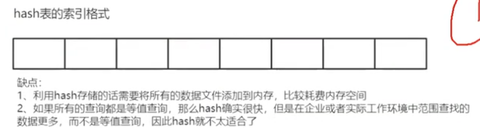

扰动函数：使得数据散列得更加均匀。

#### 二叉树

> 极端情况可能会出现倾斜的问题，最后**变成链表结构**。造成树节点过深，从而增加IO次数，而现在IO就是查找的瓶颈

#### 二叉平衡树-AVL

> 为了保持树的平衡，避免出现数据倾斜，需要进行旋转操作，通过左旋或者右旋最终保持最长子树和最短子树高度差**不能超过1**，如果超过1就不是严格意义上AVL树了
>
> 缺点：1.当数据量很大的时候，为了保持平衡，需要进行1～n次的旋转，这个旋转是比较**浪费性能**的，**插入和删除效率极低，查询效率很高**。
>
> 2.只有两个分支，**数据量大的时候树的深度依然很深**。

#### 红黑树

> 最长子树的**不能超过最短子树的2倍**，通过**变色和旋转**，在插入和查询上做了平衡 红黑树是avl树的变种，**损失了部分查询性能来提高插入性能**。
>
> 同样是只有两个分支，**数据量大的时候深度依然会很深**

总结：**随着数据的增多，最终都会出现节点过多的情况，而且他们有且仅有2个分支，那么IO的次数一样很多.**

怎么解决仅有2个分支而且深度过深，这就有了B树，增加分支。

#### B树：所有节点都存放数据

> 搜索有可能在非叶子结点结束，在关键字全集内做一次查找，性能逼近二分查找。 每个结点最多拥有m个子树。 根节点至少有2个子树。 分支节点至少拥有m/2棵子树(除根节点和叶子节点外都是分支节点)。 所有叶子节点都在同一层，每个节点最多可以有m-1个key,并且以升序排列

（4度，表示一个节点最多可以放3个元素）

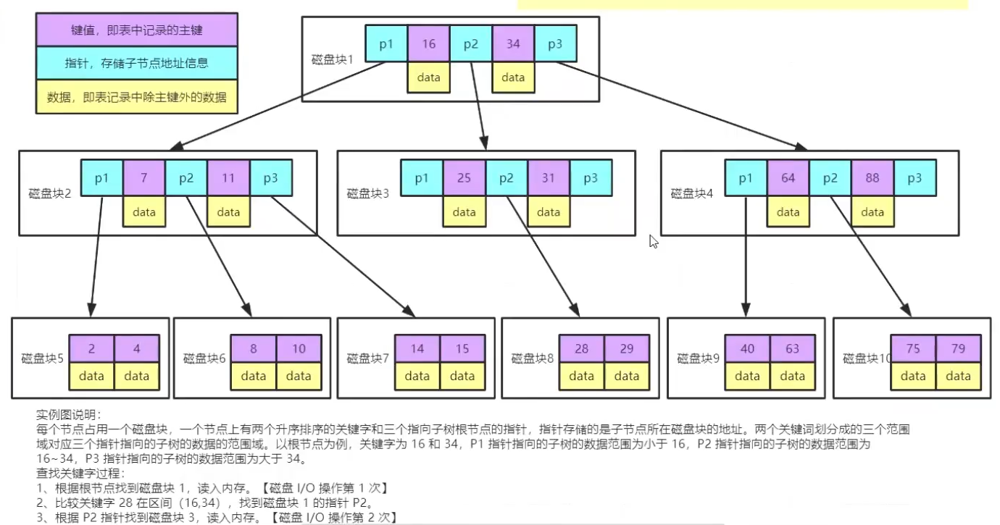

> 查询28，需要进行3次IO
>
> 缺点：1.每个节点都有key，同时包含data，而每个页存储空间是有限的，如果**data很大的话会导致每个节点能存储的key的数量变小**。
> 2.当存储的**数据量很大的时候会导致深度变大**，增加查询磁盘的io次数，进而影响查询性能。
>
> 1个磁盘块（16k）存16条，**1条数据假设1k**，3层 存16x16x16 = 4096

#### B+树：只有叶子节点存放数据。

> B+树是在B树的基础上做的一种优化，变化如下：B+树**每个节点可以包含更多的节点**，这个做的原因有两个，第一个原因是为了**降低树的高度**，第二个原因是**将数据范围变成多个区间**，区间越多，数据检索越快。**非叶子节点只存储key，叶子节点存储key和数据**； **叶子节点两两指针互相连接**(符合磁盘预读的特性)，顺序查询性能更高。
>
> 3层或者4层取决于数据量，磁盘块/索引大小=数据条数
>
> B+树是一个平衡的多叉树。从根节点到每个叶子节点的高度差值不超过1。在B+树上的常规检索，从根节点到叶子节点的搜索效率基本相当，不会出现大幅波动，而且**基于索引的顺序扫描**时，也可以利用双向指针快速左右移动，效率非常高。

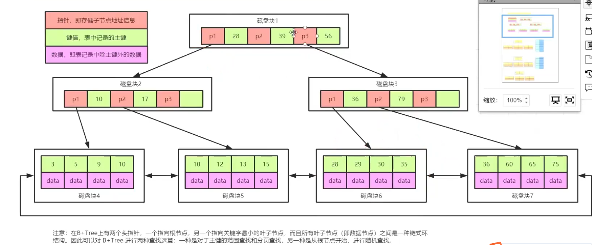

> 关键字有序，可以从关键字最小的叶子结点查找 或从根结点开始查找
>
> 一种是对于主键的范围查找和分页查找，另一种是从根节点开始的随机查找。


> 假设key和指针占10byte，1个磁盘块 16kB/14B约等于1170 （1k=1024）
>
> B+树 1170 x1170 x16约等于2000万


#### 总结

> 准确的表述：为什么mysql的InnoDB和MyISAM存储引擎的索引使用的是B+树

1. hash表，**等值查询**是很快的，但是不满足常用的**范围查找**且相邻的两个值之间没有关系，而且hash**比较消耗内存**。
2. 二叉树/平衡二叉树/红黑树等都是有**且仅有2个分支**，共性就是**数据量大的时候树的深度变深，增加IO的次数**。
3. 增加分支，但B树会**在节点上存储数据**，这样一页**存放的key的数量就会减少，增加树的深度**。
4. B+树中**非叶子节点去除了数据**，这样就会增加一页中key的数量；而且叶子节点之间是**通过链表相连**，**有利于范围查找和分页**。

### **回表⭐️**

用二阶索引或者辅助索引，数据量大才用（其他字段作为索引的键），先定位主键值，再定位行记录。需要扫描两遍索引树
（1）先通过普通索引定位到主键值；

（2）在通过聚集索引定位到行记录；

```
select * from user where name=;　
```

### **索引覆盖⭐️**

只需要在一棵B+树上就能获取SQL所需的所有列数据，**无需回表，速度更快**。

建立**联合索引**

> select id,name from user where name=;　

**哪些场景可以利用索引覆盖来优化SQL？**

原表为：

*user(PK id, name, sex)；*

> Using index

**场景1：全表count查询优化**

直接：

```
select count(name) from user;
```

不能利用索引覆盖。

添加索引：

```
alter table user add key(name);
```

就能够利用索引覆盖提效。

**场景2：列查询回表优化**

```
select id,name,sex ... where name='shenjian';
```

这个例子不再赘述，将单列索引(name)升级为**联合索引(name, sex)**，即可避免回表。

**场景3：分页查询**

```
select id,name,sex ... order by name limit 500,100;
```

将单列索引(name)升级为联合索引(name, sex)，也可以避免回表。

### **最左匹配⭐️**

**联合索引（name,age）**，先匹配name，最左匹配

1、where name=? and age =?

2、where age =? and name=?   ==》优化器优化为1

3、where name=?

4、where age=?

1,2,3走索引，4不走

mysql本身的优化器：CBO成本,RBO规则

### **索引下推**（mysql5.6+）⭐️

由MySQL服务器(内存)向下传递至存储引擎（磁盘），**减少IO(回表)次数**，优化数据查询。

> select * from table where name=? and age =?
>
> Using indx condition


> 索引下推唯一的缺点是需要在磁盘上多做数据筛选，原来的筛选是放在内存中的，现在放到了磁盘上做筛选。查找数据的环节，成本看起来比较高，但是，数据是排序的，所有的数据聚集存放的，所以性能不会有影响，而且整体的IO量会大大减少，反而提升性能。

### **MRR（mult_range read）**（针对辅助索引）⭐️

> **MRR 通过把「随机磁盘读」，转化为「顺序磁盘读」，从而提高了索引查询的性能的算法**
>
> 据辅助索引的**叶子结点**上**找到的主键值**得集合存储到`read_rnd_buffer`中，然后在该buffer中对主键值进行**排序**，最后再利用已经排序好的主键值的集合，去**访问**表中的数据，这样就由原来的`随机/O变成了顺序I/O`，降低了`查询过程中的I/O消耗`。
>
> 开启:set optimizer_switch='mrr=on';
>
> MRR 在本质上是一种**用空间换时间**的算法，
>
> 返回一行记录，是不需要MRR的

例子:

当我们进行数据回表时，匹配1个name的字段，筛选取得了1000个id，如果从根节点一个个id查找是很慢的。

我们可以先将id在内存缓冲区(read_rnd_buffer )进行排序，再到磁盘中进行顺序查找。

> 如果 read_rnd_buffer 满了，就会先把满了的 rowid 排好序去磁盘读取，接着清空，然后再往里面继续放 rowid，直到 read_rnd_buffer 又达到 read_rnd_buffe 配置的上限，如此循环。

**顺序读带来了几个好处:**

**1、磁盘和磁头不再需要来回做机械运动；**

**2、可以充分利用磁盘预读**

比如在客户端请求一页的数据时，可以把后面几页的数据也一起返回

**3、在一次查询中，每一页的数据只会从磁盘读取一次**

不排序：可能你在读取了第 1 页的数据后，会去读取第2、3、4页数据，接着你又要去读取第 1 页的数据，这时你发现第 1 页的数据，已经从缓存中被剔除了，于是又得再去磁盘读取第 1 页的数据。

而转化为顺序读后，你会连续的使用第 1 页的数据，这时候按照 MySQL 的缓存剔除机制，这一页的缓存是不会失效的，直到你利用完这一页的数据，由于是顺序读，在这次查询的余下过程中，你确信不会再用到这一页的数据，可以和这一页数据说告辞了。

> **索引本身就是为了减少磁盘 IO，加快查询，而 MRR，则是把索引减少磁盘 IO 的作用，进一步放大。**

### **FIC（fast index create）**mysql5.5+（针对辅助索引）⭐️

在5.5（不包括5.5）之前，**在一个已经存在数据的表上增加或者删除索引是很耗时的**。

create index或drop index按照以下的方式进行工作：
 -创建一个新的、空的临时表，表结构为使用alter table定义的新结构
 -逐一拷贝数据到新表，插入数据行同时更新索引
 -删除原表
 -将新表的名字改为原表的名字

FIC：


```
FIC 操作流程：
（1）对表加共享S锁，允许其他会话读操作，但禁止写操作，
（2）根据当前表数据创建索引，
（3）新索引创建完成，解除S锁，允许读写。

FIC优点：
（1）创建索引不需要拷贝整表数据，创建速度快，
（2）创建索引过程中，可以快速中止。

FIC限制：
（1）FIC仅限于辅助索引，不适用聚集索引，
（2）索引创建期间，表只允许读不允许写。
```


### **索引的匹配方式**

优化器会把索引拿到最左

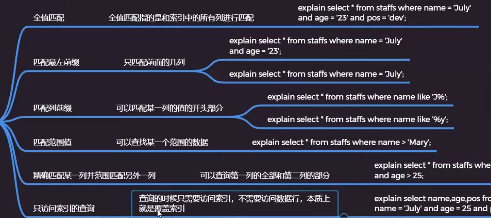

### 哈希索引


### 组合索引


除非表中的列全部为组合索引，or 才会走索引；否则不会走

### 联合索引存储

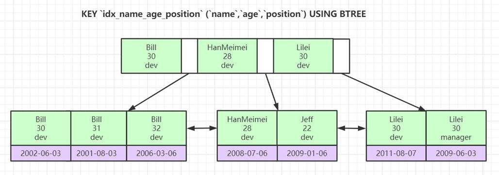

 比方说联合索引 (col1, col2,col3)，我知道在逻辑上是先按照col1进行排序再按照col2进行排序最后再按照col3进行排序。叶子节点存储多个键值。
查找，其实和存存储一样。也是根据顺序查询。col2，col3 不会走索引 因为首先存储通过col1 > col2 <col3 进行排序，这时候就要遵守**最左原则** 必须有col1列的存在

where name=Bill and age=31 and position=dev

先按索引列name查找到对应的数据页（都是Bill），数据页里面是一个链表结构，再按age进行二分查找到31；如果发现多条32，再二分一次查找到对应的数据，拿到数据对应的键值，就可以去聚集索引树查找对应的数据。

### 亿级数据量的深度分页优化

> 参考https://mp.weixin.qq.com/s/FOG_A6ZhhkmOmf47d0K-2g

我们在查看前几页的时候，发现速度非常快，比如 limit 200,25，瞬间就出来了。但是越往后，速度就越慢，特别是百万条之后，卡到不行，为什么？

limit 2000000,25 ，这个等同于数据库要扫描出 2000025条数据，然后再丢弃前面的 20000000条数据，返回剩下25条数据给用户

**原本**

```mysql
SELECT a.empno,a.empname,a.job,a.sal,b.depno,b.depname
from emp a left join dep b on a.depno = b.depno order by a.id desc limit 4800000,25;
时间: 12.275s
```

**解决方案**

1、使用索引覆盖+子查询优化

因为我们有主键id，并且在上面建了索引，所以可以先在索引树中找到开始位置的 id值，再根据找到的id值查询行数据。

```mysql
/*子查询获取偏移4800000条的位置的id，在这个位置上往后取25*/
SELECT a.empno,a.empname,a.job,a.sal,b.depno,b.depname
from emp a left join dep b on a.depno = b.depno
where a.id >= (select id from emp order by id limit 4800000,1)
order by a.id limit 25;
时间: 1.541s
```

2、起始位置重定义

记住上次查找结果的主键位置，避免使用偏移量 offset

```mysql
/*记住了上次的分页的最后一条数据的id是4800000，这边就直接跳过4800000，从4800001开始扫描表*/
SELECT a.id,a.empno,a.empname,a.job,a.sal,b.depno,b.depname
from emp a left join dep b on a.depno = b.depno
where a.id > 4800000
order by a.id limit 25;
时间: 0.000s
```

但是有个问题，只适合一页一页的分页，这样才能记住前一个分页的最后Id。如果用户跳着分页就有问题了，比如刚刚刷完第25页，马上跳到35页，数据就会不对。

这种的适合场景是类似百度搜索或者腾讯新闻那种滚轮往下拉，不断拉取不断加载的情况。这种延迟加载会保证数据不会跳跃着获取。

3、降级策略

配置limit的偏移量和获取数一个最大值，超过这个最大值，就返回空数据。
因为他觉得超过这个值你已经不是在分页了，而是在恶意刷数据了。

方案1,2可以搭配使用

## 事务管理

### 分布式事务如何解决


### 事务特性ACID⭐️

事务：对数据库操作的序列，是一个不可分割的工作单位，要么全部执行,要么全部不执行。

A（原子性）一个事务中的操作要么全部成功，要么全部失败。

C（一致性）数据库总是从一个一致性的状态转换到另外一个一致性的状态.当事务完成时，必须使所有数据都具有一致的状态

I（隔离性）一个事务的修改在最终提交前，对其他事务是**不可见的**。（读不到）(四种隔离级别)

D（持久性）一旦事务提交，所做的修改就会**永久保存到数据库**

### ACID靠什么保证的

A原子性由**undo log日志**保证，它记录了需要**回滚**的日志信息，当事务执行失败或调用了rollback，导致事务需要回滚，便可以利用undo log中的信息将数据回滚到修改之前的样子。

> 是利用Innodb的undo log。
> undo log名为回滚日志，是实现原子性的关键，当事务回滚时能够撤销所有已经成功执行的sql语句，他需要记录你要回滚的相应日志信息。
>
> 例如:
> (1)当你delete一条数据的时候，就需要记录这条数据的信息，回滚的时候，insert这条旧数据
> (2)当你update一条数据的时候，就需要记录之前的旧值，回滚的时候，根据旧值执行update操作
> (3)当年insert一条数据的时候，就需要这条记录的主键，回滚的时候，根据主键执行delete操

C一致性**由其他三大特性保证**、**程序代码要保证业务上**的一致性

I**隔离性由MVCC**来保证 

D持久性由**内存+redo log**来保证，mysql修改数据同时在内存和redo log记录这次操作，**宕机的时候可以从redo log恢复** 

> 是利用了redo log。Mysql是先把磁盘上的数据加载到内存中，在内存中对数据进行修改，再刷回磁盘上。如果此时突然宕机，内存中的数据就会丢失。
> redo log包括两部分：一是内存中的日志缓冲(redo log buffer)，该部分日志是易失性的；二是磁盘上的重做日志文件(redo log file)，该部分日志是持久的。innodb通过force log at commit机制实现事务的持久性，即在事务提交的时候，必须先将该事务的所有事务日志写入到磁盘上的redo log file和undo log file中进行持久化。也就是说提交了两个日志文件。 
>
> binlog，主要是做主从复制，二进制日志,它记录了数据库上的所有改变

### **事务并发带来的问题⭐️**

脏读（读取未提交数据）

> A事务读取**B事务尚未提交**的数据，此时如果B事务发生错误并执行回滚操作，那么**A事务读取到的数据就是脏数据**。

不可重复读（在一个事务内，前后多次读取，读同一数据，数据内容不一致）

> A事务读2次数据期间，B事务修改了数据，导致事务A读取数据前后不一致

幻读（在一个事务内，前后多次读取，数据总量不一致）

> 事务A在修改表中数据（涉及到表中的全部数据行）时，同时，事务B插入一行新数据，事务A会发现还有没修改的数据，就跟出现幻觉一样。

### 隔离级别 以及与锁的关系⭐️

> select for update除了有查询的作用外,还会加锁呢,而且它是悲观锁。 那么它加的是行锁还是表锁,这就要看是不是用了索引/主键。 没用索引/主键的话就是表锁,否则就是是行锁。
>
> mysq中两种不同的**select方式**：
>
> **快照读：**读取的是记录的**历史版本**，在一个没有结束的事务中，快照读**每次读取的都和在本次事务中第一次读到的信息一致**（**不加读锁**）。
>
> **当前读：**读取的是记录的**最新版本**（**会加读锁**）。

- **未提交读**（RU）可能会导致脏读，不可重复读和幻读问题。

  > 事务在读数据的时候采用当前读
  >
  > 事务在修改数据的时候加**共享锁**

- **提交读（RC）**因为只能读取已经提交的数据，所以可以避免脏读，但是不保证事务重新读的时候能读到相同的数据，因为在每次数据读完之后其他事务可以修改刚才读到的数据，所以**不能避免不可重复读和幻读**现象。

  > 事务在读数据的时候加读锁（当前读），读完即释放共享锁
  >
  > 事务在修改某数据时会加上**排他锁（解决脏读）**

- **可重复读**（Mysql**默认隔离级别RR**）则可以避免脏读和不可重复读现象，但是**不能避免幻读**现象。

  > 事务在读数据的时候采用的是**快照读**（**解决不可重复读**）
  >
  > 事务在修改数据的时候加**排他锁（解决脏读）**，并且采用了间隙锁，但触发间隙锁的前提是（**查询条件列不可以是唯一索引和主键**），在触发间隙锁后，会锁住一定范围内的数据，防止在这范围内插入数据，这个机制可以在一定程度上**降低发生幻读**的可能。

- **可串行化**则能同时避免脏读、不可重复读和幻读现象。

##### **可串行化怎么实现？**

> 事务在读取数据时，对**整个表加共享锁**，提交或回滚事务后释放
> 事务在修改数据时，对**整个表加排他锁**，提交或回滚事务后释放
>
> 缺点：“写”会加“写锁”，“读”会加“读锁”。在这个级别，**可能导致大量的超时现象和锁竞争**。

> 可串行化：如果一并行调度的结果等价于某一串行调度的结果，那么这个并行调度成为可串行化的。

##### **提交读和可重复读怎么实现？**

MySQL 中的**提交读和可重复读**两个隔离级别是使用**多版本并发控制 MVCC**  来实现的，而**不是通过添加读写锁**来实现的，如果通过**读写锁来实现隔离级别的话**，只有读读可以并发，读写，写读，写写**都不能并发**。而如果使用  MVCC 来实现 提交读和可重复读两个隔离级别的话则可以在读的时候不加锁，读写和写读可以同时进行，**只有写写需要阻塞**，这样就极大地提高了并发度。

实现方式：

InnoDB在每行记录后面保存两个隐藏的列：trx_id：当前事务id，roll_pointer：指向聚集索引记录上一个版本的位置

Read Committed 在事务中**每次读操作都是读取最新的行数据版本**，而这最新的数据行版本很可能是某个事务进行了修改操作后提交的，所以可能会发生多次读取同一行数据，但是**前后读取的数据不一致**的情况。这就是不可重复读现象，所以**提交读不能避免不可重复读现象**。

Repeatable Read 在事务发生**第一次读的时候选定所要读取的数据行的版本**，整个事务**都读取这一个版本的数据行**，所以可以重复读，每次读取的数据都一致。

> 提交读隔离级别下的事务在**每次查询的开始都会生成一个独立**的ReadView,
> 而可重复读隔离级别则在第一次读的时候生成一个ReadView，之后的读都**复用之前**的ReadView。 

### 解决幻读?⭐️

我会从三个方面来回答。第一个， MySQL 的事务隔离级别， MySQL 有四种事务隔离级别，这四种事务隔离级别分别代表当存在多个事务并发冲突的时候，可能会出现的脏读、不可重复读，幻读的一些问题。而 InnoDB 在 **rr 的隔离级别模式**下解决了幻读这样一个问题。

第二个，什么是幻读呢？幻读是指在同一个事物中前后两次查询相同范围的时候得到的结果不一致。我们来看这个图。第一个事物里面我们执行了一个范围查询，这个时候满足条件的数据只有一条。而在第二个事务里面，它插入了一行数据，并且进行了提交。接着第一个事务再去查询的时候得到的结果比第一次查询的结果多出来了一条数据。注意第一个事务的第一次和第二次查询都在同一个事务里面。所以幻读会带来**数据一致性的问题**。

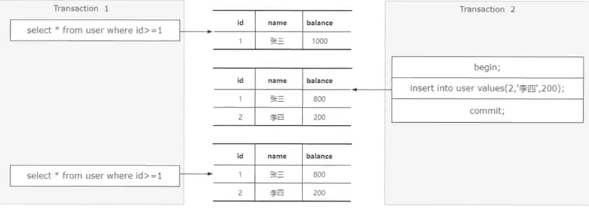第三，InnoDB是如何去解决幻读问题的呢？ InnoDB 里面引入了**间隙锁和临键锁机制去解决幻读问题**。为了更清晰地说明这两种锁以及它是怎么样去解决幻读的，我来举一个例子，假设现在存在这样一个 B +树的索引结构，这个结构里面有**四个索引元素**，分别是 1 4 7 和10。当我们通过组件索引查询一条记录，并且对这条记录通过 for update 加锁的时候，像这样这个时候会产生一个叫记录锁，也就是**行锁**，锁定 ID 等于 1 这个索引。被锁定的记录，在锁释放之前，其他事务是无法对这一条记录做任何操作的。

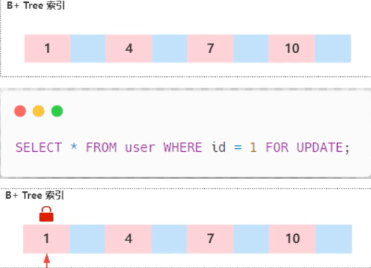

前面我们说过对幻读的定义，幻读是指在同一个事物中前后两次**查询相同范围的时候**得到结果不一致。注意，这里强调的是范围查询。也就是说 InnoDB 引擎要解决幻读的问题，必须要保证一个点，就是如果一个事务通过这样一条查询语句进行锁定的时候，另外一个事物在执行这样一条insert的语句需要被阻塞，直到前面获得锁的事务被释放。

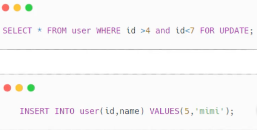

所以在innoDB 中设计了一种**间隙锁**，它的主要功能是**锁定一段范围内**的索引记录。像这样一个图，当对查询范围 ID 大于 4 and ID 小于 7 这个范围加锁的时候会针对 B +树中的 4 和 7 这个开区间的范围加间隙锁，意味着在这种情况下，其他事务对这个区间的数据进行插入、更新、删除都会被锁住。但是还有另外一种情况，比如像这样这条查询语句是针对 ID 大于 4 这个条件加锁，那么它**需要锁定多个索引区间**。所以这个情况下 InnoDB 引入一个叫 **nexkeylock 机制**。
nexkeylock 相当于间隙锁和记录锁的合集，记录锁定存在记录的行，间隙锁锁住的是记录行之间的间隙，而 next key 锁住的是两者的和。**每个数据行上的非唯一索引列都会存在一把 nextlock** 。当某个事物持有这一行数据的 nextlock 的时候，会锁住一段在左开右闭区间的数据。因此当通过 ID 大于 4 这样一个范围查询加锁的时候，InnoDB会去加一个 nexkeylock 锁锁定的区间范围是 （4 7）（7，10） 和 10 到正无穷大。
记住是左开右闭区间间隙。锁和 nexkey lock的区别是在于加锁的范围，间隙锁锁定的是两个索引之间的间隙，而 nexkeylogock会锁定多个索引区间，它包含记录锁和间隙锁。当我们使用范围查询，不仅仅命中 record 记录，还包含了 gap 间隙的时候，在这种情况下使用的就是临键锁，也就是 nexkeylock 它是 **MySQL 里面默认的行锁算法**。
第四，简单总结一下，虽然 InnoDB 里面通过**间隙锁的方式解决了幻读的问题**，但是加锁之后一定会影响到**并发的性能**。因此对于性能较高的一些业务场景，我们可以把**隔离级别设置成 RC ，那么这个级别中就不存在间隙锁**，也就不存在这样的一个性能的影响。以上就是我对于 InnoDB 如何解决幻读问题的一个理解。

### MVCC⭐️

> 频繁加锁会导致数据库性能低下，引入了MVCC多版本控制来实现读写不阻塞，提高数据库性能

多版本并发控制：读取数据时通过一种**类似快照的方式将数据保存下来**，这样读锁就和写锁不冲突了， 不同的事务session会**看到自己特定版本的数据**，版本链MVCC只在 **READ COMMITTED 和 REPEATABLE READ** 两个隔离级别下工作。其他两个隔离级别和MVCC不兼容, 因为 READ UNCOMMITTED 总是读取最新的数据行, 而**不是符合当前事务版本**的数据行。而 SERIALIZABLE 则会**对所有读取的行都加锁**。 

MVCC 机制会记录**每行数据的历史版本**，通过**可见性算法、 read view以及undo 日志** 控制每个读操作所读取的行数据历史版本。
MVCC 主要解决三个问题，第一个是通过 MVCC 可以解决**读写并发阻塞**的问题，从而提高数据的并发处理能力。第二个是 MVCC 采用的是乐观锁的方式实现，降低了**死锁的概率**。第三个解决了**一致性读**的问题，也就是事务启动的时候根据某个条件去读取到数据，直到事务结束的时候再去执行相同的条件还是读到同一份数据不会发生变化。而我们在使用 MVCC 的时候，一般是根据业务场景来选择组合，搭配乐观锁或者悲观锁。这两个组合中， **MVCC 用来解决读写冲突，乐观锁或者悲观锁用来解决写和写的冲突**，从而最大程度地去提高数据库的并发性能。

**1）聚簇索引记录中有两个必要的隐藏列：** 

**trx_id**：用来存储每次对某条聚簇索引记录**进行修改**的时候的**事务id**。 

**roll_pointer**：每次对哪条聚簇索引记录有**修改**的时候，都会把老版本**写入undo日志中。这个roll_pointer就是存了一个指针**，它指向这条聚簇索引记录的**上一个版本的位置**，如下图，通过它来获得上一个版本的记录信息。(注意**插入操作的undo日志没有**这个属性，因为它没有老版本) 

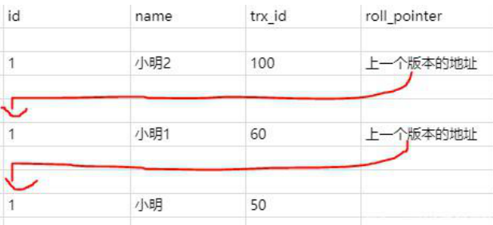

**2）已提交读和可重复读的区别就在于它们生成ReadView的策略不同**。

> m_ids：表示在生成readview时，当前系统中活跃的**读写事务id列表**；
>
> min_trx_id：表示在生成readview时，当前系统中活跃的读写事务中**最小**的事务id，也就是m_ids中最小的值；
>
> max_trx_id：表示生成readview时，系统中应该分配给**下一个事务**的id值；
>
> creator_trx_id：表示生成**该readview的事务的事务id**

**MVCC其实就是靠「比对版本」来实现读写不阻塞，而版本的数据存在于undo log中。**

而针对于不同的隔离级别（read commit和repeatable read），在于它们生成ReadView的策略不同

**3）生成readview时机**

已提交读隔离级别下的事务在**每次查询的开始都会生成一个独立**的ReadView,而可重复读隔离级别则在第一次读的时候生成一个ReadView，之后的读都**复用之前**的ReadView。 

**4）可见性算法**：决定事务能否**查询到其他事务修改的数据**

开始事务时创建readview，**readView维护当前活动的事务id**

**列表m_ids**，即未提交的事务id，排序生成一个数组**（从小到大）**

有了readview，在访问某条记录时，按照以下步骤**判断记录的某个版本是否可见**

- 1、如果被访问版本的trx_id，**与readview中的creator_trx_id值相同**，表明当前事务在访问自己修改过的记录，该版本**可以被当前事务访问**；
- 2、如果被访问版本的trx_id，**小于readview中的min_trx_id值**，表明生成该版本的事务在当前事务生成readview前**已经提交**，该版本可以被当前事务访问；
- 3、如果被访问版本的trx_id，**大于或等于readview中的max_trx_id值**，表明生成该版本的事务在当前事务**生成readview后才开启**，该版本**不可以**被当前事务访问；
- 4、如果被访问版本的trx_id，值在readview的**min_trx_id和max_trx_id之间**，就需要判断trx_id属性值是不是在m_ids列表中？
- - 如果**在**：说明创建readview时生成该版本的事务还是活跃的，该版本**不可以**被访问
  - 如果**不在**：说明创建readview时生成该版本的事务**已经被提交**，该版本**可以被访问**；
- 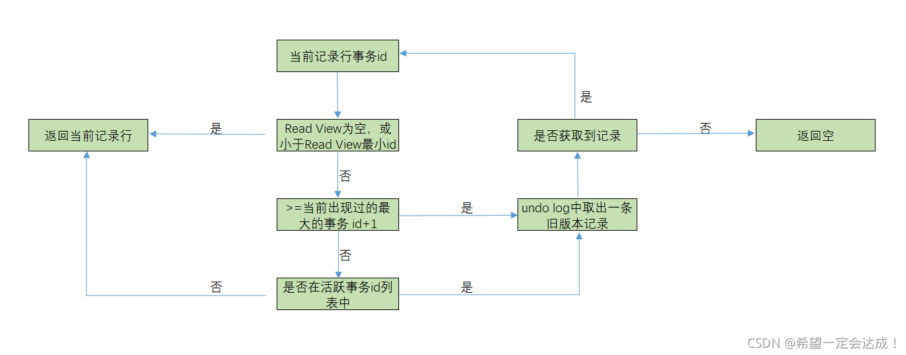

**5）undo log**

undo log是链表结构，**头部记录最新值**，每次修改都会把当前行记录作为最新值插入链表。


> 这就是Mysql的MVCC,通过版本链，实现多版本，**可并发读-写，写-读**。**通过ReadView生成策略的不同实现不同的隔离级别**。 

### selcet for update

**InnoDB行锁是通过给索引上的索引项加锁来实现的，只有通询条件有索引/主键，InnoDB才使用行级锁，否则，InnoDB将使用表锁**

> 默认：
>
> 普通的select(没有加lock in share mode或for update)不会锁表或锁行的
>
> INSERT、DELETE、UPDATE语句会自动对操作的数据行加写锁
>
> 显示加锁：
>
> **select xxxxx lock in share mode** ：加的是共享读锁
>
> **select xxxx for update** ： 加的是写锁，有索引项则行锁；否则是表锁（需要查询后修改结果集，只有commit之后，其他线程才能才能操作）

```
select room_id *from* room_user where user_id = ? for update
当room_id存在时，上述sql是没有问题的，但是当room_id不存在时，会引起死锁问题。
```

*主要是由于select for update会获取到相同的gap锁，而insert时，如果插入区间有其他session的gap锁，需要等待gap锁释放。，因此当2个session同时获取到gap锁，再执行insert则会互相阻塞，造成死锁。*

1. *session 1 select for update获取gap锁*
2. *session 2 select for update获取x相同的gap锁*
3. *session 1 insert 获取插入意向锁，等待session 2的gap锁释放*
4. *session 2 insert 获取插入意向锁，等待session 1的gap锁释放*
5. *循环等待 死锁*

*解决办法：隔离级别使用read commit，在rc下，不会获取gap锁，不要使用read repeatable。*

### 数据库锁分类⭐️

> 线程锁：互斥锁，自旋锁，信号量，CAS，读写锁
>
> 进程锁：accept锁（自旋锁，互斥锁（信号量），文件锁）
>
> 分布式锁：redis实现非公平锁，zk实现公平锁

作用：使得数据库事务具备隔离性

- 基于锁的**属性**分类：共享锁、排他锁。 
- 基于锁的**状态**分类：意向共享锁、意向排它锁。
- 基于锁的**粒度**分类：行级锁(INNODB)、表级锁(INNODB、MYISAM)、页级锁(BDB引擎 )、记录锁、间隙锁、临键锁。 （只有这些锁）

**（1）共享锁(Share Lock)** 

**共享锁又称读锁，简称S锁**；当一个事务为数据加上读锁之后，其他事务只能对该数据**加读锁，而不能对数据加写锁**，直到所有的读锁释放之后其他事务才能对其进行加持写锁。共享锁的特性主要是为了**支持并发的读取数据**。

**（2）排他锁（eXclusive Lock）** 

**排他锁又称写锁，简称X锁**；当一个事务为数据加上写锁时，其他请求将**不能再为数据加任何锁**，直到该锁释放之后，其他事务才能对数据进行加锁。排他锁的目的是在数据修改时候，不允许其他人同时修改，也不允许其他人读取。**避免了出现脏数据和脏读**的问题。 

> 如果当事务A加锁成功之后就设置一个状态**提前告诉后面的人，已经有人对表里的行加了一个排他锁 了**，你们不能对整个表加共享锁或排它锁了，那么后面需要对整个表加锁的人只需要获取这个状态就知道自己是不是可以对表加锁，**避免了对整个索引树的每个节点扫描是否加锁**，而这个状态就是**意向锁**。 

**（3）意向共享锁** 

当一个事务试图对整个表进行**加共享锁之前**，首先需要获得这个表的意向共享锁。 

**（4）意向排他锁**

当一个事务试图对整个表进行**加排它锁之前**，首先需要获得这个表的意向排它锁。 

**（5）行锁（默认）**

行锁是指上锁的时候锁住的是**表的某一行或多行记录**，其他事务访问同一张表时，只有被锁住的记录不能访问，其他的记录可正常访问； 

特点：粒度小，加锁比表锁麻烦，**不容易冲突，相比表锁支持的并发要高**； 

> MyISAM和MEMORY存储引擎采用的是表级锁

**（6）表锁** 

表锁是指上锁的时候锁住的是整个表，当下一个事务访问该表的时候，必须等前一个事务释放了锁才能进行对表进行访问； 

特点： 粒度大，加锁简单，**容易冲突**； 

**（7）页锁** 

页级锁是MySQL中锁定粒度**介于行级锁和表级锁中间的一种锁**。表级锁速度快，但冲突多，行级冲突少，但速度慢。所以取了折衷的页级，一次锁定相邻的一组记录。 

特点：开销和加锁时间**界于表锁和行锁之间；会出现死锁**；锁定粒度界于表锁和行锁之间，**并发度一般** 

**（8）记录锁(Record Lock)** 

记录锁也属于行锁中的一种，只不过记录锁的范围**只是表中的某一条记录**，记录锁是说事务在加锁后锁住的只是表的某一条记录。 精准条件命中，并且命中的条件字段是**唯一索引加了记录锁之后**数据可以避免数据在查询的时候被修改的重复读问题，也避免了在修改的事务未提交前被其他事务读取的**脏读问题**。 在**RC级别**

**（9）间隙锁(Gap Lock)** 

**属于行锁中的一种**，间隙锁是在事务加锁后其锁住的是表记录的某一个区间，当表的相邻ID之间出现空隙则会形成一个区间，遵循左开右闭原则。 范围查询并且查询未命中记录，查询条件必须命中索引、**间隙锁只会出现REPEATABLE_READ（可重复读)的事务级别**中。 

触发条件：**防止幻读问题**，事务并发的时候，如果没有间隙锁，就会发生如下图的问题，在同一个事务里，A事务的两次查询出的结果会不一样。 比如表里面的数据ID 为 1,4,5,7,10 ,那么会形成以下几个间隙区间，-n-1区间，1-4区间，7-10区间，10-n区间 （-n代表负无穷大，n代表正无穷大） **左开右闭**

> 间隙锁在一定程度上可以解决幻读的问题，但是间隙锁的引入我觉得更多是为了处理binlog的statement模式的bug。
>
> > mysql数据库的主从复制依靠的是binlog。而在mysql5.0之前，binlog模式只有statement格式。这种模式的特点：binlog的记录顺序是**按照数据库事务commit顺序为顺序**的。
>
> **当不存在间隙锁的情况下，会有如下的场景：**
>  master库有这么两个事务：
>
> 1、事务a先delete id<6，然后在commit前；
>  2、事务b直接insert id=3，并且完成commit；
>  3、事务a进行commit；
>  此时binlog记录的日志是：事务b先执行，事务a在执行（binlog记录的是commit顺序）
> 那么主库此时表里面有id=3的记录，但是从库是先插入再删除，从库里面是没有记录的。
>
> 这就导致了主从数据不一致。为了解决这个bug，所以RR级别引入了间隙锁

**（10）临建锁(Next-Key Lock)** 

**也属于行锁的一种**，并且它是INNODB的行锁默认算法，总结来说它就是**记录锁和间隙锁的组合**，临键锁会**把查询出来的记录锁住**，同时也会把**该范围查询内的所有间隙空间也会锁住**，再之它会把**相邻的下一个区间也会锁住** 

触发条件：范围查询并命中，查询命中了索引。 结合记录锁和间隙锁的特性，临键锁避免了在范围查询时出现**脏读、重复读、幻读**问题。加了临键锁之 后，在范围区间内数据不允许被修改和插 入。 

### 一条update语句到底加了多少锁？

假如表中只有这样两条数据的话：

id = 1，age=1

id=10，age=10

```sql
#age索引  (-∞,1]，(1,10]，(10,+∞)索引范围

# 对id=1的用户加锁
update user set age=age+1 where id=1;
# 对id(1,10)。的用户加锁
update user set age=age+1 where id>1 and id<10;
# 对id大于1并且小于等于10的用户加锁
update user set age=age+1 where id>1 and id<=10;
```

不存在age=5，加锁**(1,10]** 

```sql
update user set name='一灯' where age=5;
```

假设表存在age=5，加锁 **(1,5]** 和 **(5,10]** ；其索引范围(-∞,1]，(1,5]，(5,10]，(10,+∞)

**age换成id主键**

如果不存在id=5的数据，加锁范围跟上条SQL是一样的， **(1,10]** 。

如果存在id=5的数据，MySQL的 **Next-Key Locks** 会退化成 **Record Locks** ，也就是只在id=5的这一行记录上加锁。

### InnoDB存储引擎的锁的算法

Record lock：单个行记录上的锁 

Gap lock：间隙锁，锁定一个范围，不包括记录本身 

Next-key lock：record+gap 锁定一个范围，包含记录本身 

相关知识点： 

\1. innodb对于行的查询使用next-key lock 

\2. Next-locking keying为了解决Phantom Problem幻读问题 

\3. 当查询的索引含有唯一属性时，将**next-key lock降级为record key** 

\4. Gap锁设计的目的是为了阻止多个事务将记录插入到同一范围内，而这会导致幻读问题的产生 

\5. 有两种方式显式关闭gap锁： A. 将事务隔离级别设置为RC B. 将参数innodb_locks_unsafe_for_binlog设置为1

### 什么是死锁？原因？怎么解决？⭐️

第一个是什么是死锁？

所谓死锁是一组互相竞争资源的进程，因为互相等待导致永久阻塞的现象。

第二个是发生死锁的原因。

1） 因为系统资源不足 或者 资源分配不当等。

2） 进程运行推进的顺序非法。

第三个，发生死锁有四个必要条件

第一个是互斥条件，共享资源 X 和 Y 只能被一个线程占用。第二个是请求和保持，线程 t1 已经取了得了共享资源 X ，**在等待共享资源 Y 的时候不释放共享资源 X** 。第三个是不可剥夺，其他线程不能强行去抢占线程 t1 占用的资源。第四个是循环等待，线程 t1 等待线程 t2 占有的资源，线程 t2 等待线程 t1 占有的资源，这就是循环等待。

第四个点是如何去预防死锁呢？

既然发生死锁的原因是需要同时满足这四个条件，那么我们只需要去打破其中任何一个条件即可预防死锁的问题。而在这四个条件中，第一个互斥条件是无法被破坏的，因为锁本身就是通过互斥来解决线程安全性问题的。所以对于剩下三个，我们可以逐一进行来分析。

第一个是对于请求和保持这个条件，我们可以**一次性去申请所有的资源**，这样就不存在等待或者只要有一个资源得不到分配，也不给这个进程分配其他的资源。第二个是对于不可剥夺这个条件，**占有部分资源的线程，进一步申请到其他资源的时候，如果申请不到，可以主动去释放它占有的资源**(超时放弃：线程可以在获取锁超时以后，主动释放之前已经获得的所有的锁)。第三个点，对于循环等待这个条件，可以**按照顺序去申请资源来进行预防**。所谓的按序来申请，是指资源是有线性顺序的，申请的时候可以先申请资源序号小的，再申请资源序号大的，这样线性化以后就不存在循环等待。

- 预防死锁的几种策略，**会严重地损害系统性能**。因此在避免死锁时，要施加较弱的限制，从而获得 较满意的系统性能。由于在避免死锁的策略中，**允许进程动态地申请资源**。因而，系统**在进行资源分配之前预先计算资源分配的安全性**。若此次分配不会导致系统进入不安全的状态，则将资源分配给进程；否则，进程等待。其中最具有代表性的**避免死锁算法是银行家算法**。

- 银行家算法：首先需要定义状态和安全状态的概念。
  **系统的状态是当前给进程分配的资源情况**
  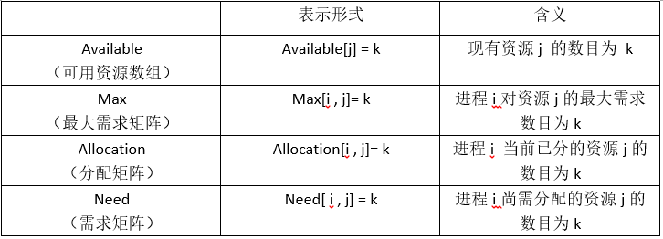

  > Need[i,j] = Max[i,j] - allocation[i, j];设Requesti是进程Pi的请求向量

  安全状态是指**至少有一个资源分配序列**不会导致死锁。当进程请求一组资源时，**假设同意该请求**，从而改变了系统的状态，然后确定其结果是否还处于安全状态。如果是，同意这个请求；如果不是，阻塞该进程直到同意该请求后系统状态仍然是安全的。。

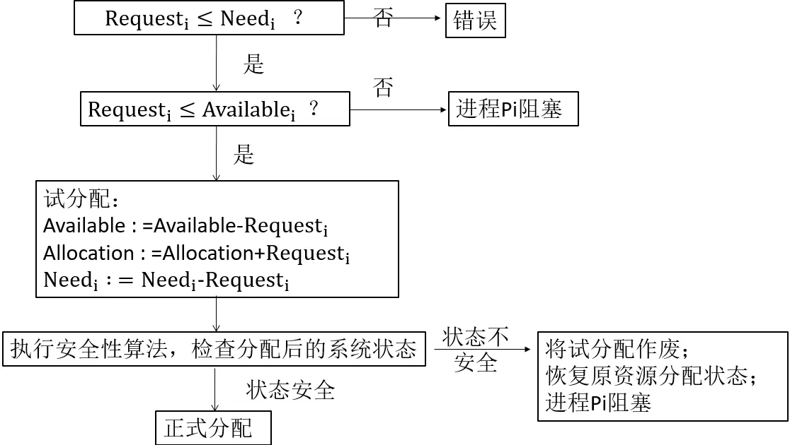

第五个、检测死锁

1. 首先为每个进程和每个资源指定一个唯一的号码；
2. 然后建立资源分配表和进程等待表。

工具：

> jstack 
>
> 首先使用jps查看Java进程编号，然后使用jstack查看进程信息，jstack会在最后给出进程的分析信息，表示出现了死锁（deadlock）。
>
> jconsole，选择检测的程序，再点击死锁检测，选择对应的线程

第六个、解除死锁

当发现有进程死锁后，便应立即把它从死锁状态中解脱出来，常采用的方法有：

- 剥夺资源：从其它进程剥夺足够数量的资源给死锁进程，以解除死锁状态；
- 撤消进程：可以直接撤消死锁进程或撤消代价最小的进程，直至有足够的资源可用，死锁状态消除为止；所谓代价是指**优先级、运行代价、进程的重要性和价值**等。

### 数据库的乐观锁和悲观锁是什么？怎么实现的？

数据库管理系统（DBMS）中的并发控制的任务是确保在**多个事务同时存取数据库中同一数据时不破坏事务的隔离性和统一性以及数据库的统一性**。乐观并发控制（乐观锁）和悲观并发控制（悲观锁）是并发控制主要采用的技术手段。

1.悲观锁：假定会发生并发冲突，屏蔽一切可能违反数据完整性的操作。在查询完数据的时候就**把事务锁起来**，直到提交事务。实现方式：**使用数据库中的锁机制**

2.乐观锁：假设不会发生并发冲突，**只在提交操作时检查是否违反数据完整性**。通过version的方式来进行锁定。实现方式：一般会使用**版本号机制或CAS算法**实现。

> select ... version from ...
> update table .. set version = version + 1 where vsersion = xx

两种锁的使用场景从上面对两种锁的介绍，我们知道两种锁各有优缺点，不可认为一种好于另一种，像乐观锁适用于写比较少的情况下（**多读场景**），即冲突真的很少发生的时候，这样可以省去了锁的开销，加大了系统的整个吞吐量。但如果是多写的情况，一般会经常产生冲突，这就会导致上层应用会不断的进行retry，这样反**倒是降低了性能**，所以一般**多写的场景下用悲观锁**就比较合适。

### redo log与binlog一致性？二阶段提交流程

InnoDB **redo log** 写盘，InnoDB 事务进入 prepare 状态。 
如果前面 prepare 成功，**binlog** 写盘，再继续将事务日志持久化到 binlog，如果持久化成功，那么 InnoDB 事务则进入 commit 状态(**在 redo log 里面写一个 commit 记录**) 

redo log会在系统空闲时进行刷

### redo,undo,binlog作用


### 数据库概念

> SQL是一种查询语言。MySQL是数据库软件。

#### 简述数据库三范式⭐️

1NF第一范式：字段是最小的的单元不可再分；  **原子性 字段不可再分**,否则就不是关系数据库;

问题：若某个人有两个电话，家庭电话和手机，这样则不符合第一范式。
解决：把电话列分成两个列即可。

2NF第二范式：满足第一范式,**表中的字段必须完全依赖于全部主键**而非部分主键； 唯一性 一个表只说明一个事物; 
（限制一对多的关系，在从表中建立一个外键，通过外键来引用主表的信息）

表:学号, 姓名, 年龄, 课程名称, 成绩, 学分;
这个表明显说明了两个事务:**学生信息, 课程信息**，不符合第二范式。
**存在问题:数据冗余**，每条记录都含有相同信息。
解决：分成学生表和课程表分别存储即可。

3NF第三范式：满足第二范式，**非主键外的所有字段必须互不依赖**。

学号, 姓名, 年龄, 所在学院, 学院联系电话，  关键字为单一关键字"学号";
存在依赖传递: (**学号) → (所在学院**) → (学院地点, 学院电话)
存在问题：数据冗余:有重复值；
解决：分成学生表，学院表即可。

#### 数据库有哪几种约束类型？

​    主键约束 PRIMARY KEY
​    外键约束 FOREIGN KEY
​    唯一约束 UNIQUE
​    检查约束 CHECK
​    非空约束 NOT NULL

#### 主键、外键和索引的区别

```undefined
定义：
主键：唯一标识一条记录，不能有重复，不允许为空。
外键：表的外键是另一表的主键，外键是可以有重复的，可以是空值。
索引：该字段没有重复值，但可以有一个空值。
```

```undefined
作用：
主键：用来保证数据完整性
外键：用来和其他表建立联系用
索引：用来提高查询排序的速度
```

```undefined
个数：
主键：主键只能有一个。
外键：一个表可以有多个外键。
索引：一个表可以有多个唯一索引。
```


#### 触发器


#### 视图


#### 日志


#### SQL注入


#### Mysql 存储过程和函数区别

**存储过程**是procedure用户定义的**一系列sql语句的集合**，涉及特定表或其它对象的任务，用户可以调用存储过程，而**函数**通常是数据库已定义的方法，它接收参数并返回某种类型的值并且不涉及特定用户表

1、返回值的区别

  函数有1个返回值,而存储过程是通过参数返回的,**可以有多个或者没有**

2. 调用的区别,函数可以**在查询语句中直接调用**,而存储过程必须**单独调用**.

函数：一般情况下是用来计算并返回一个计算结果；

存储过程： 一般是用来完成特定的数据操作（比如修改、插入数据库表或执行某些DDL语句等等）

### 数据库优化

#### 数据库优化

数据库结构优化的目的是为了

1. 减少**数据冗余**
2. 尽量**避免数据维护中出现更新**，插入和删除异常.
3. **节约**数据存储空间
4. **提高**查询效率

前三点可以通过范式来分表，而最后一点则需要反范式化（或索引等其他手段）来做到。

#### 怎么优化数据库的查询？

范式优化： 比如消除冗余
拆分表：垂直拆分和水平拆分

反范式优化：比如适当加冗余等（减少join）
对查询进行优化，应尽量避免全表扫描，首先应考虑在 where 及 order by 涉及的列上建立索引。

应尽量避免在 where 子句中使用!=或<>操作符。
应尽量避免在 where 子句中对字段进行 null 值判断。
应尽量避免在 where 子句中使用 or 来连接条件。
下面的查询也将导致全表扫描：“select id from t where name like ‘%abc%’” 若要提高效率，可以考虑全文检索。
in 和 not in 也要慎用，否则会导致全表扫描，很多时候用 exists 代替 in 是一个好的选择。
应尽量避免在 where 子句中对字段进行表达式操作。
应尽量避免在where子句中对字段进行函数操作。


#### 如何提高insert性能⭐️

1、合并多条 insert 为一条，即： insert into t values(a,b,c), (d,e,f) ,,,
2、修改参数 bulk_insert_buffer_size， 调大批量插入的缓存；
3、设置 innodb_flush_log_at_trx_commit = 0 ，相对于innodb_flush_log_at_trx_commit = 1 可以十分明显的提升导入速度；
4、手动使用事务
因为mysql默认是auto commit的，这样每插入一条数据，都会进行一次commit；所以，为了减少创建事务的消耗，我们可用手工使用事务，即START TRANSACTION;insert 。。,insert。。commit；即执行多个insert后再一起提交；一般1000条insert 提交一次。

#### 一般数据库若出现日志满了，会出现什么情况，是否还能使用？⭐️

只能执行查询等读操作，不能执行更改，备份等写操作，原因是任何写操作都要记
录日志。也就是说基本上处于不能使用的状态。

### 其他

```
多表查询
    格式1
    select 字段名列表 from 表a,表b;
    格式2
    select 字段名列表 from 表a,表b where 条件;
    以上格式的查询结果叫笛卡尔集
    查询结果的总条目数是=（表a的记录数*表b的记录数）

where子查询
    输出年龄小于平均年龄的学生的名字和年龄
    select name,age from student where age<(select avg(age) from student);
(默认)升序 降序
asc与desc 
```

```
2. 表与表之间有哪些关联关系？
    一对一（实际上是特殊的一对多）
    一对多
    多对多，需要中间关系表
3. table a,b 内连接 左连接 右连接( https://blog.csdn.net/plg17/article/details/78758593)
    内连接 显示a,b相同的
    左连接 显示全部a，再显示b中与a相同的
    右连接 显示a中与b相同的，再显示全部b
    
    全连接（FULLJOIN）：只要某一个表存在匹配，就返回行。
		笛卡尔连接（CARTESIANJOIN）：返回两个或者更多的表中记录集的笛卡尔积。

https://www.cnblogs.com/ronglianbing/p/11823230.html    
4. Mysql中NULL是什么意思,它和空值有什么区别
参考答案：
NULL这个值表示UNKNOWN(未知)，它不表示“”(空字符串)。对NULL这个值的任何比较都会生产一个NULL值。不能把任何值与一个 NULL值进行比较，并在逻辑上希望获得一个答案。需要使用IS NULL或者IS NOT NULL来进行NULL判断。

5：如何做模糊查询
参考答案：
语法：SELECT 字段 FROM 表 WHERE 某字段 LIKE 条件
其中条件的匹配模式有：
1、%：表示任意0个或多个字符。可匹配任意类型和长度的字符。
2、_：表示任意单个字符。匹配单个任意字符，它常用来限制表达式的字符长度语句。
3、[ ]：表示括号内所列字符中的一个（类似正则表达式）。指定一个字符、字符串或范围，要求所匹配对象为它们中的任一个。
4、[^ ]：表示不在括号所列之内的单个字符。其取值和[] 相同，但它要求所匹配对象为指定字符以外的任一个字符。

6：in与exists的区别
参考答案：
exists用于检查子查询是否至少会返回一行数据，该子查询实际上并不返回任何数据，而是返回值True或False。
IN语句对于子查询的返回字段只能由一个。
内表大，则用exists，外表大，则用in，如果外层和子查询表差不多，则爱用哪个用哪个。

7：BLOB 和 TEXT 有什么区别
参考答案：
TEXT与BLOB的主要差别就是BLOB保存二进制数据，TEXT保存字符数据。

8：什么是主键和外键，主键与唯一键的区别
参考答案：
一个表最多只有一个主键，但可以有很多唯一键。

10.MySQL 服务器默认端口是什么
参考答案：
MySQL 服务器的默认端口是 3306。

11：mysql怎样进行用户权限管理
参考答案：
可以通过如下方面进行用户权限管理：
1、限制用户访问哪些库、哪些表
2、限制用户对哪些表执行SELECT、CREATE、DELETE、DELETE、ALTER等操作
3、限制用户登录的IP或域名
4、限制用户自己的权限是否可以授权给别的用户

12:MySQL有哪些日志，分别是什么用处
参考答案：
mysql日志一般分为5种
1)错误日志：-log-err (记录启动，运行，停止mysql时出现的信息)
2)二进制日志：-log-bin （记录所有更改数据的语句，还用于复制，恢复数据库用）
3)查询日志：-log （记录建立的客户端连接和执行的语句）
4)慢查询日志:-log-slow-queries （记录所有执行超过long_query_time秒的所有查询）
5)更新日志: -log-update （二进制日志已经代替了老的更新日志，更新日志在MySQL5.1中不再使用）

13：sql注入的主要特点与危害
参考答案：
Sql注入变种极多，攻击简单，危害极大，主要有：
1、未经授权操作数据库的数据
2、恶意纂改网页
3、私自添加系统账号或者是数据库使用者账号
4、网页挂木马

14.如何防止SQL注入攻击？⭐️
以下建议可以帮助防止SQL注入攻击成功：
1)不要使用动态SQL
避免将用户提供的输入直接放入SQL语句中；最好使用准备好的语句和参数化查询，这样更安全。

2)不要将敏感数据保留在纯文本中
加密存储在数据库中的私有/机密数据；这样可以提供了另一级保护，以防攻击者成功地排出敏感数据。

3)限制数据库权限和特权
将数据库用户的功能设置为最低要求；这将限制攻击者在设法获取访问权限时可以执行的操作。

4)避免直接向用户显示数据库错误
攻击者可以使用这些错误消息来获取有关数据库的信息。

5)对访问数据库的Web应用程序使用Web应用程序防火墙（WAF）

总结：SQL注入是一种流行的攻击攻击方法，但是通过采取适当的预防措施，例如确保数据加密，保护和测试Web应用程序，以及您是最新的补丁程序，您可以采取有意义的步骤来保持您的数据安全。
```

### 数据库实例

https://leetcode.cn/study-plan/sql/?progress=8u67ak2

查

```mysql
//组合查询
SELECT
    name, population, area
FROM
    world
WHERE
    area >= 3000000

UNION

SELECT
    name, population, area
FROM
    world
WHERE
    population >= 25000000
;
或者
SELECT
    name, population, area
FROM
    world
WHERE
    area >= 3000000 OR population >= 25000000
;
 
//连接表查询 join（默认内连接）
两个表a,b相连接,要取出id相同的字段
select * from a inner join b on a.aid = b.bid（这是仅取出匹配的数据）
此时的取出的是:
1        a1       b1
2        a2       b2

那么left join 指:
select * from a left join b on a.aid = b.bid
首先取出a表中所有数据,然后再加上与a,b匹配的的数据
此时的取出的是:
1        a1       b1
2        a2       b2
3        a3       空字符
同样的也有right join
指的是首先取出b表中所有数据,然后再加上与a,b匹配的的数据
 此时的取出的是:
1        a1       b1
2        a2       b2
4        空字符  b4 

返回购买价格为 >=10 美元产品的顾客列表
SELECT 
    cust_id
FROM Orders
JOIN OrderItems
ON Orders.order_num = OrderItems.order_num
WHERE OrderItems.item_price >= 10;


//子查询：查所有课程都在80以上的学生姓名
select stu_name 
from score
WHERE score.stu_name not in (select stu_name from score where score.subject_score < 80)
GROUP BY score.name;


SELECT DISTINCT cust_id		//DISTINCT去重
FROM (
    SELECT order_num
    FROM OrderItems
    WHERE item_price >= 10
) o JOIN Orders USING(order_num)

//分组排序 给一个成绩表score，求排名
select a.id,a.name, a.score as Score , COUNT(DISTINCT b.score) as Rank //as列名重命名
from score a, score b
WHERE b.score >= a.score	//把"b表"的成绩(score) 大于 "a表"的成绩的记录都筛选出来
GROUP BY a.id				//根据id进行一个排序
ORDER BY a.score desc;  //asc  desc
//group by按照查询结果集中的某一列（或多列），进行分组，值相等的为一组。


```

### MYSQL架构


- 客户端（JDBC）

- mysql server层（连接池=》查询缓存；连接池=》SQL接口=》SQL解析器=》优化器=》执行引擎），管理服务工具：集群

- 存储引擎（InnoDB，MyISAM，MEMORY等）

- 文件系统

### 内存管理

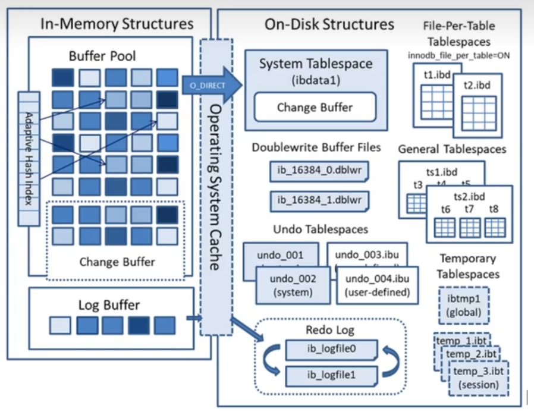

#### Buffer Pool

##### 1、概念

- 是**一块内存区域**，当数据库操作数据的时候，把硬盘上的数据（数据项，索引项）加载到buffer pool，不直接和硬盘打交道，操作的是buffer pool里面的数据
- 数据库的**增删改查都是在buffer pool上进行**，和undo log/redo log/redo log buffer/binlog一起使用，后续会把数据刷到硬盘上
- 默认大小 128M

##### 2、作用

“局部性原理”=》能把一些“可能要访问”的**页**提前加入缓冲池（**预读**），避免未来的磁盘IO操作

怎么知道数据页是否被缓存？

数据库中有一个**数据页缓存哈希表**
表空间号+数据页号，作为一个key，然后缓存页的地址作为value

##### 3、三种链表

（1）怎么找到哪里可以放缓存页的空间？

**Free链表**

是一个双向链表，链表节点是**空闲的缓存页**对应的控制块

> 加入时机
>
> 1）数据库**启动时**
>
> 2）如果缓存页**不够用**了，会把`lru冷数据区尾部的缓存页`刷盘，清空；
>
> 3）mysql后台线程也会**定时**把**lru`冷数据区`尾部的缓存页**刷盘，清空；
> 定时把flush链表中的缓存页刷盘，清空，加入到free链表中

（2）修改过的页（脏页）怎么找到？（没有刷到磁盘）

**Flush链表**

只要修改过的数据，就加入链表；mysql后台线程定时把flush链表中的缓存页刷盘

（3）缓存页满了，怎么淘汰？

**原始LRU**

最近最少使用，访问的缓存页加入到链表头部。淘汰最末尾的页。（最近最久未使用）

存在问题：全表扫描导致热数据被淘汰了

**分区域LRU**（淘汰逻辑不一样）

将链表分为2个链表

热数据区（5/8），冷数据区(3/8)

- 加入的控制块是插入到中间位置（冷数据区表头）

冷数据怎么转化到热数据区

冷数据第二次读取的时间点t2-第一次读取的时间点t1 > 1s，那么该控制块移动到热数据区

这样子全表扫描的时候，就不会影响到热数据。

因为全表扫描是读取一页多条数据（对应一个控制块）是非常快的，就是这一页的访问时间间隔是非常短，不会移动到热数据区。

##### 4、RedoLog

（1）执行update

1.更新Buffer Pool的页里面的数据

2.生成一个redoLog对象（包括SQL语句）

> redoLog对象 innodb层面
>
> binlog（主从复制，属于mysql server）
>
> undo log：回滚

3.commit之后，才会持久化redoLog对象

（2）为什么持久化redoLog对象

直接持久化会导致随机IO：页里面的数据不是连续存储的

顺序IO：默认开辟2个连续的磁盘空间存储RedoLog对象，写RedoLog对象直接追加就可以

如果2个连续的磁盘空间满了，之前的RedoLog对象会被覆盖；此时会出发CheckPoint机制，Mysql会把RedoLog对象所对应的页强制持久化到磁盘。

##### 5、Log Buffer

mysql有个配置项：事务提交刷新日志

0：事务提交时不立即持久化，交给后台线去做

1（默认）：事务提交时立即持久化

2：事务提交时立即写到OS cache，并不会持久化到磁盘，交给操作系统去持久化；mysql挂掉了，操作系统没挂，这个持久化还是可以的

##### 6、双写缓存

一页16kb（innodb最小的基本单位）写到磁盘需要4次，一次读取4kb，如果写一页的过程中，操作系统挂掉了，**数据不完整**。

于是加入双写缓存

假设将数据写到这个双写缓存成功，那么直接就redoLog日志删除，因为都已经持久化到磁盘了，即使还没有写到t1表磁盘空间

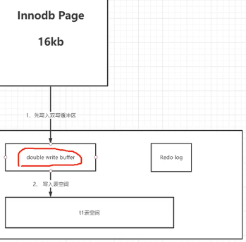

##### **7、Change Buffer（针对普通索引）**

它是一种应用在**非唯一普通索引页**不在缓冲池（Buffer Pool）中，对页进行了写操作，并不会立刻将磁盘页加载到缓冲池，而仅仅记录缓冲变更(buffer changes)，**等未来数据被读取时，再将数据合并(merge)恢复**到缓冲池中的技术。写缓冲的目的是**降低写操作的磁盘IO**，提升数据库性能。

场景：写多读少或者写后不立即读（）

对于唯一索引来说，**所有的更新操作都要先判断这个操作是否违反唯一性约束。比如，要插入 (4,400) 这个记录，就要先判断现在表中是否已经存在 k=4 的记录，而这必须要将数据页读入内存才能判断。**如果都已经读入到内存了，那直接更新内存会更快，就没必要使用 change buffer 了。
