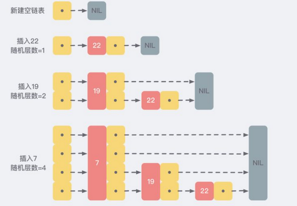

[官方文档](https://github.com/redisson/redisson/wiki/%E7%9B%AE%E5%BD%95)

https://www.codingsky.com/doc/2022/4/19/56.html

https://blog.csdn.net/qq_36389060/article/details/123955761

### Redis的理解

第一个， Redis 它是一个高性能的基于 key value 结构存储的 NoSQL 开源数据库。

第二个，目前市面上绝大部分的公司都采用 Redis 来实现分布式缓存，从而去提高数据的一个检索效率。

第三个， Redis 之所以这么流行，主要是有几个特点，第一，它是基于内存存储，在进行数据 IO 操作的时候，能够达到非常高的一个 QPS 。官方提供了一个指标是 10 万。第二个，它提供了非常丰富的数据存储结构，比如说 string ，list ，hash ，set 以及 zset等 。第三个， Redis 底层采用的是单线程实现的数据 IO ，所以在数据算法层面并不需要考虑并发的安全性，从而导致底层算法它的时间复杂，基本上属于常量复杂度。

第四个，虽然 Redis 它是一个内存存储，但是它也可以支持持久化，避免因为服务器故障导致数据丢失的一个问题。

最后基于这些特点，Redis一般是用来实现分布式缓存，从而去降低应用程序对关系型数据库检索带来的性能影响。除此之外，redis还可以实现分布式锁、分布式队列、计数器、社交网络的点赞，关注，关注列表，排行榜、查找附近的人等功能，为复杂应用提供非常方便和成熟的解决方案。以上就是我的回答。

### 高性能

#### 1. 什么是Redis？它主要用来什么的？⭐️

- Redis，英文全称是Remote Dictionary Server（远程字典服务），是一个开源的使用ANSI **C语言编写、支持网络、可基于内存亦可持久化的日志型、Key-Value数据库**，并提供多种语言的API。
- 与MySQL数据库不同的是，Redis的数据是**存在内存中**的。它的读写速度非常快，每秒可以处理超过10万次读写操作。因此redis被广泛**应用于缓存**，另外，Redis也经常用来做**分布式锁**。除此之外，Redis支持**事务、持久化、LUA 脚本、LRU 驱动事件、多种集群方案**。

和其他key - value 缓存产品的区别

（1）Redis**支持数据的持久化**，可以将内存中的数据保存在磁盘中，重启的时候可以再次加载进行使用。

（2）Redis不仅仅支持简单的key-value类型的数据，同时**还提供list，set，zset，hash等数据结构的存储**。

（3）Redis支持**数据的备份**，即master-slave模式的数据备份。

Redis 优势和优点

（1）**性能极高** – Redis能读的速度是110000次/s,写的速度是81000次/s 。

（2）**丰富的数据类型** – Redis支持二进制案例的 Strings, Lists, Hashes, Sets 及 Ordered Sets 数据类型操作。

（3）**支持事务**  ，Redis的所有操作都是原子性的，同时Redis还支持对几个操作全并后的原子性执行。

（4）**丰富的特性** – Redis还支持 publish/subscribe（发布/订阅）, 通知, key 过期等等特性。

（5）支持**主从复制**，主机会自动将数据同步到从机，可以进行读写分离。

缺点
（1）数据库容量**受到物理内存的限制**，不能用作海量数据的高性能读写，因此 Redis 适合的场景主
要局限在较小数据量的高性能操作和运算上。

（2）Redis **不具备自动容错和恢复功能**，主机从机的宕机都会导致前端部分读写请求失败，需要
等待机器重启或者手动切换前端的 IP 才能恢复。

（3）主机宕机，宕机前有部分数据未能及时同步到从机，切换 IP 后还会**引入数据不一致的问题**，
降低了系统的可用性。

（4）Redis **较难支持在线扩容**，在集群容量达到上限时在线扩容会变得很复杂。为避免这一问
题，运维人员在系统上线时必须确保有足够的空间，这对资源造成了很大的浪费。

#### 5.为什么要用 Redis/为什么要用缓存？

简单来说，使用缓存主要是为了提升用户体验以及应对更多的用户，也就是为了解决高性能和高并发的问题。

**高性能** ：

如果**命中缓存**，可以直接在内存中取出数据返回响应，不需要和数据库交互，效率高。降低了服务的请求响应延迟，提升用户体验。

不过，**要保持数据库和缓存中的数据的一致性**。 如果数据库中的对应数据改变的之后，同步改变缓存中相应的数据即可！

**高并发：**

一般像 MySQL 这类的数据库的 **每秒大概能执行1w条简单SQL** ，太多的请求就会把数据库压死，导致数据库宕机。但是加上缓存后，大部分请求都会命中缓存然后直接返回，**绝大部分流量都不会打到数据库中，这样极大的降低了数据库的压力**。这样也就提高的系统整体的并发能力。

#### 为什么要用 Redis 而不用 map/guava 做缓存 ?

缓存分为**本地缓存和分布式缓存**。以 Java 为例，使用自带的 map 或者 guava 实现的是本地缓
存,ehcache本地缓存，最主要的特点是轻量以及快速，生命周期随着 jvm 的销毁而结束，并且在多实例的情况下，每个实例都需要各自保存一份缓存，缓存不具有一致性。
使用 redis 或 memcached 之类的称为分布式缓存，在多实例的情况下，**各实例共用一份缓存数据，缓存具有一致性**。缺点是需要保持 redis 或 memcached 服务的高可用，整个程序架构上较为复杂。 

#### 3. Redis为什么这么快？⭐️⭐️


> 基于内存实现
>
> 高效的数据结构：
>
> 线程模型：逻辑清晰；不存在加锁释放锁操作；避免上下文切换；效率高
> I/O多路复用：redis 采用网络IO多路复用技术来保证在多连接的时候， **避免了对NIO中对所有连接遍历**读取造成的资源浪费，提高系统的高吞吐量。
>
> 虚拟内存机制：虚拟内存与硬盘的映射，不必将整个程序加载进内存（需要运行和常用的数据放进内存，不常用的放到硬盘），提高内存利用率，同时实现进程间的内存隔离（为每个进程提供一个完整连续内存空间）

#### 4.分布式缓存常见的技术选型方案有哪些？

分布式缓存的话，使用的比较多的主要是 **Memcached** 和 **Redis**。

过去分布式缓存最开始兴起的那会Memcached 比较常用，不过已经慢慢地被强大的Redis取代了。

分布式缓存主要解决的是单机缓存的容量受服务器限制并且无法保存通用的信息。部署了同一服务的多台机器的本地缓存之间是无法数据共享的。

#### 2.数据结构（类型）以及使用场景？⭐️

**（1）字符串（String）**：可以用来做最简单的数据缓存，可以缓存某个简单的字符串，也可以缓存某个json格式的字符串，Redis分布式锁的实现就利用了这种数据结构


1. **介绍** ：string 数据结构是简单的 key-value 类型。虽然 Redis 是用 C 语言写的，但是 Redis 并没有使用 C 的字符串表示，而是自己构建了一种 **简单动态字符串**（simple dynamic string，SDS）。相比于 C 的原生字符串，Redis 的 SDS 不光可以保存文本数据还可以保存二进制数据，并且**获取字符串长度复杂度为 O(1)**（C 字符串为 O(N)）,除此之外,Redis 的 SDS API 是安全的，**不会造成缓冲区溢出**。

   > * 更高效的获取一个 SDS 对象内保存的字符串的长度
   >
   > * 杜绝缓冲区溢出
   >
   > * 减少因字符串的修改导致的频繁分配和回收内存空间操作
   >
   > * 二进制安全

2. **常用命令:** set,get,strlen,exists,dect,incr,setex 等等。  

3. **应用场景** ：一般常用在需要**计数**的场景（字符串的内容为整数的时候可以使用），比如用户的访问次数、热点文章的点赞转发数量等等、**Session共享、分布式ID**

```sh
set test:count 1
incr test:count
decr test:count
```

**（2）列表（List）**：**双向链表，既可以当做栈，也可以当做队列来使用**，可以用来缓存类似微信公众号、微博等消息流数据；

1. **介绍** ：list 即是 链表。链表是一种非常常见的数据结构，特点是易于数据元素的插入和删除并且且可以灵活调整链表长度，但是链表的随机访问困难。许多高级编程语言都内置了链表的实现比如 Java 中的 LinkedList，但是 C 语言并没有实现链表，所以 Redis 实现了自己的链表数据结构。**Redis 的 list 的实现为一个 双向链表，即可以支持反向查找和遍历**，更方便操作，不过带来了部分额外的内存开销。
2. **常用命令**: rpush,lpop,lpush,rpop,lrange、llen 等。
3. **应用场景**: 发布与订阅或者说**消息队列**。

```sh
lpush test:ids 101 102 103    // 每次把数据从列表的左边压入
lindex test:ids 0;    // 103
lrange test:ids 0 -1    // 列出所有元素    103 102 101
rpop test:ids    // 101
lpop test:ids    // 103


rpush test:ids 101 102 103    // 每次把数据从列表的右边压入
lindex test:ids 0;    // 101
lrange test:ids 0 -1    // 列出所有元素    101 102 103
rpop test:ids    // 103
lpop test:ids    // 101
```

**（3）哈希表（Hash）**：可以用来存储一些key-value对，**更适合用来存储对象**

1. **介绍** ：hash **类似于  JDK1.8 前的 HashMap**，内部实现也差不多(**数组 + 链表**)。不过，Redis 的 hash 做了更多优化。另外，hash 是一个  string 类型的 field 和 value 的映射表，特别适合用于存储对象，后续操作的时候，你可以直接仅仅修改这个对象中的某个字段的值。  比如我们可以 hash 数据结构来存储用户信息，商品信息等等。
2. **常用命令**： hset,hmset,hexists,hget,hgetall,hkeys,hvals 等。
3. **应用场景**: 用于**对象数据的存储（存储用户信息，商品信息）**

```
hset test:user username zhangsan 
hset test:user id 1
hget test:user id
```

**（4）集合（Set）**：

1. **介绍** ：和列表类似，也可以存储多个元素，但是不能重复，集合可以行交集、并集、差集操作，从而可以实现类似，**好友关系**：我和某⼈共同关注的人（交集）、朋友圈点赞等功能；
2. **常用命令**： sadd,spop,smembers,sismember（是否为集合中的成员）,scard,sinterstore(交集),sunion(并集),sdiff（差集） 等。
3. **应用场景**: 需要存放的数据**不能重复**以及需要获取**多个数据源交集和并集等场景**

```sh
sadd test:teacher aaa bbb bbb ccc
scard test:teacher	// 统计大小 3
smembers test:teacher	//列出所有成员 "aaa" "bbb" "ccc"
```

**（5）有序集合（Sorted Set）**：集合是无序的，有序集合可以设置顺序，可以用来实现**排行榜**功能；

1. **介绍：** 和 set 相比，sorted set **增加了一个权重参数 score**，使得集合中的元素能够按 score 进行有序排列，还可以通过 score 的范围来获取元素的列表。可以用来实现排行榜功能
2. **常用命令**： zadd,zrem，zcard,zscore,zrank，zrange,zrevrange等。
3. **应用场景：可以用来实现排行榜功能** ，需要对数据根据某个权重进行排序的场景,。比如在直播系统中，在线用户数排行榜，各种礼物排行榜等信息。

```sh
zadd test:student 10 aaa 20 bbb 30 ccc 40 ccc
zcard test:student        //元素个数 3
zrange test:student 0 -1    //列出所有元素(按分值的从小到大顺序列出） "aaa" "bbb" "ccc"
zscore test:student ccc        //查找某个key的分值 40
zrank test:student ccc        // 按分值的从小到大排名    2
```

它还有三种特殊的数据结构类型

- Geospatial
- Hyperloglog
- Bitmap

其他命令

```sh
keys *    // 列出所有key
keys test:*    // 列出所有以test:开头的key
type test:user    // 打印test:user这个key的数据类型    hash/string/list/set/zset
exists test:user    // 判断当前数据库是否存在test:user这个key
del test:user        // 删除这个key
expire test:teacher 10    // 把test:teacher标记为10s后过期
```

#### 底层数据结构

##### 跳表

6.**那为什么mysql的索引，不使用跳表呢？**⭐️

同：B+树和跳表的**最下面一层，都包含了所有的数据**，且都是**顺序的，适合用于范围查询**。

**B+树**是多叉树结构，每个结点都是一个16kB的数据页（1条数据1KB），能存放较多索引信息。**三层**左右就可以存储`2kw`左右（16KB/14B* 16KB/14B* 16 KB/1KB= 21902400）的数据。也就是说查询一次数据，如果这些数据页都在磁盘里，那么最多需要查询**三次磁盘IO**。

**跳表**是链表结构，**一条数据一个结点**，如果最底层要存放`2kw`数据，且每次查询都要能达到**二分查找**的效果，`2kw`大概在`2的24次方`左右，所以，跳表大概高度在**12层**左右。最坏情况下，这24层数据会分散在不同的数据页里，也即是查一次数据会经历**12次磁盘IO**。因此存放同样量级的数据，B+树的高度比跳表的要少，如果放在mysql数据库上来说，就是**磁盘IO次数更少，因此B+树查询更快**。

而针对**写操作**，B+树需要**拆分合并**索引数据页，跳表则独立插入，并根据随机函数确定层数，没有旋转和维持平衡的开销，因此**跳表的写入性能会比B+树要好。**

其实，mysql的**存储引擎是可以换的**，以前是`myisam`，后来才有的`innodb`，它们底层索引用的都是**B+树**。也就是说，你完全可以造一个索引为跳表的存储引擎装到mysql里。事实上，`facebook`造了个`rocksDB`的存储引擎，里面就用了**跳表**。直接说结论，它的**写入性能**确实是比innodb要好，但**读性能**确实比innodb要差不少。

**7.Redis为什么选择了跳跃表而不是红黑树⭐️⭐️**

  Redis只在两个地方用到了跳跃表，一个是实现**有序集合键(zset)**，另一个是在**集群节点**中用作内部数据结构，除此之外，跳表在Redis里面没有其他用途。 但是为什么用跳表而不用红黑树呢？

1）redis 是纯纯的内存数据库。

进行读写数据都是操作内存，跟磁盘没啥关系，因此也**不存在磁盘IO**了，所以层高就不再是跳表的劣势了。
并且前面也提到B+树是有一系列合并拆分操作的，换成红黑树或者其他AVL树的话也是各种旋转，目的也是**为了保持树的平衡**。
而跳表插入数据时，只需要随机一下，就知道自己要不要往上加索引，根本不用考虑前后结点的感受，也就**少了旋转平衡的开销**。

2）在做**范围查找**的时候，平衡树比skiplist操作要复杂。在平衡树上，我们找到指定范围的小值之后，还需要**以中序遍历**的顺序继续寻找其它不超过大值的节点。如果不对平衡树进行一定的改造，这里的中序遍历并不容易实现。而在skiplist上进行范围查找就非常简单，只需要在找到小值之后，**对第1层链表进行若干步的遍历**就可以实现。
3）平衡树的**插入和删除操作**可能引发子树的调整，逻辑复杂，而skiplist的插入和删除只需要修改相邻节点的指针，操作简单又快速。
4）从**内存占用**上来说，skiplist比平衡树更灵活一些。一般来说，平衡树每个节点包含**2个指针（分别指向左右子树）**，而skiplist**每个节点包含的指针数目平均为1/(1-p)**，具体取决于参数p的大小。如果像Redis里的实现一样，取p=1/4，那么平均每个节点包含1.33个指针，比平衡树更有优势。
5）**查找单个key**，skiplist和平衡树的时间复杂度都为O(log n)，大体相当；而哈希表在保持较低的哈希值冲突概率的前提下，查找时间复杂度接近O(1)，性能更高一些。所以我们平常使用的各种Map或dictionary结构，大都是基于哈希表实现的。
6）从**算法实现难度上**来比较，skiplist比平衡树要简单得多。 结合书籍《redis设计与实现(第二版)》里面的一段描述进行理解：


- 1.要快速**随机**增删，故**排除数组**结构
- 2.要排序，且要考虑高并发性能，故排除红黑树、平衡树（因为他们需要rebalance实现再平衡）   
  - **性能**考虑： 在高并发的情况下，树形结构需要执行一些类似于 **rebalance** 这样的可能涉及整棵树的操作，相对来说跳跃表的变化只涉及局部 (下面详细说)；
  - **内存**考虑：平衡树每个节点包含2个指针；指针数目平均为1/(1-p)，p=1/4,1.33个指针
  - **实现**考虑： 在复杂度与红黑树相同的情况下，**跳跃表实现起来更简单**，看起来也更加直观（平衡树的范围查找是中序遍历，而跳跃表对1层链表进行若干步的遍历）

**随机出层数**

> 其实跳跃表是受`多层链表`的想法启发设计得来的。
>
> 如果上一层的链表的节点个数，是下面一层的节点个数的一半，这样查找就非常类似于一个`二分查找`。
>
> 但是为什么不直接用二分查找的方式去解决问题， 还要用随机的方式（抛硬币）来解决层数的问题呢？
>
> 试想一下，如果我们结构上强制着二分查找，相邻的两层链表上的节点个数严格按照2：1的对应关系，**那么在插入新节点的时候，就会打乱这层对应关系，要维护这层关系，又必须把新插入的节点后边的所有节点重新进行调整，这又让时间复杂度退化为O(N)，删除数据也有同样的问题。**
>
> 跳跃表为了避免这一问题，就采用了随机层数的方式来巧妙的解决。

比如，一个节点随机出的层数是 4，那么就把它链入到第 1 层到第 3 层这三层链表中。




> 先查找插入结点在对应层的起始位置，，然后随机出插入结点的层数，再将记录的起始结点链接上插入结点

> 查找，插入：从**最高层开始**

优点：每一个节点的层数（level）是随机出来的，而且**新插入一个节点并不会影响到其他节点的层数**，因此，插入操作**只需要修改节点前后的指针**，而不需要对多个节点都进行调整，这就降低了插入操作的复杂度。

**为什么跳表默认允许最大32层？**

直观上期望的目标是 ：

- 50% 的概率被分配到 Level 1；
- 25% 的概率被分配到 Level 2，
- 12.5% 的概率被分配到 Level 3;

因为这里每一层的**晋升率**都是 50%。Redis 跳跃表默认允许最大的层数是 **32**，被源码中 ZSKIPLIST_MAXLEVEL 定义，当 Level[0] 有 2^64 个元素时，才能达到 32 层，所以定义 **32 完全够用了**。

> **L=log1/p N**=logN/log(1/p)

**层数选择**

最好为logn层，这样能保证跳表查询、插入、删除的时间复杂度为O(log n)，与平衡二叉树接近；

##### 压缩列表

压缩列表的最大特点，就是它被设计成一种内存紧凑型的数据结构，占用一块连续的内存空间。

##### 快表


##### 字典


##### 动态字符串


#### 总结

1、String：最常规的set/get操作，value可以是String也可以是数字。一般做一些复杂的计数功能的缓存。常用命令get、set、自增incr、自减decr、mget等。String底层数据结构实现为**简单动态字符串（SDS）**。

2、hash：可以用来存储一个对象结构的比较理想的数据类型。一个对象的各个属性，正好对应一个hash结构的各个field。在field比较少，各个value值也比较小的时候，hash采用**ziplist**来实现；而随着field增多和value值增大，hash可能会变成**dict**来实现。当hash底层变成dict来实现的时候，它的存储效率就没法跟那些序列化方式相比了。

3、list：可以做简单的消息队列的功能。另外还有一个就是，可以利用lrange范围操作命令，做基于redis的分页功能性能极佳，用户体验好。Redis对外暴露的list数据类型，它底层实现所依赖的内部数据结构就是**quicklist**

4.set：set存放的是一堆不重复值的集合，所以可以做全局去重的功能。**intset**作为set的底层实现，但当数据量较大或者集合元素为字符串时，redis会使用**dict**实现set。

5、sorted set：sorted set多了一个权重参数score，集合中的元素能够按score进行排列。可以做排行榜应用，取TOP N操作。sorted set底层实现的数据结构有skiplist、ziplist。

只有同时满足如下条件是,使用的是**ziplist**,其他时候则是使用**skiplist**

- 有序集合保存的元素数量小于128个
- 有序集合保存的所有元素的长度小于64字节

#### 线程模型⭐️⭐️

##### 单线程模型


Redis基于Reactor模式开发了网络事件处理器，这个处理器叫做文件事件处理器 file event handler。 这个文件事件处理器，它是单线程的，所以 Redis 才叫做单线程的模型

它采用IO多路复用机制来同时 监听多个Socket，根据Socket上的事件类型来选择对应的事件处理器来处理这个事件。可以实现高性能 的网络通信模型，又可以跟内部其他单线程的模块进行对接，保证了 Redis 内部的线程模型的高效简单性。文件事件处理器的结构包含4个部分：多**个Socket、IO多路复用程序、文件事件分派器以及事件处理器** （命令请求处理器、命令回复处理器、连接应答处理器等）。 多个 Socket 可能并发的产生不同的操作，每个操作对应不同的文件事件，但是IO多路复用程序会监听 多个 Socket，会将 Socket 放入一个队列中排队，每次从队列中取出一个 Socket 给事件分派器，事件 分派器把 Socket 给对应的事件处理器。

 然后一个 Socket 的事件处理完之后，IO多路复用程序才会将队列中的下一个 Socket 给事件分派器。文 件事件分派器会根据每个 Socket 当前产生的事件，来选择对应的事件处理器来处理。 

##### **为什么是单线程？**

因为Redis是基于**内存**的操作，CPU不是Redis的瓶颈，Redis的瓶颈最有可能是**机器内存的大小或者网络带宽**。既然**单线程容易实现**，而且CPU不会成为瓶颈，那就顺理成章地采用单线程的方案了。

- 1）**不需要锁的各种消耗**：Redis的数据结构并不全是简单的Key-Value，还有list，hash等复杂的结构，这些结构有可能会进行很细粒度的操作，比如在很长的列表后面添加一个元素，在hash当中添加或者删除一个对象。这些操作可能就需要加非常多的锁，导致的结果是同步开销大大增加。总之，在单线程的情况下，就不用去考虑各种锁的问题，不存在加锁释放锁操作，没有因为可能出现死锁而导致的性能消耗。
- 2）**单线程多进程集群方案**：单线程的威力实际上非常强大，每核心效率也非常高，**多线程自然是可以比单线程有更高的性能上限**，但是在今天的计算环境中，即使是**单机多线程的上限也往往不能满足需要**了，需要进一步摸索的是多服务器集群化的方案，这些方案中多线程的技术照样是用不上的。所以**单线程、多进程的集群**不失为一个时髦的解决方案。
- 3）**CPU消耗**：采用单线程，避免了不必要的上下文切换和竞争条件，也不存在多进程或者多线程导致的切换而消耗 CPU。但是如果**CPU成为Redis瓶颈，或者不想让服务器其他CUP核闲置**，那怎么办？可以**考虑多起几个Redis进程**，Redis是key-value数据库，不是关系数据库，数据之间没有约束。**只要客户端分清哪些key放在哪个Redis进程上**就可以了。

> 在任务执行时间比较长的话，用多线程会比较快；但是redis只是进行简单的set，没有复杂的业务

单线程优势

> 代码更清晰，处理逻辑更简单
>
> 不用去考虑各种锁的问题，不存在加锁释放锁操作，没有因为可能出现死锁而导致的性能消耗
>
> 不存在多进程或者多线程导致的切换而消耗CPU

单线程缺点

> 无法发挥多核CPU性能，不过可以通过在单机开多个Redis实例来完善；

##### IO多路复用

背景

> **阻塞IO**，假设应用程序的进程发起IO调用，但是如果内核的数据还没准备好的话，那应用程序进程就一直在阻塞等待，一直等到内核数据准备好了，从内核拷贝到用户空间，才返回成功提示
>  **弊端** : 如果用户一直阻塞，浪费系统资源
>
> **非阻塞IO** : 如果内核数据还没准备好，可以先返回错误信息给用户进程，让它不需要等待，而是通过轮询的方式再来请求。
>  **弊端** : 频繁的轮询内核数据是否准备好，导致频繁的系统调用，浪费系统资源
>
> 既然NIO无效的轮询会导致CPU资源消耗，我们**等到内核数据准备好了，主动通知应用进程再去进行系统调**。
>
> 文件描述符fd：形式上是一个非负整数。当程序打开一个现有文件或者创建一个新文件时，内核向进程返回一个文件描述符。
>
> IO复用模型核心思路：系统给我们提供一类函数（如我们耳濡目染的select、poll、epoll函数），它们可以同时监控多个fd的操作，任何一个返回内核数据就绪，应用进程再发起系统调用。借助select的IO多路复用模型，只需要发起一次询问就够了,大大优化了性能。

**select / poll 缺点**

- 每次调用select/poll都需要把fd集合**从用户态拷贝到内核态**，这个开销在fd很多时会很大；

- 同时每次调用select/poll**都需要在内核遍历**传进来的所有fd，这个开销在fd很多时会很大；

- select支持的**文件描述符数量太小**，默认1024；(poll：poll本质上和select没有区别，但是它**没有最大连接数的限制**，基于链表来存储的；epoll虽然连接数有上限，但是很大，1G内存的机器上可以打开10万左右的连接)

epoll是poll的一种优化，返回后不需要对所有的fd进行遍历，它在内**核中维护了fd列表。**把原先的select/poll调用分成三个部分。

1. 调用epoll_create（）建立一个epoll对象（在epoll文件系统中为这个句柄对象分配资源）；
2. 调用epoll_ctl向epoll对象来注册一个fd（文件描述符），一旦基于某个fd就绪时，**内核会采用回调机制**，迅速激活这个fd
3. 当进程调用epoll_wait()时便得到通知

这里去掉了**遍历文件描述符**的坑爹操作，而是采用**监听事件回调**的机制。这就是epoll的亮点。而epoll最大的优点就在于**它只管你活跃的连接**，而跟连接总数无关；无内存拷贝（内存共享）；

**用IO多路复用的好处**

> 多路-指的是**多个socket连接**，复用-指的是**复用同一个线程**。借助linux内核的select / poll / **epoll** 函数来进行socket监听, 监听到哪个socket有数据, 会返回给redis该socket的数据, redis来对此socket进行数据读取, **避免了对NIO中对所有连接遍历**读取造成的资源浪费
>
> redis 采用网络IO多路复用技术来保证在多连接的时候， 系统的高吞吐量。
>
> 采用多路 I/O 复用技术可以让单个线程高效的处理多个连接请求（尽量减少网络IO的时间消耗），且Redis在内存中操作数据的速度非常快（内存内的操作不会成为这里的性能瓶颈），主要以上两点造就了Redis具有很高的吞吐量。
>

### 怎么保证redis挂掉之后再重启数据可以进行恢复？

#### 持久化⭐️⭐️

Redis 提供两种持久化机制 RDB （默认） 和 AOF 机制 :
**（1）RDB** ：快照功能并不是非常耐久。按照一定的时间**将内存的所有数据以快照的形式保存到硬盘**中，对应产生的数据文件为 dump.rdb 。通过配置文件中的 save 参数来定义快照的周期。 


优点：
1 、只有一个文件 dump.rdb ，方便持久化。
2 、容灾性好，一个文件可以保存到安全的磁盘。
3 、性能最大化， fork 子进程来完成写操作，让主进程继续处理命令，所以是 IO 最大化。使用单独子进程来进行持久化，主进程不会进行任何 IO 操作，保证了 redis 的高性能
4、相对于数据集大时，比 AOF 的启动效率更高。

缺点：

 1 、**数据安全性低**。 RDB 是间隔一段时间进行持久化，如果持久化之间 redis 发生故障，**会发生数据丢失**。所以这种方式更适合数据要求不严谨的时候 ) 

**开启**

```
save 60 1000 //关闭RDB只需要将所有的save保存策略注释掉即可 60s内，写1000条命令，就进行一次RDB持久化
```

**（2）AOF**（ Append-only fifile) 持久化方式（1.1+）： 将 Redis 执行的每次**写（修改）命令**记录到单独的日志文件中，当重启 Redis 会重新将持久化的日志中文件恢复数据。 

优点：
1 、数据安全， aof 持久化可以配置 appendfsync 属性，有 always ，每进行一次 命令操作就记录到 aof 文件中一次。
2 、通过 append 模式写文件，即使中途服务器宕机，可以通过 redis-check-aof 工具解决数据一致性问题。
3 、 AOF 机制的 rewrite 模式。 AOF 文件没被 rewrite 之前（文件过大时会对命令 进行合并重写），可以删除其中的某些命令（比如误操作的 flflushall ） )
缺点：
1 、 AOF 文件**比 RDB 文件大**，且**恢复速度慢**。
2 、数据集大的时候，比 rdb **启动效率低**。

**开启**

```
appendonly yes
```

```sh
appendfsync always：每次有新命令追加到 AOF 文件时就执行一次 fsync ，非常慢，也非常安全。  
appendfsync everysec：每秒 fsync 一次，足够快，并且在故障时只会丢失 1 秒钟的数据。 （常用）
appendfsync no：从不 fsync ，将数据交给操作系统来处理。更快，也更不安全的选择。
```

**（3）混合持久化**（4.0）

> 重启 Redis 时，我们很少使用 RDB来恢复内存状态，因为会丢失大量数据。我们通常使用 AOF 日志重 放，但是重放 AOF 日志性能相对 RDB来说要慢很多，这样在 Redis 实例很大的情况下，启动需要花费很长的时间。

**开启**

```
aof‐use‐rdb‐preamble yes
```

如果开启了混合持久化，**AOF在重写时**，**不再是单纯将内存数据转换为命令**写入AOF文件，而是将 **重写这一刻**之前的内存做RDB快照处理，并且将**RDB快照内容和增量的AOF**修改内存数据的命令存在一 起，都写入新的AOF文件，新的文件一开始不叫appendonly.aof，等到重写完新的AOF文件才会进行改名，覆盖有的AOF文件，完成新旧两个AOF文件的替换。于是在 Redis 重启的时候，可以先加载 RDB 的内容，然后再重放增量 AOF 日志就可以完全替代之前的AOF 全量文件重放，因此重启效率大幅得到提升。


**区别**


#### AOF重写

AOF文件里可能有太多没用指令，所以AOF会定期根据**内存的最新数据**生成aof文件

**如下两个配置可以控制AOF自动重写频率**

```
# auto‐aof‐rewrite‐min‐size 64mb //aof文件至少要达到64M才会自动重写，文件太小恢复速度本来就很快，重写的意义不大 
# auto‐aof‐rewrite‐percentage 100 //aof文件自上一次重写后文件大小增长了100%则再次触发重写
```

当然AOF还可以手动重写，进入redis客户端执行命令**bgrewriteaof**重写AOF，注意：**AOF重写redis会fork出一个子进程去做(与bgsave命令类似)，**不会对redis正常命令处理有太多影响

#### 重写缓存

背景：AOF会有重写操作，那么就存在一个问题，如果在重写AOF过程中，主进程进行了写操作，会导致数据不一致问题。

重写缓存：即子进程在执行AOF重写时，主进程需要执行以下三个工作：

- 执行client发来的命令请求；
- 将写命令追加到现有的**AOF文件**中；
- 同时将写命令**追加到AOF重写缓存**中。

当子进程完成对AOF文件重写之后，它会向父进程发送一个完成信号，父进程接到该完成信号之后，会调用一个信号处理函数，该函数完成以下工作：

- 将AOF重写缓存中的内容全部写入到新的AOF文件中；这个时候新的AOF文件所保存的数据库状态和服务器当前的数据库状态一致；
- 对新的AOF文件进行改名，原子的覆盖原有的AOF文件；完成新旧两个AOF文件的替换。

#### 过期策略

**定期删除**：redis是每隔100ms**随机抽取一些key**来检查和并清除其中已过期的key，但是问题是，定期删除可能会导致很多过期key到了时间并没有被删除掉，这时就得惰性删除

**惰性删除**：获取key时，检查是否过期，若过期立即删除。

Redis通过上述两种手段结合起来，保证过期的key一定会被干掉。

但是实际上这还是有问题的，如果定期删除漏掉了很多过期key，然后你也没及时去查，也就没走惰性删除，如果大量过期key堆积在内存里，导致redis内存块耗尽了，咋整？走内存淘汰机制


#### 淘汰机制

- noeviction：当内存使用超过配置的时候会返回错误，不会删除任何键
- allkeys-lru：加入键的时候，如果过期，从**所有键中**删除最近最久没有使用的键
- volatile-lru：加入键的时候如果过期，首先从设置了**过期键集合中删除**最近最久没有使用的键
- allkeys-random：加入键的时候如果过期，从所有key随机删除
- volatile-random：加入键的时候如果过期，从过期键的集合中随机删除
- volatile-lfu：从所有配置了过期时间的键中删除使用频率最少的键
- allkeys-lfu：从所有键中删除**使用频率最少**的键
- volatile-ttl：从配置了**过期时间的键中删除马上就要过期的键**

 Redis 的内存淘汰策略的选取并不会影响过期的 key 的处理。内存淘汰策略用于处理内存不足时的需要申请额外空间的数据；过期策略用于处理过期的缓存数据。 

> LFU 缓存策略更符合热点数据的概念，使用次数上
>
> LRU:使用时间上

##### 手写LRU

##### 手写LFU

#### 数据备份策略

- 写crontab定时调度脚本，每小时都copy一份rdb或aof的备份到一个目录中去，仅仅保留最近48小时的备份

- 每天都保留一份当日的数据备份到一个目录中去，可以保留最近1个月的备份

- 每次copy备份的时候，都把太旧的备份给删了

- 每天晚上将当前机器上的备份复制一份到其他机器上，以防机器损坏

#### 内存回收


#### Redis 持久化数据和缓存怎么做扩容？

如果 Redis 被当做缓存使用，使用一致性哈希实现动态扩容缩容。
如果 Redis 被当做一个持久化存储使用，必须使用固定的 keys-to-nodes 映射关系，节点的数量一
旦确定不能变化。否则的话 ( 即 Redis 节点需要动态变化的情况），必须使用可以在运行时进行数据
再平衡的一套系统，而当前只有 Redis 集群可以做到这样。 

### 分布式锁⭐️⭐️⭐️

##### redis

实现

setnx+setex:存在设置超时时间失败的情况，导致死锁；setnx之后可能宕机，setex失败
set(key,value,nx,px):将setnx+setex**变成原子操作问题**:

- 任务超时，锁自动释放，导致并发问题。使用redisson解决(看门狗监听，自动续期)

> 任务执行时间20s，锁过期时间10s

- 加锁和释放锁不是同一个线程的问题。在value中存入uuid(线程唯一标识)，删除锁时判断该标识（**使用lua保证原子操作**）

> A过期时间10s，A处理11s，11s的时候我们del锁；有可能10s的时候B拿到锁，此时11s删除的是B的锁

- 不可重入，使用redisson解决(实现机制类似AQS，计数)

> setnx，key存在就不会设置

- 异步复制可能造成锁丢失，使用redLock解决（使用N个完全独立、没有主从关系的Redis master节点）

> 1.顺序向五个节点请求加锁
>
> ⒉根据一定的超时时间来推断是不是跳过该节点
>
> 3.三个节点加锁成功并且花费时间小于锁的有效期
>
> 4.认定加锁成功

> 如果用主从架构，redLock还是存在问题：客户端向主节点2申请加锁，主节点挂了但是数据还未同步到从节点的问题，从节点变为主节点（此时它没有锁），因此另外一个客户端对新的主节点1申请加锁可以成功。

##### zookeeper


> 加锁：首先，在Zookeeper当中创建一个持久节点ParentLock。当第一个客户端想要获得锁时，需要在ParentLock这个节点下面创建一个**临时顺序节点** Lock1，第2个客户端Client2。
>
> 释放锁：1）任务完成，客户端显示释放lock1 2）任务执行过程中，客户端崩溃，根据临时节点的特性，相关联的节点Lock1会随之自动删除。由于Client2一直监听着Lock1的存在状态，当Lock1节点被删除，Client2会立刻收到通知。这时候Client2会再次查询ParentLock下面的所有节点，确认自己创建的节点Lock2是不是目前最小的节点。如果是最小，则Client2顺理成章获得了锁。

> 为什么被唤醒之后，还需要判断是否为最小的结点？
>
> 比如3被唤醒，（由于客户端2宕机），此时发现有客户端1，所以不能直接获取锁

zookeeper是CP模式（强一致性）不会丢失key，客户端加锁请求，主结点加锁成功后，先同步到从节点，超过半数的从节点同步成功，主节点才会给客户端发送加锁成功。zk的设计就是强一致性，如果获取不到锁，就添加一个监听，不用一直轮询。但是zk也有其缺点，如果有较多的客户端频繁的申请加锁解锁，对zk集群的压力比较大

redis是AP模式（弱一致性，最终一致性）会丢失key，客户端加锁请求，主节点立即返回加锁成功。获取不到锁，就直接不断的重试，比较消费资源、性能。通过redlock来解决丢锁，但是还是有可能并发问题，

**znode类型**

临时节点（断开连接自己删除）

持久节点（断开连接不删除）

```
create -s //有序 -e //临时
临时，临时有序；持久有，持久序

ls -w /path //监听path下节点变化
```

##### 数据库

**基于数据库的唯一索引**
在数据库每一条记录就有一把锁，利用唯一索引的排它锁


获取锁的SQL:

    INSERT INTO method_lock (method_name, desc) VALUES ('methodName', 'methodName');

释放锁的SQL：

    DELETE FROM method_lock where method_name = methodName;

缺点：

反复擦写数据库，效率低下
锁强依赖数据库的可用性，数据库是一个单点，一旦数据库挂掉，会导致业务系统不可用。
锁没有失效时间，一旦解锁操作失败，就会导致锁记录一直在数据库中，其他线程无法再获得到锁。


### 缓存问题⭐️⭐️⭐️

#### 缓存雪崩

原因：（1）由于大批量缓存在同一时间失效可能导致大量请求同时穿透缓存直达数据库；

- 在批量增加缓存时最好将这一批数据的设置一个**随机的缓存过期时间**
- redis集群把不同key放到不同节点，比如使用Redis Sentinel或Redis Cluster
- 设置不过期并用定时任务去刷新缓存

（2）redis宕机

- 多级缓存，在redis之前，用JVM进程级别的Map存数据

> Map存不了太多数据
>
> - 当 Redis 为一级缓存，Ehcache 为二级缓存时：目的是当 Redis 挂掉后，有备份（JVM 本地缓存）
> - 当 Ehcache 为一级缓存，Redis 为二级缓存时：先走本地，如果本地没有再走网络，效率会高一些

- 依赖隔离组件为后端限流，熔断并降级，比如使用Sentinel或Hystrix限流降级组件
- 提前演练。

#### 缓存击穿

原因：某个拍卖商品的缓存失效，一瞬间大量请求打到数据库上

- DCL双检测锁机制

- 加分布式锁

  > 给查询数据加锁，此时只有1个线程可以查数据库，查完后设置到缓存；后面的线程就可以去缓存查了

- 设置热点数据缓存不过期

  > 针对热点key不设置过期时间，并且定时刷新缓存
  >
  > 从实战看这种方法对于性能非常友好，唯一不足的就是构建缓存时候，其余线程(非构建缓存的线程)可能访问的是老数据

#### 突发热点缓存key重建优化

原因：瞬间热点，缓存重建（直播带货）

要解决这个问题主要就是要避免大量线程同时重建缓存

- DCL双检测锁机制，生效在JVM，单机上

> 缓存查
>
> sychronized（
>
> 查缓存，（第一个线程查完，就有了；下一个线程查，直接去缓存查了）
>
> 查数据库
>
> ）

- setnx（为每一个热点商品设置一把锁）

#### 缓存穿透

原因：查询大量根本不存在的数据，穿透缓存直达数据库，将数据库打死

- 对请求参数进行合法校验

- 缓存空数据

> 缺点：如果有大量的key穿透，缓存空对象会占用宝贵的内存空间。
> 空对象的key设置了过期时间，在这段时间可能会存在缓存和持久层数据不一致的场景。

- 布隆过滤器

#### 冷热数据分离

缓存读延期 - 冷热数据分离

#### **缓存降级**

> 缓存降级是指**缓存失效或者缓存服务器挂掉**的情况下，不去访问数据库，直接返回默认数据或者访问服务的内存数据。降级一般是有损的操作，所以尽量减少降级对业务的影响程度

**降级的目的是保证核心服务可用，即使可能有损其他操作**。比如双十一的时候淘宝购物车无法修改地址只能使用默认地址，这个服务就是被降级了，这是阿里为了保证订单可以正常提交和付款，但修改地址的服务可以在服务器压力降低，并发量相对减少的时候再恢复。

在进行降级之前要对系统进行梳理，看看系统是不是可以丢卒保帅；从而梳理出哪些必须誓死保护，哪些可降级。比如可以参考日志级别设置预案

- **一般**：比如有些服务偶尔因为网络抖动或者服务正在上线而超时，可以**自动降级**
- **警告**：有些服务在一段时间内成功率有所波动（如在95~100%之间），可以**自动降级或者人工降级**
- **错误**：比如可用率低于90%，或者数据库连接池被打爆了，或者访问量突然猛增到系统能够承受的最大阈值，此时可以**根据情况自动降级或者人工降级**
- **严重错误**：比如因为特殊原因数据错误了，此时需要**紧急人工降级**

#### **缓存预热**

**冷启动**：服务刚刚启动时，Redis中并没有缓存，如果所有商品数据都在第一次查询时添加缓存，可能会给数据库带来较大压力。

**缓存预热**：在实际开发中，我们可以利用大数据统计用户访问的热点数据，在项目启动时将这些热点数据提前查询并保存到Redis中。

#### 如何保证缓存和数据库数据的一致性？

在大并发下，同时操作数据库与缓存会存在数据不一致性问题

- 超时机制：对于我们的用户自己的订单数据，或者用户信息数据，或者说高并发场景下能容忍短时间的数据不一致，这些都可以采用**添加过期时间**（常用）缓存做不到绝对一致性，但可以做到**最终一致性**。

- 定时更新缓存：后台线程定时查询数据库中的数据，然后将数据写入缓存中

- 实时更新缓存：使用阿里开源的Canal框架实现MySQL数据库与缓存数据的实时同步

- 分布式锁，readwriteLock**读多写少**，用trylock（慎用）


- 更新缓存，再更新数据库（差）

> 如果刚写完缓存，突然网络出现了异常，导致写数据库失败了，这个问题非常严重

- 先更新数据库值，再更新缓存值（一般不采用）

> 写数据库成功，但写缓存失败了，依然会造成缓存脏数据的问题
>
> **线程安全的角度**
>
> 同时有请求A和请求B进行更新操作；
>
> 1. 请求A更新数据库
> 2. 请求B更新数据库
> 3. 请求B更新缓存
> 4. 请求A更新缓存（A可能由于网络原因慢更新了）
>
> **业务角度，为什么不更新缓存？**
>
> 如果数据库1小时内更新了1000次，那么缓存也要更新1000次，但是这个缓存可能只在最后一次更新后被读取了1次，那么前999次的更新有必要吗？思想:类似lazy加载的思想，减少计算

- 先删缓存，再写数据库（还可以）

> 在高并发场景下，当第一个线程删除了缓存，还没有**来得及写数据库**，第二个线程来读取数据，会发现缓存中的数据为空，那就会去读数据库中的数据(旧值，脏数据)，读完之后，把读到的结果写入缓存(此时，第一个线程已经将新的值写到缓存里面了)，这样缓存中的值就**会被覆盖为修改前的脏数据**。
> 解决：先操作缓存，但是不删除缓存。将缓存修改为一个特殊值(-999)。客户端读缓存时，发现是默认值，就休眠一小会，再去查一次Redis。-》特殊值对业务有侵入。休眠时间，可能会多次重复，对性能有影响。

- 延迟双删：就是在**更新了数据库之后等一小段时间再删除缓存**（比较优秀）

> 1.删除redis
> 2.更新数据库
> 3.延时500毫秒，为了我们在第二次删除redis之前能完成数据库的更新操作。
> 4.删除redis
> 如果我们没有第二次删除操作，此时有请求访问数据，有可能是访问的之前未做修改的redis数据，删除操作执行后，redis为空，有请求进来时，便会去访问数据库，此时数据库中的数据已是更新后的数据，保证了数据的一致性。
>
> 但是删除缓存可能失败
>
> 解决方案:1》给缓存设置一个过期时间问题，过期时间内，缓存数据不会更新。
> 2》引入MQ，保证原子操作，删除缓存失败会重试，会带来更多的问题，怎么保证消息不丢失？消息的延迟，不推荐
>
> 3）引入binlog同步


#### 避免


#### 库存超卖


### 如何实现高并发，高可用

redis高并发：主从架构，一主多从，一般来说，很多项目其实就足够了，单主用来写入数据，单机几万QPS，多从用来查询数据，多个从实例可以提供每秒10万的QPS。
redis高并发的同时，还需要容纳大量的数据：一主多从，每个实例都容纳了完整的数据，比如redis主就10G的内存量，其实你就最对只能容纳10g的数据量。如果你的缓存要容纳的数据量很大，达到了几十g，甚至几百g，或者是几t，那你就需要redis集群，而且用redis集群之后，可以提供可能每秒几十万的读写并发。

redis高可用：如果你做主从架构部署，其实就是加上哨兵就可以了，就可以实现，任何一个实例宕机，自动会进行主备切换。

#### redis集群架构

redis cluster，10台机器，5台机器部署了redis主实例，另外5台机器部署了redis的从实例，每个主实例挂了一个从实例，5个节点对外提供读写服务，每个节点的读写高峰qps可能可以达到每秒5万，5台机器最多是25万读写请求/s。

机器是什么配置？32G内存+8核CPU+1T磁盘，但是分配给redis进程的是10g内存，一般线上生产环境，redis的内存尽量不要超过10g，超过10g可能会有问题。

5台机器对外提供读写，一共有50g内存。因为每个主实例都挂了一个从实例，所以是高可用的，任何一个主实例宕机，都会自动故障迁移，redis从实例会自动变成主实例继续提供读写服务

你往内存里写的是什么数据？每条数据的大小是多少？商品数据，每条数据是10kb。100条数据是1mb，10万条数据是1g。常驻内存的是200万条商品数据，占用内存是20g，仅仅不到总内存的50%。

目前高峰期每秒就是3500左右的请求量


### 2.4.5 怎么保证高性能和高并发（精华）

#### 高并发

> 首先，你的底层的缓存中间件，缓存系统，必须能够支撑的起我们说的那种高并发，其次，再经过良好的整体的缓存架构的设计（多级缓存架构、热点缓存）
> 单机redis不能支撑高并发
>
> redis主从架构 -> 读写分离架构 -> 可支持水平扩展的读高并发架构

##### redis replication的核心机制

（1）redis采用**异步方式复制数据到slave节点**，不过redis 2.8开始，slave node会周期性地主动确认自己每次复制的数据量
（2）一个master node是可以配置多个slave node的
（3）slave node也可以连接其他的slave node
（4）slave node做复制的时候，是不会block master node的正常工作的
（5）slave node在做复制的时候，也不会block对自己的查询操作，它会**用旧的数据集来提供服务**; 但是复制完成的时候，需要删除旧数据集，加载新数据集，这个时候就会暂停对外服务了
（6）slave node主要用来进行**水平扩容，做读写分离**，扩容的slave node可以提高读的吞吐量

##### master持久化对于主从架构的安全保障的意义

第一个，如果采用了主从架构，那么建议必须开启master node的持久化！

master宕机，重启，是没有本地数据可以恢复的，然后就会直接认为自己IDE数据是空的，master就会将空的数据集同步到slave上去，所有slave的数据全部清空。

第二个，master的各种备份方案，要不要做，万一说本地的所有文件丢失了; 从备份中挑选一份rdb去恢复master; 这样才能确保master启动的时候，是有数据的

即使采用了后续讲解的高可用机制，slave node可以自动接管master node，但是也可能sentinal还没有检测到master failure，master node宕机之后很快就自动重启了，还是可能导致上面的所有slave node数据清空故障

##### 主从复制⭐️


（1）启动一个slave node的时候，仅仅保存master node的信息，包括master node的host和ip，但是复制流程没开始，master host和ip是从哪儿来的，redis.conf里面的slaveof配置的

（2）slave node会发送PSYNC命令，先与master建立socket连接

> 口令认证，如果master设置了requirepass，那么salve node必须发送masterauth的口令过去进行认证

（3）建立连接后，如果slave node第一次连接master node，那么会触发一次full resynchronization；如果slave node是重新连接master node，那么master node仅仅会复制给slave部分缺少的数据; 

> 全量复制：开始full resynchronization的时候，master会启动一个后台线程（bgsave），开始生成一份RDB快照文件，同时还会将从客户端收到的所有写命令先缓存在内存中。RDB文件生成完毕之后，master会将这个RDB发送给slave，slave（会清空旧数据），将rdb先写入本地磁盘，然后再从本地磁盘加载到内存中，同时会基于旧的数据对外提供服务。(master如果发现有多个slave node都来重新连接，仅仅会启动一个rdb save操作，用一份数据服务所有slave node。)，如果从节点还开启了 AOF，则还会进行 AOF 重写。整个过程是比较耗时的，需要尽可能避免全量复制。
> 增量复制：master node会在内存中常见一个**backlog**，master和slave都会保存一个**replica offset**，offset就是保存在backlog中的，slave每秒会上报自己offset给master。如果master和slave网络连接断掉了，slave会让master从上次的replica offset开始继续复制；但是如果没有找到对应的offset，那么就会执行一次全量复制
>
> PS：
>
> 1）rdb复制超时时间：repl-timeout 60，可以设置大一些
> 2）client-output-buffer-limit slave 256MB 64MB 60；如果在复制期间，内存缓冲区持续消耗超过64MB，或者一次性超过256MB，那么停止复制，复制失败。由于可能master写并发太高了
>
> 3）master run id在执行info server可以看到
>
> 由于master可能重启或者数据出现了变化，比如：从冷备RDB取20小时之前的一份备份恢复到master，此时master数据完全改变了，run id也变了。
> 那么slave node应该根据不同的run id区分，如果run id不同就做全量复制；否则就是增量
> PS：如果需要重启redis又不更改run id，可以使用redis-cli debug reload命令

（4）异步复制

master每次接收到写命令之后，先在内部写入数据，然后异步发送给slave node

##### 无磁盘化复制

master在内存中直接创建rdb，然后发送给slave，**不会在自己本地落地磁盘**了

repl-diskless-sync no
repl-diskless-sync-delay，等待一定时长再开始复制，因为要等更多slave重新连接过来

##### 过期key处理

**slave不会主动del过期key**，只会等待master过期key。如果master过期了一个key，或者通过LRU淘汰了一个key，那么会模拟一条del命令发送给slave。

### 高可用

> 在99.99%的时间内，系统可以对外提供服务就是高可用

redis：master宕机，不可用；master宕机，（哨兵）自动检测并在slave node中选举出master来实现高可用

背景：Redis 的主从复制模式，一旦主节点出现故障无法提供服务，需要人工介入手工将从节点调整为主节点，同时应用端还需要修改新的主节点地址，这种故障转移的方式对于很多应用场景是不能容忍的，于是，Redis2.8之后 提供了 Sentinel(哨兵) 架构来解决这个问题。

#### 哨兵⭐️


> 集群个数为什么是奇数？
> 3个，1个主2个从；允许1个宕机，剩余2个超过半数可以；
> 4个，1个主3个从；允许1个宕机，剩余2个超过半数可以；宕机2个，不可以
> 都是允许1个宕机，为了省资源，用3个就够了

哨兵一般是以集群的方式部署，至少需要 3 个哨兵节点，它的作用是实现主从节点故障转移。它会监测主节点是否存活，如果发现主节点挂了，（超过半数的哨兵）它就会选举一个从节点切换为主节点，并且把新主节点的相关信息通知给从节点和客户端。

功能：

- 集群监控：负责监控 redis master 和 slave 进程是否正常工作。
- 消息通知：如果某个 redis 实例有故障，那么哨兵负责发送消息作为报警通知给管理员。
- 故障转移：如果 master node 挂掉了，会自动转移到 slave node 上。
- 配置中心：如果故障转移发生了，通知 client 客户端新的 master 地址。

> 哨兵节点通过 Redis 的发布者/订阅者机制，哨兵之间可以相互感知，相互连接，然后组成哨兵集群，同时哨兵又通过 INFO 命令，在主节点里获得了所有从节点连接信息，于是就能和从节点建立连接，并进行监控了。

注意

- 哨兵至少需要 3 个实例，来保证自己的健壮性。
- 哨兵 + redis 主从的部署架构，是**不保证数据零丢失**的，只能保证 redis 集群的高可用性。
- 对于哨兵 + redis 主从这种复杂的部署架构，尽量在测试环境和生产环境，都进行充足的测试和演练。


**sdown和odown两种失败状态**

sdown是主观宕机，就一个哨兵如果自己觉得一个master宕机了，那么就是主观宕机

odown是客观宕机，如果quorum数量的哨兵都觉得一个master宕机了，那么就是客观宕机

sdown达成的条件很简单，如果一个哨兵ping一个master，超过了is-master-down-after-milliseconds指定的毫秒数之后，就主观认为master宕机

sdown到odown转换的条件很简单，如果一个哨兵在指定时间内，收到了quorum指定数量的其他哨兵也认为那个master是sdown了，那么就认为是odown了，客观认为master宕机

**哨兵集群的自动发现机制**

哨兵互相之间的发现，是通过redis的pub/sub系统实现的，每隔两秒钟，每个哨兵都会往自己监控的某个master+slaves对应的__sentinel__:hello channel里发送一个消息，内容是自己的host、ip和runid还有对这个master的监控配置，每个哨兵也会去监听自己监控的每个master+slaves对应的__sentinel__:hello channel，然后去感知到同样在监听这个master+slaves的其他哨兵的存在；每个哨兵还会跟其他哨兵交换对master的监控配置，互相进行监控配置的同步

**slave配置的自动纠正**

哨兵会负责自动纠正slave的一些配置，比如slave如果要成为潜在的master候选人，哨兵会确保slave在复制现有master的数据; 如果slave连接到了一个错误的master上，比如故障转移之后，那么哨兵会确保它们连接到正确的master上

**slave->master选举算法**

果一个master被认为odown了，而且majority哨兵都允许了主备切换，那么某个哨兵就会执行主备切换操作，此时首先要选举一个slave会考虑slave的一些信息

（1）跟master断开连接的时长
（2）slave优先级
（3）复制offset
（4）run id

如果一个slave跟master断开连接已经超过了down-after-milliseconds的10倍，外加master宕机的时长，那么slave就被认为不适合选举为master

(down-after-milliseconds * 10) + milliseconds_since_master_is_in_SDOWN_state

接下来会对slave进行排序

（1）按照slave优先级进行排序，slave-priority越低，优先级就越高
（2）如果slave-priority相同，那么看replica offset，哪个slave复制了越多的数据，offset越靠后，优先级就越高
（3）如果上面两个条件都相同，那么选择一个run id比较小的那个slave

**quorum和majority**

每次一个哨兵要做主备切换，首先需要quorum数量的哨兵认为odown，然后选举出一个哨兵来做切换，这个哨兵还得得到majority哨兵的授权，才能正式执行切换。

如果quorum < majority，比如5个哨兵，quorum设置为2，majority就是3，那么就3个哨兵授权就可以执行切换；但是如果quorum >= majority，那么必须quorum数量的哨兵都授权，比如5个哨兵，quorum是5，那么必须5个哨兵都同意授权，才能执行切换**（谁多听谁的）**

**configuration epoch**

哨兵会对一套redis master+slave进行监控，有相应的监控的配置

执行切换的那个哨兵，会从要切换到的新master（salve->master）那里得到一个configuration epoch，这就是一个version号，每次切换的version号都必须是唯一的

如果第一个选举出的哨兵切换失败了，那么其他哨兵，会等待failover-timeout时间，然后接替继续执行切换，此时会重新获取一个新的configuration epoch，作为新的version号

**configuraiton传播**

哨兵完成切换之后，会在自己本地更新生成最新的master配置，然后同步给其他的哨兵，就是通过之前说的pub/sub消息机制

这里之前的version号就很重要了，因为各种消息都是通过一个channel去发布和监听的，所以一个哨兵完成一次新的切换之后，新的master配置是跟着新的version号的；其他的哨兵发现版本号比自己的新就更新自己的master配置的

#### 两种数据丢失的情况以及解决

主备切换的过程，可能会导致数据丢失

##### （1）异步复制导致的数据丢失

因为master -> slave的复制是异步的，所以可能有部分数据还没复制到slave，master就宕机了，此时这些部分数据就丢失了

> 解决：
>
> 方法1：
>
> min-slaves-to-write 1
> min-slaves-max-lag 10
>
> 要求至少有1个slave，数据复制和同步的延迟不能超过10秒；如果说一旦所有的slave，数据复制和同步的延迟都超过了10秒钟，那么这个时候，master就不会再接收任何请求了。这样可以把master宕机时由于部分数据未同步到slave导致的数据丢失降低在可控范围内
>
> 方法2：客户端
>
> 1）在客户端做降级，写到本地磁盘，在对外接收请求做限流，减慢请求涌入的速度
>
> 2）或者将数据临时写入kafka消息队列，每隔10min去队列里取一次，尝试发回master

##### （2）脑裂导致的数据丢失

脑裂，也就是说，某个master所在机器突然脱离了正常的网络，跟其他slave机器不能连接，但是实际上master还运行着
此时哨兵可能就会认为master宕机了，然后开启选举，将其他slave切换成了master
这个时候，集群里就会有两个master，也就是所谓的脑裂
此时虽然某个slave被切换成了master，但是可能client还没来得及切换到新的master，还继续写向旧master的数据可能也丢失了
因此旧master再次恢复的时候，会被作为一个slave挂到新的master上去，自己的数据会清空，重新从新的master复制数据

> 解决：
>
> 这样脑裂后的旧master就不会接受client的新数据，也就避免了数据丢失，上面的方法1就确保了，如果跟任何一个slave丢了连接，在10秒后发现没有slave给自己ack，那么就拒绝新的写请求
> **因此在脑裂场景下，最多就丢失10秒的数据**

### 2.4.7 redis cluster集群模式的原理

我们只要基于redis cluster去搭建redis集群即可，不需要手工去搭建replication主从复制+主从架构+读写分离+哨兵集群（高可用）

> 如果你的数据量很少，主要是承载高并发高性能的场景，比如你的缓存一般就几个G，单机足够了
>
> replication，一个mater，多个slave，要几个slave跟你的要求的读吞吐量有关系，然后自己搭建一个sentinal集群，去保证redis主从架构的高可用性，就可以了

##### redis集群


Redis Cluster是一种服务端Sharding技术

(1）自动将数据进行分片，每个master上放一部分数据
（2）提供内置的高可用支持，部分master不可用时，还是可以继续工作的

在redis cluster架构下，每个redis要放开两个端口号，比如一个是6379（TCP协议），另外一个就是加10000的端口号，比如16379

16379端口号是用来进行**节点间通信的**，也就是cluster bus的东西，集群总线。cluster bus的通信，用来进行故障检测，故障转移授权，配置更新。cluster bus用了另外一种二进制的协议，主要用于节点间进行高效的数据交换，占用更少的网络带宽和处理时间。

##### 数据分布算法⭐️

> 将数据分布到这些集群的master节点上

**hash算法**

最简单的数据分布算法，对进来的key进行hash，然后对节点数据进行取模，就知道分布到哪个节点上了；
缺点就是: 如果一个节点宕机，所有缓存的位置都要发生改变，当服务器数量发生改变时,所有缓存在一定时间内是失效的，会引起缓存的雪崩,可能会引起整体系统压力过大而崩溃（大量缓存同一时间失效）

**一致性hash算法**

使用传统hash，当缓存**服务器数量发生变化**时，几乎所有缓存的位置都会发生改变。一致性hash算法实际上就是引入了一个圆环的概念, 让每个数据的hash分布到整个圆环,然后顺时针去找离他最近的节点存储，hash算法的取模法是对服务器的数量进行取模，而一致性哈希算法是对2^32取模。

好处：服务器的数量如果发生改变，并不是所有缓存都会失效，而是只有部分缓存会失效。

数据倾斜

一致性 Hash 算法在服务节点太少时，容易因为节点分部不均匀而造成数据倾斜（被缓存的对象大部分集中缓存在某一台服务器上）问题。解决：一方面**限制节点存放的数量**；另外**引入了虚拟节点的机制**，也就是每个机器节点会进行多次哈希，最终每个机器节点在哈希环上会有多个虚拟节点存在，使用这种方式来大大削弱甚至**避免数据倾斜问题**。通常将虚拟节点数设置为 32 （每个节点都有）甚至更大，因此即使很少的服务节点也能做到相对均匀的数据分布。这也是 Dubbo 负载均衡中有一种一致性哈希负载均衡的实现思想。

一致性：所有的流量过来是一样的。如果我这一次打到了一台机器上，下一次还可以打到同一台机器上。 一致性哈希也经常用于分布式实现中。  


**hash slot算法**

- hash slot是使用了 **crc16校验 **算法，2^16-1= 65535=8kB
- 是直接对**16384 **=2kB进行取模；而不是对机器数（或者2^32）进行取模；

**优点**

- 无中心架构，支持动态扩容，对业务透明
- 具备Sentinel的监控和自动Failover(故障转移)能力
- 客户端不需要连接集群所有节点，连接集群中任何一个可用节点即可
- 高性能，客户端直连redis服务，免去了proxy代理的损耗

**缺点**

- 运维也很复杂，数据迁移需要人工干预
- 只能使用0号数据库
- 不支持批量操作(pipeline管道操作)

> 为何redis集群用哈希槽，而不用一致性哈希？
>
> 1：Hash slot(slot 空间)对比一致性哈希(环空间) 可以做到数据分配更均匀 
>
>     有 N 个节点,每个节点是准确的承担 1/N 的容量
>     一致性哈希，它使用的是hash函数返回的值是随机的。
>
> 2：Hash slot 更便捷的新增/删除节点
>
>     假设已有R1、R2、R3 节点
>     若新增 R4 节点，只需要从 R1、R2、R3 挪一部分 slot 到 R4 上
>     若删除 R1  节点，只需将 R1 中 slot 移到 R2 和 R3 节点上, 节点之间的槽移动不会停止服务，集群是一直可用状态。
>
> 当一致性哈希增删节点时，会导致部分数据无法命中，严重的甚至会导致缓存雪崩。

**基于客户端**

即客户端自己计算数据的key应该在哪个机器上存储和查找。

优点：此方法的好处是降低了服务器集群的复杂度，客户端实现数据分片时，服务器是独立的，服务器之前没有任何关联。

缺点：客户端sharding不支持动态增删节点。服务端Redis实例群拓扑结构有变化时，每个客户端都需要更新调整。连接不能共享，当应用规模增大时，资源浪费制约优化

**为什么哈希槽的大小是固定的16384？**

- 节点间的**通信性能方面**。16384=2k（65535=8k，redis集群每个节点之间是需要进行一个通信的，发送的心跳包不能过大）
- redis的集群**主节点数量基本不可能超过1000个**。 集群节点越多，心跳包的消息体内携带的数据越多。如果节点过1000个，也会导致网络拥堵。因此redis作者，不建议redis cluster节点数量超过1000个。 那么，对于节点数在1000以内的redis cluster集群，16384个槽位够用了。没有必要拓展到65536个。
- 槽位越小，节点少的情况下，**压缩率高**。Redis主节点的配置信息中，它所负责的哈希槽是通过一张bitmap的形式来保存的，在传输过程中，**会对bitmap进行压缩**。

##### 基本原理

基础通信

（1）redis cluster节点间采取gossip协议进行通信

跟集中式不同，不是将集群元数据（节点信息，故障，等等）集中存储在某个节点上，而是互相之间不断通信，保持整个集群所有节点的数据是完整的

维护集群的元数据用得，集中式，一种叫做gossip

集中式：好处在于，元数据的更新和读取，**时效性非常好**，一旦元数据出现了变更，立即就更新到集中式的存储中，其他节点读取的时候立即就可以感知到; 不好在于，所有的元数据的跟新压力全部集中在一个地方，可能会**导致元数据的存储有压力**

gossip：好处在于，元数据的更新比较分散，不是集中在一个地方，更新请求会陆陆续续，打到所有节点上去更新，**有一定的延时，降低了压力**; 缺点，元数据更新有延时，可能导致集群的一些操作会有一些滞后

我们刚才做reshard，去做另外一个操作，会发现说，configuration error，达成一致

（2）gossip协议

gossip协议包含多种消息，包括ping，meet，fail，pong等等

meet: 某个节点发送meet给新加入的节点，让新节点加入集群中，然后新节点就会开始与其他节点进行通信

ping: 每个节点都会频繁给其他节点发送ping，其中包含**自己的状态还有自己维护的集群元数据**，互相通过ping交换并更新自己的元数据

> ping很频繁，而且要携带一些元数据，所以可能会加重网络负担
>
> 每个节点每秒会执行10次ping，每次会选择5个最久没有通信的其他节点,，当然如果发现某个节点通信延时达到了cluster_node_timeout / 2，那么立即发送ping，避免数据交换延时过长

fail: 某个节点判断另一个节点fail之后，就发送fail给其他节点，通知其他节点，指定的节点宕机了

pong: 返回ping和meet，包含自己的状态和其他信息，也可以用于信息广播和更新

#### 布隆过滤器（位图）⭐️

布隆过滤器（Bloom Filter）是1970年由布隆提出的。它实际上是一个**很长的二进制向量和一系列hash函数组成**。
功能：布隆过滤器可以用于检索一个元素是否在一个集合中。（不存在一定可以判断；存在可能不一定存在）

优点：占用内存小；插入查询效率高O（k）k个hash函数；保密性非常好（没有原数据）

缺点：一定的误识别率和删除困难，由于hash之后值可能相同

> 布隆过滤器：有个误识别率参数，参数越大，hash函数越少，计算速度越快；反之亦然

场景：过滤非法数据，垃圾邮箱过滤，非法ip过滤

缓存穿透,有大量的请求数据在缓存中没有而且数据库也没有,全部打在了数据库上。布隆过滤器的二进制数据是全局的，若数据库中不存在数据，那么布隆过滤器（事先保存数据库的全量数据

）就不会存在。从而避免大量不存在的数据请求直接打到数据库上

```
插入：
“你好”数据通过多个hash函数映射成3,5,7，则布隆过滤器将3,5,7设置成1
查询：
“你好”数据通过多个hash函数映射成3,5,7，它们对应的值都为1，才能判定为存在
删除：
“你好”数据通过多个hash函数映射成3,5,7；但是“hello”也可能映射成3,5,7；如果删除3,5,7的话，会导你好也删除了
```

#### 管道

redis的管道其实就是改变了写读的顺序使的速度变得更快。

 写 -> 读，写 -> 读变为 连续2次写，连续2次读，减少网络来回开销

### Lua脚本

Redis在2.6推出了脚本功能，允许开发者使用Lua语言编写脚本传到Redis中执行。使用脚本的好处如下: 

1、**减少网络开销**：本来5次网络请求的操作，可以用一个请求完成，原先5次请求的逻辑放在redis服务器 

上完成。使用脚本，减少了网络往返时延。**这点跟管道类似**。 

2、**原子操作**：Redis会将整个脚本作为一个整体执行，中间不会被其他命令插入。**管道不是原子的，不过** 

**redis的批量操作命令(类似mset)是原子的。** 

3、**替代redis的事务功能**：redis自带的事务功能很鸡肋，报错不支持回滚，而redis的lua脚本几乎实现了 

常规的事务功能，支持报错回滚操作，官方推荐如果要使用redis的事务功能可以用redis lua替代。
