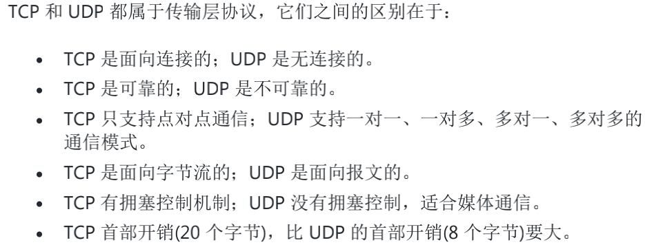
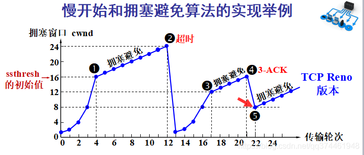
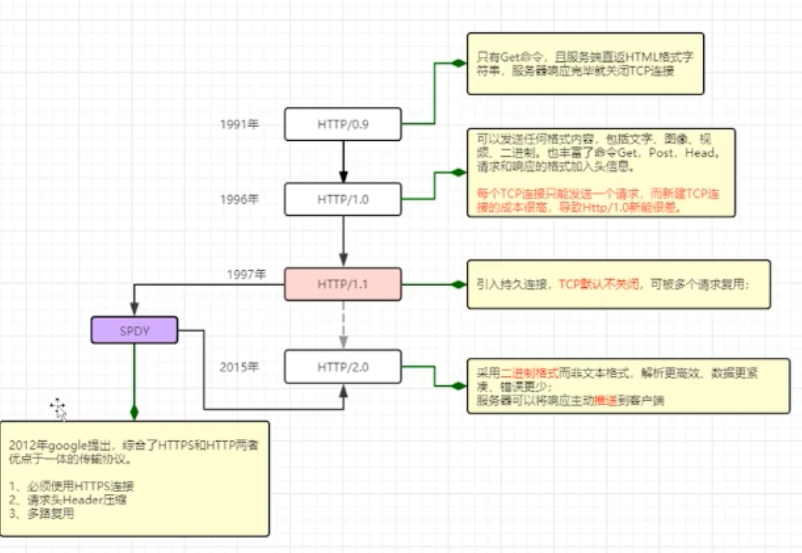
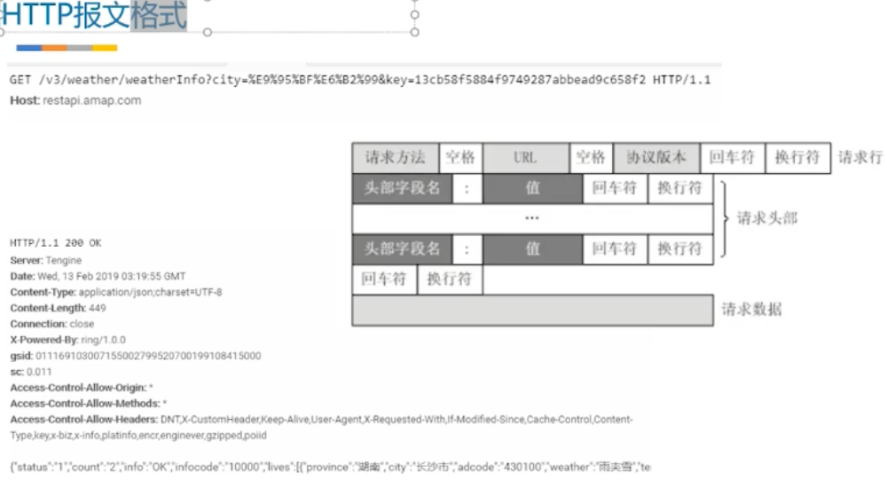
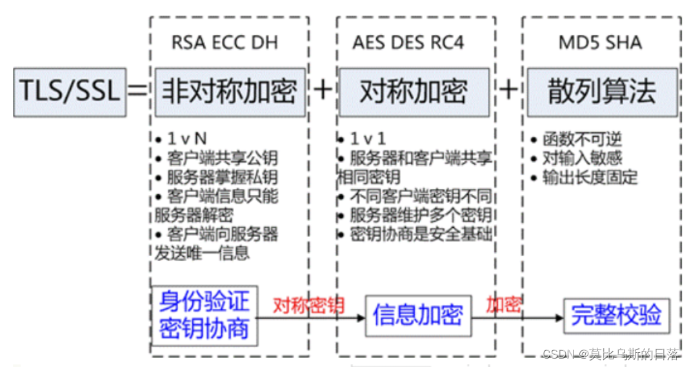
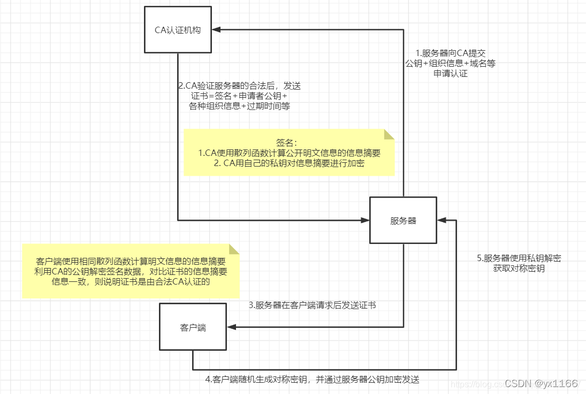
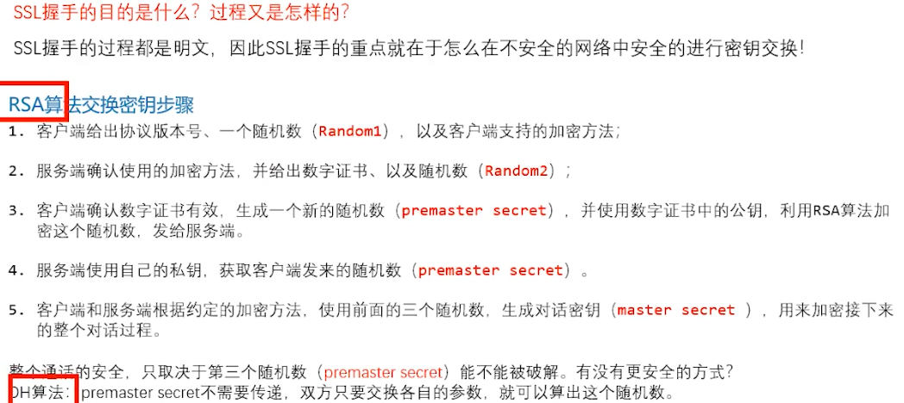
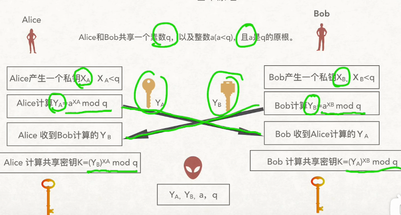
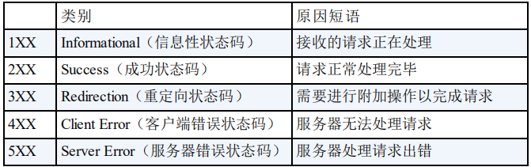

## 1.TCP

#### **1.1 OSI七层模型 TCP/IP 四层模型 **

OSI七层模型	理论模型

TCP/IP 四层模型。基于OSI建立的实际实现的模型

> 应用层：数据，主要服务于应用进程，为用户提供服务。HTTP（80），HTTPS（443），DHCP（分配内网IP），DNS（53），FTP（20传输，21控制；连接），TFTP（69），telnet（23），SSH（网络传输协议）
>
> **SMTP (25)协议只负责邮件的发送，真正负责接收的协议是POP3/IMAP。**
> （应用层：确定进程之间的**通信**；表示层：数据的**加密解密**；会话层：访问**验证方面**的控制）
>
> 传输层：**数据段**，用来进行接收，发送数据，TCP，UDP，NAT（内网IP转为公网IP，网络地址转换）
>
> 网络层：数据包，用来进行**网络寻址**，怎么知道网络的地址，IP，OSPF，ARP（MAC，IP转换）
>
> 网络接口层（数据链路层，物理层)：比特，硬件设备的标准，PPP，HDLC
> （功能是**传输数据的物理媒介**，将数据包从一个设备的网络层传输到另外一个设备的网络层的方法）
>
> 数据链路层主要将**IP 数据报组装成帧**。
> 物理层(physical layer)的作用是实现相邻计算机节点之间**比特流的透明传送**，尽可能屏蔽掉具体传输介质和物理设备的差异。

#### **1.2 TCP为什么是三次握手，为什么不是两次或者四次？（⭐️）**

> 好的，我所理解的三次握手就是因为首先他三次握手是因为什么，客户端要给服务器报告，我要和你建立连接，然后顺便把我自己的一个发送的能力，然后发送给服务器，让服务器知道。然后服务器判断我是否可以给你创建连接，把我的一个接收的能力，返回给客户端。只有2次的话，不能够保证客户端的接收能力是否没问题。只有三次握手才能够保证，双方的发送能力和接受能力都达到了一个我认为协商好的这么一个过程。此时，如果再进行第4次握手就没有必要了。（因为协议没有 100% 可靠的，所以这三次已经够了，如果四次也不能保证是 100% 可靠的）。
>
> 客户端：发送SYN包
> 服务端：接收
> 客户端：接收能力


#### **1.3 TCP为什么是四次挥手？（⭐️）**

> 其实跟TCP三次握手差不多，主要**将TCP的第二次握手分成2次挥手**，把**ACK确认接收报文与FIN释放连接报文**分成2次发送，因为服务端突然收到主动方客户端释放连接的请求时并不能立即释放连接，可能还有必要的数据需要处理。
>
> 客户端：FIN包，说明自己不再向服务器发送数据
> 服务端：ACK，确认收到释放连接
> 服务端：在发送FIN之前，但是**还可以发送数据给客户端**，发送数据，再发FIN
> 客户端：ACK，确认收到释放连接


#### **1.4 四次挥手，为什么客户端在TIME-WAIT阶段要等2MSL?**⭐️

>  为的是确认服务器端是否收到客户端发出的ACK确认报文（TIME_WAIT状态就是**用来重发可能丢失的ACK报文**。）
> MSL指的是Maximum Segment Lifetime：一段TCP报文在传输过程中的**最大生命周期**
> 2MSL即是服务器端发出为FIN报文和客户端发出的ACK确认报文所能保持有效的最大时长。
>
> 如果客户端在2MSL内，**再次收到**了来自服务器端的FIN报文，说明服务器端由于各种原因没有接收到客户端发出的ACK确认报文。客户端再次向服务器端发出ACK确认报文，**计时器重置**，重新开始2MSL的计时；
> 否则客户端在2MSL内没有再次收到来自服务器端的FIN报文，说明服务器端正常接收了ACK确认报文，客户端可以进入CLOSED阶段，完成“四次挥手”。

#### **1.5 第 2 次握手传回了 ACK，为什么还要传回 SYN？**

> 回传 SYN 则是为了**建立并确认从服务端到客户端的通信**。

#### **1.6 网页打开所经历的的过程（⭐️）**

1.使用DNS协议获取**域名对应的IP地址**，得到IP地址后，建立HTTP连接，HTTP会生成一个请求报文
2.接下来到传输层，可以选择UDP或者TCP协议进行数据的传输，NAT（公网IP转内网IP）
3.到了网络层，使用IP协议将IP地址封装成IP数据报，其中，会用到OSPF路由协议来寻找最短路由路径，最后再通过ARP协议确定目标的MAC地址
4.接着到了数据链路层，有了上面的目标MAC地址就可以建立TCP连接，进行通信
5.这样子，服务器就可以响应客户端的请求，将请求的响应信息返回给客户端，浏览器进行页面渲染，展示给客户端
6.通信完成后，释放TCP连接。

```
 访问百度的过程  那么第一步请求dns有什么细节（查找dns缓存）dns层下面有什么细节（dns -> UDP -> IP -> ARP ->以太网-> 物理层）
```

电脑如何判断这个包是不是给自己的

```
（目的mac地址，另外还可以开启混杂模式，监听不属于自己的数据包）
```

io模型

```
阻塞非阻塞，同步异步
```

#### **1.7 TCP与UDP的区别（⭐️）**



​		性能：TCP传输慢，所需资源多；UDP传输快，所需资源少

> UDP（用户数据报协议） 无连接，不可靠的传输层协议，比如： **QQ 语音、 QQ 视频 、直播**等等
>
> TCP  （传输控制协议）面向连接,可靠传输层协议，一般用于**文件传输、发送和接收邮件、远程登录**等场景。

#### UDP如何保证不丢数据？

- 从发送端解决(推荐)

限制发送端的发送速度

- 接收端

​	扩大接收端的缓冲区大小

- 应用层

在应用层实现丢包**重发机制**和**超时机制**，确保数据包不丢失。

#### **1.8 TCP 协议如何保证可靠传输（⭐️）**

（1）应用数据被分割成**TCP认为最适合发送的数据块**。 

**（2）确认应答+序列号**：

接收方收到报文就会确认（累积确认：对所有按序接收的数据的确认）
TCP 给发送的每一个包进行编号，接收方对数据包进行排序，把有序数据传送给应用层。

**（3）校验和：**TCP 将保持它**首部和数据的检验和**。这是一个端到端的检验和，目的是检测数据在传输过程中的任何变化。如果收到段的检验和有差错，TCP 将**丢弃**这个报文段和**不确认收到**此报文段。

（4）TCP 的**接收端会丢弃重复**的数据。

**（5）超时重传：**

当TCP发出一个段后，它启动一个重传**定时器**，等待目的端确认收到这个报文段。如果不能及时收到一个确认，将**重发**这个报文段。

**滑动窗口协议**

> 为了增加网络的吞吐量，将数据包一起发送过去。
>
> 维持发送方/接收方缓冲区
>
> TCP是基于不可靠的网络实现可靠的传输，肯定也会存在掉包的情况。
>
> 缓冲区是 用来解决网络之间数据不可靠的问题，例如丢包，重复包，出错，乱序
>
> 引发的问题：例如丢包，我们又通过重发的机制
>
> https://www.cnblogs.com/coder-programming/p/10627746.html

**（6）流量控制**

TCP连接的每一方都有固定大小的缓冲空间，TCP的接收端只允许发送端发送接收端缓冲区能接纳的数据。当接收方来不及处理发送方的数据，**能提示发送方降低发送的速率**，防止包丢失。
TCP使用的流量控制协议是**可变大小的滑动窗口协议**。

**（7）拥塞控制**

当网络拥塞时，减少数据的发送。

**发送方有拥塞窗口，发送数据前比对接收方发过来的即时窗口，取小**



- 慢开始

用来确定网络的负载能力。
思路：初始拥塞窗口cwnd是以指数级来增长的，**一开始的分组数量比较少(1)**，可以防止过多的分组短时间内传输到网络上导致拥塞。

- 拥塞避免

拥塞避免并不是完全避免拥塞，而是让拥塞来得慢一些。
思路：当拥塞窗口cwnd达到上限ssthresh后，让拥塞窗口cwnd按线性规律缓慢增长，即每次cwnd+1

而线性的增长也迟早会达到拥塞的程度，当网络出现拥塞时（即重传定时器超时）就执行**慢开始算法**
目的是迅速减少分组数，**使得我们有足够时间处理前面积压的分组**。
此时：ssthresh=max(cwnd/2,2)

快重传和快恢复的目的，是为了**防止因为报文段丢失重新进入慢开始的过程**。基本的判断方式：是否连续3次收到对同一个报文的ACK。 当收到3个重复的ACK，意味着我们对同一个报文重传了3次，并且对这3次都进行了确认。但这个时刻并不意味着发生了拥塞，所以要防止重新进入到慢开始阶段。

- 快重传

可以让发送方尽快知道发生了个别报文段的丢失。

由于发送方收到3个重复的ACK，便知道只是**丢失了个别报文段，认为网络很可能没有发生拥塞**，因此不启动慢开始算法，而执行快恢复算法。

- 快恢复

新拥塞窗口cwnd = 慢开始门限ssthresh = 当前拥塞窗口cwnd / 2
开始执行拥塞避免算法，是拥塞窗口cwnd缓慢地线性增大

**（8）ARQ协议**

> **自动重传请求**（Automatic Repeat-reQuest，ARQ）
> 它通过使用**确认和超时这两个机制**，在不可靠服务的基础上实现可靠的信息传输。
>
> 链路层和传输层都用了ARQ

停止等待ARP：每次发送1个分组；连续ARP：每次发送多个分组（回退N帧，选择重传）

#### netty TCP粘包拆包问题

https://www.cnblogs.com/losophy/p/10514866.html

#### **1.9 系统调用和应用编程接口（API）**

API是函数定义，与内核无关；而系统调用时通过中断向内核发出请求完成内核有的服务。

#### **1.10 域名系统-从域名解析出 IP 地址（⭐️）**

> 域名解析过程
> 第一步：客户机提出域名解析请求,并将该请求发**送给本地的域名服务器**。
> 第二步：
> 当本地的域名服务器收到请求后,就**先查询本地的缓存**,如果有该纪录项,则本地的域名服务器就直接把查询的结果返回；
> 如果本地的缓存中没有该纪录,则本地域名服务器就直接**把请求发给根域名服务器**,然后根域名服务器再返回给本地域名服务器一个所查询域(根的子域)的主域名服务器的地址。
> 第四步：本地服务器再向上一步返回的域名服务器发送请求,然后**接受请求的服务器查询自己的缓存**,如果没有该纪录,则返回相关的下级的域名服务器的地址。
> 第五步：重复第四步,直到找到正确的纪录。
> 第六步：本地域名服务器**把返回的结果保存到缓存**,以备下一次使用,同时还**将结果返回给客户机**。

#### 1.11如果已经建立了连接，但是客户端突然出现故障了怎么办？

TCP设有一个**保活计时器**，显然，客户端如果出现故障，服务器不能一直等下去，白白浪费资源。
服务器每收到一次客户端的请求后都会重新复位这个计时器，时间通常是设置**为2小时**，
若两小时还没有收到客户端的任何数据，服务器就会发送一个探测报文段，以后每隔75秒钟发送一次。若一连发送**10个**探测报文仍然没反应，服务器就认为客户端出了故障，接着就关闭连接。

## 2.HTTP

#### **2.1 HTTP的发展史**（⭐️）



> HTTP是**无状态**的超文本传输协议，也就是每个请求都是独立。一方面，这样响应快，更容易做服务的扩容，支撑更大的访问量。
>
> HTTP/0.9 ：只有 HTML 文件传输  确立了客户端请求、服务端响应的通信流程。（GET）
>
> HTTP/1：不同类型文件传输，通过设立**头部字段**。（GET、POST 方法、引入 header）
>
> 从 HTTP/1.1 起，默认使用**长连接**(减少建立和关闭连接的消耗，短连接：发送完数据后立马断开连接)，主要通过缓存策略，Connection:keep-alive，（PUT，DELET），
> 
>HTTP/1.1 中使用持久连接时，**一个连接中同一时刻只能处理一个请求**。当前的请求没有结束之前，其他的请求只能处于阻塞状态，这种情况被称为「队头阻塞」，**并发数有限**
> 2015年，HTTP/2 默认**不再使用 ASCII 编码传输，而是改为二进制数据**，来提升传输效率。HTTP/2 由于采用二进制分帧进行多路复用，通常只使用一个 TCP 连接进行传输，利用一个连接来发送多个请求的方式称为「**多路复用**」
>  
>当然 HTTP/2 也并非完美，如果客户端或服务端在通信时**出现数据包丢失**，或者任何一方的**网络中断**，那么整个 TCP 连接就会暂停。
> 
>HTTP/3：采用UDP协议

#### **2.2 HTTP报文**



> POST 参数有中文，要进行URLEncoder，主要是为了url规范，url规范中中文和很多其他字符不允许出现在url中。而字符的编码就不说URLEncoder所要解决的问题。

GET：对服务器资源的简单请求，把参数包含在**URL**中。

POST：用于**发送包含用户提交数据**的请求，通过**request body**传递。

#### **2.3 服务器怎么知道响应体解析完？**

> 1)Content-length
>
> 2)分块编码chunked（数据量大）
>
> 响应体：
> Apple 你是 谁
> 5\r\n
> Apple
> 2\r\n
> 你是
> 1\r\n
> 谁
> 0\r\n
>
> 当读到0时，服务器就知道解析完了

#### **2.4 SSL握手⭐️**

HTTP在传输数据时，所有传输的内容都是明文，无法保证数据的安全性。
HTTPS：HTTP Over TLS，运行在TLS安全协议上的HTTP。



> HTTPS用到对称加密，非对称加密
>
> - 验证服务器或客户端的身份合法
> - 报文加密
> - 验证数据完整性



1、客户端向服务器发起HTTPS请求，携带客户端SSL/TLS信息，服务器端有一个密钥对，即公钥和私钥，是用来进行非对称加密使用的，服务器端保存着私钥，将公钥下发到客户端。

2、客户端收到服务器端的公钥之后，会对公钥进行检查，验证其合法性，如果发现发现公钥有问题，那么HTTPS传输就无法继续。公钥的验证：在设备中存储了**全球公认的知名CA的公钥**。当客户端接收到**服务器的数字证书**的时候，会通过系统中内置的CA公钥进行解密，如果解密成功说明公钥是有效的，否则就是不受信任的证书。

3、如果公钥合格，那么**客户端会生成一个随机值**，这个随机值就是用于进行**对称加密的密钥**，我们将该密钥称之为client key，即客户端密钥，这样在概念上和服务器端的密钥容易进行区分。然后用**服务器的公钥对客户端密钥进行非对称加密**，这样客户端密钥就变成密文了，至此，**HTTPS中的第一次HTTP请求结束**。

4、客户端会发起HTTPS中的第二个HTTP请求，将加密之后的客户端密钥发送给服务器。

5、服务器接收到客户端发来的密文之后，会用自己的私钥对其进行非对称解密，解密之后的明文就是客户端密钥，然后用客户端密钥对数据进行对称加密，这样数据就变成了密文。

6、然后服务器将加密后的密文发送给客户端。

7、客户端收到服务器发送来的密文，用客户端密钥对其进行对称解密，得到服务器发送的数据。这样HTTPS中的第二个HTTP请求结束，整个HTTPS传输完成。




> 非对称加密：有两个密钥（RSA）。对称加密: 加密和解密的**秘钥**使用的是同一个（DES、AES ）。
> RSA破解：主要在第三个随机数，利用暴力破解可以解密出对应的明文
>
> 非对称：ECDHE:ECC+DH

#### **2.5 DH非对称加密**



**HTTPS的加密方式，以及加密解密的流程？**

HTTP在传输数据时，所有传输的内容都是明文，无法保证数据的安全性。

#### **2.6 状态码**



> `201(已创建)`请求成功并且服务器创建了新的资源。
>  `202(已接受)`服务器已接受请求，但尚未处理。
> 301(永久移动)
> 302(临时移动)
> 400(错误请求)
> 403(禁止)
> 404(未找到)
>
> 500(服务器内部错误)
> 503 - 服务不可用

#### **2.7 HTTP 是无状态的协议,如何保存用户状态?**

> Session 机制的存在就是为了解决这个问题，Session 的主要作用就是通过服务端记录用户的状态。
> 典型的场景是购物车，当你要添加商品到购物车的时候，系统不知道是哪个用户操作的，因为 HTTP 协议是无状态的。**服务端给特定的用户创建特定的 Session 之后就可以标识这个用户并且跟踪这个用户了**（一般情况下，服务器会在一定时间内保存这个 Session，过了时间限制，就会销毁这个 Session）。
>
> 在服务端保存 Session 的方法很多，最常用的就是内存和数据库(比如是使用内存数据库 redis 保存)。既然 Session 存放在服务器端，那么我们如何实现 Session 跟踪呢？大部分情况下，我们都是**通过在 Cookie 中附加一个 Session ID 来方式来跟踪**。

#### **2.8 Cookie 和 Session ，Token的区别？（⭐️）**

> 通过cookie存储一个session_id,然后具体的数据则是保存在session.
> token存在cookie中

Cookie 和 Session 都是实现**对话管理**的方案，但是两者的应用场景不太一样。

- Cookie 数据**保存**在客户端(浏览器端)，Session 数据保存在服务器端（更安全）
- **Session的运行依赖于SessionID，而SessionID存在Cookie**中， Cookie 被禁用，则Session失效，此时**可以在URL参数中传递SeesionID**
- Cookie存在于**客户端的内存**，硬盘；在服务端保存 Session 的方法很多，最常用的就是**内存和数据库**(比如是使用内存数据库 redis 保存)，**文件**

> **Cookie 一般用来保存用户信息。**
>
> 比如 ① 我们在 Cookie 中保存**已经登录过得用户信息**，下次访问网站的时候页面可以自动帮你登录的一些基本信息给填了；② 一般的网站都会有保持登录也就是说下次你再访问网站的时候就**不需要重新登录**了，这是因为用户登录的时候我们可以**存放了一个 Token 在 Cookie中**，下次登录的时候只需要根据 Token 值来查找用户即可(为了安全考虑，重新登录一般要将 Token 重写)；③ **登录一次网站后访问网站其他页面不需要重新登录**。
>
> **Session 的主要作用就是通过服务端记录用户的状态。**
>
> 典型的场景是购物车，当你要添加商品到购物车的时候，系统不知道是哪个用户操作的，因为 HTTP 协议是无状态的。服务端给特定的用户创建特定的 Session 之后就可以标识这个用户并且跟踪这个用户了。

**存在问题？**

下次添加购物车时如果请求打到了 B 或者 C，由于 session是在 A 机器生成的，此时的 B，C 是找不到 session 的，那么就会发生无法添加购物车的错误，就得重新登录了，此时请问该怎么办？

- session 复制：A 生成 session 后复制到 B, C
- session 粘连：让每个客户端请求只打到**固定的一台机器A**上
- session共享：将 **session 保存在 redis**，memcached 等中间件中，请求到来时，各个机器去这些中间件取一下 session，**为了保证 redis 的高可用，必须做集群**。

但是小公司，搞个校验机制我还得搭个 redis 集群？

> **token**的意思是“令牌”，是**服务端生成的一串字符串**，作为客户端进行请求的**一个标识**。
>
> 当用户第一次登录后，服务器生成一个token并将此token返回给客户端，以后客户端只需带上这个token前来请求数据即可，无需再次带上用户名和密码。
>
> 简单token的组成；**uid(用户唯一的身份标识) + time(当前时间的时间戳)= sign（签名，token的前几位以哈希算法压缩成的一定长度的十六进制字符串。为防止token泄露）**
>
> 优点：
>
> 1）**支持跨域访问**: Cookie是不允许垮域访问的，token支持；
>
> 2）更适用于**移动应用**: **Cookie不支持手机端访问的**；
>
> 3）**无状态**： token无状态，session有状态的；
>
> 4）性能: 在网络传输的过程中，**性能更好**；
>
> 5）基于**标准化**：JSON Web Token（JWT） 
>
>  token主要存储有:
>    3.1 存储在**localStorage、sessionStorag**e中，每次调用接口的时候发送给服务端（每次调用接口放在HTTP请求头的Authorization字段里）
>        优点：**可以跨域**
>   	缺点：没有任何安全防御，很容易受到**xss攻击**（简单理解在输入框输入js代码）导致token被盗取，因此要做好xss防御
>    3.2 存储在**cookie**中，可以自动发送给服务端
>        优点：可以指定httponly，来防止xss，也可以指定secure，来保证token只能在HTTPS下传输
>        缺点：不能跨域，而且不符合Restful最佳实践，易受CSRF攻击（简单来说攻击者盗用已经认证过的用户信息，以用户的名义进行一些操作（发邮件、转账等）**CSRF**不能拿到用户信息，他只是盗用用户的凭证去进行操作）

**多数场景上使用 session 会更合理，但如果在单点登录，一次性命令认证上使用 token** 会更合适，最好在不同的业务场景中合理选型，才能达到事半功倍的效果。

**单点登录实现**

> 1. 客户端使用username和pwd进行请求登录
> 2. 服务端收到请求，验证用户名和密码
> 3. 验证通过之后，服务端会签发一个token令牌，（存储到redis 还可以设置有效时间）再把token发送给客户端
> 4. 客户端收到token以后，存储到cookie或者session
> 5. 客户端每次向服务器请求资源都需要带着token，无需带着密码和用户名
> 6. 服务端收到请求，然后去验证客户端请求里的token，如果验证成功，就向客户端返回请求的数据。

####  **2.9 URI 和 URL 的区别是什么?**

- URI(Uniform Resource Identifier) 是**统一资源标志符**，可以唯一标识一个资源。

- URL(Uniform Resource Locator) 是**统一资源定位符**，可以提供该资源的路径。**URL 是一种具体的 URI**

#### **2.10 HTTP 和 HTTPS 的区别？（⭐️）**

HTTP： 是互联网上应用最为广泛的一种网络通信协议，基于TCP，可以使浏览器工 作更为高效，减少网络传输。

HTTPS 是HTTP的加强版，运行在 SSL/TLS 之上的 HTTP 协议。

区别：

**1. 端口** ：HTTP 的 URL 由“http://”起始且默认使用端口80，而HTTPS的URL由“https://”起始且默认使用端口443。

**2. 安全性和资源消耗：** HTTP 协议运行在 TCP 之上，所有传输的内容都是**明文**，客户端和服务器端都无法验证对方的身份。HTTPS 是运行在 SSL/TLS 之上的 HTTP 协议，SSL/TLS 运行在 TCP 之上。所有传输的内容都经过**加密**

**3.费用**：HTTP是免费的， 而**HTTPS需要申请证书**，而证书通常是需要收费的，并且费用一般不低。 

#### HTTP 与 TCP

- TCP是传输层协议，而HTTP是应用层协议。 *TCP*就是单纯建立连接,不涉及任何我们需要请求的实际数据，HTTP负责实际的数据传输
- HTTP是要基于TCP连接基础上的

#### **2.11 转发和重定向的区别？**⭐️

1、重定向至少请求两次，转发请求一次

2、重定向两次请求**不共享数据**，转发一次请求**共享数据**。

3、重定向时**地址栏会发生变化**，而转发时地址栏不会发生变化；

4、重定向是**客户端行为**，转发是服务器端行为；

#### **2.12ETag的含义和作用？**

HTTP1.1中请求头中的一个属性，表示实体标签（类似资源的唯一标志）。主要帮助服务器**控制Web端的缓存验证**。HTTPS 采用对称加密和非对称加密结合的方式来进行通信。

#### **2.13大小端问题**

```
1)大端模式：高字节放在低地址  1234 一致
buf[0] =12 buf[1]=34 	12高字节在低地址
2)小端模式: 低字节放在低地址
```

为什么程序要判定大小端？

```
网络编程，各个平台的CPU实现不一，大部分x86比如intel是小端字节序，而ARM可以手动设置大端还是小端
```

tcp为什么是大端字节序？

```
（和tcp实现有关，tcp是面向字节流，大端收发的顺序更直观）
```

#### 2.14常见的web攻击

- XSS，跨站脚本攻击，允许攻击者将恶意代码植入到提供给**其它用户使用的页面**中

> 对用户的输入(和URL参数)进行xss过滤

- CSRF

CSRF 攻击只是**借用了 Cookie**，并不能获取 Cookie 中的信息，所以不能获取 Cookie 中的 token

> 在请求地址中添加token并验证

- Sql 注入攻击，是通过**将恶意的 Sql查询**或添加语句插入到输入参数中，再在后台 Sql服务器上解析执行进行的攻击

```mysql
select * from user where userid = "" or 1 = 1;

改为
String sql = "select * from user where userid = ?";
Connection conn = null;
PreparedStatement stmt = null;
stmt = conn.prepareStatement(sql);
stmt.setString(1,userid);
```

> 使用PreparedStatement来执行查询,它会将原sql语句进行预先编译，从请求中接受到的userid被视为ui数据，不会产生sql注入。

- ddos：布式拒绝服务攻击

> **部署CDN**；增加服务器数量并采用DNS轮巡或负载均衡技术

- 限制昵称的长度，提交信息数，点赞数，按钮变灰
- 爬虫攻击，验证码，登录验证，通过user-agent来控制访问，限制同一个ip的请求数，设置请求间隔

### 补充

> **差错控制，流量控制：数据链路层，网络层，传输层**
>
> **拥塞控制：网络层，传输层**

#### 设备

1)**中继器**是一种简单的增加局域网传输距离的设备，可使实际的网络跨越更大的距离。它工作在**物理层**。
(多个中继器=集线器，中继器不能连接2个速率不同的局域网，中继器两端的网络部分是网段，不是子网)
2)**网桥**是一种**将两个局域网连接起来**并按MAC（介质访问控制）地址转发帧的设备，工作在**链路层**。（多个网桥=交换机）
3)**路由器**是将不同类型的网络连接起来的设备，主要用来路径选择。它工作在**网络层**。 

#### 接口

o 5)应用层：用户界面

o 4）传输层：端口号

o 3）网络层：IP地址

o 2）数据链路层：MAC地址

o 1）物理层：网卡地址

#### 协议与服务

协议是水平的，服务是垂直的

#### 术语

① 差错控制：使相应层次对等方的通信更加可靠。
② 流量控制：发送端的发送速率必须使接收端来得及接收，不要太快。
③ 分段和重装 ：发送端将要发送的数据块划分为更小的单位，在接收端将其还原。
④ 复用和分用：发送端几个高层会话**复用一条低层的连接，在接收端再进行分用**。
⑤ 连接建立和释放：交换数据前先建立一条逻辑连接，数据传送结束后释放连接。