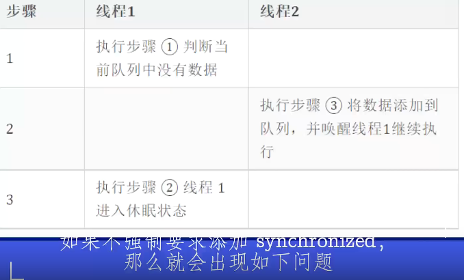

### 系统调用VS函数调用⭐️

> 根据进程访问资源的特点，我们可以把**进程在系统上的运行分为两个级别**：
>
> 1. 用户态(user mode) : 用户态运行的进程可以**直接读取用户程序**的数据。
> 2. 内核态(kernel mode):可以简单的理解系统态运行的进程或程序**几乎可以访问计算机的任何资源**，不受限制。
>
> 我们运行的程序基本都是运行在用户态，如果我们调用操作系统提供的系统态级别的子功能咋办呢？那就需要系统调用了！
>
> 也就是说在我们运行的用户程序中，**凡是与内核态级别的资源有关的操作**（如文件管理、进程控制、内存管理等)，都必须通过系统调用方式向操作系统提出服务请求，并由操作系统代为完成。
>
> 这些**系统调用按功能**大致可分为如下几类：
>
> - 设备管理。完成设备的请求或释放，以及设备启动等功能。
> - 文件管理。完成文件的读、写、创建及删除等功能。
> - 内存管理。完成内存的分配、回收以及获取作业占用内存区大小及地址等功能。
> - 进程控制。完成进程的创建、撤销、阻塞及唤醒等功能。
> - 进程通信。完成进程之间的消息传递或信号传递等功能。

系统调用
1.使用INT和IRET指令，**内核和应用程序使用的是不同的堆栈**，
因此存在堆栈的切换，从**用户态切换到内核态**，从而可以使用特权指令操控设备
2.依赖于**内核**，不保证移植性
3.在用户空间和内核上下文环境间切换，**开销较大**
4.是**操作系统的一个入口点**

函数调用
1.使用CALL和RET指令，调用时没有堆栈切换
2.平台移植性好
3.属于过程调用，调用**开销较小**
4.一个**普通功能函数的调用**

### **CPU是怎么执行程序的？⭐️**

⼀个程序执⾏的时候，CPU 会根据**程序计数器**⾥的内存地址，从对应的内存⾥⾯把需要执⾏的指令读取到**指令寄存器**⾥⾯执⾏，然后根据**指令⻓度⾃增**，开始顺序读取下⼀条指令。
CPU 从程序计数器读取指令、到执⾏、再到下⼀条指令，这个过程会不断循环，直到程序执⾏结束，这个不断循环的过程被称为 CPU 的指令周期。

## （一）进程管理

> 从线程是什么开始，线程和进程的区别，创建线程有几种方式，线程有几种状态，等等。接下来自然就会引出线程池，Lock，Synchronized，JUC的各种并发包。然后就会引出 AQS、CAS、JMM、JVM等偏底层原理，一环扣一环。

### 协程与线程的区别⭐️

> 协程的适用场景 **高并发服务**,如**秒杀系统、高性能API接口、RPC服务器**,使用协程模式,服务的容错率会大大增加,某些接口出现故障时,不会导致整个服务崩溃。性能比线程更好，**但同时也要面临实现调度协程的复杂度**
>
> （纤程本质上是协程）

- 内核调度

线程是任务调度和系统执行的最小单位，需要内核调度；协程是一种**用户态的轻量级线程，不受内核调度**，协程的调度**完全由用户控制**。

- **上下文切换开销**

线程运行状态切换及上下文切换需要内核调度，会消耗系统资源；而协程完全由程序控制，状态切换及**上下文切换不需要内核参与**。

- **运行机制**

线程和进程是同步机制，而协程是**异步**机制。

### 1.1.进程和线程的区别，进程间的通信方式⭐️

Ⅰ 拥有资源
进程是**资源分配**的基本单位，但是线程**不拥有资源**，线程可以访问隶属进程的资源。

Ⅱ 线程调度，进程切换
线程是**独立调度**的基本单位，在同一进程中，线程的切换不会引起进程切换，从一个进程中的线程切换到另一个进程中的线程时，会引起进程切换。

 Ⅲ 创建的系统开销
由于创建或撤销进程时，系统都要为之**分配或回收资源**，如内存空间、I/O 设备等，所付出的开销远大于创建或撤销线程时的开销。
类似地，在进行进程切换时，涉及当前执行进程 **CPU 环境的保存及新调度进程 CPU 环境的设置**，而**线程切换**时只需保存和设置**少量寄存器内容，**开销很小。

Ⅳ 通信方面
线程间可以通过直接**读写同一进程**中的数据进行通信，但是进程通信需要借助IPC的方式，通常有**管道（包括无名管道和命名管道）、消息队列、信号量、共享存储、Socket**等。

> 无名管道：它可以看成是一种**特殊的文件**，对于它的读写也可以使用普通的read、write 等函数。但是它不是普通的文件，**并不属于其他任何文件系统，并且只存在于内存**中。（**父子进程或者兄弟进程**之间，只支持半双工通信）
>
> FIFO，也称为命名管道，它是一种**文件类型**。FIFO可以**在无关的进程之间交换数据**，与无名管道不同。**以一种特殊设备文件形式存在于文件系统中**。全双工
>
> 消息队列，是**消息的链接表**，**存放在内核中**。面向记录的，具有特定的格式以及特定的优先级。独立于发送与接收进程。进程终止时，消息队列及其内容并不会被删除。 **可实现消息的随机查询**，消息可按**先进先出的次序**读取，也可以按**消息的类型**读取。
>
> 信号量：它是一个**计数器**。信号量用于实现进程间的**互斥与同步**，而不是用于存储进程间通信数据。
>
> 共享内存（Shared Memory），指两个或多个进程共享一个给定的存储区。共享内存是**最快的一种 IPC**，因为进程是直接对内存进行存取。因为多个进程可以同时操作，所以需要进行**同步**。信号量+共享内存通常结合在一起使用，信号量用来同步对共享内存的访问。

#### 临界区（Critical Section）、互斥量（Mutex）、信号量（Semaphore）、事件（Event）的区别

1、 临界区：一个访问共用资源的一段代码，**速度快，适合控制数据访问**。在任意时刻只允许一个线程对共享资源进行访问，如果有多个线程试图访 问公共资源，那么在有一个线程进入后，其他试图访问公共资源的线程将被挂起，并一直等到进入临界区的线程离开，临界区在被释放后，其他线程才可以抢占。
2、互斥量：采用**互斥对象机制**。 只有**拥有互斥对象的线程才有访问公共资源的权限**，因为互斥对象只有一个，所以能保证公共资源不会同时被多个线程访问。互斥不仅能实现同一应用程序的公共资源安全共享，还能实现不同应用程序的公共资源安全共享
3、信号量：它**允许多个线程在同一时刻访问同一资源**，但是需要限制在同一时刻访问此资源的最大线程数目
4、事 件： 通过**通知操作的方式**来保持线程的同步，还可以方便实现对多个线程的优先级比较的操作

```
1.以下哪些通信方式是可靠的通讯方式 
1信号2管道3消息4tcp 5udp 6串口I/O
可靠：信号 管道 tcp

2.Unix的启动顺序排序。
(A) Rc.X (B) Rc.sysinit (C) login (D) init
DBAC
```

### 1.2**同一进程间的线程共享和独立的资源**

**共享的资源有**

a. 堆 
由于堆是在进程空间中开辟出来的，所以它是理所当然地被共享的；因此new出来的都是共享的（16位平台上分全局堆和局部堆，局部堆是独享的）
b. 全局变量
它是与具体某一函数无关的，所以也与特定线程无关；因此也是共享的
c. 静态变量
虽然对于局部变量来说，它在代码中是“放”在某一函数中的，但是其存放位置和全局变量一样，存于堆中开辟的.bss和.data段，是共享的
d. 文件等公用资源 
进程打开的文件描述符、信号的处理器、进程的当前目录和进程用户ID与进程组ID，是共享的。

**独享的资源有**

a. 栈
**栈是独享的**。栈是保证线程独立运行所必须的。线程函数可以调用函数，而被调用函数中又是可以层层嵌套的，所以线程必须拥有自己的函数堆栈，使得函数调用可以正常执行，不受其他线程的影响。
b. **寄存器**。这个可能会误解，因为电脑的寄存器是物理的，每个线程去取值难道不一样吗？其实线程里存放的是副本，**包括程序计数器PC**

**一个进程创建的多个线程：每个线程都拥有自己私有的Stack，但共享一个Heap，这样做的原因：**

1、Stack常常用来存放 函数的参数，函数中使用的自动变量，存放过程活动记录；如果多个线程共享一个Stack会非常的凌乱，不方便使用
2、使用共享Heap的目的是为了高效的数据共享
线程间的数据交换有两种方式：
（1）**共享内存**方式sharedmemory（共享堆）：最大的优势是快速
（2）**消息传递**方式messagepassing（不需要共享堆）：优势在于安全

### 线程创建方式⭐️

7种方式，分为4类

- 继承 Thread 类

> 1）创建一个普通类，继承 Thread 类，并重写它的 run 方法。
>
> 2）使用匿名内部类的方式继承Thread并重写run（）
>
> 缺点：因为java为单继承，不能再继承其他类

- 通过实现 Runnable 接口

> 1）创建一个普通类实现 Runnable 接口，并重写 run 方法
>
> 2）使用匿名方式创建 Runnable 实现类，并重写 run 方法
>
> 3）使用**lambda方式**创建匿名Runnable实现类（JDK1.8）
>
> 虽然为java为单继承，但是可以实现多接口

- 实现 Callable 接口，并结合 FutureTask实现

  ```
  首先定义一个 Callable 的实现类，并实现 call 方法。call 方法是带返回值的。
  然后通过 FutureTask 的构造方法，把这个 Callable 实现类传进去，得到FutureTask对象t
  把 FutureTask对象 作为 Thread 类的 target ，创建 Thread 线程对象。
  通过 FutureTask对象 的 get 方法获取线程的执行结果。
  ```

  ```java
  public class CallableThreadTest implements Callable<Integer> {
  @Override
  public Integer call() throws Exception
  {
      int i = 0;
      for(;i<100;i++)
      {
      	System.out.println(Thread.currentThread().getName()+" "+i);
      }
      return i;
  }
  public static void main(String[] args) throws ExecutionException, InterruptedException {
      FutureTask<Integer> ft = new FutureTask<>(new CallableThreadTest());
      for(int i = 0;i < 100;i++)
      {
     	 	System.out.println(Thread.currentThread().getName()+" 的循环变量i的值"+i);
      	if(i==20)
          {
              new Thread(ft).start();
          }
     }
  
      System.out.println("子线程的返回值："+ft.get());
  
      }
  }
  ```

-  通过线程池创建线程

  ```
  用 JDK 自带的 Executors 来创建线程池对象。
      首先，定一个 Runnable 的实现类，重写 run 方法
      然后创建一个拥有固定线程数的线程池service。
      最后将线程对象传入service 对象的 execute 方法。
  ```

```java
public class demo45 {
    public static void main(String[] args) {

        //创建固定个数的线程池
        ExecutorService service = Executors.newFixedThreadPool(10);

        for(int i =0;i<2;i++){
            //执行任务
            service.execute(new Runnable() {
                @Override
                public void run() {
                    System.out.println("线程名:" +Thread.currentThread().getName());
                    //说明是使用线程池来创建线程
                }
            });
        }

    }
}

```

### 中断线程

- 自定义中断标识符

> 在程序中，定义一个变量来决定线程是否要中断执行，问题：线程**中断的不够及时**，线程运行时不能够判断while（！标志符）是否中断线程，它只能在下一轮运行时，判断是否要终止当前线程

- 使用线程中断方法interrupt（**最推荐**）

> 有个好处：比如线程执行步骤1之后，发送一个中断线程的指令，并不直接中断线程，而是发送一个中断线程的信号，不要继续执行步骤2了。它**能够及时中断线程**

- 使用stop方法（不推荐，**会直接暴力停止线程**，这样就没有给线程时间来处理停止前的数据保存工作，会造成数据不完整的问题，此方法已经废弃了）

### 进程的生命周期⭐️


### 线程生命周期⭐️


1. **新建(NEW)**：新创建了一个线程对象。
2. **可运行(RUNNABLE)**：线程对象创建后，其他线程(比如main线程）**调用了该对象的start()方法**。该状态的线程位于可运行线程池中，等待被线程调度选中，获取cpu 的使用权 。
3. **运行(RUNNING)**：可运行状态(runnable)的线程获得了cpu 时间片（timeslice） ，执行程序代码。
4. **阻塞(BLOCKED)**：阻塞状态是指线程因为某种原因**放弃了cpu 使用权**，也即让出了cpu timeslice，暂时停止运行。直到线程进入可运行(runnable)状态，才有机会再次获得cpu timeslice 转到运行(running)状态。阻塞的情况分三种： 

> (一). 等待阻塞：运行(running)的线程执行**o.wait()方法**，JVM会把该线程放入等待队列(waitting queue)中，直到**被其他线程调用notify，或者nootifyAll**才能转入可运行(runnable)状态。 
> (二). 同步阻塞：运行(running)的线程在**获取对象的同步锁**时，若该同步锁被别的线程占用，则JVM会把该线程放入锁池(lock pool)中，**直到竞争到锁**才能转入可运行(runnable)状态。 
> (三). 其他阻塞：运行(running)的线程执行Thread.sleep(long  ms)或t.join()方法，或者发出了I/O请求时，JVM会把该线程置为阻塞状态。当**sleep()完成、join()等待线程终止、或者I/O处理**完毕时，线程重新转入可运行(runnable)状态。 

5. **死亡(DEAD)**：线程run()、main() 方法执行结束，或者因异常退出了run()方法，则该线程结束生命周期。死亡的线程不可再次复生。

#### Runnable与Callable⭐️

1）Runnable提供**run**方法无法声明成throws，只能捕获异常。Callable提供**call**方法，**直接抛出Exception异常**。

> 为什么只能捕获异常(try catch)而不能抛出异常(throws)?
>
> 因为run()方法是Runnable接口里面的方法,而Runnable接口在定义run()方法的时候没有抛出任何异常，所以**子类在重写run()方法**的时候要小于或等于父类(Runnable)的run()方法的异常,所以父类没有抛出异常,子类不能抛出异常

2）Runnable的run方法无返回值，Callable的call方法**提供返回值**用来表示任务运行的结果

3）Runnable可以作为Thread构造器的参数，通过开启新的线程来执行，也可以通过线程池来执行。而Callable**只能通过线程池**执行。

##### 如何统一 Callable *和* Runnable？

FutureTask 出现了，FutureTask 实现了 RunnableFuture 接口，又集合了 Callable（Callable 是 FutureTask 的属性），还提供了两者一系列的转化方法，这样 FutureTask 就统一了 Callable 和 Runnable。

> Future和FutureTask均可以用来**获取任务执行结果**，不过Future是个接口，FutureTask是Future的具体实现。

#### **Thread 和Runable的区别⭐️**

Thread（类）和Runnable（接口）的实质是继承关系，没有可比性。无论使用Runnable还是Thread，都会new Thread，然后执行run方法。用法上，如果有复杂的线程操作需求，那就选择继承Thread，如果只是简单的执行一个任务，那就实现Runnable。Thread在Runnable做了扩展。

#### **start 与 run**⭐️

- start 方法，是**启动一个线程**并将线程的状态设置为**就绪(可运行)状态**；Run（）不能启动一个新线程；

- start 方法是创建新线程来执行任务，**只能调用一次**，因为线程只能被创建一次（多次调用报java.lang.IllegalThreadStateException）；run 方法是普通方法，而普通方法是可以被多次调用的。

  start方法实现了**多线程**；而run（）没有

- start中的**run代码可以不执行完就继续执行下面的代码**，即进行了**线程切换**；run必须等待其代码全部执行完才能继续执行下面的代码。

#### **notify和nitifyall⭐️**

notify()只能唤醒一个wait()线程

> **唤醒线程的规则时随机唤醒还是顺序唤醒，取决于JVM厂商**，作为主流的HotSpot虚拟机中的notify的唤醒规则是**顺序的**，也就是notify会按线程的休眠顺序，依次唤醒

然而notifyAll()可以唤醒所有wait()线程; 

#### **wait，notify必须要与sychronized配合使用⭐️**

> JVM在运行时会强制检查wait和notify有没有在sychronized代码中，没有的话会抛非法监视器状态异常（IllegalMonitionstateException），为什么这么设计？
>
> 防止多线程并发运行时，程序运行的混乱问题。



> 线程1已经进入休眠状态，导致阻塞队列中的那条数据永久性不能被读取
>
> 加锁sychronized，保证线程1的步骤1，2一起执行


#### 三个版本的等待唤醒⭐️

-  **Object的wait/notify**
   这种做法的局限性:两者必须**在synchronized方法/同步块中执行**.wait和notify的顺序必须严格执行.如果先notify再wait,那么会无限制等待下去.
-  **Condition的await和signal**
   这种做法的局限性:**必须和lock/unlock之间使用**.同时也必须先await在signal.否则await会无限制等下去(不设置时间的.).

**这两种情况都有两个约束:1.先持有锁.2.先等待再唤醒.**

-  **LockSupport的park和unpark**
   这两个方法底层调用的unsafe类，（unsafe类提供了硬件级别的的原子性操作，直接操作内存，Unsafe可以通过反射机制来获取。）

#### sleep()、wait()、join()、yield()的区别⭐️

1.锁池 

所有需要竞争同步锁的线程都会放在锁池当中，比如当前对象的锁已经被其中一个线程得到，则其他线 程需要在这个锁池进行等待，当前面的线程释放同步锁后，锁池中的线程去竞争同步锁，当某个线程得到后会进入就绪队列进行等待cpu资源分配。 

2.等待池 

当我们调用wait（）方法后，线程会放到等待池当中，**等待池的线程是不会去竞争同步锁**。只有调用了 notify（）或notifyAll()后等待池的线程才会开始去竞争锁，**notify（）是顺序地从等待池选出一个线程放到锁池，而notifyAll()是将等待池的所有线程放到锁池当中**

1、sleep 是 Thread 类的静态本地方法，wait 则是 **Object 类的本地方法**。 

2、sleep方法不依赖于同步器synchronized，但是wait需要**依赖synchronized关键字。** 

3、sleep不需要被唤醒（休眠之后推出阻塞），但是wait**需要唤醒（不指定时间，需要被别人中断）。**

4、sleep方法不会释放lock，但是wait**让出锁资源和cpu资源，而且会加入到等待队列中**。 

```
sleep就是把cpu的执行资格和执行权释放出去，不再运行此线程，当定时时间结束再取回cpu资源，参与cpu 的调度，获取到cpu资源后就可以继续运行了。而如果sleep时该线程有锁，那么sleep不会释放这个锁，而 是把锁带着进入了冻结状态，也就是说其他需要这个锁的线程根本不可能获取到这个锁。也就是说无法执行程 序。如果在睡眠期间其他线程调用了这个线程的interrupt方法，那么这个线程也会抛出 interruptexception异常返回，这点和wait是一样的。 
```

5、sleep 会**让出 CPU 执行时间且强制上下文切换**，而 wait 则不一定，wait 后可能还是**有机会重新竞争到锁继续执行**的。

6、sleep 一般**用于当前线程休眠**，或者轮循暂停操作，wait 则多用于**多线程之间的通信。** 


yield（）执行后线程**直接进入就绪状态**，马上**释放了cpu的执行权**，但是**依然保留了cpu的执行资格**， 所以有可能cpu下次进行线程调度还会让这个线程获取到执行权继续执行 

join（）执行后线程**进入阻塞状态**，例如在线程B中调用线程A的join（），那线程B会进入到阻塞队列，直到线程A结束或中断线程 

```Java
public static void main(String[] args) throws InterruptedException { 
  Thread t1 = new Thread(new Runnable() { 
    @Override 
    public void run() { 
      try {Thread.sleep(3000); } 
      catch (InterruptedException e) {
        e.printStackTrace(); 
      }
      System.out.println("22222222"); 
    } 
  }); 
  t1.start(); 
  t1.join(); // 这行代码必须要等t1全部执行完毕，才会执行 
  System.out.println("1111"); 
}
22222222 
1111
```

### 1.3同步

#### **进程同步方法**

1.**信号量**，用P、V原语
2.**管程**：是由一个或多个过程、一个初始化序列和局部数据组成的软件模块。
在任何时候，只能有一个进程在管程中执行，调用管程的任何其他进程都被阻塞，以等待管程可用。
3.**消息传递**：通过一对原语
send(destination,message)
receive(source,message)

**同步机制需要遵循的原则：**

1. 空闲让进：当没有进程处于临界区的时候，应该许可其他进程进入临界区的申请
2. 忙则等待：当前如果有进程处于临界区，如果有其他进程申请进入，则必须等待，保证对临界区的互斥访问
3. 有限等待：要求访问临界资源的进程，需要在有限时间内进入临界区，防止出现死等
4. 让权等待：当进程无法进入临界区的时候，需要释放CPU，边陷入忙等

#### **线程同步方法**

1. **互斥量(Mutex)**：采用互斥对象机制，**只有拥有互斥对象的线程才有访问公共资源的权限**。因为互斥对象只有一个，所以可以保证公共资源不会被多个线程同时访问。比如 Java 中的 synchronized 关键词和各种 Lock 都是这种机制。
2. **信号量(Semaphore)** ：它**允许同一时刻多个线程访问同一资源**，但是需要控制同一时刻访问此资源的**最大线程数量**。
3. **事件(Event)** :Wait/Notify：通过**通知操作**的方式来保持多线程同步，还可以方便的实现多线程优先级的比较操作。

#### 经典的进程同步问题

##### 哲学家进餐问题

> 在某一时刻，所有的哲学家都获取到了左手边的筷子，而无法获取到右手边的筷子，导致没有人可以吃到东西，陷入僵局。

**方法一：限制吃饭的哲学家人数**，信号量

很简单的一种方法，就是在一个时间点，只能有最多4个哲学家开始吃饭。4个哲学家分5只筷子，则永远不会发生死锁。要实现这种方法，我们可以再定义一个许可数为4的信号量`Semaphore`，表示剩余可以吃饭的哲学家名额。

**方法二：使用AND型信号量，同时判断左右的筷子**

**方法三：奇数拿左边筷子，偶数拿右边筷子；或者找一个左撇子哲学家**

##### 生产者-消费者问题

方法1：信号量

可利用互斥信号量mutex实现诸进程对缓冲池的互斥使用；
 利用信号量empty和full分别表示缓冲池**空闲资源数**和满缓冲池**已经使用**的资源数

对于producer程序而言，wait（empty）看缓冲区是否还有存储空间，wait（mutex）则是用来申请缓冲区资源，进行consume的操作之后再解锁并唤醒其他可用阻塞线程。

##### 读者-写者问题

方法1信号量

互斥信号量wrmutex：实现reader与writer进程间在读或写时的互斥，整型变量readcount：表示正在读的进程数目； 互斥信号量rrmutex：reader进程间互斥访问readcount。

由于只要有一个reader进程在读，便不允许writer进程写。所以，仅当readcount=0，即无reader进程在读时，reader才需要执行wait操作。若wait（wmutex）操作成功，reader进程便可去读，相应地，做readcount+1操作。
同理，仅当reader进程在执行了readcount**减1操作后**其值为0时，才需执行signal（wmutex）操作，以便让write进程写。

### 1.4进程的调度算法⭐️

- **先到先服务(FCFS)调度算法** : 从就绪队列中选择一个最先进入该队列的进程为之分配资源，使它立即执行并一直执行到完成或发生某事件而被阻塞放弃占用 CPU 时再重新调度。

> 对短作业不利，排在长作业后面的短作业需要等待很长时间

- **短作业优先(SJF)的调度算法**: 从就绪队列中选出一个**估计运行时间最短**的进程为之分配资源，使它立即执行并一直执行到完成或发生某事件而被阻塞放弃占用 CPU 时再重新调度。

> 对长作业不利，长作业有可能会饿死

- **时间片轮转调度算法** : 时间片轮转调度是一种最古老，**最简单，最公平且使用最广**的算法，又称 RR(Round robin)调度。**每个进程被分配一个时间段**，称作它的时间片，即该进程允许运行的时间。

> 时间片的长度是一个很关键的因素:
>
> 1）设置得**太短**，就会导致**频繁**的进程上下文切换，降低了 CPU 效率；
>
> 2）时间片**设置得太长**，甚至时间片大到让进程足以完成其所有任务，RR 调度算法便退化成 **FCFS 算法**。

- **优先级调度** ： 为每个流程分配优先级，首先执行具有最高优先级的进程，依此类推。**具有相同优先级的进程以 FCFS 方式执行**。可以根据**内存要求，时间要求或高响应比，任何其他资源要求**来确定优先级。

> 可以处理一些比较紧急的任务；但是也可能会让**某个低优先级进程无穷等待** CPU，饥饿

- **多级反馈队列调度算法** ：**先来先服务**原则给就绪队列排序，为就绪队列赋予**不同的优先级数，不同的时间片**，按照**优先级抢占CPU**的调度算法。
  多级反馈队列调度算法既能使高优先级的作业得到响应又能使短作业（进程）迅速完成，因而它是目前**被公认的一种较好的进程调度算法**，UNIX 操作系统采取的便是这种调度算法。

### 2.什么是时间片

时间片即CPU分配给各个程序的时间，每个进程被分配一个时间段，称作它的时间片，即该进程允许运行的时间，使各个程序从表面上看是同时进行的。
如果在时间片结束时进程还在运行，则CPU将被剥夺并分配给另一个进程。
如果进程在时间片结束前阻塞或结束，则CPU当即进行切换，而不会造成CPU资源浪费。
在宏观上：我们可以同时打开多个应用程序，每个程序并行。
但在微观上：由于只有一个CPU，一次只能处理程序要求的一部分，如何处理公平，一种方法就是引入时间片，每个程序轮流执行。

举例
你同时输入两篇文档：A.txt和B.txt；
你在A中输入一个字之后，再在B中输入一个字，轮流输入，直至完成。总的看来你似乎在同时进行两篇文章的录入，你可以说我一边写A一边写B。但是具体到某个字时，就是沿着时间的前进，AB交替进行了。而你每个字输入所占用的这段时间，我们就可以称之为时间片。

### 3悲观锁和乐观锁

  **悲观锁**（Pessimistic Lock）：  每次拿数据的时候都会担心会被别人修改（疑心重很悲观），所以每次在拿数据的时候都会上锁。确保自己使用的过程中不会被别人修改。

  **乐观锁**（Optimistic Lock）：  每次拿数据的时候都完全不担心会被别人修改（心态好很乐观），所以每次在拿数据的时候都不会上锁。但是在更新数据的时候去判断该期间是否被别人修改过（**使用版本号等机制**），期间该数据可以随便被其他人读取。

  **两种锁各有优缺点，不能单纯的定义哪个好于哪个。乐观锁比较适合数据修改比较少，读取比较频繁的场景，即使出现了少量的冲突，这样也省去了大量的锁的开销，故而提高了系统的吞吐量。但是如果经常发生冲突（写数据比较多的情况下），上层应用不不断的retry，这样反而降低了性能，对于这种情况使用悲观锁就更合适。**

### 4.僵尸进程和孤儿进程的危害

#### 孤儿进程

一个父进程退出，而它的一个或多个子进程还在运行，那么那些子进程将成为孤儿进程。孤儿进程将被init进程(**进程号为1**)所收养，并由init进程对它们完成状态收集工作，因此**孤儿进程并没有什么危害**。

#### 僵尸进程⭐️

*僵尸进程*是当**子进程比父进程先结束**，而**父进程又没有回收子进程**，释放子进程占用的资源，此时子进程将成为一个*僵尸进程*。

另外，**如果该进程的父进程已经先结束了，那么该进程就不会变成僵尸进程**。 因为每个进程结束的时候，系统都会扫描当前系统中所运行的所有进程， 看有没有哪个进程是刚刚结束的这个进程的子进程，如果是的话，就由Init 来接管子进程，成为子进程的父进程。

**危害**

unix提供了**一种机制保证父进程知道子进程结束时的状态信息**。

这种机制是：在每个进程退出的时候，内核会释放所有的资源，包括打开的文件，占用的内存等，但是仍保留一部分信息(进程号PID，退出状态，运行时间等)，**直到父进程通过wait或waitpid时才释放**。

但是这样就会产生问题：如果父进程不调用wait或waitpid的话，那么保留的信息就不会被释放，其进程号就会被一直占用，但是系统所能使用的进程号是有限的，如果大量产生僵死进程，将**因没有可用的进程号而导致系统无法产生新的进程**，这就是**僵尸进程的危害**

补充：任何一个子进程(init除外)在exit()之后，并非马上就消失掉，而是留下一个称为僵尸进程的数据结构，等待父进程去处理。如果父进程在子进程exit()之后，没有及时处理，出现僵尸进程，并可以用ps命令去查看，它的状态是'Z'或者'z'

> ps -A -ostat,ppid,pid,cmd |[grep](https://so.csdn.net/so/search?q=grep&spm=1001.2101.3001.7020) -e '^[Zz]'

#### 守护进程

守护进程(daemon)是一类在后台运行的特殊进程，用于执行特定的系统任务，没有控制终端，**专门为其他进程服务**。
Linux的大多数服务器就是用守护进程的方式实现的。如web服务器进程http，Windows中的系统服务等。

#### 异步IO和同步IO有什么区别?举例说明有几种

同步就是在一个功能调用时,在没有得到结果之前,该调用就不返回。也就是一件一件事做,等前一件做完了才做下一件事。
异步：在一个功能调用时，不等结果,调用后立即返回。

#### 同步和异步，阻塞和非阻塞区别

（前者：是否导致阻塞；后者：进程是否进入睡眠）

### 中断⭐️

中断指处理机处理程序运行中出现的紧急事件的整个过程.程序运行过程中，系统外部、系统内部或者现行程序本身若出现紧急事件，处理机立即中止现行程序的运行，自动转入相应的处理程序(中断服务程序)，待处理完后，再返回原来的程序运行，这整个过程称为程序中断。

**CPU要做的事情：**

改变工作模式至中断模式

保存现场

分析中断原因，跳到中断起始地址处理中断

返回到原来模式

恢复现场继续执行原来的程序。

**线程中断方式**

- 自定义中断标识符

> 在程序中，定义一个变量来决定线程是否要中断执行，问题：线程**中断的不够及时**，线程运行时不能够判断while（！标志符）是否中断线程，它只能在下一轮运行时，判断是否要终止当前线程

- 使用线程中断方法interrupt（**最推荐**）

> 有个好处：比如线程执行步骤1之后，发送一个中断线程的指令，并不直接中断线程，而是发送一个中断线程的信号，不要继续执行步骤2了。它**能够及时中断线程**

- 使用stop方法（不推荐，**会直接暴力停止线程**，这样就没有给线程时间来处理停止前的数据保存工作，会造成数据不完整的问题，此方法已经废弃了）

临界资源：临界资源是**一次仅允许一个进程使用的共享资源**。

临界区：每个进程中访问临界资源的那段代码称为临界区（criticalsection）

原子性：原子性是指一个操作是不可中断的，要么全部执行成功要么全部执行失败。

### Socket连接过程

服务器建立监听：客户端初始化Socket动态库后创建套接字，然后指定客户端Socket的地址，循环绑定Socket直至成功，然后开始建立监听，此时客户端处于等待状态，实时监控网络状态；

客户端提出请求：客户端的Socket向服务器端提出连接请求，此时客户端描述出它所要连接的Socket，指出要连接的Socket的相关属性，然后向服务器端Socket提出请求；

(客户端)连接确认并建立：当服务器端套接字监听到来自客户端的连接请求之后，立即响应请求并建立一个新进程，然后将服务器端的套接字的描述反馈给客户端，由客户端确认之后连接就建立成功，然后客户端和服务器两端之间可以相互通信，传输数据，此时服务器端的套接字继续等待监听来自其他客户端的请求；

**linux信号有哪些**

```
（中断 终止信号 abort、堆栈、段错误，闹钟， kill - 9 pid  杀死进程） 
```

### 关于 CPU 飙高，系统反应慢，怎么排查这个问题⭐️


> 再用Jprofiler，1）查看最大对象；2）查看ThreadDump，查看哪一行代码有问题。

我从四个方面来回答。首先， CPU 是整个电脑的核心计算资源。对于一个应用程序来说，CPU的最小执行单元是线程。导致 CPU 飙高的原因有几个方面，第一个是 CPU 的上下文切换过多。对于 CPU 来说，同一个时刻下，每个 CPU 核心只能运行一个线程，如果有多个线程要去被执行怎么办呢？ CPU 只能通过上下文切换的方式来执行调度不同的线程。
上下文切换需要做两个事情，第一个是保存运行中线程的执行状态。第二个让处于等待中的线程恢复执行。这两个过程需要 CPU 执行内核相关指令去实现状态的保存和恢复。如果较多的上下文切换会占据大量的 CPU 资源，从而使得 CPU 无法去执行用户进程中的真正指令，导致响应速度下降。在 Java 中文件 IO ，网络 IO ，锁等待，这些都会去造成线程阻塞，而线程阻塞就会去导致 CPU 的上下文切换。

> 减少上下文切换？
>
>  无锁并发编程：就是多线程竞争锁时，会引起上下文切换，多线程处理数据时，可以用一 些办法来避免使用锁，如将数据的ID按照Hash算法取模分段，不同的线程处理不同段的数据。
>
>  CAS算法：Java的Atomic包使用CAS算法来更新数据，就是它在没有锁的状态下，可以保证多个线程对一个值的更新。
>
> 使用最少线程：避免创建不需要的线程。
>
> 协程：轻量级的线程，不需内核调度，在单线程里实现多任务的调度，并在单线程里维持多个任务间的切换。

第二， CPU 资源过渡消耗。也就是在程序中创建了大量的线程或者有线程一直占据CPU 资源无法被释放。比如说像死循环 CPU 利用率过高之后，导致应用程序中的线程无法去获得 CPU 的调度，从而影响程序的执行效率。

所以既然是这两个问题导致 CPU 利用率较高，于是我们可以通过 top 命令找到 CPU 利用率较高的进程，再通过 shift + H 找到进程中 CPU 消耗过高的线程。
这里有两种情况。第二种情况，CPU利用率过高的线程一直是同一个，也就是线程 ID 没有变化，说明在程序中存在长期占用，CPU没有释放的一个情况。那么这种情况直接可以通过 jstack 获得线程的 dump 日志，定位到线程日志后就可以找到问题的代码。第二个是 CPU 利用率过高的线程 ID 一直在不断变化。那么说明线程创建过多，需要去挑选几个线程 ID 通过 jstack 去线程dump中去进行排查。最后有可能定位的结果是程序正常，只是在 CPU 飙高的那一刻，用户访问量非常大，导致系统资源不够。那么这个时候我们需要采取的手段是去增加系统资源。

### 电脑死机后在干嘛？

**1、中断确实拿它没办法**

CPU正在执行程序，突然发生了一个中断事件。CPU保存好当前执行的上下文，转头去处理这个中断事件，但刚处理到一半儿，这时又有一个新的中断事件来了，那CPU怎么办？要不要响应？

所以中断也有优先级之分，低优先级的中断无法打断高优先级的中断。

因为在处理中断的时候，CPU运行在一个很高的优先级上，一般的中断是无法把执行权抢过去的，这就导致这颗CPU核心成为了“植物人”，怎么叫它都没反应了。

**2、中断能抢到CPU，但发现没有线程可以调度**

比如在Windows操作系统内核中，就有大量的全局性的锁，一个不小心造成死锁，其他想要的线程都得进入等待队列，那就凉凉了。

## （二）内存管理

### 1 概念

操作系统的内存管理主要负责内存的分配与回收（malloc 函数：申请内存，free 函数：释放内存），另外地址转换也就是将逻辑地址转换成相应的物理地址等功能

### 2 内存管理机制⭐️

简单分为**连续分配管理方式**和**非连续分配管理方式**这两种。连续分配管理方式是指为一个用户程序分配一个连续的内存空间，常见的如 **块式管理** 。同样地，非连续分配管理方式允许一个程序使用的内存分布在**离散**或者说不相邻的内存中，常见的如**页式管理** 和 **段式管理**。

1. **块式管理**  ：  远古时代的计算机操作系统的内存管理方式。将内存分为几个固定大小的块，**每个块中只包含一个进程**。如果程序运行需要内存的话，操作系统就分配给它一块，如果程序运行只需要很小的空间的话，分配的这块内存很大一部分几乎被浪费了。**这些在每个块中未被利用的空间（已分配出去的），我们称之为碎片**。**内存碎片**
2. **页式管理** ：把主存分为大小相等且固定的一页一页的形式，页较小，相比于块式管理的划分粒度更小，**提高了内存利用率，减少了碎片**。页式管理通过页表对应逻辑地址和物理地址。缺点：**最后一页内存碎片**；需要硬件支持（缺页中断）
3. **段式管理**  ： 页式管理虽然提高了内存利用率，但是页式管理其中的页并无任何实际意义。  段式管理把主存分为一段段的**，段是有实际意义的，每个段定义了一组逻辑信息**，例如,有主程序段 MAIN、子程序段 X、数据段 D 及栈段 S 等。  段式管理通过**段表对应逻辑地址和物理地址**。缺点：会产生**外部碎片**；**进程必须全部装入内存**。

> **共同点** ：
>
> - 分页机制和分段机制都是为了**提高内存利用率**，减少内存碎片。
> - 页和段都是**离散存储**的，所以两者都是离散分配内存的方式。但是，每个页和段中的内存是连续的。
>
> **区别** ： 
>
> - 页的大小是固定的，由系统决定；段位的大小是不确定的，由用户决定。
>
> - 分页可以有效提高内存利用率；分段可以更好满足用户需求。

4. **段页式管理机制**结合了段式管理和页式管理的优点。简单来说段页式管理机制就是把**主存先分成若干段，每个段又分成若干页**，也就是说 **段页式管理机制** 中段与段之间以及段的内部的**都是离散的**。

   

> 内部碎片：是已经被分配出去，却不能完全被利用的内存空间
>
> 外部碎片：还没有被分配出去（不属于任何进程），但**由于太小了无法分配**

### 3 快表和多级页表⭐️

在**分页内存管理**中，很重要的两点是：

1. 虚拟地址到物理地址的转换要快。
2. 解决**虚拟地址空间大，页表也会很大**的问题。

#### 快表

**为了提高虚拟地址到物理地址的转换速度**。我们可以把快表理解为一种特殊的高速缓冲存储器（Cache），其中的内容是页表的一部分或者全部内容。作为页表的  Cache，它的作用与页表相似，但是提高了访问速率。由于采用**页表**做地址转换，读写内存数据时 CPU  要**访问两次主存**。有了快表，**有时只要访问一次高速缓冲存储器，一次主存**，这样可加速查找并提高指令执行速度。

地址转换流程：

1. 根据虚拟地址中的页号查快表；
2. 如果该页在快表中，直接从快表中读取相应的物理地址；
3. 如果该页不在快表中，就访问内存中的页表，再从页表中得到物理地址，同时将页表中的该映射表项添加到快表中；
4. 当快表填满后，又要登记新页时，就按照一定的淘汰策略淘汰掉快表中的一个页。

#### **多级页表**

> 多级页表，有点像查一级目录，二级目录的感觉

引入多级页表的主要目的是为了**避免把全部页表一直放在内存中占用过多空间**，特别是那些根本就不需要的页表就不需要保留在内存中。多级页表属于**时间换空间的典型场景**。

总结：为了提高内存的空间性能，提出了多级页表的概念；但是提到空间性能是以浪费时间性能为基础的，因此为了补充损失的时间性能，提出了快表（即 TLB）的概念。 不论是快表还是多级页表实际上都利用到了程序的局部性原理。

#### 逻辑地址VS**物理地址**

我们编程一般只有可能和逻辑地址打交道，比如在 C 语言中，指针里面存储的数值就可以理解成为内存里的一个地址，这个地址也就是我们说的逻辑地址，逻辑地址由操作系统决定。

### 4 CPU 寻址了解吗?为什么需要虚拟地址空间?⭐️

**使用虚拟寻址，CPU 需要将虚拟地址翻译成物理地址，这样才能访问到真实的物理内存。** 实际上完成虚拟地址转换为物理地址转换的硬件是 CPU 中含有一个被称为 **内存管理单元（Memory Management Unit, MMU）** 的硬件。

1）CPU由运算器、控制器、寄存器等器件组成，这些器件靠内部总线相连

2）寄存器是CPU的组成部分，用来暂存**指令、数据和地址**，CPU对其读写速度是最快的，不需要IO传输

**寻址方式**

- 立即寻址：不在寄存器中，也不在内存区，而是**直接给出的一个具体数**
- 直接寻址：**内存**寻址，操作数给出的作为地址
- 寄存器寻址：直接从寄存器中拿数据
- 寄存器间接寻址：
- 寄存器相对寻址：
- 基址变址寻址：
- 相对基址变址寻址：

> 为什么需要这么多寻址方式？寄存器仅有几个非常宝贵，不可能将操作数都存入其中等待使用

**没有虚拟地址空间会有什么问题呢？**

1. 用户程序可以访问任意内存，寻址内存的每个字节，这样就很容易（有意或者无意）破坏操作系统，造成操作系统崩溃。
2. 想要同时运行多个程序特别困难，比如你想同时运行一个微信和一个  QQ 音乐都不行。为什么呢？举个简单的例子：微信在运行的时候给内存地址 1xxx 赋值后，QQ 音乐也同样给内存地址 1xxx 赋值，那么  QQ 音乐对内存的赋值就会覆盖微信之前所赋的值，这就造成了微信这个程序就会崩溃。

**总结来说：如果直接把物理地址暴露出来的话会带来严重问题，比如可能对操作系统造成伤害以及给同时运行多个程序造成困难。**

**使用虚拟地址空间的好处**

- 程序可以使用一系列**相邻的虚拟地址**来访问物理内存中**不相邻的大内存缓冲区**。
- 程序可以使用一系列虚拟地址来**访问大于可用物理内存的内存缓冲区**。（磁盘空间当内存用）
- **不同进程使用的虚拟地址彼此隔离**。一个进程中的代码**无法更改**正在由另一进程或操作系统使用的**物理内存**。

### 5.内存泄漏和内存溢出

#### 内存溢出和内存泄露的区别与联系

**内存溢出：**（out of memory）通俗理解就是内存不够，指程序要求的内存超出了系统所能分配的范围，通常在运行大型软件或游戏时，软件或游戏所需要的内存远远超出了你主机内安装的内存所承受大小，就叫内存溢出。比如创建一个大的对象，而堆内存放不下这个对象，这也是内存溢出。

**内存泄漏：**（Memory Leak）是指程序中己动态分配的堆内存由于某种原因程序未释放或无法释放，造成系统内存的浪费，导致程序运行速度减慢甚至系统崩溃等严重后果。一次内存泄露危害可以忽略，但内存泄露堆积后果很严重，无论多少内存,迟早会被占光。

因此，我们从上面也可以推断出内存泄露可能会导致内存溢出。

**二者的关系**：

> 内存溢出会抛出异常，内存泄露不会抛出异常，大多数时候程序看起来是正常运行的。

#### 如何避免内存泄漏、溢出

- **从代码层面进行优化完善**

1、尽早释放无用对象的引用

2.程序进行字符串处理时，尽量避免使用String，而应该使用StringBuffer

3、尽量少用静态变量

4 避免集中创建对象，尤其是大对象，如果可以的话尽量使用流操作

5.不要在经常调用的方法中创建对象，尤其忌讳在循环中创建对象

- **调整优化服务器配置**

1）设置－Xmx、－Xms等，最大堆大小，最小堆大小

2）设置-XX:NewSize、-XX:MaxNewSize.，设置年轻代大小，年轻代最大值（for 1.3/1.4)

3）设置 PermGen space 永久区域内存

## （三）虚拟内存

#### 1 虚拟内存⭐️

- 虚拟内存是计算机系统**内存管理的一种技术**，我们可以手动设置自己电脑的虚拟内存
- 不要单纯认为虚拟内存只是“使用硬盘空间来扩展内存“的技术。**虚拟内存的重要意义是它定义了一个连续的虚拟地址空间，并且把内存扩展到硬盘空间**。

软件占用的内存可能已经远远超出了我们电脑本身具有的物理内存。由于通过 **虚拟内存** 可以让程序可以拥有超过系统物理内存大小的可用内存空间。另外，虚拟内存为每个进程提供了**一个一致的、私有的地址空间**，它让每个进程产生了一种自己在**独享主存的错觉**（每个进程拥有一片连续完整的内存空间）。

> 局部性原理是虚拟内存技术的基础，正是因为程序运行具有局部性原理，才可以只装入部分程序到内存就开始运行。
>
> 局部性原理表现在以下两个方面：
>
> 1. **时间局部性** ：如果程序中的**某条指令**一旦执行，不久以后该指令可能再次执行；如果某数据被访问过，不久以后该数据可能再次被访问。产生时间局部性的典型原因，是由于在程序中**存在着大量的循环操作**。
> 2. **空间局部性** ：一旦程序访问了某个**存储单元**，在不久之后，其附近的存储单元也将被访问，这是因为**指令通常是顺序存放、顺序执行**的，数据也一般是以向量、数组、表等形式**簇聚存储**的。

基于局部性原理，在程序装入时，可以将程序的一部分装入内存，而将其他部分留在外存，就可以启动程序执行。由于外存往往比内存大很多，所以我们运行的软件的内存大小实际上是可以比计算机系统实际的内存大小大的。在程序执行过程中，当所访问的信息不在内存时，由操作系统将所需要的部分调入内存，然后继续执行程序。另一方面，操作系统将内存中暂时不使用的内容换到外存上，从而腾出空间存放将要调入内存的信息。这样，计算机好像为用户提供了一个比实际内存大得多的存储器——**虚拟存储器**。

虚拟内存技术实际上就是建立了 **“内存一外存”的两级存储器的结构，并利用局部性原理实现髙速缓存**。

实际上，我觉得虚拟内存同样是一种**时间换空间**的策略，你用 CPU 的计算时间，页的调入调出花费的时间，换来了一个更大的虚拟空间来支持程序的运行。

> 缓存是为了解决*CPU*速度和*内存*速度的速度差异问题 。
>
> CPU =>Cache =>内（主）存 =>外存

#### 2.虚拟内存的技术实现

**虚拟内存的实现需要建立在离散分配的内存管理方式的基础上。**

1. **请求分页存储管理**  ：建立在分页管理之上，为了支持虚拟存储器功能而增加了**请求调页功能和页面置换**功能。请求分页是目前最常用的一种实现虚拟存储器的方法。请求分页存储管理系统中，在作业开始运行之前，仅**装入当前要执行的部分**即可运行。假如在作业运行的过程中发现要访问的页面不在内存，则由处理器通知操作系统按照对应的**页面置换算法**将相应的页面调入到主存，同时操作系统**也可以将暂时不用的页面置换到外存**中。
2. **请求分段存储管理**   ：建立在分段存储管理之上，增加了请求**调段功能、分段置换**功能。请求分段储存管理方式就如同请求分页储存管理方式一样，在作业开始运行之前，**仅装入当前要执行的部分段即可运行**；在执行过程中，可使用请求调入**中断动态装入要访问但又不在内存**的程序段；当内存空间已满，而又需要装入新的段时，根据**置换功能**适当调出某个段，以便腾出空间而装入新的段。
3. **请求段页式存储管理**

> 3个条件
>
> 1. **一定容量的内存和外存**：在载入程序的时候，只需要将程序的一部分装入内存，而将其他部分留在外存，然后程序就可以执行了；
> 2. **缺页中断**：如果**需执行的指令或访问的数据尚未在内存**（称为缺页或缺段），则由处理器通知操作系统将相应的页面或段**调入到内存**，然后继续执行程序；
> 3. **虚拟地址空间** ：逻辑地址到物理地址的变换。

#### 3.页面的置换算法⭐️

**最佳置换算法OPT：**只具有**理论**意义的算法，用来评价其他页面的置换算法。置换策略是将当前页面中在**未来最长时间内不会被访问**的页面置换出去。

**先进先出置换算法FIFO：**简单粗暴的一种置换算法，没有考虑页面访问频率信息。每次**淘汰都是最早调入**的页面。

**最近最少使用算法LRU：**（**最近时间**）算法赋予每个页面一个访问字段，用来记录上次页面被访问到现在所经历的时间t，每次置换的时候把t值最大的页面置换出去(实现方面可以采用寄存器或者栈的方式实现)。

**时钟算法clock(也被称为是最近未使用算法NRU)：**页面设置**一个访问位**，并将页面链接为一个**环形队列**，页面被访问的时候访问位设置为1。页面置换的时候，如果当前指针所指页面访问为为0，那么置换；否则将其置为0，循环直到遇到一个访问为位0的页面。

**改进型Clock算法：**在Clock算法的基础上**添加一个修改位**，替换时根据访问位和修改位综合判断。优先替换访问位和修改位都是0的页面，其次是访问位为0修改位为1，访问位为1修改位为0，访问位为1修改位为1的页面。

**最少使用算法LFU：**设置寄存器记录页面被**访问次数**，每次置换的时候置换当前**访问次数最少**的。

## 软件测试

白盒黑盒

