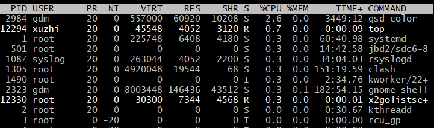

不用编译器，如何确定代码的错误位置，除了打日志，抛异常。

```
不用编译器就是不用assert，不用打印日志就是不用printf，
只能使用core dump，(core dump是操作系统在进程收到某些信号而终止运行时，将此时进程地址空间的内容以及有关进程状态的其他信息写出的一个磁盘文)
通过gdb去调试，定位堆栈信息
```

### gdb调试

```
启动
gdb 程序名
添加断点
break + 行数 （b 也行）
查看断点信息
i b 
程序执行一步
start 
n 单步调试				next
s 单步（能进到函数体内部）step
c 运行到断点  continue
p j 查看j的值
ptype 变量 查看变量类型
display 追踪变量的值
u 跳出当前循环
finish 跳出函数
enable 命令用于启用断点
enable <断点编号> 

```

### linux基础命令

- 测试远程主机端口是否打开

ping ip
telnet ip 端口号 

- 端口号是否被占用

netstat -anp | grep 端口号

- 进程

查看所有进程信息
ps -aux 
通过进程id查找程序
ps -aux | grep pid 
通过程序名查看id
ps -ef | grep 'MyTest' //假如5228是'MyTest'的id

- 文件的大小

ls -lh

- 权限

sudo chmod -R 777 某一目录或者文件

属主，属组，其他用户

- 查找文件或者目录

find 路径 -name 文件名         //grep 文本过滤器

- CPU运行情况

top #查看所有进程的CPU运行情况，记录最大CPU使用率的进程id，内存使用率
top -Hp 12294 #查看进程的运行信息：查找到CPU占用最大的2个线程id
jstack -l 5228 > tmp.txt #打印当前进程的线程栈
查看上面的2个线程id对应的线程运行栈，分析代码



- 查看磁盘大小
  df -h

- 查看服务器内存使用情况
  free -m 

- 查看系统变量路径
  whereis cuda

- 后台运行

cmd & ： 后台运行，关掉终端会停止运行

nohup cmd & ： 后台运行，关掉终端不会停止运行

> 例子：nohup python3 main.py &

```
查看命令
man help

查看防火墙状态
service iptables status
查看系统IP
ifconfig

切换用户
su

显示当前工作目录的绝对路径
pwd

切换目录
cd

列出当前目录下的内容
ls

查看命令帮助
ls --help

在当前目录下创建a目录
mkdir a

创建文件
touch hello.txt

复制文件或目录
cp 源文件  目标文件  //-r 递归复制

移除文件或目录
rm filename
rm -rf dir	//删除文件夹

移动文件或重命名
mv 源文件  目标文件

查看文件内容
cat 

重定向
1)ls –l >文件		//覆盖写
2）ls –al >>文件	//追加

输出
echo
打开文件  
vim test.txt
进入vim编辑模式
按i键
退出vim编辑模式
按esc键
退出vim
输入:wq		//:q退出   :wq保存并退出  :wq!保存并强制退出


在文件内搜索字符串匹配的行并输出
grep+参数+查找内容+源文件

杀死进程
kill -9 进程ID

压缩文件
tar -zcvf  xx.tar
解压
tar -zxvf xx.tar

软链接
ln -s a.txt b.txt 将a.txt软链接到b.txt
硬连接
ln a.txt b.txt //删除a.txt后，b.txt还可以用

查看端口
netstat -anp | grep 5623
列出所有端口 
netstat -a		//所有端口 -p udp  -t tcp  netstat -anp哪些端口打开
netstat -ntlp	//tcp端口	

//测试远程主机端口是否打开
ping ip
telnet ip 端口号 

查看所有进程信息
ps -aux 
通过进程id查找程序
ps -aux | grep pid 
通过程序名查看id
ps -ef | grep 'MyTest' //假如5228是'MyTest'的id


//查看文件大小
du -h file.txt

#查看显卡内存
nvidia-smi
fuser -v /dev/nvidia*
#释放显卡内存
kill -9 id
#查看机器型号
dmidecode|grep "System Information" -A9|egrep "Manufacturer|Product|Serial"
#查看CPU配置
lscpu


vim里面查找字符串
从开头搜索
在命令模式下，输入/你要查找的字符
按下回车，可以看到vim把光标移动到该字符处
再按n（小写）查看下一个匹配
按N(大写）查看上一个匹配，
capslock切换大小写，也可以在小写状态下按shift+n

screen -S zcz
screen -r zcz
ctrl+a+d服务器内存
```


## 请说出10个linux常用的指令

- ls 查看目录中的文件
- cd /home 进入 '/ home' 目录；cd .. 返回上一级目录；cd ../.. 返回上两级目录
- mkdir dir1 创建一个叫做 'dir1' 的目录
- rmdir dir1 删除一个叫做 'dir1' 的目录 （只能删除空目录）
- rm -f file1 删除一个叫做 'file1' 的文件'，-f 参数，忽略不存在的文件，从不给出提示。
- rm -rf /mulu 目录下面文件以及子目录下文件
- cp /test1/file1 /test3/file2 如将/test1目录下的file1复制到/test3目录，并将文件名改为file2
- mv /test1/file1 /test3/file2 如将/test1目录下的file1移动到/test3 目录，并将文件名改为file2
- mv * ../ Linux当前目录所有文件移动到上一级目录
- ps -ef|grep xxx 显示进程pid
- kill 使用kill命令来终结进程。先使用ps命令找到进程id，使用kill -9命令，终止进程。
- tar –xvf file.tar 解压 tar包
- unzip file.zip 解压zip
- unrar e file.rar 解压rar
- free -m 查看服务器内存使用情况

## 1.如何查看所有java进程

- grep是搜索关键字

> ps -ef | grep java

- -aux 显示所有状态

> ps -aux | grep java

## 2.如何kill 杀掉进程

如何杀掉某个服务的进程

- kill 命令用于终止进程
- -9 强迫进程立即停止

> kill -9 [PID]

这里pid需要用 ps -ef | grep 查询pid

**最终通过一行命令杀掉进程(flask)的命令如下**

ps -ef | grep **flask** | grep -v grep | awk '{print $2}' | xargs kill -9

## 3.如何查看日志

##### 如何查看测试项目的日志

一般测试的项目里面，有个logs的目录文件，会存放日志文件，有个xxx.out的文件，可以用tail -f 动态实时查看后端日志

先cd 到logs目录(里面有xx.out文件)

> tail -f xx.out

这时屏幕上会动态实时显示当前的日志，ctr+c停止

##### 如何查看最近1000行日志

> tail -1000 xx.out

6.一个进程调用fork（）函数后，系统先给新的进程分配资源，例如存储数据和代码的空间。然后把原来的进程的所有值都复制到新的新进程中，只有少数值与原来的进程的值不同。相当于克隆了一个自己

## 5.如何查找文件

**统计在文件夹/root 下，包含“word”的文件的个数**

> ls -lR  /root |grep  “*.docx*” I wc -l

##### 如何查找一个文件大小超过5M的文件

> find . -type f -size +100M

##### 如果知道一个文件名称，怎么查这个文件在linux下的哪个目录，如：要查找tnsnames.ora文件

> find / -name tnsnames.ora

查到：
/opt/app/oracle/product/10.2/network/admin/tnsnames.ora
/opt/app/oracle/product/10.2/network/admin/samples/tnsnames.ora

还可以用locate 来查找

> locate tnsnames.ora
> 结果是：
> /opt/app/oracle/product/10.2/hs/admin/tnsnames.ora.sample
> /opt/app/oracle/product/10.2/network/admin/tnsnames.ora
> /opt/app/oracle/product/10.2/network/admin/samples/tnsnames.ora

## **6.如何修改文件的权限**

chmod

假设我的文件夹在主目录里，地址为 /var/home/dengchao/cc 。假设我要修改文件权限为777，则在终端输入 chmod 777 /var/home/userid/cc 文件夹的权限就变为了777。（**可读可写可执行**）

如果是修改文件夹及子文件夹权限可以用 chmod -R 777 /var/home/userid/cc

具体的权限(例如777的含义等)在下面解释下：

> 777有3位，最高位7是设置**文件所有者访问**权限，第二位是设置**群组**访问权限，最低位是设置**其他人**访问权限。

其中每一位的权限用数字来表示。具体有这些权限：

> r(Read，读取，权限值为4)：对文件而言，具有读取文件内容的权限；对目录来说，具有浏览目 录的权限。w(Write,写入，权限值为2)：对文件而言，具有新增、修改文件内容的权限；对目录来说，具有删除、移动目录内文件的权限。

> x(eXecute，执行，权限值为1)：对文件而言，具有执行文件的权限；对目录了来说该用户具有进入目录的权限。

**权限的第一个字母**

d 目录。
l 符号链接(指向另一个文件)。
s 套接字文件。
b 块设备文件。
c 字符设备文件。
p 命名管道文件。
-普通文件，或者更准确地说，不属于以上几种类型的文件

## 7.kill 和 kill -9 区别

kill 对应的是kill -15 ,kill 程序时有以下特点

系统会发送一个**SIGTERM**的信号给对应的程序。当程序接收到该signal后，将会发生以下的事情

- 程序立刻停止
- 当程序释放相应资源后再停止
- 程序可能仍然继续运行 

 大部分程序接收到SIGTERM信号后，会先释放自己的资源，然后在停止。但是也有程序可以在接受到信号量后，做一些其他的事情，并且这些事情是可以配置的。如果程序正在等待IO，可能就不会立马做出相应。也就是说，**SIGTERM多半是会被阻塞的、忽略**

kill -9 是必杀令，**强制停止进程**

系统会发出**SIGKILL**信号，他要求接收到该信号的程序应该立即结束运行，不能被阻塞或者忽略。
