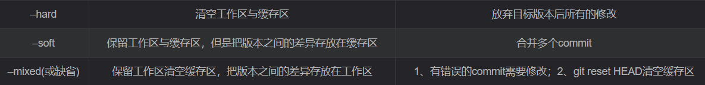

三大分区  工作区 **暂存区**  仓库

初始化
git init

提交到暂存区
git add .

提交到仓库
git commit -m "提交备注"

文件比较
git diff 文件名

a)、git branch -v （查看本地库中的所有分支）
b)、git branch dev (创建一个新的分支)
c)、git checkout dev （切换分支）
d)、分支合并

i)、切换到接收合并的分支
git checkout master
ii)、执行merge命令
git merge dev

#当前cur分支，复制到main分支上

git rebase main  # main<=cur

git rebase bugfix#

删除分支
git branch -d

合并冲突的解决办法：
a)、编辑文件，删除特殊符号。
b)、将文件修改完毕后，保存退出。
c)、git add [文件名]。
d)、git commit –m “日志信息”。

上传到远程库
先添加xxx.git地址
git remote add origin xxx.git
再push
git push -u origin master

下载下来
1)本地没有 repository 时
git clone xxx.git

2)本地有 repository 时
git pull xxx.git

查阅最近的提交修改
git log --stat

版本回退

- git **reset** [—hard  —soft]，但是此commit id之后的修改都会被删除

 **适用场景：** 如果想恢复到之前某个提交的版本，且那个版本之后提交的版本我们都不要了，就可以用这种方法。

- git **revert** 是用一次新的commit来回滚之前的commit，此次提交之前的commit都会被保留；

pull request

先fork你需要pull request的仓库到你自己的账号中，再New pull request，Create pull request，request描述，成功

当PR有冲突时候

- 拉取最新的代码到本地：当前分支为main；最新拉下来的分支为last

> git rebase main(本地的分支) 就是将last（最新的）合并到你当下分支main
>
> git merge last

> git pull是git fetch和git merge两个步骤的结合。

- fit  diff查看冲突文件
- 最后再git pull request
