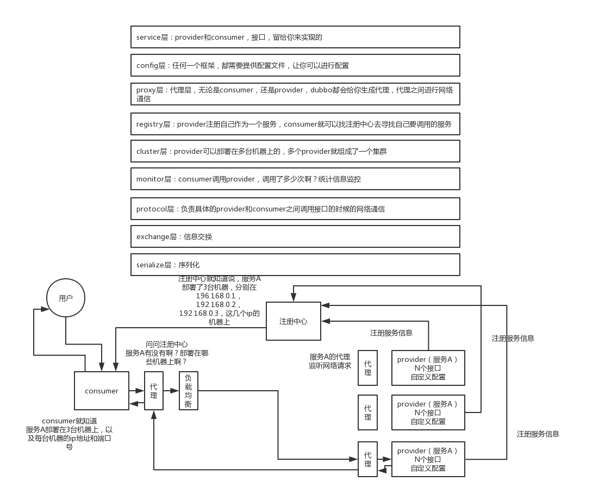

[RPC](https://blog.csdn.net/qq_40856284/article/details/107746408)

[Guide RPC](https://github.com/Snailclimb/guide-rpc-framework)

为什么？怎么做？原理？会有什么问题？

### ES

##### 概念

**1、什么是Elasticsearch：**

 Elasticsearch 是基于 Lucene 的 Restful 的分布式实时全文搜索引擎。
采用的倒排索引技术实现数据的快速检索；

存储的数据采用的是分片机制（分布式，并行，做到高性能/高吞吐量）；

 ES 扩展性很好，我们可以通过水平扩展的方式去增加服务器来提升 ES 的处理性

> ES 并不是万能的，如果使用不恰当，也会带来一些性能的瓶颈。比如说 ES 里面我们不建议去使用复杂的关联查询，这个对性能影响很大。第二个，避免深度分页查询。因为 ES 的分页是支持 from 和 size 参数。在查询的时候，每个分片必须要去先构造一个长度为 from 加 size 的优先队列，然后回传到协调节点再对这些优先队列进行排序，再找到正确的 size 个文档。而当 from 足够大的情况下，容易造成 OOM 以及网络传输性能差的一些问题。

##### 对比

**（1）elasticsearch**（基于Lucene（底层原理：倒排索引））

优点：

缺点：

**（2）Solr**

优点：强大而广泛的用户社区；

缺点：

**（3）Sphinx**

优点：

缺点：


**2、Elasticsearch 的基本概念：**

（1）index 索引：索引类似于mysql 中的数据库，Elasticesearch 中的索引是存在数据的地方，包含了一堆有相似结构的文档数据。

（2）type 类型：类型是用来定义数据结构，可以认为是 mysql 中的一张表，type 是 index 中的一个逻辑数据分类

（3）document 文档：类似于 MySQL 中的一行，不同之处在于 ES 中的每个文档可以有不同的字段，但是对于通用字段应该具有相同的数据类型，文档是es中的最小数据单元，可以认为一个文档就是一条记录。

（4）Field 字段：Field是Elasticsearch的最小单位，一个document里面有多个field

（5）shard 分片：单台机器无法存储大量数据，es可以将一个索引中的数据切分为多个shard，分布在多台服务器上存储。有了shard就可以横向扩展，存储更多数据，让搜索和分析等操作分布到多台服务器上去执行，提升吞吐量和性能。

（6）replica 副本：任何服务器随时可能故障或宕机，此时 shard 可能会丢失，通过创建 replica 副本，可以在 shard 故障时提供备用服务，保证数据不丢失，另外 replica 还可以提升搜索操作的吞吐量。

**3.doc_values 的作用（正排索引）**

​    倒排索引虽然可以提高搜索性能，但也存在缺陷，比如我们需要对数据做**排序或聚合**等操作时，lucene会提取**所有**出现在文档集合的排序**字段**，然后构建一个排好序的文档集合，而这个步骤是基于内存的，如果排序数据量巨大的话，容易造成**内存溢出**和性能缓慢。

doc values则是建立正向索引，然后只提取要排序的字段（列式），这样排好序，就可以做分组聚合操作而不像mysql那样得把一行行数据提取出来，再做排序聚合，就很慢了。

**doc values是被保存在磁盘上的，此时如果内存足够，os会自动将其缓存在内存中，性能还是会很高；如果内存不足够，os会将其写入磁盘上。**


**4.text 和 keyword类型的区别：**

keyword 类型是不会分词的，只能通过精确值搜索到；
Text 类型在存入 Elasticsearch 的时候，会先分词，然后根据分词后的内容建立倒排索引

**5.query 和 filter 的区别？**

（1）query：查询操作不仅仅会进行查询，还会**计算分值，用于确定相关度**；

（2）filter：查询操作仅判断是否满足查询条件，**不会计算任何分值，也不会关心返回的排序问题**，同时，filter **查询的结果可以被缓存**，提高性能。

##### **为什么要选择全文搜索引擎，而不直接用like**

可能你会觉得问这个问题的面试官有点傻，但是真有人这么问，为什么要使用全文检索引擎而不直接使用Mysql的like进行关键字检索。不一样能达到效果吗？

实际上当你的数据量不是特别庞大的时候，使用like进行模糊查询是完全没有问题的，您可以在你自己的电脑上做一个测试，只要你CPU,内存不是很差，几十万的数据使用 like进行模糊查询其实还是蛮快的，但是数据量再大一点就不好说了，数据库肯定遭不住。所以我们在做技术选型的时候需要进行评估，你的业务数据会不会增长特别快，比如：2年内预估会上百万或是千万或是更大，如果是这种情况可以直接上搜索引擎。很多企业前期还是不会投入太多技术成本，而是等到后期数据量上来再做技术转型和优化。

##### 倒排索引

**正向索引**： 比如使用mysql的全文检索，在一个文档中搜索到关键词就加入，每个文档都遍历一遍，非常慢。根据记录去找关键词。

**倒排索引**：是按照分词与文档进行映射。搜索到关键词就可以得到全部文档。根据关键词来找记录。

- 倒排索引中的所有词项对应一个或多个文档；
- 倒排索引中的词项根据字典顺序升序排列

##### **倒排索引创建过程**


**搜索索引过程**


##### 倒排索引实现


索引：一是 term index 在内存中是以 **FST**（finite state transducers）的数据结构保存的。

term index不须要存下全部的term，而仅仅是他们的一些前缀与Term  Dictionary的block之间的映射关系，再结合FST(Finite State Transducers)的压缩技术，可使term  index缓存到内存中。从term index查到对应的term  dictionary的block位置以后，再去磁盘上找term，大大减小了磁盘随机读的次数。

1.FOR压缩（磁盘）


> 它会把所有的文档分成很多个 block，每个 block 正好包含 256  个文档，然后单独对每个文档进行增量编码，计算出存储这个 block 里面所有文档最多需要多少位来保存每个  id，并且把这个位数作为头信息（header）放在每个 block 的前面。这个技术叫 Frame of Reference

2.roaring bitmaps（对于缓存）

filter cache 用来存储 filters 得到的结果集, Frame Of Reference 压缩算法对于 postings list 来说效果很好，但对于需要存储在内存中的 filter cache 等不太合适。
postings list 是 Integer 数组，具有压缩空间，第一个思路：bitmap，不适用于稀疏存储；于是有了roaring bitmaps

1）具体过程

将 doc id 拆成高 16 位，低 16 位。对高位进行聚合 (以高位做 key，value 为有相同高位的所有低位数组)，根据低位的数据量 (不同高位聚合出的低位数组长度不相同)，使用不同的 container(数据结构) 存储。

`len<4096 ArrayContainer 直接存值；len>=4096 BitmapContainer 使用 bitmap 存储`

4096 存储分界线的来源：value 的最大总数是为2^16=65536. 
一个 Integer 的低 16 位是 2Byte，因此对应到 Arrary Container 中的话就是 2Byte * 4096 = 8KB；
同样，对于 Bitmap Container 来讲，2^16 个 bit 也相当于是 8KB。

2）结果


**联合查询**

在联合查询时，在有 filter cache 的情况下，会直接利用**位图的原生**特性快速求交并集得到联合查询结果，否则使用 **skip list** 对多个 postings list 求交并集，跳过遍历成本并且节省部分数据的解压缩 cpu 成本

##### **数据分片机制（分布式架构）**

> 数据分片的目的一是为了方便横向扩展，
> 二是可以让搜索工作分布在多台及其上去执行，有效提升整体吞吐量。

> 假设 IndexA 有2个分片，我们向 IndexA 中插入10条数据 (10个文档)，那么这10条数据会尽可能平均的分为5条存储在第一个分片，剩下的5条会存储在另一个分片中。每个分片包含多个segment,每一个segment都是一个倒排索引
>

**一个索引对应多个分片shard**。

每个shard都有**一个primary shard**，负责写入数据，但是还有**几个replica shard**。primary shard写入数据之后，会将数据同步到其他几个replica shard上去。

某个机器宕机了，还有数据副本在别的机器上，高可用。

es集群多个节点，会自动选举一个节点为**master节点**，干管理工作：比如维护索引，元数据；负责切换primary shard和replica shard身份等。

要是**master节点宕机**了，那么会重新选举一个节点为master节点

如果是**非master节点宕机**了，那么会由master节点，让那个宕机节点上的primary shard的身份**转移到其他机器上的replica shard**。如果宕机的机器修复了，修复后的节点也不再是 primary shard，而是 replica shard。

在ES中默认是5主1备，可以在创建索引的时候设置主备分片数量，但是主分片数量一旦设置好就不可更改，备分片的数量可以动态修改。
另外，当我们增加或者减少Node机器时，分片也会自动的在Node中进行负载均衡(重新分配)

> 

##### **ES节点类型**

默认情况下，elasticsearch集群中每个节点都有成为主节点的资格，也都存储数据，还可以提供查询服务。在生产环境下，如果不修改elasticsearch节点的角色信息，在高数据量，高并发的场景下集群容易出现脑裂等问题。这些功能是由两个属性控制的。node.master 和 node.data 默认情况下这两个属性的值都是true。

- 主节点master

node.master=true,代表该节点有成为主资格，主节点的主要职责是**和集群操作相关的内容**，如创建或删除索引，跟踪哪些节点是群集的一部分，并决定哪些分片分配给相关的节点。一般会把主节点和数据节点分开，node.master=true , node.data=false

- 数据节点data

node.data=true,数据节点主要是存储索引数据的节点，主要对文档进行**增删改查操作**，聚合操作等,数据节点对CPU,IO,内存要求较高，优化节点的时候需要做状态监控，资源不够时要做节点扩充。配置：mode.master=false,mode.data=true

- 负载均衡节点client

当主节点和数据节点配置都设置为false的时候，该节点**只能处理路由请求，处理搜索，分发索引操作**等，从本质上来说该客户节点表现为智能负载平衡器。配置：mode.master=false,mode.data=false

##### **最佳实践**

在一个生产集群中我们可以对这些节点的职责进行划分，建议集群中设置3台以上的节点作为master节点，这些节点只负责成为主节点，维护整个集群的状态。再根据数据量设置一批data节点，这些节点只负责存储数据，后期提供建立索引和查询索引的服务，这样的话如果用户请求比较频繁，这些节点的压力也会比较大，所以在集群中建议再设置一批client节点(node.master: false node.data: false)，这些节点只负责处理用户请求，实现请求转发，负载均衡等功能。

##### **写数据底层原理**

当分片所在的节点接收到来自协调节点的请求后，会将请求写入到Memory Buffer，然后定时（默认是每隔1秒，所以ES是近实时，写到读有**1s**延迟）写入到Filesystem Cache去形成segment，通过lucene的index reader可以reopen缓存中新产生的segment，就可以搜索了。这个从Momery Buffer到Filesystem Cache的过程就叫做**refresh**。

当然在某些情况下，存在Momery Buffer和Filesystem Cache的数据可能会丢失，ES是通过**translog**的机制来保证数据的可靠性的。其实现机制是接收到请求后，写入Memory Buffe同时也会写入到translog中，当Filesystem cache中的数据写入到磁盘中时，提交commit point，translog才会清除掉，这个过程叫做**flush**；

在flush过程中，用**fsync（**十分消耗系统资源**）**将系统缓冲的内容刷新到磁盘，旧的translog将被删除并开始一个新的translog。flush触发的时机是定时触发（**默认30分钟**）或者translog变得太大（默认为512M）时；

>    segment是不可变的，当我们更新一个文档时，会把老的数据打上已删除的标记，然后写一条新的文档。在执行flush操作的时候，才会把已删除的记录物理删除掉。


##### **搜索过程**

1）客户端发送请求到一个coordinate node

2）协调节点将搜索请求转发到所有的shard对应的primary shard或replica shard也可以

3）query phase：每个shard将自己的搜索结果（其实就是一些doc id），返回给协调节点，由协调节点进行数据的合并、排序、分页等操作，产出最终结果

> PS：在搜索的时候是会查询Filesystem Cache的，但是有部分数据还在Memory Buffer，所以搜索是近实时的。

4）fetch phase：接着由协调节点，根据doc id去各个节点上拉取实际的document数据，最终返回给客户端

##### **写过程**

1）客户端选择一个 node 发送请求过去，这个 node 就是 `coordinating node`（协调节点）。

2）`coordinating node` 对 document 进行路由，将请求转发给对应的 node（有 primary shard）。

3）实际的 node 上的 `primary shard` 处理请求，然后将数据同步到 `replica node`。

4）`coordinating node` 如果发现 `primary node` 和所有 `replica node` 都搞定之后，就返回响应结果给客户端。

##### **读过程**

1）客户端发送请求到任意一个 node，成为 `coordinate node`。

2）`coordinate node` 对 `doc id` 进行**哈希路由**，将请求转发到对应的 node，此时会使用 `round-robin`**随机轮询**算法，在 `primary shard` 以及其所有 `replica shard`中随机选择一个，让**读请求负载均衡**。

3）接收请求的 node 返回 document 给 `coordinate node`。

4）`coordinate node` 返回 document 给客户端。

##### **更新和删除过程**

删除和更新也都是写操作，但是Elasticsearch中的**文档是不可变的**，因此不能被删除或者改动以展示其变更；　磁盘上的每个段都有一个相应的.del文件。当删除请求发送后，文档并没有真的被删除，而是在.del文件中**被标记为删除**。该文档**依然能匹配查询，但是会在结果中被过滤掉**。在执行flush操作的时候，才会把已删除的记录物理删除掉。


### RPC协议

#### 远程调用？

远程调用是指跨进程的功能调用，跨进程可以理解成一个计算机节点上的多个进程或者多个计算机节点上的多个进程。

#### **理解**

1984年，尼尔森就把它应用于分布式系统之间的一个通讯协议。 Java 在 1.1 版本的时候提供了 Java 版本的 RPC 框架 RMI 。RPC 的全称是 remote procedto core 翻译过来就是远程过程调用，它是一种通过网络从远程计算机程序上请求服务，而不需要去了解底层网络技术的一种协议。凡是符合该协议的框架，我们都可以称为 RPC 框架。
RPC 协议通俗来理解就是 A 计算机提供一个服务，B计算机可以通过调用本地服务去调用 A 计算机提供的一个服务，这就是 RPC 协议的一个功能。

#### **如何实现？**

要实现 RPC 需要通过网络进行数据传输，并且对调用的过程进行封装。现在比较流行的 rb 的框架都会采用 TCP 协议作为底层传输协议。当然其他协议也是可以的。比如说 UDP。

RPC 协议强调的是过程调用，调用的过程对用户而言是透明的，用户不需要关心调用的细节，可以像调用本地服务一样去调用远程服务。


个完整的 RPC 协议包含了四个核心组件，分别是 client， server ，clientStub 以及 serverStub。 第一个客户端 client 表示服务的调用方。第二个服务端 server 是真正服务提供者。第三个是客户端存根clientStub存放服务端的地址信息，再将客户端的请求参数打包成网络消息，然后通过网络发送给服务方。第四个是服务端的存根serverStub 接收客户端发送过来的消息，将消息进行反序列化，并调用本地方法。
前比较流行的开源 RPC 框架有 Google 的 grpc ，Facebook 的 Thrift， 阿里巴巴的 dubbo。

**RPC要解决的两个问题：**

\1. 解决分布式系统中，服务之间的调用问题。

\2. 远程调用时，要能够像本地调用一样方便，也就是说调用的过程对用户而言是透明的。

#### 应用场景以及优势

> 所谓IOE，是指以IBM小型机、Oracle数据库和EMC存储设备为代表的数据库体系。一方面，高度垄断的市场格局带来了极高的使用成本，另一方面，对海外企业过度依赖自然会带来数据安全上的隐患。用PC Server和MySql开源数据库替代IOE结构，阿里是最早意识到这一问题并完成去IOE化的企业。

在开发电商系统的时候，随着业务越来越复杂，走分布式架构这个方向是绝大部分的互联网企业的**必然选择**。分布式架构落地的里程碑应该是阿里的**去 ioe 运动**的一个成功，让互联网企业看到如何利用更少的软硬件成本来支撑海量的用户。**分布式架构的核心**就是利用多个普通的计算机节点组成一个庞大的复杂计算网络，提供一个高性能以及高并发的能力支撑。在分布架构中，原本单体应用**被拆分成多个独立部署的服务**分布在计算机网络上，这些服务必然需要通过网络进行数据的通信和交互。而 RBC 框架就是解决在分布式架构中的各个业务服务彼此的网络通信的一个问题。
一般来说 RPC 服务主要是针对于大型的企业，当我们的业务复杂度以及用户量都比较高的时候，需要对服务进行解耦，从而达到扩展性强、部署灵活的一个目的。一般情况下，市面上的开源 RPC 框架除了提供基础的远程通信功能以外，还会在性能的消耗上、传输效率上、服务治理等方面做出很多的一些优化和设计。比如说阿里开源的 RPC 框架，dubbo就提供了非常丰富的服务治理的一些功能。

### dubbo

#### 理解


dubbo是一个高性能、轻量级的开源 RPC 框架。它由10层模型来构成，整个分层的依赖，由上到下，通过上图可以去进进行一个了解，我们也可以把 dubbo理解成三层模型。第一层是 business 业务逻辑层，由我们自己来提供接口和实现，还有一些配置信息。第二层是 RPC 调用的核心层，负责封装和实现整个 RPC 的调用过程，负载均衡、集群容错，代理等核心功能。第三个是 remoting 是对网络传输协议和数据转化的一个封装。

#### **工作原理**




第一个，服务启动的时候，服务提供者和服务消费者根据配置信息会连接到注册中心，分别向注册中心去注册和订阅服务。

第二个，注册中心会根据订阅关系将服务提供者的信息返回给服务消费者，同时服务消费者会把服务提供者的信息缓存到本地。如果信息发生变更，消费者会收到注册中心的一个推送，去更新本地的一个缓存。

第三个，服务消费者会生成代理对象，同时根据负载均衡策略去选择一台目标服务提供者，并且定时向 monitor 记录接口的调用次数和时间信息。

第四个，拿到代理对象之后，服务消费者通过代理对象发起接口的一个调用。

第五个，服务提供者收到请求后会根据数据进行反序列化，然后通过代理调用具体接口的一个实现，这是整个 dubbo的一个原理和实现过程。

> 注册中心挂了可以继续通信吗？
>
> 可以，因为刚开始初始化的时候，消费者会将提供者的地址等信息拉取到本地缓存，所以注册中心挂了可以继续通信

#### 网络协议

1）dubbo协议

dubbo://192.168.0.1:20188

默认就是走dubbo协议的，单一长连接，NIO异步通信，基于hessian作为序列化协议

适用的场景就是：传输数据量很小（每次请求在100kb以内），但是并发量很高

2）http协议

....

#### **六大核心能力**

第一个是面向接口代理的高性能 RPC 调用
第二个是智能容错和负载均衡
第三个是服务的自动注册和发现
第四个是高度可扩展能力
第五个是运行期流量调度
第六个是可视化的服务治理和运维

#### **负载均衡策略** 

dubbo有五种负载均衡策略。
第一种是**加权随机**。所谓的加权随机就是通过区间的随机算法去获取一个目标服务器。但是这个区间算法中我们可以针对某一个服务器去增加权重，从而去获得更大的一个调用可能性。

第二种是**最小活跃数**。每一个服务提供者对应一个活跃数 active。 初始情况下，所有服务者的活跃数都为0，每次收到请求活跃数加1，完成请求后，再将活跃数减1。在服务运行一段时间之后，性能好的服务提供者的处理请求的速度更快，因此活跃数下降得也越快，这个时候服务提供者就能够去优先获得新的请求。

第三种是**一致性哈希**，也是说根据同一个客户端请求，通过一次性哈希算法会落到一个目标服务器上，只要请求的信息没有变化的情况下，他的请求永远会落到同一台目标服务器。

第四种是**加权轮询**，也是按照目标服务器按照 123 这种方式去轮询。而加权是说我们可以针对目标服务记得某些性能好的节点去增加权重，从而使得这样一个服务器能够获得更多的一个调用。

第五种是**最短响应时间的权重随机**，也就是说它会计算目标服务的请求的响应时间，去根据**响应时间最短的服务去配置更高的权重**，然后再进行区间随机算法，从而得到一个目标服务节点进行访问。

#### 集群容错策略

1）failover cluster模式

失败自动切换，自动重试其他机器，默认就是这个，常见于读操作

2）failfast cluster模式

一次调用失败就立即失败，常见于写操作

3）failsafe cluster模式

出现异常时忽略掉，常用于不重要的接口调用，比如记录日志

4）failbackc cluster模式

失败了后台自动记录请求，然后定时重发，比较适合于写消息队列这种

5）forking cluster

并行调用多个provider，只要一个成功就立即返回

6）broadcacst cluter

逐个调用所有的provider

#### 动态代理策略

默认使用javassist动态字节码生成，创建代理类；但是可以通过spi扩展机制配置自己的动态代理策略

#### SPI

spi，简单来说，就是service provider interface，说白了是什么意思呢，比如你有个接口，现在这个接口有3个实现类，那么在系统运行的时候对这个接口到底选择哪个实现类呢？这就需要spi了，需要根据指定的配置或者是默认的配置，去找到对应的实现类加载进来，然后用这个实现类的实例对象。

SPI机制，一般来说用在哪儿？**插件扩展**的场景，比如说你开发的是一个给别人使用的开源框架，如果你想让别人自己写个插件，插到你的开源框架里面来，扩展某个功能。

经典的思想体现，大家平时都在用，比如说jdbc，java是没有提供jdbc的实现类。一般来说，我们要根据自己使用的数据库，比如msyql，你就将mysql-jdbc-connector.jar，引入进来；oracle，你就将oracle-jdbc-connector.jar，引入进来。在系统跑的时候，碰到你使用jdbc的接口，他会在底层使用你引入的那个jar中提供的实现类

 但是dubbo也用了spi思想，不过没有用jdk的spi机制，是自己实现的一套spi机制。他会去找一个你配置的Protocol（负责rpc调用的东西），他就会将你配置的Protocol实现类，加载到jvm中来，然后实例化对象，就用你的那个Protocol实现类就可以了。如果你没配置，那就走默认的实现好了，没问题。

#### 如何进行服务治理

#### 服务降级

#### 失败重试和超时重试


#### 幂等性

#### 顺序性

首先，一般来说，我个人给你的建议是，你们从业务逻辑上最好设计的这个系统不需要这种顺序性的保证，因为一旦引入顺序性保障，会导致系统**复杂度上升，而且会带来效率低下**，热点数据压力过大，等问题。

下面我给个我们用过的方案吧，简单来说，首先你得用dubbo的**一致性hash负载均衡策略**，将比如某一个订单id对应的请求都给分发到某个机器上去，接着就是在那个机器上因为可能还是多线程并发执行的，你**可能得立即将某个订单id对应的请求扔一个内存队列**里去，强制排队，这样来确保他们的顺序性。

但是这样引发的后续问题就很多，比如说要是某个订单对应的请求特别多，**造成某台机器成热点**怎么办？解决这些问题又要开启后续一连串的复杂技术方案。。。曾经这类问题弄的我们头疼不已，所以，还是建议什么呢？

最好是比如说刚才那种，一个订单的插入和删除操作，能不能合并成一个操作，就不要求顺序性。

#### 如何设计RPC框架

（1）上来你的服务就得去注册中心注册吧，你是不是得有个**注册中心**，保留各个服务的信息，可以用zookeeper来做

（2）然后你的消费者需要去注册中心拿对应的服务信息吧，对吧，而且**每个服务可能会存在于多台机器**上，接着你就该发起一次请求了，咋发起？蒙圈了是吧。当然是**基于动态代理**了，你面向接口获取到一个动态代理，这个动态代理就是接口在本地的一个代理，然后这个代理会找到服务对应的机器地址

（3）然后找哪个机器发送请求？那肯定得有个**负载均衡算法**了，比如最简单的可以随机轮询是不是

（4）接着找到一台机器，就可以跟他发送请求了，第一个问题咋发送？你可以说**用netty了，nio方式**；第二个问题发送啥格式数据？你可以说用**hessian序列化协议**了，或者是别的，对吧。然后请求过去了。。

（6）服务器那边一样的，需要针对你自己的服务**生成一个动态代理，监听某个网络端口**了，然后代理你本地的服务代码。接收到请求的时候，就调用对应的服务代码，对吧。

#### **dubbo跟 spring Cloud 的一个区别**

第一个，它的关注点。 dubbo是 SOA （面向服务架构）时代的产物，它的关注点主要在于服务的远程调用、流量分发、服务治理、流量控制等等这样一些方面。而是 spring Cloud 是诞生于微服务架构时代，它关注的是微服务的整个生态的解决方案。另外纯靠的依托于 spring 和 spring boot 生态，所以两个框架的目标是不一致的。 dubbo 定位于服务治理， spring Cloud 是一个微服务解决生态。
第二个两者最大区别： dubbo 底层使用的是 Netty 这样的一个 NIO 框架，是基于 TCP 协议进行传输，然后通过 hession 等序列化的方式去完成 RPC 的通信。
而 spring cloud 是基于 Http 协议加上 rest 风格的一个接口去实现远程通信。
相对来说 Http 请求会有更大的一些报文，占用的带宽会更多，效率上比 dubbo会更差一些。但是 rest 相比 RPC 来说会更加灵活，服务提供方和服务调用方只需要根据 HTTP 协议的一个契约去完成通信就行了。

### Zookeeper

#### 理解

 zookeeper大数据集群中的一个基础组件，同时是一个分布式协调框架。

我觉得可以从分布式系统中的三种典型的应用场景来说。

第一种是集群管理。在多个节点组成的集群中，为了去保证集群的 HA 的特性，每个节点都会去冗余一份数据副本。那么这种情况下，需要保证客户端访问集群中任意一个节点都是最新的数据。

第二种，分布式锁如何保证跨进程的共享资源的并发安全性，对于分布系统来说也是一个比较大的挑战。而为了达到这个目的，必须要使用跨进程的锁也就是分布锁来实现。

第三种， master 选取在多个节点组成的集群中，为了降低集群数据同步的一个复杂度，一般会存在 master 和 slave 两种角色的节点。 master 负责去做事务和非事务性的请求处理，slam去专门负责非事务请求处理。但是在分布系统中如何去确定某个节点是 master 还是 slabel 也成了一个难度不小的挑战。
基于这三类常见场景的需求，所以产生了 Jupiter 这样一个中间件。它是一个分布式开源的闲暇组件。简单来说就是类似于一个裁判员的角色，专门负责协调和解决分布系统中的各类问题。比如针对上述描述的问题，jukeeper都可以用来解决。

第一个，集群管理。 jukeeper 提供了 CP 模型，来保证集群中的每个节点的数据一致性。当然 ZK 本身的集群并不是一个强一资讯模型，而是一个顺序执行模型。如果我们需要去保证 CP 特性的话，我们需要调用 single 方法进行同步。

第二个，分布了锁。 zookeeper 提供了多种不同的节点类型，比如持久化节点、临时节点、有序节点和容器节点等等。其中对于分布锁这个场景来说，to keeper 可以利用有序节点这样一个特性来实现。除此之外，还可以利用同一级节点的唯一特性来实现分布锁。
第三个， master 选取 zoq 可以利用持久化节点来存储和管理其他集群节点的一些信息，从而去进行 master 选取的一种机制，或者还可以利用集群中的一些有序节点的特性来实现 master 选取。目前主流的卡夫卡、 hbase 它 dope 都是通过 zookeeper 来实现集群中节点的一个组成选取的。

#### 场景

（1）分布式协调：这个其实是zk很经典的一个用法，简单来说，就好比，你A系统发送个请求到mq，然后B消息消费之后处理了。那A系统如何知道B系统的处理结果？用zk就可以实现分布式系统之间的协调工作。A系统发送请求之后可以在zk上对某个节点的值注册个监听器，一旦B系统处理完了就修改zk那个节点的值，A立马就可以收到通知，完美解决。

（2）分布式锁：对某一个数据连续发出两个修改操作，两台机器同时收到了请求，但是只能一台机器先执行另外一个机器再执行。那么此时就可以使用zk分布式锁，一个机器接收到了请求之后先获取zk上的一把分布式锁，就是可以去创建一个znode，接着执行操作；然后另外一个机器也尝试去创建那个znode，结果发现自己创建不了，因为被别人创建了。。。。那只能等着，等第一个机器执行完了自己再执行。

（3）元数据/配置信息管理：zk可以用作很多系统的配置信息的管理，比如kafka、storm等等很多分布式系统都会选用zk来做一些元数据、配置信息的管理，包括dubbo注册中心不也支持zk么

（4）HA高可用性：这个应该是很常见的，比如hadoop、hdfs、yarn等很多大数据系统，都选择基于zk来开发HA高可用机制，就是一个重要进程一般会做主备两个，主进程挂了立马通过zk感知到切换到备用进程

#### 分布式事务

（1）分布式事务了解吗？


（2）你们如何解决分布式事务问题的？


（3）TCC如果出现网络连不通怎么办？


（4）XA的一致性如何保证？

### Netty

#### 理解

第一个是 Netty是一个基于 **NIO 模型**的**高性能**网络通信框架。其实可以认为它是对 NIO网络模型的一个封装，提供了简单易用的一个 API ，我们可以利用这样一些封装好的 API 去快速开发自己的一个网络程序。
第二个是 Netty 在 NIO 的基础上做了很多的一些**优化**，比如说像**零拷贝**机制、高性能**无锁队列**、**内存池**等，因此性能会比 NIO 更高。
第三个是 Netty 可以支持**多种通信协议**，比如说 http Websocket 并且针对数据通信**拆包粘包**的一些问题，Netty也内置了很多拆包的一个策略，所以我们在使用过程中会非常方便。

#### 作用，为什么使用netty

netty 相比于直接去使用 JDK 自带的 NIO 相关的 API 来说会更加简单，因为它具有这样一些特点。
第一个是统一的 API 。它支持多种传输类型，比如阻塞、非阻塞以及 epoll，poll等模型。
第二个我们可以去使用非常少的代码来去实现多线程 Reactor 模型以及主从多线程 Reactor 模型。
第三个是自带编解码器，去解决 TCP 拆包粘包的一个问题。
第四个是自带的各种通信协议。
第五个是 Netty 相比于我们直接使用 Java 库里面的 NIO 的话，它提供了更高的一个吞吐量以及更低的延迟，更低的资源消耗和更少的内存复制。
第六个是安全性很好，它有完整的 SSL/ TLS的这样一个支持。最后一个它的社区活跃度非常好，而且它的一个版本迭代很稳定，经历了各种大的项目的一个考验。比如说像dubbo，像zookeeper ，像 RocketMQ 这样他们都有用到Netty。

#### 干什么，应用场景

我们之所以要用 netty 。核心的点还是在于解决服务器如何去承载更多的用户同时访问的问题。传统的 BIO 模型，由于它阻塞的一个特性，使得我们在高并发的场景中很难去支持更高的一个吞吐量。后来我们去基于 NIO 多路复用的模型，虽然可以在阻塞方面去进行优化，但是它的 API 使用比较复杂，对于初学者来说不是特别友好。而 Netty 是基于 NIO 的一个封装，提供了成熟简单易用的 API 降低了使用成本和学习成本。
本质上来说，Netty和 NIO 所扮演的角色是相同的，都是为了去提升服务端的吞吐量，让用户获得更好的一个产品体验。另外， Netty 这个中间件经过了很多年的考证。本质上来说，Netty和 NIO 所扮演的角色是相同的，都是为了去提升服务端的吞吐量，去让用户获得更好的产品体验。

#### 核心组件，作用

Netty 是由三层结构构成的**网络通信层、事件调度层和服务编排层**。

在网络通信层有三个核心组件，bootstrap， server bootstrap 以及 channel 。bootstrap 负责客户端启动，并且去连接远程的 Netty server 。
server bootstrap是负责服务端的监听，用来监听指定的一个端口。
channel是负责网络通信的一个载体。
事件调度器有两个核心角色，event loop group 和 event loop。
 event loop group 本质上是一个线程池，主要去负责接收 IO 请求并分配线程去执行处理请求。
 event loop是相对于线程池里面的一个具体线程。
服务编排层有三个核心组件，channel pipeline， channel handle 以及 channel handle context 。
channel pipeline 它是负责处理多个 channel handler 。它会把多个 channel handler 构成一个链，去形成这样一个 pipeline。
 channel handler 主要是针对 IO 数据的一个处理器：数据处理与接收。数据接收后通过指定的一个 handler 进行处理。 
channel handle context 是用来保存 channel handle 的一个上下文信息的。

#### Netty 里面有哪几种线程模型，原理，作用

Netty 提供了三种 Reactor 模型的一个支持。第一种是单线程单 Reactor 模型，第二种是多线程单 Reactor 模型，第三种是多线程多 Reactor 模型，也叫主从多线程 Reactor 模型。

https://zhuanlan.zhihu.com/p/428693405

Reactor 模型它有三个重要的组件。第一个是 **Reactor** 它是负责将 IO 事件分派给对应的 handler 。第二个是 **Acceptor** 它是处理客户端的连接请求。第三个是 **handlers** 去执行我们的业务逻辑的读写操作，这是最基本的组成 Reactor 模型的一个组件。


我们来看这个图，这个代表的是单线程单 React 模型。那么这个图里面可以看到从请求连接进来，到 IO 处理全部是由一个线程来处理的，这就是所谓的单线程单 React 模型。
单线程 Reactor 模型它也会有个缺点，就是如果其中一个 handler 出现阻塞，就会导致后续的客户端无法被处理，因为**他们是同一个线程，所以就导致无法接收新的请求**。

为了解决这个问题，有人提出了使用多线程的方式来解决。


加入线程池去异步处理，这样的话我们就可以**解决 handler 阻塞**的一个问题，主要把 Reactor 和 handler 放在不同的线程去处理，这就是多线程单 Reactor 模型。

步骤


在多线程单 Reactor 模型中，所有的 IO 操作都是有一个 Reactor 来完成的，那么这就会导致**单个 Reactor 会存在一个性能瓶颈**，对于小容量的场景来说影响不是很大。但是对于高并发的一些场景来说，很容易会因为单个 React 线程的一个阻塞，或者因为单个 React 带来的一个性能平瓶颈，导致我的整个吞吐量会受到影响。所以当这个线程超过负载之后，处理的速度会变慢，就会导致大量的客户端连接超时，超时之后往往会进行重发，这反而加重了这个线程的一个负载，最终会导致大量的消息积压和处理超时，成为整个系统的一个性能瓶颈。所以我们还可以进行进一步的优化，也就是引入多线程多Reactor模型。


我们看这个图，所谓的多线程多 Reactor 模型也叫主从 多线程 Reactor 模型。main Reactor 它是负责接收客户端的连接请求，然后把请求传递给 sub reactor，其中 sub reactor 我们可以配置多个，这样的话我可以去进行灵活的扩容和缩容。

步骤


#### 优点

响应快，**不必为单个同步事件所阻塞**，虽然Reactor本身依然是同步的；

可以最大程度避免复杂的多线程及同步问题，并且**避免多线程/进程的切换**；

扩展性好，可以方便通过增加Reactor实例个数充分利用CPU资源；

复用性好，Reactor模型本身与具体事件处理逻辑无关，具有很高的复用性


### Nginx

#### 理解

Nginx是一个**高性能的HTTP和反向代理服务器**，也是一个IMAP/POP3/SMTP代理服务器。

#### 作用

nginx相对于Apache优点：

- 高并发响应性能非常好，官方nginx处理静态文件**并发5w/s**
- **反向代理**性能非常好（可用于**负载均衡**）
- 内存和CPU**占用率低**。（为Apache的1/5—1/10）

> nginx，Apache只支持静态网页，tomcat支持动态网页

正向代理：客户端非常明确要访问的服务器地址，它代理客户端，替客户端发出请求。如：google翻墙

> 客户端->正向代理->服务器

反向代理：随着请求量的爆发式增长，服务器觉得自己一个人始终是应付不过来，需要兄弟服务器们帮忙代理，它代理的是服务器端

> 多个客户端->反向代理（代理服务器）->多个服务器（处理）

#### 负载均衡算法

ip哈希；（默认）

轮询就比较差；

随机；

加权轮询；（将性能好的或者连接数比较少的服务节点，给它加更大的权重）

加权随机；

动态地选取最少连接数，尽可能地提高后端服务的利用效率

#### 使用教程

**下载linux版本**

```sh
tar zxvf nginx-1.6.2.tar.gz
cd nginx-1.6.2
./configure
make
make install
whereis ngnix

```


```sh
cd ／usr/local/ngnix/sbin
./ngnix  #启动
./ngnix -s stop	#停止
./ngnix -s quit	#安全退出
./ngnix -s reload	#重新加载配置文件
ps aux|grep nginx #查看进程
```

启动不成功，请检查


#### 实战

>  ngnix.conf


