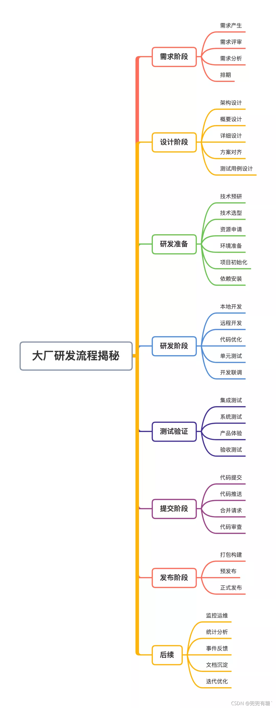
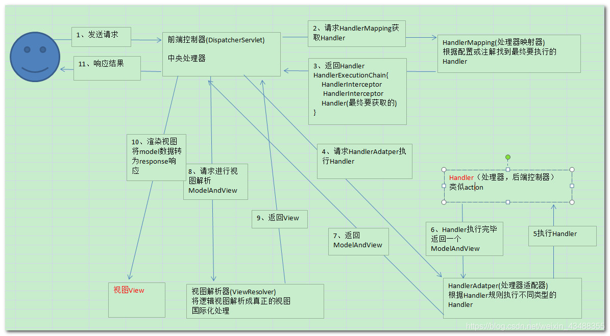

### **SpringMVC** **工作流程** ⭐️

1）用户发送请求至**前端控制器 DispatcherServlet**。 

2）DispatcherServlet 收到请求**调用 HandlerMapping 处理器映射器**。

> 维护<url，handler>的映射

3）处理器映射器找到**具体的处理器**(可以根据 **xml 配置、注解**进行查找)，**生成处理器Handler及处理器拦截器** (如果有则生成)一并**返回给 DispatcherServlet**。 

4）DispatcherServlet **调用 HandlerAdapter 处理器适配器执行Handler**。 

> 适配器模式：HandlerAdapter会根据handler规则执行不同类型的handler

5）HandlerAdapter **经过适配执行具体的handler**(Controller，也叫**后端控制器**) 

6） handler执行完成**返回 ModelAndView**。 

7）HandlerAdapter 将 handler 执行结果 **ModelAndView 返回给 DispatcherServlet**。

8） DispatcherServlet 将 ModelAndView 传给 **ViewReslover 视图解析器**。 

9）ViewReslover **解析后返回具体 View**。 

10）DispatcherServlet 根据 View **进行视图渲染**（即将模型数据填充至视图中）。 

11）DispatcherServlet **响应用户**。



### 

### 描述一下Spring Bean的生命周期？⭐️

1、（扫描路径，找到类）**解析类**得到BeanDefinition 

2、如果有多个构造方法，则要**推断构造方法** 

3、确定好构造方法后，进行**实例化**得到一个Bean对象 

4、对对象中的加了@Autowired注解的属性**进行属性填充** 

5、**回调Aware方法**，比如BeanNameAware，BeanFactoryAware

6、调用**BeanPostProcessor的初始化前**的方法 

7、调用**初始化**方法 

8、调用**BeanPostProcessor的初始化后**的方法，在这里会进行**AOP** 

9、**如果**当前创建的**bean是单例**的则会把bean放入**单例池** 

10、使用bean （运行期）

11、Spring容器关闭时调用DisposableBean中destory()方法 

### 谈谈你对IOC的理解⭐️

容器概念、控制反转、依赖注入

**ioc容器**：实际上就是个map（key，value），里面存的是各种对象（在xml里配置的bean节点、 @repository、@service、@controller、@component），在项目启动的时候会**读取配置文件**里面的 bean节点，**根据全限定类名使用反射**创建对象放到map里、**扫描到打上上述注解**的类还是通过反射创建对象放到map里。 

这个时候map里就有各种对象了，接下来我们在代码里需要用到里面的对象时，再**通过DI注入**（autowired、resource等注解或xml里bean节点内的ref属性，项目启动的时候会读取xml节点ref属性 。根据id注入，也会扫描这些注解，根据类型或id注入；id就是对象名）。 

**控制反转：** 

没有引入IOC容器之前，对象A依赖于对象B，那么对象A在初始化或者运行到某一点的时候，**自己必须主动去创建对象B**或者使用已经创建的对象B。无论是创建还是使用对象B，控制权都在自己手上。 

引入IOC容器之后，对象A与对象B之间失去了直接联系，当对象A运行到需要对象B的时候，**IOC容器会主动创建一个对象B注入到对象A需要的地方**。 

通过前后的对比，不难看出来：对象A获得依赖对象B的过程**,由主动行为变为了被动行为**，控制权颠倒过来了，**这就是“控制反转”这个名称的由来**。 

全部对象的控制权全部上缴给“第三方”IOC容器，所以，IOC容器成了整个系统的关键核心，它起到了一种**类似“粘合剂”的作用**，把系统中的所有对象粘合在一起发挥作用，如果没有这个“粘合剂”，对象与对象之间会彼此失去联系，这就是有人把IOC容器比喻成“粘合剂”的由来。 

**依赖注入：** 

“获得依赖对象的过程被反转了”。控制被反转之后，获得依赖对象的过程**由自身管理变为了由IOC容器主动注入**。**依赖注入是实现IOC的方法**：就是由IOC容器在运行期间，**动态地**将某种依赖关系**注入**到对象之中。 

### AOP

当我们需要**为分散的对象引入公共行为**的时候，OOP则显得无能为力。也就是说，**OOP允许你定义从上到下的关系，但并不适合定义从左到右的关系**。例如日志功能。 

日志代码往往水平地散布在所有对象层次中，而与它所散布到的对象的核心功能毫无关系。 在OOP设计中，它导致了大量代码的重复，而**不利于各个模块的重用**。 

AOP：将程序中的交叉业务逻辑（比如**安全，日志，事务**等），封**装成一个切面，然后注入到目标对象（具体业务逻辑）**中去。AOP可以对某个对象或某些对象的功能**进行增强**，比如对象中的方法进行增强，可以在执行某个方法之前或者之后额外的做一些事情。

项目中：主要使用的 AOP去做权限认证，还有一些日志的操作，因为是将它可以定义一些切点，然后将那个切点的一些切面动态植入进去，很方便地去帮我们做一些权限的判断。比如说我们用 jwt 然后进我们的系统之前可以先 AOP 拦截下来，然后去判断他这个权限，然后也可以去把我们的一些日志操作。

然后 AOP实现方式有2种（基于xml；基于注解）

Spring AOP有2种代理模式

第一个就是 JDK 的 proxy，利用java中的反射技术实现的。
基于动态jdk涉及到**两个核心的类Proxy类和一个 InvocationHandler接口。**通过Proxy 类的 newProxyInstance() 创建的代理对象在调用方法的时候，实际会调用到实现InvocationHandler 接口的类的 invoke()方法。你可以在 `invoke()` 方法中自定义处理逻辑，比如在方法执行前后做什么事情。

**第二个就是CGLIB一个基于[ASM](http://www.baeldung.com/java-asm)的字节码生成库，它允许我们在**运行时对字节码进行修改和动态生成**。**CGLIB 通过继承方式实现代理**。例如 Spring 中的 AOP 模块中：如果目标**对象实现了接口，则默认采用 JDK 动态代理，否则采用 CGLIB 动态代理。

**在 CGLIB 动态代理机制中 MethodInterceptor 接口和 Enhancer 类是核心。**你需要自定义 `MethodInterceptor` 并重写 `intercept` 方法，`intercept` 用于拦截增强被代理类的方法。

区别：

（1）**JDK 动态代理只能代理实现了接口的类或者直接代理接口，而 CGLIB 可以代理未实现任何接口的类。**

（2）由于是通过“子类化”的方式， 所以不能代理声明为 final 类型的类和方法

（3）就二者的效率来说，大部分情况都是 JDK 动态代理更优秀，随着 JDK 版本的升级，这个优势更加明显。

> cglib3.1 JDK8 在运行次数较少（1,000,000）的情况下，jdk动态代理比 cglib 快了差不多30%；而当调用次数增加之后(50,000,000)， 动态代理比 cglib 快了接近1倍。

另外：不同于 JDK 动态代理不需要额外的依赖。[CGLIB](https://github.com/cglib/cglib)(*Code Generation Library*) 实际是属于一个开源项目，如果你要使用它的话，需要手动添加相关依赖。

### 索引优化

索引是mysql调优比较大的过程。

（1）首先，创建索引，考虑以下几个因素

- **索引覆盖**，可以无需回表
- mysql5.6+，对索引覆盖也做了优化，支持**索引下推**的功能，数据筛选由MySQL服务器(内存)向下传递至存储引擎（磁盘），减少IO(回表)次数。这个我们在explain执行计划，看extra里面的字段using index condition，其实我们可以进一步地对它优化

- 因为我们都知道机械硬盘它是那个那个很怕随机读写的，它有一个磁盘寻址的开销。然后可以开启MMR， multi range read 它可以再回表之前把我们的 ID 读到一个 buffer 里面，进行一个排序，把原来的随机磁盘读变成一个顺序磁盘读，从而提高了索引查询的性能。

> 我觉得这是索引覆盖可以做的一些优化，因为索引覆盖也可以避免比如说排序用到临时文件，或者可以配合最左原则，然后减少一些索引的维护，这一块是可以做的。

（2）然后，还有一块如果对一些普通索引，如果我们是一个**写多读少**的服务，，并且这个服务**唯一性要求没有那么高**，或者我们的业务代码可以保证唯一性的时候，我们可以用普通索引，因为普通索引是可以用到 **change buffer** 的，然后change buffer就可以把一些写操作给缓存下来，然后在我们**读的时候进行一个merge的操作**，这样话就可以提高我们的写入的速度，还有我们内存的一个命中率。这个我认为在创建索引的时候也可以考虑的一些点。

> 反过来，写少读多的服务：假设一个业务的更新模式是写入之后马上会做查询，那么即使满足了条件，将更新先记录在 change buffer，但之后由于马上要访问这个数据页，会立即触发 merge 过程。这样随机访问 IO 的次数不会减少，反而增加了 change buffer 的维护代价。所以，对于这种业务模式来说，change buffer 反而起到了副作用。

（3）然后还有一些点如果我这个索引走不上，我们应该考虑哪些方面？如果这个索引走不上的话，可以考虑2方面
第一： 是不是我们的 sql 写得有问题，比如说我们对索引字段进行了**一些函数操作**，或者在连接查询的时候，两个表的编码不一样；要不然我们可以再进一步的排查，有没有可能他两个的那个**字段的类型不一样**，比如说 string 然后赋给他的一个 ID， 因为我们如果String和 ID 比较的话，我们会把String转成 ID ，在 Mysql 里面，然后运用到了一个隐式的 CAST 的函数转换
第二：可以考虑是不是**索引统计信息是否有问题**。如果索引统计信息有问题的话，我们可以去 Analyze table 重新统计所有信息。因为我们知道这个索引信息并不是一个准确的值，它是一个随机采样的过程，然后可能会出现问题；还有我们的表因为是业务表可能分太多，内存的空洞也比较多，所以都有可能造成索引的一个选择的问题。

 explain 分析出来的，所以它一定是最优的吗？是不一定的，因为她可能会选错。因为我们在索引的时候可能会涉及到回表操作，还有一些排序操作，然后他很可能会走错。

比如说索引建的不好，然后导致索引就走得很差吗？查询速度慢的那种情况。
我觉得如果碰到这种情况的话，首先我们可以考虑用那个 **force index** 然后强制走一个。所以但这个是不太好的，是作为一个业务的应急预案。然后因为他可能迁到别的一个数据库里面就不支持了。然后他还需要我们做**一个代码的重新的一个发布**，然后这个是不太好的。然后还有一种我们可以考虑**用索引覆盖加最左原则**，考虑能不能把这个选错了索引给删掉，这样的话其实还也是一个优化的方案之一。我觉得而且其实挺常用的。

### **查询优化⭐️**

> 目的：尽量减少磁盘IO次数以及IO大小

#### **为什么查询速度会慢？**

1、也可能索引建的不好：区分度不高

索引覆盖

辅助索引

比如说索引建的不好，然后导致索引就走得很差吗？查询速度慢的那种情况。
我觉得如果碰到这种情况的话，首先我们可以考虑用那个 **force index** 然后强制走一个。所以但这个是不太好的，是作为一个业务的应急预案。然后因为他可能迁到别的一个数据库里面就不支持了。然后他还需要我们做**一个代码的重新的一个发布**，然后这个是不太好的。然后还有一种我们可以考虑**用索引覆盖加最左原则**，考虑能不能把这个选错了索引给删掉，这样的话其实还也是一个优化的方案之一。我觉得而且其实挺常用的。

2、索引失效

（1）隐式的类型转换

`userId`字段为**字串类型**，是B+树的普通索引，如果查询条件传了一个**数字**过去（把它们转换为浮点数再做比较），会导致索引失效。

（2）在索引列上使用mysql的内置函数

> 可以把**内置函数的逻辑转移到右边**

（3）左右连接，关联的字段编码格式不一样

（4） 对索引进行**列运算**

（5）查询条件包含or，可能不走索引；除非表中的列全部为组合索引，or 才会走索引；否则不会走

（6）like查询是以`%`开头

（7）查询条件不满足联合索引的最左匹配原则：范围条件右边的列索引失效

> (a,b,c)；where a =1 and b >1 and c=1;只走a，b索引；如果将联合索引改为(a,c,b)，此时走a,b,c索引
>
> **where语句里如果有范围查询，那只有对联合索引里最左侧的列进行范围查询才能用到索引**

（8）索引字段上使用！= 或者 < >，is null， is not null，可能失效

（9）优化器选错了索引

3、返回了不必要的行和列

4、查询出的数据量过大(可以采用多次查询，其他的方法降低数据量)

#### 如何优化？

- 首先分析语句，看看是否load了额外的数据，可能是查询了多余的行并且抛弃掉了，可能是加载了许多结果中并不需要的列，对语句进行分析以及重写。 （不需要全部返回）
- 分析语句的执行计划，然后获得其使用索引的情况，之后修改语句或者修改索引，使得语句可以尽可能的命中索引。 （避免回表）
- 如果对语句的优化已经无法进行，可以考虑表中的数据量是否太大，如果是的话可以进行横向或者纵向的分表。

#### 慢查询排查

- 开启慢查询日志**slow_query_log**=1，并设置慢查询时长标准**long_query_time**
- 查看慢查询日志，使用**mysqldumpslow**命令，可根据**访问次数、返回记录数、查询时间**、锁定时间、后三个的平均时间，如平均返回记录数，可根据这些进行**排序**，指定查看**top几**，还可以正则匹配。
- 定位到要优化的**sql**后，explain 慢sql查看执行计划。

#### mysql执行计划

1。id ：**有几个 select 就显示几行**。id的顺序是按 select 出现 的顺序增长的。id列的值越大执行优先级越高越先执行，id列的值相同则从上往下执行，id列的值为NULL最后执行。 

2。selectType 表示查询中每个select子句的类型 

- SIMPLE： 表示此查询不包含 UNION 查询或子查询 

- PRIMARY： 表示此查询是最外层的查询（包含子查询） 

- SUBQUERY： 子查询中的第一个 SELECT 

- UNION： 表示此查询是 UNION 的第二或随后的查询 

- DEPENDENT UNION： UNION 中的第二个或后面的查询语句, 取决于外面的查询 UNION RESULT, UNION 的结果 

- DEPENDENT SUBQUERY: 子查询中的第一个 SELECT, 取决于外面的查询. 即子查询依赖于外层查询的结果. 

- DERIVED：衍生，表示导出表的SELECT（FROM子句的子查询） 

3.table：表示该语句查询的表 

4.**type**：**优化sql的重要字段**，也是我们判断sql性能和优化程度重要指标。他的取值类型范围： 

- system: 表中只有一行记录，相当于系统表；
- const：通过索引一次命中，**匹配一行数据** 

- eq_ref：唯一性索引扫描，对于每个索引键，表中只有一条记录与之匹配 **多行数据**

- ref: 非唯一性索引扫描,返回**匹配某个值的所有** 

- range: 只检索给定范围的行，使用一个索引来选择行，一般用于between、<、>； 

- index: 只遍历索引树； 

- ALL: 表示全表扫描，这个类型的查询是性能最差的查询之一。 那么基本就是随着表的数量增多， 

执行效率越慢。 

> 执行效率：ALL < index （所有索引）< range(多个索引)< ref （可能回表）< eq_ref （可能回表）< const < system。最好是避免ALL和index
>
> 一般情况下，得保证查询至少达到range级别，最好能达到ref

5.possible_keys：它表示Mysql在执行该sql语句的时候，**可能用到的索引信息**，仅仅是可能，实际不一定会用到。 

6.key：此字段是 mysql 在当前查询时所**真正使用到的索引**。 他是possible_keys的子集 

7.key_len：表示查询优化器使用了**索引的字节数**，越小越好

9.rows：**读取的行数，越少越好**

10.filtered：**实际返回结果，百分比越高越好**

11.**extra  包含额外的信息。（看有没有走索引）**

- using filesort ：表示 mysql 对结果集进行外部排序，不能通过索引顺序达到排序效果。一般有 using filesort都建议优化去掉，因为这样的查询 cpu 资源消耗大，延时大。 
- using temporary：查询有使用临时表, 一般出现于排序， 分组和多表 join 的情况， 查询效率不高，建议优化。
- using index：**覆盖索引**扫描，表示查询在索引树中就可查找所需数据，不用扫描表数据文件，往 往说明性能不错。
- using where ：sql使用了where过滤,效率较高。（可能回表）
- using index condition：**索引下推**

**group by 后和order by条件不同，出现temporary**

```sql
SELECT ehuserid
FROM
	x2_examhistory
WHERE
	ehexamid = 10
GROUP BY
	ehuserid DESC
ORDER BY
	NULL
```

解决：建立组合索引（ehexamid,ehuserid）

没有索引的情况下，需要临时表来记录，因为过程无序，并且最终需要排序。
 有索引的情况下本身有序，不需要记录累加的结果，结果在扫描过过程中得到并且是有序的。

**explain会出现几种索引扫描类型？出现filesort 的场景？**

```sql
select * from tb where type = 3 order by weight;
```

当`Where` 条件和 `order by` 子句作用**在不同的列**上，建立联合索引可以避免`Using filesort`的产生。

