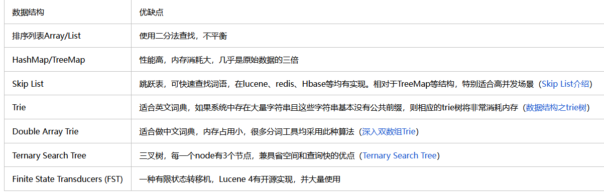

### 在线协同办公小程序开发

#### 介绍

该项目采用前后端分离开发模式，前端使用uni-app，后端使用SpringBoot，实现注册登录，人脸考勤签到，系统通知功能。

#### 前后端分离

  从本质上来看前后端分离本身并不是一个技术问题，**不仅仅是一种开发模式，而是一种架构模式**，更是一个**工程化考量和项目管理**的问题。在早些年的时候，Web化趋势还不是那么明显，JSP可以应付大多数的业务场景，但是随着整个社会信息化程度的加深，以及各种各样的服务都Web化以后，前端的页面开始变得复杂起来，**JSP这种前后端高耦合的技术**就不是那么的好用了。其本质的原因，是因为前端并没有像后端一样，工程化、模块化和可复用化的思维来做。所以项目管理者就开始对项目进行解耦。
把前端开发工作从后端中分离出来，让前端开发工程化、组件化。那么该怎么做才算是优雅的前后端分离呢？在一个正常的软件开发周期中，简化的来讲应该分为四大步：设计、开发、测试和部署。而真正的前后端分离就应该渗透到这四个步骤中的每一个步骤中去。

- 设计阶段

前端：做好充分的规划和准备，一定要满足长期可演进、可迭代的目标
后端：后端架构、系统架构设计、数据库、中间件、缓存等等，主要考虑性能、容量、扩展性和可维护性
前后端定义好**模型层面的接口约定**，包括接口的请求方式、数据类型和数据的格式等等

-  开发阶段

 前后端按照设计阶段定义好的接口独立开发，前端数据可以从事**先规划好的mock服务器**中获取，数据是完全模拟的，完全不需要依赖后端的接口。后端只需要**把接口写好**，按照之前的接口约定来提供数据即可

- 测试阶段

  在测试阶段要保证前后端独立可测试，前端主要是页面、跳转、展示、输入、传参以及响应数据的**展示**等等。后端主要保证**数据接口的提供**，如数据格式、校验、异常情况、数据的一致性问题以及权限问题等等。

- 系统部署阶段

  在部署阶段，前后端分离最重要的就是前后端项目**独立可部署**。

前后端的分离解决的一个最本质的问题，那就是**静态资源（页面）和动态资源（数据接口）的分离，**以前的JSP因为是直接把数据嵌入页面的，导致页面资源也是动态的，这样子会导致服务器性能的下降。而在进行前后端分离之后，静态资源是进入到缓存当中，这样可以有效的降低服务器的负载，提升服务器性能。同时前端只需要关注页面的样式与动态数据的解析&渲染，而后端专注于具体业务逻辑。

但是前后端分离要根据自己的实际需求来做，因为想做一个彻彻底底的前后端分离，不管你是人力成本、开发成本、工具成本还是什么部署成本呐，其实都是不小好的

#### uni-app

优点：1、**多端开发**，一套代码，多段多端运行，可以生成ios、安卓、微信小程序、支付宝小程序等。结合HBuilder（一款HTML5的Web开发工具）开发速度快。

​      2、**学习成本低**，uniapp封装的组件（丰富的插件）与微信小程序相似，并且基于vue.js，上手快。

缺点：完善性较差，uni-app问世的时间还比较短，坑多。

#### SpringBoot

Spring是一个**轻量级（在系统初始化的时候不用加载所有的服务，用户可以自己启动想要的服务）**的**控制反转（IoC)和面向切面（AOP）**的**容器 框架** 。spring是**一个IOC容器，用来管理Bean，使用依赖注入实现控制反转**，可以很方便的**整合各种框架**；提供**AOP机制**弥补OOP的代码重复问题、更方便将不同类不同方法中的共同处理抽取成切面、自动注入给方法执行，比如日志、异常等 

springmvc是**spring对web框架的一个解决方案或设计理念**，提供了一个总的前端控制器DispatcherServlet ，用来接收请求，然后定义了一套路由策略（url到handle的映射）及适配执行handle，将handle结果使用视图解析技术生成视图展现给前端。

随着Spring 的发展逐渐变得笨重，产生大量繁琐的XML配置和第三⽅整合配置。springboot是spring提供的一个快速开发工具包，其实就是Spring，它做了一些对Spring Bean的默认配置。让程序员能更方便、更快速的开发spring+springmvc 应用，**简化了配置**（约定了默认配置）**，整合了一系列的解决方案**（starter机制）、redis、 mongodb、es，核心理念：开箱即用，快速启动

#### （1）xssFliter

为加强系统的安全性，**自定义xssFliter**对请求数据进行转义，抵御跨站脚本**XSS攻击**

为了将数据中的html标签去除，需要对用户提交的数据进行转义。我们都知道Filter能在request到达servlet的服务方法之前**拦截HttpServletRequest对象**。但是HttpServletRequest中的**参数是无法改变**的，若是手动执行修改request中的参数，则会抛出异常。因此我们定义请求包装类MyXssHttpServletRequestWrapper 继承**HttpServletRequestWrapper**，这个类可以对HttpServletRequest**进行功能增强**。

1、导入依赖hutool（提供一些Utile工具类）
2、定义请求包装类MyXssHttpServletRequestWrapper 继承**HttpServletRequestWrapper**对数据进行转义
3、创建过滤器，将请求拦截并**使用自定义包装类覆盖原request**
4、主类添加@ServletComponentScan扫描过滤器(@WebFilter)

```java
  HttpServletRequest request= (HttpServletRequest) servletRequest;    //转HttpServletRequest
        XssHttpServletRequestWrapper wrapper=new XssHttpServletRequestWrapper(request);
        filterChain.doFilter(wrapper,servletResponse);
```


#### **（2）Spring AOP+Shiro+**JWT

利用**Spring AOP+Shiro+**JWT**实现**用户鉴权和RBAC模型的资源控制

> 比Spring Security更加广泛，不局限于Spring框架，使用更简单
>
> Shiro认证和授权：拦截请求，判断用户是否登录；登录了，再判断是非有权限访问该web方法
>
> shiro利用httpsession或者redis存储的用户信息保存凭证，通过过滤器对每个http请求进行认证和授权
> 如果单体，shiro可以；如果用到负载均衡，单靠shiro不够。
> 用户登录负载均衡到tomacatA的httpsession上；用户发出下个请求，tomcatB可没有httpsession。
>
> 于是引入JWT技术
>
> 原来登录凭证在服务端保存，现在将登录凭证加密后（Token）在客户端保存，每次请求都带上该凭证

**JWT兼容更多设备，后面还可以实现单点登录**


1、将token(JWT生成和验证)封装成认证对象（使用ThreadLocal保证线程安全）

2、定义认证与授权的实现方法（Realm类）
3、拦截HTTP请求，验证Token（Filter)，验证token合法性，判断是否过期，若客户端token过期，redis中的未过期则重新生成token反之重新登录。


4、把设置应用到Shiro框架（创建ShiroConfig回传四个对象）


5、 回传token：**使用AOP拦截Web对象返回方法**，从ThreadLocalToken中获取token写入返回对象，然后返回。

> 即使两个线程同时执行这段代码，它们也无法访问到对方的ThreadLocal变量。


> AOP中注解的含义
>
> @Aspect：切面。表示一个横切进业务的一个对象。它里面包含切入点(Pointcut)和Advice（通知）。
> @Pointcut：切入点。表示需要切入的位置，比如某些类或者某些方法，也就是先定一个范围。
> @Before：Advice（通知）的一种，切入点的方法体执行之前执行。
> @Around：Advice（通知）的一种，环绕切入点执行也就是把切入点包裹起来执行。
> @After：Advice（通知）的一种，在切入点正常运行结束后执行。
> @AfterReturning：Advice（通知）的一种，在切入点正常运行结束后执行，异常则不执行
> @AfterThrowing：Advice（通知）的一种，在切入点运行异常时执行。


#### （3）令牌的自动刷新

利用**ThreadLocal+Redis**实现令牌的自动刷新，降低令牌泄露的风险以及提高用户体验

##### 如何做？


> Redis:k,v可以设置过期时间，服务器缓存令牌的时间比客户端多1倍。
> 客户端5天，服务端10天，因为5天之后过期，续期刚好多5天。
>
> 长短令牌：服务端判断用哪个令牌；redis：不需要（令牌相同，只是过期时间不同）

##### 在响应中添加令牌


为什么不把Token直接写入到`OAuth2filter`？

> 往响应写数据，需要借助IO流，比较复杂，而利用AOP拦截web方法返回的R对象，在往TheadLocalToken put数据，R返回给OAuth2filter，写入响应里面返回给客户端。（在AOP和拦截器传递Token，方便其他接口取到用户信息）
>
> 同时TheadLocalToken起到线程安全的作用，避免数据覆盖
>
> 在[并发](https://so.csdn.net/so/search?q=并发&spm=1001.2101.3001.7020)请求情况下，因为每次请求都有不同的用户信息，我们必须保证每次请求保存的用户信息互不干扰，线程独立。注意：这里不是**解决多线程资源共享问题，而是要保证每个线程都有自己的用户资源，互不干扰**。
>
> ```java
> private static ThreadLocal<Map<String, Object>> cache = new ThreadLocal<Map<String, Object>>();
> ```

#### （4）人脸识别

利用**人脸识别**和地理位置实现**复杂业务的人脸考勤签到功能**

利用开源项目：arcFace，人脸识别模型，提取人脸特征，存入数据库中；
然后查询的时候，同样提取人脸特征，再到数据库采用最近邻搜索，设置相似度（百分之70-90左右，太高的模型识别不出来），为了加快检索速度，采用近似最近邻搜索算法（基于图，树，哈希：采用随机投影树，对所有的数据进行划分，将每次搜索与计算的点的数目减小到一个可接受的范围，然后建立多个随机投影树构成随机投影森林，将森林的综合结果作为最终结果。）ln（N）


#### （5）mongdb+RabbitMQ

利用**RabbitMQ**的队列机制进行**削峰**，缓解**高并发**情况下的**系统资源短缺**问题

发送全站消息通知

思路：

1. 假如只是单纯消息发送，不管有无看到（类似 UDP连接），则直接创建消息表存消息即可。
2. 但需要记录用过户已读、未读消息则需要多建用户消息记录表，同时向n个用户发送m条消息则需要在数据表中记录m*n条数据，发送消息的瞬间将有大量的性能损耗在数据库读写上，此时传统的关系型数据库则会严重影响整个系统的运行。
3. 因为消息模块的要存储的数据量太大，普通MySQL读写消耗开销过大映像性能，所以要换能存储海量数据的数据库产品，**MongoDB适合存储海量低价值的数据**（类json），正好符合消息模块的存储要求。MongoDB没有表结构，只有集合。message存储**消息主体（正文、日期、发送人）**，message_re存储**接收人（接收人、用户是否阅读等数据）**。

> 至于为什么MongoDB使用B树而不是B +树，可以从其设计的角度考虑它。  MongoDB不是传统的关系数据库，而是以BSON格式(可以认为是JSON)存储的**nosql**。
>
> Mysql是关系型数据库，最常用的是**数据遍历操作**(join)，而MongoDB它的数据不像Mysql那样表之间的关系那么强烈,因此MongoDB更多的是**单个查询**。
>
> 由于Mysql使用B+树，数据在叶节点上,叶子节点之间又通过**双向链表连接**,更加有利于数据遍历，
> 而MongoDB使用B树,所有节点都有一个数据字段。只要找到指定的索引，就可以对其进行访问。毫无疑问，**单个查询MongoDB平均查询速度比Mysql快**。
>
> B树查询时间复杂度不是固定的，它与键在树中的位置有关，最好是O(1),可能第一层就搜索完了

1. 俗话说水滴石穿，考虑到系统的健壮性，用MongoDB存储消息数据，后期用户体量上来了，发送一条公告消息要往数据库里面写入大量的数据，即便MongoDB也支撑不下来瞬时写入百万，此时可以引入消息队列MQ，然后在Java后端系统上面，用异步多线程的方法，向消息队列MQ中发送消息，这样Web系统发布公告消息的时候就不占用数据库正常的CRUD操作。
2. 系统消息保存在消息队列中，用它来做削峰填谷，系统消息最终还是要存储在数据库上面。于是我们可以这样设计，在用户登陆系统的时候，用异步线程从消息队列MQ中，接收该用户的系统消息，每一个消息的topic则对应一个用户ID，然后把系统消息存储在数据库中，最后消息队列MQ中的该条消息自动删除。

消息日积月累，MongoDB也会有撑不下来的时候，我们需要搞冷热数据分离，热数据定期归档，根据数据被使用的频率可以划分为热数据和冷数据，例如，一年内的数据被看做事热数据，超过一年的数据被当作冷数据。每天定期把冷数据从MongoDB_1转移到MongoDB_2，这样MongoDB_1的数据量减少就提高了速度，MongoDB_2存放数据量很大，但冷数据很少被使用，仅仅充当归档库而已。冷数据定期销毁，释放存储空间。假设五年以上的冷数据就被当成超期数据，删除超期数据之后归档库的空间就增加了。

3.1五种队列模式

1）简单模式：一对一

2）Work模式：一个生产者对应多个消费者，但只有一个消费者能获得消息，**具有排他性**

3）发布订阅模式：Work的改进，fanout交换器，所有消费者可以接收消息

4）路由模式：direct交换器，按照key路由，符合规则才会转发到该队列

5）主题模式：生产者将消息发送到topic交换器，交换器按照复杂的规则将消息路由到某个队列

3.2 消息持久化

消息的可靠性是RabbitMQ的特色，可靠性由消息持久化实现，可以防止在异常情况下丢失数据，交换器和队列都能持久化。
3.3 消息过期时间

默认情况下，消息是无限期存储在RabbitMQ上的，但我们可以设置过期时间，到期后无论是否已经被接受都会被RabbitMQ删除。
3.4 ACK应答

消费者接收消息之后，必须返回一个Ack应答，那么RabbitMQ才会认为这个消息接收成功，如果想要删除这条消息，消费者发送Ack应答的时候，附带一个deliverTag标志位就可以了。


针对**重复消费**：小程序每个5分钟进行轮询，如果积压得消息太多，Java系统没有接受完消息，这时候新的轮询到来，就会产生两个消费者共同接收同一个消息的情况，数据库就添加了同样的记录，如果每条MQ消息都有唯一的UUID值，第一个消费者把消息保存到数据库后，第二个消费者就无法继续保存了。

> 注册：默认系统id=0给用户id（topic）发送消息，保存到mongdb的message


> 离线过程中，消息通知保存在MQ中，用户登录后，就让MessageTask异执行接收MQ消息，然后存储到MessageRef
>
> 每5分钟，轮询接收系统消息。用户点击消息，发送ajax将该消息未读修改为已读


> 如果收发消息的时候我们的**Java代码**选择了同步执行，当用户登录的时候消息没有接收完成，那么Java代码就不会继续往下执行，会造成等待事件过长。如果选择**异步执行**，收发消息是挂载在后台的，让一个线程去执行。
>
> RabbitMQ提供了同步和异步两种收发消息模式，如果选择了异步，则需**要创建一个消费者对象挂载在后台去运行，消费者对象不会退出**，没有消息则处于等待状态，而且消费者对象只接收某个用户的消息，例如有一万人登录系统，则会创建一万个消费对象，这对操作系统虚拟机要求很高。同步收发消息，消费者对象销毁这才是可取的。所以我们可以采用**异步线程同步收发消息**。

#### （6）线程池

使用**线程池**异步发送邮件和消息，提高系统**响应速度**同时降低资源消耗

```java
// 设置核心线程数
executor.setCorePoolSize(16);
// 设置最大线程数
executor.setMaxPoolSize(16);
// 设置队列容量
executor.setQueueCapacity(32);	//防止OOM
// 设置线程活跃时间（秒）
executor.setKeepAliveSeconds(60);
// 设置默认线程名称
executor.setThreadNamePrefix("task-");
// 设置拒绝策略CallerRunsPolicy，谁提交谁处理
```

### **可迁移场景下的数字文档管理系统**

#### （1）全文检索

**Elasticsearch** 实现**全文检索**（FST存倒排索引）

#### （2）智能提示

**IK 分词器+Completion Suggester** 实现搜索智能提示

标准分词器：会把每一字都分出来，一个个字显然不太合理，小写处理

Simple Analyzer：按照非字母切分（符号被过滤），小写处理

Stop Analyzer：停用词过滤（the，a，is），小写处理

Whitespace Analyzer：按照空格切分，不转小写

IK 分词器：基于正向匹配的分词算法

```
1、IK分词器，基本可分为两种模式，一种为smart模式，一种为非smart模式
2、非smart模式所做的就是将能够分出来的词全部输出；smart模式下，IK分词器则会根据内在方法输出一个认为最合理的分词结果，这就涉及到了歧义判断

1）词典：词典的好坏直接影响分词结果的好坏（停用词），有了词典之后，就可以对输入的字符串逐字句和词典进行匹配
2）消除歧义：通过词典匹配出来的切分方式会有多种，消除歧义就是从中寻找最合理的一种方式

规则1: 比较有效文本长度
规则2: //比较词元个数，越少越好
规则3: //词元路径跨度越大越好
规则5: //词长越平均越好(词元长度相乘)
规则6: //词元位置权重比较(词元长度积),含义是选取长的词元位置在后的集合
```

**智能提示**

- Completion Suggester 提供了“自动完成（Auto Completion）”的功能，用户每输入一个字符，就需要即时发送一个查询请求到后端查找匹配项；

- 这种功能对性能的要求比较苛刻，ElasticSearch 采用了不同的数据结构，而**不是使用倒排索引**来实现；通过将 Analyzer 的数据编码成 **FST 和索引**一起存放；FST 会被 ES 整个加载进**内存**，从而达到更高的性能；

- FST （有限状态转移机）只能用于**前缀查找**；

> lucene3使用跳跃表来存储词典，lucene4使用FST来存放词典。
>
> 1）空间占用小。通过对词典中单词前缀和后缀的重复利用，压缩了存储空间；
> 2）查询速度快。O(len(str))的查询时间复杂度。
>
> 有限状态机顾明思议就是状态可以全部被列举出来，然后随着不同的操作在不同的状态之间流程。



排序列表：二分查找，不平衡

hashmap：：占用空间大

字典树（适合英文）

- 没有解决后缀共用问题，只解决了前缀共用（这也是字典树又被称之为前缀树的原因）。当数据量达到一定级别的时候，只共享前缀不共享后缀也会带来很多空间的浪费

B树  mongdb，检索慢；

B+树 mysql

- 全文索引的文本字段通常会比较长，索引值本身会占用较大空间，从而会加大 `B+` 树的深度，影响查询效率。
- 全文索引往往需要全文搜索，不遵循最左匹配原则，使用 `B+` 树可能导致索引失效。

跳跃表：内存小，但对模糊查询支持不好

FST：O(len(str))

**使用步骤**

- 定义 Mapping，将字段的 type 设置成 completion；
- 索引数据（全量，预热）进 ES；
- 运行 suggest 查询，得到搜索建议；（此时返回结果集hist为空，只有suggest有返回数据）


#### （3）**Milus 图片检索**

Milvus 首先不是一个关系型数据库，不会支持特别复杂的 JOIN 之类的查询，也不会支持 ACID 的事务

Milvus 不是一个搜索引擎，跟传统的 Elasticsearch、Solr 之间也有很大区别。

Milvus 向量数据库专为非结构化数据转换而来的 Embedding 向量的查询与检索设计，而不是传统的文本格式的数据，能够为万亿级向量数据建立索引，拥有**动态数据管理功能**，时对数据进行插入、删除、搜索等操作。建议使用k8s部署

**好处**

- 高性能：性能高超，可对海量数据集进行向量相似度检索（**近似最近邻搜索算法**）。
- 高可用、高可靠：Milvus 支持在云上扩展，其容灾能力能够保证服务高可用。
- 开发者友好：支持多语言（java，python）。
- 增量更新

> 之前，自己使用annoy算法生成索引文件，但是如何有新的数据来，索引文件又得重新生成

对于文本来说，Milvus 做的是基于语义的检索，而不是基于关键词的检索。
对于图片来说，Milvus 做的是基于视觉特征的检索，而不是基于关键词的检索。

```
文本检索：上游：BERT； 下游：mysql
问答系统：上游：BERT； 下游：mysql
推荐系统(电影特征抽取)：上游：PaddlePaddle； 下游：redis或者mysql
图片检索：上游：ResNet-50； 下游：mysql
视频推荐：上游：OpenCV抽取视频关键帧，ResNet-50图片特征向量抽取；下游：Mysql，OSS
```

**近似最近邻搜索算法**

最近k近邻搜索，太慢了，得与所有数据进行比较

> 相似度：欧式距离，预先相似度

- 基于树：Annoy 

通过建立一个二叉树来使得每个点查找时间复杂度是O(log n)

建立过程：

annoy的每一次空间划分，可以看作聚类数为2的KMeans过程。收敛后在产生的两个聚类中心连线之间建立一条垂线（图中的黑线），把数据空间划分为两部分。
在划分的子空间内不停的递归迭代继续划分，直到每个子空间最多只剩下K个数据节点，划分结束。

查询过程：

1. 将每一颗树的根节点插入优先队列; 
2. 搜索优先队列中的每一颗二叉树,每一颗二叉树都可以得到最多 Top K 的候选集
3. 删除重复的候选集; 
4.  计算候选集与查询点的相似度或者距离;
5. 返回top k 集合

影响 annoy 算法效率和精度的重要参数：

**n_trees**：表示树的棵数，会影响构建索引的时间。值越大表示最终的精度越高，但是会有更多的索引；

**search_k**：值越大表示搜索耗时越长，搜索的精度越高；

> n_trees = 100， 向量维度1000，欧式距离 search_k=10

- 基于图的索引量化法：HNSW（类似跳表）

HNSW采用类似跳表的思想，在高层跳过大量离目标点较远的点，从而快速定位到离目标较近的点，从而缩小搜索范围。

建立过程：

是通过贪心算法遍历图，找出当前数据集中的最近邻点（局部最小值），以此作为插入并构建生成层状网络图，通过在下一层中不断寻找最近邻点插入构建，从而完成对特征向量集的维度分层、数据压缩、索引生成。（第0层包含所有的数据，level1的顶点是level0的子集，是从level0的节点里随机采样的，level2是level1的子集，每个向量和与它距离最近的P个向量对应的顶点连接成边）

检索过程：

检索时，采用自上而下的搜索方式，即从最顶层开始粗略搜索，然后逐步向下层搜索，直到最底层精确搜索。

缺点：HNSW算法在查询速度和精度上优于其他算法，但是占用内存大

- 基于哈希：SLH

局部敏感：空间中距离较近的点映射后发生冲突的概率高，空间中距离较远的点映射后发生冲突的概率低。

查询过程：

计算q在每张哈希表的哈希值，取出对应哈希值的哈 希桶内所有点，与q做距离计算。

缺点：生成索引编码的结果并不稳定（哈希表的设计），查询准确率不高
用神经网络创建的哈希替换现有的 LSH 技术

### 莞工教学助手

#### 介绍

因为老师和学校需要登录不同系统是查看信息，不方便；特别是教师，如果在校外就查看不了作业，而且统计作业提交情况很繁琐，还有上课忘带学生名单；而学生上课可能忘记课室，而且不知道自己学了多少个学分。

#### （1）中文乱码

1. 通过先检测服务器编码格式，再统一编码的方法**解决中文乱码问题**

   > 要理解乱码，首先需要知道计算机是如何储存文字的，计算机只能储存 0 和 1 这些二进制数字。无论是我们文本里的数字字母、汉字、emoji都需要用某种方式转换成二进制数字进行储存，需要的时候再读出来。 比如用GBK的编码的编辑器写了一个文档发给另外一个人，另外一个人用Big5的编辑器打开就会看到乱码。
   >
   > ascii单字节编码，适用于 128 个字符。虽然英文文本 OK 但其他语言就不够用了，比如法语带音符的字母、中文汉字、日文片假名等都统统表示不了。于是不同国家和地区开始制定自己的编码标准。比如我们中国的 GB 2312（简体），港澳台的Big5（繁体），后来还有对 GB2312 进行扩展的 GBK （收录了简繁体汉字、日文、韩文等）。但标准不统一时，乱码问题也随之产生。因为计算机内存里的同一个数字，在不同字符集里代表的可能是完全不同的字符。于是大家急需一种更通用的字符编码，支持不同语言的文字。
   >
   > 于是出现了unicode字符编码（真正是字符映射到计算机存储内容的映射，比如一个表情字符的码点为12000，在计算机存储12000的二进制内容）。 unicode 如今已经囊括了 10 万多个字符，存在的问题unicode就是单个字符需要的储存空间更大。因此 UTF 32 让每个字符都以 32 bit 即 4 字节的长度来储存，但让英文使用者有点不爽。
   > ascii 编码的每个英文字母只要 1 字节，现在 UTF 32 要 4 字节，这相当于相同内容的英文文本。 GBK 里一个汉字只占俩字节，相当于用 UTF 32 的话空间会多占一倍。为了改善空间效率，拯救字符苍生的 UTF 8 在 1992 年诞生。**UTF 8 是针对 unicode 的可变长度编码**，不同于编码后长度固定为 32 bit 的 UTF 32。 UTF 8 针对不同字符，编码后的长度可以是 32 bit 24 bit 16 bit 8 bit 具体规则是，码点在 0 到 127 范围的字符直接映射为 1 字节长度的二进制数；码点在 128 到 2047 范围的字符映射为 2 字节的二进制数。（ISO 8859-1是一个单字节编码，可以代表前256个Unicode字符，iso-8859-1是不支持中文的）
   >
   > UTF 8 为了解决我们之前提到的计算机需要能够知道各个字符之间到底在哪里分割，就让 2 字节编码的第一个字节由 110 开头，表示自己及后面一个字节是一起的，都在表示同一个字符。然后第二个字节由 10 开头，unicode的二进制码点会被分割为两个部分，填入 UTF 8 编码的数字里。
   >
   > UTF 8 第一个好处是兼容 ascii unicode；第二个好处是节约空间。
   >
   > “锟斤拷”一般在 UTF 8 和中文编码比如和 GBK的转换过程中产生。 unicode 字符集有一个特殊的替换符号，专门用于表示无法识别或展示的字符。而在 UTF 8 编码后是这个 3 字节长度的二进制 efbfbd efbfbd ，而efbf bdef bfbd 如果这个时候把文件再用 GBK编码读取就是锟斤拷

   ```java
   name=new String(name.getBytes("GBK"),"iso-8859-1");
   (2)客户端是GBK，ftp服务器（默认GBk）中的设置就已经是utf-8的编码，所以肯定还是会出现乱码的问题。
       它向服务器发送了OPTS UTF8 ON命令，来开启服务器对UTF-8的支持
       如果服务器支持UTF-8我们就用UTTF-8，否则我们就用本地编码（GBK）来处理中文文件名。
   
   private static String LOCAL_CHARSET = "GBK"; //看服务器是否支持UTF8
   private static String SERVER_CHARSET = "ISO-8859-1";
   fileName = new String(fileName.getBytes(LOCAL_CHARSET),SERVER_CHARSET);
   
   //上传中文文件名
   ```

   ```java
   //（1）http请求参数中文乱码问题
   //方法1
   String userName = new String(userName.getBytes("ISO-8859-1"), "UTF-8");
   
   
   //方法2
   //1）指定请求数据的字符集为 utf-8 格式
   //2）通过 @RequestMapping 中的 produces 属性解决，指定接收方的响应数据字符集为 utf-8
   
   //数据库 昵称emoji表情包乱码，或者评论
   UTF-8是使用1~4个字节，一种变长的编码格式，字符编码。mb4即 most bytes 4，使用4个字节来表示完整的UTF-8。
   mysql的 utf8 编码最大字符长度为 3 字节，如果遇到 4 字节的宽字符就会插入异常了。所以推荐使用utf8mb4
   MySQL在5.5.3之后增加了这个utf8mb4的编码
   //1.保存前使用emoji的官方jar包提供的方法将表情转成代码，再保存
   //2.设置数据库的字符编码为支持emoji表情的字符集:utf8mb4
   //3.降级，不允许插入emoji
   ```


####   （2）模拟登录

利用（Requests库）爬虫技术**模拟登录**（非暴力入侵），**自动爬取**教务处上的信息，例如：成绩，课表等

突破登录限制：第一步需要进行网页调试，找登录的链接；然后将用户名，密码，post请求下，返回成功登录；但是此时我去请求登录后的一些页面失败，说是登录失败；后面，我再去网页调试（请求是顺序的），发现登录请求成功后，还需要再请求一个页面，它的这个页面是获取登录后的cookie，于是，我将获得Cookie放到请求头里，再次请求可是还是失败；于是我再次去看了下实际的请求，发现post请求header里面加入了参数Referer，最终成功了。

#### 	（3）Jsoup

3. 使用**Jsoup**解析页面数据，存入数据库中并**集成JSON API**，为小程序提供数据来源

Jsoup是一款*Java* 的HTML解析器，可直接解析某个URL地址、HTML文本内容。可通过DOM，CSS以及类似于jQuery的操作方法来取出和操作数据。

```java
Document doc = Jsoup.parse(html);
Elements links = doc.select("a[href]"); // 具有href 属性的链接
Elements pngs = doc.select("img[src$=.png]");//所有引用png图片的元素
Element masthead =doc.select("div.masthead").first();
```

存入数据库后，将每一个功能封装成一个个接口，比如：将成绩数据爬取下来，进行结构化处理，然后封装一个成绩查询的接口也就是我们的JSON API。

#### 	（4）Ngrok

4. 使用Ngrok实现**内网渗透**，访问内网的FTP服务器，**解决外网无法访问内网**的难题

> 内网主机搭建一个ngrok客户端（只转发请求）<=>公网ngrok服务端通信<=>客户端，ngrok客户端要和服务端建立http连接
>
> 这样子我们内网程序的服务就可以通过ngrok暴露给公网

#### 	（5）动态IP代理

5. 利用**动态IP代理**技术，解决因频繁访问校园服务器导致腾讯云**服务器IP被封**的问题

动态代理IP，市面上有付费的，不过比较贵。所以我自己搭建了一个代理IP池。
首先，去一个免费的IP代理网站，去爬取那些响应速度快的IP，并测试下能否访问目标服务器，可以的话加入IP代理池；有了这些IP之后，我就可以设置对应的IP去请求我们的目标网址。那怎么请求呢？

请求策略：

- 首先从IP代理池随机分配一个IP，然后根据IP的请求次数来判断是否需要更换代理，如果该IP请求次数超过30次，那就删除该IP，继续更换代理IP。
- 如果该IP已经到达过期时间，1800秒+随机一个50到200秒，也进行同样操作。
- 如果在请求的时候，发生异常或者超时我们也更改代理IP。
- 最后，IP代理池空了就更新整个IP代理池。

#### 	（6）项目部署

6. 将项目**部署到腾讯云服务器**，买服务器，注册域名，把域名填在微信小程序合法的域名列表里面，并在微信小程序上**发布上线**，该项目获得中国大学生计算机设计大赛国赛二等奖

> 在服务器搭建环境，部署好项目，然后需要进行域名的备案，再将域名填写到微信小程序的请求域名里面，最后还需要将小程序提交审核，才能上线。

### 2021软件精英挑战赛


### 2022软件精英挑战赛

