《Java 核心技术卷I：基础知识》 《Java 核心技术卷II：高级特性》

深入理解java虚拟机

Java并发编程的艺术

Java高*并发*核心*编程*(卷2)

阿里巴巴Java开发手册

Effective Java

代码整洁之道

重构 改善既有代码的设计

剑指 Offer

- LeetCode Hot100 道：https://leetcode-cn.com/problem-list/2cktkvj/
- LeetCode 精选算法 200 题：https://leetcode-cn.com/problem-list/qg88wci/

图解 HTTP

图解 TCP / IP

图解设计模式

黄健宏 Redis设计与实现

蒋德钧 Redis 核心技术与实战

林晓斌的《MySQL 实战 45 讲》《高性能MySQL》和《MySQL技术内幕-InnoDB存储引擎》

《RabbitMQ 实战：高效部署分布式消息队列》（经典）

鸟哥的 Linux 私房菜


## 二叉树


## BFS_DFS_回溯

### 回溯

#### [17. 电话号码的字母组](https://leetcode-cn.com/problems/letter-combinations-of-a-phone-number)

```java
/*
思路：回溯+HashMap
1.先用HashMap存储数字对应的字符串
2.回溯每一个数字对应的字符串
    当长度==数字字符串长度，加入结果集
    for(遍历当前数字对应的字符串){
        选择
        回溯
        撤销
    }
*/
class Solution {
    HashMap<Character,String> map;
    StringBuffer path = new StringBuffer();
    List<String> res = new ArrayList<>();
    void backtrace(String digits,int k){
        if(k == digits.length()){
            res.add(path.toString());
            return;
        }
        
        String cur = map.get(digits.charAt(k));
        for(int i=0;i<cur.length();i++){
            path.append(cur.charAt(i));
            backtrace(digits,k+1);
            path.deleteCharAt(k);        //注意撤销的是当前的k
        }
    }
    public List<String> letterCombinations(String digits) {
        if(digits.length() == 0) return res;
        map = new HashMap<>(){{
            put('2', "abc");
            put('3', "def");
            put('4', "ghi");
            put('5', "jkl");
            put('6', "mno");
            put('7', "pqrs");
            put('8', "tuv");
            put('9', "wxyz");
        }};
        backtrace(digits,0);
        return res;
    }
}
```

#### [22. 括号生成](https://leetcode-cn.com/problems/generate-parentheses/)

```java
/*
思路：回溯
长度 == 2*n，加入结果集
左括号<n，回溯左括号
右括号<左括号，回溯右括号
*/
class Solution {
    StringBuffer path = new StringBuffer();
    List<String> res = new ArrayList<>();
    void bacetrace(int left,int right,int n){
        if(path.length() == 2*n){
            res.add(path.toString());
            return;
        }
        if(left < n){
            path.append("(");
            bacetrace(left+1,right,n);
            path.deleteCharAt(path.length()-1);
        }
        if(right < left){
            path.append(")");
            bacetrace(left,right+1,n);
            path.deleteCharAt(path.length()-1);
        }
    }
    public List<String> generateParenthesis(int n) {
        bacetrace(0,0,n);
        return res;
    }
}
```


### DFS


### DFS+回溯

#### [36. 有效的数独](https://leetcode.cn/problems/valid-sudoku/)

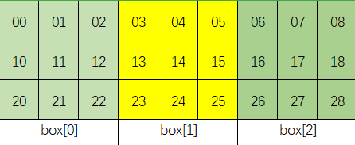

```java
/*
一次遍历
思路：遍历到每个数的时候，例如boar[i][j]，我们判断其是否满足三个条件：
    在第 i 个行中是否出现过
    在第 j 个列中是否出现过
    在第 box是否出现过
*/
class Solution {
    public boolean isValidSudoku(char[][] board) {
        boolean[][] row = new boolean[9][10];// 存储每一行的每个数是否出现过,10为了下标有9（数字1-9）
        boolean[][] col = new boolean[9][10];// 存储每一列的每个数是否出现过,10为了下标有9
        boolean[][][] box = new boolean[3][3][10];// 9个box

        for(int i=0;i<9;i++){
            for(int j=0;j<9;j++){
                if(board[i][j] == '.') continue;
                int num = board[i][j]-'0';
                if(row[i][num] || col[j][num] || box[i/3][j/3][num]) return false;
                row[i][num] = true;
                col[j][num] = true; 
                box[i/3][j/3][num] =true;
            }
        }
        return true;
    }
}
```

#### [37. 解数独](https://leetcode.cn/problems/sudoku-solver/)

```java
/*
思路：DFS+回溯
1) 首先遍历矩阵，将'.'对应的坐标放入space列表中；数字字符的将对应位置的行，列，box置为true
2）dfs（board,0）
    如果pos == space的大小，证明已经遍历完了，为有效数独，valid = true
    for(遍历9个格子并且valid == false){ //valid为true，则提前结束
        选择，dfs，撤销
    }
*/
class Solution {
    boolean[][] row = new boolean[9][10];
    boolean[][] col = new boolean[9][10];
    boolean[][][] box = new boolean[3][3][10];
    List<int[]> space = new ArrayList<int[]>();
    boolean valid = false;
    void dfs(char[][] board,int pos){
        if(pos == space.size()){
            valid = true;
            return;
        }
        int[] cur = space.get(pos); //i,j待填位置
        int i=cur[0], j =cur[1];
        for(int num=0;num < 9 && !valid; num++){
            if(!row[i][num] && !col[j][num] && !box[i/3][j/3][num]){
                row[i][num] = col[j][num] = box[i/3][j/3][num]=true;
                board[i][j] = (char)(num + 1 + '0');    //填入x+1，注意
                dfs(board,pos+1);
                row[i][num] = col[j][num] = box[i/3][j/3][num]=false;
            }
        }
    }
    
    public void solveSudoku(char[][] board) {
        for(int i=0;i<9;i++){
            for(int j=0;j<9;j++){
                if(board[i][j] == '.') space.add(new int[]{i,j});
                else{
                    int num = board[i][j]-'0'-1;    //需要减去1，下标从0开始
                    row[i][num] = col[j][num] = box[i/3][j/3][num]=true;
                }
            }
        }
        dfs(board,0);
    }
}
```


### BFS


## 贪心算法


#### [31. 下一个排列](https://leetcode.cn/problems/next-permutation/)

```java
/*
T:O(n) S:O(1)  贪心
我们希望下一个数比当前数大，这样才满足“下一个排列”的定义。因此只需要将后面的「较大数」与前面的「较小数」交换
1.先找出最大的索引 i 满足 nums[i] < nums[i+1]，如果不存在，就翻转整个数组；
2.再找出另一个最大索引 j 满足 nums[j] > nums[i]；
交换 nums[i] 和 nums[j]；
3.最后翻转 nums[i+1:]。


[1,2,4,3]
i=1， j=3
[1,3,4,2]
[1,3,2,4]  翻转[i+1:]

*/
class Solution {
    public void swap(int[] nums,int i,int j){
        int tmp = nums[i];
        nums[i] = nums[j];
        nums[j] = tmp;
    }
    public void reverse(int[] nums, int start) {
        int left = start, right = nums.length - 1;
        while (left < right) {
            swap(nums, left, right);
            left++;
            right--;
        }
    }
    public void nextPermutation(int[] nums) {
        int i = nums.length-2;  //从倒数第2个开始
        while(i >= 0 && nums[i] >= nums[i+1]){   //从后面开始找
            i--;
        }
        if(i >= 0){ //找到了 
            int j = nums.length-1;
            while(j >= 0 && nums[i] >= nums[j]){ //从后面开始找
                j--;
            }
            swap(nums,i,j);
        }
        
        reverse(nums,i+1);
    }
}
```


## 指针类问题


### 滑动窗口


#### [3. 无重复字符的最长子串](https://leetcode-cn.com/problems/longest-substring-without-repeating-characters)

```java
/*
思路：滑动窗口+hashSet，用HashSet保存不重复的字符窗口，r=-1
遍历字符串
    1.不为第一个字符时，字符窗口滑出第i-1个字符；
    2.当前字符不在set中，并且r+1<字符串长度，r指针一直向右，直到遇到重复字符才停止
    3.记录当前最大值
*/

class Solution {
    HashSet<Character> set = new HashSet<>();
    public int lengthOfLongestSubstring(String s) {
        int len = s.length();
        int r = -1, res = 0;
        for(int i=0;i<len;i++){
            if(i > 0) set.remove(s.charAt(i-1));
            while(r+1 < len && !set.contains(s.charAt(r+1))){
                set.add(s.charAt(r+1));
                r++;
            }
            res = Math.max(res,r-i+1);
        }
        return res;
    }
}

/*DP*/
class Solution {
    public int lengthOfLongestSubstring(String s) {
        Map<Character,Integer> dic = new HashMap<>();   //哈希表
        //dp[i]表示以字符s[j]结尾的最长不重复子串
        int res=0,tmp=0;
        for(int j=0;j<s.length();j++){
            int i = dic.getOrDefault(s.charAt(j),-1);   //获取i的索引,-1位默认值
            dic.put(s.charAt(j),j); //更新哈希表
            tmp = tmp < j-i ? tmp+1:j-i;//dp[j-1] < j-i，则最长长度为tmp+1，否则有重复的，j-i
            res = Math.max(res,tmp);    //max(dp[j-1],dp[j])
        }
        return res;
    }
}
```

#### [395. 至少有 K 个重复字符的最长子串](https://leetcode.cn/problems/longest-substring-with-at-least-k-repeating-characters/)

```java

```

### 首尾指针

#### [11. 盛最多水的容器](https://leetcode.cn/problems/container-with-most-water/)

```java
/*
思路：首尾指针
*/
class Solution {
    public int maxArea(int[] height) {
        int l=0,r=height.length-1;
        int res = 0;
        while(l < r){
            int area = (r-l)*Math.min(height[l],height[r]);
            res = Math.max(area,res);
            if(height[l] < height[r]) l++;
            else r--;
        }
        return res;
    }
}
```

### 快慢指针

#### [19. 删除链表的倒数第 N 个结点](https://leetcode.cn/problems/remove-nth-node-from-end-of-list/)

```java
/**
思路：快慢指针+dummy    
1.dummy处理头结点
2.快指针先前进k+1,多了个dummy结点
3.快慢指针同时遍历到链表结尾，此时慢指针指向的就是倒数第k个结点，将该结点删除
 */
class Solution {
    public ListNode removeNthFromEnd(ListNode head, int k) {
        ListNode dummy = new ListNode(0);
        dummy.next = head;  
        ListNode fast=dummy,slow=dummy;
        for(int i=1;i<=k+1;i++){   
            fast = fast.next;
        }
        while(fast != null){
            fast = fast.next;
            slow = slow.next;
        }
        //[1,2,3,4,5]
        //倒数第k个结点的前一个结点：3
        //删除后[1,2,3,5]
        slow.next = slow.next.next;
        return dummy.next;
    }
}
```


## 二分查找


### 几数之和系列

#### [1. 两数之和](https://leetcode.cn/problems/two-sum/)

```java
/*
哈希
数组没有排序的
思路：HashMap存数字以及对应的下标，边遍历边存值
*/
class Solution {
    public int[] twoSum(int[] nums, int target) {
        HashMap<Integer,Integer> map = new HashMap<>();
        int len = nums.length;
        for(int i=0;i<len;i++){ //边遍历边存值
            int key = target-nums[i];
            if(map.containsKey(key)) return new int[]{i,map.get(key)};
            map.put(nums[i],i);
        }
        return new int[0];
    }
}
```

#### [15. 三数之和](https://leetcode.cn/problems/3sum/)

```java
/*
思路：三指针
1.先排序去重
2.先固定a
3.剩下b，c，用二分查找，
    查找到，还需要将l，r去重后继续遍历
*/
class Solution {
    public List<List<Integer>> threeSum(int[] nums) {
        List<List<Integer>> res = new ArrayList<>();
        int len = nums.length;
        Arrays.sort(nums);
        for(int i=0;i<len;i++){
            if(nums[i] > 0) break;  
            if(i>0 && nums[i] == nums[i-1]) continue;
            int l=i+1;
            int r=len-1;
            while(l<r){
                int sum = nums[i] + nums[l] + nums[r];
                if(sum == 0){
                    res.add(new ArrayList<>(Arrays.asList(nums[i],nums[l],nums[r])));
    // 还要去重，比如: [-2, -1, -1, -1, 3, 3, 3]
//i = 0, left = 1, right = 6, [-2, -1, 3] 的答案加入后，需要排除重复的 -1 和 3
                    while(l<r && nums[l] == nums[l+1]) l++; // 确保b改变去重
                    while(l<r && nums[r] == nums[r-1]) r--; // 确保c改变去重
                    l++;    //继续while遍历
                    r--;

                }else if(sum > 0) r--;
                else l++;
            }
        }
        return res;
    }
}
```

#### [18. 四数之和](https://leetcode.cn/problems/4sum/)

```java
/*
思路：和三数之和一样
不过要注意越界溢出，用long类型
*/
class Solution {
    public List<List<Integer>> fourSum(int[] nums, int target) {
        List<List<Integer>> res = new ArrayList<>();
        int len = nums.length;
        Arrays.sort(nums);
        for(int a=0;a<len;a++){
            if(a > 0 && nums[a] == nums[a-1]) continue;
            for(int b=a+1;b<len;b++){           //注意a+1
                if(b > a+1 && nums[b] == nums[b-1]) continue;   //注意a+1
                int l = b + 1;
                int r = len - 1;
                
                while(l<r){
                    long sum  =  (long)nums[a] + nums[b] + nums[l] + nums[r];
                    if(sum == target){
                        res.add(new ArrayList<>(Arrays.asList(nums[a],nums[b],nums[l],nums[r])));
                        while(l < r && nums[l] == nums[l+1]) l++;
                        while(l < r && nums[r] == nums[r-1]) r--;
                        l++;
                        r--;

                    }else if(sum > target) r--;
                    else l++;
                }
            }
        }
        return res;
    }
}
```

#### [16. 最接近的三数之和](https://leetcode.cn/problems/3sum-closest/)

```java
/**
思路：
差值绝对值=（三数和-目标值），二分查找保存最小的差值
 */
class Solution {
    public int threeSumClosest(int[] nums, int target) {
        int len = nums.length;
        Arrays.sort(nums);
        int cha = Integer.MAX_VALUE;
        int res = 0;
        for(int a=0;a<len;a++){
            int l = a + 1;
            int r = len -1;
            while(l < r){
                int sum = nums[a] + nums[l] + nums[r];
                if(Math.abs(sum - target) < cha){
                    cha = Math.abs(sum - target);
                    res = sum;
                }
                if(sum >= target) r--;
                else l++;
            }
        }
        return res;
    }
}
```

#### [259. 较小的三数之和](https://leetcode.cn/problems/3sum-smaller/)

```

```

#### [167. 两数之和 II - 输入有序数组](https://leetcode.cn/problems/two-sum-ii-input-array-is-sorted/)

```java
/*
思路：二分
*/
class Solution {
    public int[] twoSum(int[] nums, int target) {
        int len = nums.length;
        int l=0,r=len-1;
        while(l<r){
            int sum = nums[l]+nums[r];
            if(sum == target) return new int[]{l+1,r+1};
            else if(sum > target) r--;
            else l++;
        }
        return new int[0];
    }
}
```

#### [170. 两数之和 III 数据结构设计](https://leetcode.cn/problems/two-sum-iii-data-structure-design/)

```

```

### 搜索数组

#### [33. 搜索旋转排序数组](https://leetcode.cn/problems/search-in-rotated-sorted-array/)

```java
/*
二分
1）nums[mid] == target，直接返回
2）nums[0] <= nums[mid]，则[l,mid-1]有序
看target是否在[0,mid-1]，是的话,r=mid-1；否则l=mid+1
3）nums[0] > nums[mid]，则[mid+1,r]有序
看target是否在[mid+1,n-1]，是的话,l=mid+1，否则r=mid-1
*/
class Solution {
    public int search(int[] nums, int target) {
        int len = nums.length;
        int l = 0 ,r = len-1;
        while(l <= r){
            int mid = l+((r-l)>>1);
            if(nums[mid] == target) return mid;
            else if(nums[0] <= nums[mid]) {	//表明[l,mid]有序
                if(nums[0] <= target && target < nums[mid]) r=mid-1;   //看target是否在[0,mid-1]
                else l = mid + 1;
            }
            else{   //看target是否在[mid+1,len-1]
                if(nums[mid] < target && target <= nums[len-1]) l = mid +1;
                else r = mid - 1;
            }
        }
        return -1;
    }
}
```

#### [81. 搜索旋转排序数组 II](https://leetcode.cn/problems/search-in-rotated-sorted-array-ii/)

```java
/*
33题.数组中无重复元素，比较nums[0]   [0,mid] [mid,n-1]

本题：比较nums[l]
对于数组中有重复元素的情况，二分查找时可能会有 a[l]=a[mid]=a[r],此时无法判断区间 [l,mid] 和区间 [mid+1,r] 哪个是有序的。
当nums[l] == nums[mid], l++；然后再做二分
*/
class Solution {
    public boolean search(int[] nums, int target) {
        int len = nums.length;
        int l=0,r=len-1;
        while(l<=r){
            int  mid = l+((r-l)>>1);
            if(nums[mid] == target) return true;
            
            if(nums[mid] == nums[l]) l++;  //注意
            else if(nums[l] <= nums[mid]){   //[l,mid)
                if(nums[l] <= target && target < nums[mid]) r = mid -1;
                else l = mid +1;
            }else{
                if(nums[mid] < target && target <= nums[len-1]){
                    l = mid + 1;
                }else r = mid -1;
            }
        }
        return false;
    }
}
```

#### [34. 在排序数组中查找元素的第一个和最后一个位置](https://leetcode-cn.com/problems/find-first-and-last-position-of-element-in-sorted-array/) 🀄️ 左边+右边

```c++
/*
二分查找
[5,7,7,8,8,10] 8
思路：先找7的最后下标x1(3)，再找8的最后下标x2(5)
答案为{3,5-1}
*/
class Solution {
    int get(int[] nums,int target){
        int l=0,r=nums.length-1;
        while(l<=r){
            int mid = l + ((r-l)>>1);
            if(nums[mid] <= target) l = mid + 1;
            else r = mid - 1;
        }
        return l;
    }
    public int[] searchRange(int[] nums, int target) {
        int l = get(nums,target-1), r= get(nums,target);
        if(l == r) return new int[]{-1,-1};
        return new int[]{l,r-1};
    }
}
```

#### [35. 搜索插入位置](https://leetcode.cn/problems/search-insert-position/)

```java
/*
二分
小于target的位置插入
*/
class Solution {
    public int searchInsert(int[] nums, int target) {
        int l = 0 ,r = nums.length-1;
        while(l<=r){
            int mid = l + ((r-l)>>1);
            if(nums[mid] < target) l = mid + 1;    //遍历方向 看比较值
            else r = mid -1;

        }    
        return l;
    }
}
```

## DP

### 最长串

#### [5. 最长回文子串](https://leetcode.cn/problems/longest-palindromic-substring/)

```java
/*
思路：DP
dp[i][j]表示s[i,j]是否为回文串
当且仅当 s[i] == s[j] && dp[i+1][j-1]也为回文串=>dp[i][j]是回文串
1.先遍历长度
2.遍历左指针，右指针=L+左指针-1，（左指针一直右移）
    1）右指针越界，break
    2）s[i] != s[j]时，直接dp[i][j] = false;
    相等时{
        判断j-i+1 <= 3，是表明此时中间只有一个字符，s[i][j]就是回文串
        否，则需要根据dp[i+1][j-1]来判断
    }
    3)维护最大长度和开始下标
*/
class Solution {
    public String longestPalindrome(String s) {
        int len = s.length();
        if(len < 2) return s;
        boolean[][] dp = new boolean[len][len];
        for(int i=0;i<len;i++) dp[i][i] = true; //单个字符为回文串

        int begin=0,maxLen = 1;
        for(int L = 2; L <=len;L++){ //遍历长度，此时要等于len
            for(int i=0;i<len;i++){ //遍历左指针
                int j = L + i -1;   //右指针
                if(j >= len) break;  //越界

                if(s.charAt(i) != s.charAt(j)){
                    dp[i][j] = false;
                }else{
                    if(j-i+1 <= 3){ //当前长度<=3
                        dp[i][j] = true;
                    }else{
                        dp[i][j] = dp[i+1][j-1];
                    }
                }
                if(j-i+1 > maxLen && dp[i][j]){ //维护最大长度和开始下标
                    maxLen = j - i + 1;
                    begin = i;
                }

            }
        }
        return s.substring(begin,begin+maxLen);
    }
}
```

#### [32. 最长有效括号](https://leetcode.cn/problems/longest-valid-parentheses/)

```java
/*
思路：
dp[i]表示以下标 i 字符结尾的最长有效括号的长度。

....(   不可能以'('结尾

     i
....() dp[i] = dp[i-2]+2

         i
....((..))  
(..)这个是dp[i-1]
((..))则为dp[i-1]+2
再看最前面的....是否存在，存在则为dp[i-dp[i-1]-2]
*/
class Solution {
    public int longestValidParentheses(String s) {
        int n =s.length();
        int[] dp = new int[n];
        int res=0;
        for(int i=1;i<n;i++){
            if(s.charAt(i) == ')'){
                if(s.charAt(i-1) == '('){
                    if(i-2>=0) dp[i] = dp[i-2]+2;
                    else dp[i] = 2; //只有2个字符时
                }else if(i-dp[i-1]-1 >= 0 && s.charAt(i-dp[i-1]-1) == '('){ //嵌套
                    if(i-dp[i-1]-2 >=0) dp[i] = dp[i-1]+2+dp[i-dp[i-1]-2];
                    else dp[i] = dp[i-1] +2;
                }
            }
            res = Math.max(res,dp[i]);
        }
        return res;
    }
}
```


## 数据结构


## 基础

### 哈希


### 模拟

#### [2. 两数相加](https://leetcode.cn/problems/add-two-numbers/)

```java
/**
思路：模拟
1.dummy结点
2.当前和sum=a+b+进位c，更新进位，dummy的next指向new的结点(sum%10)
3.遍历完，注意处理最后一个有没有进位
 */
class Solution {
    public ListNode addTwoNumbers(ListNode l1, ListNode l2) {
        ListNode dummy = new ListNode(0);
        ListNode node = dummy;
        int c = 0; //进位
        while(l1 != null || l2 != null){
            int a = l1 == null?0:l1.val;
            int b = l2 == null?0:l2.val;
            int sum = a + b + c;
            c = sum/10;
            node.next = new ListNode(sum%10);
            node = node.next;
            if(l1!=null) l1 = l1.next;
            if(l2!=null) l2 = l2.next;
        }
        if(c == 1) node.next = new ListNode(1); //处理最后一个进位
        return dummy.next;
    }
}
```

#### [6. Z 字形变换](https://leetcode.cn/problems/zigzag-conversion/)

```java
/*
思路:模拟，用StringBuffer数组存每一行字符
遍历字符串，下标index < len
    1）从上到下，超出行数跳出，行数-=2，（此时判断index是否越界）
    2）从下到上，行数<0，跳出，行数+=2
*/
class Solution {
    public String convert(String s, int numRows) {
        if(numRows == 1) return s;
        StringBuffer[] res = new StringBuffer[numRows];
        for(int i=0;i<numRows;i++) res[i] = new StringBuffer(); // 初始化

        int len = s.length();
        int row = 0;
        int index = 0;
        while(index < len){
            while(index < len && row < numRows){   //从上到下
                res[row].append(s.charAt(index++));
                row++;
            }
            row -= 2;   //反向

            if(index > len) break; //越界

            while(index < len && row >= 0){        //从下到上
                res[row].append(s.charAt(index++));
                row --;
            }
            row += 2;
        }
        StringBuffer ans= new StringBuffer();
        for(int i=0;i<numRows;i++) ans.append(res[i]);
        return ans.toString();
    }
}
```

#### [7. 整数反转](https://leetcode.cn/problems/reverse-integer/)

```java
/*
模拟
注意越界
*/

class Solution {
    public int reverse(int x) {
        int res = 0;
        while(x != 0){
            if(res > Integer.MAX_VALUE/10 || res < Integer.MIN_VALUE/10) return 0;
            res = x%10 + res*10;
            x /= 10;
        }
        return res;
    }
}
```

#### [8. 字符串转换整数 (atoi)](https://leetcode.cn/problems/string-to-integer-atoi/)

#### [剑指 Offer 67. 把字符串转换成整数](https://leetcode.cn/problems/ba-zi-fu-chuan-zhuan-huan-cheng-zheng-shu-lcof/)

```java
/*
思路：模拟
1.空格处理
2.符号处理
3.非数字字符处理
4.越界
*/
class Solution {
    public int myAtoi(String str) {
        char[] nums = str.trim().toCharArray();    //1.处理空格
        if(nums.length == 0) return 0;
        int sign = 1,i=1;       //2.处理符号位
        if(nums[0] == '-') sign = -1;
        else if(nums[0] != '+') i = 0;

        int res=0,broad=Integer.MAX_VALUE/10;
        for(;i<nums.length;i++){
            if(nums[i] < '0'|| nums[i] > '9') break;//3.非字符处理(比4优先处理)
            if(res > broad || (res == broad && nums[i] >'7')){ //4.越界处理
                return sign == 1 ? Integer.MAX_VALUE:Integer.MIN_VALUE;
            }
            res = res*10+(nums[i]-'0');
        }
        return sign*res;
    }
}
```

#### [12. 整数转罗马数字](https://leetcode-cn.com/problems/integer-to-roman/)

```java
/*
思路：LinkedHashMap
1.LinkedHashMap从大到小存储数字和对应的字符
2.做减法：从大到小遍历Map，取出key，将num减去key，直到为0
*/
class Solution {
    public String intToRoman(int num) {
        LinkedHashMap<Integer,String> map = new LinkedHashMap<>(){{
            put(1000, "M");
            put(900,  "CM");
            put(500,  "D");
            put(400,  "CD");
            put(100,  "C");
            put(90,   "XC");
            put(50,   "L");
            put(40,   "XL");
            put(10,   "X");
            put(9,    "IX");
            put(5,    "V");
            put(4,    "IV");
            put(1,    "I");
         } };
       
       StringBuffer res = new StringBuffer();
       for(Map.Entry<Integer,String> it:map.entrySet()){
           int key = it.getKey();
           String value = it.getValue();
           while(num >= key){
               num -= key;
               res.append(value);
           }
           if(num == 0) break;
       }
        return res.toString();
    }
}
```

#### [13. 罗马数字转整数](https://leetcode.cn/problems/roman-to-integer/)

```java
/*
思路：HashMap
遍历字符串
    判断当前字符是否 < 下一个字符，是的话减去当前值；
    否则加上当前值
*/
class Solution {
    public int romanToInt(String s) {
        HashMap<Character,Integer> map = new HashMap<>(){{
            put('I',1);
            put('V',5);
            put('X',10);
            put('L',50);
            put('C',100);
            put('D',500);
            put('M',1000);
        }};
        int len = s.length();
        int res = 0;
        for(int i=0;i<len;i++){
            int value = map.get(s.charAt(i));
            if(i+1 < len && value < map.get(s.charAt(i+1))) res -= value;
            else res += value;
        }
        return res;
    }
}
```

#### [14. 最长公共前缀](https://leetcode-cn.com/problems/longest-common-prefix)

```java
/*
思路：直接遍历
*/
class Solution {
    public String getPrex(String a,String b){
        int len1=a.length(),len2=b.length();
        int i = 0;
        StringBuffer res = new StringBuffer();
        while(i < len1 && i < len2){
            if(a.charAt(i) == b.charAt(i)){
                res.append(a.charAt(i++));
            }else{
                break;
            }
        }
        return res.toString();
    }
    public String longestCommonPrefix(String[] strs) {
        int len = strs.length;
        if(len == 1) return strs[0];
        String prex=strs[0];    //第一个前缀
        for(int i=1;i<len;i++){
            prex = getPrex(prex,strs[i]);
            if("".equals(prex)) break;
        }
        return prex;
    }
}
```

#### [29. 两数相除](https://leetcode.cn/problems/divide-two-integers/)

```java
/*
思路：
举个例子：11 除以 3 。
首先11比3大，结果至少是1，
 然后我让3翻倍(3+3)，就是6，发现11比3翻倍后还要大，那么结果就至少是2了，
那我让这个6再翻倍，得12，11不比12大，吓死我了，差点让就让刚才的最小解2也翻倍得到4了。但是我知道最终结果肯定在2和4之间。也就是说2再加上某个数，这个数是多少呢？我让11减去刚才最后一次的结果6，剩下5，我们计算5是3的几倍，也就是除法，看，递归出现了。说得很乱，不严谨，大家看个大概，然后自己在纸上画一画，或者直接看我代码就好啦！
*/
class Solution {
	//divisor除数
    int divide(int dividend, int divisor) {
        if(dividend == 0) return 0;
        if(divisor == 1) return dividend;
        if(divisor == -1){	//（1）处理-1
            if(dividend>Integer.MIN_VALUE) return -dividend;// 只要不是最小的那个整数，都是直接返回相反数就好啦
            return Integer.MAX_VALUE;// 是最小的那个，那就返回最大的整数啦
        }

        long a = dividend;
        long b = divisor;
        int sign = 1;       //（2）处理符号
        if((a>0&&b<0) || (a<0&&b>0)){
            sign = -1;
        }
        //（3）a，b都转化为正数
        a = a>0?a:-a;
        b = b>0?b:-b;
        int res = div(a,b);	//(4)递归
        if(sign>0) return res>Integer.MAX_VALUE?Integer.MAX_VALUE:res;
        return -res;
    }
    int div(long a, long b){  // 似乎精髓和难点就在于下面这几句
        if(a<b) return 0;   
        int count = 1;
        long tb = b;                // 在后面的代码中不更新b
        while((tb+tb)<=a){
            count = count + count;  // 最小解翻倍
            tb = tb+tb;             // 当前测试的值也翻倍
        }
        return count + div(a-tb,b); //a每次减少tb
    }
}

```

#### [30. 串联所有单词的子串](https://leetcode.cn/problems/substring-with-concatenation-of-all-words/)

```

```


#### [438. 找到字符串中所有字母异位词](https://leetcode.cn/problems/find-all-anagrams-in-a-string/)

```

```

#### [38. 外观数列](https://leetcode.cn/problems/count-and-say/)

```java
/*
模拟
遍历当前字符串
	连续右边界右移；
	将pos-start，以及str.charAt(start) 加入结果 （几个连续字符，以及对应字符）
	继续更新左边界=pos
*/
class Solution {
    public String countAndSay(int n) {
        String str = "1";                //从S1开始
        for (int i = 2; i <= n; ++i) {
            StringBuilder sb = new StringBuilder();
            int start = 0;//左边界
            int pos = 0;//右边界

            while (pos < str.length()) {//遍历当前字符串
                //有几个连续，则右边界右移
                while (pos < str.length() && str.charAt(pos) == str.charAt(start)) {
                    pos++;
                }
                sb.append(String.valueOf(pos - start)).append(str.charAt(start));
                //更新左边界
                start = pos;
            }
            str = sb.toString();    //Sn
        }
        return str;
    }
}
```

#### [39. 组合总和](https://leetcode.cn/problems/combination-sum/)

```java
/*
回溯
*/
class Solution {
    List<List<Integer>> res = new ArrayList<>();
    List<Integer> path = new ArrayList<>();

    void backtrace(int[] candidates, int target,int x,int len){
        if(target < 0) return;
        if(target == 0){
            res.add(new ArrayList<>(path));
            return;
        }
        for(int i=x;i<len;i++){     //x在这里了
            path.add(candidates[i]);
            backtrace(candidates,target-candidates[i],i,len);       //这是传入的i
            path.remove(path.size()-1);
        }
    }
    
    public List<List<Integer>> combinationSum(int[] candidates, int target) {
        int len = candidates.length;
        if(len == 0) return res;
        backtrace(candidates,target,0,len);
        return res;
    }
}
```

#### [40. 组合总和 II](https://leetcode.cn/problems/combination-sum-ii/)

```java
/*
回溯
*/
class Solution {
    List<List<Integer>> res = new ArrayList<>();
    List<Integer> path = new ArrayList<>();

    void backtrace(int[] candidates, int target,int x,int len){
        if(target < 0) return;
        if(target == 0){
            res.add(new ArrayList<>(path));
            return;
        }
        for(int i=x;i<len;i++){     //x在这里了
            if(i > x && candidates[i-1] == candidates[i] ) continue;   //i> x 不允许重复
            path.add(candidates[i]);
            backtrace(candidates,target-candidates[i],i+1,len); //这是传入的i+1，不允许重复
            path.remove(path.size()-1);
        }
    }
    
    public List<List<Integer>> combinationSum2(int[] candidates, int target) {
        int len = candidates.length;
        if(len == 0) return res;
        Arrays.sort(candidates);    //不允许重复
        backtrace(candidates,target,0,len);
        return res;
    }
}
```

#### [41. 缺失的第一个正数](https://leetcode.cn/problems/first-missing-positive/)

```java
/*
将数组视为hash，当前下标为0数字2，则数字2应该放到下标1
数字1应该放到下标0；比如当前下标0为3，下标2为1，将数字3放到它原本的位置下标2；就是交换下标0,2对应的数字即swap(i,nums[i]-1),交换下标i，num[i]-1对应的数字

nums[i]范围[1,n]
1）遍历数组，下标i 放到 nums[i]-1下标， 将对应数字放到对应位置
2）遍历数组，nums[i] != i+1，则返回该数
*/
class Solution {
    public void swap(int[] nums,int i,int j){
        int tmp=nums[i];
        nums[i]=nums[j];
        nums[j]=tmp;
    }
    public int firstMissingPositive(int[] nums) {
        int len = nums.length;
        for(int i=0;i<len;i++){
            while(nums[i] >= 1 && nums[i] <= len && nums[i] != nums[nums[i]-1]){
                swap(nums,i,nums[i]-1);
            }
        }

        for(int i=0;i<len;i++){
            if(i != nums[i]-1){
                return i+1;
            }
        }
        return len+1;   //不缺失
    }
}
```

#### [43. 字符串相乘](https://leetcode.cn/problems/multiply-strings/)

```java
/*
思路：num2的每一位与num1相乘
    填充0：将num2的每一位补充0（除了最低位），如：456，变成004,05,6
    然后num2的每一位乘以num1的每一位
    将每一位对应的结果累加起来
*/
class Solution {
    public String multiply(String num1, String num2) {
        if("0".equals(num1) || "0".equals(num2)) return "0";
        int len1 = num1.length()-1, len2 = num2.length()-1;
        String res = "0";
        for(int i=len2;i>=0;i--){   //倒序遍历，从最低位开始
            StringBuffer curr = new StringBuffer();
            for (int j = len2; j > i; j--) curr.append(0);   //填充0，注意这里写0就可以了，不要写成'0'

            int add = 0;    //进位
            int y = num2.charAt(i) - '0';
            for(int j = len1; j>=0;j--){
                int x = num1.charAt(j) - '0';
                int sum = x*y + add;
                curr.append(sum%10);
                add = sum/10;
            }
            if(add != 0){
                curr.append(add%10);
                add /= 10;
            }
            //123 456
            //6,05,004
            //837,0516,00294,
            //System.out.printf("%s,",curr);
            res = addString(res,curr.reverse().toString());
        }
        return res;
    }
    public String addString(String num1,String num2){
        int i = num1.length() - 1, j = num2.length() - 1, add = 0;	//add进位
        StringBuffer res = new StringBuffer();
        while (i >= 0 || j >= 0 || add != 0) {
            int x = i >= 0 ? num1.charAt(i) - '0' : 0;	//<0，赋值为0
            int y = j >= 0 ? num2.charAt(j) - '0' : 0;
            int sum = x + y + add;
            res.append(sum % 10);
            add = sum / 10;
            i --;
            j --;
        }
        return res.reverse().toString();
    }
}
```

#### [55. 跳跃游戏](https://leetcode.cn/problems/jump-game/)

```java
/*
Math.max(right,i+nums[i]);//更新最远位置
*/
class Solution {
    public boolean canJump(int[] nums) {
        int right=0;    //可以跳的最远的位置
        int len = nums.length;
        for(int i=0;i<len;i++){
            if(i > right){ //当前位置>最远的位置，不可能
                return false;
            }
            right = Math.max(right,i+nums[i]);//更新最远位置
            if(right >= len-1)  return true;    
        }
        return true;
    }
}
```

#### [45. 跳跃游戏 II](https://leetcode.cn/problems/jump-game-ii/)

```java
//我们不访问最后一个元素，这是因为在访问最后一个元素之前，我们的边界一定大于等于最后一个位置，否则就无法跳到最后一个位置了
class Solution {
    public int jump(int[] nums) {
        int right=0,end=0,res=0;
        int n = nums.length;
        for(int i=0;i< n-1;i++){    //
            if(i > right) return 0;
            right = Math.max(right,i+nums[i]);
            // 到达上次跳跃能到达的右边界了
            if(end == i){
                end = right;
                res ++;
            }
            if(end >= n-1) break;
        }
        return res;
    }
}
```

#### [46. 全排列](https://leetcode.cn/problems/permutations/)

```java
/*
回溯+vis
*/
class Solution {
    List<List<Integer>> res = new ArrayList<>();
    List<Integer> path= new ArrayList<>();
    
    void bacetrace(int x,int len,int[] nums,boolean[] vis){
        if(x == len){
            res.add(new ArrayList<Integer>(path));
            return;
        }
        for(int i=0; i< len;i++){
            if(vis[i]) continue;
            vis[i] =true;
            path.add(nums[i]);
            bacetrace(x+1,len,nums,vis);
            vis[i] = false;
            path.remove(path.size()-1);
        }
    }
    public List<List<Integer>> permute(int[] nums) {
        int len = nums.length;
        if(len == 0) return res;
        boolean[] vis = new boolean[len];
        bacetrace(0,len,nums,vis);
        return res;
    }
}

```

#### [47. 全排列 II](https://leetcode.cn/problems/permutations-ii/)

```java
/*
回溯+vis+去重
*/
class Solution {
    List<List<Integer>> res = new ArrayList<>();
    List<Integer> path= new ArrayList<>();
    
    void bacetrace(int x,int len,int[] nums,boolean[] vis){
        if(x == len){
            res.add(new ArrayList<Integer>(path));
            return;
        }
        for(int i=0; i< len;i++){
            if(vis[i]) continue;
            if(i > 0 && nums[i-1] == nums[i] && !vis[i-1])  continue; //排序去重，注意!vis[i-1]
            vis[i] =true;
            path.add(nums[i]);
            bacetrace(x+1,len,nums,vis);
            vis[i] = false;
            path.remove(path.size()-1);
        }
    }
    public List<List<Integer>> permuteUnique(int[] nums) {
        int len = nums.length;
        if(len == 0) return res;
        boolean[] vis = new boolean[len];
        Arrays.sort(nums);      //排序去重
        bacetrace(0,len,nums,vis);
        return res;
    }
}

```

#### [48. 旋转图像](https://leetcode.cn/problems/rotate-image/)

```java
/*
模拟
*/
class Solution {
    public void rotate(int[][] matrix) {
        int n = matrix.length;
        // 水平翻转
        for (int i = 0; i < n / 2; ++i) {
            for (int j = 0; j < n; ++j) {
                int temp = matrix[i][j];
                matrix[i][j] = matrix[n - i - 1][j];
                matrix[n - i - 1][j] = temp;
            }
        }
        // 主对角线翻转
        for (int i = 0; i < n; ++i) {
            for (int j = 0; j < i; ++j) {
                int temp = matrix[i][j];
                matrix[i][j] = matrix[j][i];
                matrix[j][i] = temp;
            }
        }
    }
}

```

#### [49. 字母异位词分组](https://leetcode.cn/problems/group-anagrams/)

```java
/*
由于互为字母异位词的两个字符串包含的字母相同，因此两个字符串中的相同字母出现的次数一定是相同的，故可以将每个字母出现的次数使用字符串表示，作为哈希表的键。

hash
1.统计字符串每一个字母出现的次数
2.按顺序遍历：将出现的字母和次数组成hash键值key

根据key，将value放入对应的list

*/
class Solution {
    public List<List<String>> groupAnagrams(String[] strs) {
        HashMap<String,List<String>> map = new HashMap<>();
        for(String str:strs){
            int[] counts = new int[26];
            int len = str.length();
            for(int i=0;i<len;i++){ //1.统计字符串每一个字母出现的次数
                counts[str.charAt(i)-'a']++;
            }
            //2.按顺序遍历：将出现的字母和次数组成hash键值
            StringBuilder sb = new StringBuilder();
            for(int i=0;i<26;i++){
                if(counts[i] != 0){
                    sb.append((char)(i+'a'));
                    sb.append(counts[i]);
                }
            }
            //getOrDefault，key不存在，则返回new ArrayList<>()；存在则返回对应的list
            String key = sb.toString();
            List<String> list = map.getOrDefault(key,new ArrayList<>());
            list.add(str);		//更新value
            map.put(key,list);	//更新map
        }
        return new ArrayList<List<String>>(map.values());
    }
}
```

#### [50. Pow(x, n)](https://leetcode.cn/problems/powx-n/)

```java
/*
快速幂
*/
class Solution {
    public double myPow(double base, int n) {
        if(base == 0) return 0.0;
        long a = n; //防止-n溢出
        if(a < 0){
            a = -a;
            base = 1/base;
        }
        double rem = 1;
        while(a != 0){
            if(a % 2 == 1) rem *= base;
            base *= base;
            a >>= 1;
        }
        return rem;
    }
}
```

#### [51. N 皇后](https://leetcode.cn/problems/n-queens/)

```java
/*
DFS+回溯
dfs(0,n)，按行遍历
*/
class Solution {
    boolean[] col;
    boolean[] gd;
    boolean[] rgd;
    char[][] board;
    List<List<String>> res = new ArrayList<>();
    void dfs(int x,int n){
        if(x == n){
            res.add(charToList(board));
            return;
        }
        for(int y=0;y<n;y++){
            if(!col[y] && !gd[x+y] && !rgd[n-x+y]){
                col[y]=gd[x+y]=rgd[n-x+y]=true;
                board[x][y] = 'Q';
                dfs(x+1,n);
                board[x][y] = '.';
                col[y]=gd[x+y]=rgd[n-x+y]=false;
            }
        }
    }
    public List<String> charToList(char[][] board) {
        List<String> list = new ArrayList<>();
        for (char[] c : board) {
            list.add(String.copyValueOf(c));
        }
        return list;
    }

    public List<List<String>> solveNQueens(int n) {
        board = new char[n][n];
        for(int i=0;i<n;i++){
            for(int j=0;j<n;j++){
                board[i][j] = '.';
            }
        }
        col = new boolean[n];
        gd = new boolean[n*2];
        rgd = new boolean[n*2];
        dfs(0,n);
        return res;
    }
}
```

#### [53. 最大子数组和](https://leetcode.cn/problems/maximum-subarray/)

```java
//滚动数组
class Solution {
    public int maxSubArray(int[] nums) {
        int res=nums[0],prev=0;
        for(int num:nums){
            prev = Math.max(num,num+prev);
            res = Math.max(res,prev);
        }
        return res;
    }
}
```


#### [56. 合并区间](https://leetcode.cn/problems/merge-intervals/)

```java
/** 
1.按第一个值从小到大排序
2.遍历每一段，判断前面一段的结尾是否比当前段的开头小，是的话就是没有交集，此时将当前段加入结果集；
否则，只需更新结尾
*/
class Solution {
    public int[][] merge(int[][] intervals) {
        List<int[]> res= new ArrayList<>();
        Arrays.sort(intervals,(a,b)->(a[0]-b[0]));

        int st=-1,ed=-1;        //第一段的开始以及末尾
        for(int[] it:intervals){
            if(ed < it[0]){   //没有交集
                if(st != -1) res.add(new int[]{st,ed}); //非第一段
                st = it[0];
                ed = it[1];
            }else{  //有交集，直接更新结尾
                ed = Math.max(ed, it[1]);
            }
        }

        if(st != -1) res.add(new int[]{st,ed}); //处理最后一段
        int[][] ans = new int[res.size()][2];
        for(int i=0;i<res.size();i++){
            ans[i] = res.get(i);
        }
        return ans;
    }
}
```

#### [57. 插入区间](https://leetcode.cn/problems/insert-interval/)

```java
/*
已经排好序

*/
class Solution {
    public int[][] insert(int[][] intervals, int[] newInterval) {
        List<int[]> res= new ArrayList<>();
        int left=newInterval[0];
        int right = newInterval[1];
        boolean flag = false;   //是否有交集
        for(int[] it:intervals){
            if(it[0] > right){  // 在插入区间的右侧且无交集
                if(!flag){
                    res.add(new int[]{left,right});
                    flag = true;
                }
                res.add(it);    //当前放入
            }else if(it[1] < left){
                res.add(it);
            }else{  //有交集：计算并集
                left = Math.min(left,it[0]);
                right = Math.max(right,it[1]);
            }
        }
        if(!flag) res.add(new int[]{left,right});
        int len = res.size();
        int[][] ans = new int[len][2];
        for(int i=0;i<len;i++){
            ans[i] = res.get(i);
        }
        return ans;
    }
}
```

#### [54. 螺旋矩阵](https://leetcode.cn/problems/spiral-matrix/)

```java
/*
1.先定下4个边界
2.while(left,top是否越界)
    遍历
*/
class Solution {
    public List<Integer> spiralOrder(int[][] matrix) {
        List<Integer> res= new ArrayList<>();
        if(matrix == null || matrix.length == 0) return res;
        int row = matrix.length;
        int col = matrix[0].length;
        int left=0,right=col-1,top=0,bottom=row-1;
        while(left<=right && top <= bottom){
            for(int i=left;i<=right;i++){    //最上面一行：从左到右
                res.add(matrix[top][i]);
            }
            for(int i=top+1;i<=bottom;i++){  //最右边一行：从上到下
                res.add(matrix[i][right]);
            }
            if (left < right && top < bottom) { //注意
                for(int i=right-1;i>=left;i--){//最底边：从右到左
                    res.add(matrix[bottom][i]);
                }
                for(int i=bottom-1;i>top;i--){
                    res.add(matrix[i][left]);
                }
            }
            left++;
            top++;
            right--;
            bottom--;
        }
        return res;
    }
}
```

#### [59. 螺旋矩阵 II](https://leetcode.cn/problems/spiral-matrix-ii/)

```java
class Solution {
    public int[][] generateMatrix(int n) {
        int left=0,right=n-1,top=0,bottom=n-1;
        int[][] res= new int[n][n];
        int index = 1;
        while(left <= right && top <= bottom){
            for(int i=left;i<=right;i++){
                res[top][i] =index++;
            }
            for(int i=top+1;i<=bottom;i++){
                res[i][right] = index++;
            }
            if(left < right && top < bottom){
                for(int i=right-1;i>=left;i--){
                    res[bottom][i] = index++;
                }
                for(int i=bottom-1;i>top;i--){
                    res[i][left] = index++;
                }
            }
            left++;
            top++;
            right--;
            bottom--;
        }
        return res;
    }
}
```

#### [60. 排列序列](https://leetcode.cn/problems/permutation-sequence/)（第k个排列数）


```java
/*
f[i]：表示第i层的结点数
f[n-i-1]：选择第i个数字后，该分支的叶子结点数（排列数）
从第一次层开始深搜：
	比较k和cur当前结点数，k>cur，则不在当前分支，k-=cur;
	k < cur，则将当前数字加入结果，标志该数字继续深搜下一个数字
*/
class Solution {
    StringBuffer res=new StringBuffer();
    int[] f;
    boolean[] vis;
    void dfs(int n,int k,int x){
        if(x == n) return;
        int cnt = f[n-x-1]; //1,2,3,4 选择1后，该层的叶子结点
        for(int i=1;i<=n;i++){
            if(vis[i]) continue;    //1.剪枝    1.2顺序不能调
            if(k > cnt){        //2.剪枝
                k -= cnt;
                continue;
            }
            vis[i] = true;
            res.append(String.valueOf(i));
            dfs(n,k,x+1);
            return;
        }
    }
    public String getPermutation(int n, int k) {
        f=new int[n+1];   //从下标1开始
        vis = new boolean[n+1];
        f[0] = 1;
        for(int i=1;i<=n;i++) f[i] = f[i-1]*i;
        dfs(n,k,0);
        return res.toString();
    } 
}
```

#### [61. 旋转链表](https://leetcode.cn/problems/rotate-list/)

```java
/*
思路：
1.遍历一遍，获取链表长度
2.获取需要移动多少个结点，add=n-(k%n)，如果为n，直接返回head
3.尾结点连接上头结点，移动add次，达到新链表的尾结点，next就是新链表的头结点，再把尾结点断开连接
*/
class Solution {
    public ListNode rotateRight(ListNode head, int k) {
        if(head == null || head.next == null || k ==0) return head;

        int n=1;
        ListNode iter= head;
        while(iter.next != null){
            iter = iter.next;
            n++;
        }

        int add = n - (k%n);    //比如n=5,k=2,则add=3，移动3个，到达新链表的尾结点
        if(add == n) return head;

        iter.next = head;   //尾结点链接上头结点，循环了
        while(add != 0){
            iter = iter.next;
            add--;
        }

        ListNode res= iter.next;    //新链表头结点
        iter.next = null;   //断开连接
        return res;
    }
}
```

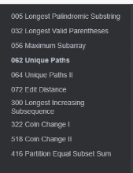

#### [62. 不同路径](https://leetcode.cn/problems/unique-paths/)

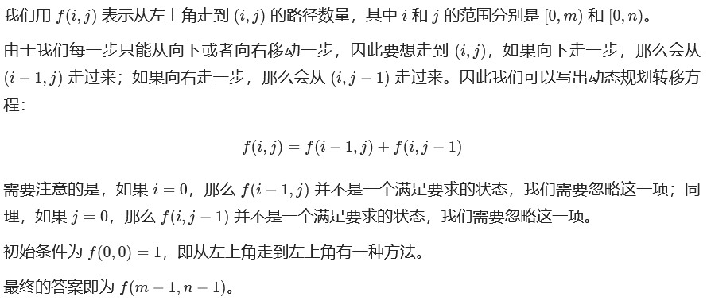

```java
/*
直接DFS，超时
*/
/*
f[i][j] 达到i，j的方法数
初始化边界值，f[i][j] = f[i-1][j] + f[i][j-1];
*/
class Solution {
   
    public int uniquePaths(int m, int n) {
        int[][] f =new int[m][n];
        for(int i=0;i<m;i++){
            f[i][0] = 1;
        }
        for(int j=0;j<n;j++){
            f[0][j] = 1;
        }

        for(int i=1;i<m;i++){
            for(int j=1;j<n;j++){
                f[i][j] = f[i-1][j] + f[i][j-1];
            }
        }
        return f[m-1][n-1];
    }
}

//滚动数组
class Solution {
    public int uniquePaths(int m, int n) {
        int[] f = new int[n];
        Arrays.fill(f,1);
        for (int i = 1; i < m;i++){
            for (int j = 1; j < n; j++){
                f[j] += f[j-1] ;
            }
        }
        return f[n-1];
    }
}
```

#### [63. 不同路径 II](https://leetcode.cn/problems/unique-paths-ii/)

```java
//有障碍物
class Solution {
    public int uniquePathsWithObstacles(int[][] ob) {
        int m = ob.length;
        if(m == 0) return 0;
        int n = ob[0].length;
        //dp[i][j] 达到i，j的方法数
        // -1表示不可达
        int[][] dp = new int[m][n];
        for(int i=0;i<m;i++)
            for(int j=0;j<n;j++)
                if(ob[i][j] == 1)
                    dp[i][j] = -1;

        //边界
        dp[0][0] = ob[0][0] == 1?-1:1;  //看0,0是否可达
        for(int i=1;i<m;i++){
            dp[i][0] = ob[i][0] == 1 ? -1 : dp[i-1][0] == -1 ? -1:1;  //注意当前没有障碍，并且上一个可达才算是可达
        }
        for(int j=1;j<n;j++){
            dp[0][j] = ob[0][j] == 1 ? -1 : dp[0][j-1] == -1 ? -1:1; 
        }

        //填充答案
        for(int i=1;i<m;i++){
            for(int j=1;j<n;j++){
                if(dp[i][j] == -1) continue;
                else if(dp[i-1][j] != -1 && dp[i][j-1] != -1) dp[i][j] = dp[i-1][j] +dp[i][j-1];
                else if(dp[i-1][j]  != -1) dp[i][j] = dp[i-1][j];
                else dp[i][j] = dp[i][j-1];
            }
        }
        return dp[m-1][n-1] == -1 ? 0 : dp[m-1][n-1];
    }
}

//滚动数组优化
/*
input
[
[0,0,0],
[0,1,0],
[0,0,0]
]


f[i]
1,1,1
1,0,1
1,1,2


*/
class Solution {
    public int uniquePathsWithObstacles(int[][] obstacleGrid) {
        int n = obstacleGrid.length, m = obstacleGrid[0].length;
        int[] f = new int[m];

        f[0] = obstacleGrid[0][0] == 0 ? 1 : 0;
        for (int i = 0; i < n; ++i) {	//遍历每一行
            for (int j = 0; j < m; ++j) {
                if (obstacleGrid[i][j] == 1) {
                    f[j] = 0;
                    continue;
                }
                if (j > 0 && obstacleGrid[i][j - 1] == 0) {
                    f[j] += f[j - 1];	//对于当前行，只取决于前一列
                }
            }
        }
        
        return f[m - 1];
    }
}
```

#### [64. 最小路径和](https://leetcode.cn/problems/minimum-path-sum/)

```java
//DP
class Solution {
    public int minPathSum(int[][] grid) {
        for(int i = 0; i < grid.length; i++) {
            for(int j = 0; j < grid[0].length; j++) {
                if(i == 0 && j == 0) continue;
                else if(i == 0)  grid[i][j] += grid[i][j - 1];  //从左边来
                else if(j == 0)  grid[i][j] += grid[i - 1][j];  //从上边
                else grid[i][j] += Math.min(grid[i - 1][j], grid[i][j - 1]); //左边或者上边
            }
        }
        return grid[grid.length - 1][grid[0].length - 1];
    }
}

```

#### [66. 加一](https://leetcode.cn/problems/plus-one/)

```java
/*模拟
倒序遍历
    最低位加1
    其他位置加进位
    更新进位，进位不为0，-10
注意：最后一位有进位的情况：99999
*/
class Solution {
    public int[] plusOne(int[] digits) {
        int c=0;
        int len = digits.length;
        for(int i=len-1;i>=0;i--){
            if(i == len-1) digits[i]+=1;    //最低位加1
            else digits[i] += c;    //其他位置加进位
            c = digits[i]/10;   //进位
            if(c != 0) digits[i] -= 10; //有进位，当前数字减去10
        }
        if(c!=0) {  //注意：最后一位有进位，表示digits所有数字为9
            int[] res=new int[len+1];
            res[0] = 1;
            return res;
        }
        return digits;
    }
}
```

#### [67. 二进制求和](https://leetcode.cn/problems/add-binary/)

```java
/*
模拟
*/
class Solution {
    public String addBinary(String a, String b) {
        StringBuffer res = new StringBuffer();
        int len1=a.length(),len2=b.length();
        int c=0;
        int n=Math.max(len1,len2);
        for(int i=0;i<n;i++){
            c += i < len1 ? a.charAt(len1-i-1)-'0':0;	//从低位开始
            c += i < len2 ? b.charAt(len2-i-1)-'0':0;
            res.append((char)(c%2+'0'));    //注意转化为char
            c/=2;
        }
        if(c > 0) res.append('1');
        res.reverse();
        return res.toString();
    }
}
```

#### [69. x 的平方根 ](https://leetcode.cn/problems/sqrtx/)

```java
/*
二分
*/
class Solution {
    public int mySqrt(int x) {
       int l=0,r=x,res=-1; //从0开始
       while(l<=r){
           int mid = l+((r-l)>>1);
           if((long)mid*mid <= x){
               res = mid;
               l = mid + 1;
           } 
           else r = mid -1;
       }
       return res;    //返回小的
    }
}
```

#### [70. 爬楼梯](https://leetcode.cn/problems/climbing-stairs/)

```java
class Solution {
    public int climbStairs(int n) {
        if(n <= 2) return n;
        int a=1,b=2,res=0;
        for(int i=3;i<=n;i++){
            res = a+b;
            a = b;
            b = res;
        }
        return b;
    }
}
```

#### [71. 简化路径](https://leetcode.cn/problems/simplify-path/)

```java
/*
栈：后进先出

对于「空字符串」以及「一个点」，我们实际上无需对它们进行处理，因为「空字符串」没有任何含义，而「一个点」表示当前目录本身，我们无需切换目录。

对于「两个点」或者「目录名」，我们则可以用一个栈来维护路径中的每一个目录名。
当我们遇到「两个点」时，需要将目录切换到上一级，因此只要栈不为空，我们就弹出栈顶的目录。
当我们遇到「目录名」时，就把它放入栈。


Deque的实现类是LinkedList、ArrayDeque、LinkedBlockingDeque
注意：Java堆栈Stack类已经过时，Java官方推荐使用Deque替代Stack使用。Deque堆栈操作方法：push()、pop()、peek()。

*/
class Solution {
    public String simplifyPath(String path) {
        Deque<String> stk = new ArrayDeque<String>();	//
        String[] names=path.split("/");
        for(String name:names){
            if("..".equals(name)){ //..，则删除队尾
                if(!stk.isEmpty()){
                    stk.pollLast();	//stk.pop()
                }    
            }else if(name.length() > 0 && !".".equals(name)){  //非空格和. ，其他直接进栈
                stk.offerLast(name);//放到队尾  //stk.push()
            }
        }

        StringBuffer sb = new StringBuffer();
        if(stk.isEmpty()){
            sb.append("/");
        }else{
            while(!stk.isEmpty()){  
                sb.append("/");
                sb.append(stk.pollFirst());	//从队头取  (栈底取)
            }
        }
        return sb.toString();
    }
}
```

#### [72. 编辑距离](https://leetcode.cn/problems/edit-distance/)

```java
/*
D[0][j]，D[i][0]空串
D[i][j] 表示 A 的前 i 个字母和 B 的前 j 个字母之间的编辑距离。
D[i][j] A[0,i-1]B[0,j-1]
    插入一个字符；
    删除一个字符；
    替换一个字符。
对单词 A 删除一个字符和对单词 B 插入一个字符是等价的。
本质不同的操作实际上只有三种：
    在单词 A 中插入一个字符；
    在单词 B 中插入一个字符；
    修改单词 A 的一个字符。

*/
class Solution {
    public int minDistance(String word1, String word2) {
        int n = word1.length();
        int m = word2.length();

        // 有一个字符串为空串
        if (n * m == 0) {
            return n + m;
        }

        // DP 数组
        int[][] D = new int[n + 1][m + 1];

        // 边界状态初始化  空串与字符串A[0,i-1]的距离
        for (int i = 0; i < n + 1; i++) {
            D[i][0] = i;
        }
        for (int j = 0; j < m + 1; j++) {
            D[0][j] = j;
        }

        // 计算所有 DP 值
        for (int i = 1; i < n + 1; i++) {
            for (int j = 1; j < m + 1; j++) {
                int left = D[i - 1][j] + 1; //A删除，等价B插入
                int down = D[i][j - 1] + 1; //B删除，等价A插入
                int left_down = D[i - 1][j - 1];//A替换
                //相同相当于dp[i][j]取决上一个状态dp[i-1][j-1]
                if (word1.charAt(i - 1) != word2.charAt(j - 1)) {   //不同时，只有替换才加1
                    left_down += 1;	
                }
                D[i][j] = Math.min(left, Math.min(down, left_down));
            }
        }
        return D[n][m];
    }
}
```

#### [73. 矩阵置零](https://leetcode.cn/problems/set-matrix-zeroes/)

```java
/*
T：O(m*n) S:O(1)
*/
class Solution {
    public void setZeroes(int[][] mat) {
        int m = mat.length, n = mat[0].length;
        boolean row=false,col=false;
        //1.扫描首行，首列
        for(int i=0;i<n;i++) if(mat[0][i] == 0) row = true;
        for(int i=0;i<m;i++) if(mat[i][0] == 0) col = true;

        //2.扫描非首行非首列，是否置0；将最上方，最左方记录为0
        for(int i=1;i<m;i++){
            for(int j=1;j<n;j++){
                if(mat[i][j] == 0) mat[0][j] = mat[i][0] = 0;
            }
        } 

        //3.根据最上方，最左方的记录，置0
         for(int i=1;i<m;i++){   //遍历行
            if(mat[i][0] == 0){//将第i行全部置为0 
                Arrays.fill(mat[i],0);
            }   
        }

        for(int j=1;j<n;j++){      //遍历列
            if(mat[0][j] == 0){ //将第j列全部置为0
                for(int i=1;i<m;i++) mat[i][j] = 0;
            }
        }
       

        //4.根据记录将首行，首列置为0
        if(row) Arrays.fill(mat[0],0);
        if(col) for(int i=0;i<m;i++) mat[i][0] = 0;
    }
}
```

#### [74. 搜索二维矩阵](https://leetcode.cn/problems/search-a-2d-matrix/)

```java
/*
模拟：从右上角出发
*/
class Solution {
    public boolean searchMatrix(int[][] matrix, int target) {
        int row=matrix.length;
        int col=matrix[0].length;
        //从右上角出发
        int x=0,y=col-1;
        while(x < row && y >= 0){
            if(matrix[x][y] > target){
                y--;
            }else if(matrix[x][y] < target){
                x++;
            }else{
                return  true;
            }
        }
        return false;
    }
}
```

#### [75. 颜色分类](https://leetcode.cn/problems/sort-colors/)

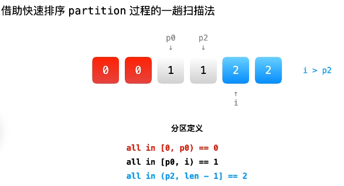

```java
/*
计数排序：扫描一遍记录0,1,2次数，再遍历1遍赋值
左右指针：
*/
class Solution {
    public void swap(int[] nums,int i,int j){
        int tmp = nums[i];
        nums[i] = nums[j];
        nums[j] = tmp;
    }
    public void sortColors(int[] nums) {
        int len = nums.length;
        if(len < 2) return;
        int i=0;
        int p0=0;
        int p2=len-1;
        while(i <= p2){
            if(nums[i] == 0){   //[0,p0)
                swap(nums,i,p0);
                p0++;
                i++;
            }else if(nums[i] == 1){ //[p0,i)
                i++;
            }else{      //(p2,len-1]
                swap(nums,i,p2);
                p2--;
            }
        }
        return;
    }
}
```

#### [76. 最小覆盖子串](https://leetcode.cn/problems/minimum-window-substring/)

```java
/*
思路：滑动窗口：左指针l，右指针r一开始为0。
右指针r一直向右滑动，直到包含S全部字符，r停止；
接着l右移，直到刚好包含S全部字符，如果右移过程中，不包含S全部字符，则需要r右移
*/
class Solution {
    public String minWindow(String s, String t) {
        int s_len=s.length(),t_len= t.length();
        char[] S = s.toCharArray();
        char[] T = t.toCharArray();
        int[] cnt = new int[128];
        boolean[] flag = new boolean[128];
        
        for(int i=0;i<t_len;i++){
            cnt[T[i]]++;
            flag[T[i]] = true; 
        }

        int res = 0;  //T中字符串出现的个数
        int l=0,start=0,min_len = s_len+1;   //l左指针 start窗口的起始位置 min_len最小长度
        for(int r=0;r<s_len;r++){    //r右指针，移动
            if(flag[S[r]]){//是T中的字符
                if(--cnt[S[r]] >= 0) res++;       //加入当前字符，需要减1   
                while(res == t_len){ //T中字符串出现的个数 等于T的长度，计算该窗口的大小
                    if(r-l+1 < min_len){
                        min_len = r-l+1;
                        start = l;  //窗口起始位置改变
                    }
                    
                    //先判断>0，更新res；再对l进行右移
                    if(flag[S[l]] && ++cnt[S[l]] > 0){ //>0代表s[l]是需要在T中的
                        res --;
                    }
                    l++;
                }
            }
        }
        return min_len > s_len ? "": s.substring(start,min_len+start);
    }
}
```

#### [77. 组合](https://leetcode.cn/problems/combinations/)

```java
/*
回溯
剪枝：path长度加上剩余区间 [cur, n] 的长度小于 k
*/
class Solution {
    List<List<Integer>> res = new ArrayList<>();
    List<Integer> path = new ArrayList<>();
    void backtrace(int n,int k,int x){
        if(path.size() + (n-x+1) < k){  //剪枝：path长度加上区间 [cur, n] 的长度小于 k
            return;
        }
        if(k == path.size()){
            res.add(new ArrayList<Integer>(path));
            return;
        }
        //考虑选择当前
        path.add(x);
        backtrace(n,k,x+1);
        path.remove(path.size()-1);
        //当前不取，直接下一个
        backtrace(n,k,x+1);

    }
    public List<List<Integer>> combine(int n, int k) {
        backtrace(n,k,1);
        return res;
    }
}
```

#### [78. 子集](https://leetcode.cn/problems/subsets/)

```java
/*
回溯
*/
class Solution {
    List<List<Integer>> res = new ArrayList<>();
    List<Integer> path = new ArrayList<>();
    void backtrace(int[] nums,int x,int len){
        res.add(new ArrayList<Integer>(path));
        for(int i=x;i<len;i++){	//从x当前位置开始，遍历到len
            path.add(nums[i]);
            backtrace(nums,i+1,len);
            path.remove(path.size()-1);
        }

    }
    public List<List<Integer>> subsets(int[] nums) {
        int len = nums.length;
        if(len == 0 || nums == null) return res;
        backtrace(nums,0,len);
        return res;
    }
}
```

#### [79. 单词搜索](https://leetcode.cn/problems/word-search/)

```java
/*
DFS+vis
越界，是否访问过，相不相等
*/
class Solution {
    int[][] dirs={{1,0},{0,1},{-1,0},{0,-1}};
    boolean dfs(char[][] board,int i,int j,int m,int n,String word,int k,boolean[][] vis){
        if(i <0 ||i>=m||j<0||j>=n||vis[i][j] || board[i][j] != word.charAt(k)) return false;
        if(k == word.length()-1) return true;
        boolean res = false;	//保存返回值
        vis[i][j] = true;
        for(int[] dir:dirs){
            int x=i+dir[0],y=j+dir[1];
            boolean flag = dfs(board,x,y,m,n,word,k+1,vis);
            if(flag) {
                res = true;
                break;
            }
        }
        vis[i][j] = false;
        return res;
    }
    public boolean exist(char[][] board, String word) {
        int m=board.length;
        int n =board[0].length;
        boolean[][] vis = new boolean[m][n];
        for(int i=0;i<m;i++){
            for(int j=0;j<n;j++){
                boolean flag = dfs(board,i,j,m,n,word,0,vis);
                if(flag) return true;
            }
        }
        return false;
    }
}
```

#### [26. 删除有序数组中的重复项](https://leetcode.cn/problems/remove-duplicates-from-sorted-array/)

```java
/*
思路：快慢指针（初始值都为1）
快指针指向遍历的数组下标；慢指针指向不同元素存放的下标，最终的slow就是数组的大小
*/
class Solution {
    public int removeDuplicates(int[] nums) {
        int len = nums.length;
        if(len <= 1) return len;
        int slow = 1, fast = 1;
        while(fast <len){
            if(nums[fast-1] != nums[fast]){ //[1,2]  2!=1 2放到下标1的位置，slow右移
                nums[slow++] = nums[fast];
            }
            fast++;
        }
        return slow;
    }
}
```

#### [80. 删除有序数组中的重复项 II](https://leetcode.cn/problems/remove-duplicates-from-sorted-array-ii/)

```java
/*
数组的升序排序的
26题：最多出现1次，
本题：最多2次
*/
class Solution {
    public int removeDuplicates(int[] nums) {
        int n = nums.length;
        if (n <= 2) {
            return n;
        
        int slow = 2, fast = 2;
        while (fast < n) {
            if (nums[slow - 2] != nums[fast]) { //不等，代表长度可以加1
                nums[slow++] = nums[fast];
            }
            ++fast;
        }
        return slow;
    }
}
```

#### [82. 删除排序链表中的重复元素 II](https://leetcode.cn/problems/remove-duplicates-from-sorted-list-ii/)

```java
/*
head = [1,2,3,3,4,4,5]
重复数字全部删除
*/
class Solution {
    public ListNode deleteDuplicates(ListNode head) {
        if (head == null) {
            return head;
        }
        
        ListNode dummy = new ListNode(0, head);

        ListNode cur = dummy;
        while (cur.next != null && cur.next.next != null) {
            if (cur.next.val == cur.next.next.val) {
                int x = cur.next.val;   //cur指向下标1，cur.next指向下标2 
                while (cur.next != null && cur.next.val == x) {
                    cur.next = cur.next.next; //删除所有重复的数字  cur.next指向下标3
                }
            } else {
                cur = cur.next;
            }
        }

        return dummy.next;
    }
}
```

#### [83. 删除排序链表中的重复元素](https://leetcode.cn/problems/remove-duplicates-from-sorted-list/)

```java
/*
重复数字保留1个
*/
class Solution {
    public ListNode deleteDuplicates(ListNode head) {
        if (head == null) {
            return head;
        }

        ListNode cur = head;
        while (cur.next != null) {
            if (cur.val == cur.next.val) {
                cur.next = cur.next.next;
            } else {
                cur = cur.next;
            }
        }

        return head;
    }
}
```

#### [84. 柱状图中最大的矩形](https://leetcode.cn/problems/largest-rectangle-in-histogram/)

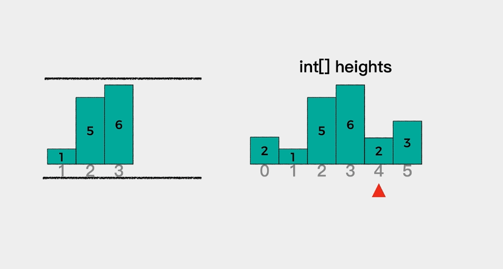

此时记录列表是单调递增的，左边界可以确定；当遍历到数字2时，6>2，对于以6为高的柱子来说，其右侧边界也确定了。

接着，从右到左移除列表中的元素，并记录对应的面积。

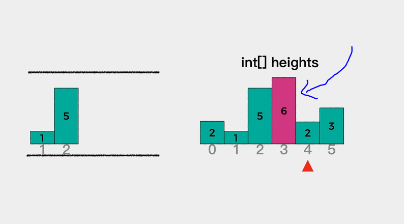

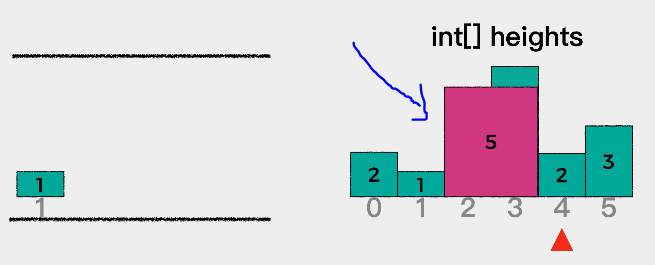

```java
/*https://leetcode.cn/problems/largest-rectangle-in-histogram/solution/bao-li-jie-fa-zhan-by-liweiwei1419/
可以参考https://leetcode.cn/problems/largest-rectangle-in-histogram/solution/dong-hua-yan-shi-dan-diao-zhan-84zhu-zhu-03w3/
先将题目给定的数组左右各添加一个元素0，为了方便确定原有数组中第一个元素和最后一个元素能不能继续扩张；
单调递增栈：
*/
class Solution {
public int largestRectangleArea(int[] heights) {
        // 初始化最终结果为0
        int res = 0;
        Deque<Integer> stack = new ArrayDeque<Integer>();

        // 注意：将给定的原数组左右各添加一个元素0
        int[] newHeights = new int[heights.length + 2];
        newHeights[0] = 0;
        newHeights[newHeights.length-1] = 0;
        for (int i = 1; i < heights.length + 1; i++) {
            newHeights[i] = heights[i - 1];
        }
    

        // 开始遍历
        for (int i = 0; i < newHeights.length; i++) {
            // 如果栈不为空且当前考察的元素值小于栈顶元素值，
            // 则表示以栈顶元素值为高的矩形面积可以确定  栈顶6>当前2 ，单调递增
            while (!stack.isEmpty() &&  newHeights[stack.peek()] > newHeights[i] ) {        
                int cur = stack.pop();          // 弹出栈顶元素
                int curHeight = newHeights[cur];// 获取栈顶元素对应的高

                int leftIndex = stack.peek();   // 栈顶的前一个就是其左侧边界
                int rightIndex = i;             // 右侧边界是当前考察的索引
                int curWidth = rightIndex - leftIndex - 1;   // 计算矩形宽度

                res = Math.max(res, curWidth * curHeight);  // 计算面积
            }
            
            // 当前考察索引入栈
            stack.push(i);
        }

        return res;
    }
}
```

#### [85. 最大矩形](https://leetcode.cn/problems/maximal-rectangle/)

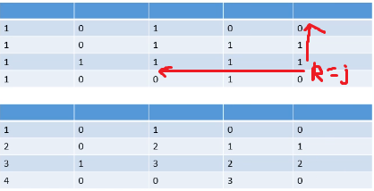

```java
/*
先将原数组的char转化为int。
再对数组进行上图的操作，从第1行开始遍历，遇到1，则为1+dp[i-1][j]；遇到0直接跳过，得到新数组，可以得到从某个元素的高度信息。
再从某一列：从右到左开始遍历，记录最大的area。
*/
class Solution {
    public int maximalRectangle(char[][] matrix) {
        int row = matrix.length;
        if(row == 0) return 0;
        int col = matrix[0].length;
        int[][] dp = new int[row][col];
        //1.转化为int
        for(int i=0;i<row;i++){
            for(int j=0;j<col;j++){
                if('1' == matrix[i][j]){
                    dp[i][j] = 1;
                }
            }
        }
        
        //2.统计高度信息
        for(int i=1;i<row;i++){
            for(int j=0;j<col;j++){
                if(dp[i][j] == 1){
                    dp[i][j] = dp[i-1][j]+1;
                }
            }
        }

        int area = 0;
        for(int i=0;i<row;i++){
            for(int j=0;j<col;j++){ //3.遍历到dp[i][j] 
                if(0 == dp[i][j]) continue;

                int curHeight = dp[i][j];
                for(int k=j;k>=0 && dp[i][k]!=0;k--){ //遍历第i行,从右到左遍历，记录最大area
                    curHeight = Math.min(curHeight,dp[i][k]);   //当前这个高度，取小的
                    int curWidth = j-k+1;
                    area = Math.max(area,curHeight*curWidth);
                }
            }
        }
        return area;
    }
}
```

#### [86. 分隔链表](https://leetcode.cn/problems/partition-list/)

```java
/*
https://leetcode.cn/problems/partition-list/solution/fen-ge-lian-biao-tu-wen-jie-xi-by-sdwwld-m5jn/

*/
class Solution {
       public ListNode partition(ListNode head, int x) {
        //小链表的头
        ListNode smallHead = new ListNode(0);
        //大链表的头
        ListNode bigHead = new ListNode(0);
        //小链表的尾
        ListNode smallTail = smallHead;
        //大链表的尾
        ListNode bigTail = bigHead;
        //遍历head链表
        while (head != null) {
            if (head.val < x) {
                //如果当前节点的值小于x，则把当前节点挂到小链表的后面；并移动smallTail
                smallTail = smallTail.next = head;
            } else {//否则挂到大链表的后面
                bigTail = bigTail.next = head;
            }

            //继续循环下一个结点
            head = head.next;
        }
        //最后再把大小链表拼接在一块即可。
        smallTail.next = bigHead.next;
        bigTail.next = null;
        return smallHead.next;
    }
}
```

#### [88. 合并两个有序数组](https://leetcode.cn/problems/merge-sorted-array/)

```java
/*
1.正向双指针：放第3个数组里面，T：O(m+n) S:O(m+n)
2.逆向双指针：T：O(m+n) S:O(1)
nums1的后半部分是空的，可以直接覆盖而不会影响结果。因此可以指针设置为从后向前遍历，每次取两者之中的较大者放进 nums1 的最后面。
*/
class Solution {
    public void merge(int[] nums1, int m, int[] nums2, int n) {
        int p1 = m - 1, p2 = n - 1;
        int tail = m + n - 1;
        while (p1 >= 0 && p2 >= 0) {
            if (nums1[p1] > nums2[p2]) {
                nums1[tail--] = nums1[p1--];
            } else {
                nums1[tail--] = nums2[p2--];
            }
        }
        while(p1 >= 0) nums1[tail--] = nums1[p1--];
        while(p2 >= 0) nums1[tail--] = nums2[p2--];   
    }
}
```

#### [90. 子集 II](https://leetcode.cn/problems/subsets-ii/)

```java
/*
排序去重
从x=>len
*/
class Solution {
    List<List<Integer>> res = new ArrayList<>();
    List<Integer> path = new ArrayList<>();
    void backtrace(int[] nums,int x,int len){
        res.add(new ArrayList<Integer>(path));
        for(int i=x;i<len;i++){
            if(i > x && nums[i-1] == nums[i]) continue; //当前i > x 
            path.add(nums[i]);
            backtrace(nums,i+1,len);
            path.remove(path.size()-1);
        }
    }
    public List<List<Integer>> subsetsWithDup(int[] nums) {
        int len = nums.length;
        if(len == 0 || nums == null) return res;
        Arrays.sort(nums);
        backtrace(nums,0,len);
        return res;
    }
}
```

#### [91. 解码方法](https://leetcode.cn/problems/decode-ways/)

```java
/*
'A' -> "1"
'B' -> "2"
...
'Z' -> "26"
输入：s = "12"
输出：2
解释：它可以解码为 "AB"（1 2）或者 "L"（12）。
*/
class Solution {
    int numDecodings(String s) {
        if (s.charAt(0) == '0') return 0;
        int pre = 1, curr = 1;//dp[-1] = dp[0] = 1
        for (int i = 1; i < s.length(); i++) {
            int tmp = curr;
            if (s.charAt(i)== '0')            //10 20 不变
                if (s.charAt(i-1) == '1' || s.charAt(i-1) == '2') curr = pre;
                else return 0;          //00 30-90不符合
            else if (s.charAt(i-1) == '1' || (s.charAt(i-1) == '2' && s.charAt(i) >= '1' && s.charAt(i) <= '6'))
                curr = curr + pre;       //11-19 或者 21-26 
            pre = tmp;
        }
        return curr;
    }
}
```

#### [24. 两两交换链表中的节点](https://leetcode-cn.com/problems/swap-nodes-in-pairs/)

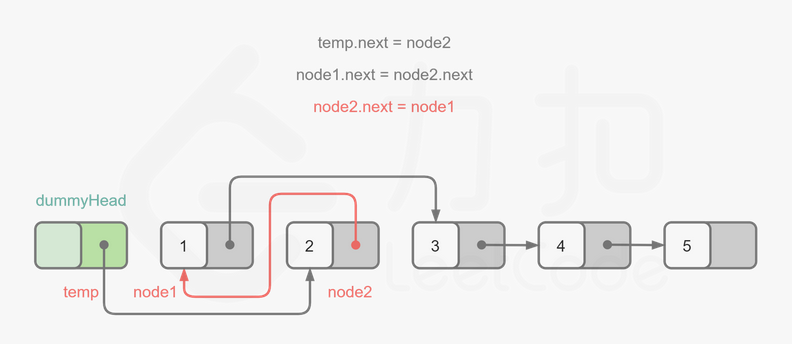

```java
/**
1.用dummy，next指向head
while(原链表第1,2个结点都不为空)
    2.先暂存原链表第1,2个结点
    3.dummy指向第2个结点  （按顺序）
    4.第1个结点指向第3个结点
    5.第2个结点指向第1个结点
    6.再将第1结点赋值给dummy
 */
class Solution {
    public ListNode swapPairs(ListNode head) {
        ListNode dummy = new ListNode(0);
        dummy.next = head;
        ListNode tmp = dummy;
        while(tmp.next != null && tmp.next.next != null){
            ListNode node1 = tmp.next;
            ListNode node2 = tmp.next.next;
            tmp.next = node2;
            node1.next = node2.next;
            node2.next = node1;
            tmp = node1;
        }
        return dummy.next;
    }
}
```

#### [206. 反转链表](https://leetcode.cn/problems/reverse-linked-list/)

```java
/*
pre cur头插法
*/
class Solution {
    public ListNode reverseList(ListNode head) {
        ListNode pre = null;
        ListNode cur = head;
        while(cur != null){
            ListNode tmp = cur.next;
            cur.next = pre;
            pre = cur;
            cur = tmp;
        }
        return pre;
    }
}
```

#### [92. 反转链表 II](https://leetcode.cn/problems/reverse-linked-list-ii/)

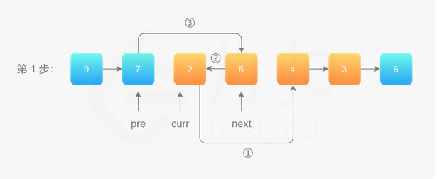

```java
/*
区间[left,right]翻转
1.先遍历到pre
2.从pre开始遍历right-left次
	先保存cur的next为next
	执行（1）cur的next指向next的next
	（2）next的next指向pre的next
	（3）pre的next指向next
*/
class Solution {
    public ListNode reverseBetween(ListNode head, int left, int right) {
        ListNode dummy = new ListNode(0);
        dummy.next = head;
        ListNode pre = dummy;
        for(int i=0;i<left-1;i++){  //left-1次
            pre = pre.next;
        }
        ListNode cur = pre.next;
        for(int i=0;i<right-left;i++){
            ListNode next = cur.next;   //1.先保存cur的next
            cur.next = next.next;   
            next.next = pre.next;   
            pre.next = next;       
        }
        return dummy.next;
    }
}
```

#### [25. K 个一组翻转链表⭐️](https://leetcode-cn.com/problems/reverse-nodes-in-k-group/)

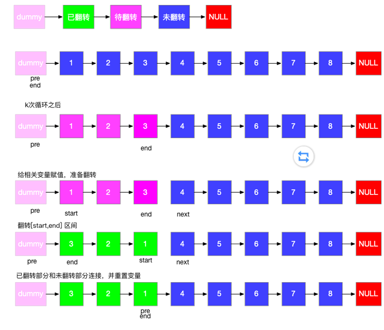

```java
/*
模拟：每次翻转k个结点之前，看下是否有k个结点，没有直接跳出；
有的话翻转，翻转之前先保存子链表的头结点，子链表末尾结点的下一个结点
翻转完后，子链表链接上后面链表，并更新待翻转子链表的头结点的前一个结点，末尾结点
*/
class Solution {
    //头插法
    ListNode reverse(ListNode head){
        ListNode pre = null;
        ListNode cur = head;
        while(cur != null){
            ListNode next = cur.next;
            cur.next = pre;
            pre = cur;
            cur = next;
        }
        return pre;
    }
    public ListNode reverseKGroup(ListNode head, int k) {
        ListNode dummy = new ListNode(0);
        dummy.next = head;

        ListNode pre = dummy;   //子链表头结点的前一个结点
        ListNode end = dummy;   //子链表末尾结点
        while(end != null){
            for(int i=0;i<k && end != null;i++) end = end.next;
            if(end == null) break;
            ListNode start = pre.next;  //子链表头结点
            ListNode next = end.next;   //子链表末尾结点的下一个节点
            end.next = null;    //断开子链表

            pre.next = reverse(start);  //翻转链表,pre.next指向翻转后的链表。1->2 变成2->1。 dummy->2->1
            start.next = next;  //反转后start变为末尾，start.next链接上后面链表
            
            pre = start;    //更新子链表头结点的前一个结点
            end = start;    //更新
        }
        return dummy.next;
    }
}
```

#### [93. 复原 IP 地址](https://leetcode.cn/problems/restore-ip-addresses/)

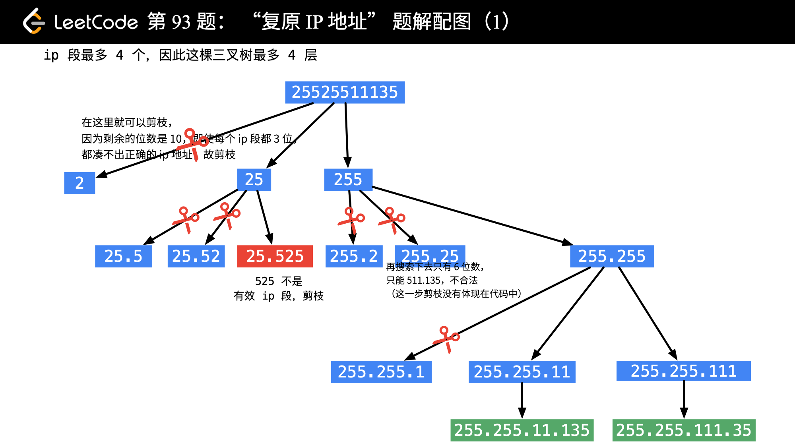

```java
/*
回溯
	是否遍历完
	剩余字符数 大于最大段数 
	是否符合
*/
class Solution {
    List<String> res  = new ArrayList();
    List<String> path = new ArrayList();
    boolean check(String s,int begin,int end){
        int len = end - begin + 1;
        if(len > 1 && s.charAt(begin) == '0') return false; //有前导0.直接返回false
        int res=0;
        while(begin <= end){    //转化为int
            res = res*10+s.charAt(begin)-'0';
            begin++;
        }
        return res >= 0 && res <=255;
    }
    void backtrace(String s,int x,int len,int level){
        if(x == len){           //遍历完了
            if(level == 0){     //层数为0
                res.add(String.join(".",path)); //将path列表按"."拼成字符串
            }
            return;
        }
        for(int i=x;i<x+3;i++){ //一段长度最长为3
            if(i >= len) break; //剪枝1：遍历完了
            if(len - i > 3*level) continue; //剪枝2：剩余字符数 大于最大段数   不符合
            if(check(s,x,i)){       //剪枝3：判断字符串是否符合 0-255
                String sub = s.substring(x,i+1);    //截取[x,,i]
                path.add(sub);
                backtrace(s,i+1,len,level-1);
                path.remove(path.size()-1);
            }
        }
    }
    public List<String> restoreIpAddresses(String s) {
        int len = s.length();
        backtrace(s,0,len,4);
        return res;
    }
}
```

#### [95. 不同的二叉搜索树 II](https://leetcode.cn/problems/unique-binary-search-trees-ii/)

```java
/*
先递归获取左子树和右子树集合；
从左子树集合中选出一棵左子树，从右子树集合中选出一棵右子树，拼接到根节点上
*/
class Solution {
    
    List<TreeNode> generateTrees(int begin,int end) {
        List<TreeNode> res = new LinkedList<TreeNode>();
        if( begin > end) {      
            res.add(null);       //注意
            return res;     
        }

        for(int i=begin;i<=end;i++){
            List<TreeNode> lTrees = generateTrees(begin,i-1);
            List<TreeNode> rTrees = generateTrees(i+1,end);
            for(TreeNode l:lTrees){
                for(TreeNode r:rTrees){
                    TreeNode cur = new TreeNode(i);
                    res.add(cur);   
                    cur.left = l;
                    cur.right = r;
                }
            }
        }
        return res;
    }
    public List<TreeNode> generateTrees(int n) {
        if(n == 0) return new LinkedList<TreeNode>();  
        return generateTrees(1,n);
    } 
}
```

#### [96. 不同的二叉搜索树](https://leetcode.cn/problems/unique-binary-search-trees/)

G(n)=∑G(i−1)⋅G(n−i)  , i=1->n

```java
/*
卡特兰数
*/
class Solution {
    public int numTrees(int n) {
        int[] dp = new int[n+1];
        dp[0] = 1;
        dp[1] = 1;
        
        for(int i = 2; i <= n; i++)
            for(int j = 1; j <= i; j++) 
                dp[i] += dp[j-1] * dp[i-j];
        
        return dp[n];
    }
}
```

#### [97. 交错字符串](https://leetcode.cn/problems/interleaving-string/)

```java
/*bool[][] dp[i][j] 含义：s1前缀长度i + s2前缀长度j，能否交错组成s3前缀长度i+j

考虑s3的最后一个字符s3[i+j-1]来自哪里？ 做状态转移：

1）如果来自s1[i-1]，则dp[i][j] 为：s1前缀长度i-1 + s2前缀长度j 能否交错组成s3前缀长度i+j-1，即：dp[i-1][j]
2）如果来自s2[j-1]，则dp[i][j] 为：s1前缀长度i + s2前缀长度j-1 能否交错组成s3前缀长度i+j-1，即：dp[i][j-1]

dp[i][j] = (s1[i-1] == s3[i+j-1] && dp[i-1][j]) || 
           (s2[j-1] == s3[i+j-1] && dp[i][j-1]);
*/
class Solution {
    public boolean isInterleave(String s1, String s2, String s3) {
        int m=s1.length(),n=s2.length();
        if(m+n != s3.length()) return false;
        boolean[][] dp = new boolean[m+1][n+1];
        dp[0][0] = true;
        for(int i=0;i<=m;i++){
            for(int j=0;j<=n;j++){
                int p = i+j-1;
                if(i>0){    //最后一个字符来自s1[i-1]
                    dp[i][j] = dp[i][j] || (s1.charAt(i-1) == s3.charAt(p) && dp[i-1][j]);
                }
                if(j>0){    //最后一个字符来自s2[j-1]
                    dp[i][j] = dp[i][j] || (s2.charAt(j-1) == s3.charAt(p) && dp[i][j-1]);
                }
            }
        }
        return dp[m][n];
    }
}
```

#### [98. 验证二叉搜索树](https://leetcode.cn/problems/validate-binary-search-tree/)☆

```java
class Solution {
    public boolean check(TreeNode root,long low,long high) {
        if(root == null) return true;
        if(root.val <= low || root.val >= high) return false;
        return check(root.left,low,(long)root.val) && check(root.right,(long)root.val,high);
    }
    public boolean isValidBST(TreeNode root) {
        return check(root,Long.MIN_VALUE,Long.MAX_VALUE);	//注意
    }
}
```

#### [99. 恢复二叉搜索树](https://leetcode.cn/problems/recover-binary-search-tree/) ☆

```java

```

#### [100. 相同的树](https://leetcode.cn/problems/same-tree/)

```java
class Solution {
    public boolean isSameTree(TreeNode p, TreeNode q) {
        if(p == null && q == null) return true;
        if(p == null || q == null) return false;
        if(p.val != q.val) return false;
        return isSameTree(p.left,q.left) && isSameTree(p.right,q.right);
    }
}
```

#### [101. 对称二叉树](https://leetcode.cn/problems/symmetric-tree/)

#### [102. 二叉树的层序遍历](https://leetcode.cn/problems/binary-tree-level-order-traversal/)

#### [107. 二叉树的层序遍历 II](https://leetcode.cn/problems/binary-tree-level-order-traversal-ii/)

#### [103. 二叉树的锯齿形层序遍历](https://leetcode.cn/problems/binary-tree-zigzag-level-order-traversal/)

#### [104. 二叉树的最大深度](https://leetcode.cn/problems/maximum-depth-of-binary-tree/)

#### [105. 从前序与中序遍历序列构造二叉树](https://leetcode.cn/problems/construct-binary-tree-from-preorder-and-inorder-traversal/)

#### [106. 从中序与后序遍历序列构造二叉树](https://leetcode.cn/problems/construct-binary-tree-from-inorder-and-postorder-traversal/)

#### [108. 将有序数组转换为二叉搜索树](https://leetcode.cn/problems/convert-sorted-array-to-binary-search-tree/)

#### [109. 有序链表转换二叉搜索树](https://leetcode.cn/problems/convert-sorted-list-to-binary-search-tree/)

#### [114. 二叉树展开为链表](https://leetcode.cn/problems/flatten-binary-tree-to-linked-list/)

#### [110. 平衡二叉树](https://leetcode.cn/problems/balanced-binary-tree/)

#### [111. 二叉树的最小深度](https://leetcode.cn/problems/minimum-depth-of-binary-tree/)

#### [112. 路径总和](https://leetcode.cn/problems/path-sum/)

#### [113. 路径总和 II](https://leetcode.cn/problems/path-sum-ii/)

#### [116. 填充每个节点的下一个右侧节点指针](https://leetcode.cn/problems/populating-next-right-pointers-in-each-node/)

#### [117. 填充每个节点的下一个右侧节点指针 II](https://leetcode.cn/problems/populating-next-right-pointers-in-each-node-ii/)

#### [118. 杨辉三角](https://leetcode.cn/problems/pascals-triangle/)

#### [119. 杨辉三角 II](https://leetcode.cn/problems/pascals-triangle-ii/)

#### [120. 三角形最小路径和](https://leetcode.cn/problems/triangle/)

#### [115. 不同的子序列](https://leetcode.cn/problems/distinct-subsequences/)

#### [121. 买卖股票的最佳时机](https://leetcode.cn/problems/best-time-to-buy-and-sell-stock/)

#### [122. 买卖股票的最佳时机 II](https://leetcode.cn/problems/best-time-to-buy-and-sell-stock-ii/)

#### [123. 买卖股票的最佳时机 III](https://leetcode.cn/problems/best-time-to-buy-and-sell-stock-iii/)

#### [124. 二叉树中的最大路径和](https://leetcode.cn/problems/binary-tree-maximum-path-sum/)

```java
class Solution {
    int res=Integer.MIN_VALUE;
    int dfs(TreeNode root){
        if(root == null) return 0;
        int l = Math.max(dfs(root.left),0);
        int r = Math.max(dfs(root.right),0);
        res  = Math.max(res,l+r+root.val);
        return Math.max(l,r)+root.val;
    }
    public int maxPathSum(TreeNode root) {
        dfs(root);
        return res;
    }
}
```

#### [129. 求根节点到叶节点数字之和](https://leetcode.cn/problems/sum-root-to-leaf-numbers/)


#### [125. 验证回文串](https://leetcode.cn/problems/valid-palindrome/)

#### [126. 单词接龙 II](https://leetcode.cn/problems/word-ladder-ii/)

#### [127. 单词接龙](https://leetcode.cn/problems/word-ladder/)


#### [128. 最长连续序列](https://leetcode.cn/problems/longest-consecutive-sequence/)


#### [130. 被围绕的区域](https://leetcode.cn/problems/surrounded-regions/)

#### [131. 分割回文串](https://leetcode.cn/problems/palindrome-partitioning/)

#### [132. 分割回文串 II](https://leetcode.cn/problems/palindrome-partitioning-ii/)

#### [133. 克隆图](https://leetcode.cn/problems/clone-graph/)

#### [134. 加油站](https://leetcode.cn/problems/gas-station/)

#### [135. 分发糖果](https://leetcode.cn/problems/candy/)


#### [136. 只出现一次的数字](https://leetcode.cn/problems/single-number/)

#### [137. 只出现一次的数字 II](https://leetcode.cn/problems/single-number-ii/)

#### [138. 复制带随机指针的链表](https://leetcode.cn/problems/copy-list-with-random-pointer/)

#### [139. 单词拆分](https://leetcode.cn/problems/word-break/)

#### [141. 环形链表](https://leetcode.cn/problems/linked-list-cycle/)

#### [142. 环形链表 II](https://leetcode.cn/problems/linked-list-cycle-ii/)

#### [146. LRU 缓存](https://leetcode.cn/problems/lru-cache/)

```java

```

#### [148. 排序链表](https://leetcode.cn/problems/sort-list/)

```

```

#### [149. 直线上最多的点数](https://leetcode.cn/problems/max-points-on-a-line/)

```

```

#### [150. 逆波兰表达式求值](https://leetcode.cn/problems/evaluate-reverse-polish-notation/)

```

```

#### [152. 乘积最大子数组](https://leetcode.cn/problems/maximum-product-subarray/)

```

```

#### [153. 寻找旋转排序数组中的最小值](https://leetcode-cn.com/problems/find-minimum-in-rotated-sorted-array/) 左边

```c++
class Solution {
public:
    int findMin(vector<int>& nums) {
        int l=0,r= nums.size()-1;
        while(l < r){		//左闭右开，由于nums[mid] <= nums[r]
            int mid = l + (r-l)/2;
            if(nums[mid] <= nums[r]) r = mid;	//左闭右开，所以r=mid，此时区间[l,mid）
            else l = mid + 1;
        }
        return nums[l];
    }
};
```

#### [155. 最小栈](https://leetcode.cn/problems/min-stack/)

```

```

#### [160. 相交链表](https://leetcode.cn/problems/intersection-of-two-linked-lists/)

```

```

#### [169. 多数元素](https://leetcode.cn/problems/majority-element/)

```

```

#### [198. 打家劫舍](https://leetcode.cn/problems/house-robber/)

```java

```

#### [200. 岛屿数量](https://leetcode.cn/problems/number-of-islands/)

```

```

#### [207. 课程表](https://leetcode.cn/problems/course-schedule/)

```java

```

#### [208. 实现 Trie (前缀树)](https://leetcode.cn/problems/implement-trie-prefix-tree/)

```java
class Trie {
    private Trie[] kids;
    private boolean isEnd;
    public Trie() {
        kids = new Trie[26];    //26个字母
        isEnd = false;
    }
    public Trie isPrefix(String word){
        Trie node = this;
        for(int i=0;i<word.length();i++){
            char ch = word.charAt(i);
            int index = ch - 'a';
            if (node.kids[index] == null) {
                return null;
            }
            node = node.kids[index]; 
        }
        return node;
    }
    public void insert(String word) {
        Trie node = this;
        for(int i=0;i<word.length();i++){
            char ch = word.charAt(i);
            int index = ch - 'a';
            if (node.kids[index] == null) {
                node.kids[index] = new Trie();
            }
            node = node.kids[index];    //下一个结点
        }
        node.isEnd =true;
    }
    
    public boolean search(String word) {
        Trie node = isPrefix(word);
        return node != null && node.isEnd == true;
    }
    
    public boolean startsWith(String prefix) {
        return isPrefix(prefix) != null;
    }
}
```

#### [215. 数组中的第K个最大元素](https://leetcode.cn/problems/kth-largest-element-in-an-array/)

```java
/*
1.快排：划分思想 T:O(N) S:O(1)
2.堆排：T:O(NlogN) S:O(N)
*/
import java.util.Random;

public class Solution {

    private static Random random = new Random(System.currentTimeMillis());

    public int findKthLargest(int[] nums, int k) {
        int len = nums.length;
        int target = len - k;
        int left = 0;
        int right = len - 1;
        while (true) {
            int index = partition(nums, left, right);
            if (index < target) {
                left = index + 1;
            } else if (index > target) {
                right = index - 1;
            } else {
                return nums[index];
            }
        }
    }

    // 在区间 nums[left..right] 区间执行 partition 操作
    private int partition(int[] nums, int left, int right) {
        // 在区间随机选择一个元素作为标定点,防止极端情况
        if (right > left) {
            int randomIndex = left + 1 + random.nextInt(right - left);
            swap(nums, left, randomIndex);
        }

        int pivot = nums[left];
        int j = left;
        for (int i = left + 1; i <= right; i++) {
            if (nums[i] < pivot) {	// j 的初值为 left，小于 pivot 的元素都被交换到前面
                j++;
                swap(nums, j, i);
            }
        }
        swap(nums, left, j);
        // 交换以后 nums[left..j - 1] < pivot, nums[j] = pivot, nums[j + 1..right] >= pivot
        return j;
    }

    private void swap(int[] nums, int index1, int index2) {
        int temp = nums[index1];
        nums[index1] = nums[index2];
        nums[index2] = temp;
    }
} 
```

#### [221. 最大正方形](https://leetcode.cn/problems/maximal-square/)

```java
/*
参考85.最大矩形
*/
class Solution {
    public int maximalSquare(char[][] matrix) {
        int row = matrix.length;
        if(row == 0) return 0;
        int col = matrix[0].length;
        int[][] dp = new int[row][col];
        //1.转化为int
        for(int i=0;i<row;i++){
            for(int j=0;j<col;j++){
                if('1' == matrix[i][j]){
                    dp[i][j] = 1;
                }
            }
        }
        
        //2.统计高度信息
        for(int i=1;i<row;i++){
            for(int j=0;j<col;j++){
                if(dp[i][j] == 1){
                    dp[i][j] = dp[i-1][j]+1;
                }
            }
        }

        int area = 0;
        for(int i=0;i<row;i++){
            for(int j=0;j<col;j++){ //3.遍历到dp[i][j] 
                if(0 == dp[i][j]) continue;

                int curHeight = dp[i][j];
                for(int k=j;k>=0 && dp[i][k]!=0;k--){ //遍历第i行,从右到左遍历，记录最大area
                    int curWidth = j-k+1;
                    curHeight = Math.min(curHeight,dp[i][k]);   //当前这个高度，取小的
                    int tmp = Math.min(curWidth,curHeight);
                    area = Math.max(area,tmp*tmp);
                }
            }
        }
        return area;
    }
}

```

#### [226. 翻转二叉树](https://leetcode.cn/problems/invert-binary-tree/)

```java
class Solution {
    public TreeNode invertTree(TreeNode root) {
        if(root == null) return null;
        TreeNode l = invertTree(root.left);
        TreeNode r = invertTree(root.right);
        root.left = r;
        root.right = l;
        return root;
    }
}
```

#### [234. 回文链表](https://leetcode.cn/problems/palindrome-linked-list/)

```java
/*
1.开数组存进去；首尾双指针判断是否为回文:T：O(N) S:O(N)
2.快慢指针：T：O(N) S:O(1)
	
    快慢指针，找到前半部分链表的尾节点。
    反转后半部分链表。
    判断是否回文（比较前半部分和后半部分是否相等）。
    恢复链表。
    返回结果。
*/
class Solution {
    public boolean isPalindrome(ListNode head) {
        if (head == null) {
            return true;
        }

        // 找到前半部分链表的尾节点并反转后半部分链表 12323 =>3   1221=>2
        ListNode firstHalfEnd = endOfFirstHalf(head);
        ListNode secondHalfStart = reverseList(firstHalfEnd.next);

        // 判断是否回文
        ListNode p1 = head;
        ListNode p2 = secondHalfStart;
        boolean result = true;
        while (p2 != null) {
            if (p1.val != p2.val) {
                result = false;
                break;
            }
            p1 = p1.next;
            p2 = p2.next;
        }        

        // 还原链表并返回结果
        firstHalfEnd.next = reverseList(secondHalfStart);
        return result;
    }

    private ListNode reverseList(ListNode head) {
        ListNode prev = null;
        ListNode curr = head;
        while (curr != null) {
            ListNode nextTemp = curr.next;
            curr.next = prev;
            prev = curr;
            curr = nextTemp;
        }
        return prev;
    }

    private ListNode endOfFirstHalf(ListNode head) {
        ListNode fast = head;
        ListNode slow = head;
        while (fast.next != null && fast.next.next != null) {
            fast = fast.next.next;
            slow = slow.next;
        }
        return slow;
    }
}
```

#### [236. 二叉树的最近公共祖先](https://leetcode.cn/problems/lowest-common-ancestor-of-a-binary-tree/)

```java
class Solution {
    public TreeNode lowestCommonAncestor(TreeNode root, TreeNode p, TreeNode q) {
        if(root == null || root ==p || root== q) return root;
        TreeNode l = lowestCommonAncestor(root.left,p,q);
        TreeNode r = lowestCommonAncestor(root.right,p,q);
        if(l !=null && r!=null) return root;
        return l!=null?l:r;
    }
}
```

#### [238. 除自身以外数组的乘积](https://leetcode.cn/problems/product-of-array-except-self/)

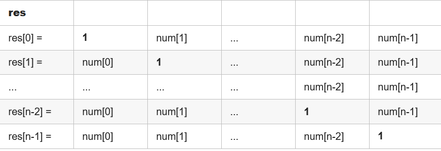

```java
class Solution {
    public int[] productExceptSelf(int[] nums) {
        int n = nums.length;
        int[] res = new int[n];
        int p =1;
        for(int i=0;i<n;i++){   //下三角
            res[i] = p;
            p *= nums[i];
        }   // res 1 1 2 6
        p = 1;
        for(int i=n-1;i>0;i--){ //上三角   
            p *= nums[i];
            res[i-1] *= p;  //从倒数第2行开始到第2行，最后一行不用了 2*4=8
        }
        return res;
    }
}
```

#### [239. 滑动窗口最大值](https://leetcode.cn/problems/sliding-window-maximum/)

```java
/*
1.堆：T:O(NlogN）S:O(N)
2.单调队列：T:O(N）S:O(N)
*/
class Solution {
    public int[] maxSlidingWindow(int[] nums, int k) {
        if(nums == null || nums.length < 2) return nums;
        LinkedList<Integer> queue = new LinkedList();// 严格单调递减：从大到小 LinkedList实现了List Queue
        int[] result = new int[nums.length-k+1];
        for(int i = 0;i < k;i++){
             while(!queue.isEmpty() && nums[queue.peekLast()] <= nums[i]){
                queue.pollLast();
            } 
            queue.addLast(i);  
        }
        result[0] = nums[queue.peek()];

        for(int i = k;i < nums.length;i++){
            // 保证从大到小 如果前面数小则需要依次弹出，直至满足要求
            while(!queue.isEmpty() && nums[queue.peekLast()] <= nums[i]){
                queue.pollLast();
            }   
            queue.addLast(i);               // 添加当前值对应的数组下标
            while(queue.peek() <= i-k){    //维护当前窗口大小为k，将前面的删除掉(3-3,删除0)
                queue.poll();   
            } 
            result[i+1-k] = nums[queue.peek()];
        }
        return result;
    }
}
```

#### [240. 搜索二维矩阵 II](https://leetcode.cn/problems/search-a-2d-matrix-ii/)

```java
class Solution {
    public boolean searchMatrix(int[][] matrix, int target) {
        int m=matrix.length,n=matrix[0].length;
        int i=0,j=n-1;
        while(i < m && j >=0){
            if(matrix[i][j] == target) return true;
            else if(matrix[i][j] > target) j--;
            else i++;
        }
        return false;
    }
}
```

#### [253.会议室](https://leetcode.cn/problems/meeting-rooms-ii/)

```java

```

#### [255.验证前序遍历序列二叉搜索树](https://leetcode.cn/problems/verify-preorder-sequence-in-binary-search-tree/)

```java

```


#### [279. 完全平方数](https://leetcode.cn/problems/perfect-squares/)  

```java
/*
f[i]表示最少需要多少个数的平方来表示整数 i。这些数必然落在区间 [1,sqrt{n}]。我们可以枚举这些数，假设当前枚举到 j，那么我们还需要取若干数的平方，构成 i−j^2。此时我们发现该子问题和原问题类似，只是规模变小了。
f[0]=0 为边界条件
从小到大地枚举 i 来计算 f[i]即可
dp[i] = min(dp[i],dp[i-j^2]+1)
*/
class Solution {
    public int numSquares(int n) {
        int[] dp = new int[n+1];
        for(int i=1;i<=n;i++){  //从小到大地枚举
            dp[i] = i;          //最坏的情况就是每次+1
            for(int j = 1;i - j*j >= 0; j++ ){
                dp[i] = Math.min(dp[i],dp[i-j*j]+1);
            }
        }
        return dp[n];
    }
}
```

#### [283. 移动零](https://leetcode.cn/problems/move-zeroes/)  

```java
/*
双指针:T：O(N)
定义left=0，right=0。
right一直右移
遇到非0数字，则交换left，right对应的数字（将非0数字移到前面），同时left++
*/
class Solution {
    void swap(int[] nums,int i,int j){
        int tmp = nums[i];
        nums[i] = nums[j];
        nums[j] = tmp;
    }
    public void moveZeroes(int[] nums) {
        int n=nums.length,left=0,right=0;
        while(right <n){
            if(nums[right] != 0){
                swap(nums,left++,right);
            }
            right++;
        }
        return;
    }
}
```

#### [287. 寻找重复数](https://leetcode.cn/problems/find-the-duplicate-number/)  

```java
/*
题意：[1,3,4,2,2]返回2；只有一个整数 出现 两次或多次 ，其余整数均只出现 一次
思路：定义cnt统计数组中<=当前i的个数
利用了「鸽巢原理」：n+1个元素放到n个集合中，其中必定有一个集合里至少有两个元素。
遍历数组，统计<=4的个数，如果个数>4 ，说明重复的元素一定出现在整数区间 [1..4]
*/
class Solution {
    public int findDuplicate(int[] nums) {
        int n = nums.length;
        int l = 1,r=n-1;
        while(l<r){
            int mid = l + ((r-l)>>1);
            int cnt = 0;
            for(int num:nums){
                if(num <= mid) cnt++;
            }
            if(cnt > mid) r = mid;  //个数>mid 答案在[l,mid]    「鸽巢原理」
            else l = mid + 1; 
        }
        return l;
    }
}
```

#### [442. 数组中重复的数据](https://leetcode.cn/problems/find-all-duplicates-in-an-array/)

```java
class Solution {
    public void swap(int[] nums,int i,int j){
        int tmp = nums[i];
        nums[i]=nums[j];
        nums[j]= tmp;
    }
    public List<Integer> findDuplicates(int[] nums) {
        for(int i=0;i<nums.length;i++){
            while(nums[i] != nums[nums[i]-1]){
                swap(nums,i,nums[i]-1);
            }
        }
        List<Integer> res = new ArrayList<>();
        for(int i=0;i<nums.length;i++){
            if(nums[i] - 1 != i){
                res.add(nums[i]);
            }
        }
        return res;
    }
}
```

#### [297. 二叉树的序列化与反序列化](https://leetcode.cn/problems/serialize-and-deserialize-binary-tree/)  

```java
/*
先序遍历
*/
public class Codec {
    String deString;
    // Encodes a tree to a single string.
    public String serialize(TreeNode root) {
        if(root == null) return "#";
        return root.val+" "+serialize(root.left)+" "+serialize(root.right);
    }

    TreeNode my_deserialize(){
        int index = deString.indexOf(" ");
        String node = index == -1?deString:deString.substring(0,index);
        deString = index == -1?"":deString.substring(index+1);
        if("#".equals(node)) return null;
        TreeNode root = new TreeNode(Integer.parseInt(node));
        root.left = my_deserialize();
        root.right = my_deserialize();
        return root;
    }
    // Decodes your encoded data to tree.
    public TreeNode deserialize(String data) {
        deString = data;
        return my_deserialize();
    }
}
```

#### [300. 最长递增子序列](https://leetcode.cn/problems/longest-increasing-subsequence/)  

```java
/*
1.动态规划
T:O(N^2) S:O(N)

2.二分+贪心
T:O(NlogN) S:O(N)
*/

class Solution {
    public int lengthOfLIS(int[] nums) {
        int n = nums.length;
        if(n == 0) return 0;
        int[] dp=new int[n+1];
        dp[0] = 1;
        int res=1;
        for(int i=1;i<n;i++){
            dp[i] = 1;      //注意
            for(int j=0;j<i;j++){
                if(nums[j] < nums[i]){
                    dp[i] = Math.max(dp[i],dp[j]+1);
                }
            }
            res = Math.max(res,dp[i]);
        }
        return res;
    }
}


class Solution {
    public int lengthOfLIS(int[] nums) {
        int len = 1, n = nums.length;
        if (n == 0) {
            return 0;
        }
        int[] d = new int[n + 1];
        d[len] = nums[0];
        for (int i = 1; i < n; ++i) {
            if (nums[i] > d[len]) {
                d[++len] = nums[i];
            } else {
                int l = 1, r = len, pos = 0; // 如果找不到说明所有的数都比 nums[i] 大，此时要更新 d[1]，所以这里将 pos 设为 0
                while (l <= r) {
                    int mid = (l + r) >> 1;
                    if (d[mid] < nums[i]) {
                        pos = mid;
                        l = mid + 1;
                    } else {
                        r = mid - 1;
                    }
                }
                d[pos+1] = nums[i];
            }
        }
        return len;
    }
}
```

#### [301. 删除无效的括号](https://leetcode.cn/problems/remove-invalid-parentheses/)  

```java
/*
1.计算出要删除的左，右括号数
2.回溯，移除括号 结束条件（要删除的左，右括号数为0）
3.回溯完的字符串要判断是否为有效 比如：())(
时间复杂度：O(N*2^N），其中 N 为字符串的长度。考虑到一个字符串最多可能有 2^n个子序列，每个子序列可能需要进行一次合法性检测
*/
class Solution {
    List<String> res = new ArrayList<>();
    public List<String> removeInvalidParentheses(String s) {
        // 计算出要移除的左右括号数
        int lr =0;
        int rr = 0;
        for (int i = 0; i < s.length(); i++) {
            if(s.charAt(i) == '(') lr++;
            if(s.charAt(i) == ')'){  
                if(lr > 0)lr --;    //匹配了
                else rr++;
            }
        }
        backTrack(0, lr, rr, s);
        return res;
    }
    // 回溯，移除括号
    void backTrack(int start, int lr, int rr, String s){
        // 完成条件
        if(lr == 0 && rr == 0){
            if(isValid(s))res.add(s);
        }
        // for s
        // 离开条件
        // 做出选择
        // 回溯
        // 撤销选择
        for (int i = start; i < s.length(); i++) { // )(())(
            if(i > start && s.charAt(i) == s.charAt(i - 1))continue;    //去除重复
            if(s.charAt(i) == '('  && lr > 0){
                backTrack(i, lr - 1, rr, s.substring(0, i) + s.substring(i + 1));
            }
            if(s.charAt(i) == ')'  && rr > 0){
                backTrack(i, lr, rr - 1, s.substring(0, i) + s.substring(i + 1));
            }
        }
    }
    // 判定是否有效
    boolean isValid(String s){
        Deque<Character> stack = new LinkedList<>();
        for (int i = 0; i < s.length(); i++) {
            if(!stack.isEmpty() && s.charAt(i) == ')' && stack.peek() == '('){
                stack.pop();
                continue;
            }
            if(s.charAt(i) != '(' && s.charAt(i) != ')') continue;  //字母
            stack.push(s.charAt(i));    //左括号进栈
        }
        return stack.isEmpty();
    }
}

```

#### [312. 戳气球](https://leetcode.cn/problems/burst-balloons/)  

```java

```

#### [322. 零钱兑换](https://leetcode.cn/problems/coin-change/)  

```java
/*
dp[i] = Math.min(dp[i],dp[i-coin]+1)
*/
class Solution {
    public int coinChange(int[] coins, int amount) {
        int Max = amount + 1;
        int[] dp = new int[amount + 1];    //dp[i]代表金额i所需最少的硬币个数
        Arrays.fill(dp, Max);
        dp[0] = 0;                          //金额0所需要的0个硬币
        for(int i = 1 ; i<=amount;i++){ //注意了，正向遍历，和01背包不一样
            for (int coin : coins) {
                if(i >= coin){  //当前金额i必须>=j，才可以兑换
                    dp[i] = Math.min(dp[i],dp[i-coin]+1);
                }    
            }
        }
        return dp[amount] > amount ? -1:dp[amount];
    }
}
```

#### [337. 打家劫舍 III](https://leetcode.cn/problems/house-robber-iii/)  

```java

class Solution {
    public int rob(TreeNode root) {

        //res 二维数组        res 0   res1 
        //res 0    不抢劫当前节点的最大值
        //res 1     抢劫当前节点的最大值
        int[] res = dp(root);

        return Math.max(res[0], res[1]);
    }

    /*
        返回一个res
        res 
    */
    public int[] dp(TreeNode root){
        if(root == null)    return new int[]{0,0};
        int[] left  = dp(root.left);
        int[] right = dp(root.right);

        int rob     = root.val + left[0] + right[0];	//抢
        int not_rob = Math.max(left[0], left[1]) + Math.max(right[0], right[1]) ;	//不抢

        return new int[]{not_rob, rob};
    }
}
```

#### [338. 比特位计数](https://leetcode.cn/problems/counting-bits/)  

```java
class Solution {
    int lowbit(int n){
        int res = 0;
        while(n!=0){
            n &= (n-1);//每次消去最后1个1
            res ++;
        }
        return res;
    }
    public int[] countBits(int n) {
        int[] res= new int[n+1];
        for(int i=0;i<=n;i++){
            res[i] = lowbit(i);
        }
        return res;
    }
}
```

#### [347. 前 K 个高频元素](https://leetcode.cn/problems/top-k-frequent-elements/)  

```java
/*
hashMap存储元素出现次数
小顶堆存储前k个高频元素
*/
class Solution {
    public int[] topKFrequent(int[] nums, int k) {
        Map<Integer, Integer> map = new HashMap<Integer, Integer>();
        for (int num : nums) {
            map.put(num, map.getOrDefault(num, 0) + 1);
        }

        //最大堆求topk小，最小堆求 topk 大
        // int[] 的第一个元素代表数组的值，第二个元素代表了该值出现的次数
        PriorityQueue<int[]> queue = new PriorityQueue<int[]>(new Comparator<int[]>() {
            public int compare(int[] a, int[] b) {
                return a[1] - b[1]; //小顶堆
            }
        });
        for (Map.Entry<Integer, Integer> entry : map.entrySet()) {
            int num = entry.getKey(), count = entry.getValue();
            if (queue.size() == k) {    //维护k个元素的堆
                if (queue.peek()[1] < count) {  //替换堆顶
                    queue.poll();
                    queue.offer(new int[]{num, count});
                }
            } else {
                queue.offer(new int[]{num, count});
            }
        }
        int[] ret = new int[k];
        for (int i = 0; i < k; ++i) {
            ret[i] = queue.poll()[0];
        }
        return ret;
    }
}
```

#### [394. 字符串解码](https://leetcode.cn/problems/decode-string/)  

```java
/*本题难点在于括号内嵌套括号，需要从内向外生成与拼接字符串，这与栈的先入后出特性对应。
数字栈
字符串栈
*/
/** 
当前字符串res
1.'['：将数字，字符串进栈，并重置数字0，res字符串""
2.']'：字符串出栈 + 数字出栈num，当前字符串翻num倍
3.数字：转化为倍数
4.字母：直接添加到res
*/
class Solution {
    public String decodeString(String s) {
        StringBuilder res = new StringBuilder();    //中间字符串结果
        int multi = 0;
        LinkedList<Integer> num_stk = new LinkedList<>();	//注意不能 List<Integer>
        LinkedList<String> str_stk = new LinkedList<>();
        for(Character c : s.toCharArray()) {
            if(c == '[') {
                num_stk.addLast(multi);
                str_stk.addLast(res.toString());
                multi = 0;
                res = new StringBuilder();
            }
            else if(c == ']') {
                StringBuilder tmp = new StringBuilder();
                int cur_multi = num_stk.removeLast();
                for(int i = 0; i < cur_multi; i++) tmp.append(res);
                res = new StringBuilder(str_stk.removeLast() + tmp);
            }
            else if(c >= '0' && c <= '9') multi = multi * 10 + Integer.parseInt(c + "");
            else res.append(c);
        }
        return res.toString();
    }
}
```

#### [399. 除法求值](https://leetcode.cn/problems/evaluate-division/)  

```

```

#### [406. 根据身高重建队列](https://leetcode.cn/problems/queue-reconstruction-by-height/)  

```java
/*
贪心算法
按照元素 1 进行降序排序，对于每个元素，在其之前的元素的个数，就是大于等于他的元素的数量，而按照第二个元素正向排序，我们希望 k 大的尽量在后面，减少插入操作的次数。

按照身高排序之后，优先按身高高的people的k来插入，后序插入节点也不会影响前面已经插入的节点，最终按照k的规则完成了队列。
排序完的people：
[[7,0], [7,1], [6,1], [5,0], [5,2]，[4,4]]

插入的过程：
插入[7,0]：[[7,0]]
插入[7,1]：[[7,0],[7,1]]
插入[6,1]：[[7,0],[6,1],[7,1]]
插入[5,0]：[[5,0],[7,0],[6,1],[7,1]]
插入[5,2]：[[5,0],[7,0],[5,2],[6,1],[7,1]]
插入[4,4]：[[5,0],[7,0],[5,2],[6,1],[4,4],[7,1]]
*/
class Solution {
    public int[][] reconstructQueue(int[][] people) {
         Arrays.sort(people, new Comparator<int[]>() {
            @Override
            public int compare(int[] p1, int[] p2){
                if (p1[0] != p2[0]) return p2[0] - p1[0];   //降序
                else return p1[1] - p2[1];        //升序
            }
        });
        List<int[]> res = new LinkedList<>();
        for(int[] p:people){
            if(res.size() <= p[1]) res.add(p);  //当前k大于size，直接放到结果集后面
            else res.add(p[1],p);   //插到自己的下标p[1]位置
        }
        return res.toArray(new int[res.size()][2]);
    }
}
```

#### [416. 分割等和子集](https://leetcode.cn/problems/partition-equal-subset-sum/)  

```java
/*
01背包
*/
class Solution {
    public boolean canPartition(int[] nums) {
        int sum = 0;
        int n = nums.length;
        int[] dp = new int[10001];
        for(int i=0;i<n;i++){
            sum += nums[i];
        }

        if(sum%2 == 1) return false;
        int target = sum/2;
        for(int i=0;i<n;i++){
            for(int j=target;j>=nums[i];j--){
                dp[j] = Math.max(dp[j],dp[j-nums[i]]+nums[i]);
            }
        }
        return dp[target] == target;
    }
}
```

#### [112. 路径总和](https://leetcode.cn/problems/path-sum/)

```java
class Solution {
    boolean res = false;
    void dfs(TreeNode root, int targetSum){
        if(root == null) return;
        if(root.left == null && root.right == null && targetSum == root.val){   
            res = true;
            return;
        }
        dfs(root.left,targetSum-root.val);
        dfs(root.right,targetSum-root.val);
    }
    public boolean hasPathSum(TreeNode root, int targetSum) {
        if(root == null) return res;
        dfs(root,targetSum);
        return res;
    }
}
```

#### [113. 路径总和 II](https://leetcode.cn/problems/path-sum-ii/)

```java
class Solution {
    List<List<Integer>> res = new ArrayList<>();
    List<Integer> path = new ArrayList<>();
    void dfs(TreeNode root, int targetSum){
        if(root == null) return;
        path.add(root.val);
        if(root.left == null && root.right == null && targetSum == root.val){   
            res.add(new ArrayList<Integer>(path));  //不能return
        }
        dfs(root.left,targetSum-root.val);
        dfs(root.right,targetSum-root.val);
        path.remove(path.size()-1);     
    }
    public List<List<Integer>> pathSum(TreeNode root, int targetSum) {
        if(root == null) return res;
        dfs(root,targetSum);
        return res;
    }
}
```

#### [437. 路径总和 III](https://leetcode.cn/problems/path-sum-iii/)  

```java
class Solution {
    int res=0;
    void dfs(TreeNode root, int targetSum){
        if(root == null) return;
        if(targetSum == root.val) res++;
        dfs(root.left,targetSum-root.val);
        dfs(root.right,targetSum-root.val);
    }
    public int pathSum(TreeNode root, int targetSum) {
        if(root == null) return 0;
        dfs(root,targetSum);
        pathSum(root.left,targetSum);
        pathSum(root.right,targetSum);
        return res;
    }
}
```

#### [448. 找到所有数组中消失的数字](https://leetcode.cn/problems/find-all-numbers-disappeared-in-an-array/)  

```java
/*
nums长度为n
遍历 nums，每遇到一个数 x，就让nums[x−1] 增加 n。
由于 nums 中所有数均在 [1,n] 中，增加以后，这些数必然大于 n。
最后我们遍历 nums，若nums[i] 未大于 n，就说明没有遇到过数 i+1。这样我们就找到了缺失的数字。
*/
class Solution {
    public List<Integer> findDisappearedNumbers(int[] nums) {
        List<Integer> res = new ArrayList<>();
        int n = nums.length;    
        for(int num:nums){  //num 应该放在num-1下标位置
            int x = (num -1)%n;   //下标
            nums[x] += n;       //num加后会大于n
        }
        for(int i=0;i<n;i++){
            if(nums[i] <= n){
                res.add(i+1);
            }
        }
        return res;
    }
}
```

#### [461. 汉明距离](https://leetcode.cn/problems/hamming-distance/)  

```java
class Solution {
    int lowbit(int n){
        int res = 0;
        while(n!=0){
            n &= (n-1);
            res++;
        }
        return res;
    }
    public int hammingDistance(int x, int y) {
        return lowbit(x^y);
    }
}
```

#### [494. 目标和](https://leetcode.cn/problems/target-sum/)  

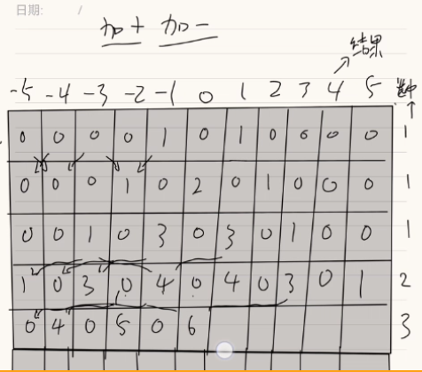

```java
/*
回溯:T:O(2^n)
*/
class Solution {
    int count = 0;

    public int findTargetSumWays(int[] nums, int target) {
        backtrack(nums, target, 0, 0);
        return count;
    }

    public void backtrack(int[] nums, int target, int index, int sum) {
        if (index == nums.length) {     //结尾
            if (sum == target) {        //
                count++;
            }
        } else {
            backtrack(nums, target, index + 1, sum + nums[index]);  //回溯加法
            backtrack(nums, target, index + 1, sum - nums[index]);  //回溯减法
        }
    }
}

/*
416.分割等和子集  只要求返回boolean

变形01背包
动态规划:：T:O(n×(sum−target))	sum 是数组 nums 的元素和，target是目标数。
result[i][j] == result[i-1][j-nums[i]] + result[i-1][j+nums[i]];
用一维数组就可以了，因为只和前面一个数组有关


*/
class Solution {
    public int findTargetSumWays(int[] nums, int target) {
        int n = nums.length;
        int sum = 0;
        for(int i = 0; i < n; i++){             //1.数组和
            sum += nums[i];
        }
        if(target < -sum || target > sum) return 0; //2.越界

        int m = (sum<<1)+1;             //列数翻倍
        int[] result = new int[m];
        for(int j = 0; j < m; j++){     //第一行 赋值   
            if(j-sum == nums[0]){       //4-5=-1 6-5=1  == nums[0]
                result[j] += 1;
            }
            if(j-sum == -nums[0]){
                result[j] += 1;
            } 
        }
        for(int i = 1; i < n; i++){
            int[] temp = new int[m];
            for(int j = 0; j < m; j++){
                int k = j-sum;          //0-5 
                if(k+nums[i] >= -sum && k+nums[i] <= sum){  //-5+1将result-4对应的值添加给temp
                    temp[j] +=  result[j+nums[i]];
                }
                if(k-nums[i] >= -sum && k-nums[i] <= sum){//-5-1不符合
                    temp[j] +=  result[j-nums[i]];
                }
            }
            result = temp;
        }
        return result[target+sum];
    }
}
```

#### [538. 把二叉搜索树转换为累加树](https://leetcode.cn/problems/convert-bst-to-greater-tree/)  

```java
/*
逆序中序遍历
右边的值加上自己，再赋值给自己
*/
class Solution {
    int sum = 0;
    void RNL(TreeNode root){
        if(root == null) return;
        RNL(root.right);
        sum += root.val;    //右边的值加上自己，再赋值给自己
        root.val = sum;
        RNL(root.left);
    }
    public TreeNode convertBST(TreeNode root) {
        RNL(root);
        return root;
    }
}
```

#### [543. 二叉树的直径](https://leetcode.cn/problems/diameter-of-binary-tree/)

```java
/*
 直径长度任意两个结点路径长度中的最大值（左，右子树的深度相加）
 */
class Solution {
    int ans;
    public int diameterOfBinaryTree(TreeNode root) {
        ans = 0;
        height(root);
        return ans; 
    }
    public int height(TreeNode node) {
        if (node == null) {
            return 0; // 访问到空节点了，返回0
        }
        int L = height(node.left); // 左儿子为根的子树的深度
        int R = height(node.right); // 右儿子为根的子树的深度
        ans = Math.max(ans, L+R); // 计算根节点node的直径即L+R 并更新ans
        return Math.max(L, R) + 1; // 返回该节点为根的子树的深度
    }
}
```

#### [560. 和为 K 的子数组](https://leetcode.cn/problems/subarray-sum-equals-k/)  

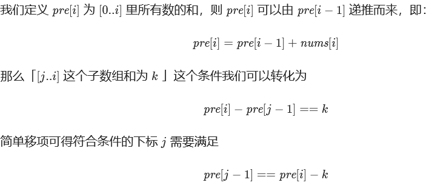

```java
/*
前缀和 + 哈希表优化
[3,0] 3
count 1 map(3,1)
count 2 map(3,2)

[0,0,1,-1] 0
count 1 map(0,2)
count 3 map(0,3)
count 3 map(0,3) (1,1)
count 6 map(0,4) (1,1)
*/
public class Solution {
    public int subarraySum(int[] nums, int k) {
        int count = 0, pre = 0;
        HashMap < Integer, Integer > mp = new HashMap<>();  //（和，次数）
        mp.put(0, 1); //注意，一开始
        for (int i = 0; i < nums.length; i++) {
            pre += nums[i]; //前缀和 pre[i] = pre[i-1] + num[i]
            if (mp.containsKey(pre - k)) { //[j,i]: pre[i] - pre[j-1] = k => pre[j-1] = pre[i]-k 
                count += mp.get(pre - k);
            }
            mp.put(pre, mp.getOrDefault(pre, 0) + 1);	//更新次数
        }
        return count;
    }
}


```

#### [567. 字符串的排列](https://leetcode.cn/problems/permutation-in-string/)

```java
/*
滑动窗口
*/
class Solution {
    public boolean checkInclusion(String s1, String s2) {
        int n = s1.length(), m = s2.length();
        if (n > m) {
            return false;
        }
        int[] cnt1 = new int[26];
        int[] cnt2 = new int[26];
        for (int i = 0; i < n; ++i) {   //窗口大小为n
            ++cnt1[s1.charAt(i) - 'a'];
            ++cnt2[s2.charAt(i) - 'a'];
        }
        if (Arrays.equals(cnt1, cnt2)) {
            return true;
        }
        for (int i = n; i < m; ++i) {   
            --cnt2[s2.charAt(i - n) - 'a'];  //左边界滑出--
            ++cnt2[s2.charAt(i) - 'a'];      //右边界++
            if (Arrays.equals(cnt1, cnt2)) {
                return true;
            }
        }
        return false;
    }
}

```

#### [581. 最短无序连续子数组](https://leetcode.cn/problems/shortest-unsorted-continuous-subarray/)  

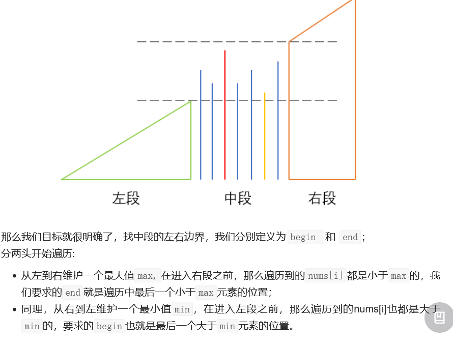

```java
/*
1.排序：T：O(NlogN)
特例：有序返回0  numsA,numsB,numsC，保证numsB最短=>numsA，numsC最长，先对nums排序，判断numsA的右边界，numsC的左边界
2.一次遍历：T:O(N)
[1,3,2,5,4]

右边界,下标4  从左到右：最后一个小于max元素的位置
左边界,下标1  从右到左：最后一个大于min元素的位置
*/
class Solution {
    public int findUnsortedSubarray(int[] nums) {
        int n = nums.length;
        int max = nums[0];          //左边最大值 
        int min = nums[n-1];        //右边最小值 
        int begin=0,end=-1;         //end一开始从-1出发，可能有序
        for(int i=0;i<n;i++){
            if(nums[i] < max) end = i;    //从左到右维持最大值，寻找右边界end
            else max = nums[i];

            if(nums[n-i-1] > min) begin = n-i-1; //从右到左维持最小值，寻找左边界begin
            else min = nums[n-i-1];
        }
        return end - begin + 1;
    }
}
```

#### [617. 合并二叉树](https://leetcode.cn/problems/merge-two-binary-trees/)  

```java
class Solution {
    public TreeNode mergeTrees(TreeNode root1, TreeNode root2) {
        if(root1 == null) return root2;
        if(root2 == null) return root1;
        TreeNode root = new TreeNode(root1.val+root2.val);
        root.left = mergeTrees(root1.left,root2.left);
        root.right = mergeTrees(root1.right,root2.right);
        return root;
    }
}
```

#### [621. 任务调度器](https://leetcode.cn/problems/task-scheduler/)  


```java
/*
模拟
1.hashmap记录任务出现次数
2.统计任务数最多的
3. res = (max - 1) * (n + 1) ，除最后一行的总任务数
4.统计有多少个max 比如2，res += 2（最后一行的）
（可能会出现最后一行不够填充） = > res = max(res,tasks.length)
*/
class Solution {
    public int leastInterval(char[] tasks, int n) {
        int[] cnt = new int[26];
        int len = tasks.length;
        for(int i=0;i<len;i++){ //1.记录次数
            cnt[tasks[i]-'A']++;
        }
        int max = 0;
        for(int i=0;i<26;i++){  //2.统计最大值
            max = Math.max(max,cnt[i]);
        }

        int res = (max-1)*(n+1);    //3.除最后一行
        for(int i=0;i<26;i++){ 
            if(max == cnt[i]){
                res++;      //4.最后一行
            }
        }

        return Math.max(res,len);
    }
}
```

#### [647. 回文子串](https://leetcode.cn/problems/palindromic-substrings/)  

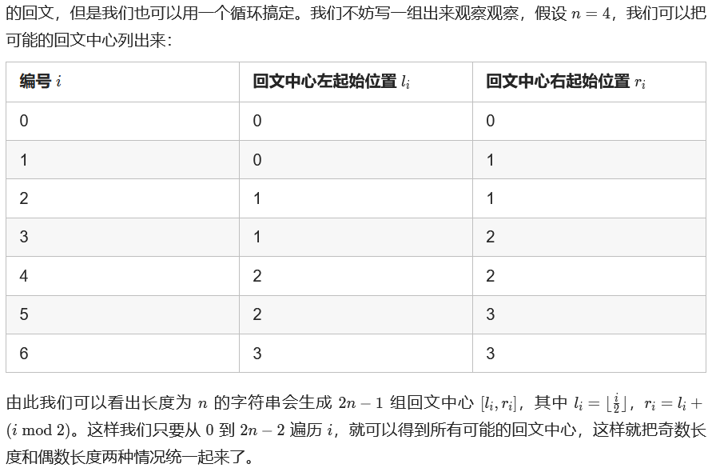

```java
/*
1.枚举出所有的子串，然后再判断这些子串是否是回文；T:O(N^3)
2.枚举每一个回文中心(区间)，然后用两个指针分别向左右两边拓展，当两个指针指向的元素相同的时候就拓展，否则停止拓展。T:O(N^2)
3.Manacher 算法：T:O(N)
*/
/*
方法2：
如果回文长度是奇数，那么回文中心是一个字符；如果回文长度是偶数，那么中心是两个字符。
*/
class Solution {
    public int countSubstrings(String s) {
        int n = s.length(), res = 0;
        for (int i = 0; i < 2 * n - 1; ++i) {
            int l = i / 2, r = i / 2 + i % 2;
            while (l >= 0 && r < n && s.charAt(l) == s.charAt(r)) { //[l,r] l向左 r向右扩散
                --l;
                ++r;
                ++res;
            }
        }
        return res;
    }
}
/*
3.Manacher 算法
*/

```

#### [739. 每日温度](https://leetcode.cn/problems/daily-temperatures/)

```java
class Solution {
    public int[] dailyTemperatures(int[] t) {
        int n = t.length;
        int[] res = new int[n];
        Deque<Integer> q = new LinkedList<Integer>();
        for(int i=n-1;i>=0;i--){
            while(!q.isEmpty() && t[q.peek()]  <= t[i] ){   //严格单调递减
                q.pop();
            }
            res[i] = q.isEmpty() ? 0 : q.peek()-i;
            q.push(i);
        }
        return res;
    }
}
```

### 排序

#### [4. 寻找两个正序数组的中位数](https://leetcode.cn/problems/median-of-two-sorted-arrays/)

```java
/*
思路1:直接归并排序
思路2:二分
*/
```

#### [21. 合并两个有序链表](https://leetcode.cn/problems/merge-two-sorted-lists/)

```java
/**
思路：归并排序+dummy
 */
class Solution {
    public ListNode mergeTwoLists(ListNode a, ListNode b) {
        if(a == null || b == null) return a == null ? b : a;
        ListNode dummy = new ListNode(0); //作为合并后的头结点
        ListNode tail = dummy, pa = a, pb = b;
        while(pa != null && pb != null){
            if(pa.val < pb.val){
                tail.next = pa;
                pa = pa.next;
            }else{
                tail.next = pb;
                pb = pb.next;
            }
            tail = tail.next;
        }
        tail.next = pa == null ? pb : pa;
        return dummy.next;
    }
}
```

#### [23. 合并K个升序链表](https://leetcode-cn.com/problems/merge-k-sorted-lists/)


```java
/**
21题的合并链表，一样
二分思想：将链表拆分成两个两个，然后再合并
 */
class Solution {
    public ListNode mergeTwoLists(ListNode a, ListNode b) {
        if(a == null || b == null) return a == null ? b : a;
        ListNode dummy = new ListNode(0); //作为合并后的头结点
        ListNode tail = dummy, pa = a, pb = b;
        while(pa != null && pb != null){
            if(pa.val < pb.val){
                tail.next = pa;
                pa = pa.next;
            }else{
                tail.next = pb;
                pb = pb.next;
            }
            tail = tail.next;
        }
        tail.next = pa == null ? pb : pa;
        return dummy.next;
    }
    public ListNode merge(ListNode[] lists,int l,int r){
        if(l > r) return null;
        if(l == r) return lists[l];
        int mid = l + ((r-l)>>1);
        return mergeTwoLists(merge(lists,l,mid),merge(lists,mid+1,r));
    }
    public ListNode mergeKLists(ListNode[] lists) {
        return merge(lists,0,lists.length-1);
    }
}
```


### 栈

#### [20. 有效的括号](https://leetcode.cn/problems/valid-parentheses/)

```java
/*
思路：栈（Deque）
1.遍历字符串
2.左括号进栈，遇到右括号出栈，查看出栈的左括号和当前的右括号是否匹配
3.栈为空，证明该括号的字符串有效
*/
class Solution {
    public boolean isValid(String s) {
        Deque<Character> stk  = new LinkedList<>();
        int len = s.length();
        for(int i=0;i<len;i++){
            char ch = s.charAt(i);
            if(ch == '(' || ch== '{'  || ch == '[' ){
                stk.push(ch);
            }else{
                if(!stk.isEmpty()){
                    char l = stk.pop();
                if(l == '(' && ch != ')' || (l == '[' && ch != ']') || (l == '{' && ch != '}') ) return false; 
                }else{
                    return false;
                }
            }
        }
        return stk.isEmpty();
    }
}
```

#### [42. 接雨水](https://leetcode.cn/problems/trapping-rain-water/)

```java
/*
思路：单调栈，严格单调递减，栈顶<
遍历数组
栈不为空并且栈顶<当前，则将栈顶弹出，再判断是否为空，不为空则形成低洼；
继续将下一个元素下标进栈
*/
class Solution {
    public int trap(int[] height) {
        Deque<Integer> stk=new LinkedList<Integer>();
        int len = height.length;
        int res = 0;
        for(int i=0;i<len;i++){
            while(!stk.isEmpty() && height[stk.peek()] < height[i]){  //当前比栈顶大
                int top = stk.pop();
                if(stk.isEmpty()) break;
                int left = stk.peek();  //栈顶的前一个，比栈顶大（因为递减）
                int w = i-left-1;
                int h = Math.min(height[left],height[i])-height[top]; // 前一个>栈顶<当前
                res += w*h;
            }
            stk.push(i);    //注意放入的下标
        }
        return res;
    }
}
```

