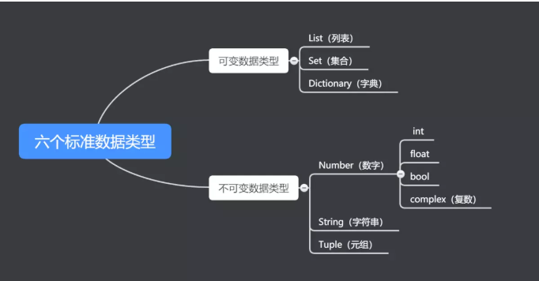

> 手撕很简单   还有就是项目和八股

#### 闭包vs装饰器

闭包就是**能够读取其他函数内部变量的函数**，（**保存外部函数的变量**（保存在内存中），不会随着外部函数调用完而销毁）

装饰器实质上也是一个闭包函数，常用于**函数、方法或者类**的扩展，在不改变原函数的情况下，对已有函数进行额外的功能扩展

区别：装饰器的入参是函数对象，闭包入参是普通数据对象

> 装饰器，是python的一个语法糖，其本质就是闭包原理
>
> 装饰器场景：权限验证，日志记录，统计各个函数执行的时间

```python
# 函数闭包
def fun1(c):
    a = 10
    b = 20
    print(c)
    print("我是fun1")


def fun2(fun):
    a = "a"
    c = "c"

    def fun3():
        fun(c)
        print("我是fun3")

    print("我是fun2")
    return fun3


funx = fun2(fun1)  # 我是fun2   这里通过fun2让fun1可以访问到fun2的变量，并进行了功能的扩展，这样的一个函数我们就称之为闭包
"""
闭包形成条件
1.一个就收函数作为变量的函数
2.在这个函数里有第三个函数
3.在这个第三个函数里调用传进来的函数
4.将这个新的函数作为返回值进行返回
"""

print("=" * 20)
funx()  # 调用这个新生成的函数
"""
c
我是fun1
我是fun3
"""
"""
装饰器的使用必须要有一个闭包
"""
print("=" * 30)


@fun2  # 这个就是装饰器 @闭包的形式挂在在函数、方法或者类上，装饰器的个数是不受限制的
def fun4(c):
    print("我是fun4")


fun4()

#执行时间
import time
def wrapper(func):
    def inner(*args, **kwargs):
        start_time = time.time()
        res = func(*args, **kwargs)
        end_time = time.time()
        result = end_time - start_time
        print('func time is %.3fs' % result)
        return res
    return inner
```

#### 迭代器

> 迭代器并不依赖索引，而通过 **next 指针**迭代所有数据，**一次只取一个值**，大大节省空间。

列表、集合、字典和元组，字符串都是可迭代的对象。

> 字典：hash表

#### 生成器

**一个函数调用时返回一个迭代器**，那这个函数就叫做生成器（如果函数中包含yield语法，那这个函数就会变成生成器）

#### Python有哪些常用的数据结构

> 值可以改变的对象被称为 可变的；值不可以改变的对象就被称为 不可变的。



#### 深拷贝，浅拷贝

1.深拷贝，拷贝的程度深，自己新开辟了一块内存，将被拷贝内容全部拷贝过来了；
2.浅拷贝，拷贝的程度浅，只拷贝原数据的首地址，然后通过原数据的首地址，去获取内容。

#### 循环引用

1.延迟导入：即将 from xxx import yyy 放到函数或类的内部，从而使其作用域变成局部的，但是这样可能会对性能有些影响；

2.将 from xxx import yyy 转换成 import xxx;xxx.yyy 的形式

3.以上两种方式都是治标不治本的，只能说能够用，但是并不符合规范，最好的办法应该是从代码布局入手，比如合并或分离循环引用的部分，合并就是将代码放到一个文件里面，自然就不用循环引用了，分离的话就是将循环引用的部分放到第三个py文件中，这样也可以。

#### 取整

ceil向上，floor向下，int()向下，round四舍五入

#### 线程vs进程vs协程

##### 协程与线程的区别⭐️

> 协程的适用场景 **高并发服务**,如秒杀系统、高性能API接口、RPC服务器,使用协程模式,服务的容错率会大大增加,某些接口出现故障时,不会导致整个服务崩溃。性能比线程更好，但同时也要面临实现调度协程的复杂度
>
> （纤程本质上是协程）

- 内核调度

线程是任务调度和系统执行的最小单位，需要内核调度；协程是一种**用户态的轻量级线程，不受内核调度**，协程的调度完全由用户控制。

- **运行机制**

线程和进程是同步机制，而协程是**异步**机制。

- **上下文切换开销**

线程运行状态切换及上下文切换需要内核调度，会消耗系统资源；而协程完全由程序控制，状态切换及**上下文切换不需要内核参与**。

##### 进程与线程

Ⅰ 拥有资源
进程是资源分配的基本单位，但是线程不拥有资源，线程可以访问隶属进程的资源。

Ⅱ 线程调度，进程切换
线程是独立调度的基本单位，在同一进程中，线程的切换不会引起进程切换，从一个进程中的线程切换到另一个进程中的线程时，会引起进程切换。

 Ⅲ 创建的系统开销
由于创建或撤销进程时，系统都要为之**分配或回收资源**，如内存空间、I/O 设备等，所付出的开销远大于创建或撤销线程时的开销。
类似地，在进行进程切换时，涉及当前执行进程 **CPU 环境的保存及新调度进程 CPU 环境的设置**，而线程切换时只需保存和设置**少量寄存器内容，**开销很小。

Ⅳ 通信方面
线程间可以通过直接**读写同一进程**中的数据进行通信，但是进程通信需要借助IPC的方式，通常有**管道（包括无名管道和命名管道）、消息队列、信号量、共享存储、Socket**等。

> 无名管道：它可以看成是一种**特殊的文件**，对于它的读写也可以使用普通的read、write 等函数。但是它不是普通的文件，**并不属于其他任何文件系统，并且只存在于内存**中。（**父子进程或者兄弟进程**之间，只支持半双工通信）
>
> FIFO，也称为命名管道，它是一种**文件类型**。FIFO可以**在无关的进程之间交换数据**，与无名管道不同。**以一种特殊设备文件形式存在于文件系统中**。全双工
>
> 消息队列，是**消息的链接表**，**存放在内核中**。面向记录的，具有特定的格式以及特定的优先级。独立于发送与接收进程。进程终止时，消息队列及其内容并不会被删除。 **可实现消息的随机查询**，消息可按**先进先出的次序**读取，也可以按**消息的类型**读取。
>
> 信号量：它是一个**计数器**。信号量用于实现进程间的**互斥与同步**，而不是用于存储进程间通信数据。
>
> 共享内存（Shared Memory），指两个或多个进程共享一个给定的存储区。共享内存是**最快的一种 IPC**，因为进程是直接对内存进行存取。因为多个进程可以同时操作，所以需要进行**同步**。信号量+共享内存通常结合在一起使用，信号量用来同步对共享内存的访问。

#### 排序

##### 快排

```java
public class Main {
    static void swap(int[] nums, int i, int j) {
        int tmp = nums[i];
        nums[i] = nums[j];
        nums[j] = tmp;
    }

    static int partition(int[] nums, int l, int r) {
        int x = nums[l];
        while (l < r) {
            while (l < r && nums[r] >= x)
                r--;
            swap(nums, l, r);
            while (l < r && nums[l] <= x)
                l++;
            swap(nums, l, r);
        }
        return l;
    }

    public static void qSort(int[] nums, int l, int r) {
        if (l < r) {
            int mid = partition(nums, l, r);
            qSort(nums, l, mid - 1);
            qSort(nums, mid + 1, r);
        }
    }

    public static void main(String[] args) {
        int[] nums = { 9, 8, 7, 6, 5, 4, 3, 2, 1, 0 };
        qSort(nums, 0, 9);
        for (int num : nums)
            System.out.printf("%d,", num);
    }
}
```

##### 选排

```java
public class Main {
    static void swap(int[] nums, int i, int j) {
        int tmp = nums[i];
        nums[i] = nums[j];
        nums[j] = tmp;
    }

    public static void main(String[] args) {
        int[] nums = { 9, 8, 7, 6, 5, 4, 3, 2, 1, 0 };
        for (int i = 0; i < 10; i++) {
            int min = i;
            for (int j = i + 1; j < 10; j++) {
                if (nums[min] > nums[j]) {
                    min = j;
                }
            }
            if (i != min)
                swap(nums, i, min);
        }
        for (int num : nums)
            System.out.printf("%d,", num);
    }
}
```

##### 冒排

```java
public class Main {
    static void swap(int[] nums, int i, int j) {
        int tmp = nums[i];
        nums[i] = nums[j];
        nums[j] = tmp;
    }

    public static void main(String[] args) {
        int[] nums = { 9, 8, 7, 6, 5, 4, 3, 2, 1, 0 };
        boolean flag = true;
        for (int i = 0; i < 10 && flag; i++) {
            flag = false;
            for (int j = 10 - 2; j >= i; j--) {
                if (nums[j] > nums[j + 1]) {
                    swap(nums, j, j + 1);
                    flag = true;
                }
            }
        }
        for (int num : nums)
            System.out.printf("%d,", num);
    }
}
```

