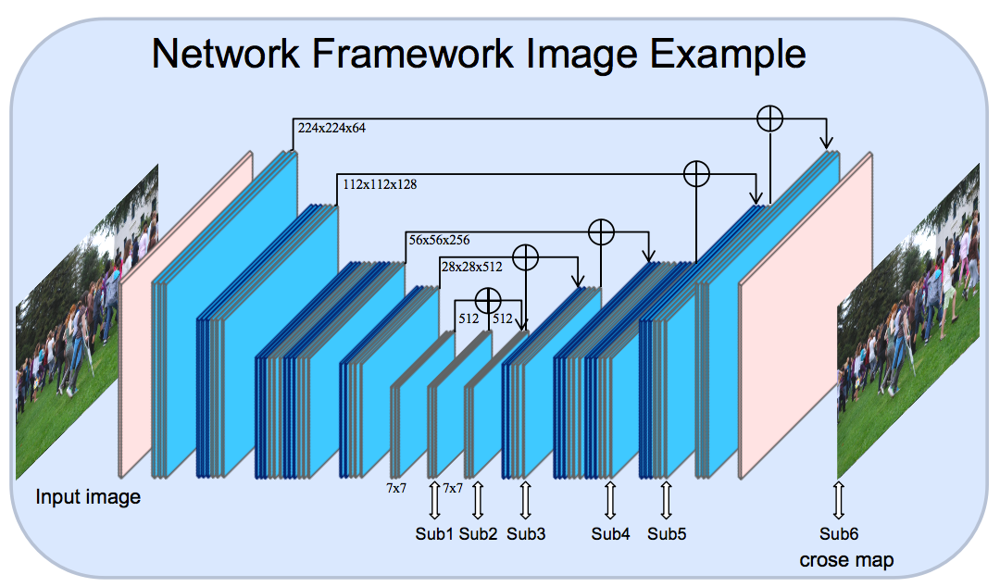
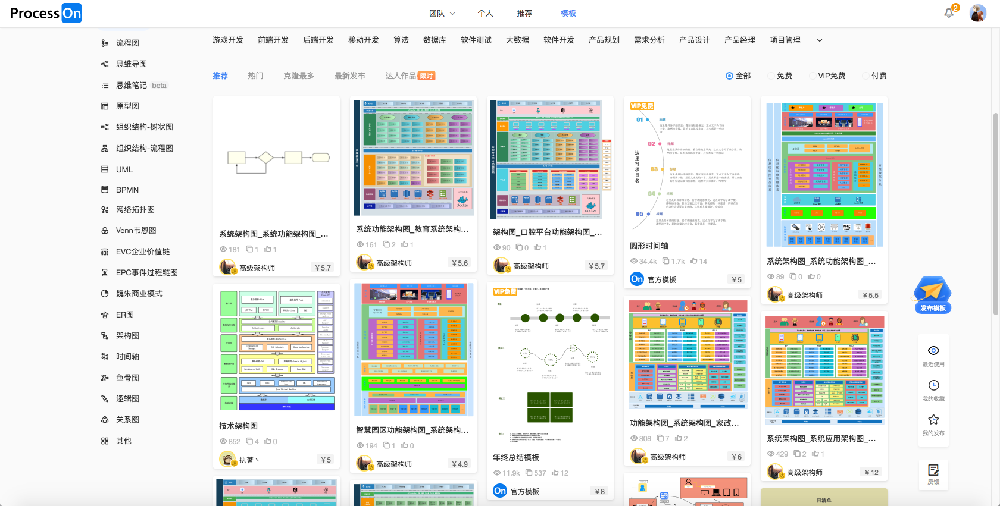
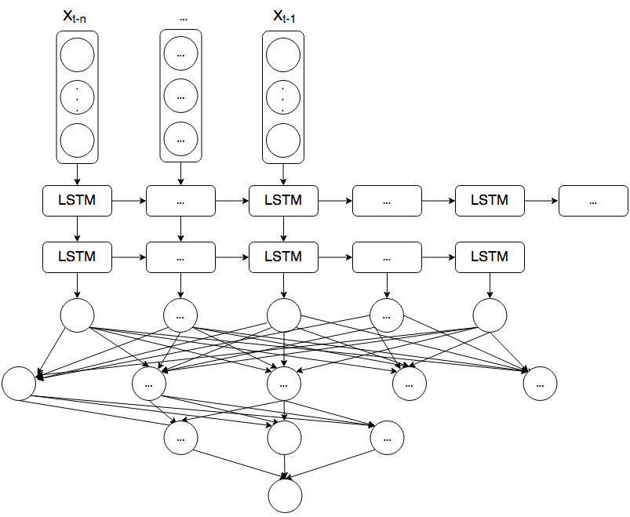
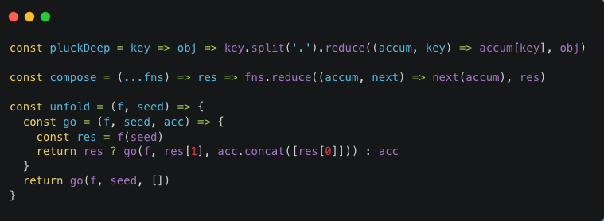
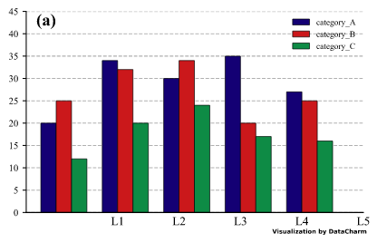
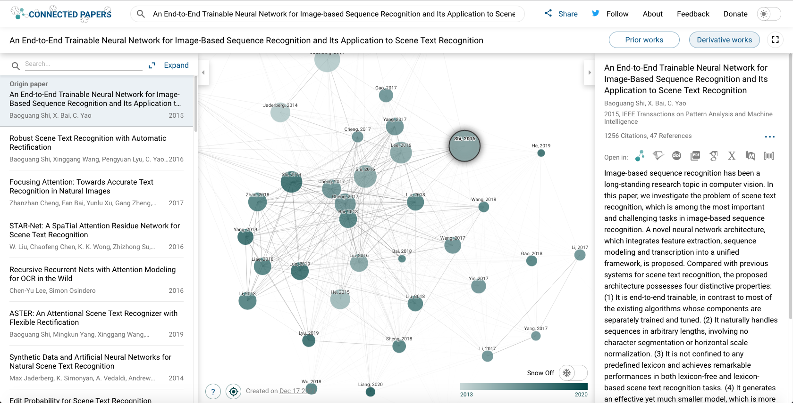
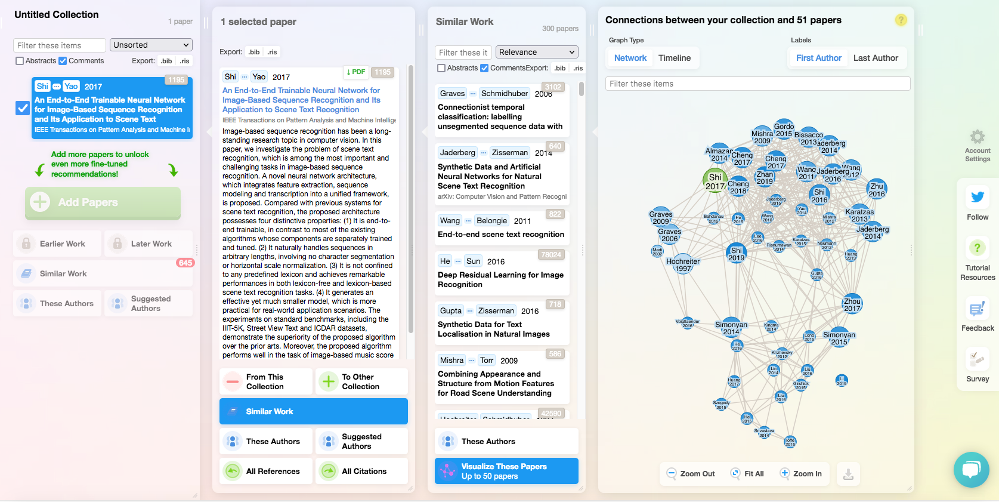
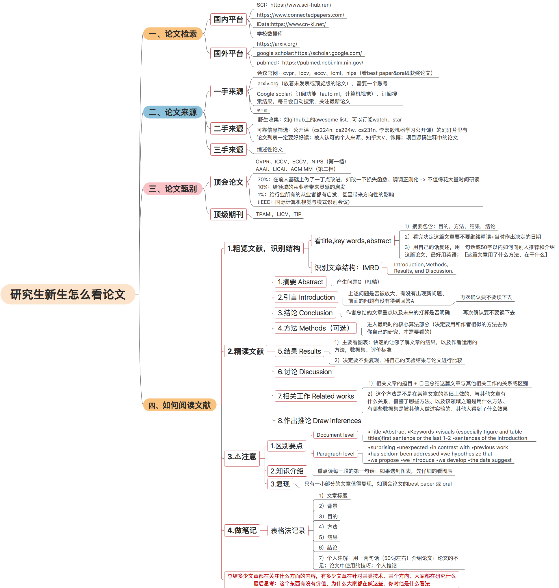
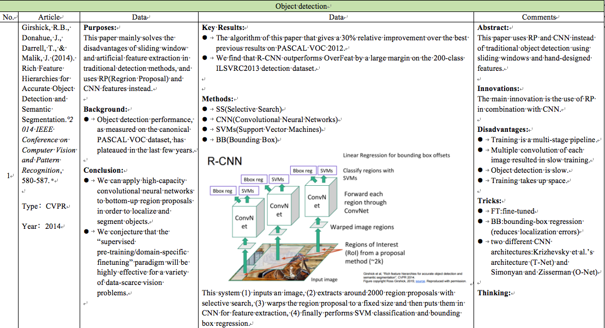

# 计算机视觉（持续更新）

## （一）工具

### 1.0 PPT模板

#### [学术模板](ppt/学术模板.pptx)

#### [创新项目模板](ppt/创新项目模板.pptx)

#### [项目介绍模板](ppt/项目介绍模板.pptx)

#### [开题报告模板16:9](ppt/开题报告模板.pptx)

#### [开题报告模板4:3](ppt/开题报告模板2.pptx)

### 1.1 绘图

#### (1) PPT 🌟

> 一般用来画神经网络图，当然，画流程图，技术路线图都可以，全能的
>
> 推荐一个PPT科研绘图实例库  [PPT好看的科研图](https://docs.google.com/presentation/d/11mR1nkIR9fbHegFkcFq8z9oDQ5sjv8E3JJp1LfLGKuk/edit?usp=sharing)



`上面是我画的一个神经网络图`

<!--more-->

#### [(2) processon](https://www.processon.com/) 🌟

> 一般用来画技术路线图，系统架构图
> 唯一缺点：无法导出高清图（需要付费），不过清晰度也够用了



#### [(3) diagrams](https://app.diagrams.net/) 🌟

> 跟上面基本一样，但可以导出高清图，下面是我画的一个图



#### [(4) codeimg](https://codeimg.io/)

#### [(5) carbon](https://carbon.now.sh/)

> 上面2个都可以将代码块转为图片



#### [(6) 在线PS](https://ps.gaoding.com/#/)

#### (7) python科研图

https://github.com/garrettj403/SciencePlots 🌟🌟🌟🌟🌟

https://github.com/reiinakano/scikit-plot



### 1.2 论文搜索

#### [(1) 中文SCIHUB](https://www.scihub.net.cn/)

> 非常全的一个论文检索网站

#### [(2) connectedpapers](https://www.connectedpapers.com/) 🌟

> 可以生成查找论文的关系网络，理清某方向的研究脉络，写文献综述方便



#### [(3) researchrabbitapp](https://researchrabbitapp.com) 🌟

> 又一个写文献综述神器，注册时，随便网上找一个学校邮箱注册就行



#### [(4) SCIHUB](https://www.sci-hub.ren/) 🌟

> 无敌，几乎可以搜索到所有论文

#### [(5) paperswithcode](https://paperswithcode.com) 🌟

> **可以找到论文的代码**，以及当前研究任务的排行榜

#### [(6) arxiv](https://arxiv.org/)

#### [(7) 谷歌学术](https://scholar.google.com/)

#### [(8) X-MOL](https://www.x-mol.com/)

> 支持订阅的论文网站（有手机端，网页端）

#### [(9) easyScholar]()

> 判断文献质量（浏览器插件就可以安装）

### 1.3 期刊选择

#### [(1)Journalrank](https://www.scimagojr.com/journalrank.php)

#### [(2)Journalguide](https://www.journalguide.com)

### 1.4 转转小工具

#### [(1) PDF转PPT](https://smallpdf.com/pdf-to-ppt)

#### [(2) 视频转文字](https://www.feishu.cn/product/minutes) 🌟

> 类似于自动生成字幕，还可以提取里面对话的关键信息

#### [(3) B站视频下载](https://xbeibeix.com/api/bilibili/)

### 1.5 素材

#### （1）插图

https://undraw.co/search

https://www.manypixels.co/gallery

#### （2）图标

https://www.iconfont.cn/

https://iconpark.oceanengine.com/official

### 1.6 写作

#### （1）latex写论文

https://www.overleaf.com/

#### （2）语法纠错

https://www.grammarly.com/grammar-check

#### （3）句子改写

https://app.wordtune.com

https://quillbot.com/

https://paraphrasing-tool.com/

#### （4）句式套路

https://www.phrasebank.manchester.ac.uk/describing-methods/

#### （5）翻译软件

https://www.deepl.com/translator

https://fanyi.baidu.com/

https://fanyi.youdao.com/

### 1.7 搜索途径

#### （1）微信公众号文章 🌟

> 质量比较高，毕竟为了运营

#### （2）知乎

#### （3）谷歌

#### （4）必应

#### （5）百度

## （二）社区网站

### [(1) 极市开发者社区](https://bbs.cvmart.net/) 🌟

### [(2) 智源社区](https://hub.baai.ac.cn/)

### [(3) 飞浆](https://www.paddlepaddle.org.cn/developercommunity)

### [(4) 和鲸社区](https://www.heywhale.com/home/project)

### [(5) 红色石头](https://redstonewill.com/)

### [(6) 我爱计算机视觉](https://www.52cv.net/) 🌟

### [(7) GiantPandaCV](http://giantpandacv.com/) 🌟

### [(8) SIGAI](https://www.zhihu.com/org/bei-jing-zhang-liang-wu-xian-ke-ji-you-xian-gong-si/posts)

## （三）教程

### [(1) tensorflow2](https://github.com/lyhue1991/eat_tensorflow2_in_30_days)

### [(2) pytorch](https://github.com/lyhue1991/eat_pytorch_in_20_days)

### [(3) flask](https://github.com/qzq1111/flask-restful-example)

### [(4) Ai-learn](https://github.com/tangyudi/Ai-learn)

### [(5) 莫烦](https://mofanpy.com/) 🌟

### [(6) 李宏毅](http://speech.ee.ntu.edu.tw/~tlkagk/courses.html) 🌟

### [(7) 网络搭建](https://github.com/WZMIAOMIAO/deep-learning-for-image-processing) 🌟

## （四）项目

> 以下总结项目开发用得上的github

### 4.1模型

#### （1）目标检测🌟

[Yolov5](https://github.com/ultralytics/yolov5) 

[飞浆检测框架](https://github.com/PaddlePaddle/PaddleDetection)

#### （2）目标检测（移动端）

[YOLOv5-Lite](https://github.com/ppogg/YOLOv5-Lite)

[YOLOv5_NCNN](https://github.com/cmdbug/YOLOv5_NCNN)

#### （3）目标跟踪

[Yolov5_DeepSort](https://github.com/mikel-brostrom/Yolov5_DeepSort_Pytorch)

[yolov5_deepsort_tensorrt](https://github.com/cong/yolov5_deepsort_tensorrt)

#### （4）行为检测

[mmaction2](https://github.com/open-mmlab/mmaction2)
[OpenMMLab](https://platform.openmmlab.com/home/)

#### （5）姿态检测

[AlphaPose](https://github.com/MVIG-SJTU/AlphaPose)

#### （6）人脸检测&识别🌟

[insightface](https://github.com/deepinsight/insightface)

[arcface](https://github.com/ronghuaiyang/arcface-pytorch)

#### （7）头部检测🌟

[S3FD_ATSS_SAPD](https://github.com/tgisaturday/S3FD_ATSS_SAPD)

[head_detection](https://github.com/YonghaoHe/LFFD-A-Light-and-Fast-Face-Detector-for-Edge-Devices/tree/master/head_detection)

#### （8）车牌检测🌟

[License-Plate-Detector](https://github.com/zeusees/License-Plate-Detector)

[CCPD](https://github.com/detectRecog/CCPD)

[yolov5-car-plate](https://github.com/xialuxi/yolov5-car-plate)

#### （9）图像分类🌟

[resNet](https://aistudio.baidu.com/aistudio/projectdetail/56779)

[SE_ResNeXt](https://aistudio.baidu.com/aistudio/projectdetail/56889)

[PaddleClas](https://github.com/PaddlePaddle/PaddleClas)

#### （10）文字识别🌟

[PaddleOCR](https://github.com/PaddlePaddle/PaddleOCR)

#### （11）实例分割

[yolact](https://github.com/dbolya/yolact)

#### （12）抠图

[MODNet](https://github.com/ZHKKKe/MODNet)

[rembg](https://github.com/danielgatis/rembg)

#### （13）小目标检测

[YOLO-Z](https://mp.weixin.qq.com/s/mz3gC_PUhM7th0UboOAhzQ)

#### （14）文本分类🌟

[Bert-Chinese-Text-Classification-Pytorch](https://github.com/649453932/Bert-Chinese-Text-Classification-Pytorch)

[Chinese-BERT-wwm]( https://github.com/ymcui/Chinese-BERT-wwm)

[transformers](https://github.com/huggingface/transformers)

#### （15）文本纠错

[ERNIE](https://aistudio.baidu.com/aistudio/projectdetail/1872369)

[PaddleNLP](https://github.com/PaddlePaddle/PaddleNLP)

#### （16）文章摘要

[transformers](https://github.com/huggingface/transformers)

### 4.2 模型加速

> ONNX 作为**神经网络交换格式**

#### [(1) TensorRT](https://docs.nvidia.com/deeplearning/tensorrt/developer-guide/index.html)

[tensorrtx](https://github.com/wang-xinyu/tensorrtx)

> 不支持WIN系统的Python API调用

#### [(2) NCNN](https://github.com/Tencent/ncnn)

#### [(3) OpenVINO](https://docs.openvinotoolkit.org/latest/index.html)

### 4.3 中间件

#### （1）消息推送&通信

[flask-socketio](https://github.com/miguelgrinberg/Flask-SocketIO)

#### （2）向量检索

[Annoy](https://github.com/erikbern/ann-benchmarks/)

#### （3）全文检索引擎

[Elasticsearch](https://elasticsearch-py.readthedocs.io/en/v7.16.2/)

#### （4）缓存

[Redis](https://www.runoob.com/w3cnote/python-redis-intro.html)

#### （6）消息队列

[RabbitMQ](https://github.com/pika/pika)

#### （7）线程&多进程

> 解决摄像头读取延迟问题

[Ip_camera](https://github.com/Yonv1943/Python/blob/master/Demo_camera_and_network/ip_camera.py)

[多进程读取](https://mp.weixin.qq.com/s/3xTdtrcyZ3BVCjjEXeaExA)

#### （8）分库分表，读写分离

[shardingsphere](https://shardingsphere.apache.org/index_zh.html)

### 4.4 开源项目

#### （1） Html网站模板

[pearadmin](http://www.pearadmin.com/)

#### （2） Vue网站模板

[vue-element-admin](https://github.com/PanJiaChen/vue-element-admin/tree/i18n)

[Dice](https://github.com/bihell/Dice)

[webflash](http://webflash.enilu.cn/)

[linjiashop](https://github.com/microapp-store/linjiashop)

#### （3）  网站框架

[arcodesign](https://arco.design/)

[semidesign](https://semi.design/zh-CN)

[Ant Design Pro](https://pro.ant.design/)

[TDesign](https://tdesign.tencent.com/starter/docs/get-started)

#### （4） 跨平台应用开发

[Flutter](https://flutterchina.club/)

#### （5） 桌面开发

[PyQt](https://github.com/PyQt5/PyQt)

[PySide6](https://github.com/Wanderson-Magalhaes/Modern_GUI_PyDracula_PySide6_or_PyQt6)

[qt-material](https://github.com/UN-GCPDS/qt-material)

[ttkbootstrap](https://github.com/israel-dryer/ttkbootstrap)

#### （6） 移动开发

[QMUI_Android](https://github.com/Tencent/QMUI_Android)

#### 4.5 数字图像处理工具包

[(1) image-processing](https://github.com/o0o0o0o0o0o0o/image-processing-from-scratch)

[(2) opencv-python-tutorial](https://github.com/CodecWang/opencv-python-tutorial)

[(3) imutils](https://github.com/PyImageSearch/imutils)

#### 4.6 图像&文本特征提取

[(1) Python-Image-feature-extraction](https://github.com/1044197988/Python-Image-feature-extraction)

#### 4.7 图像数据增强

[imgaug](https://github.com/aleju/imgaug)

## （五）相关建议

### 5.1导师沟通

#### （1）礼貌

> （1）打招呼，您
>
> （2）进办公室，记得敲门

#### （2）及时反馈

> 交待的事情，做完或没做完都得及时跟导师说下

#### （3）想好再说

> （1）发信息要逻辑清晰，不要让老师去猜…
>
> （2）有些事情无法在通过发信息说清，最好通过语音或者线下跟导师沟通

#### （4）有事提前说

> （1）回家／组会请假：具体原因（不要含糊），具体时间，提前1-2天

#### （5）不用什么事情都交代

> 导师：不喜欢学生搞科研之外的事情（比如：蓝桥杯，华为杯等竞赛）
>
> （1）自己确实报名参加了，不用跟导师说，直接去就行，千万不要组会上跟他说
>
> （2）汇报内容最好是课程专业学习，论文，机器学习基础知识。

### 5.2 选课建议（专硕）

| 自然辩证法概论                 |
| ------------------------------ |
| 中国特色社会主义理论与实践研究 |
| 英语                           |
| 专业英语                       |
| 数据结构                       |
| 统计学习                       |
| 运筹学                         |
| 高级操作系统或者计算机网络     |
| 工程伦理                       |
| 软件系统实验                   |
| 专业实践                       |
| 劳动教育                       |

> 组合数学，软件形式化方法（禁选）

## （六）学术相关

### 6.1 开题报告注意事项

```
1.技术路线图
  1）要解释说明（详细点）
  2）打印出来的图要清晰，最好不要加填充颜色（ppt可以）
2.研究内容，采用什么方法解决什么问题
3.关键技术，不能只是关键字
4.参考文献
  1）参考文献要有中英文献
  2）引用要按顺序，或者时间顺序
  3）参考文献时间近5年，不能太久远
  4）有35多篇左右
  5）文献按照GB/T 7714格式
  5.英文字体要罗马字体
6.打印的时候注意检查格式（行间距）
7.选题类型跟老师商量
8.标题，子标题，关键内容最好加粗（增强可读性）
9.第一次出现的缩写英文，要用全称
10.表达
  1）不能口语化
  2）简洁表达，不要啰嗦
  3）不能使用我，我们等主观词语
10.图要有编号
```

### 6.2 组会PPT演讲注意事项

```
首先，要讲的内容先做好调研，为什么要研究这个，这个存在什么问题，挑战；
目前有什么方法，这些方法的具体原理是什么，优缺点，最后再总结下。

1.PPT本身
  1）字体要大点，要让观众看得清（非常非常重要）
  2）排版要整齐
  3）公式用latex打出来
  4）每页内容尽可能把页面填充满，不要留有太多空白区域
2.演讲逻辑思路要清晰（非常非常重要）
  举个栗子：一般分为以下4个步骤
  1）任务定义（一句话概括）	
  2）背景（存在什么问题，有什么难点，挑战，原因）
  3）方法（一句话总体概括该方法（可以穿插该方法的来源），再讲述具体原理，接着举个通俗易懂的例子，最好画个图，这样观众更加容易理解）
  4）总结方法的优点与缺点
  PS：最好自己先打个演讲稿，私下演练至少3遍。
```

### 6.3 写论文等于开脑洞？

https://www.youtube.com/watch?v=KAGm1ldMIPs
一篇学术论文的诞生：从构思到发表

### 6.4 如何看论文



`笔记例子`



## （七）找工作

### 7.1 刷题

#### [(1) Leetcode 推荐刷题顺序](https://www.bilibili.com/read/cv9904414)

#### [(2) 代码随想录](https://programmercarl.com/)

#### [(3) 宫水三叶](https://github.com/SharingSource/LogicStack-LeetCode/wiki/)

#### [(4) 潇晨](https://xiaochen1024.com/)

### 7.2 八股文

#### [(1) CS-Notes](https://github.com/CyC2018/CS-Notes)

#### [(2) JavaGuide](https://github.com/Snailclimb/JavaGuide)

### 7.3 面经

[迟来的秋招总结，回馈牛油，已签约字节](https://www.nowcoder.com/discuss/576996) 必看

[2020年最新字节高频面试（Java岗）](https://www.nowcoder.com/discuss/562887)

[神奇的3个月突击大厂后端上岸教程](https://www.nowcoder.com/discuss/586326)

[来自一个菜鸟的Java后端面试经验总结](https://www.nowcoder.com/discuss/593392)

[【干货】Java程序员面试考点大合集](https://www.nowcoder.com/discuss/67733)

[Java 面试知识点【背诵版 240题 约7w字】](https://www.nowcoder.com/discuss/447742)

[秋招总结,我是如何拿到两百万年薪offers](https://www.nowcoder.com/discuss/586266)

### 7.4 JAVA技术路线

https://www.r2coding.com/#/

https://github.com/liyupi/code-roadmap

## （八）兴趣爱好

> 用来对抗人生的荒谬

#### 8.1 羽毛球

[林丹 VS 李宗伟](https://www.bilibili.com/video/BV1tt41117wX)

#### 8.2 游泳

[孙杨](https://www.bilibili.com/video/BV1bE411H7YM)

[梦觉教游泳](https://space.bilibili.com/7283282)

#### 8.3 围棋

[柯洁 VS alphago](https://www.youtube.com/watch?v=5kIQ0F8iN8U)

[Yifei Hu](https://www.youtube.com/channel/UCfGY9xUbDuSGWO-t5nIC33A)

#### 8.4 跑步

#### 8.5 写博客

[搭建个人博客](https://blog.csdn.net/qq_36903042/article/details/82228883)