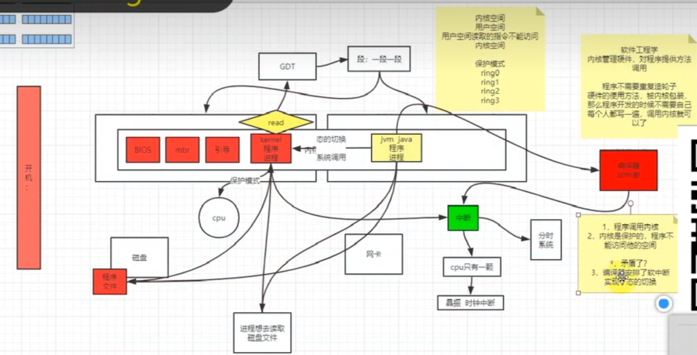
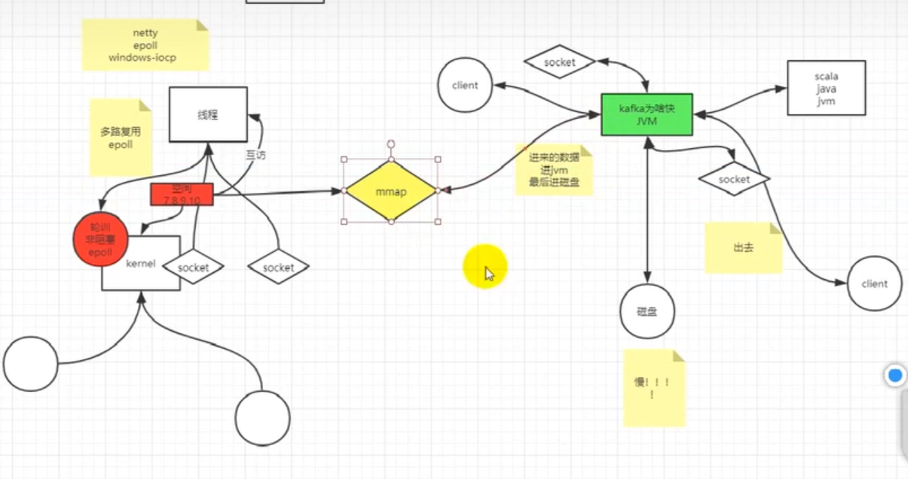

#### 奇安信二面经

奇安信（聊一下项目，聊一下困难点，用过哪些技术。）

JAVA中有几种引用（GC四种引用，答偏了，JAVA只有按值传递） 

线程同步有几种方式（悲观乐观 + wait-Notify） 

Linux杀死一个进程的过程（没了解很深） 

栈和队列可以互相实现吗（可以），手写队列实现栈  

ip库两个结构 

  A 1.2.3.4-5.6.7.8 ：北京市 

  B 1.2.3.* ：南京市 

  有10w条如上[数据]()，设计一个[数据]()结构，可以给定一个ip快速查到地址 

> 参考：https://blog.csdn.net/ChinaDragon10/article/details/109447960
>
> 现在这个问题应该很简单了。如果 IP 区间与归属地的对应关系不经常更新，我们可以先预处理这 12 万条数据，让其按照起始 IP 从小到大排序。如何来排序呢？我们知道，IP 地址可以转化为 32 位的整型数。所以，我们可以将起始地址，按照对应的整型值的大小关系，从小到大进行排序。
>
> 然后，这个问题就可以转化为我刚讲的第四种变形问题“在**有序数组**中，查找最后一个小于等于某个给定值的元素”了。
>
> 当我们要查询某个 IP 归属地时，我们可以先通过**二分查找**，找到最后一个起始 IP **小于等于这个 IP** 的 IP 区间，然后，**检查**这个 IP 是否在这个 IP 区间内，如果在，我们就取出对应的归属地显示；如果不在，就返回未查找到。
>
> 一直在问安全方向

规划：首先，熟悉一些知识理论，然后第二点最重要的是将自己的代码能力提升，最后，能够慢慢地去学习架构方面的东西，让自己成为架构师。

#### 深信服二面（python）

（1）

缓冲的作用是协调上下层应用之间的性能差异。

缓存提高查询性能

（2）哈夫曼编码

哈夫曼编码能节省很多的空间，因为每一个字符出现的频率不是一致的；是一种用于**无损数据压缩**的编码算法

https://blog.csdn.net/qq_19887221/article/details/125322754

> 从本质上讲，哈夫曼编码是将最宝贵的资源（最短的编码）给出现概率最多的数据。

1. **哈夫曼树和编码都不唯一！只有树的WPL(带权路径长度)才是唯一的！**
2. **编码互不为前缀**（一个编码不是另一个编码的开头）。

 （3） yiled 是什么，与return各自什么时候用 

yield：

1、是暂停函数

2、返回值后继续执行函数体内代码,

3、返回的是一个迭代器(yield本身是生成器-生成器是用来生成迭代器的)；

精髓理解：返回后函数执行暂停

return：

1、是结束函数；

2、返回值后不再执行函数体内代码.

3、返回的是正常可迭代对象(list,set,dict等具有实际内存地址的存储对象)

#### linux内核

底层知识基本不变（内核，设计模式24种）

> 系统调用sendfile mmap select epoll
>
> linux一切皆文件描述符

内核

> 电脑开机流程：
>
> CPU，内存，磁盘
>
> 首先开机，从磁盘加载BIOS，MBR，引导程序=>磁盘分区=>程序文件(kernel程序，会维护一个GDT全局文件描述符表：一段段，可以将内存空间分为用户态，内核态：用户空间的指指令是不能访问内核空间的：保护模式，此时提供了系统调用，就是程序可以通过系统调用来访问我们的内核空间)
>
> 我们的JVM进程就是运行在用户态，当我们写程序需要用到系统调用时，我们使用系统调用就会从用户态切换到内核态，但是有个问题就是我们之前不是说了内核的保护模式，此时是无法进行系统调用的，怎么解决？通过编译器里面加个80软中断，我们这样子就可以从用户态切换到内核态，再执行对应的系统调用了。

> 80 软中断
>
> IO，设备中断
>
> 1）中断？
>
> 计算机运行过程中，出现某些意外情况需CPU干预时（也就是中断），此时CPU暂时停止当前程序的执行转而执行处理中断程序，等待中断程序处理完了之后，再执行刚才暂停的程序。
>
> 2）中断流程：
>
> 1.CPU将工作模式转化为中断模式
>
> 2.保存现场，CPU 环境的保存
>
> 3.分析中断原因，跳到中断起始地址处理中断程序
>
> 4.处理完之后，返回到原来模式
>
> 5.恢复现场继续执行原来的程序
>
> 3）如果中断处理程序过长，会导致原本CPU执行的任务一直被阻塞，甚至无法处理新的中断。所以为了解决这个问题，Liunx采用软中断和硬中断结合的方式。
> 硬中断：处理中断的上部分不得不处理的部分，要求是立即执行。
> 软中断：处理中断的下部分，要求是延时处理。
> 比如当网卡接收数据之后，向CPU发送中断信号，CPU对其进行相应硬中断，把数据读取到相应的寄存器或者缓冲区，表示数据准备就绪，然后发出软中断信号，CPU内核线程读取数据，再对其进行解析处理。
>
>  4）在软中断和硬中断之间的区别是什么？
>
> 硬中断是由**外设**引起的因此具有**随机性**和突发性；
> 软中断是执行**中断指令**产生的，无面外部施加中断请求信号，因此中断的发生不是随机的而是**由程序安排好**的。

NIO和内核

